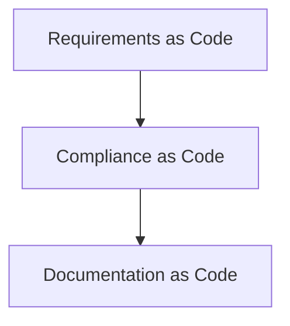

# Mermaid Designer Bot

## Overview

The Mermaid Designer Bot is a specialised AI agent that automatically creates professional Mermaid diagrams for the Architecture as Code book when GitHub issues are labelled appropriately.

## How to Use

### 1. Create an Issue

Create a GitHub issue describing the diagram you need. Be specific about:
- The purpose of the diagram
- What concepts/components should be included
- The preferred diagram type (flowchart, sequence, class, C4, etc.)
- Which chapter it relates to
- Any specific styling requirements

### 2. Add the Label

Add one of these labels to trigger the bot:
- `mermaid`
- `diagram`

The bot is case-insensitive, so `Mermaid` or `MERMAID` will also work.

### 3. Bot Workflow

The bot will automatically:
1. Analyse your issue description
2. Review existing diagram styles in `docs/images/`
3. Design a professional Mermaid diagram following project conventions
4. Create the `.mmd` file in `docs/images/`
5. Create a pull request with the new diagram
6. Comment on your issue with a link to the PR

### 4. Review and Merge

Review the PR, request changes if needed, and merge when satisfied.

## Example Issue

```markdown
Title: Create deployment pipeline sequence diagram

Body:
We need a sequence diagram showing the deployment pipeline flow for Chapter 5 (Automation, DevOps & CI/CD).

The diagram should show:
- Developer commits code
- Git webhook triggers CI/CD
- Build process
- Automated tests
- Deployment to staging
- Production deployment approval
- Deployment to production
- Notification to team

Please use the existing colour scheme and follow the naming convention:
diagram_05_deployment_sequence.mmd

Labels: mermaid, chapter-5
```

## Diagram Naming Conventions

The bot follows these naming patterns:
- `diagram_[chapter]_[concept].mmd` - e.g., `diagram_06_structurizr_workflow.mmd`
- `[topic]_sequence.mmd` - e.g., `deployment_sequence.mmd`
- `[architecture]_component.mmd` - e.g., `microservices_component.mmd`

## Styling

The project uses custom Mermaid styling with Kvadrat theme classes:
- `:::kv-primary` - Primary elements
- `:::kv-highlight` - Highlighted elements
- `:::kv-accent` - Accent elements
- `:::kv-pattern` - Pattern elements

Example:


## Supported Diagram Types

The bot can create:
- **Flowcharts** - Process flows and workflows
- **Sequence Diagrams** - Interaction sequences
- **Class Diagrams** - Object-oriented structures
- **State Diagrams** - State machines
- **Entity Relationship Diagrams** - Data models
- **C4 Diagrams** - Architecture context
- **Gantt Charts** - Project timelines
- **Pie Charts** - Data visualisation
- **Git Graphs** - Version control flows

## Troubleshooting

### Bot Doesn't Trigger
- Ensure the label is exactly `mermaid` or `diagram` (case-insensitive)
- Check that `CLAUDE_CODE_OAUTH_TOKEN` secret is configured
- Verify the issue is open (not closed)

### Diagram Syntax Issues
The bot validates Mermaid syntax before creating the PR. If syntax errors occur:
- Review the error message in the PR comments
- Request corrections by commenting on the issue
- The bot can iterate on the design

### Style Inconsistencies
- The bot reviews existing diagrams to match the style
- If styles don't match, reference a specific diagram in your issue
- Example: "Please follow the style of diagram_01_aac_flow.mmd"

## Technical Details

- **Workflow File**: `.github/workflows/mermaid-designer-bot.yml`
- **Trigger**: Issue labels `mermaid` or `diagram`
- **Permissions**: `contents: write`, `pull-requests: write`, `issues: write`
- **Storage**: All diagrams stored in `docs/images/`
- **Build Process**: Diagrams automatically converted to PNG during book builds

## Best Practices

1. **Be Specific** - Provide clear requirements in the issue description
2. **Reference Examples** - Point to existing diagrams you like
3. **Chapter Context** - Mention which chapter the diagram belongs to
4. **British English** - Use British spelling (e.g., "optimisation" not "optimization")
5. **Iterative Design** - Request revisions through issue comments
6. **Test Locally** - After PR merge, run `docs/build_book.sh` to verify

## Related Documentation

- [Mermaid Documentation](https://mermaid.js.org/)
- [Book Build Process](../../AGENTS.md)
- [Style Guide](../../docs/STYLE_GUIDE.md)
