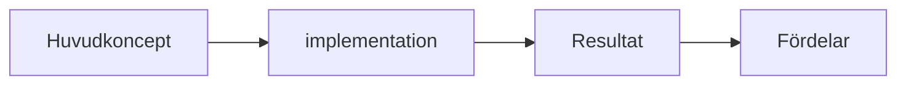

# Kravspecifikation for "architecture as code"

## Overview

This document defines the comprehensive kraven for Contentset in boken "Architecture as Code" - a technical bok as täcker Architecture as Code from Fundamental principles to avancerad implementation.

## 1. Target Audience (Target Audience)

### Primär målgrupp
- **system architects** (5-15 års erfarenhet): Behöver fordjupad forståelse for how traditionella arkitekturprinciper appliceras in koddriven miljö
- **DevOps Engineers** (3-10 års erfarenhet): Vill expandera from infraStructureautomation to helhetslösningar
- **Developers** (3-12 års erfarenhet): Söker forståelse for arkitektoniska beslut and kodStructure at system level
- **Project Managers** (5-15 års erfarenhet): Behöver inblick in tekniska aspekter to leda transformation
- **IT Managers** (8-20 års erfarenhet): Vill forstå strategiska Benefits and organizational implikationer

### Sekunwhere målgrupp
- **Tekniska konsulter** which implementerar lösningar åt kunder
- **Studenter** within datavetenskap and systemutveckling (avancerad nivå)
- **Produktägare** which arbetar with tekniska produkter
- **Säkerhetsspecialister** which behöver forstå arkitekturautomation

### Förkunskapskrav
- Fundamental forståelse for molnplattformar (AWS, Azure, GCP)
- Erfarenhet of version control (Git)
- Kunskap about minst A programmeringsspråk
- Forståelse for CI/CD-concepts
- Fundamental Unix/Linux-kunskaper

## 2. Centrala Teman (Core Themes)

### Huvudtema: Architecture as Code
**definition**: Praktiken to describe, versionhantera and automatisera entire system architecture through maskinläsbar code, which encompasses infrastructure, applikationer, data flows, security policies and organizational processes.

### Underteman (23 chapters)

#### A. Fundamental Concepts (chapters 1-3)
- **Teoretisk grund**: Evolution from manuella processes to koddriven architecture
- **Principiell forståelse**: Declarative vs. imperative code, immutabilitet, idempotens
- **version control**: KodStructure, branching-strategier, merge-processes

#### B. Praktisk implementation (chapters 4-8)
- **automation**: CI/CD-pipelines, deployment-strategier
- **Molnarkitektur**: Multi-cloud, hybrid cloud, cloud-native patterns
- **Säkerhet**: Security as Code, compliance automation
- **Observabilitet**: Monitoring as Code, logging, tracing
- **Prestanda**: scalability, optimering, resursstyrning

#### C. Organisatorisk Transformation (chapters 9-13)
- **Digitalisering**: Transformationsstrategier, change management
- **TeamStructureer**: DevOps-kultur, cross-funktionella team
- **Projektledning**: Agile metoder for infrastructure, risk management
- **Innovation**: Experimentell utveckling, prototyping
- **Produktutveckling**: Architecture as Code as enabler for produktteam

#### D. Styrning and Optimering (chapters 14-17)
- **Compliance**: Regelefterlevnad, auditspår, policy as code
- **Kostnadsoptimering**: FinOps, resursplanering, cost allocation
- **testing**: InfraStructuretester, chaos engineering
- **Migration**: From legacy systems, transformationsplaner

#### E. Fördjupning and Framtid (chapters 18-23)
- **Framtidstrends**: Emerging technologies, AI/ML integration
- **Best Practices**: Lärda läxor, antipatterns, maturity models
- **Fallstudier**: Verkliga implementationer, svenska case studies
- **Conclusion**: Summary, Recommendations
- **Referensmaterial**: Glossary, forfattarpresentationer

## 3. Structure (Structure)

### Bokens övergripande struktur
**Format**: 23 chapters + appendix (Glossary, About the Authors)
**Omfattning**: ~200-300 sidor total
**Språk**: Svenska (with engelska termer in parentes vid forsta användning)

### Chapter Structure (Standardmall)
each chapters följer a konsistent Structure at 8-12 sidor:

#### 3.1 Kapiteluppbyggnad
1. **Huvudrubrik (H1)** - Kapitelnamn
2. **Ingresstext** (150-200 ord) - Kapitelets Purpose and Contents
3. **Huvuddiagram** - Mermaid diagrams as illustrerar kapitelets huvudkoncept
4. **Teoretisk grund** (800-1200 ord) - Konceptuell forklaring
5. **Practical implementation** (1200-1800 ord) - Konkreta Example and kodlösningar
6. **Svenska compliance-aspekter** (400-600 ord) - Specifika krav and Recommendations
7. **Tools and technologies** (600-800 ord) - Specifika lösningar and alternativ
8. **Best practices** (400-600 ord) - Recommendations and antipatterns
9. **Summary** (200-300 ord) - Nyckelpoäng and take-aways
10. **Sources and References** - Akademiska and industriella Sources

#### 3.2 Tvärgående struktur
- **Progressiv komplexitet**: each chapters builds on tidigare kunskap
- **Återkommande Example**: same fiktiva organisation används through entire boken
- **Cross-References**: explicitly koppling mellan relaterade chapters
- **Praktisk orientering**: Minst 60% practical Contents vs 40% teori

### Sektionsindelning
#### Del in: Grund (chapters 1-3)
Introduktion to Architecture as Code, Fundamental principles and kodStructure

#### Del II: implementation (chapters 4-8) 
Practical implementation of automation, molnarkitektur and säkerhet

#### Del III: Organisation (chapters 9-13)
Organizational transformation and teamStructureer

#### Del IV: Styrning (chapters 14-17)
Compliance, kostnadsoptimering and migration

#### Del V: Fördjupning (chapters 18-23)
Framtidstrender, best practices and Summary

## 4. technical deep (Technical Depth)

### Djupnivåer per kapiteltyp

#### Fundamental chapters (1-3): Konceptuell nivå
- **Teori**: 70% - Forklaring of concepts and principles
- **Praktik**: 30% - Enkla Example and demonstrationer
- **KodExample**: Pseudo-code and enkla script
- **Target Audience**: all läsare ska kunna följa

#### Implementationskapitel (4-8): Interwithiär nivå
- **Teori**: 40% - Fordjupade tekniska concepts
- **Praktik**: 60% - Konkreta implementationer
- **KodExample**: Fullständiga script and konfigurationer
- **Verktygsspecifikt**: Terraform, Ansible, CloudFormation, Kubernetes manifests

#### Organisationskapitel (9-13): Strategisk nivå
- **Teori**: 60% - Organisationsteori and change management
- **Praktik**: 40% - Implementationsplaner and frameworks
- **KodExample**: Policy as Code, governance frameworks
- **Target Audience**: Ledning and senior tekniker

#### Styrningskapitel (14-17): Avancerad nivå
- **Teori**: 30% - Regelverk and compliance frameworks
- **Praktik**: 70% - Konkreta implementationer of compliance
- **KodExample**: Policy engines, audit scripts, test frameworks
- **Svenska specifika krav**: GDPR, finansiell reglering, offentlig sektor

#### Fördjupningskapitel (18-23): Expert nivå
- **Teori**: 50% - Cutting-edge concepts and framtidstrender
- **Praktik**: 50% - Experimentella implementationer
- **KodExample**: advanced patterns, AI/ML integration
- **Research-orienterat**: Akademiska References and emerging technologies

### Tekniska krav per chapters

#### Kodexempel
- **Format**: Markdown code blocks with syntax highlighting
- **Språk**: Primärt YAML, HCL (Terraform), Python, Bash
- **Längd**: 10-50 rader per Example
- **Kommentarer**: Svensk kommentering of code
- **Testbarhet**: all Example ska vara körbara with minimal setup

#### Arkitekturdiagram
- **Verktyg**: Mermaid for konsistens and version control
- **Stil**: Enhetlig färgpalett and symboler
- **Komplexitet**: Maximalt 7 components per diagram
- **Typer**: Flödesdiagram, sekvensdiagram, arkitekturdiagram

## 5. Example and Diagram (Examples and Diagrams)

### Genomgående case study
**"Svenska Teknik AB"** - a fiktiv withelstörr technical organisation as används as huvudExample through entire boken:
- **Storlek**: 200 anställda, 15 Developers
- **operations**: SaaS-plattform for svensk marknad
- **Utmaning**: Migration from on-premise to cloud-native
- **Compliance**: GDPR, svenska bokforingslagen, finansiell reglering

### Diagramtyper and riktlinjer

#### 5.1 Mermaid diagrams (Primär visualisering)
**Technical implementation**:
- **Filformat**: .mmd source files in docs/images/
- **Konvertering**: Automatisk to PNG via CI/CD
- **Versionshantering**: Källfiler under version control

**Designriktlinjer**:
- **Layout**: Horisontell orientering (graph LR) which standard
- **Komplexitet**: 3-7 element per diagram
- **Färger**: Konsistent färgpalett according to brand guidelines
- **Text**: Svenska beskrivningar, engelska termer in parentes

**Diagramtyper**:


#### 5.2 Kodexempel
**Structure per Example**:
1. **Problemställning** (2-3 rader text)
2. **Lösning** (kodblock with syntax highlighting)
3. **Forklaring** (4-6 rader kommentar)
4. **Variation/alternativ** (vid behov)

**Example - Terraform infrastructure**:
```hcl
# Skapa a skalbar webbapplikation in Azure
resource "azurerm_app_service_plan" "svenska_teknik" {
  name                = "svenska-teknik-plan"
  location            = "West Europe"
  resource_group_name = azurerm_resource_group.main.name
  
  sku {
    tier = "Standard"
    size = "S1"
  }
  
  tags = {
    miljö = "produktion"
    kostnadsställe = "utveckling"
  }
}
```

#### 5.3 Praktiska scenarios
**Per chapters minst 2-3 scenarios**:
- **Scenario 1**: Fundamental implementation
- **Scenario 2**: Mellankomplicerad lösning with edge cases
- **Scenario 3**: Avancerad implementation with svenska specifika krav

### Illustrationer and visuella hjälpwithel

#### 5.4 Screenshots and UI-example
- **Verktyg**: Azure Portal, AWS Console, kubectl output
- **Format**: PNG with konsistent storlek and format
- **Anonymisering**: all känsliga data maskas ut
- **Språk**: Svenska interface when möjligt

#### 5.5 Tabor and matriser
**Formatering**:
```markdown
| Verktyg | Användningsområde | Komplexitet | Svenska support |
|---------|-------------------|--------------|-----------------|
| Terraform | Infrastructure | Medel | documentation |
| Ansible | Konfiguration | Låg | Community |
```

## 6. Språk and Stil (Language and Style)

### Språkpolicy

#### 6.1 Primärspråk: Svenska
- **Target Audience**: Svenska IT-professionella
- **Terminologi**: Svenska termer with engelska in parentes vid forsta användning
- **Example**: "Architecture as Code (engelska: Architecture as Code)"
- **Konsistens**: same svenska term används konsekvent through entire boken

#### 6.2 Engelska termer
**When engelska används**:
- Etablerade branschtermer utan svenska motsvarighet
- API-namn and tekniska specifikationer
- Kodkommentarer and konfigurationsfiler
- Citat from engelska Sources

**Format for introduktion of engelska termer**:
"Kontinuerlig integration (Continuous Integration, CI) enables..."

### Stilriktlinjer

#### 6.3 Ton and stil
- **Professionell men togänglig**: technical precision utan to vara överdrivet akademisk
- **Inkluderande**: Undviker jargong as exkluderar junior Developers
- **Praktisk orientering**: Fokus at toämpning snarare än teoretisk abstraktion
- **Svenska perspektiv**: Specifika References to svenska regulatoriska krav and branschpraxis

#### 6.4 Textstruktur
**StyckeStructure**:
- **Längd**: 3-6 meningar per stycke
- **a huvudidé per stycke**
- **Logisk progression**: From allmänt to specifikt

**RubrikStructure**:
- **H1**: Kapiteltitel
- **H2**: Huvudsektioner (3-5 per chapters)
- **H3**: Undersektioner (2-4 per huvudsektion)
- **H4**: Endast vid behov for specifika punkter

#### 6.5 Kodreferenser in text
**Format**: `kodstycken` with backticks for inline code
**Blockcitat**: 
```
Längre kodexempel in egna block
med syntax highlighting
```

#### 6.6 Terminologikonsistens

**Fastställda svenska termer**:
- Architecture as Code → Architecture as Code
- Molnplattform → Cloud platform
- Kodlager → Code repository
- Deployment → Driftsättning
- Pipeline → Automatiseringskedja
- Monitoring → Övervakning
- Compliance → Regelefterlevnad

### Kvalitetskriterier

#### 6.7 Läsbarhet
- **Flesch-Kincaid**: Målnivå svenska gymnasiet/högskola
- **Meningslängd**: Throughsnitt 15-20 ord per mening
- **Passiv form**: Maximalt 15% of meningarna
- **Jargong**: Forklaras vid forsta användning

#### 6.8 technical precision
- **Faktakontroll**: all tekniska påståenden verifieras
- **versions**: Specificerade versions for all tools and technologies
- **testing**: all kodExample testas innan publicering
- **References**: Akademiska and industriella Sources for all påståenden

#### 6.9 Svenska språknormer
- **Stavning**: Svenska akademiens Glossary (SAOL)
- **Grammatik**: Svenska skrivregler according to Språkrådet
- **Interpunktion**: Standard svenska rules
- **Språkgranskning**: Professionell korrekturläsning fore publicering

### Specifika stilval

#### 6.10 Personligt pronomen
- **Total**: "Du" (not "ni" or "man")
- **Forfattare**: "Vi" when the refererar to forfattarnas åsikter
- **Läsare**: "Du kommer to lära dig..." (not "man can lära itself...")

#### 6.11 Aktiv vs passiv form
**Foredra aktiv form**:
- ✅ "Terraform creates infraStructureen automatically"
- ❌ "InfraStructureen are created automatically of Terraform"

**Passiv form acceptabel for**:
- Processbeskrivningar where aktören is oviktig
- Formella definitioner
- Description of etablerade standarder

## Ytterligare Kvalitetskriterier

### technical korrekthet
- all kodExample ska vara syntaktiskt korrekta
- Versionsnummer be specified for all verktyg
- Best practices uppdateras according to senaste branschstandarder
- Svenska compliance-krav verifieras mot aktuell lagstiftning

### Pedagogisk progression
- each chapters builds on tidigare kunskaper
- Svårighetsgraden ökar gradually
- Återkommande concepts forstärks through repetition
- Praktiska övningar kopplar to tidigare teoretiska parts

### Branschrelevans
- Fokus at tools and metoder as används in svenska organisationer
- Fallstudier from svenska foretag and myndigheter
- Hänsyn to svenska regulatoriska krav (GDPR, Säkerhetsskyddslagen)
- Integration with svenska molnleverantörer and konsulttjänster

### Tillgänglighet and inkludering
- Alternativ text for all diagram and bilder
- Färgblind-vänlig färgpalett in diagram
- Tydlig Structure for skärmläsare
- Undvikande of kulturspecifika References as can exkludera

---

*This kravdokument ska användas as grund for all forfattningsaktiviteter and regelbundet uppdateras baserat at feedback from Target Audienceen and changes in tekniklandskapet.*