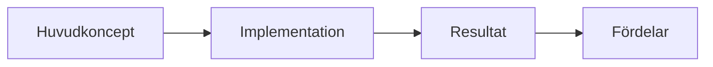

# Kravspecifikation för "Arkitektur som Kod"

## Översikt

Detta dokument definierar de omfattande kraven för innehållet i boken "Arkitektur som Kod" - en teknisk bok som täcker Architecture as Code från grundläggande principer till avancerad implementation, med Infrastructure as Code som praktiskt exempel.

## 1. Målgrupp (Target Audience)

### Primär målgrupp
- **Systemarkitekter** (5-15 års erfarenhet): Behöver fördjupad förståelse för hur traditionella arkitekturprinciper appliceras i koddriven miljö
- **DevOps-ingenjörer** (3-10 års erfarenhet): Vill expandera från infrastrukturautomation till helhetslösningar
- **Utvecklare** (3-12 års erfarenhet): Söker förståelse för arkitektoniska beslut och kodstruktur på systemnivå
- **Projektledare** (5-15 års erfarenhet): Behöver inblick i tekniska aspekter för att leda transformation
- **IT-chefer** (8-20 års erfarenhet): Vill förstå strategiska fördelar och organisatoriska implikationer

### Sekundär målgrupp
- **Tekniska konsulter** som implementerar lösningar åt kunder
- **Studenter** inom datavetenskap och systemutveckling (avancerad nivå)
- **Produktägare** som arbetar med tekniska produkter
- **Säkerhetsspecialister** som behöver förstå arkitekturautomation

### Förkunskapskrav
- Grundläggande förståelse för molnplattformar (AWS, Azure, GCP)
- Erfarenhet av versionskontroll (Git)
- Kunskap om minst ett programmeringsspråk
- Förståelse för CI/CD-koncept
- Grundläggande Unix/Linux-kunskaper

## 2. Centrala Teman (Core Themes)

### Huvudtema: Architecture as Code
**Definition**: Praktiken att beskriva, versionhantera och automatisera hela systemarkitekturen genom maskinläsbar kod, vilket omfattar infrastruktur, applikationer, dataflöden, säkerhetspolicies och organisatoriska processer.

### Underteman (23 kapitel)

#### A. Grundläggande Koncept (Kapitel 1-3)
- **Teoretisk grund**: Evolution från manuella processer till koddriven arkitektur
- **Principiell förståelse**: Deklarativ vs. imperativ kod, immutabilitet, idempotens
- **Versionskontroll**: Kodstruktur, branching-strategier, merge-processer

#### B. Praktisk Implementation (Kapitel 4-8)
- **Automatisering**: CI/CD-pipelines, deployment-strategier
- **Molnarkitektur**: Multi-cloud, hybrid cloud, cloud-native patterns
- **Säkerhet**: Security as Code, compliance automation
- **Observabilitet**: Monitoring as Code, logging, tracing
- **Prestanda**: Skalbarhet, optimering, resursstyrning

#### C. Organisatorisk Transformation (Kapitel 9-13)
- **Digitalisering**: Transformationsstrategier, change management
- **Teamstrukturer**: DevOps-kultur, cross-funktionella team
- **Projektledning**: Agile metoder för infrastruktur, risk management
- **Innovation**: Experimentell utveckling, prototyping
- **Produktutveckling**: IaC som enabler för produktteam

#### D. Styrning och Optimering (Kapitel 14-17)
- **Compliance**: Regelefterlevnad, auditspår, policy as code
- **Kostnadsoptimering**: FinOps, resursplanering, cost allocation
- **Testning**: Infrastrukturtester, chaos engineering
- **Migration**: Från legacy system, transformationsplaner

#### E. Fördjupning och Framtid (Kapitel 18-23)
- **Framtidstrends**: Emerging technologies, AI/ML integration
- **Best Practices**: Lärda läxor, antipatterns, maturity models
- **Fallstudier**: Verkliga implementationer, svenska case studies
- **Slutsats**: Sammanfattning, rekommendationer
- **Referensmaterial**: Ordlista, författarpresentationer

## 3. Struktur (Structure)

### Bokens övergripande struktur
**Format**: 23 kapitel + appendix (Ordlista, Om författarna)
**Omfattning**: ~200-300 sidor total
**Språk**: Svenska (med engelska termer i parentes vid första användning)

### Kapitelstruktur (Standardmall)
Varje kapitel följer en konsistent struktur på 8-12 sidor:

#### 3.1 Kapiteluppbyggnad
1. **Huvudrubrik (H1)** - Kapitelnamn
2. **Ingresstext** (150-200 ord) - Kapitelets syfte och innehåll
3. **Huvuddiagram** - Mermaid-diagram som illustrerar kapitelets huvudkoncept
4. **Teoretisk grund** (800-1200 ord) - Konceptuell förklaring
5. **Praktisk implementation** (1200-1800 ord) - Konkreta exempel och kodlösningar
6. **Svenska compliance-aspekter** (400-600 ord) - Specifika krav och rekommendationer
7. **Verktyg och teknologier** (600-800 ord) - Specifika lösningar och alternativ
8. **Best practices** (400-600 ord) - Rekommendationer och antipatterns
9. **Sammanfattning** (200-300 ord) - Nyckelpoäng och take-aways
10. **Källor och referenser** - Akademiska och industriella källor

#### 3.2 Tvärgående struktur
- **Progressiv komplexitet**: Varje kapitel bygger på tidigare kunskap
- **Återkommande exempel**: Samma fiktiva organisation används genom hela boken
- **Cross-referenser**: Explicit koppling mellan relaterade kapitel
- **Praktisk orientering**: Minst 60% praktiskt innehåll vs 40% teori

### Sektionsindelning
#### Del I: Grund (Kapitel 1-3)
Introduktion till Architecture as Code, grundläggande principer och kodstruktur

#### Del II: Implementation (Kapitel 4-8) 
Praktisk implementation av automatisering, molnarkitektur och säkerhet

#### Del III: Organisation (Kapitel 9-13)
Organisatorisk transformation och teamstrukturer

#### Del IV: Styrning (Kapitel 14-17)
Compliance, kostnadsoptimering och migration

#### Del V: Fördjupning (Kapitel 18-23)
Framtidstrender, best practices och sammanfattning

## 4. Teknisk Djup (Technical Depth)

### Djupnivåer per kapiteltyp

#### Grundläggande kapitel (1-3): Konceptuell nivå
- **Teori**: 70% - Förklaring av koncept och principer
- **Praktik**: 30% - Enkla exempel och demonstrationer
- **Kodexempel**: Pseudo-kod och enkla script
- **Målgrupp**: Alla läsare ska kunna följa

#### Implementationskapitel (4-8): Intermediär nivå
- **Teori**: 40% - Fördjupade tekniska koncept
- **Praktik**: 60% - Konkreta implementationer
- **Kodexempel**: Fullständiga script och konfigurationer
- **Verktygsspecifikt**: Terraform, Ansible, CloudFormation, Kubernetes manifests

#### Organisationskapitel (9-13): Strategisk nivå
- **Teori**: 60% - Organisationsteori och change management
- **Praktik**: 40% - Implementationsplaner och frameworks
- **Kodexempel**: Policy as Code, governance frameworks
- **Målgrupp**: Ledning och senior tekniker

#### Styrningskapitel (14-17): Avancerad nivå
- **Teori**: 30% - Regelverk och compliance frameworks
- **Praktik**: 70% - Konkreta implementationer av compliance
- **Kodexempel**: Policy engines, audit scripts, test frameworks
- **Svenska specifika krav**: GDPR, finansiell reglering, offentlig sektor

#### Fördjupningskapitel (18-23): Expert nivå
- **Teori**: 50% - Cutting-edge koncept och framtidstrender
- **Praktik**: 50% - Experimentella implementationer
- **Kodexempel**: Avancerade patterns, AI/ML integration
- **Research-orienterat**: Akademiska referenser och emerging technologies

### Tekniska krav per kapitel

#### Kodexempel
- **Format**: Markdown code blocks med syntax highlighting
- **Språk**: Primärt YAML, HCL (Terraform), Python, Bash
- **Längd**: 10-50 rader per exempel
- **Kommentarer**: Svensk kommentering av kod
- **Testbarhet**: Alla exempel ska vara körbara med minimal setup

#### Arkitekturdiagram
- **Verktyg**: Mermaid för konsistens och versionskontroll
- **Stil**: Enhetlig färgpalett och symboler
- **Komplexitet**: Maximalt 7 komponenter per diagram
- **Typer**: Flödesdiagram, sekvensdiagram, arkitekturdiagram

## 5. Exempel och Diagram (Examples and Diagrams)

### Genomgående case study
**"Svenska Teknik AB"** - En fiktiv medelstörr teknisk organisation som används som huvudexempel genom hela boken:
- **Storlek**: 200 anställda, 15 utvecklare
- **Verksamhet**: SaaS-plattform för svensk marknad
- **Utmaning**: Migration från on-premise till cloud-native
- **Compliance**: GDPR, svenska bokföringslagen, finansiell reglering

### Diagramtyper och riktlinjer

#### 5.1 Mermaid-diagram (Primär visualisering)
**Teknisk implementation**:
- **Filformat**: .mmd source files i docs/images/
- **Konvertering**: Automatisk till PNG via CI/CD
- **Versionshantering**: Källfiler under version control

**Designriktlinjer**:
- **Layout**: Horisontell orientering (graph LR) som standard
- **Komplexitet**: 3-7 element per diagram
- **Färger**: Konsistent färgpalett enligt brand guidelines
- **Text**: Svenska beskrivningar, engelska termer i parentes

**Diagramtyper**:


#### 5.2 Kodexempel
**Struktur per exempel**:
1. **Problemställning** (2-3 rader text)
2. **Lösning** (kodblock med syntax highlighting)
3. **Förklaring** (4-6 rader kommentar)
4. **Variation/alternativ** (vid behov)

**Exempel - Terraform infrastructure**:
```hcl
# Skapa en skalbar webbapplikation i Azure
resource "azurerm_app_service_plan" "svenska_teknik" {
  name                = "svenska-teknik-plan"
  location            = "West Europe"
  resource_group_name = azurerm_resource_group.main.name
  
  sku {
    tier = "Standard"
    size = "S1"
  }
  
  tags = {
    miljö = "produktion"
    kostnadsställe = "utveckling"
  }
}
```

#### 5.3 Praktiska scenarios
**Per kapitel minst 2-3 scenarios**:
- **Scenario 1**: Grundläggande implementation
- **Scenario 2**: Mellankomplicerad lösning med edge cases
- **Scenario 3**: Avancerad implementation med svenska specifika krav

### Illustrationer och visuella hjälpmedel

#### 5.4 Screenshots och UI-exempel
- **Verktyg**: Azure Portal, AWS Console, kubectl output
- **Format**: PNG med konsistent storlek och format
- **Anonymisering**: Alla känsliga data maskas ut
- **Språk**: Svenska interface när möjligt

#### 5.5 Tabeller och matriser
**Formatering**:
```markdown
| Verktyg | Användningsområde | Komplexitet | Svenska support |
|---------|-------------------|--------------|-----------------|
| Terraform | Infrastructure | Medel | Dokumentation |
| Ansible | Konfiguration | Låg | Community |
```

## 6. Språk och Stil (Language and Style)

### Språkpolicy

#### 6.1 Primärspråk: Svenska
- **Målgrupp**: Svenska IT-professionella
- **Terminologi**: Svenska termer med engelska i parentes vid första användning
- **Exempel**: "Infrastruktur som kod (Infrastructure as Code, IaC)"
- **Konsistens**: Samma svenska term används konsekvent genom hela boken

#### 6.2 Engelska termer
**När engelska används**:
- Etablerade branschtermer utan svenska motsvarighet
- API-namn och tekniska specifikationer
- Kodkommentarer och konfigurationsfiler
- Citat från engelska källor

**Format för introduktion av engelska termer**:
"Kontinuerlig integration (Continuous Integration, CI) möjliggör..."

### Stilriktlinjer

#### 6.3 Ton och stil
- **Professionell men tillgänglig**: Teknisk precision utan att vara överdrivet akademisk
- **Inkluderande**: Undviker jargong som exkluderar junior utvecklare
- **Praktisk orientering**: Fokus på tillämpning snarare än teoretisk abstraktion
- **Svenska perspektiv**: Specifika referenser till svenska regulatoriska krav och branschpraxis

#### 6.4 Textstruktur
**Styckestruktur**:
- **Längd**: 3-6 meningar per stycke
- **En huvudidé per stycke**
- **Logisk progression**: Från allmänt till specifikt

**Rubrikstruktur**:
- **H1**: Kapiteltitel
- **H2**: Huvudsektioner (3-5 per kapitel)
- **H3**: Undersektioner (2-4 per huvudsektion)
- **H4**: Endast vid behov för specifika punkter

#### 6.5 Kodreferenser i text
**Format**: `kodstycken` med backticks för inline kod
**Blockcitat**: 
```
Längre kodexempel i egna block
med syntax highlighting
```

#### 6.6 Terminologikonsistens

**Fastställda svenska termer**:
- Arkitektur som kod → Architecture as Code
- Infrastruktur som kod → Infrastructure as Code  
- Molnplattform → Cloud platform
- Kodlager → Code repository
- Deployment → Driftsättning
- Pipeline → Automatiseringskedja
- Monitoring → Övervakning
- Compliance → Regelefterlevnad

### Kvalitetskriterier

#### 6.7 Läsbarhet
- **Flesch-Kincaid**: Målnivå svenska gymnasiet/högskola
- **Meningslängd**: Genomsnitt 15-20 ord per mening
- **Passiv form**: Maximalt 15% av meningarna
- **Jargong**: Förklaras vid första användning

#### 6.8 Teknisk precision
- **Faktakontroll**: Alla tekniska påståenden verifieras
- **Versioner**: Specificerade versioner för alla verktyg och teknologier
- **Testning**: Alla kodexempel testas innan publicering
- **Referenser**: Akademiska och industriella källor för alla påståenden

#### 6.9 Svenska språknormer
- **Stavning**: Svenska akademiens ordlista (SAOL)
- **Grammatik**: Svenska skrivregler enligt Språkrådet
- **Interpunktion**: Standard svenska regler
- **Språkgranskning**: Professionell korrekturläsning före publicering

### Specifika stilval

#### 6.10 Personligt pronomen
- **Tilltal**: "Du" (inte "ni" eller "man")
- **Författare**: "Vi" när det refererar till författarnas åsikter
- **Läsare**: "Du kommer att lära dig..." (inte "man kan lära sig...")

#### 6.11 Aktiv vs passiv form
**Föredra aktiv form**:
- ✅ "Terraform skapar infrastrukturen automatiskt"
- ❌ "Infrastrukturen skapas automatiskt av Terraform"

**Passiv form acceptabel för**:
- Processbeskrivningar där aktören är oviktig
- Formella definitioner
- Beskrivning av etablerade standarder

## Ytterligare Kvalitetskriterier

### Teknisk korrekthet
- Alla kodexempel ska vara syntaktiskt korrekta
- Versionsnummer specificeras för alla verktyg
- Best practices uppdateras enligt senaste branschstandarder
- Svenska compliance-krav verifieras mot aktuell lagstiftning

### Pedagogisk progression
- Varje kapitel bygger på tidigare kunskaper
- Svårighetsgraden ökar gradvis
- Återkommande koncept förstärks genom repetition
- Praktiska övningar kopplar till tidigare teoretiska delar

### Branschrelevans
- Fokus på verktyg och metoder som används i svenska organisationer
- Fallstudier från svenska företag och myndigheter
- Hänsyn till svenska regulatoriska krav (GDPR, Säkerhetsskyddslagen)
- Integration med svenska molnleverantörer och konsulttjänster

### Tillgänglighet och inkludering
- Alternativ text för alla diagram och bilder
- Färgblind-vänlig färgpalett i diagram
- Tydlig struktur för skärmläsare
- Undvikande av kulturspecifika referenser som kan exkludera

---

*Detta kravdokument ska användas som grund för alla författningsaktiviteter och regelbundet uppdateras baserat på feedback från målgruppen och förändringar i tekniklandskapet.*