# Diagram Theme Standard

## Overview

This document defines the standardized diagram theme for the "Architecture as Code" book. All diagrams must adhere to this standard to ensure visual consistency across the publication.

## Approved Theme: Kvadrat Theme

The approved diagram theme for this publication is the **Kvadrat Theme**, which provides:

- **Consistent brand colors** aligned with Kvadrat brand guidelines
- **Professional typography** using the Inter font family
- **Accessible contrast ratios** satisfying WCAG AA standards
- **Unified visual language** across all diagram types

### Theme Configuration

- **Location**: `docs/mermaid-kvadrat-theme.json`
- **Application**: Automatically applied during the build process via `docs/build_book.sh`
- **Scope**: All Mermaid diagrams (.mmd files)

## Color Palette

### Primary Colors
- **Kvadrat Blue** (`#1E3A8A`): Primary surfaces, main elements
- **Deep Navy** (`#0F172A`): Text, labels, and connectors
- **Bright Blue** (`#2563EB`): Secondary elements and accents
- **Light Blue** (`#3B82F6`): Highlights and transitions
- **Sky Blue** (`#60A5FA`): Supporting elements

### Background Colors
- **Ice Blue** (`#E0F2FE`): Cluster backgrounds and secondary surfaces
- **Snow White** (`#F8FAFF`): Light backgrounds and cards

### Semantic Colors
- **Success Green** (`#059669`): Positive outcomes and completions
- **Warning Orange** (`#d97706`): Warnings and attention elements

## Standardized Style Classes

All diagrams should use the following predefined style classes for consistency:

### Node Style Classes

#### `kv-primary`
- **Purpose**: Flagship nodes, main concepts, critical elements
- **Fill**: Deep Blue (`#1E3A8A`)
- **Text**: White (`#F8FAFC`)
- **Border**: Navy (`#172554`), 2.5px solid
- **Use for**: Primary actions, main processes, key concepts

#### `kv-highlight`
- **Purpose**: Bright spotlight blocks for transitional steps
- **Fill**: Light Blue (`#60A5FA`)
- **Text**: Deep Navy (`#0F172A`)
- **Border**: Blue (`#1E40AF`), 2.5px solid
- **Use for**: Important transitions, highlighted states

#### `kv-accent`
- **Purpose**: Saturated action nodes for emphasis
- **Fill**: Bright Blue (`#2563EB`)
- **Text**: White (`#F8FAFC`)
- **Border**: Deep Navy (`#0F172A`), 2.5px solid
- **Use for**: Action items, emphasized processes

#### `kv-muted`
- **Purpose**: Low-emphasis states for secondary context
- **Fill**: Ice Blue (`#E0F2FE`)
- **Text**: Deep Navy (`#0F172A`)
- **Border**: Blue (`#1E40AF`), 2.5px dashed
- **Use for**: Optional paths, deprecated states, secondary information

#### `kv-pattern`
- **Purpose**: Patterned borders for color-blind accessibility
- **Fill**: Sky Blue (`#93C5FD`)
- **Text**: Deep Navy (`#0F172A`)
- **Border**: Navy (`#0F172A`), 2.5px dashed
- **Use for**: Alternative paths, special conditions

#### `kv-outline`
- **Purpose**: Hollow treatment for decision points and gateways
- **Fill**: White (`#FFFFFF`)
- **Text**: Deep Navy (`#0F172A`)
- **Border**: Deep Blue (`#1E3A8A`), 3px solid
- **Use for**: Decision nodes, gateways, conditional logic

#### `kv-elevated`
- **Purpose**: Light surfaces with drop shadows for informational callouts
- **Fill**: Snow White (`#F8FAFF`)
- **Text**: Deep Navy (`#0F172A`)
- **Border**: Blue (`#1D4ED8`), 2px solid
- **Effect**: Drop shadow
- **Use for**: Information boxes, legends, annotations

### Custom Class: Decision Nodes

For flowcharts requiring diamond-shaped decision nodes:

```mermaid
classDef kv-decision fill:#1E3A8A,stroke:#0F172A,color:#F8FAFC,stroke-width:3px
```

## Usage Guidelines

### 1. Graph and Flowchart Diagrams

All graph/flowchart nodes should use style classes:


### 2. Sequence Diagrams

Sequence diagrams automatically inherit the theme. Use emojis for visual clarity:

```mermaid
sequenceDiagram
    participant Dev as 👩‍💻<br/>Developer
    participant CI as ⚙️<br/>CI/CD
    Dev->>CI: Push code
```



### 3. Mindmap Diagrams

Mindmaps automatically apply hierarchical coloring based on the theme. No manual classes needed.

### 4. Class Diagrams, Gantt Charts, and Quadrant Charts

These diagram types automatically inherit theme colors. Manual styling not required.

## Diagram Type Guidelines

### Supported Diagram Types

1. **Flowcharts** (`flowchart TD/LR/etc.`) - Use kv- classes
2. **Graphs** (`graph TD/LR/etc.`) - Use kv- classes
3. **Sequence Diagrams** (`sequenceDiagram`) - Theme auto-applied
4. **Mindmaps** (`mindmap`) - Theme auto-applied
5. **Gantt Charts** (`gantt`) - Theme auto-applied
6. **Class Diagrams** (`classDiagram`) - Theme auto-applied
7. **Quadrant Charts** (`quadrantChart`) - Theme auto-applied

### Best Practices

1. **Always use predefined kv- classes** instead of custom styling
2. **Use emojis sparingly** for visual context in sequence diagrams
3. **Organize with subgraphs** for logical grouping of related elements
4. **Consistent node naming**: Use descriptive labels
5. **Accessibility**: Combine color and patterns (use `kv-pattern` for critical paths)

## Diagram Inventory

### Current Status (as of 2025-10-14)
- **Total diagrams**: 72 (100% themed)
- **Diagrams with inline kv- classes**: 51
- **Diagrams with class statement**: 1
- **Auto-themed diagrams**: 20

### By Diagram Type
- **Graph**: 35 diagrams (all use kv- classes)
- **Flowchart**: 4 diagrams (all use kv- classes)
- **Mindmap**: 12 diagrams (auto-themed)
- **Complex flowcharts**: 13 diagrams (all use kv- classes)
- **Sequence**: 1 diagram (auto-themed)
- **Gantt**: 1 diagram (auto-themed)
- **Quadrant**: 1 diagram (auto-themed)
- **Class**: 1 diagram (auto-themed)
- **Requirement**: 1 diagram (auto-themed)
- **Journey**: 1 diagram (auto-themed)
- **GitGraph**: 1 diagram (auto-themed)
- **Pie**: 1 diagram (auto-themed)

**Note**: All 72 diagrams in the book now follow the Kvadrat theme standard. For a complete inventory with individual file listings, see `DIAGRAM_INVENTORY.md`.

## Maintenance and Future Updates

### Adding New Diagrams

When creating new diagrams:

1. **Choose the appropriate diagram type** based on content
2. **Apply kv- style classes** to all nodes in graph/flowchart diagrams
3. **Use the color palette** defined in this document
4. **Test accessibility** by viewing in grayscale
5. **Follow naming conventions**: `diagram_XX_description.mmd`

### Updating the Theme

To update the theme centrally:

1. Edit `docs/mermaid-kvadrat-theme.json`
2. Update color values in `themeVariables`
3. Update CSS classes in `themeCSS` section
4. Test with representative diagrams
5. Update this documentation

### Build Process

The theme is automatically applied during the build process:

1. **PNG Generation**: `docs/build_book.sh` converts `.mmd` files to PNG using the Kvadrat theme
2. **Theme Injection**: The `mermaid-kvadrat-theme.json` file is passed to mermaid-cli via the `-c` flag
3. **Consistent Output**: All diagrams render with the same visual style

## Reference Files

- **Theme Configuration**: `docs/mermaid-kvadrat-theme.json`
- **Build Script**: `docs/build_book.sh`
- **Visual Elements Guide**: `VISUAL_ELEMENTS_GUIDE.md`
- **Brand Guidelines**: `BRAND_GUIDELINES.md`
- **Pandoc Config**: `docs/pandoc.yaml`

## Accessibility Standards

All diagrams meet the following accessibility requirements:

- **Color Contrast**: Minimum 4.5:1 ratio for text (WCAG AA)
- **Pattern Support**: Alternative patterns for color-blind users (`kv-pattern` class)
- **Grayscale Compatibility**: All diagrams remain legible in grayscale
- **Print Quality**: Optimized for both digital and print formats

## Examples

### Example 1: Simple Process Flow


### Example 2: Decision Tree


### Example 3: Multi-tier Architecture


## Compliance Checklist

Before committing new or updated diagrams:

- [ ] Diagram uses appropriate type (graph, flowchart, sequence, etc.)
- [ ] All nodes in graph/flowchart use kv- style classes
- [ ] Colors match the approved Kvadrat palette
- [ ] Diagram is legible in grayscale
- [ ] Labels are clear and descriptive
- [ ] File naming follows convention: `diagram_XX_description.mmd`
- [ ] Diagram serves a clear purpose in the book

## Version History

- **v1.0** (2025-10-14): Complete standardization of diagram theme
  - Documented Kvadrat theme as official standard
  - Inventoried all 72 diagrams
  - Updated 13 critical diagrams with kv- theme classes
  - Achieved 100% theme compliance across all diagrams
  - Created comprehensive inventory in DIAGRAM_INVENTORY.md
  - Established style class guidelines and best practices

---

**Note**: This is a living document. All contributors should reference this standard when creating or modifying diagrams. For questions or suggestions, please open an issue in the repository.
