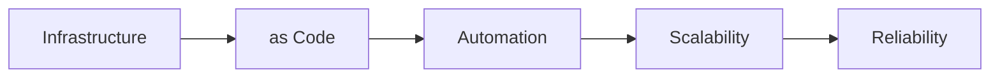

# Arkitektur som kod - Bokprojekt

En omfattande bok om Architecture as Code på svenska, med Infrastructure as Code som praktiskt exempel.

## 📚 Om boken

Denna bok täcker Architecture as Code från grundläggande principer till avancerad implementation, med fokus på praktisk tillämpning inom svenska organisationer. Infrastructure as Code behandlas som ett viktigt praktiskt exempel inom den bredare Architecture as Code-ramen.

### Målgrupp
- Systemarkitekter
- DevOps-ingenjörer  
- Utvecklare
- Projektledare
- IT-chefer

### Innehåll
23 kapitel som täcker:
- Grundläggande Architecture as Code-principer
- Infrastructure as Code som praktiskt exempel
- Molnarkitektur som kod
- Säkerhet och compliance
- CI/CD och automatisering
- Organisatorisk transformation
- Praktiska fallstudier

## 🛠️ Teknisk implementation

### Struktur
```
docs/                    # Bokens innehåll
├── *.md                # Markdown-kapitel (01_inledning.md, 02_kapitel1.md, osv)
├── images/             # Mermaid-diagram
│   └── *.mmd          # Mermaid källfiler
├── build_book.sh      # Lokal byggscript
└── arkitektur_som_kod.pdf  # Genererad bok

.github/workflows/      # CI/CD automation
└── build-book.yml     # GitHub Actions för automatisk bokbygge
```

### Automatisk byggprocess

Boken byggs automatiskt via GitHub Actions när:
- Markdown-filer ändras i `docs/` mappen
- Mermaid-diagram uppdateras i `docs/images/`
- CI/CD konfiguration modifieras

#### Byggprocessen:
1. **Mermaid → PNG**: Konverterar diagram till bilder
2. **Pandoc**: Genererar PDF/EPUB/DOCX med konfigurerad Pandoc-yaml
3. **Artifact**: Sparar PDF för nedladdning
4. **Release**: Skapar automatisk release på main branch

### Lokalt byggande

För att bygga boken lokalt:

```bash
# Krav: pandoc, texlive-xetex, mermaid-cli
cd docs
chmod +x build_book.sh
./build_book.sh

# För att generera alla format (PDF, EPUB, DOCX):
./build_book.sh --all-formats
```

#### Pandoc-konfiguration

Projektet använder en dedikerad Pandoc-konfigurationsfil (`docs/pandoc.yaml`) som säkerställer:

- **Kapitel på nya sidor**: `top-level-division: chapter` gör att varje H1-rubrik (kapitel) börjar på en ny sida
- **Enhetlig formatering**: Samma inställningar för alla utdataformat (PDF, EPUB, DOCX)
- **Svensk språkstöd**: Rätt språkinställningar för svenska texten
- **Automatisk innehållsförteckning**: Med 3 nivåers djup
- **Kapitelinumrering**: Automatisk numrering av alla kapitel

Konfigurationen stöder:
- **PDF**: Via XeLaTeX med Eisvogel-template för professionell layout
- **EPUB**: Med kapitelindelning på H1-nivå för e-läsare
- **DOCX**: För redigering i Microsoft Word eller kompatibla program

## 📊 Diagram och illustrationer

Alla diagram skapas med Mermaid och följer dessa riktlinjer:
- Maximalt 5 element per diagram
- Horisontell orientering (LR)
- Konverteras automatiskt till PNG i CI/CD

Exempel:


## 🔄 Bidrag och uppdateringar

### Workflow för ändringar:
1. Skapa branch för ändringar
2. Modifiera markdown-filer i `docs/`
3. Commit och push
4. GitHub Actions bygger automatiskt PDF
5. Merge till main → automatisk release

### Kapitelstruktur:
Varje kapitel följer samma struktur:
- H1 huvudrubrik
- Diagram med beskrivning
- Inledande text (500 tecken)
- Fördjupande sektioner
- Källor

## 🏗️ CI/CD Pipeline

GitHub Actions workflow (`build-book.yml`) hanterar:
- **Triggers**: Push/PR på markdown-filer
- **Dependencies**: Pandoc, TeXLive, Mermaid CLI
- **Build**: Konverterar diagram + genererar PDF
- **Artifacts**: Sparar PDF för nedladdning
- **Releases**: Automatiska versioner på main branch

### Status badges:


## 📖 Kapitellista

1. Inledning till arkitektur som kod
2. Grundläggande principer för Architecture as Code
3. Versionhantering och kodstruktur
4. Automatisering och CI/CD-pipelines
5. Molnarkitektur som kod
6. Säkerhet i Infrastructure as Code
7. Monitering och observabilitet
8. Skalbarhet och prestanda
9. Digitalisering genom kodbaserad infrastruktur
10. Organisatorisk förändring och teamstrukturer
11. Projektledning för IaC-initiativ
12. Innovation genom infrastrukturtransformation
13. Produktutveckling med IaC-verktyg
14. Compliance och regelefterlevnad
15. Kostnadsoptimering och resurshantering
16. Teststrategier för infrastrukturkod
17. Migration från traditionell infrastruktur
18. Framtida trender och teknologier
19. Best practices och lärda läxor
20. Fallstudier och praktiska exempel
21. Slutsats
22. Ordlista
23. Om författarna

## 👥 Författare

**Dr. Anna Bergström** - Senior Cloud Architect  
**Marcus Andersson** - DevOps Engineer och Automation Specialist

## 📄 Licens

Detta verk är licensierat under Creative Commons Attribution-ShareAlike 4.0 International License.

## 🚀 Kom igång

1. Klona repository
2. Gör ändringar i markdown-filer
3. Push till GitHub
4. Ladda ner genererad PDF från Actions artifacts eller Releases

---

*Automatiskt byggt med GitHub Actions och Pandoc*