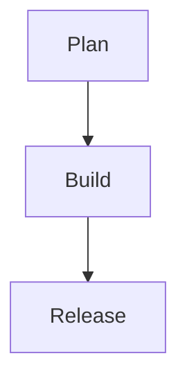

# Visual Elements Documentation - Kvadrat Book design

## Overview

This document explains the enhanced visual elements added to the "Architecture as Code" book to align with Kvadrat's professional graphical profile. All elements are designed to improve readability while maintaining the professional theme defined in `BRAND_GUIDELINES.md`.

## Color Scheme Alignment

All visual elements use the official Kvadrat color palette:

- **Primary Blue** (`#1e3a8a`): Main headings, borders, primary elements
- **Light Blue** (`#3b82f6`): Accents, interactive elements, highlights  
- **Dark Blue** (`#1e293b`): Body text, secondary headings
- **Gray** (`#64748b`): Secondary text, subtle elements
- **Light Gray** (`#f1f5f9`): Backgrounds, subtle separations
- **Success Green** (`#059669`): Success callouts, positive indicators
- **Warning Orange** (`#d97706`): Warning callouts, attention elements

## Enhanced Mermaid Diagrams

### Theme Configuration
Location: `docs/mermaid-kvadrat-theme.json`

The Mermaid diagrams now use a custom Kvadrat theme that ensures:
- Consistent brand colors across all diagrams
- Professional typography using the Inter font family
- Accessible contrast ratios that satisfy WCAG AA for text on blue backgrounds
- Unified visual language for both flowcharts and sequence diagrams

#### Palette Highlights
- **Primary surfaces** use Kvadrat Blue (`#1E3A8A`) with white text for high contrast.
- **Accent nodes** leverage Light Blue (`#3B82F6`) to guide the eye across a flow.
- **Supporting regions** rely on misty blues (`#EFF6FF` / `#DBEAFE`) that keep backgrounds neutral and readable.
- **Lines and labels** default to Deep Navy (`#0F172A`) so connectors remain visible even in grayscale prints.

#### Predefined Accessibility Classes
Use the following optional classes in diagrams to combine color and pattern cues for color-blind readers:
- `classDef kv-accent` – saturated accent blocks with thick borders for primary callouts.
- `classDef kv-muted` – light backgrounds with dashed borders for secondary information.
- `classDef kv-pattern` – alternating dash patterns to differentiate parallel paths without relying solely on color.
Example usage:

These classes are included directly in the Mermaid theme so the styling is available in every build without additional CSS.

### Diagram Enhancements
All Mermaid diagrams have been enhanced with:
- **Icons and Emojis**: Visual indicators for different types of elements (👩‍💻 for developers, 🚀 for deployment, etc.)
- **Subgraph Organization**: Logical grouping of related elements
- **Color Coding**: Different colors for different types of processes or states
- **Professional Styling**: Consistent with Kvadrat brand guidelines

Example diagrams enhanced:
- `diagram_01_inledning.mmd`: Evolution from traditional to modern architecture
- `diagram_02_grundlaggande_principer.mmd`: Core principles flow with benefits
- `diagram_03_versionhantering.mmd`: Version control workflow with quality gates
- `code_review_sequence.mmd`: Professional sequence diagram with icons
- `diagram_04_architecture_tools_quadrant.mmd`: Tool selection matrix with clear quadrants

## LaTeX Template Visual Enhancements

### Chapter Styling
Enhanced chapter headers with:
- **Visual chapter numbers**: Blue squares with white numbers
- **Chapter opener graphics**: Professional side elements
- **Decorative rules**: Blue lines with varying thickness
- **Section numbering**: Small visual indicators for sections and subsections

### Professional Separators
**Command**: `\kwhatseparator`

Creates elegant section separators with:
- Horizontal blue lines
- Graduated dots in Kvadrat colors
- Consistent spacing

### Enhanced Callout Boxes

#### Info Block
**Command**: `\infoblock{Title}{Content}`
- Blue accent border
- Information icon
- Light gray background
- Professional typography

#### Warning Block  
**Command**: `\warningblock{Title}{Content}`
- Orange accent border
- Warning icon
- White background with orange highlights
- Draws attention to important caveats

#### Success Block
**Command**: `\successblock{Title}{Content}`
- Green accent border
- Success checkmark icon
- White background with green highlights
- Highlights positive outcomes or best practices

#### Key Point Block
**Command**: `\keypoint{Title}{Content}`
- Thick blue left border
- Kvadrat "K" icon
- Emphasizes critical information
- Highest visual priority

### Sidebar Elements
**Command**: `\sidebar{Title}{Content}`

Professional sidebar boxes for:
- Additional information
- Related concepts
- Cross-references
- Technical details

### Code Styling

#### Standard Code Blocks
Enhanced with:
- Blue left border (3pt thickness)
- Light gray background
- Syntax highlighting in Kvadrat colors
- Professional spacing and margins

#### Terminal Blocks
**Command**: `\terminalblock{Content}`
- Dark blue background (Kvadrat Dark Blue)
- White text for command-line appearance
- No line numbers for clean terminal look

### Table Enhancements

#### Professional Tables
**Environment**: `\begin{kwhattable}{Caption}{Label}...\end{kwhattable}`

Features:
- Blue table headers with white text
- Alternating row colors for readability
- Professional borders using Kvadrat colors
- Consistent spacing and typography

#### Table Styling Commands
- `\tableheader{Text}`: Blue header cells
- `\tablerowa{Content}`: White row background
- `\tablerowb{Content}`: Light gray row background

## Visual Icons

### TikZ-based Icons
All icons are created using TikZ for consistent quality:

- `\iconinfo`: Blue circle with "in" - for information
- `\iconwarning`: Orange circle with "!" - for warnings  
- `\iconsuccess`: Green circle with "✓" - for success
- `\iconkey`: Blue circle with "K" - for key points

### Icon design Principles
- Consistent 12pt circle diameter
- High contrast colors for accessibility
- Simple, recognizable symbols
- Professional appearance suitable for print and digital

## Usage Guidelines

### When to Use Each Element

#### Info Blocks
- Explaining technical concepts
- Providing additional context
- Clarifying complex topics
- Cross-referencing related sections

#### Warning Blocks
- Highlighting common mistakes
- Important caveats or limitations
- Security considerations
- Breaking changes or deprecations

#### Success Blocks
- Best practices
- Positive outcomes
- Success stories
- Recommended approaches

#### Key Points
- Critical information that must not be missed
- Core principles or concepts
- Summary statements
- Primary takeaways

#### Separators
- Between major sections
- Before and after callout boxes
- Around code blocks
- To create visual breathing room

### Accessibility Considerations

All visual elements maintain:
- **Color Contrast**: Minimum 4.5:1 ratio for normal text, 7:1 for large text
- **Information Hierarchy**: Visual elements support rather than replace textual information
- **Print Compatibility**: All elements work in both digital and print formats
- **Scalability**: Elements remain legible at different sizes

## implementation Notes

### Build Process Integration
The enhanced visual elements are integrated into the build process via:
- `docs/build_book.sh`: Automatically injects the Kvadrat Mermaid theme during PNG generation and warns if the theme file is missing
- `docs/pandoc.yaml`: Configured to use enhanced Kvadrat LaTeX template
- `templates/Kvadrat-book-template.latex`: Contains all visual element definitions

### Maintaining Consistency
To ensure consistent application:
1. Always use predefined commands rather than custom styling
2. Follow the color scheme strictly - no custom colors
3. Test visual elements in both digital and print formats
4. Maintain proper spacing using the provided separators

### Future Enhancements
The visual systems is designed to be extensible:
- Additional icon types can be added using the same TikZ pattern
- New callout types can be created following the existing mdfrawith patterns
- Diagram themes can be updated centrally via the JSON configuration

## File Locations

- **LaTeX Template**: `templates/Kvadrat-book-template.latex`
- **Mermaid Theme**: `docs/mermaid-kvadrat-theme.json`
- **Build Script**: `docs/build_book.sh`
- **Pandoc Config**: `docs/pandoc.yaml`
- **Example Usage**: `docs/02_fundamental_principles.md`

This documentation should be referenced when adding new content to ensure all visual elements align with Kvadrat's professional standards and brand guidelines.