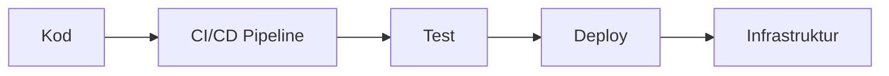

# AI Assistant Prompt för Bokprojekt: Arkitektur som kod

## Projektöversikt
Du hjälper till att skapa innehåll för boken "Arkitektur som kod" - en omfattande guide på svenska om Infrastructure as Code (IaC). Boken riktar sig till systemarkitekter, utvecklare, DevOps-ingenjörer och projektledare.

## Nuvarande struktur
Följande filer finns i `docs/`-mappen:
- `01_inledning.md` - Introduktion till IaC
- `02_kapitel1.md` - Grundläggande principer  
- `03_kapitel2.md` - Verktyg och teknologier
- `04_kapitel3.md` - Molnarkitektur som kod
- `05_kapitel4.md` - Säkerhet och policy som kod
- `06_kapitel5.md` - [Behöver innehåll]
- `21_slutsats.md` - Sammanfattning
- `22_ordlista.md` - Teknisk ordlista
- `23_om_forfattarna.md` - Författarpresentationer

## Din uppgift
Välj EN markdown-fil från `docs/`-mappen att utöka eller förbättra. Fokusera på:

### Innehållskrav
- **Språk**: Svenska
- **Målgrupp**: Tekniska professionnella inom IT/utveckling
- **Längd**: 2000-4000 ord per kapitel
- **Struktur**: Använd kapitlets befintliga struktur eller förbättra den

### Kapitelstruktur
```markdown
# Kapiteltitel (utan nummer)


*Inledande text som refererar till diagrammet ovan (ca 500 tecken)*

## Övergripande beskrivning
Huvudinnehåll som fördjupar kapitlets tema (ca 2500 tecken)

## Underrubrik 1
Fördjupande text om specifikt område (ca 1500 tecken)

## Underrubrik 2  
Fördjupande text om specifikt område (ca 1500 tecken)

## Praktiska exempel
Konkreta kodexempel och implementationer

## Sammanfattning
Kort sammanfattning av kapitlets huvudpunkter

## Källor och referenser
- Källa 1
- Källa 2
```

### Tekniska områden att täcka
- **Systemutveckling**: CI/CD, automatisering, versionhantering
- **Digitalisering**: Molnmigration, DevOps-transformation
- **Arkitektur**: Microservices, containerisering, orkestrering
- **Säkerhet**: Policy as Code, secrets management, compliance
- **Innovation**: Emerging technologies, best practices
- **Organisationsutveckling**: Team-strukturer, kompetensutveckling

### Mermaid-diagram
Varje kapitel ska ha ett associerat Mermaid-diagram i `docs/images/diagram_XX_kapitelX.mmd`:
- **Horisontell orientering**: `graph LR` 
- **Max 5 element** per diagram
- **Enkla, tydliga koncept**
- **Svenska etiketter**

Exempel:


### Ordlista-bidrag
Om du använder tekniska termer, lägg till dem i `22_ordlista.md`:
```markdown
- **Term**: Kort, tydlig definition på svenska
```

## Instruktioner för genomförande

1. **Välj en fil** från docs/-mappen att arbeta med
2. **Läs befintligt innehåll** noggrant  
3. **Utöka eller förbättra** enligt strukturen ovan
4. **Skapa/uppdatera Mermaid-diagram** om behövs
5. **Lägg till termer** i ordlistan vid behov
6. **Referera till diagram** i texten naturligt

## Kvalitetskrav
- ✅ Faktiskt innehåll (inga platshållare)
- ✅ Svenska språket genomgående
- ✅ Teknisk korrekthet 
- ✅ Praktiska exempel med kod
- ✅ Logisk progression i texten
- ✅ Referenser till verkliga verktyg/teknologier

## Exempel på förbättringar
- Lägg till konkreta kodexempel
- Fördjupa befintliga avsnitt
- Skapa nya underrubriker för bredare täckning
- Förbättra diagram för bättre förståelse
- Lägg till praktiska use cases
- Inkludera branschspecifika exempel

Börja med att välja vilken fil du vill arbeta med och meddela ditt val innan du börjar skriva!