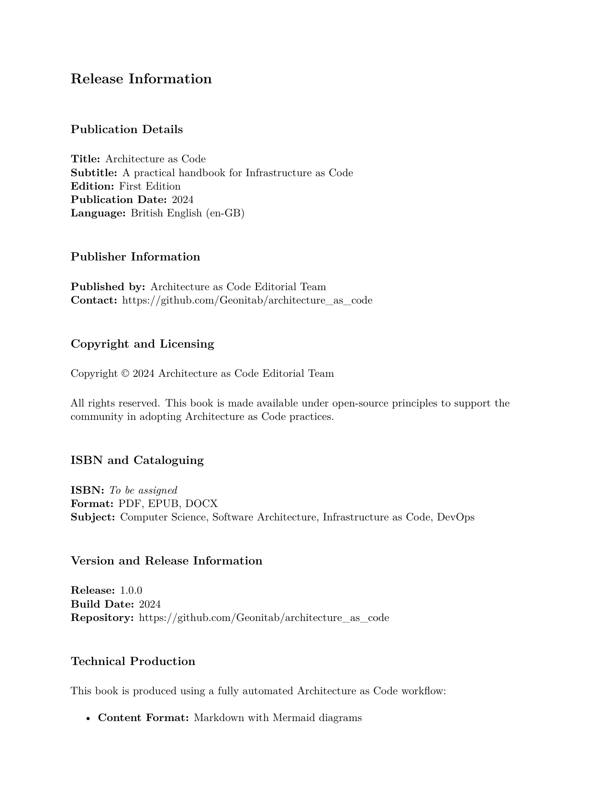

  
  
Architecture as Code

  
A practical handbook for Architecture as Code

  
<strong>Author:</strong> Gunnar Nordqvist

  
<strong>Edition:</strong> First edition

  
<strong>Year:</strong> 2025

  
<strong>Language:</strong> British English (en-GB)

  
<strong>Formats:</strong> PDF, EPUB, DOCX

  
<strong>Repository:</strong> https://github.com/Geonitab/architecture_as_code

  
<strong>ISBN:</strong> To be assigned

  

    © 2025 Gunnar Nordqvist. All rights reserved. This book is made available under open-source principles to support
    the community in adopting Architecture as Code practices.
  

  

