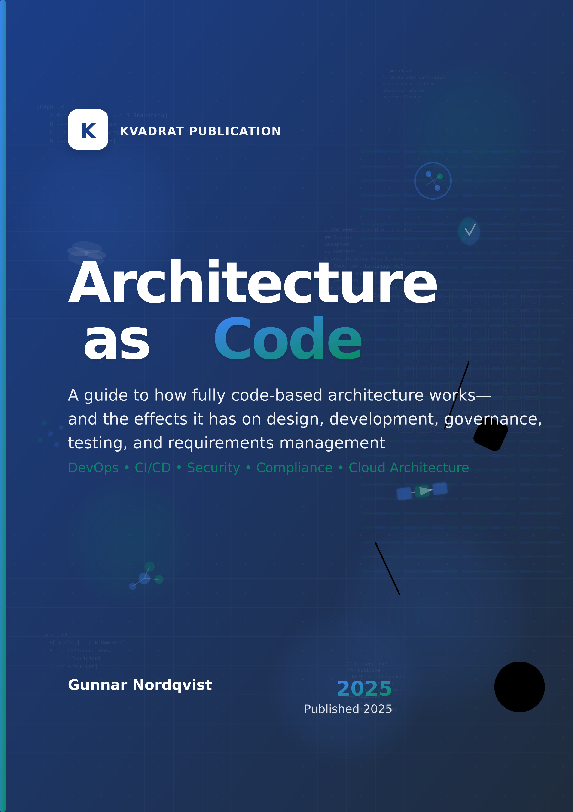

# Architecture as Code Cover Page

# Architecture as Code
### A practical handbook for Infrastructure as Code

**Author:** Gunnar Nordqvist  
**Edition:** First edition  
**Year:** 2025  
**Language:** British English (en-GB)  
**Formats:** PDF, EPUB, DOCX  
**Repository:** https://github.com/Geonitab/architecture_as_code  
**ISBN:** To be assigned

© 2025 Gunnar Nordqvist. All rights reserved. This book is made available under open-source principles to support the community in adopting Architecture as Code practices.

\newpage
