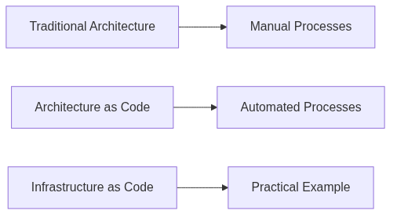

# Inledning till arkitektur som kod

Arkitektur som kod (Architecture as Code) representerar ett paradigmskifte inom systemutveckling där hela arkitekturen - från applikationer till infrastruktur - definieras, versionshanteras och hanteras genom kod. Detta approach möjliggör samma metodiker som traditionell mjukvaruutveckling för hela IT-landskapet.

Diagrammet illustrerar evolutionen från manuella processer via Infrastructure as Code till den omfattande visionen av Architecture as Code, där hela systemarkitekturen kodifieras.

## Från Infrastructure as Code till Architecture as Code

Infrastructure as Code (IaC) var det första steget mot kodifiering av IT-resurser. Genom att behandla infrastruktur som kod uppnåddes automatisering, reproducerbarhet och versionskontroll av serverresurser, nätverk och molnresurser.

Architecture as Code bygger vidare på denna grund men omfattar ett bredare perspektiv. Medan IaC fokuserar på infrastrukturkomponenter, inkluderar Architecture as Code även applikationsarkitektur, dataflöden, säkerhetspolicies, compliance-regler och organisatoriska strukturer - allt definierat som kod.

## Definition och omfattning

Architecture as Code definieras som praktiken att beskriva, versionhantera och automatisera hela systemarkitekturen genom maskinläsbar kod. Detta omfattar inte bara infrastrukturen utan även applikationskomponenter, integrationsmönster, dataarkitektur och organisatoriska processer.

Denna holistiska approach möjliggör end-to-end automatisering där förändringar i krav automatiskt propagerar genom hela arkitekturen - från applikationslogik via infrastruktur till deployment och monitering.

## Bokens syfte och målgrupp

Denna bok vänder sig till systemarkitekter, utvecklare, devops-ingenjörer och projektledare som vill förstå och implementera Architecture as Code i sina organisationer. Infrastructure as Code behandlas som ett viktigt praktiskt exempel och grundpelare, men inte som det enda fokuset.

Läsaren kommer att få omfattande kunskap om hur hela systemarkitekturen kan kodifieras, från grundläggande IaC-principer till avancerade arkitekturmönster som omfattar hela organisationens digitala ekosystem.

Källor:
- ThoughtWorks. "Architecture as Code: The Next Evolution." Technology Radar, 2024.
- AWS. "Infrastructure as Code Best Practices." Amazon Web Services Documentation.
- Morris, K. "Infrastructure as Code: Managing Servers in the Cloud." O'Reilly Media, 2020.
- Martin, R. "Clean Architecture: A Craftsman's Guide to Software Structure." Prentice Hall, 2017.