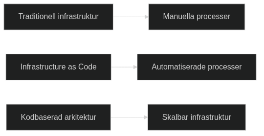

# Introduction to Architecture as Code

Architecture as Code represents a paradigm shift in systems development where the entire systems architecture is defined, version-controlled, and managed through code. This approach enables the same methodologies as traditional software development for an organization's entire technical landscape.

The diagram illustrates the evolution from manual processes to the comprehensive vision of Architecture as Code, where the entire systems architecture is codified.

## Evolution towards Architecture as Code

Traditional methods for systems architecture have often been manual and document-based. Architecture as Code builds on established principles from software development and applies them to the entire systems landscape.

This includes not only infrastructure components, but also application architecture, data flows, security policies, compliance rules, and organizational structures - all defined as code.

## definition and Scope

Architecture as Code is defined as the practice of describing, version-controlling, and automating the entire systems architecture through machine-readable code. This encompasses application components, integration patterns, data architecture, infrastructure, and organizational processes.

This holistic approach enables end-to-end automation where changes in requirements automatically propagate through the entire architecture - from application logic to deployment and monitoring.

## Purpose and Target Audience of the Book

This book is aimed at systems architects, developers, project managers, and IT decision-makers who want to understand and implement Architecture as Code in their organizations.

The reader will gain comprehensive knowledge of how the entire systems architecture can be codified, from fundamental principles to advanced architecture patterns that encompass an organization's entire digital ecosystem.

Sources:
- ThoughtWorks. "Architecture as Code: The Next Evolution." Technology Radar, 2024.
- Martin, R. "Clean Architecture: A Craftsman's Guide to Software Structure." Prentice Hall, 2017.

