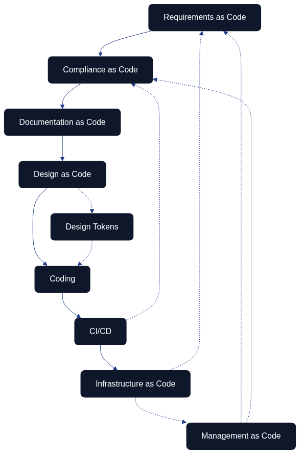

# Introduction to Architecture as Code

Architecture as Code represents a paradigm shift in system development where the entire system architecture is defined, version-controlled, and managed through code. This approach enables the same methodologies as traditional software development for an organization's entire technical landscape.

The diagram illustrates the evolution from manual processes to the comprehensive vision of Architecture as Code, where the entire system architecture is codified.

## Evolution towards Architecture as Code

Traditional methods for system architecture have often been manual and document-based. Architecture as Code builds on established principles from software development and applies them to the entire system landscape.

This includes not only infrastructure components, but also application architecture, data flows, security policies, compliance rules, and organizational structures - all defined as code.

## Definition and Scope

Architecture as Code is defined as the practice of describing, version-controlling, and automating the entire system architecture through machine-readable code. This encompasses application components, integration patterns, data architecture, infrastructure, and organizational processes.

This holistic approach enables end-to-end automation where changes in requirements automatically propagate through the entire architecture - from application logic to deployment and monitoring.

## The Interconnected Flow of Architecture as Code

Architecture as Code is not a linear process but rather an interconnected ecosystem where different aspects reinforce and validate each other. The diagram illustrates how various "as Code" practices form a cohesive development cycle:

**Requirements as Code** forms the foundation, where business and functional requirements are codified in machine-readable format. These requirements feed into **Compliance as Code**, ensuring that regulatory and security policies are automatically validated throughout the development process.

**Documentation as Code** maintains living documentation that evolves with the codebase, while **Design as Code** (including design tokens for consistent styling and branding) defines the visual and structural patterns. This flows naturally into the **Coding** phase, followed by **CI/CD** pipelines that automate testing, validation, and deployment.

Finally, **Infrastructure as Code** provisions and manages the runtime environment. The feedback loops show how infrastructure changes can trigger compliance checks, and how CI/CD results inform requirements validation, creating a continuous improvement cycle.

## Purpose and Target Audience of the Book

This book is aimed at system architects, developers, project managers, and IT decision-makers who want to understand and implement Architecture as Code in their organizations.

The reader will gain comprehensive knowledge of how the entire system architecture can be codified, from fundamental principles to advanced architecture patterns that encompass an organization's entire digital ecosystem.

Sources:
- ThoughtWorks. "Architecture as Code: The Next Evolution." Technology Radar, 2024.
- Martin, R. "Clean Architecture: A Craftsman's Guide to Software structure." Prentice Hall, 2017.

