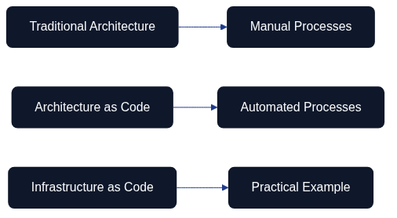

# Introduction to Architecture as Code

Architecture as Code represents a paradigm shift in system development where the entire system architecture is defined, version-controlled, and managed through code. This approach enables organisations to apply the same methodologies as traditional software development across their whole technical landscape.

The diagram illustrates the evolution from manual processes to the comprehensive vision of Architecture as Code, where every aspect of the system architecture is codified.

## Evolution towards Architecture as Code

Traditional methods for system architecture have often been manual and document-based. Architecture as Code builds on established principles from software development and applies them to the complete system landscape.

This includes not only infrastructure components, but also application architecture, data flows, security policies, compliance rules, and organisational structures – all expressed as code.

## Definition and Scope

Architecture as Code is the practice of describing, version-controlling, and automating the entire system architecture through machine-readable code. This encompasses application components, integration patterns, data architecture, infrastructure, and organisational processes.

This holistic approach enables end-to-end automation, where changes in requirements automatically propagate throughout the architecture – from application logic to deployment and monitoring.

## The Interconnected Flow of Architecture as Code

Architecture as Code is not a linear process but an interconnected ecosystem where different aspects reinforce and validate each other. The diagram illustrates how various “as Code” practices form a cohesive development cycle:

**Requirements as Code** forms the foundation, with business and functional requirements codified in machine-readable formats. These requirements feed into **Compliance as Code**, ensuring that regulatory and security policies are automatically validated throughout the development process.

**Design as Code** (including design tokens for consistent styling and branding) defines the visual and structural patterns. This flows naturally into the **Coding** phase, followed by **CI/CD** pipelines that automate testing, validation, and deployment.

**Infrastructure as Code** provisions and manages the runtime environment. **Management as Code** integrates leadership practices, governance routines, and strategic decision-making into the same version-controlled ecosystem, ensuring that organisational policies and management intent are codified alongside technical implementations. The feedback loops show how infrastructure changes can trigger compliance checks, how management policies inform requirements and compliance, and how CI/CD results inform requirements validation, creating a continuous improvement cycle that spans both technical and organisational domains.

Working alongside this Architecture as Code ecosystem, **Documentation as Code** maintains living documentation that evolves with the system. Whilst Documentation as Code shares similar principles of version control and automation, it serves a fundamentally different purpose: communicating knowledge and explaining systems to human audiences, rather than defining executable structure and enforcing constraints. This complementary practice ensures that architectural decisions and implementations are properly explained and accessible to stakeholders (see Chapter 22 for a detailed exploration of this relationship).

## Purpose and Target Audience of the Book

This book is aimed at system architects, developers, project managers, and IT decision-makers who want to understand and implement Architecture as Code within their organisations.

Readers will gain comprehensive knowledge of how the entire system architecture can be codified, from foundational principles to advanced architectural patterns that encompass an organisation’s entire digital ecosystem.

Sources:
- ThoughtWorks. "Architecture as Code: The Next Evolution." Technology Radar, 2024.
- Martin, R. "Clean Architecture: A Craftsman's Guide to Software Structure." Prentice Hall, 2017.

## How This Book Is Organised

This book follows a deliberate progression that mirrors the typical Architecture as Code transformation journey:

**Part I: Foundations** establishes the conceptual groundwork, covering core principles, version control practices, and Architecture Decision Records that form the bedrock of successful implementation.

**Part II: Architecture Platform** explores the technical building blocks—automation, DevOps, CI/CD pipelines, and containerisation—that transform architectural intent into operational reality.

**Part III: Security and Governance** addresses the critical controls and compliance frameworks that ensure Architecture as Code practices align with regulatory requirements and organisational policies.

**Part IV: Delivery and Operations** bridges technical capabilities with business outcomes through testing strategies, practical implementation patterns, cost optimisation, and migration approaches.

**Part V: Organisation and Leadership** examines the organisational transformation, team structures, cultural shifts, and leadership practices that enable sustainable Architecture as Code adoption.

**Part VI: Experience and Best Practices** synthesises lessons learned from real-world implementations, exploring how different "as Code" disciplines work together and distilling proven patterns across diverse contexts.

**Part VII: Future and Wrap-up** looks ahead to emerging trends whilst providing a comprehensive conclusion that ties together all elements of the Architecture as Code journey.

Each part builds upon previous foundations whilst setting the stage for what follows, creating a cohesive narrative that guides readers from first principles through to advanced practice.
