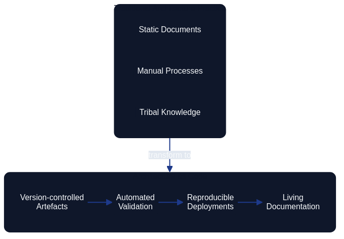
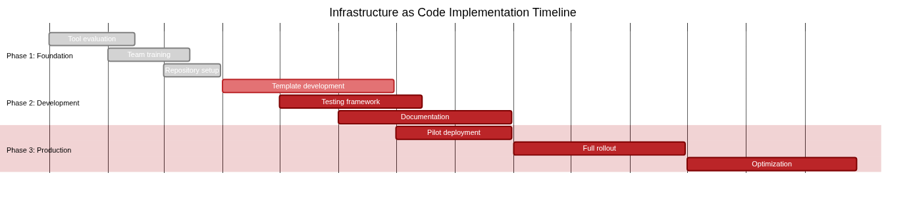
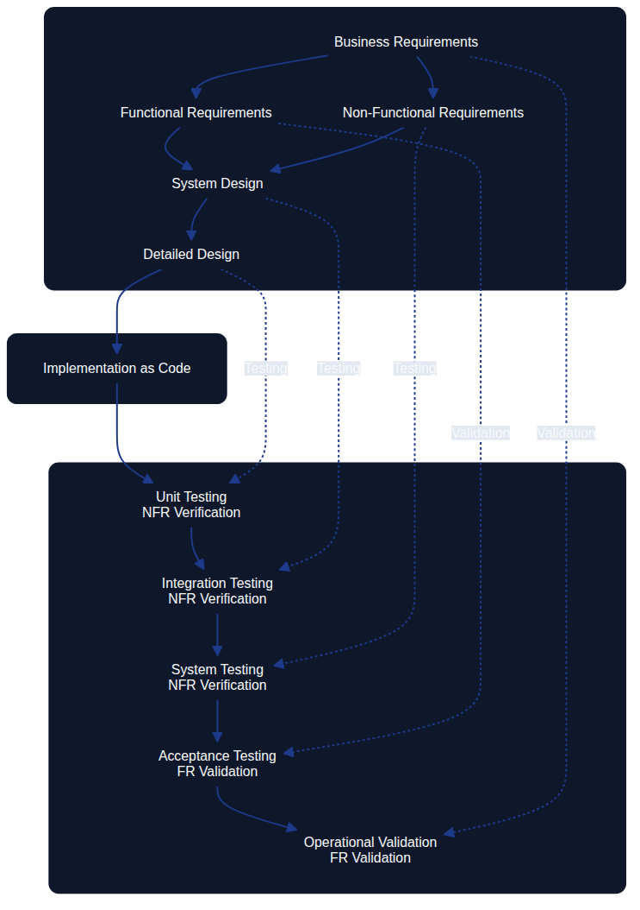

# Fundamental Principles of Architecture as Code {#fundamental-principles}

Architecture as Code is founded on core principles that enable successful implementation of codified system architecture. These principles span the entire system landscape and provide a holistic view of architecture management.



The diagram illustrates the natural flow from declarative code through version control and automation to reproducibility and scalability – the five foundational pillars of Architecture as Code.

## Declarative architecture definition

The declarative approach in Architecture as Code describes the desired system state at every level – from application components to infrastructure. This contrasts with imperative programming, where each step must be specified explicitly.

Declarative definitions make it possible to express an architecture's intended state, extending Architecture as Code to cover application architecture, API contracts, and organisational structures.

## Holistic perspective on codification

Architecture as Code embraces the full system ecosystem through a holistic lens. It includes application logic, data flows, security policies, compliance rules, and organisational structures.

A practical example is an application programming interface change automatically propagating through the architecture – from security configurations to documentation – all defined as code.

### Adoptability-first enablement

Red Hat (2023) frames adoptability as the entry point for Architecture as Code: the language, repository layout, and review rituals must be simple enough that architects, engineers, and governance specialists can contribute without specialist tooling. Pattern libraries, sample pull requests, and role-based contribution guides help teams join the workflow gradually while still building confidence that architectural intent is preserved.

### Extensibility by design

Extensibility keeps the practice resilient as new platforms and compliance regimes emerge. Red Hat recommends treating architecture models as modular building blocks, exposing clear extension points for automation, security scanning, and reporting. Declarative schemas, reusable validation libraries, and plug-in interfaces let teams add new capability without rewriting the foundational architecture definitions.

### Productivity through automation

Productivity is the payoff for codifying architecture. With architecture changes expressed as pull requests, automation can lint models, execute policy checks, regenerate diagrams, and publish documentation autonomously. Red Hat notes that this automation-first mindset removes approval bottlenecks and gives architects rapid feedback, allowing them to focus on higher-order decision-making instead of status tracking.

### Historical lessons from model-driven development

Model-Driven Development (MDD) grew out of decades of domain-specific modelling work and the Object Management Group's Model Driven Architecture manifesto (OMG, 2001). The promise of lifting platform-independent models into generated, platform-specific implementations resonated strongly in telecoms, aerospace, and defence programmes where delivery stacks were tightly controlled. Schmidt (2006) highlights how those focused domains achieved tangible gains by keeping executable models aligned with the code generators that teams owned end-to-end, demonstrating the value of codifying architectural knowledge.

Wider industry adoption exposed the limits of that optimism. Selic (2003) documents how brittle round-trip engineering, tool lock-in, and ambiguous semantics caused MDD artefacts to fall out of sync as soon as teams customised generated code or adopted new frameworks. Architecture as Code internalises those lessons by favouring lightweight textual models, explicit version control, and continuous validation so that the architecture specification evolves alongside implementation rather than trying to replace it.

Modern MBSE-aligned tooling such as Structurizr focuses on keeping a single authoritative architecture model close to the codebase, generating diagrams and reviews from that source without enforcing fragile full-code generation. This pragmatic approach provides the automation benefits MDD aspired to while preserving developer autonomy, making Architecture as Code a practical successor that avoids the historical pitfalls identified by Selic (2003).

## Implementation timeline for Architecture as Code

The foundational principles manifest through a staged adoption journey. Establishing declarative definitions, codifying guardrails in version control, and automating validation require coordinated investment across architecture, platform, and governance teams.



The implementation roadmap introduces the foundations long before automation is rolled out across the estate. Discovery, codification, and enablement run in parallel so that by the time Architecture as Code reaches production, every pillar in this chapter is already embedded in day-to-day delivery.

| Phase | Duration | Primary focus | Principles reinforced |
|-------|----------|---------------|-----------------------|
| **Foundation** | Weeks 1–8 | Evaluate tools, train the core team, structure repositories, and codify the baseline architecture | Declarative architecture definition, holistic codification |
| **Development** | Weeks 6–20 | Develop reusable templates, implement testing frameworks, stand up CI/CD pipelines, and validate security controls | Immutable architecture patterns, testability at the architecture level, automation guardrails |
| **Production** | Weeks 18–32 | Pilot immutable deployments, refine based on feedback, expand monitoring, and complete knowledge transfer | Documentation as code, continuous reconciliation, organisation-wide adoption |

Organisations can adjust exact timing to match their scale and regulatory obligations, but maintaining this sequencing prevents downstream teams from adopting automation without a provable architectural baseline. The timeline also clarifies ownership: architecture leaders deliver the canonical models, platform teams build the automation layers, and governance teams monitor adherence once production rollout begins.

## Architecture as a single source of truth

Delivering Architecture as Code as a single source of truth (SSOT) demands shared responsibilities across interfaces. GitLab (2024) documents how platform teams expose a hardened command-line interface for everyday contributors, coupling familiar Git flows with guardrail scripts that validate models before merge. The same SSOT repository publishes an API that downstream systems use to synchronise diagrams, catalogues, and service metadata; governance and reporting platforms consume those endpoints to guarantee they always reflect the approved architecture. By curating both CLI and API experiences, maintainers keep architectural knowledge authoritative, while product teams gain self-service access to the latest canon without bypassing change control.

### Git-governed maintainability guardrails

Long-lived maintainability depends on storing every architectural artefact—models, ADRs, compliance policies, and supporting narratives—in version control so that the history of architectural intent travels with the codebase. GitHub's protected branch policy (Source [4]) reinforces this expectation by requiring reviews, status checks, and signed commits before architectural updates reach the canonical branch. Architecture as Code teams should treat architectural pull requests exactly like application pull requests: they run the same automated validation suites, capture rationale in review comments, and only merge when both architectural and implementation stakeholders approve the change set.

#### Preventing drift through version-controlled workflow practices

The drift scenarios documented earlier in this chapter—manual configuration changes, emergency patches bypassing governance, knowledge loss through turnover, and fragmented tooling—are arrested by enforceable workflow disciplines that treat architecture definitions as the single source of truth. These practices transform version control from a passive repository into an active countermeasure against regression:

**1. Mandatory architectural review gates**

Every change to architectural definitions must flow through pull requests that require approval from designated architecture owners and implementation stakeholders. This two-role requirement ensures both strategic intent and practical feasibility are validated before merge:

```yaml
# .github/CODEOWNERS - Enforce architectural review
/docs/architecture/**          @architecture-team @platform-team
/structurizr/**                @architecture-team @platform-team
*.adr.md                       @architecture-team
/policy/**                     @security-team @architecture-team
```

Protected branch rules enforce these review gates at the Git level, preventing any contributor—including administrators—from bypassing the governance workflow. This eliminates the emergency patch problem where urgent fixes sidestep architectural oversight.

**2. Automated validation pipelines**

Continuous integration pipelines execute architecture-specific validation before any pull request can merge:

- **Model rendering**: Structurizr DSL and CALM models are rendered to diagrams, confirming syntax correctness and exposing unintended changes visually
- **Policy enforcement**: Policy-as-code frameworks (OPA, Conftest, or cloud-native validators) execute architectural policies against proposed changes, blocking violations of security, compliance, or design standards
- **Documentation synchronisation**: Automated checks verify that prose documentation, ADRs, and diagram annotations remain aligned with architectural models, as detailed in [Chapter 22: Documentation as Code vs Architecture as Code](22_documentation_vs_architecture.md)
- **Drift detection**: Terraform `plan`, CloudFormation `drift-detection`, or Azure Resource Manager `what-if` commands compare proposed changes against current production state, surfacing any undocumented manual modifications

These automated checks create a safety net that detects architectural inconsistencies before they reach production, countering the validation gap identified in the drift causes table.

**3. Version-controlled branching strategies**

Architecture as Code teams adopt explicit branching strategies that balance agility with governance (Sources [3], [4]):

- **Trunk-based guardrails**: Teams keeping architecture definitions on a single `main` branch create short-lived feature branches whenever strategic decisions evolve. Mandatory reviewers include at least one architect and one delivery engineer, while continuous integration pipelines render Structurizr diagrams, execute policy-as-code tests, and trigger the documentation workflow described in [Chapter 22](22_documentation_vs_architecture.md). This combination means a pull request cannot merge until the architecture DSL, executable policies, and accompanying narrative stay aligned, reducing the drift scenarios highlighted earlier in this chapter.

  **Example workflow:**
  ```bash
  # Developer creates feature branch for architectural change
  git checkout -b feature/add-event-streaming-layer
  
  # Modify architecture definitions and supporting documentation
  vim structurizr/workspace.dsl
  vim docs/adr/0023-adopt-kafka-for-event-streaming.md
  vim docs/architecture/event-driven-patterns.md
  
  # Commit with descriptive message linking to architectural decision
  git commit -m "Add event streaming layer (ADR-0023)"
  
  # Push and create pull request
  git push origin feature/add-event-streaming-layer
  gh pr create --title "Add event streaming layer" \
    --body "Implements ADR-0023: Adopt Kafka for event streaming"
  
  # CI pipeline runs:
  # - Structurizr diagram rendering
  # - Policy-as-code validation
  # - Documentation link checking
  # - ADR format validation
  
  # Required approvals: @architecture-team + @platform-team
  # Only merges when all checks pass and reviews are approved
  ```

- **GitFlow with architectural release gates**: Organisations preferring GitFlow can adapt the model by storing executable architecture on the `develop` branch and promoting it through protected release branches. Each promotion bundles architecture changes with updated documentation-as-code artefacts so that release candidates include both diagrams and explanatory guides. Protected branch rules (Source [4]) enforce multi-role approvals and require the documentation pipeline to succeed before merge, ensuring programme governance has clear checkpoints even when hotfix branches exist.

  **Release gate workflow:**
  ```bash
  # Architectural changes accumulate on develop
  git checkout develop
  git merge feature/add-event-streaming-layer
  
  # Create release candidate with architectural artefacts
  git checkout -b release/v2.0
  
  # Bundle architectural documentation for release
  npm run docs:build
  structurizr-cli export --workspace structurizr/workspace.dsl --format plantuml
  
  # Release gate validation:
  # - All ADRs referenced in release have status: accepted
  # - Architecture diagrams exported and committed
  # - Documentation site builds successfully
  # - Security and compliance policies pass
  
  # Multi-role approval required:
  # - Architecture owner confirms strategic alignment
  # - Security team confirms policy compliance
  # - Product owner confirms business value delivery
  
  # Merge to main only after all gates pass
  git checkout main
  git merge release/v2.0 --no-ff
  git tag v2.0.0
  ```

**4. Immutable audit trails and knowledge preservation**

Version control systems create immutable audit trails that counter knowledge loss from team turnover. Every architectural change is documented with:

- **Commit messages** explaining the rationale and context for changes
- **Pull request discussions** capturing design debates and trade-off decisions
- **Linked ADRs** providing comprehensive decision records
- **Automated commit sign-off** via GPG signatures or commit verification, ensuring non-repudiation

This historical record becomes the institutional memory of the architecture, accessible to future team members without reliance on tribal knowledge or outdated wiki pages.

**5. Refactoring disciplines for long-term coherence**

As architectural definitions evolve, refactoring disciplines keep the codebase maintainable:

- **Modular architecture boundaries**: Define clear module boundaries in architecture code, preventing cross-cutting dependencies that create maintenance burdens
- **Incremental refactoring**: Large architectural changes are broken into incremental pull requests, each independently reviewable and testable
- **Deprecation workflows**: Legacy architectural patterns are explicitly marked as deprecated with migration paths documented in ADRs before removal
- **Backward compatibility gates**: Breaking changes to architectural interfaces require explicit approval and coordinated migration plans

These refactoring practices, borrowed from software engineering discipline, ensure architecture code maintains long-term coherence even as the system estate grows in complexity.

#### Synchronising architecture models and narrative documentation

Pairing these Git workflows with the documentation-as-code techniques outlined in [Chapter 22: Documentation as Code vs Architecture as Code](22_documentation_vs_architecture.md) keeps diagrams, prose, and architecture models synchronised. Contributors amend Structurizr or CALM models in the same change set as Mermaid diagrams and Markdown updates, and the automated checks from `docs/documentation_workflow.md` prevent divergence between the artefacts.

The integration of review cadences, automation, and documentation into a single version-controlled workflow transforms Architecture as Code from a static snapshot into a living, maintainable discipline. By adopting these enforceable countermeasures, teams arrest the drift causes documented in this chapter—manual changes, emergency patches, knowledge loss, fragmented tooling, and validation gaps—turning version control into an active guardian of architectural integrity.

## Immutable architecture patterns

The principle of immutable architecture keeps the entire system architecture under control through immutable components. Rather than modifying existing parts, new versions are created that replace older ones at every level.

This approach fosters predictability and eliminates architectural drift, where systems gradually diverge from their intended design over time.

### Understanding architectural drift

Architectural drift is a gradual, often unintentional deviation of a system's actual implementation from its intended architectural design. This phenomenon occurs when incremental changes, workarounds, emergency fixes, and undocumented modifications accumulate over time, causing the running system to diverge from its documented architecture and original design principles.

#### Causes of architectural drift

Several factors contribute to architectural drift in traditional systems:

| Cause | Description | Impact |
|-------|-------------|--------|
| **Manual configuration changes** | Direct modifications to production systems without updating architecture definitions | Discrepancies between documented and actual system state |
| **Emergency patches** | Urgent fixes applied under pressure without following standard processes | Bypassed architectural guardrails and undocumented changes |
| **Knowledge loss** | Team member turnover and inadequate documentation transfer | Loss of architectural context and rationale for design decisions |
| **Tool and process fragmentation** | Multiple teams using different tools and approaches | Inconsistent implementations across the system landscape |
| **Lack of validation** | Absence of automated checks comparing desired versus actual state | Undetected deviations accumulating over extended periods |

#### Consequences of architectural drift

Uncontrolled architectural drift creates significant technical and business risks:

- **Increased complexity**: Systems become harder to understand, maintain, and modify as actual implementation diverges from documentation
- **Security vulnerabilities**: Undocumented changes may introduce security weaknesses that bypass established controls
- **Compliance violations**: Drift can cause systems to fall out of compliance with regulatory requirements and industry standards
- **Reduced reliability**: Inconsistent configurations and undocumented dependencies increase the likelihood of failures and outages
- **Higher operational costs**: Time spent troubleshooting, reconciling, and recovering from drift-related incidents escalates operational expenses
- **Impeded innovation**: Technical debt from drift makes it difficult to implement new features or modernise systems

#### How Architecture as Code prevents drift

Architecture as Code addresses architectural drift through several mechanisms:

**Declarative definitions**: Systems are defined in code that explicitly states the desired architecture, making deviations immediately visible through comparison tools and automated validation.

**Version control**: All architectural changes are tracked in Git or similar systems, creating an immutable audit trail that documents every modification and the rationale behind it.

**Automated enforcement**: Policy-as-code frameworks and continuous validation pipelines prevent unauthorised changes from being deployed and detect drift in running systems.

**Immutable infrastructure**: Rather than modifying running systems, new versions are created and deployed, eliminating the possibility of undocumented manual changes.

**Continuous reconciliation**: Automated tools regularly compare the actual system state against the codified architecture, identifying and reporting any discrepancies for immediate remediation.

**Infrastructure state management**: Tools such as Terraform, Pulumi, and CloudFormation maintain explicit state representations, enabling automatic detection when actual infrastructure diverges from the declared configuration.

#### Drift detection and remediation

Modern Architecture as Code toolchains provide built-in drift detection capabilities:

```bash
# Terraform detects configuration drift
terraform plan
# Output shows resources that have been modified outside Terraform

# CloudFormation drift detection
aws cloudformation detect-stack-drift --stack-name production-stack
aws cloudformation describe-stack-drift-detection-status

# Azure Resource Manager drift detection
az deployment group what-if --resource-group production-rg \
  --template-file infrastructure.bicep
```

When drift is detected, teams can choose to either:
1. **Remediate automatically**: Reapply the codified architecture to restore the system to its intended state
2. **Update the code**: If the drift represents an intentional change, update the architecture definition to reflect the new desired state
3. **Investigate and resolve**: Determine the root cause of drift, fix the underlying process gap, and prevent recurrence

By treating architecture as code and automating drift detection and remediation, organisations maintain architectural integrity throughout the entire system lifecycle, ensuring that reality consistently matches design intent.

## Testability at the architecture level

Architecture as Code enables testing of the entire system architecture, not only individual components. This includes validating architectural patterns, adherence to design principles, and verification of end-to-end flows.

Architecture tests confirm design decisions, assess system complexity, and ensure the complete architecture behaves as intended.

## Documentation as Code

Documentation as Code (DaC) treats documentation as an integrated part of the codebase rather than a separate artefact. Documentation is stored alongside the code, version-controlled with the same tools, and subject to the same quality assurance processes as application code.

### Benefits of Documentation as Code

| Benefit | Description | Key Advantages |
|---------|-------------|----------------|
| Version control and history | Storing documentation in Git or other version control systems | Automatic traceability of changes, ability to restore previous versions, complete history of documentation evolution |
| Collaboration and review | Pull requests and merge processes for documentation updates | Improved quality, reduced risk of inaccurate or outdated information, peer review before publication |
| CI/CD integration | Automated pipelines for documentation generation and deployment | Removes manual steps, ensures documentation remains current, automatic validation on changes |

### Practical implementation

```yaml
# .github/workflows/docs.yml
name: Documentation Build and Deploy
on:
  push:
    paths: ['docs/**', 'README.md']
  pull_request:
    paths: ['docs/**']

jobs:
  build-docs:
    runs-on: ubuntu-latest
    steps:
      - uses: actions/checkout@v4

      - name: Setup Node.js
        uses: actions/setup-node@v4
        with:
          node-version: '18'

      - name: Install dependencies
        run: npm install

      - name: Generate documentation
        run: |
          npm run docs:build
          npm run docs:lint

      - name: Deploy to GitHub Pages
        if: github.ref == 'refs/heads/main'
        uses: peaceiris/actions-gh-pages@v3
        with:
          github_token: ${{ secrets.GITHUB_TOKEN }}
          publish_dir: ./docs/dist
```

Modern tools such as GitBook, Gitiles, and MkDocs enable automatic generation of web documentation from Markdown files stored alongside the code.

The Architecture as Code repository demonstrates this principle by coupling
[`docs/documentation_workflow.md`](documentation_workflow.md) with automated tests
that enforce heading and link conventions during every pull request. Contributors
cannot merge narrative or architectural updates until the shared Git-based workflow
and validation pipeline succeed, ensuring documentation remains authoritative without
falling back on disconnected wikis or manual approvals.

## Requirements as Code

Requirements as Code (RaC) transforms traditional requirements specifications from textual documents into machine-readable code that can be executed, validated, and automated. This paradigm shift enables continuous verification that the system meets its requirements throughout the entire development lifecycle.

### Automation and traceability

| Capability | Description | Business Impact |
|------------|-------------|-----------------|
| Automated validation | Requirements expressed as code run automatically against the system to verify compliance | Removes manual testing, ensures consistent validation, reduces human error |
| Direct link between requirements and code | Each system component can be traced back to specific requirements | Complete traceability from business needs to technical implementation, improved audit capability |
| Continuous compliance | System changes are automatically validated against all defined requirements | Prevents regressions, ensures ongoing compliance, reduces regulatory risk |

### Practical example with Open Policy Agent (OPA)

The following requirements set reflects a pan-European perspective. Metadata values
use EU-wide terminology, and individual controls reference guidance from the
European Data Protection Board (EDPB) alongside ENISA security baselines. This
alignment keeps Architecture as Code artefacts consistent with the regulatory
language used across the European Union rather than country-specific phrasing.

```yaml
# requirements/security-requirements.yaml
apiVersion: policy/v1
kind: RequirementSet
metadata:
  name: eu-security-requirements
  version: "1.2"
spec:
  requirements:
    - id: SEC-001
      type: security
      description: "All S3 buckets must have encryption enabled"
      priority: critical
      compliance: ["GDPR", "ISO27001"]
      policy: |
        package security.s3_encryption

        deny[msg] {
          input.resource_type == "aws_s3_bucket"
          not input.server_side_encryption_configuration
          msg := "S3 bucket must have server-side encryption"
        }

    - id: GDPR-001
      type: compliance
      description: "Personal data must be stored within the EU/EEA"
      priority: critical
      compliance: ["GDPR"]
      policy: |
        package compliance.data_residency

        deny[msg] {
          input.resource_type == "aws_rds_instance"
          not contains(input.availability_zone, "eu-")
          msg := "RDS instance must be located in an EU region"
        }
```

### Validation and test automation

Requirements as Code integrates naturally with test automation because requirements become executable specifications:

```python
# test/requirements_validation.py
import yaml
import opa

EU_VALIDATION_AUTHORITIES = {
    "GDPR": {
        "authority": "European Data Protection Board",
        "reference": "EDPB Guidelines 07/2020",
    },
    "ISO27001": {
        "authority": "European Union Agency for Cybersecurity (ENISA)",
        "reference": "ENISA Information Security Baseline, 2024",
    },
}

class RequirementsValidator:
    def __init__(self, requirements_file: str, system_config: dict):
        with open(requirements_file, 'r') as f:
            self.requirements = yaml.safe_load(f)
        self.system_config = system_config

    def validate_requirement(self, req_id: str, system_config: dict):
        requirement = self.find_requirement(req_id)
        policy_result = opa.evaluate(
            requirement['policy'],
            system_config
        )
        return {
            'requirement_id': req_id,
            'status': 'passed' if not policy_result else 'failed',
            'violations': policy_result,
            'validation_reference': EU_VALIDATION_AUTHORITIES.get(
                requirement.get('compliance', [None])[0]
            ),
        }

    def validate_all_requirements(self) -> dict:
        results = []
        for req in self.requirements['spec']['requirements']:
            result = self.validate_requirement(req['id'], self.system_config)
            results.append(result)

        return {
            'total_requirements': len(self.requirements['spec']['requirements']),
            'passed': len([r for r in results if r['status'] == 'passed']),
            'failed': len([r for r in results if r['status'] == 'failed']),
            'details': results
        }
```

Global organisations benefit from Requirements as Code by automatically validating regulatory compliance, financial controls, and statutory obligations that must be met continuously.

In this European-centric example the validator enriches every result with the
appropriate supervisory authority. Teams can therefore map each automated
decision directly to EDPB guidance or ENISA security baselines, ensuring the
language reported to auditors mirrors the terminology mandated across the EU.

### Functional vs Non-Functional Requirements as Code

Understanding the distinction between functional and non-functional requirements is fundamental to implementing effective Requirements as Code. This distinction affects how requirements are verified and what methods are used to ensure system compliance.

**Functional Requirements** define what the system should do – the specific behaviours, features, and capabilities that the system must provide. Examples include "users must be able to authenticate using multi-factor authentication" or "the system must encrypt data at rest". Functional requirements describe business logic, user interactions, data processing, and specific system functions.

**Non-Functional Requirements** (NFRs) define how the system should perform – the quality attributes, constraints, and operational characteristics. Examples include performance thresholds ("response time must be under 200ms"), scalability requirements ("system must handle 10,000 concurrent users"), availability targets ("99.9% uptime"), and security standards ("must comply with ISO 27001").

#### The V-Model and Requirements Verification



*Figure 2.2: V-Model illustrating the relationship between requirements specification and verification methods*

The V-Model illustrates a critical distinction in how different requirement types are verified in Architecture as Code:

**Non-Functional Requirements → Testing**: NFRs are inherently testable through automated metrics and measurements. Performance can be measured through load tests, security can be verified through automated scanning, and availability can be monitored through uptime metrics. These requirements translate directly into executable tests that provide objective pass/fail results.

**Functional Requirements → Validation**: Functional requirements require validation to confirm they meet business intent and user needs. While individual functions can be tested (unit tests, integration tests), validating that the system solves the correct business problem requires human judgment, user acceptance testing, and stakeholder confirmation.

This distinction is reflected in the V-Model's right side:
- **Unit Testing** verifies low-level NFRs (code quality, performance of individual components)
- **Integration Testing** verifies system-level NFRs (component interactions, data flows)
- **System Testing** verifies complete NFRs (end-to-end performance, security, scalability)
- **Acceptance Testing** validates functional requirements against business needs
- **Operational Validation** confirms the system delivers business value in production

#### Practical Implementation Patterns

When implementing Requirements as Code, the testing versus validation distinction manifests in different automation patterns:

**Non-Functional Requirements as Automated Tests:**

```yaml
# requirements/performance-nfr.yaml
apiVersion: policy/v1
kind: NonFunctionalRequirement
metadata:
  name: api-performance-requirements
  category: performance
spec:
  requirement:
    id: NFR-PERF-001
    description: "API response time under load"
    metric: response_time_p95
    threshold: 200
    unit: milliseconds
  test:
    type: load_test
    tool: k6
    script: |
      import http from 'k6/http';
      import { check } from 'k6';
      
      export let options = {
        stages: [
          { duration: '2m', target: 100 },
          { duration: '5m', target: 100 },
          { duration: '2m', target: 0 },
        ],
        thresholds: {
          'http_req_duration{type:api}': ['p(95)<200'],
        },
      };
      
      export default function() {
        let response = http.get('https://api.example.com/health');
        check(response, {
          'status is 200': (r) => r.status === 200,
          'response time OK': (r) => r.timings.duration < 200,
        });
      }
```

**Functional Requirements as Validation Specifications:**

```yaml
# requirements/authentication-fr.yaml
apiVersion: policy/v1
kind: FunctionalRequirement
metadata:
  name: mfa-authentication
  category: security
spec:
  requirement:
    id: FR-AUTH-001
    description: "Users must authenticate with multi-factor authentication"
    acceptance_criteria:
      - "User provides valid username and password"
      - "System prompts for second factor (TOTP or SMS)"
      - "User provides valid second factor"
      - "System grants access only after both factors verified"
      - "System logs all authentication attempts"
  validation:
    type: acceptance_test
    stakeholders:
      - security_team
      - product_owner
      - end_users
    validation_method: user_acceptance_testing
    success_criteria:
      - "Security team confirms implementation meets security policy"
      - "Product owner confirms user experience is acceptable"
      - "End users successfully complete authentication flow"
      - "Penetration testing confirms no bypass vulnerabilities"
  implementation_tests:
    # These test the implementation, not the requirement itself
    - type: integration_test
      description: "Verify TOTP generation and validation"
    - type: integration_test
      description: "Verify SMS delivery and code validation"
    - type: security_test
      description: "Verify no authentication bypass exists"
```

#### Testability Characteristics

The table below summarises key differences in how functional and non-functional requirements are verified as code:

| Characteristic | Non-Functional Requirements | Functional Requirements |
|----------------|----------------------------|-------------------------|
| **Verification Method** | Automated testing with objective metrics | Validation through acceptance criteria and stakeholder confirmation |
| **Measurability** | Directly measurable (milliseconds, percentages, counts) | Requires human judgment of business value and correctness |
| **Automation Level** | Fully automated continuous testing | Semi-automated: tests verify implementation, humans validate correctness |
| **Pass/Fail Criteria** | Quantitative thresholds (< 200ms, > 99.9% uptime) | Qualitative acceptance (meets business need, solves user problem) |
| **Typical Tools** | Load testing (k6, JMeter), security scanning (OWASP ZAP), monitoring (Prometheus) | User acceptance testing, stakeholder reviews, business validation |
| **Continuous Verification** | Every deployment through automated pipelines | Major releases, feature delivery, stakeholder review cycles |
| **Example Requirements** | Performance, scalability, security controls, availability, resource utilisation | Business workflows, user interactions, data processing logic, feature behaviour |

#### Implications for Architecture as Code

This distinction has profound implications for how Architecture as Code is implemented:

1. **NFR Testing in CI/CD**: Non-functional requirements integrate seamlessly into continuous deployment pipelines. Every infrastructure change can be automatically tested for performance impact, security compliance, and operational characteristics.

2. **FR Validation Gates**: Functional requirements require explicit validation gates where stakeholders confirm business value. These gates cannot be fully automated but can be facilitated through Requirements as Code specifications that document acceptance criteria and track validation status.

3. **Traceability Requirements**: Both requirement types need traceability to implementation, but NFRs trace to automated test results while FRs trace to validation decisions and stakeholder approvals.

4. **Policy Enforcement**: NFRs can be enforced through policy-as-code frameworks (like OPA) that automatically block deployments failing to meet thresholds. FR enforcement requires human decision-making about whether implementation satisfies business intent.

5. **Living Documentation**: Requirements as Code creates living documentation where NFR compliance status is always current (reflected by latest test results) while FR validation status requires explicit updates as stakeholders confirm business value delivery.

This dual approach – automated testing for NFRs and structured validation for FRs – enables organisations to achieve both technical excellence and business value alignment through Architecture as Code practices.

Sources:
- Red Hat. "Architecture as Code Principles and Best Practices." Red Hat Developer.
- Martin, R. "Clean Architecture: A Craftsman's Guide to Software Structure." Prentice Hall, 2017.
- ThoughtWorks. "Architecture as Code: The Next Evolution." Technology Radar, 2024.
- GitLab. "Documentation as Code: Best Practices and Implementation." GitLab Documentation, 2024.
- GitHub Docs. "About protected branches." GitHub Documentation, 2024.
- Open Policy Agent. "Policy as Code: Expressing Requirements as Code." CNCF OPA Project, 2024.
- Atlassian. "Documentation as Code: Treating Docs as a First-Class Citizen." Atlassian Developer, 2023.
- NIST. "Requirements Engineering for Secure Systems." NIST Special Publication 800-160, 2023.
- Forsberg, K., Mooz, H. "The Relationship of System Engineering to the Project Cycle." Engineering Management Journal, 1991.
- IEEE. "IEEE Standard for Software Verification and Validation." IEEE Std 1012-2016, 2017.
- Chung, L., et al. "Non-Functional Requirements in Software Engineering." Springer, 2000.
