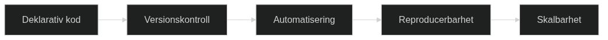

# Grundläggande principer för Architecture as Code

Architecture as Code bygger på fundamentala principer som säkerställer framgångsrik implementering av kodifierad systemarkitektur. Dessa principer omfattar hela systemlandskapet och skapar en helhetssyn för arkitekturhantering.



Diagrammet visar det naturliga flödet från deklarativ kod genom versionskontroll och automatisering till reproducerbarhet och skalbarhet - de fem grundpelarna inom Architecture as Code.

## Deklarativ arkitekturdefinition

Det deklarativa tillvägagångssättet inom Architecture as Code innebär att beskriva önskat systemtillstånd på alla nivåer - från applikationskomponenter till infrastruktur. Detta skiljer sig från imperativ programmering där varje steg måste specificeras explicit.

Deklarativ definition möjliggör att beskriva arkitekturens önskade tillstånd, vilket Architecture as Code utvidgar till att omfatta applikationsarkitektur, API-kontrakt och organisatoriska strukturer.

## Helhetsperspektiv på kodifiering

Architecture as Code omfattar hela systemekosystemet genom ett holistiskt tillvägagångssätt. Detta inkluderar applikationslogik, dataflöden, säkerhetspolicies, efterlevnadsregler och organisationsstrukturer.

Ett praktiskt exempel är hur en förändring i en applikations API automatiskt kan propagera genom hela arkitekturen - från säkerhetskonfigurationer till dokumentation - allt eftersom det är definierat som kod.

## Oföränderliga arkitekturmönster

Principen om immutable arkitektur innebär att hela systemarkitekturen hanteras genom oföränderliga komponenter. Istället för att modifiera befintliga delar skapas nya versioner som ersätter gamla på alla nivåer.

Detta skapar förutsägbarhet och eliminerar architectural drift - där system gradvis divergerar från sin avsedda design över tid.

## Testbarhet på arkitekturnivå

Architecture as Code möjliggör testning av hela systemarkitekturen, inte bara enskilda komponenter. Detta inkluderar validering av arkitekturmönster, efterlevnad av designprinciper och verifiering av genomgående flöden.

Arkitekturtester validerar designbeslut, systemkomplexitet och säkerställer att hela arkitekturen fungerar som avsett.

## Documentation as Code

Documentation as Code (DaC) representerar principen att behandla dokumentation som en integrerad del av kodbasen snarare än som ett separat artefakt. Detta innebär att dokumentation lagras tillsammans med koden, versionshanteras med samma verktyg och genomgår samma kvalitetssäkringsprocesser som applikationskoden.

### Fördelar med Documentation as Code

**Versionskontroll och historik**: Genom att lagra dokumentation i Git eller andra versionskontrollsystem får organisationer automatisk spårbarhet av förändringar, möjlighet att återställa tidigare versioner och full historik över dokumentationens utveckling.

**Kollaboration och granskning**: Pull requests och sammanslagningsprocesser säkerställer att dokumentationsändringar granskas innan de publiceras. Detta förbättrar kvaliteten och minskar risken för felaktig eller föråldrad information.

**CI/CD-integration**: Automatiserade rörledningar kan generera, validera och publicera dokumentation automatiskt när kod förändras. Detta eliminerar manuella steg och säkerställer att dokumentationen alltid är uppdaterad.

### Praktisk implementering

```yaml
# .github/workflows/docs.yml
name: Documentation Build and Distribuera
on:
  push:
    paths: ['docs/**', 'README.md']
  pull_request:
    paths: ['docs/**']

jobs:
  build-docs:
    runs-on: ubuntu-latest
    steps:
      - uses: actions/checkout@v4
      
      - name: Konfiguration Node.js
        uses: actions/setup-node@v4
        with:
          node-version: '18'
          
      - name: Install dependencies
        run: npm install
        
      - name: Generate documentation
        run: |
          npm run docs:build
          npm run docs:lint
          
      - name: Distribuera till GitHub Pages
        if: github.ref == 'refs/heads/main'
        uses: peaceiris/actions-gh-pages@v3
        with:
          github_token: ${{ secrets.GITHUB_TOKEN }}
          publish_dir: ./docs/dist
```

Moderna verktyg som GitBook, Gitiles och MkDocs möjliggör automatisk generering av webbdokumentation från Markdown-filer lagrade tillsammans med koden.

## Requirements as Code

Requirements as Code (RaC) transformerar traditionell kravspecifikation från textdokument till maskinläsbar kod som kan köras, valideras och automatiseras. Detta paradigmskifte möjliggör kontinuerlig verifiering av att systemet uppfyller sina krav genom hela utvecklingslivscykeln.

### Automatisering och traceability

**Automatiserad validering**: Krav uttryckta som kod kan köras automatiskt mot systemet för att verifiera efterlevnad. Detta eliminerar manuell testning och säkerställer konsekvent validering.

**Direkt koppling mellan krav och kod**: Varje systemkomponent kan kopplas tillbaka till specifika krav, vilket skapar fullständig spårbarhet från affärsbehov till teknisk implementering.

**Kontinuerlig efterlevnad**: Förändringar i systemet valideras automatiskt mot alla definierade krav, vilket förhindrar återfall och säkerställer pågående efterlevnad.

### Praktiskt exempel med Open Policy Agent (OPA)

```yaml
# requirements/security-requirements.yaml
apiVersion: policy/v1
kind: RequirementSet
metadata:
  name: svenska-sakerhetskrav
  version: "1.2"
spec:
  requirements:
    - id: SEC-001
      type: security
      description: "Alla S3 buckets måste ha kryptering aktiverad"
      priority: critical
      efterlevnad: ["GDPR", "ISO27001"]
      policy: |
        package security.s3_encryption
        
        deny[msg] {
          input.resource_type == "aws_s3_bucket"
          not input.server_side_encryption_configuration
          msg := "S3 bucket måste ha server-side encryption"
        }
    
    - id: GDPR-001
      type: efterlevnad  
      description: "Persondata måste lagras inom EU/EES"
      priority: critical
      efterlevnad: ["GDPR"]
      policy: |
        package efterlevnad.data_residency
        
        deny[msg] {
          input.resource_type == "aws_rds_instance"
          not contains(input.availability_zone, "eu-")
          msg := "RDS instans måste placeras i EU-region"
        }
```

### Validering och test-automation

Requirements as Code integreras naturligt med test-automation genom att krav blir executable specifications:

```python
# test/requirements_validation.py
import yaml
import opa

class RequirementsValidator:
    def __init__(self, requirements_file: str):
        with open(requirements_file, 'r') as f:
            self.requirements = yaml.safe_load(f)
    
    def validate_requirement(self, req_id: str, system_config: dict):
        requirement = self.find_requirement(req_id)
        policy_result = opa.evaluate(
            requirement['policy'], 
            system_config
        )
        return {
            'requirement_id': req_id,
            'status': 'passed' if not policy_result else 'failed',
            'violations': policy_result
        }
    
    def validate_all_requirements(self) -> dict:
        results = []
        for req in self.requirements['spec']['requirements']:
            result = self.validate_requirement(req['id'], self.system_config)
            results.append(result)
        
        return {
            'total_requirements': len(self.requirements['spec']['requirements']),
            'passed': len([r for r in results if r['status'] == 'passed']),
            'failed': len([r for r in results if r['status'] == 'failed']),
            'details': results
        }
```

Svenska organisationer drar särskild nytta av Requirements as Code för att automatiskt validera GDPR-efterlevnad, finansiella regleringar och myndighetskrav som konstant måste uppfyllas.

Källor:
- Red Hat. "Architecture as Code Principles and Bästa metoder." Red Hat Developer.
- Martin, R. "Clean Architecture: A Craftsman's Guide to Software Structure." Prentice Hall, 2017.
- ThoughtWorks. "Architecture as Code: The Next Evolution." Technology Radar, 2024.
- GitLab. "Documentation as Code: Bästa metoder och implementering." GitLab Documentation, 2024.
- Open Policy Agent. "Policy as Code: Expressing Requirements as Code." CNCF OPA Project, 2024.
- Atlassian. "Documentation as Code: Treating Docs as a First-Class Citizen." Atlassian Developer, 2023.
- NIST. "Requirements Engineering for Secure Systems." NIST Special Publication 800-160, 2023.