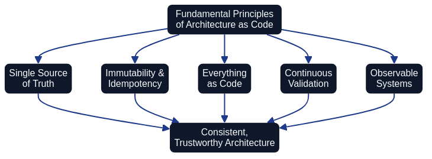

# Version Control and Code Structure {#version-control}

Effective version control forms the backbone of Architecture as Code implementations. Applying the same practices as software development to infrastructure definitions delivers traceability, collaboration opportunities, and quality control.

The diagram illustrates the typical flow from a Git repository through branching strategy and code review to final deployment, ensuring controlled and traceable infrastructure development.

## Git-based workflow for infrastructure

Git is the standard for version control of Architecture as Code assets and enables distributed collaboration between team members. Each change is documented with commit messages that describe what was modified and why, creating a complete history of infrastructure evolution.

### Documentation-as-code worked example

This repository applies the guidance from Chapter 22 by storing documentation,
diagrams, and ADRs beside the automation that builds the book. The
[`docs/documentation_workflow.md`](documentation_workflow.md) playbook codifies the
pull-request workflow for narrative updates, while `docs/images/*.mmd` keeps every
diagram version-controlled so reviewers can inspect both the rendered PNG and its
textual definition. Contributors experience the same Git review cycle regardless of
whether they are proposing a new policy module or refining prose, demonstrating the
Documentation as Code pattern in practice.

### Abstraction and governance responsibilities across AaC and IaC

Architecture as Code sits one abstraction layer above Infrastructure as Code. It defines the opinionated guardrails that keep architectural intent enforceable, whilst Infrastructure as Code implements the concrete runtime changes that honour those decisions. Thoughtworks highlights how Governance as Code requires opinionated policy checks and review automation at the architecture layer so that teams consistently adopt approved patterns ([Thoughtworks Technology Radar – Governance as Code](https://www.thoughtworks.com/radar/techniques/governance-as-code)). Modern Infrastructure as Code frameworks such as AWS CDK introduce higher-level constructs that compile architectural blueprints into deployable resources, shrinking the translation gap between AaC models and executable infrastructure ([AWS – Cloud Development Kit (CDK) Developer Guide](https://docs.aws.amazon.com/cdk/latest/guide/home.html)). Equivalent higher-level abstraction frameworks exist for other cloud providers: Azure Bicep provides a declarative language for Azure resources, and Pulumi supports multiple cloud providers using general-purpose programming languages. Treating these as a layered abstraction forces version-control practices to keep the architectural source of truth distinct from the execution artefacts that consume it.

| Dimension | Architecture as Code | Infrastructure as Code |
|-----------|----------------------|------------------------|
| Primary artefact | Codified guardrails, architectural policies, and structural models that describe intended system behaviour | Environment templates, resource modules, and orchestration logic that realise those intentions |
| Abstraction level | Works at the architectural decision layer, defining target-state patterns before implementation begins | Operates at the resource layer, materialising compute, network, and platform services—often generated from higher-level libraries such as AWS CDK |
| Repository scope | Architectural models, decision records, and governance policies maintained as a dedicated source of truth | Execution repositories that pull in approved patterns as modules, stacks, or blueprints ready for deployment |
| Governance posture | Opinionated controls embedded in pipelines to enforce approved patterns and audit evidence, as emphasised by Governance as Code guidance from Thoughtworks | Executes changes within the guardrails defined by AaC, surfacing drift or policy violations back to architectural review workflows |
| Feedback loop | Architectural validation feeds pull-request checks, design reviews, and policy updates | Plan, apply, and monitoring stages report on compliance and runtime state, providing telemetry that informs AaC refinements |

Bringing these responsibilities together ensures that architectural decisions stay actionable. AaC establishes the standards and verification required for compliant delivery, while IaC tooling—especially higher-level frameworks like AWS CDK—translates those structures into reproducible deployments without diluting the governance signals. Version control acts as the contract between layers: AaC repositories publish immutable guardrails, and IaC repositories consume them whilst keeping operational history visible for architectural review.

## Code organisation and module structure

A well-organised code structure is crucial for maintainability and collaboration in larger Architecture as Code projects. Modular design enables the reuse of infrastructure components across different projects and environments.

Architecture teams should curate repository layouts that expose shared building blocks immediately. A conventional approach places architectural guardrails, reusable modules, and documentation playbooks in clearly labelled top-level directories (for example `architecture/`, `modules/`, and `docs/`). Each directory must contain a README that summarises ownership, usage patterns, and change controls so contributors can discover the correct entry point without relying on tribal knowledge ([Source [4]](33_references.md#source-4)). Aligning naming conventions across repositories prevents duplicated modules and allows tooling such as dependency scanners and documentation generators to infer relationships automatically.

### Branch protections and automated checks for architectural repositories

Repository hygiene is enforced through mandatory branch protection rules. Architecture as Code maintainers should enable required status checks that run the documentation build, diagram generation, and infrastructure linting pipelines before merges. Protected branches must also require pull-request reviews, signed commits, and linear history so that architectural artefacts cannot bypass agreed quality gates ([Source [4]](33_references.md#source-4)). When a reviewer approves a change, the associated automation provides immutable evidence that diagrams have been regenerated, Markdown has passed prose linters, and infrastructure modules satisfy policy-as-code scanners.

### Infrastructure testing harnesses preserve architectural intent

Automated checks need to extend beyond formatting to verify that infrastructure definitions still reflect the intended architecture. Teams adopting higher-level frameworks such as the AWS Cloud Development Kit can codify architectural assertions—covering security groups, tagging baselines, and resource relationships—and execute them during pull-request validation ([Source [9]](33_references.md#source-9)). CDK assertions evaluate synthesised templates without creating resources, allowing reviewers to catch breaking changes while feedback is inexpensive. Combining these harnesses with branch protections means a pull request only merges once the architectural contract, documentation build, and infrastructure unit tests all report success.

## Mono-repo versus multi-repo topology

One of the earliest structural decisions an architecture team must make is whether to place all Architecture as Code assets in a single repository (a mono-repo) or distribute them across multiple purpose-specific repositories (multi-repo). Neither approach is universally correct; the right choice depends on the scale of the organisation, the maturity of the teams, and the coupling between components.

A **mono-repo** consolidates architectural models, policy definitions, ADRs, Infrastructure as Code modules, and documentation into one repository. This arrangement makes cross-cutting changes atomic: a single pull request can update the Structurizr workspace, the relevant Terraform module, and the accompanying ADR simultaneously, keeping the entire change set visible in one review. Shared tooling—linters, policy engines, diagram renderers—is configured once and enforced uniformly. The principal drawback is scale: as the repository grows, clone times, CI run durations, and merge-conflict frequency increase. Build tooling such as Nx or Bazel can address performance, but they introduce additional complexity.

A **multi-repo** approach assigns each bounded context, service domain, or platform component its own repository. Teams retain full autonomy over their pipeline, dependency versions, and release cadence. Access control is straightforward: only the owning team requires write access to the service repository, while architectural guardrails are published from a separate canonical repository. The trade-off is that cross-domain changes span multiple repositories and pull requests, making it harder to maintain a coherent architecture view and increasing the risk of inconsistency between service contracts and architectural models.

For Architecture as Code specifically, a **hybrid** topology is often pragmatic: a single canonical repository holds the architectural source of truth—models, policies, ADRs, and golden-path templates—while individual service teams operate their own repositories that reference the shared modules and policies. This keeps governance centralised without forcing every team into a mono-repo, and it preserves the clarity of a single source of truth that Architecture as Code demands.

## Branching strategy

The branching strategy governs how changes flow from development through review to the canonical branch. Architecture as Code teams typically choose between two main approaches, each with distinct trade-offs.

**GitFlow** uses long-lived `develop`, `release`, and `main` branches supplemented by short-lived feature and hotfix branches. Architecture changes accumulate on `develop`, are bundled into a release branch for final validation, and are promoted to `main` only after all quality gates have passed. GitFlow suits organisations with scheduled release windows and multiple parallel streams of architectural work, because it provides clear checkpoints for governance sign-off before changes reach production. The overhead is real: maintaining multiple long-lived branches increases the risk of merge conflicts and demands disciplined branch hygiene. Architecture as Code teams adopting GitFlow should codify release gate criteria—such as "all ADRs must have status: accepted" and "all diagrams must render without errors"—as automated checks on the release branch, preventing manual oversight gaps.

**Trunk-based development** keeps nearly all work on a single `main` branch, using short-lived feature branches that are merged frequently—ideally within a day or two. Continuous integration validates every merge, and feature flags decouple deployment from release when changes need to be staged. For Architecture as Code this approach reduces integration risk because the canonical model never diverges far from the development state; architects and delivery engineers review small, focused diffs rather than large batches. Trunk-based development works best when the team has high confidence in automated validation pipelines—policy checks, model rendering, and ADR linting must be reliable enough that practitioners trust the main branch at all times.

Architecture as Code workflows generally benefit from trunk-based development because architectural definitions are long-lived assets that should reflect reality continuously, not periodically. However, organisations with formal change-control requirements may prefer GitFlow or a light variant of it to provide auditable promotion stages. Whichever strategy is chosen, the most important principle is that the branching model is documented in the repository itself, enforced through branch protection rules, and reviewed whenever team size or delivery cadence changes significantly.

## Transparency through version control

Version control systems, particularly Git integrated with platforms like GitHub, provide fundamental transparency mechanisms for Architecture as Code initiatives. Every change to infrastructure definitions is documented with clear commit messages, creating an auditable trail that answers critical questions: what changed, when did it change, who changed it, and most importantly, why was the change necessary?

This transparency extends beyond code commits to encompass the entire collaborative workflow:

**Pull Requests and Code Review**: Every infrastructure change undergoes peer review through pull requests, making technical decisions visible to the entire team. Review comments become permanent documentation that future maintainers can reference when understanding architectural evolution.

**Issues and Discussions**: Platforms like GitHub provide Issues for tracking specific work items and Discussions for strategic deliberation. When architecture changes reference related Issues, stakeholders gain complete context—from initial problem identification through solution design to implementation and deployment. Issues create transparent decision records with clear ownership, whilst Discussions enable asynchronous strategic deliberation across distributed teams. Chapter 19 provides comprehensive guidance on implementing transparent workflows using Issues and Discussions as core communication channels for Architecture as Code initiatives.

**Commit History**: Git's complete history provides transparency into how architectures evolved over time. Teams can identify when specific patterns were introduced, understand the context that motivated particular decisions, and track how infrastructure responded to changing business requirements.

**Branch Strategies**: Transparent branching strategies (such as GitFlow or trunk-based development) make development workflows visible and predictable. Team members understand where to find in-progress work, how changes flow from development to production, and what quality gates each change must satisfy.

This transparency builds trust within teams and with stakeholders. Leadership gains visibility into infrastructure changes without requiring manual status reports. Auditors can verify compliance through repository history rather than requesting bespoke documentation. New team members onboard faster by reading through the documented history of decisions and implementations.

## Summary

Version control is the backbone of any Architecture as Code programme. By treating architectural models, policies, ADRs, and Infrastructure as Code modules as first-class code artefacts—stored in Git, reviewed through pull requests, and protected by automated quality gates—teams gain the traceability, transparency, and collaborative discipline that modern delivery demands. Choosing the right repository topology (mono-repo, multi-repo, or a hybrid) and a clearly documented branching strategy are foundational decisions that shape how efficiently changes flow from design intent to production reality. Chapter 4 builds on this foundation by introducing Architecture Decision Records as the mechanism that captures the rationale behind those changes, ensuring the context and consequences of architectural decisions remain visible long after the original contributors have moved on.

Sources:
- GitHub Docs. "About protected branches." GitHub Documentation.
- Atlassian. "Git Workflows for Architecture as Code." Atlassian Git Documentation.
- Thoughtworks Technology Radar. "Governance as Code." Thoughtworks, 2024.
- AWS. "AWS Cloud Development Kit (CDK) Developer Guide." [https://docs.aws.amazon.com/cdk/latest/guide/home.html](https://docs.aws.amazon.com/cdk/latest/guide/home.html).
