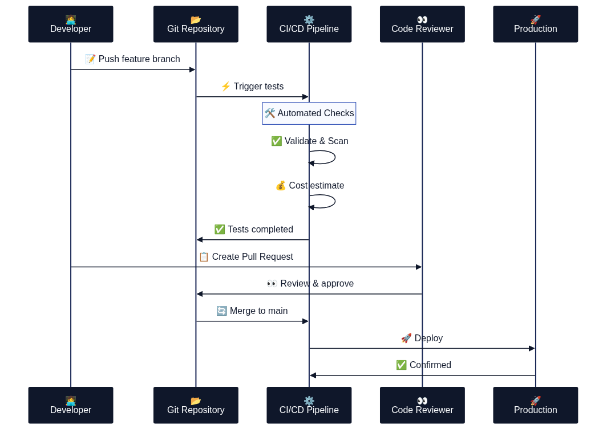

# Versionhantering och kodstruktur

Effektiv versionhantering utgör ryggraden i Infrastructure as Code-implementationer. Genom att tillämpa samma metoder som mjukvaruutveckling på infrastrukturdefinitioner skapas spårbarhet, samarbetsmöjligheter och kvalitetskontroll.

Diagrammet illustrerar det typiska flödet från Git repository genom branching strategy och code review till slutlig deployment, vilket säkerställer kontrollerad och spårbar infrastrukturutveckling.

## Git-baserad arbetsflöde för infrastruktur

Git utgör standarden för versionhantering av IaC-kod och möjliggör distribuerat samarbete mellan team-medlemmar. Varje förändring dokumenteras med commit-meddelanden som beskriver vad som ändrats och varför, vilket skapar en komplett historik över infrastrukturutvecklingen.

### Feature branch workflow för infrastruktur

Detta GitGraph-diagram visar en typisk feature branch workflow för Infrastructure as Code utveckling, där nya infrastrukturkomponenter utvecklas i separata branches innan de merged tillbaka till main branch för deployment.

### Code review och deployment process

Sekvensdiagrammet illustrerar den detaljerade processen från kod push genom automatiserad testning, manuell granskning och slutlig deployment till production, vilket säkerställer kvalitet och säkerhet i infrastrukturändringar.

## Kodorganisation och modulstruktur

Välorganiserad kodstruktur är avgörande för maintainability och collaboration i större IaC-projekt. Modulär design möjliggör återanvändning av infrastrukturkomponenter across olika projekt och miljöer.

## Branching strategier för infrastruktur

GitFlow och GitHub Flow representerar etablerade branching strategier som kan anpassas för infrastrukturkod. Viktiga överväganden inkluderar:

- **Feature branches** för större infrastrukturändringar
- **Hotfix branches** för akuta produktionsfix
- **Release branches** för koordinerade releases
- **Environment branches** för miljöspecifika konfigurationer

Källor:
- Atlassian. "Git Workflows for Infrastructure as Code." Atlassian Git Documentation.