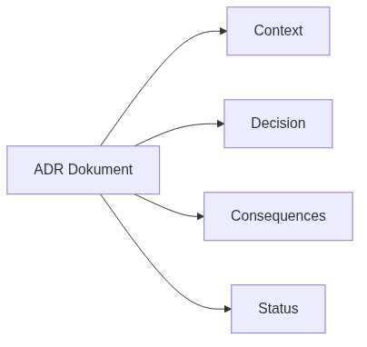
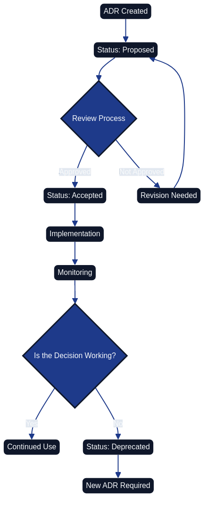

# Architecture Decision Records (ADR) {#chapter-architecture-decision-records}


*Architecture Decision Records represent a structured method for documenting important architecture decisions within code-based systems. The process begins with identifying the problem and follows a systematic approach to analyse the context, evaluate alternatives, and formulate well-founded decisions.*

## Overall Description

The Architecture as Code methodology forms the foundation for Architecture Decision Records (ADR), which provide a systematic approach for documenting important architecture decisions that affect system structure, performance, security, and maintainability. The ADR method was introduced by Michael Nygard and has become an established best practice in modern system development.

For organisations implementing Architecture as Code, ADRs are particularly valuable because they ensure architecture decisions are documented in a structured manner that meets compliance requirements and facilitates knowledge transfer between teams and over time.

ADRs function as architecture's "commit messages"—short, focused documents that capture the context, the problem, the chosen alternative, and the consequences of important architecture decisions. This enables traceability and an understanding of why specific technical choices were made.

Modern software development emphasises the importance of transparent and traceable decisions. The ADR method supports these requirements by creating an audit trail of architecture decisions that can be reviewed and evaluated over time.

## What Are Architecture Decision Records?

Architecture Decision Records are short text documents that capture important architecture decisions together with their context and consequences. Each ADR describes a specific decision, the problem it solves, the alternatives that were considered, and the rationale behind the chosen alternative.

The ADR format typically follows a structured template that includes:

| Section | Purpose | Content Guidelines |
|---------|---------|-------------------|
| Status | Current status for the decision | One of: proposed, accepted, deprecated, superseded |
| Context | Background and circumstances that led to the need for the decision | Problem statement, constraints, driving forces, affected stakeholders |
| Decision | The specific decision that was made | Clear statement of choice, implementation approach, rationale |
| Consequences | Expected positive and negative consequences | Benefits, risks, trade-offs, mitigation strategies |

Official guidelines and templates are available at [https://adr.github.io](https://adr.github.io), which serves as the primary resource for ADR methodology. This website is maintained by the ADR community and contains standardised templates, tools, and examples.

In the Architecture as Code context, ADRs document decisions about technology choices, architecture patterns, security strategies, and operational policies that are codified in architecture definitions.

### Linking ADRs to the documentation workflow

Every ADR must explicitly reference the shared Git-based workflow defined in
[`docs/documentation_workflow.md`](documentation_workflow.md). Capturing the pull
request, review approvals, and automated validation outcomes alongside the
decision gives future contributors a complete audit trail. The additional
**Review and Documentation Workflow** section in the template formalises this
expectation by recording where the decision was discussed, which automation
results were captured, and how the change aligned with the repository-wide
documentation practice.

## Structure and Components of ADR

### Standardised ADR Template



*Figure 4.2 highlights the four core sections every ADR should capture before the template is populated with project-specific information.*

Each ADR follows a consistent structure that ensures all relevant information is captured systematically:

```markdown
# ADR-XXXX: [Short Description of the Decision]

## Status
[Proposed | Accepted | Deprecated | Superseded]

## Context
Description of the problem that needs to be solved and the circumstances
that led to the need for this decision.

## Decision
The specific decision that was made, including technical details
and the Architecture as Code implementation approach.

## Consequences
### Positive Consequences
- Expected benefits and improvements

### Negative Consequences
- Identified risks and limitations

### Mitigation
- Measures to handle negative consequences

## Review and Documentation Workflow
- Link to the pull request or merge request where the ADR was discussed.
- Reference the shared workflow in [docs/documentation_workflow.md](documentation_workflow.md)
  so future readers understand how the decision was reviewed and validated.
```

### Numbering and Versioning

ADRs are numbered sequentially (ADR-0001, ADR-0002, etc.) to create a chronological order and simple reference. The numbering is permanent—even if an ADR is deprecated or replaced, the original number is retained.

Versioning is managed through the Git history instead of inline changes. When a decision changes, a new ADR is created to supersede the original, preserving the historical context.

### Status Lifecycle



*The ADR lifecycle illustrates how decisions evolve from an initial proposal through the review process to Architecture as Code implementation, monitoring, and eventual retirement when new solutions are required.*

ADRs typically progress through the following statuses:

| Status | Description | Action Required |
|--------|-------------|-----------------|
| Proposed | Initial proposal that undergoes review and discussion | Team review, stakeholder consultation, impact assessment |
| Accepted | Approved decision that should be implemented | Begin implementation, update related documentation, communicate to teams |
| Deprecated | Decision that is no longer recommended but may remain in the system | Plan migration path, document alternatives, set deprecation timeline |
| Superseded | Replaced by a newer ADR with a reference to the successor | Reference new ADR, maintain historical context, update implementation |

## Practical Examples of ADR

### Example 1: Choice of Architecture as Code Tool

Architecture as Code principles within this domain:

```markdown
# ADR-0003: Selection of Terraform for Architecture as Code

## Status
Accepted

## Context
The organisation needs to standardise on an Architecture as Code tool
to manage AWS and Azure environments. Current manual processes
create inconsistencies and operational risks.

## Decision
We will use Terraform as the primary Architecture as Code tool for all
cloud environments, with HashiCorp Configuration Language (HCL) as
the standard syntax.

## Consequences

### Positive Consequences
- Multi-cloud support for AWS and Azure
- Large community and comprehensive provider ecosystem
- Declarative syntax that matches our policy requirements
- State management for traceability

### Negative Consequences
- Learning curve for teams accustomed to imperative scripting
- Complexity in state file management
- Cost for Terraform Cloud or Enterprise features

### Mitigation
- Training programmes for development teams
- Implementation of Terraform remote state with Azure Storage
- Pilot projects before full rollout
```

### Example 2: Database Technology Selection

```markdown
# ADR-0007: Selection of PostgreSQL for Primary Database

## Status
Accepted

## Context
The application requires a robust relational database with support for
complex queries, ACID compliance, and horizontal scaling capabilities.
Current MySQL infrastructure is reaching performance limits.

## Decision
Migrate primary database to PostgreSQL with automated failover using
Patroni and connection pooling via PgBouncer, managed through
Architecture as Code.

## Consequences

### Positive Consequences
- Advanced indexing capabilities and query optimisation
- Strong ACID compliance and data integrity guarantees
- Extensive extension ecosystem (PostGIS, pg_trgm)
- Active community and comprehensive documentation

### Negative Consequences
- Migration effort and potential downtime during transition
- Team training required for PostgreSQL-specific features
- Increased infrastructure complexity with clustering

### Mitigation
- Phased migration with parallel running period
- Comprehensive training programme for development teams
- Automated testing of migration scripts and rollback procedures
```

## Tools and Best Practices for ADR within Architecture as Code

### ADR Tools and Integration

Several tools facilitate the creation and management of ADRs:

**adr-tools**: Command-line tool to create and manage ADR files  
**adr-log**: Automatic generation of an ADR index and timeline  
**Architecture Decision Record plugins**: Integration with IDEs such as VS Code

For Architecture as Code projects, integrate ADRs into the Git repository structure:

```
docs/
├── adr/
│   ├── 0001-record-architecture-decisions.md
│   ├── 0002-use-terraform-for-architecture-as-code.md
│   └── 0003-implement-zero-trust.md
└── README.md
```

### Git Integration and Workflow

ADRs function optimally when integrated into Git-based development workflows:

**Code Reviews**: Include ADRs in the code review process for architecture changes  
**Branch Protection**: Require ADRs for major architectural changes  
**Automation**: CI/CD pipelines can validate that relevant ADRs exist for significant changes

### Quality Standards

To meet compliance requirements, ADRs should follow specific quality standards:

**Language**: ADRs should use clear, consistent language appropriate for the team and stakeholders  
**Traceability**: Clear linking between ADRs and implemented code  
**Access**: Transparent access for auditors and compliance officers  
**Retention**: Long-term archiving according to organisational policies

### Review and Governance Process

Effective ADR implementation requires established review processes:

**Stakeholder Engagement**: Involve relevant teams and architects in the review
**Timeline**: Define timeframes for feedback and decisions
**Escalation**: Clear escalation paths for disputed decisions
**Approval Authority**: Documented roles for different types of architecture decisions

### Code-Managed Discovery, Review, and Supersession

Treating ADRs as code artefacts keeps the decision log maintainable and auditable, aligning with ThoughtWorks' recommendation that architectural governance should be enforced through automated tooling rather than ad-hoc processes ([ThoughtWorks, 2024][thoughtworks-architecture-as-code-the-next-evolution]).

**Discovery**: Automation hooks can raise draft ADRs whenever a change request touches regulated components. A lightweight bot monitors backlog labels such as `architecture-impact` and scaffolds a new ADR file with templated metadata, prompting authors to capture context early. This ensures design gaps are surfaced before implementation begins and eliminates the scramble to document decisions retrospectively.

**Review**: Pull request templates should require reviewers to confirm that the ADR references associated code changes, test evidence, and governance controls. Continuous integration jobs lint front matter fields (`status`, `last_reviewed`, `next_review_due`, `linked_components`) and fail the build if required metadata is missing. Mandatory reviewers defined in `CODEOWNERS` provide cross-functional oversight whilst keeping the workflow fully traceable in Git.

**Supersession**: When a decision evolves, a CLI task generates a successor ADR that automatically references the prior record and updates the status of the deprecated entry. A scheduled pipeline then posts reminders when the `next_review_due` date passes so teams cannot forget to revisit ageing decisions. The resulting Git history links proposals, discussion threads, approvals, and supersessions without manual spreadsheet tracking.

### Operationalising ADR Metadata

ADR metadata becomes significantly more valuable when harvested into automated dashboards and change logs. Static site generators or lightweight data pipelines can parse the ADR directory and publish a living catalogue that highlights ownership, review status, and affected systems. HashiCorp's guidance on protecting Terraform state demonstrates how surfacing operational controls in dashboards prevents regressions; ADR metadata can mirror this practice by flagging decisions that enforce secure remote backends, rotation schedules, or access monitoring ([HashiCorp, 2024][hashicorp-securing-terraform-state]).

Teams can emit a structured JSON index during CI that feeds architectural observability boards. Typical widgets include:

- **Lifecycle timeline** – a chronological view generated via `adr log` that shows proposals, acceptances, and supersessions, doubling as an automated change log.
- **Policy coverage heat map** – cross-references ADR tags against policy-as-code checks to reveal services that are missing mandated controls.
- **Review debt tracker** – flags ADRs whose `next_review_due` date has passed, enabling leadership to prioritise refresh work in sprint planning.

Because the dashboards are derived from the repository rather than a manual wiki, they update the moment an ADR merges, guaranteeing the narrative stays synchronised with the implemented controls ([ThoughtWorks, 2024][thoughtworks-architecture-as-code-the-next-evolution]).

### Preventing Knowledge Loss Through ADRs

ADRs preserve organisational memory when staff transitions occur. During onboarding, new engineers can query the ADR index for the services they inherit and follow links to the relevant implementation repositories, monitoring dashboards, and runbooks. A typical handover checklist includes:

1. Review the most recent ADRs affecting the service to understand architectural intent and compliance boundaries.
2. Inspect the automation evidence (pipeline runs, policy reports, state snapshots) referenced in the ADR to verify the decision is still active.
3. Capture any deviations in a "drift" section and schedule a follow-up review if the ADR's `next_review_due` date has lapsed.

This workflow prevented significant disruption during a recent platform rotation: when the outgoing lead departed, the incoming engineer replayed the ADR change log to rebuild the rationale for Terraform state hardening, reusing the monitoring queries and remediation playbooks recorded alongside the decision. By curating these artefacts in code, teams avoid losing critical context to private notes or unstructured chat history, fulfilling the maintainability objective of keeping architecture knowledge evergreen ([HashiCorp, 2024][hashicorp-securing-terraform-state]).

## Integration with Architecture as Code

ADRs play a central role in the Architecture as Code methodology by documenting design decisions that are then implemented as code. This integration creates a clear link between intentions and implementation.

Architecture as Code templates can refer to relevant ADRs to explain design decisions and implementation choices. This creates self-documenting infrastructure where the code is complemented by architectural rationale.

Automated validation can be implemented to ensure infrastructure code follows established ADRs. Policy as Code tools such as Open Policy Agent can enforce architectural guidelines based on documented decisions in ADRs.

This integration enables transparent governance and compliance where architecture decisions can be tracked from initial documentation through implementation to operational deployment.

## Compliance and Quality Standards

The ADR methodology supports compliance requirements through structured documentation that enables:

**Regulatory Compliance**: Systematic documentation for GDPR, PCI-DSS, and industry-specific regulations  
**Audit Readiness**: Complete trace of architecture decisions and their rationale  
**Risk Management**: Documented risk assessments and mitigation strategies  
**Knowledge Management**: Structured knowledge transfer between teams and over time

Organisations can use ADRs to meet transparency requirements and provide insight into technical decisions that affect services and data management.

## Future Development and Trends

The ADR methodology is continuously evolving with the integration of new tools and processes:

**AI-Assisted ADR**: Machine learning to identify when new ADRs are needed based on code changes  
**Automated Decision Tracking**: Integration with architectural analysis tools  
**Organisation-Wide ADR Sharing**: Standardised formats for sharing anonymised architecture patterns

In the Architecture as Code context, tools are being developed for automatic correlation between ADRs and deployed infrastructure, enabling real-time validation of architectural compliance.

Organisations can benefit from industry initiatives for the standardisation of digital documentation practices that build on the ADR methodology for increased interoperability and compliance.

## Summary

The modern Architecture as Code methodology represents the future of infrastructure management. Architecture Decision Records are a fundamental component of modern Architecture as Code practice. Through structured documentation of architecture decisions, organisations gain transparency, traceability, and knowledge transfer that are critical for successful digital transformation initiatives.

Effective ADR implementation requires organisational support, standardised processes, and integration with existing development workflows. For Architecture as Code projects, ADRs create the link between design intentions and code implementation that improves maintainability and compliance.

Organisations that adopt ADR methodology position themselves for successful Architecture as Code transformation with robust governance processes and transparent decision documentation that supports both internal requirements and external compliance expectations.

## Looking Ahead

With foundational principles, version control practices, and decision documentation frameworks in place, we are now ready to explore the technical platform that brings Architecture as Code to life. The next part examines how automation, DevOps practices, and CI/CD pipelines transform the concepts explored in these opening chapters into operational reality. [Chapter 5 on Automation, DevOps and CI/CD][chapter-automation-devops-cicd] demonstrates how the decisions we document through ADRs become executable infrastructure, whilst [Chapter 7 on Containerisation][chapter-containerisation] shows how these principles extend to application deployment and orchestration.

Sources:
- Architecture Decision Records Community. "ADR Guidelines and Templates." [https://adr.github.io](https://adr.github.io)
- Nygard, M. "Documenting Architecture Decisions." 2011.
- ThoughtWorks. "Architecture as Code: The Next Evolution." Technology Radar, 2024.
- HashiCorp. "Securing Terraform State." HashiCorp Developer Documentation, 2024.
- ThoughtWorks. "Architecture Decision Records." Technology Radar, 2023.
