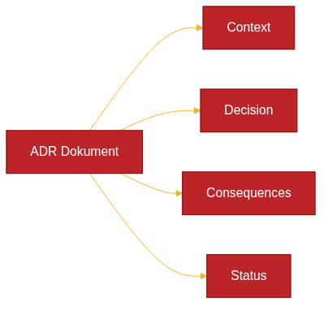

# Architecture Decision Records (ADR)


*Architecture Decision Records representerar en strukturerad metod för att dokumentera viktiga arkitekturbeslut inom kodbaserade system. Processen börjar med problemidentifiering och följer ett systematiskt tillvägagångssätt för att analysera sammanhang, utvärdera alternativ och formulera välgrundade beslut.*

## Övergripande beskrivning

Arkitektur som kod-metodiken utgör grunden för Architecture Decision Records (ADR) som utgör ett systematiskt tillvägagångssätt för att dokumentera viktiga arkitekturbeslut som påverkar systemets struktur, prestanda, säkerhet och underhållbarhet. ADR-metoden introducerades av Michael Nygard och har blivit en etablerad bästa praxis inom moderna systemutveckling.

För svenska organisationer som implementerar Architecture as Code och arkitektur som kod är ADR särskilt värdefullt eftersom det säkerställer att arkitekturbeslut dokumenteras på ett strukturerat sätt som uppfyller efterlevnadskrav och underlättar kunskapsöverföring mellan team och tidsepoker.

ADR fungerar som arkitekturens "commit messages" - korta, fokuserade dokument som fångar sammanhanget (context), problemet, det valda alternativet och konsekvenserna av viktiga arkitekturbeslut. Detta möjliggör spårbarhet och förståelse för varför specifika tekniska val gjordes.

Den svenska digitaliseringsstrategin betonar vikten av transparenta och spårbara beslut inom offentlig sektor. ADR-metoden stödjer dessa krav genom att skapa en revisionsspår av arkitekturbeslut som kan granskas och utvärderas över tid.

## Vad är Architecture Decision Records?

Architecture Decision Records definieras som korta textdokument som fångar viktiga arkitekturbeslut tillsammans med deras kontext och konsekvenser. Varje ADR beskriver ett specifikt beslut, problemet det löser, alternativen som övervägdes och motiveringen bakom det valda alternativet.

ADR-format följer vanligtvis en strukturerad mall som inkluderar:

**Status**: Aktuell status för beslutet (proposed, accepted, deprecated, superseded)
**Context**: Bakgrund och omständigheter som ledde till behovet av beslutet
**Decision**: Det specifika beslutet som fattades
**Consequences**: Förväntade positiva och negativa konsekvenser

Officiella riktlinjer och mallar finns tillgängliga på https://adr.github.io, som fungerar som den primära resursen för ADR-metodiken. Denna webbplats underhålls av ADR-communityn och innehåller standardiserade mallar, verktyg och exempel.

För arkitektur som kod-kontext innebär ADR dokumentation av beslut om teknologival, arkitekturmönster, säkerhetsstrategier och operationella policies som kodifieras i arkitekturdefinitioner.

## Struktur och komponenter av ADR



*Varje ADR följer en standardiserad struktur med fyra huvudkomponenter som säkerställer konsekvent och fullständig dokumentation av arkitekturbeslut.*

### Standardiserad ADR-mall

Varje ADR följer en konsekvent struktur som säkerställer att all relevant information fångas systematiskt:

```markdown
# ADR-XXXX: [Kort beskrivning av beslutet]

## Status
[Proposed | Accepted | Deprecated | Superseded]

## Context
Beskrivning av problemet som behöver lösas och de omständigheter
som ledde till behovet av detta beslut.

## Decision
Det specifika beslutet som fattades, inklusive tekniska detaljer
och arkitektur som kod-implementation approach.

## Consequences
### Positiva konsekvenser
- Förväntade fördelar och förbättringar

### Negativa konsekvenser
- Identifierade risker och begränsningar

### Mitigering
- Åtgärder för att hantera negativa konsekvenser
```

### Numrering och versionering

ADR numreras sekventiellt (ADR-0001, ADR-0002, etc.) för att skapa en kronologisk ordning och enkel referens. Numreringen är permanent - även om ett ADR depreceras eller ersätts behålls originalets nummer.

Versionering hanteras genom Git-historik istället för inline-ändringar. Om ett beslut förändras skapas ett nytt ADR som superseder det ursprungliga, vilket bevarar den historiska kontexten.

### Status lifecycle


*ADR-livscykeln illustrerar hur beslut utvecklas från initialt förslag genom review-processen till arkitektur som kod-implementation, monitoring och eventuell deprecering när nya lösningar behövs.*

ADR genomgår typiskt följande statusar:

**Proposed**: Initialt förslag som undergår review och diskussion
**Accepted**: Godkänt beslut som ska implementeras
**Deprecated**: Beslut som inte längre rekommenderas men kan finnas kvar i system
**Superseded**: Ersatt av ett nyare ADR med referens till ersättaren

## Praktiska exempel på ADR

### Exempel 1: Val av arkitektur som kod-verktyg

Arkitektur som kod-principerna inom detta område

```markdown
# ADR-0003: Val av Terraform för arkitektur som kod

## Status
Accepted

## Context
Organisationen behöver standardisera på ett arkitektur som kod-verktyg
för att hantera AWS och Azure-miljöer. Nuvarande manuella processer
skapar inconsistens och operationella risker.

## Decision
Vi kommer att använda Terraform som primärt arkitektur som kod-verktyg för alla
cloud-miljöer, med HashiCorp Configuration Language (HCL) som
standardsyntax.

## Consequences

### Positiva konsekvenser
- Multi-cloud support för AWS och Azure
- Stor community och omfattande provider-ekosystem
- Deklarativ syntax som matchar våra policy-krav
- State management för spårbarhet

### Negativa konsekvenser
- Inlärningskurva för team som är vana vid imperative scripting
- State file management komplexitet
- Kostnad för Terraform Cloud eller Enterprise features

### Mitigering
- Utbildningsprogram för development teams
- Implementation av Terraform remote state med Azure Storage
- Pilot projekt innan full rollout
```

### Exempel 2: Säkerhetsarkitektur för svenska organisationer

```markdown
# ADR-0007: Zero Trust Network Architecture

## Status
Accepted

## Context
GDPR och MSB:s riktlinjer för cybersäkerhet kräver robusta säkerhetsåtgärder.
Traditionell perimeter-baserad säkerhet är otillräcklig för modern
hybrid cloud-miljö.

## Decision
Implementation av Zero Trust Network Architecture med mikrosegmentering,
multi-factor authentication och kontinuerlig verifiering genom
arkitektur som kod.

## Consequences

### Positiva konsekvenser
- Förbättrad compliance med svenska säkerhetskrav
- Reducerad attack surface genom mikrosegmentering
- Förbättrad auditbarhet och spårbarhet

### Negativa konsekvenser
- Ökad komplexitet i nätverksarkitektur
- Prestationsöverhuvud för kontinuerlig verifiering
- Högre operationella kostnader

### Mitigering
- Fasad implementation med pilot-projekt
- Prestandaövervakning och optimering
- Extensive documentation och training
```

## Verktyg och arkitektur som kod best practices för ADR

### ADR-verktyg och integration

Flera verktyg underlättar creation och management av ADR:

**adr-tools**: Command-line verktyg för att skapa och hantera ADR-filer
**adr-log**: Automatisk generering av ADR-index och timeline
**Architecture Decision Record plugins**: Integration med IDE:er som VS Code

För arkitektur som kod-projekt rekommenderas integration av ADR i Git repository structure:

```
docs/
├── adr/
│   ├── 0001-record-architecture-decisions.md
│   ├── 0002-use-terraform-for-arkitektur som kod.md
│   └── 0003-implement-zero-trust.md
├── infrastructure/
└── README.md
```

### Git-integration och arbetsflöde

ADR fungerar optimalt när integrerat i Git-baserade utvecklingsarbetsflöden:

**Pull Request Reviews**: ADR inkluderas i code review-processen för arkitekturändringar
**Branch Protection**: Kräver ADR för major architectural changes
**Automation**: CI/CD pipelines kan validera att relevant ADR finns för significant changes

### Kvalitetsstandards för svenska organisationer

För att uppfylla svenska compliance-krav bör ADR följa specifika kvalitetsstandards:

**Språk**: ADR kan skrivas på svenska för interna stakeholders med engelska technical terms för verktygskompatibilitet
**Spårbarhet**: Klar länkning mellan ADR och implementerad kod
**Åtkomst**: Transparent access för auditors och compliance officers
**Retention**: Långsiktig arkivering enligt organisatoriska policier

### Gransknings- och styrningsprocess

Effektiv ADR-implementering kräver etablerade granskningsprocesser:

**Intressentengagemang**: Relevanta team och arkitekter involveras i granskning
**Tidsplan**: Definierade tidsgränser för återkoppling och beslut
**Escalation**: Tydliga eskaleringsvägar för disputed decisions
**Approval Authority**: Dokumenterade roller för olika typer av arkitekturbeslut

## Integration med Architecture as Code

ADR spelar en central roll i Architecture as Code-metodik genom att dokumentera designbeslut som sedan implementeras som kod. Denna integration skapar en tydlig koppling mellan intentioner och implementation.

Arkitektur som kod-templates kan referera till relevant ADR för att förklara designbeslut och implementation choices. Detta skapar självdokumenterande infrastruktur där koden kompletteras med arkitekturrational.

Automated validation kan implementeras för att säkerställa att infrastructure code följer established ADR. Policy as Code-verktyg som Open Policy Agent kan enforça arkitekturriktlinjer baserade på documented decisions i ADR.

För svenska organisationer möjliggör denna integration transparent styrning och efterlevnad där arkitekturbeslut kan spåras från initial dokumentation genom implementering till operativ driftsättning.

## Compliance och kvalitetsstandarder

ADR-metodik stödjer svenska compliance-krav genom strukturerad dokumentation som möjliggör:

**Regulatory Compliance**: Systematisk dokumentation för GDPR, PCI-DSS och branschspecifika regleringar
**Audit Readiness**: Komplett spår av arkitekturbeslut och deras rationale
**Risk Management**: Dokumenterade riskbedömningar och mitigation strategies
**Knowledge Management**: Strukturerad kunskapsöverföring mellan team och över tid

Svenska organisationer inom offentlig sektor kan använda ADR för att uppfylla transparenskrav och demokratisk insyn i tekniska beslut som påverkar medborgarservice och datahantering.

## Framtida utveckling och trends

ADR-metodik utvecklas kontinuerligt med integration av nya verktyg och processer:

**AI-assisterade ADR**: Machine learning för att identifiera när nya ADR behövs baserat på code changes
**Automated Decision Tracking**: Integration med architectural analysis verktyg
**Cross-organizational ADR Sharing**: Standardiserade format för sharing av anonymized architectural patterns

För arkitektur som kod-sammanhang utvecklas verktyg för automatisk korrelation mellan ADR och driftsatt infrastruktur, vilket möjliggör realtidsvalidering av arkitektonisk efterlevnad.

Svenska organisationer kan dra nytta av europeiska initiativ för standardisering av digital documentation practices som bygger på ADR-metodologi för ökad interoperabilitet och compliance.

## Sammanfattning


Den moderna arkitektur som kod-metodiken representerar framtiden för infrastrukturhantering i svenska organisationer.
Architecture Decision Records representerar en fundamental komponent i modern Architecture as Code-metodik. Genom strukturerad dokumentation av arkitekturbeslut skapas transparens, spårbarhet och kunskapsöverföring som är kritisk för svenska organisationers digitaliseringsinitiativ.

Effektiv ADR-implementation kräver organisatoriskt stöd, standardiserade processer och integration med befintliga utvecklingsworkflows. För arkitektur som kod-projekt möjliggör ADR koppling mellan designintentioner och kod-implementation som förbättrar maintainability och compliance.

Svenska organisationer som antar ADR-metodik positionerar sig för framgångsrik Architecture as Code-transformation med robusta styrningsprocesser och transparent beslutsdokumentation som stödjer både interna krav och externa efterlevnadsförväntningar.

Källor:
- Architecture Decision Records Community. "ADR Guidelines and Templates." https://adr.github.io
- Nygard, M. "Documenting Architecture Decisions." 2011. 
- ThoughtWorks. "Architecture Decision Records." Technology Radar, 2023.
- Regeringen. "Digital strategi för Sverige." Digitalisering för trygghet, välfärd och konkurrenskraft, 2022.
- MSB. "Vägledning för informationssäkerhet." Myndigheten för samhällsskydd och beredskap, 2023.