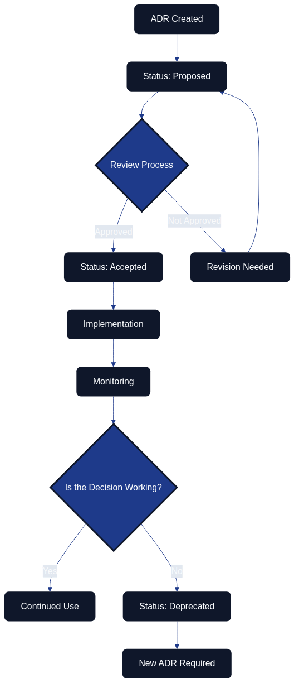

# Architecture Decision Records (ADR)


*Architecture Decision Records represents a structured method for documenting important architecture decisions within code-based systems. The process begins with problem identification and follows a systematic approach to analyze context, evaluate alternatives and formulate well-founded decisions.*

## Overall Description

Architecture as Code methodology forms the foundation for Architecture Decision Records (ADR) which forms a systematic approach for documenting important architecture decisions that affects the system structure, performance, security and maintainability. ADR method was introduced by Michael Nygard and has become an established best practice in modern system development.

For Swedish organizations implementing Architecture as Code, ADR is particularly valuable because it ensures architecture decisions are documented in a structured manner that meets compliance requirements and facilitates knowledge transfer between teams and over time.

ADR functions as architecture's "commit messages" - short, focused documents that capture context (context), problem, the chosen alternative and consequences of important architecture decisions. This enables traceability and understanding for why specific technical choices were made.

The Swedish digitalization strategy emphasizes the importance of transparent and traceable decisions within the public sector. ADR method supports these requirements by creating a audit trail of architecture decisions that can be reviewed and evaluated over time.

## What is Architecture Decision Records?

Architecture Decision Records are defined as short text documents that capture important architecture decisions together with their context and consequences. each ADR describes a specific decision, problem it solves, alternatives that were considered and rationale behind the chosen alternative.

The ADR format follows typically a Structured template that includes:

**Status**: Current status for decision (proposed, accepted, deprecated, superseded)
**Context**: Background and circumstances that led to the need for decision
**Decision**: the specific decision that was made
**Consequences**: Expected positive and negative consequences

Official guidelines and templates are available at https://adr.github.io, which serves as the primary resource for ADR methodology. This website is maintained by the ADR community and contains standardized templates, tools and examples.

In the Architecture as Code context means ADR documentation of decisions about technology choices, architecture patterns, security strategies and operational policies that are codified in architecture definitions.

## structure and components of ADR


*each ADR follows a standardiserad structure with four huvudkomponenter that ensure konsekvent and fullständig documentation of architecture decisions.*

### Standardiserad ADR-template

each ADR follows a konsekvent structure that ensure all relevant information fångas systematiskt:

```markdown
# ADR-XXXX: [Short Description of decision]

## Status
[Proposed | Accepted | Deprecated | Superseded]

## Context
Description of problem as behöver lösas and the circumstances
that led to the need for this decisions.

## Decision
the specific decision that was made, including technical details
and architecture as code-implementation approach.

## Consequences
### Positiva consequences
- Förväntade fördelar and förbättringar

### Negativa consequences
- Identifierade risker and begränsningar

### Mitigering
- Åtgärder to handle negative consequences
```

### Numrering and versionering

ADR numreras sekventiellt (ADR-0001, ADR-0002, etc.) to create a kronologisk ordning and enkel referens. Numreringen is permanent - also about A ADR depreceras or ersätts behålls originalets nummer.

Versionering is managed through Git-history instead for inline-ändringar. about A decisions forändras are created A nytt ADR as superseder the ursprungliga, which bevarar The historiska contexten.

### Status lifecycle



*ADR-livscykeln illustrerar how decisions is developed from initialt forslag through granskningsprocessen to Architecture as Code-implementation, övervakning and eventuell avveckling when new solutions behövs.*

ADR throughgår typically following statusar:

**Foreslagen**: Initialt forslag as throughgår granskning and diskussion
**Accepted**: Godkänt decisions as ska implementeras
**Deprecated**: Beslut as not längre rekommentheir but can finnas kvar in systems
**Superseded**: Ersatt of A nyare ADR with referens to ersättaren

## Praktiska example at ADR

### examples 1: Val of architecture as code tool

Architecture as Code-principerna within This område

```markdown
# ADR-0003: Val of Terraform for architecture as code

## Status
Accepted

## Context
Organisationen behöver standardisera at A architecture as code tool
to handle AWS and Azure-environments. Nuvarande manuella processes
creates inconsistens and operational risker.

## Decision
We will use Terraform as primary architecture as code tool for all
cloud-environments, with HashiCorp Configuration Language (HCL) as
standardsyntax.

## Consequences

### Positiva consequences
- Multi-cloud support for AWS and Azure
- Stor community and comprehensive provider-ekosystem
- Declarative syntax as matchar våra policy-requirements
- State management for traceability

### Negativa consequences
- Inlärningskurva for team as is vana at imperative scripting
- State file management komplexitet
- Kostnad for Terraform Cloud or Enterprise features

### Mitigering
- training programs for development teams
- implementation of Terraform remote state with Azure Storage
- Pilotprojekt before fullständig utrullning
```

### examples 2: Säkerhetsarkitektur for Swedish organizations

```markdown
# ADR-0007: Zero Trust Network Architecture

## Status
Accepted

## Context
GDPR and MSB:s guidelines for cybersäkerhet requires robusta säkerhetsåtgärder.
Traditionell perimeter-baserad säkerhet is otillräcklig for modern
hybrid cloud-miljö.

## Decision
implementation of Zero Trust Network Architecture with mikrosegmentering,
multi-factor authentication and kontinuerlig verification through
architecture as code.

## Consequences

### Positiva consequences
- Förbättrad efterlevnad of svenska säkerhetsrequirements
- Reducerad attack surface through mikrosegmentering
- Förbättrad auditbarhet and traceability

### Negativa consequences
- Ökad komplexitet in nätverksarkitektur
- Prestationsöverhuvud for kontinuerlig verification
- Högre operational kostnader

### Mitigering
- Fasad implementation with pilot-projekt
- Prestandaövervakning and optimering
- Extensive documentation and training
```

## Tools and bästa methods for ADR within architecture as code

### ADR-tools and integration

Flera verktyg facilitates creation and management of ADR:

**adr tool**: Kommandoradsverktyg to create and handle ADR-filer
**adr-log**: Automatisk generering of ADR-index and tidslinje
**Architecture Decision Record plugins**: Integration with IDE:er that VS Code

For Architecture as Code-projekt rekommentheir integration of ADR in Git repository structure:

```
docs/
├── adr/
│   ├── 0001-record-architecture-decisions.md
│   ├── 0002-use-terraform-for-architecture as code.md
│   └── 0003-implement-zero-trust.md
├── infrastructure/
└── README.md
```

### Git-integration and arbetsflöde

ADR functions optimalt when integrerat in Git-baserade utvecklingsarbetsflöden:

**Kodgranskningar**: ADR inklutheir in kodgranskningsprocessen for arkitekturändringar
**Branch Protection**: requires ADR for major architectural changes
**automation**: CI/CD-rörledningar can validate to relevant ADR exist for significant changes

### Kvalitetsstandards for Swedish organizations

to meet svenska compliance requirements bör ADR följa specific kvalitetsstandards:

**Språk**: ADR can skrivas at svenska for interna stakeholders with engelska technical termer for verktygskompatibilitet
**Spårbarhet**: Klar länkning between ADR and implemented code
**Åtkomst**: Transparent togång for revisorer and efterlevnadsansvariga
**Retention**: Långsiktig arkivering according to organizational policier

### Gransknings- and styrningsprocess

Effective ADR-implementation requires etablerade granskningsprocesser:

**Intressentengagemang**: Relevanta team and arkitekter involveras in granskning
**Tidslinje**: Definierade tidsgränser for återkoppling and decisions
**Escalation**: Tydliga eskaleringsvägar for disputed decisions
**Approval Authority**: Dokumenterade roller for different typer of architecture decisions

## Integration with Architecture as Code

ADR spelar a central roll in Architecture as Code-metodik by document design decisions that are then implemented as code. This integration creates a clear link between intentioner and implementation.

Architecture as Code-templates can referera to relevant ADR to forklara design decisions and implementation choices. This creates självdocumentserande infrastructure where the code kompletteras with arkitekturrational.

Automated validation can implementeras to ensure to infrastructure code follows established ADR. Policy as Code tool that Open Policy Agent can enforça arkitekturguidelines baserade at documented decisions in ADR.

For Swedish organizations enables This integration transparent styrning and efterlevnad where architecture decisions can spåras from initial documentation through implementation to operativ driftsättning.

## Efterlevnad and kvalitetsstandarder

ADR-metodik supports svenska compliance requirements through Structured documentation as enables:

**Regleringsefterlevnad**: Systematisk documentation for GDPR, PCI-DSS and branschspecific regleringar
**Audit Readiness**: Komplett spår of architecture decisions and their rationale
**Risk Management**: Dokumenterade riskbedömningar and mitigation strategies
**Knowledge Management**: Structured knowledge transfer between team and over time

Svenska organisationer within the public sector can use ADR to meet transparensrequirements and demokratisk insyn in technical decisions as affects withborgarservice and datahantering.

## Framtida development and trends

ADR-metodik is developed kontinuerligt with integration of new tools and processes:

**AI-assisterade ADR**: Machine learning to identify when new ADR behövs based on code changes
**Automated Decision Tracking**: Integration with architectural analysis verktyg
**Organisationsövergripande ADR-delning**: Standardiserade format for delning of anonymiserade architecture patterns

In the Architecture as Code context is developed verktyg for automatisk korrelation between ADR and driftsatt infrastructure, which enables realtidsvalidering of arkitektonisk efterlevnad.

Svenska organisationer can dra nytta of europeiska initiativ for standardisering of digital documentation practices as builds on ADR-metodologi for increased interoperabilitet and efterlevnad.

## Summary


The modern Architecture as Code methodology represents framtiden for infrastructurehantering in svenska organisationer.
Architecture Decision Records represents a fundamental komponent in modern Architecture as Code-metodik. Through Structured documentation of architecture decisions are created transparency, traceability and knowledge transfer as is critical for svenska organisationers digitaliseringsinitiativ.

Effective ADR-implementation requires organisatoriskt stöd, standardized processes and integration with existing utvecklingsarbetsflöden. For Architecture as Code-projekt enables ADR koppling between designintentioner and code-implementation as improves maintainability and efterlevnad.

Svenska organisationer as antar ADR-metodik position themselves for successful Architecture as Code-transformation with robusta styrningsprocesser and transparent decisionssdocumentsation as supports both interna requirements and externa efterlevnadsforväntningar.

Sources:
- Architecture Decision Records Community. "ADR-guidelines and templates." https://adr.github.io
- Nygard, M. "Documenting Architecture Decisions." 2011. 
- ThoughtWorks. "Architecture Decision Records." Technology Radar, 2023.
- Regeringen. "Digital strategi for Sverige." Digitalisering for trygghet, välfärd and konkurrenskraft, 2022.
- MSB. "Vägledning for informationssäkerhet." Myndigheten for samhällsskydd and beredskap, 2023.