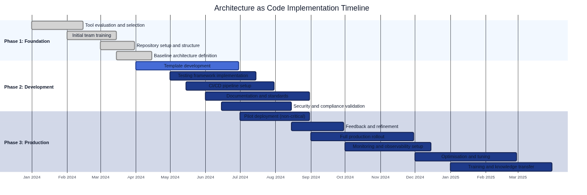

# automation, development and drift samt CI/CD for architecture as code


Continuous integration and continuous deployment (CI/CD) together with development and operations culture forms the backbone in modern software development, and when the applies Architecture as Code becomes These processes even more critical. This chapter explores in-depth how Swedish organizations can implement robust, secure and effective CI/CD-pipelines as transforms infrastructure management from manual, error-prone processes to automated, reliable and traceable operations, while we develop Architecture as Code-methods as handles entire system architecture as code.



Diagram above shows a typical timeline for Architecture as Code-implementation, from initial tool analysis to complete production rollout.

to understand CI/CD for Architecture as Code requires a Fundamental shift in mindset from traditional infrastructure management to code-centric automation. Where traditional methods relied on manual configurations, checklists and ad-hoc solutions, offers modern automation within Architecture as Code consistency, repeatability and transparency throughout the entire infrastructure lifecycle. Architecture as Code represents next development step where development and operations culture and CI/CD-processes encompasses the entire system architecture as a cohesive unit. This paradigm shift is not only technical - the affects organizational structure, workflows and also legal aspects for Swedish companies as must navigate GDPR, svensk data management legislation and sector-specific regulations.

Diagram above illustrerar the Fundamental CI/CD-flow from kodbekräftelse through validation and testing to deployment and monitoring. This flöde represents a systematic metod where each step is utformat to fånga fel early, ensure kvalitet and minimera risker in production environments. For Swedish organizations means This particular considerations about dataplacering, compliance validation and kostnadsoptimering in svenska kronor.

## The teoretiska foundation for CI/CD-automation

Continuous integration and continuous deployment represents mer than only technical processes - the forms a filosofi for software development as prioriterar snabb återkoppling, stegvis improvement and riskminskning through automation. When These principles be applied at Architecture as Code, arises unique possibilities and Challenges as requires deep understanding for both technical and organizational aspects.

### Historisk context and development

The CI/CD concept has its roots in Extreme Programming (XP) and agile methodologies from early 2000s, but the application to infrastructure has developed in parallel with cloud technology's emergence. Early infrastructure administrators relied on manual processes, configuration scripts and "infrastructure as pets" - where each server was unique and required individual care. This approach worked for smaller environments but did not scale for modern, distributed systems with hundreds or thousands components.

The emergence of "infrastructure as cattle" - where servers are treated as standardized, replaceable units - enabled systematic automation that CI/CD-principles could be applied at. Container technology, cloud providers' APIs and tools that Terraform and Ansible accelerated This development by erbjuda programmatic interfaces for infrastructure management.

For Swedish organizations has This development coincided with increasing regulatory requirements, particularly GDPR and Datainspektionens guidelines for technical and organizational security measures. This has created a unique situation where automation not only is a efficiency improvement without a necessity for compliance and risk management.

### fundamental principles for Architecture as Code-automation

**Immutability and version control:** Architecture as Code follows same principles as traditional software development, where all configuration is version-controlled and changes is tracked through git-history. This enables reproducible Architecture as Code where same code-version always produces identical environments. For Swedish organizations means This improved compliance documentation and possibility to demonstrate controllable change of critical systems.

**Declarative configuration:** Architecture as Code tool that Terraform and CloudFormation uses declarative syntax where Developers specifies desired end result rather than steps to reach it. This approach reduces complexity and error sources while the enables sophisticated dependency management and parallelization of infrastructure actions.

**Testability and validation:** Architecture as Code can be tested in the same way as application code through unit tests, integration tests and complete system validation. This enables "shift left"-testing where errors are detected early in development process rather than in production environments where cost of correction is significantly higher.

**Automation over documentation:** instead of rely itself at manual checklists and procedurdocuments as easily becomes outdated, automates CI/CD-pipelines all step in infrastructure distribution. This ensures consistency and reduces human errors while the creates automatic documentation of all performed measures.

### organizational implikationer of CI/CD-automation

implementation of CI/CD for Architecture as Code affects organisationer at multipla levels. Tekniska team must develop new skills within programmatic infrastructure management, with business processes must adapted to dra nytta of accelererad leverancreatecitet.

**cultural transformation:** Övergången to CI/CD-baserad infrastructure requires a cultural shift from risk-averse, manual processes to risk-managed automation. This means to organisationer must develop toit to automated systems with the maintains necessary controls for compliance and security.

**Kompetensuveckling:** IT-personal must develop programmeringskunskaper, understand molnleverantörs-APIs and lära itself advanced automation tools. This kompetensforändring requires investeringar in utbildning and rekrytering of personal with development and drift-skills.

**Compliance and governance:** Swedish organizations must ensure to automated processes meets regulatory requirements. This includes audit trails, data residency controls and separation of duties as traditionally implemented through manual processes.

Which vi saw in [chapter 3 about version control](03_version_control.md), forms CI/CD-pipelines a naturlig forlängning of git-baserade workflows for Architecture as Code. This chapter bygger vidare at These concepts and explores how Swedish organizations can implement advanced automatiseringsstrategier as balanserar effektivitet with regulatory requirements. Later will vi to se how These principles be applied in [Cloud Architecture as Code](07_molnarkitektur.md) and integreras with [security aspects](10_sakerhet.md).

## from architecture as code to Architecture as Code development and drift

Architecture as Code-principerna within This area

Traditional DevOps practices focused primarily at application development and deployment, with Architecture as Code expanded this to architecture management as whole. Architecture as Code represents a evolutionary step where DevOps culture and CI/CD-processes encompasses the entire system architecture as a cohesive unit.

### Holistic DevOps for Architecture as Code

in Architecture as Code-paradigmet are treated all arkitekturkomponenter as code:

- **application architecture:** API-contracts, servicegränser and integrationsmönster
- **Dataarkitektur:** Datamodor, data flows and dataintegrity-rules  
- **InfraStructurearkitektur:** Servrar, nätverk and molnresurser
- **Security Architecture:** Säkerhetspolicier, access controls and efterlevnadsregler
- **Organisationsarkitektur:** TeamStructureer, processes and ansvarwhichråden

This holistiska approach requires DevOps practices as can handle komplexiteten of interconnected arkitekturelement while the maintains hastighet and kvalitet in leveransprocessen.

### Nyckelfaktorer for successful svenska Architecture as Code DevOps

**cultural transformation for helhetsperspektiv:** Swedish organizations must develop a kultur as forstår architecture as a cohesive whole. This requires tvärdiscipliwhent samarbete between Developers, arkitekter, operations-team and affärsanalytiker.

**Governance as code:** all architecture governance, design principles and decisions are codified and is version-controlled. Architecture Decision Records (ADR), design guidelines and compliance requirements becomes del of The codified architecture.

**Full traceability:** From business requirements to implemented architecture must each change vara traceable through entire system landscape. This includes impact on applications, data, infrastructure and organizational processes.

**Svenska efterlevnadsintegration:** GDPR, MSB-security requirements and sektorsspecifik reglering integreras naturligt in arkitekturkoden rather than as externa controls.

**Gemensam arkitekturutveckling:** Svensk konsensuskultur be applied at arkitekturevolution where all stakeholders contributes to arkitekturkodbasen through transparent, demokratiska processes.

## CI/CD-fundamentals for Swedish organizations

Swedish organizations operates in a complex regulatory environment as requires particular attention at implementation of CI/CD-pipelines for Architecture as Code. GDPR, Datainspektionens guidelines, MSB's regulations for critical infrastructure and sector-specific regulations creates a unique context where automation must balance effektivitet with stringent compliance requirements.

### Regulatorisk complexity and automation

The Swedish regulatory landscape affects CI/CD-design at fundamental way. GDPR:s requirements at data protection by design and by default means to pipelines must include automated validation of data protection implementation. Article 25 requires to technical and organizational measures implementeras to ensure to endast personal data as is necessary for specific purposes are treated. For Architecture as Code-pipelines means This automated scanning for GDPR-compliance, data residency-validation and audit trail generation.

Datainspektionens guidelines for technical security measures requires systematic implementation of encryption, access controls and logging. Traditionella manual processes for These controls is not only ineffective without also error-prone when the be applied at modern, dynamic infrastructures. CI/CD-automation offers opportunity to systematiskt enforce These requirements through codified policies as code and automatiserad compliance validation.

MSB's regulations for samhällsviktig operations requires robust incidenthantering, kontinuitetsplanering and systematic riskbedömning. For organisationer within energi, transport, finans and andra critical sektorer must CI/CD-flows include specialiserad validation for operativ motståndskraft and katastrofåterställningcreatecitet.

### Ekonomiska considerations for Swedish organizations

Cost optimization in Swedish kronor requires advanced monitoring and budget controls as traditional CI/CD-pattern not handles. Svenska companies must handle currency exposure, regional price differences and compliance costs as affects infrastructure investments.

Cloud provider prices vary significantly between regioner, and Swedish organizations with data residency requirements is limited to EU regions as often has higher kostnader than globala regioner. CI/CD-pipelines must therefore include cost estimation, budget threshold validation and automatiserad resursoptimering as takes into account Swedish business economics.

Kvartalsvis budgetering and svenska redovisningsstandarder requires detaljerad kostnadsallokering and prognostisering as automated pipelines can leverera through integration with ekonomisystem and automatiserad rapportering in svenska kronor. This enables proaktiv kostnadshantering rather than reaktiv budgetövervakning.

### GDPR-compliant pipeline design

GDPR compliance in CI/CD-pipelines for Architecture as Code requires a holistic approach as integrerar data protection principles in each step of automation-processen. Article 25 in GDPR mandaterar "data protection by design and by default", which means to technical and organizational measures must implementeras from forsta design-stadiet of systems and processes.

For Architecture as Code means This to pipelines must automatically validate to all architecture as is distributed follows GDPR:s principles for data minimization, purpose limitation and storage limitation. Personal data may aldrig hardkodas in architecture configurations, encryption must enforced as standard, and audit trails must is generated for all architecture changes that can affect personal data.

**Dataupptäckt and klassificering:** Automatiserad skanning for personuppgiftsmönster in infrastructurekod is forsta forsvarslinjen for GDPR-compliance. CI/CD-flows must implement advanced skanning as can identify both direkta identifierare (which personnummer) and indirekta identifierare as in kombination can be used to identify individual personer.

**Automated compliance validation:** Policy engines that Open Policy Agent (OPA) or cloud provider-specific compliance tools can automatically validate to infrastructure configurations follows GDPR-requirements. This includes verification of encryption settings, access controls, data retention policies and cross-border data transfer restrictions.

**Audit trail generation:** each pipeline-execution must generera comprehensive audit logs as documents what was distributed, of who, when and why. These logs must themselves follow GDPR-principles for personal data processing and stored securely according to Swedish legal retention requirements.

**GDPR-kompatibel CI/CD Pipeline for Swedish organizations**
*[Se kodexamples 05_CODE_1 in Appendix A: Kodexamples](26_appendix_kodexamples.md#05_code_1)*

This pipeline-examples demonstrerar how Swedish organizations can implement GDPR-compliance direkt in sina CI/CD-processes, including automatic scanning for personal data and data residency validation.

## CI/CD-pipelines for Architecture as Code

Architecture as Code CI/CD-pipelines differs from traditional pipelines by handle multiple interconnected architecture domains simultaneously. instead of focus only at application code or Architecture as Code, validates and deploys These pipelines entire architecture definitions as encompasses applications, data, infrastructure and policies as a cohesive unit.

### Architecture as Code Pipeline-architecture

a Architecture as Code pipeline organiseras in multiple parallella spår as konvergerar at critical decisionsspunkter:

- **Application Architecture Track:** Validates API-contracts, servicedependencies and applikationskompatibilitet
- **Data Architecture Track:** Kontrollerar datamodellforändringar, datalinjekompatibilitet and dataintegritet
- **Infrastructure Architecture Track:** Handles infrastructureforändringar with fokus at applikationsstöd
- **Security Architecture Track:** Enforcar security policies over all architecture domains
- **Governance Track:** Validates compliance with arkitekturprinciper and svenska regulatory requirements

```yaml
# .github/workflows/svenska-architecture-as-code-pipeline.yml
# Comprehensive Architecture as Code pipeline for Swedish organizations

name: Svenska Architecture as Code CI/CD

on:
  push:
    branches: [main, develop, staging]
    paths:
      - 'architecture/**'
      - 'applications/**'
      - 'data/**'
      - 'infrastructure/**'
      - 'policies/**'
  pull_request:
    branches: [main, develop, staging]

env:
  ORGANIZATION_NAME: 'svenska-org'
  AWS_DEFAULT_REGION: 'eu-north-1'  # Stockholm region
  GDPR_COMPLIANCE: 'enabled'
  DATA_RESIDENCY: 'Sweden'
  ARCHITECTURE_VERSION: '2.0'
  COST_CURRENCY: 'SEK'
  AUDIT_RETENTION_YEARS: '7'

jobs:
  # Phase 1: Architecture Validation
  architecture-validation:
    name: '🏗️ Architecture Validation'
    runs-on: ubuntu-latest
    strategy:
      matrix:
        domain: [application, data, infrastructure, security, governance]
    
    steps:
      - name: Checkout Architecture Repository
        uses: actions/checkout@v4
        with:
          fetch-depth: 0
      
      - name: Konfiguration Architecture Verktyg
        run: |
          # Installera arkitekturvalidering tools
          npm install -g @asyncapi/cli @swagger-api/swagger-validator
          pip install architectural-lint yamllint
          curl -L https://github.com/open-policy-agent/conftest/releases/download/v0.46.0/conftest_0.46.0_Linux_x86_64.tar.gz | tar xz
          sudo mv conftest /usr/local/bin
      
      - name: 🇸🇪 Svenska Architecture Compliance Check
        run: |
          echo "🔍 Validating ${{ matrix.domain }} architecture for svenska organisation..."
          
          case "${{ matrix.domain }}" in
            "application")
              # Validate API contracts and service dependencies
              find architecture/applications -name "*.openapi.yml" -exec swagger-validator {} \;
              find architecture/applications -name "*.asyncapi.yml" -exec asyncapi validate {} \;
              
              # Check for GDPR-compliant service design
              conftest verify --policy policies/svenska/gdpr-service-policies.rego architecture/applications/
              ;;
              
            "data")
              # Validate data models and lineage
              python scripts/validate-data-architecture.py
              
              # Check data privacy compliance
              conftest verify --policy policies/svenska/data-privacy-policies.rego architecture/data/
              ;;
              
            "infrastructure")
              # Traditional architecture as code validation within broader architecture context
              terraform -chdir=architecture/infrastructure init -backend=false
              terraform -chdir=architecture/infrastructure validate
              
              # Infrastructure serves application and data requirements
              python scripts/validate-infrastructure-alignment.py
              ;;
              
            "security")
              # Cross-domain security validation
              conftest verify --policy policies/svenska/security-policies.rego architecture/
              
              # GDPR impact assessment
              python scripts/gdpr-impact-assessment.py
              ;;
              
            "governance")
              # Architecture Decision Records validation
              find architecture/decisions -name "*.md" -exec architectural-lint {} \;
              
              # Swedish compliance requirements
              conftest verify --policy policies/svenska/governance-policies.rego architecture/
              ;;
          esac

  # Phase 2: Integration Testing
  architecture-integration:
    name: '🔗 Architecture Integration Testing'
    needs: architecture-validation
    runs-on: ubuntu-latest
    
    steps:
      - name: Checkout Code
        uses: actions/checkout@v4
      
      - name: Architecture Dependency Analysis
        run: |
          echo "🔗 Analyzing architecture dependencies..."
          
          # Check cross-domain dependencies
          python scripts/architecture-dependency-analyzer.py \
            --input architecture/ \
            --output reports/dependency-analysis.json \
            --format svenska
          
          # Validate no circular dependencies
          if python scripts/check-circular-dependencies.py reports/dependency-analysis.json; then
            echo "✅ No circular dependencies found"
          else
            echo "❌ Circular dependencies detected"
            exit 1
          fi
      
      - name: Fullständig arkitektursimulering
        run: |
          echo "🎭 Kör complete architecture simulation..."
          
          # Simulate complete systems with all architectural components
          docker-compose -f test/architecture-simulation/docker-compose.yml up -d
          
          # Wait for systems stabilization
          sleep 60
          
          # Run architectural integration tests
          python test/integration/test-architectural-flows.py \
            --config test/svenska-architecture-config.yml \
            --compliance-mode gdpr
          
          # Cleanup simulation environment
          docker-compose -f test/architecture-simulation/docker-compose.yml down

  # Additional phases continue with deployment, monitoring, documentation, and audit...
```

## Pipeline design principles

Effektiva CI/CD-pipelines for Architecture as Code builds on fundamental design principles as optimerar for speed, safety and observability. These principles must adapted for svenska organisationers unique requirements about compliance, kostnadsoptimering and regulatory reporting.

### Fail-fast feedback and progressive validation

Fail-fast feedback is a core principle where errors are detected and reported as early as possible in development lifecycle. For Architecture as Code means This multilayer validation from syntax checking to comprehensive security scanning before any actual infrastructure is distributed.

**Syntax and static analysis:** Forsta validation-lagret kontrollerar Architecture as Code for syntax errors, undefined variables and basic configuration mistakes. Verktyg that `terraform validate`, `ansible-lint` and cloud provider-specific validatorer capture many fel before kostnadskrävande deployment-forsök.

**Security and compliance scanning:** Specialiserade tools that Checkov, tfsec and Terrascan analyzer Architecture as Code for security misconfigurations and compliance violations. For Swedish organizations is automated GDPR scanning, encryption verification and data residency validation critical components.

**Cost estimation and budget validation:** Infrastructure changes can ha significant economic consequences. Verktyg that Infracost can estimera kostnader for proposed infrastructure changes and validate mot organizational budgets before deployment is performed.

**Policy validation:** Open Policy Agent (OPA) and liknande policy engines enables automated validation mot organizational policies for resource naming, security configurations and architectural standards.

### Progressive deployment strategier

Progressiv deployment minimizes risk through gradual utrullning of infrastructure changes. This is particularly viktigt for Swedish organizations with high togänglighetsrequirements and regulatory forpliktelser.

**Environment promotion:** Ändringar flows through a sekvens of environments (development → staging → production) with increasing validation stringency and manual approval requirements for production deployments.

**Blå-green driftsättningar:** For critical infrastructure components can blå-green deployment be used where parallell infrastructure byggs and be tested before trafik växlar to The new versionen.

**Kanariesläpp:** gradual utrullning of infrastructure changes to a delmängd of resurser or user enables monitoring of impact before complete deployment.

### Automatiserad recovery and katastrofåterställning

Robusta återställningcreateciteter is crucial to upprätthålla systemtoforlitlighet and meet svenska organisationers kontinuitetsrequirements.

**Toståndshantering:** InfraStructuretostånd must is managed at way as enables toforlitlig recovery to previous kända fungerande configurations. This includes automatiserad säkerhetskopiering of Terraform-toståndsfiler and databasögonblicksbilder.

**Hälsoövervakning:** Automatiserade hälsokontroller efter deployment can utlösa automatic recovery about systemforsämring upptäcks. This includes both technical mätvärden (svarstider, felfrekvenser) and verksamhetsmätvärden (transaktionsvolymer, användarengagemang).

**documentation and kommunikation:** Återställningsprocedurer must vara väldocumentserade and available for incidenthanteringsteam. Automatiserade notifikationssystem must informera stakeholders about infrastructure changes and återställningshändelser.

## Automatiserad testningsstrategier

Multi-level testningsstrategier for Architecture as Code includes syntax validation, unit testing of moduler, integration testing of components, and complete testing of kompletta environments. each testnivå adresserar specific risker and kvalitetsaspekter with increasing complexity and exekvering-cost.

Static analysis tools as tflint, checkov, or terrascan integreras to identify säkerhetsrisker, policy violations, and best metodavvikelser. Dynamic testing in sandbox-environments validates actual funktionalitet and performance under realistiska conditions.

### Terratest for Swedish organizations

Terratest forms The most mature solution for automatiserad testing of Terraform-code and enables Go-baserade test suites as validates infrastructure behavior. For Swedish organizations means This particular fokus at GDPR efterlevnadstestning and cost validation:

For a komplett Terratest implementation as validates svenska VPC configuration with GDPR compliance, se [05_CODE_3: Terratest for svenska VPC implementation](#05_CODE_3) in Appendix A.

### Container-based testing with svenska compliance

For containerbaserade infrastructuretester enables Docker and Kubernetes test environments as simulerar production conditions while the maintains isolation and reproducibility:

```dockerfile
# test/Dockerfile.svenska-compliance-test
# Container for svenska architecture as code efterlevnadstestning

FROM ubuntu:22.04

LABEL maintainer="svenska-it-team@organization.se"
LABEL description="Efterlevnadstestning container for svenska architecture as code implementations"

# Installera Fundamental tools
RUN apt-get update && apt-get install -y \
    curl \
    wget \
    unzip \
    jq \
    git \
    python3 \
    python3-pip \
    awscli \
    && rm -rf /var/lib/apt/lists/*

# Installera Terraform
ENV TERRAFORM_VERSION=1.6.0
RUN wget https://releases.hashicorp.com/terraform/${TERRAFORM_VERSION}/terraform_${TERRAFORM_VERSION}_linux_amd64.zip \
    && unzip terraform_${TERRAFORM_VERSION}_linux_amd64.zip \
    && mv terraform /usr/local/bin/ \
    && rm terraform_${TERRAFORM_VERSION}_linux_amd64.zip

# Installera svenska compliance tools
RUN pip3 install \
    checkov \
    terrascan \
    boto3 \
    pytest \
    requests

# Installera OPA/Conftest for policy testing
RUN curl -L https://github.com/open-policy-agent/conftest/releases/download/v0.46.0/conftest_0.46.0_Linux_x86_64.tar.gz | tar xz \
    && mv conftest /usr/local/bin/

# Installera Infracost for svenska kostnadskontroll
RUN curl -fsSL https://raw.githubusercontent.com/infracost/infracost/master/scripts/install.sh | sh \
    && mv /root/.local/bin/infracost /usr/local/bin/

# Skapa svenska compliance test scripts
COPY test-scripts/ /opt/svenska-compliance/

# Sätt svenska locale
RUN apt-get update && apt-get install -y locales \
    && locale-gen sv_SE.UTF-8 \
    && rm -rf /var/lib/apt/lists/*

ENV LANG=sv_SE.UTF-8
ENV LANGUAGE=sv_SE:sv
ENV LC_ALL=sv_SE.UTF-8

# Skapa test workspace
WORKDIR /workspace

# Entry point for compliance testing
ENTRYPOINT ["/opt/svenska-compliance/run-compliance-tests.sh"]
```

## Architecture as Code Testing-strategier

Architecture as Code requires testing-strategier as goes beyond traditional infrastructure- or applikationstestning. testing must validate arkitekturkonsistens over multiple domains, ensure to changes in a arkitekturkomponent not breaks andra parts of systemet, and verifiera to entire architecture meets definierade kvalitetsattribut.

### Holistic Architecture Testing

Architecture as Code testing organiseras in multiple levels:

- **Architecture Unit Tests:** Validates individual arkitekturkomponenter (services, data models, infrastructure modules)
- **Architecture Integration Tests:** Testar samspel between architecture domains (application-data integration, infrastructure-application alignment)
- **Architecture systems Tests:** Verifierar end-to-end arkitekturkvalitet and performance
- **Architecture Acceptance Tests:** Bekräftar to architecture meets business requirements and compliance-requirements

### Svenska Architecture Testing Framework

For Swedish organizations requires Architecture as Code testing particular attention at GDPR-compliance, data residency and arkitekturgovernance:

```python
# test/svenska_architecture_tests.py
# Comprehensive Architecture as Code testing for Swedish organizations

import pytest
import yaml
import json
from typing import Dict, List, Any
from dataclasses import dataclass
from architecture_validators import *

@dataclass
class SvenskaArchitectureTestConfig:
    """Test configuration for svenska Architecture as Code"""
    organization_name: str
    environment: str
    gdpr_compliance: bool = True
    data_residency: str = "Sweden"
    compliance_frameworks: List[str] = None
    
    def __post_init__(self):
        if self.compliance_frameworks is None:
            self.compliance_frameworks = ["GDPR", "MSB", "ISO27001"]

class TestSvenskaArchitectureCompliance:
    """Test suite for svensk arkitekturcompliance"""
    
    def setup_method(self):
        self.config = SvenskaArchitectureTestConfig(
            organization_name="svenska-tech-ab",
            environment="production"
        )
        self.architecture = load_architecture_definition("architecture/")
    
    def test_gdpr_compliance_across_architecture(self):
        """Test GDPR compliance over all architecture domains"""
        # Test application layer GDPR compliance
        app_compliance = validate_application_gdpr_compliance(
            self.architecture.applications,
            self.config
        )
        assert app_compliance.compliant, f"Application GDPR issues: {app_compliance.violations}"
        
        # Test data layer GDPR compliance
        data_compliance = validate_data_gdpr_compliance(
            self.architecture.data_models,
            self.config
        )
        assert data_compliance.compliant, f"Data GDPR issues: {data_compliance.violations}"
        
        # Test infrastructure GDPR compliance
        infra_compliance = validate_infrastructure_gdpr_compliance(
            self.architecture.infrastructure,
            self.config
        )
        assert infra_compliance.compliant, f"Infrastructure GDPR issues: {infra_compliance.violations}"
    
    def test_data_residency_enforcement(self):
        """Test to all data förblir within svenska gränser"""
        residency_violations = check_data_residency_violations(
            self.architecture,
            required_region=self.config.data_residency
        )
        assert len(residency_violations) == 0, f"Data residency violations: {residency_violations}"
    
    def test_architecture_consistency(self):
        """Test arkitekturkonsistens over all domains"""
        consistency_report = validate_architecture_consistency(self.architecture)
        
        # Check application-data consistency
        assert consistency_report.application_data_consistent, \
            f"Application-data inconsistencies: {consistency_report.app_data_issues}"
        
        # Check infrastructure-application alignment
        assert consistency_report.infrastructure_app_aligned, \
            f"Infrastructure-application misalignment: {consistency_report.infra_app_issues}"
        
        # Check security policy coverage
        assert consistency_report.security_coverage_complete, \
            f"Security policy gaps: {consistency_report.security_gaps}"
```

## Cost optimization and budgetkontroll

Swedish organizations must handle infrastructurekostnader with particular attention to valutafluktuationer, regional pricing variations and compliance-relaterade kostnader. CI/CD-pipelines must include sophisticated cost management as goes beyond simple budget alerts.

### Predictive cost modeling

Modern cost optimization requires predictive modeling as can forecast infrastructure costs based on usage patterns, seasonal variations and planned business growth. Machine learning-modor can analyze historical usage data and predict future costs with high accuracy.

**Usage-based forecasting:** Analys of historical resource utilization can predict future capacity requirements and associated costs. This is particularly valuable for auto-scaling environments where resource usage vary dynamiskt.

**Scenario modeling:** "What-if" scenarios for different deployment options enables inforwith decision-making about infrastructure investments. Organisationer can compare costs for different cloud providers, regions and service tiers.

**Seasonal adjustment:** Svenska companies with seasonal business patterns (retail, tourism, education) can optimize infrastructure costs through automated scaling based on predicted demand patterns.

### Swedish-specific cost considerations

Swedish organizations has unique cost considerations as affects infrastructure spending patterns and optimization strategies.

**Currency hedging:** Infrastructure costs in USD exponerar Swedish companies for valutarisk. Cost optimization strategies must ta consideration to currency fluctuations and potential hedging requirements.

**Sustainability reporting:** Ökande corporate sustainability requirements driver interest in energy-efficient infrastructure. Cost optimization must balance financial efficiency with environmental impact.

**Tax implications:** Svenska skatteregler for infrastructure investments, depreciation and operational expenses affects optimal spending patterns and require integration with financial planning systems.

## Monitoring and observability

Pipeline observability includes both execution metrics and business impact measurements. Technical metrics as build time, success rate, and deployment frequency kombineras with business metrics as systems availability and performance indicators.

Alerting strategies ensures snabb respons at pipeline failures and infrastructure anomalies. Integration with incident management systems enables automatic eskalering and notification of relevanta team members based on severity levels and impact assessment.

### Svenska monitoring and alerting

For Swedish organizations requires monitoring particular attention at GDPR compliance, cost tracking in svenska kronor, and integration with svenska incident management processes:

```yaml
# monitoring/svenska-pipeline-monitoring.yaml
# Comprehensive monitoring for svenska architecture as code pipelines

apiVersion: v1
kind: ConfigMap
metadata:
  name: svenska-pipeline-monitoring
  namespace: monitoring
  labels:
    app: pipeline-monitoring
    svenska.se/organization: ${ORGANIZATION_NAME}
    svenska.se/gdpr-compliant: "true"
data:
  prometheus.yml: |
    global:
      scrape_interval: 15s
      evaluation_interval: 15s
      external_labels:
        organization: "${ORGANIZATION_NAME}"
        region: "eu-north-1"
        country: "Sweden"
        gdpr_zone: "compliant"
    
    rule_files:
      - "svenska_pipeline_rules.yml"
      - "gdpr_compliance_rules.yml"
      - "cost_monitoring_rules.yml"
    
    scrape_configs:
      # GitHub Actions metrics
      - job_name: 'github-actions'
        static_configs:
          - targets: ['github-exporter:8080']
        scrape_interval: 30s
        metrics_path: /metrics
        params:
          organizations: ['${ORGANIZATION_NAME}']
          repos: ['infrastructure', 'applications']
      
      # Jenkins metrics for svenska pipelines
      - job_name: 'jenkins-svenska'
        static_configs:
          - targets: ['jenkins:8080']
        metrics_path: /prometheus
        params:
          match[]: 
            - 'jenkins_builds_duration_milliseconds_summary{job=~"svenska-.*"}'
            - 'jenkins_builds_success_build_count{job=~"svenska-.*"}'
            - 'jenkins_builds_failed_build_count{job=~"svenska-.*"}'
```

## DevOps Kultur for Architecture as Code

Architecture as Code requires a mogen DevOps-kultur as can handle komplexiteten of holistic systemtänkande while The maintains agilitet and innovation. For Swedish organizations means This to anpassa DevOps-principles to svenska values about konsensus, transparency and riskhanteiing.

### Svenska Architecture as Code Cultural Practices

- **Transparent Architecture Governance:** all architecture decisions are documented and shared öppet within organisationen
- **Konsensusdriven arkitekturutveckling:** Arkitekturändringar undergoes demokratiska decisionsprocesser with all stakeholders
- **Risk-Aware Innovation:** Innovation balanseras with forsiktig risk management according to svenska organisationskultur
- **Continuous Architecture Learning:** Regelbunden competence development for entire arkitekturlandskapet
- **Collaborative Cross-Domain Teams:** Tvärfunktionella team that owns entire arkitekturstacken

## Summary


The modern Architecture as Code methodology represents framtiden for infrastructure management in Swedish organizations.
Automation, DevOps and CI/CD-pipelines for Architecture as Code forms a critical komponent for Swedish organizations as strävar efter digital excellence and regulatory compliance. by implement robust, automated pipelines can organisationer accelerera arkitekturleveranser while the maintains high standarder for security, quality, and compliance.

Architecture as Code represents next evolutionary step where DevOps culture and CI/CD-processes encompasses the entire system architecture as a cohesive unit. This holistiska approach requires sophisticated pipelines as can handle applications, data, infrastructure and policies as an integrated whole, while svenska compliance-requirements uppfylls.

Swedish organizations has specific requirements as affects pipeline design, including GDPR compliance validation, svenska data residency requirements, cost optimization in svenska kronor, and integration with svenska business processes. These requirements requires specialized pipeline stages as automated compliance checking, cost threshold validation, and comprehensive audit logging according to svenska lagrequirements.

Modern CI/CD approaches that GitOps, progressive delivery, and infrastructure testing enables sophisticated deployment strategies as minimizes risk while the maximerar deployment velocity. For Swedish organizations means This particular fokus at blue-green deployments for production systems, canary releases for gradual rollouts, and automated rollback capabilities for snabb recovery.

Testing strategier for Architecture as Code includes multiple levels from syntax validation to comprehensive integration testing. Terratest and container-based testing frameworks enables automated validation of GDPR compliance, cost thresholds, and security requirements as an integrated part of deployment pipelines.

Monitoring and observability for svenska Architecture as Code pipelines requires comprehensive metrics collection as includes both technical performance indicators and business compliance metrics. Automated alerting ensures rapid response to compliance violations, cost overruns, and technical failures through integration with svenska incident management processes.

Investment in sophisticated CI/CD-pipelines for Architecture as Code betalar itself through reduced deployment risk, improved compliance posture, faster feedback cycles, and enhanced operational reliability. Which vi will to se in [chapter 6 about molnarkitektur](06_cloud_architecture.md), becomes These capabilities even more critical when Swedish organizations adopterar cloud-native architectures and multi-cloud strategies.

successful implementation of CI/CD for Architecture as Code requires balance between automation and human oversight, particularly for production deployments and compliance-critical changes. Swedish organizations as investerar in mature pipeline automation and comprehensive testing strategies uppnår significant competitive advantages through improved deployment reliability and accelerated innovation cycles.

References:
- Jenkins. "Architecture as Code with Jenkins." Jenkins Documentation.
- GitHub Actions. "CI/CD for Architecture as Code." GitHub Documentation.
- Azure DevOps. "Architecture as Code Pipelines." Microsoft Azure Documentation.
- GitLab. "GitOps and Architecture as Code." GitLab Documentation.
- Terraform. "Automated Testing for Terraform." HashiCorp Learn Platform.
- Kubernetes. "GitOps Principles and Practices." Cloud Native Computing Foundation.
- GDPR.eu. "Infrastructure Compliance Requirements." GDPR Guidelines.
- Swedish Data Protection Authority. "Technical and Organizational Measures." Datainspektionen Guidelines.
- ThoughtWorks. "Architecture as Code: The Next Evolution." Technology Radar, 2024.
- The DevOps Institute. "Architecture-Driven DevOps Practices." DevOps Research and Assessment.
- Datainspektionen. "GDPR for Swedish organizations." Guidance about personal data processing.
- Myndigheten for societal protection and beredskap (MSB). "Säkerhetsskydd for informationssystem." MSBFS 2020:6.