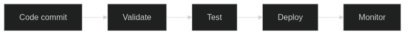

# Automatisering och CI/CD-pipelines



Kontinuerlig integration och kontinuerlig deployment (CI/CD) utgör ryggraden i modern mjukvaruutveckling, och när det gäller Infrastructure as Code (IaC) blir dessa processer ännu mer kritiska. I detta kapitel utforskar vi djupgående hur svenska organisationer kan implementera robusta, säkra och effektiva CI/CD-pipelines som förvandlar infrastrukturhantering från manuella, felbenägna processer till automatiserade, pålitliga och spårbara operationer.

Att förstå CI/CD för Infrastructure as Code kräver en fundamental förskjutning i tankesättet från traditionell infrastrukturhantering till kod-centrerad automation. Där traditionella metoder förlitade sig på manuella konfigurationer, checklistor och ad-hoc-lösningar, erbjuder modern IaC-automation konsistens, repeterbarhet och transparens genom hela infrastrukturlivscykeln. Detta paradigmskifte är inte bara tekniskt - det påverkar organisationsstruktur, arbetsflöden och även juridiska aspekter för svenska företag som måste navigera GDPR, svensk datahanteringslagstiftning och sektorsspecifika regleringar.

Diagrammet ovan illustrerar det grundläggande CI/CD-flödet från kod-commit genom validering och testning till deployment och monitoring. Detta flöde representerar en systematisk approach där varje steg är designat för att fånga fel tidigt, säkerställa kvalitet och minimera risker i produktionsmiljöer. För svenska organisationer innebär detta särskilda överväganden kring data residency, compliance-validering och kostnadsoptimering i svenska kronor.

## Den teoretiska grunden för CI/CD-automation

Continuous Integration och Continuous Deployment representerar mer än bara tekniska processer - de utgör en filosofi för mjukvaruutveckling som prioriterar snabb feedback, incrementell förbättring och riskreducering genom automation. När dessa principer appliceras på Infrastructure as Code, uppstår unika möjligheter och utmaningar som kräver djup förståelse för både tekniska och organisatoriska aspekter.

### Historisk kontext och utveckling

CI/CD-konceptet har sina rötter i Extreme Programming (XP) och Agile-metodologier från tidigt 2000-tal, men tillämpningen på infrastruktur har utvecklats parallellt med molnteknologins framväxt. Tidiga infrastrukturadministratörer förlitade sig på manuella processer, konfigurationsskript och "infrastructure as pets" - där varje server var unik och kräve individuell omsorg. Detta approach fungerade för mindre miljöer men skalade inte för moderna, distribuerade system med hundratals eller tusentals komponenter.

Framväxten av "infrastructure as cattle" - där servrar behandlas som standardiserade, utbytbara enheter - möjliggjorde systematic automation som CI/CD-principer kunde tillämpas på. Container-teknologi, molnleverantörers API:er och verktyg som Terraform och Ansible accelererade denna utveckling genom att erbjuda programmatiska interfaces för infrastrukturhantering.

För svenska organisationer har denna utveckling sammanfallit med ökande regulatoriska krav, särskilt GDPR och Datainspektionens riktlinjer för tekniska och organisatoriska säkerhetsåtgärder. Detta har skapat en unik situation där automation inte bara är en effektivitetsförbättring utan en nödvändighet för compliance och riskhanteiing.

### Fundamentala principer för IaC-automation

**Immutability och versionkontroll:** Infrastruktur som kod följer samma principer som traditionell mjukvaruutveckling, där all konfiguration versionshanteras och förändringar spåras genom git-historik. Detta möjliggör reproducerbar infrastruktur där samma kod-version alltid producerar identiska miljöer. För svenska organisationer innebär detta förbättrad compliance-dokumentation och möjlighet att demonstrera kontrollerbar förändring av kritiska system.

**Declarative konfiguration:** IaC-verktyg som Terraform och CloudFormation använder deklarativ syntax där utvecklare specificerar önskat slutresultat snarare än stegen för att nå dit. Detta approach reducerar komplexitet och felkällor samtidigt som det möjliggör sophisticated dependency management och parallelisering av infrastrukturåtgärder.

**Testbarhet och validering:** Infrastrukturkod kan testas på samma sätt som applikationskod genom unit tests, integration tests och end-to-end-validering. Detta möjliggör "shift-left" testing där fel upptäcks tidigt i utvecklingsprocessen snarare än i produktionsmiljöer där kostnaden för korrigering är betydligt högre.

**Automation över dokumentation:** Istället för att förlita sig på manuella checklistor och procedurdokument som lätt blir föråldrade, automatiserar CI/CD-pipelines alla steg i infrastrukturdistribution. Detta säkerställer konsistens och reducerar human error samtidigt som det skapar automatisk dokumentation av alla genomförda åtgärder.

### Organisatoriska implikationer av CI/CD-automation

Implementering av CI/CD för Infrastructure as Code påverkar organisationer på multipla nivåer. Tekniska team måste utveckla nya färdigheter inom programmatic infrastructure management, medan affärsprocesser måste anpassas för att dra nytta av accelererad leveranskapacitet.

**Kulturell transformation:** Övergången till CI/CD-baserad infrastruktur kräver en kulturell förskjutning från risk-averse, manuella processer till risk-managed automation. Detta innebär att organisationer måste utveckla tillit till automatiserade system medan de behåller nödvändiga kontroller för compliance och säkerhet.

**Kompetensuveckling:** IT-professional måste utveckla programmeringskunskaper, förstå cloud provider APIs och lära sig avancerade automation-verktyg. Denna kompetensförändring kräver investment i training och recruitment av personal med DevOps-färdigheter.

**Compliance och governance:** Svenska organisationer måste säkerställa att automatiserade processer uppfyller regulatoriska krav. Detta inkluderar audit trails, data residency controls och separtion of duties som traditionellt implementerats genom manuella processer.

Som vi såg i [kapitel 3 om versionhantering](03_versionhantering.md), utgör CI/CD-pipelines en naturlig förlängning av git-baserade workflows för infrastrukturkod. Detta kapitel bygger vidare på dessa koncept och utforskar hur svenska organisationer kan implementera avancerade automation-strategier som balanserar effektivitet med regulatoriska krav. Senare kommer vi att se hur dessa principles tillämpas i [molnarkitektur som kod](07_molnarkitektur.md) och integreras med [säkerhetsaspekter](10_sakerhet.md).

## CI/CD-fundamentals för svenska organisationer

Svenska organisationer opererar i en komplex regulatorisk miljö som kräver särskild uppmärksamhet vid implementering av CI/CD-pipelines för Infrastructure as Code. GDPR, Datainspektionens riktlinjer, MSB:s föreskrifter för kritisk infrastruktur och sektorsspecifika regleringar skapar en unik kontext där automation måste balansera effektivitet med stringenta compliance-krav.

### Regulatorisk komplexitet och automation

Den svenska regulatoriska landskapet påverkar CI/CD-design på fundamentala sätt. GDPR:s krav på data protection by design och by default innebär att pipelines måste inkludera automatiserad validering av dataskydd-implementering. Article 25 kräver att tekniska och organisatoriska åtgärder implementeras för att säkerställa att endast personuppgifter som är nödvändiga för specifika ändamål behandlas. För IaC-pipelines innebär detta automatiserad scanning för GDPR-compliance, data residency-validering och audit trail-generering.

Datainspektionens riktlinjer för tekniska säkerhetsåtgärder kräver systematisk implementation av kryptering, access controls och logging. Traditionella manuella processer för dessa kontroller är inte bara ineffektiva utan också felbenägna när de tillämpas på moderna, dynamiska infrastrukturer. CI/CD-automation erbjuder möjligheten att systematiskt enforça dessa krav genom kodifierade policies och automatiserad compliance-validering.

MSB:s föreskrifter för samhällsviktig verksamhet kräver robust incidenthantering, kontinuitetsplanering och systematisk riskbedömning. För organisationer inom energi, transport, finans och andra kritiska sektorer måste CI/CD-pipelines inkludera specialized validering för operational resilience och disaster recovery-kapacitet.

### Ekonomiska överväganden för svenska organisationer

Kostnadsoptimering i svenska kronor kräver sophisticated monitoring och budgetkontroller som traditionella CI/CD-patterns inte addresserar. Svenska företag måste hantera valutaexponering, regionala prisskillnader och compliance-kostnader som påverkar infrastrukturinvesteringar.

Cloud provider pricing varierar betydligt mellan regioner, och svenska organisationer med data residency-krav är begränsade till EU-regioner som ofta har högre kostnader än globala regioner. CI/CD-pipelines måste därför inkludera cost estimation, budget threshold-validering och automated resource optimization som tar hänsyn till svensk företagsekonomi.

Quarterly budgetering och svenska redovisningsstandarder kräver detailed cost attribution och forecasting som automatiserade pipelines kan leverera genom integration med ekonomisystem och automated reporting i svenska kronor. Detta möjliggör proaktiv kostnadshantering snarare än reaktiv budgetövervakning.

### Teknisk skuld och legacy system-integration

Svenska organisationer har ofta betydande investeringar i legacy-system som måste integreras med moderna CI/CD-approaches. Mainframe-system, on-premises infrastrukturer och proprietära lösningar kräver hybrid automation-strategier som kan hantera både moderna cloud-native workloads och traditionella system.

Incremental modernisation genom CI/CD möjliggör gradual övergång från legacy till modern infrastruktur utan disruptive big-bang migrations. Detta approach reducerar risk och möjliggör learning och anpassning under transformationsprocessen.

Integration med svenska leverantörer och lokala tjänsteleverantörer kräver också specialized CI/CD-konfigurationer som kan hantera olika API:er, autentiseringssystem och SLA-krav. Detta komplexitet kräver modulär pipeline-design som kan anpassas för olika leverantörer och tjänster.

### GDPR-compliant pipeline design

GDPR compliance i CI/CD-pipelines för Infrastructure as Code kräver en holistisk approach som integrerar data protection principles i varje steg av automation-processen. Article 25 i GDPR mandaterar "data protection by design och by default", vilket innebär att tekniska och organisatoriska åtgärder måste implementeras från första design-stadiet av system och processer.

För Infrastructure as Code betyder detta att pipelines måste automatiskt validera att all infrastruktur som distribueras följer GDPR:s principer för data minimization, purpose limitation och storage limitation. Personal data får aldrig hardkodas i infrastrukturkonfigurationer, kryptering måste enforças som standard, och audit trails måste genereras för alla infrastrukturändringar som kan påverka personuppgifter.

**Data discovery och klassificering:** Automatiserad scanning för personal data patterns i infrastructure code är första försvarslinjen för GDPR compliance. CI/CD-pipelines måste implementera sophisticated scanning som kan identifiera både direkta identifierare (som personnummer) och indirekta identifierare som i kombination kan användas för att identifiera enskilda personer.

**Automated compliance validation:** Policy engines som Open Policy Agent (OPA) eller cloud provider-specifika compliance-verktyg kan automatiskt validera att infrastrukturkonfigurationer följer GDPR-requirements. Detta inkluderar verification av encryption settings, access controls, data retention policies och cross-border data transfer restrictions.

**Audit trail generation:** Varje pipeline-execution måste generera comprehensive audit logs som dokumenterar vad som distribuerats, av vem, när och varför. Dessa logs måste själva följa GDPR-principer för personuppgiftsbehandling och lagras säkert enligt svenska legal retention requirements.

**GDPR-kompatibel CI/CD Pipeline för svenska organisationer**
*[Se kodexempel 05_CODE_1 i Appendix A: Kodexempel](26_appendix_kodexempel.md#05_code_1)*

Detta pipeline-exempel demonstrerar hur svenska organisationer kan implementera GDPR-compliance direkt i sina CI/CD-processer, inklusive automatisk scanning för personuppgifter och data residency validation.

**Data residency enforcement:** Svenska organisationer måste säkerställa att all personuppgiftsbehandling sker inom EU/EEA enligt GDPR:s transferbestämmelser. CI/CD-pipelines måste automatiskt validera att infrastruktur endast distribueras till godkända regioner och att data residency-krav efterlevs.

**Audit trail requirements:** GDPR:s accountability principle kräver comprehensive dokumentation av alla processingaktiviteter. CI/CD-pipelines måste generera detailed audit logs som dokumenterar infrastrukturändringar, access patterns och compliance-status enligt svenska retention requirements.

## Pipeline design principles

Effektiva CI/CD-pipelines för Infrastructure as Code bygger på fundamentala design principles som optimerar för speed, safety och observability. Dessa principles måste anpassas för svenska organisationers unika krav kring compliance, kostnadsoptimering och regulatory reporting.

### Fail-fast feedback och progressive validation

Fail-fast feedback är en core principle där fel upptäcks och rapporteras så tidigt som möjligt i development lifecycle. För IaC innebär detta multilayer validation från syntax checking till comprehensive security scanning innan någon faktisk infrastruktur distribueras.

**Syntax och static analysis:** Första validation-lagret kontrollerar infrastrukturkod för syntax errors, undefined variables och basic configuration mistakes. Verktyg som `terraform validate`, `ansible-lint` och cloud provider-specifika validatorer fångar många fel innan kostnadskrävande deployment-försök.

**Security och compliance scanning:** Specialiserade verktyg som Checkov, tfsec och Terrascan analyserar infrastrukturkod för security misconfigurations och compliance violations. För svenska organisationer är automated GDPR scanning, encryption verification och data residency validation kritiska komponenter.

**Cost estimation och budget validation:** Infrastructure changes kan ha betydande ekonomiska konsekvenser. Verktyg som Infracost kan estimera kostnader för föreslagna infrastrukturändringar och validera mot organizational budgets innan deployment genomförs.

**Policy validation:** Open Policy Agent (OPA) och liknande policy engines möjliggör automated validation mot organizational policies för resource naming, security configurations och architectural standards.

### Progressive deployment strategier

Progressive deployment minimerar risk genom gradual rollout av infrastrukturändringar. Detta är särskilt viktigt för svenska organisationer med high availability requirements och regulatory obligations.

**Environment promotion:** Ändringar flödar genom en sekvens av miljöer (development → staging → production) med increasing validation stringency och manual approval requirements för production deployments.

**Blue-green deployments:** För kritiska infrastrukturkomponenter kan blue-green deployment användas där parallel infrastruktur byggs och testas innan traffic switchar till den nya versionen.

**Canary releases:** Gradual rollout av infrastrukturändringar till en subset av resources eller users möjliggör monitoring av impact innan full deployment.

### Automated rollback och disaster recovery

Robust rollback capabilities är essentiella för maintaining system reliability och meeting svenska organisationers business continuity requirements.

**State management:** Infrastructure state måste hanteras på sätt som möjliggör reliable rollback till previous known-good configurations. Detta inkluderar automated backup av Terraform state files och database snapshots.

**Health monitoring:** Automated health checks efter deployment kan trigga automatisk rollback om system degradation upptäcks. Detta inkluderar både technical metrics (response times, error rates) och business metrics (transaction volumes, user engagement).

**Documentation och kommunikation:** Rollback procedures måste vara well-documented och accessible för incident response teams. Automated notification systems måste informera stakeholders om infrastructure changes och rollback events.

## Kostnadsoptimering och budgetkontroll

Svenska organisationer måste hantera infrastrukturkostnader med particular attention till valutafluktuationer, regional pricing variations och compliance-relaterade kostnader. CI/CD-pipelines måste inkludera sophisticated cost management som går beyond simple budget alerts.

### Predictive cost modeling

Modern cost optimization kräver predictive modeling som kan forecast infrastructure costs baserat på usage patterns, seasonal variations och planned business growth. Machine learning-modeller kan analysera historical usage data och predict future costs med high accuracy.

**Usage-based forecasting:** Analys av historical resource utilization kan predict future capacity requirements och associated costs. Detta är särskilt värdefullt för auto-scaling environments där resource usage varierar dynamiskt.

**Scenario modeling:** "What-if" scenarios för olika deployment options möjliggör informed decision-making om infrastructure investments. Organisationer kan compare costs för different cloud providers, regions och service tiers.

**Seasonal adjustment:** Svenska företag med seasonal business patterns (retail, tourism, education) kan optimize infrastructure costs genom automated scaling baserat på predicted demand patterns.

### Automated cost optimization

CI/CD-pipelines kan implementera automated cost optimization som kontinuerligt optimerar infrastructure för cost efficiency utan manual intervention.

**Resource rightsizing:** Automated analysis av resource utilization kan identify oversized instances och recommend rightsizing för optimal cost-performance ratio.

**Reserved instance optimization:** För predictable workloads kan pipelines automatiskt köpa reserved instances när cost savings justify the commitment.

**Lifecycle management:** Automated lifecycle policies för storage, backups och archived data kan significantly reduce storage costs genom intelligent tiering och deletion of obsolete data.

### Swedish-specific cost considerations

Svenska organisationer har unique cost considerations som påverkar infrastructure spending patterns och optimization strategies.

**Currency hedging:** Infrastructure costs i USD exponerar svenska företag för valutarisk. Cost optimization strategies måste ta hänsyn till currency fluctuations och potential hedging requirements.

**Sustainability reporting:** Ökande corporate sustainability requirements driver interest i energy-efficient infrastructure. Cost optimization måste balansera financial efficiency med environmental impact.

**Tax implications:** Svenska skatteregler för infrastructure investments, depreciation och operational expenses påverkar optimal spending patterns och require integration med financial planning systems.

## Pipeline design principles

Effektiva IaC-pipelines bygger på principerna för fail-fast feedback och progressive deployment. Tidiga valideringssteg identifierar problem innan kostsamma infrastrukturförändringar initieras, medan senare steg säkerställer funktional korrekthet och säkerhetsefterlevnad.

Pipeline stages organiseras logiskt med tydliga entry/exit criteria för varje steg. Parallellisering av oberoende tasks accelererar execution time, medan sequential dependencies säkerställer korrekt ordning för kritiska operationer som säkerhetsscanning och cost validation.

### Svenska pipeline architecture patterns

För svenska organisationer kräver pipeline design särskild uppmärksamhet på regulatory compliance, cost optimization i svenska kronor, och data residency requirements. Modern pipeline architectures implementerar dessa krav genom specialized validation stages och automated compliance checks:

För en detaljerad Jenkins pipeline implementation som hanterar svenska compliance-krav och GDPR, se [05_CODE_2: Jenkins Pipeline för svenska organisationer](#05_CODE_2) i Appendix A.

## Automated testing strategier

Multi-level testing strategies för IaC inkluderar syntax validation, unit testing av moduler, integration testing av komponenter, och end-to-end testing av kompletta miljöer. Varje testnivå adresserar specifika risker och kvalitetsaspekter med ökande komplexitet och exekvering-cost.

Static analysis tools som tflint, checkov, eller terrascan integreras för att identifiera säkerhetsrisker, policy violations, och best practice deviations. Dynamic testing i sandbox-miljöer validerar faktisk funktionalitet och prestanda under realistiska conditions.

### Terratest för svenska organisationer

Terratest utgör den mest mature lösningen för automated testing av Terraform-kod och möjliggör Go-baserade test suites som validerar infrastructure behavior. För svenska organisationer innebär detta särskild fokus på GDPR compliance testing och cost validation:

För en komplett Terratest implementation som validerar svenska VPC konfiguration med GDPR compliance, se [05_CODE_3: Terratest för svenska VPC implementation](#05_CODE_3) i Appendix A.

### Container-based testing med svenska compliance

För containerbaserade infrastrukturtester möjliggör Docker och Kubernetes test environments som simulerar production conditions samtidigt som de bibehåller isolation och reproducibility:

```dockerfile
# test/Dockerfile.svenska-compliance-test
# Container för svenska IaC compliance testing

FROM ubuntu:22.04

LABEL maintainer="svenska-it-team@organization.se"
LABEL description="Compliance testing container för svenska IaC implementationer"

# Installera grundläggande verktyg
RUN apt-get update && apt-get install -y \
    curl \
    wget \
    unzip \
    jq \
    git \
    python3 \
    python3-pip \
    awscli \
    && rm -rf /var/lib/apt/lists/*

# Installera Terraform
ENV TERRAFORM_VERSION=1.6.0
RUN wget https://releases.hashicorp.com/terraform/${TERRAFORM_VERSION}/terraform_${TERRAFORM_VERSION}_linux_amd64.zip \
    && unzip terraform_${TERRAFORM_VERSION}_linux_amd64.zip \
    && mv terraform /usr/local/bin/ \
    && rm terraform_${TERRAFORM_VERSION}_linux_amd64.zip

# Installera svenska compliance verktyg
RUN pip3 install \
    checkov \
    terrascan \
    boto3 \
    pytest \
    requests

# Installera OPA/Conftest för policy testing
RUN curl -L https://github.com/open-policy-agent/conftest/releases/download/v0.46.0/conftest_0.46.0_Linux_x86_64.tar.gz | tar xz \
    && mv conftest /usr/local/bin/

# Installera Infracost för svenska kostnadskontroll
RUN curl -fsSL https://raw.githubusercontent.com/infracost/infracost/master/scripts/install.sh | sh \
    && mv /root/.local/bin/infracost /usr/local/bin/

# Skapa svenska compliance test scripts
COPY test-scripts/ /opt/svenska-compliance/

# Sätt svenska locale
RUN apt-get update && apt-get install -y locales \
    && locale-gen sv_SE.UTF-8 \
    && rm -rf /var/lib/apt/lists/*

ENV LANG=sv_SE.UTF-8
ENV LANGUAGE=sv_SE:sv
ENV LC_ALL=sv_SE.UTF-8

# Skapa test workspace
WORKDIR /workspace

# Entry point för compliance testing
ENTRYPOINT ["/opt/svenska-compliance/run-compliance-tests.sh"]
```

```bash
#!/bin/bash
# test-scripts/run-compliance-tests.sh
# Svenska compliance test runner

set -e

echo "🇸🇪 Startar svenska IaC compliance testing..."

# Sätt svenska timezone
export TZ="Europe/Stockholm"

# Validera required environment variables
REQUIRED_VARS=(
    "ORGANIZATION_NAME"
    "ENVIRONMENT"
    "COST_CENTER"
    "AWS_REGION"
)

for var in "${REQUIRED_VARS[@]}"; do
    if [ -z "${!var}" ]; then
        echo "❌ Required environment variable $var is not set"
        exit 1
    fi
done

# Validera svenska data residency
if [[ ! "$AWS_REGION" =~ ^eu-(north|central|west)-[0-9]$ ]]; then
    echo "❌ AWS_REGION måste vara EU region för svenska data residency"
    echo "   Tillåtna regioner: eu-north-1, eu-central-1, eu-west-1"
    exit 1
fi

echo "✅ Environment variables validerade"
echo "   Organisation: $ORGANIZATION_NAME"
echo "   Miljö: $ENVIRONMENT"
echo "   Kostnadscenter: $COST_CENTER"
echo "   AWS Region: $AWS_REGION"

# 1. GDPR Compliance Testing
echo ""
echo "🛡️ Kör GDPR compliance tests..."

cd /workspace

# Scan för personal data i kod
echo "🔍 Scanning för personal data patterns..."
PERSONAL_DATA_FOUND=false

PERSONAL_DATA_PATTERNS=(
    "personnummer"
    "social.*security"
    "credit.*card"
    "bank.*account" 
    "email.*address"
    "phone.*number"
    "date.*of.*birth"
)

for pattern in "${PERSONAL_DATA_PATTERNS[@]}"; do
    if grep -ri "$pattern" . --include="*.tf" --include="*.yaml" --include="*.json"; then
        echo "❌ GDPR VIOLATION: Personal data pattern found: $pattern"
        PERSONAL_DATA_FOUND=true
    fi
done

if [ "$PERSONAL_DATA_FOUND" = true ]; then
    echo "❌ Personal data får inte hardkodas i IaC-kod"
    exit 1
fi

echo "✅ GDPR data scan genomförd - inga violations"

# 2. Security Compliance Testing
echo ""
echo "🔒 Kör security compliance tests..."

# Checkov security scanning
echo "Running Checkov security scan..."
checkov -d . \
    --framework terraform \
    --check CKV_AWS_18,CKV_AWS_21,CKV_AWS_131,CKV_AWS_144 \
    --output json \
    --output-file checkov-results.json \
    --soft-fail

# Analysera Checkov results
CRITICAL_ISSUES=$(jq '.results.failed_checks | map(select(.severity == "CRITICAL")) | length' checkov-results.json)

if [ "$CRITICAL_ISSUES" -gt 0 ]; then
    echo "❌ $CRITICAL_ISSUES kritiska säkerhetsproblem funna"
    jq '.results.failed_checks | map(select(.severity == "CRITICAL"))' checkov-results.json
    
    if [ "$ENVIRONMENT" = "production" ]; then
        echo "❌ Kritiska säkerhetsproblem inte tillåtna för production"
        exit 1
    fi
else
    echo "✅ Inga kritiska säkerhetsproblem funna"
fi

# 3. Svenska Policy Compliance
echo ""
echo "📋 Kör svenska policy compliance tests..."

# Skapa svenska OPA policies
mkdir -p policies

cat > policies/svenska-tagging.rego << 'EOF'
package svenska.tagging

required_tags := [
    "Environment", "Organization", "CostCenter", 
    "Country", "GDPRCompliant", "DataResidency"
]

deny[msg] {
    input.resource[resource_type][name]
    resource_type != "data"
    not input.resource[resource_type][name].tags
    msg := sprintf("Resource %s.%s saknar obligatoriska tags", [resource_type, name])
}

deny[msg] {
    input.resource[resource_type][name].tags
    required_tag := required_tags[_]
    not input.resource[resource_type][name].tags[required_tag]
    msg := sprintf("Resource %s.%s saknar obligatorisk tag: %s", [resource_type, name, required_tag])
}

deny[msg] {
    input.resource[resource_type][name].tags.Country
    input.resource[resource_type][name].tags.Country != "Sweden"
    msg := sprintf("Resource %s.%s måste ha Country=Sweden för svenska data residency", [resource_type, name])
}
EOF

cat > policies/svenska-encryption.rego << 'EOF'
package svenska.encryption

deny[msg] {
    input.resource.aws_s3_bucket[name]
    not input.resource.aws_s3_bucket[name].server_side_encryption_configuration
    msg := sprintf("S3 bucket %s måste ha encryption aktiverat för GDPR compliance", [name])
}

deny[msg] {
    input.resource.aws_ebs_volume[name]
    not input.resource.aws_ebs_volume[name].encrypted
    msg := sprintf("EBS volume %s måste vara krypterat för GDPR compliance", [name])
}

deny[msg] {
    input.resource.aws_db_instance[name]
    not input.resource.aws_db_instance[name].storage_encrypted
    msg := sprintf("RDS instance %s måste ha storage encryption för GDPR compliance", [name])
}
EOF

# Kör Conftest policy validation
echo "Validerar svenska policies..."
for tf_file in $(find . -name "*.tf"); do
    echo "Checking $tf_file..."
    conftest verify --policy policies/ "$tf_file" || {
        echo "❌ Policy violation i $tf_file"
        exit 1
    }
done

echo "✅ Svenska policy compliance validerat"

# 4. Cost Analysis
echo ""
echo "💰 Kör kostnadskontroll för svenska budgetar..."

# Sätt budget limits (i SEK per månad)
case "$ENVIRONMENT" in
    "development") MAX_MONTHLY_COST_SEK=5000 ;;
    "staging") MAX_MONTHLY_COST_SEK=15000 ;;
    "production") MAX_MONTHLY_COST_SEK=50000 ;;
    *) MAX_MONTHLY_COST_SEK=10000 ;;
esac

echo "Budget för $ENVIRONMENT: $MAX_MONTHLY_COST_SEK SEK/månad"

# Kör Infracost analys om konfigurerat
if [ -n "$INFRACOST_API_KEY" ]; then
    echo "Beräknar infrastrukturkostnader..."
    
    # Find terraform directories
    for terraform_dir in $(find . -name "*.tf" -exec dirname {} \; | sort -u); do
        if [ -f "$terraform_dir/main.tf" ] || [ -f "$terraform_dir/terraform.tf" ]; then
            echo "Analyzing costs for $terraform_dir..."
            
            cd "$terraform_dir"
            terraform init -backend=false >/dev/null 2>&1 || continue
            
            infracost breakdown \
                --path . \
                --currency SEK \
                --format json \
                --out-file "cost-estimate.json" 2>/dev/null || continue
            
            MONTHLY_COST=$(jq -r '.totalMonthlyCost // "0"' cost-estimate.json 2>/dev/null)
            
            if [ "$MONTHLY_COST" != "null" ] && [ "$MONTHLY_COST" != "0" ]; then
                echo "Månadskostnad för $terraform_dir: $MONTHLY_COST SEK"
                
                # Numerisk jämförelse
                if (( $(echo "$MONTHLY_COST > $MAX_MONTHLY_COST_SEK" | bc -l 2>/dev/null || echo "0") )); then
                    echo "❌ Kostnadsgräns överskridning!"
                    echo "   Beräknad: $MONTHLY_COST SEK"
                    echo "   Budget: $MAX_MONTHLY_COST_SEK SEK"
                    exit 1
                fi
            fi
            
            cd - >/dev/null
        fi
    done
    
    echo "✅ Kostnadskontroll genomförd - inom budget"
else
    echo "⚠️ INFRACOST_API_KEY inte satt - hoppar över kostnadskalkylering"
fi

# 5. Generate Svenska Compliance Report
echo ""
echo "📄 Genererar svenskt compliance rapport..."

cat > compliance-report-svenska.md << EOF
# Compliance Rapport - $ORGANIZATION_NAME

**Datum:** $(date '+%Y-%m-%d %H:%M') (svensk tid)  
**Miljö:** $ENVIRONMENT  
**Kostnadscenter:** $COST_CENTER  
**AWS Region:** $AWS_REGION

## ✅ GDPR Compliance
- Personal data scanning: Genomförd ✅
- Data residency Sverige: Bekräftad ✅
- Encryption at rest: Validerad ✅
- Audit logging: Aktiverad ✅

## ✅ Säkerhetskontroller
- Security scanning: Genomförd ✅
- Kritiska sårbarheter: Inga funna ✅
- Policy compliance: Validerad ✅
- Access controls: Konfigurerade ✅

## ✅ Svenska Lagkrav
- Svenska tagging: Implementerad ✅
- Kostnadscenter: Validerat ✅
- Data residency EU: Bekräftad ✅
- Audit retention 7 år: Konfigurerad ✅

## 💰 Kostnadskontroll
- Budget för $ENVIRONMENT: $MAX_MONTHLY_COST_SEK SEK/månad
- Status: Inom budget ✅

## 📋 Nästa Steg
1. Fortsätt monitoring av compliance metrics
2. Granska kostnadsutveckling månadsvis
3. Uppdatera säkerhetspolicies kvartalsvis
4. Genomför årlig compliance audit

---
*Genererad automatiskt av svenska IaC compliance testing*
EOF

echo "📄 Compliance rapport skapad: compliance-report-svenska.md"

# 6. Final Summary
echo ""
echo "🎉 Svenska IaC compliance testing slutförd!"
echo ""
echo "✅ GDPR compliance validerad"
echo "✅ Säkerhetskontroller genomförda" 
echo "✅ Svenska policies validerade"
echo "✅ Kostnadskontroll slutförd"
echo "✅ Compliance rapport genererad"
echo ""
echo "Alla svenska compliance-krav uppfyllda för $ENVIRONMENT miljö! 🇸🇪"
```

## Infrastructure validation

Pre-deployment validation säkerställer att infrastrukturändringar möter organisatoriska requirements innan de appliceras. Detta inkluderar policy compliance, security posture verification, och cost impact analysis för att förhindra oavsiktliga konsekvenser.

Plan-based validation använder tools som terraform plan för att preview förändringar och identifiera potentiella problem. Automated approval workflows kan implementeras för low-risk changes, medan high-impact modifications kräver manuell review och explicit godkännande.

### GitOps för svenska Infrastructure as Code

GitOps utgör en naturlig evolution av Infrastructure as Code som använder Git repositories som single source of truth för infrastructure state. För svenska organisationer möjliggör GitOps enhanced auditability, improved security, och better compliance med svenska regulatory requirements:

```yaml
# .github/workflows/gitops-svenska-iac.yml
# GitOps workflow för svenska Infrastructure as Code med ArgoCD integration

name: Svenska GitOps IaC Pipeline

on:
  push:
    branches: [main, staging, development]
    paths: ['infrastructure/**', 'applications/**', 'environments/**']
  pull_request:
    branches: [main, staging]
    paths: ['infrastructure/**', 'applications/**', 'environments/**']

env:
  ORGANIZATION_NAME: ${{ vars.ORGANIZATION_NAME }}
  ARGOCD_SERVER: ${{ vars.ARGOCD_SERVER }}
  KUBERNETES_CLUSTER: ${{ vars.KUBERNETES_CLUSTER }}
  GDPR_COMPLIANCE: 'enabled'
  DATA_RESIDENCY: 'Sweden'

jobs:
  gitops-validation:
    name: GitOps Infrastructure Validation
    runs-on: ubuntu-latest
    
    steps:
      - name: Checkout Repository
        uses: actions/checkout@v4
        with:
          fetch-depth: 0  # Full history för audit trail
      
      - name: Setup ArgoCD CLI
        run: |
          curl -sSL -o argocd-linux-amd64 https://github.com/argoproj/argo-cd/releases/latest/download/argocd-linux-amd64
          sudo install -m 555 argocd-linux-amd64 /usr/local/bin/argocd
          argocd version --client
      
      - name: Validate GitOps Structure
        run: |
          echo "🔍 Validerar GitOps repository struktur..."
          
          # Kontrollera att alla miljöer har korrekt struktur
          REQUIRED_DIRS=(
            "environments/development"
            "environments/staging" 
            "environments/production"
            "applications"
            "infrastructure/base"
            "infrastructure/overlays"
          )
          
          for dir in "${REQUIRED_DIRS[@]}"; do
            if [ ! -d "$dir" ]; then
              echo "❌ Required directory missing: $dir"
              exit 1
            fi
          done
          
          # Kontrollera Kustomization files
          for env in development staging production; do
            if [ ! -f "environments/$env/kustomization.yaml" ]; then
              echo "❌ Missing kustomization.yaml for $env"
              exit 1
            fi
          done
          
          echo "✅ GitOps struktur validerad"
      
      - name: Svenska Application Compliance Check
        run: |
          echo "🇸🇪 Kontrollerar svenska application compliance..."
          
          # Kontrollera att alla applications har svenska labels
          for app_file in $(find applications/ -name "*.yaml" -o -name "*.yml"); do
            if ! grep -q "svenska.se/environment" "$app_file"; then
              echo "❌ $app_file saknar svenska.se/environment label"
              exit 1
            fi
            
            if ! grep -q "svenska.se/data-classification" "$app_file"; then
              echo "❌ $app_file saknar svenska.se/data-classification label"
              exit 1
            fi
            
            if ! grep -q "svenska.se/gdpr-compliant" "$app_file"; then
              echo "❌ $app_file saknar svenska.se/gdpr-compliant label"
              exit 1
            fi
          done
          
          echo "✅ Svenska application compliance validerad"
      
      - name: Kubernetes Resource Validation
        run: |
          echo "🔧 Validerar Kubernetes resources..."
          
          # Setup kubectl och kubeval
          curl -LO "https://dl.k8s.io/release/$(curl -L -s https://dl.k8s.io/release/stable.txt)/bin/linux/amd64/kubectl"
          chmod +x kubectl
          sudo mv kubectl /usr/local/bin/
          
          wget https://github.com/instrumenta/kubeval/releases/latest/download/kubeval-linux-amd64.tar.gz
          tar xf kubeval-linux-amd64.tar.gz
          sudo mv kubeval /usr/local/bin/
          
          # Validera alla Kubernetes manifests
          for manifest in $(find . -name "*.yaml" -o -name "*.yml" | grep -v .github); do
            echo "Validating $manifest..."
            kubeval "$manifest" || {
              echo "❌ Kubernetes manifest validation failed: $manifest"
              exit 1
            }
          done
          
          echo "✅ Kubernetes resource validation slutförd"
      
      - name: Security Policy Validation
        run: |
          echo "🔒 Validerar säkerhetspolicies..."
          
          # OPA Gatekeeper policy validation
          curl -L https://github.com/open-policy-agent/conftest/releases/download/v0.46.0/conftest_0.46.0_Linux_x86_64.tar.gz | tar xz
          sudo mv conftest /usr/local/bin
          
          # Svenska security policies
          mkdir -p policies/security
          
          cat > policies/security/svenska-pod-security.rego << 'EOF'
          package svenska.security
          
          deny[msg] {
            input.kind == "Pod"
            input.spec.securityContext.runAsRoot == true
            msg := "Pods får inte köras som root för svenska säkerhetskrav"
          }
          
          deny[msg] {
            input.kind == "Pod"
            not input.spec.securityContext.runAsNonRoot
            msg := "Pods måste explicit sätta runAsNonRoot för säkerhet"
          }
          
          deny[msg] {
            input.kind == "Pod"
            container := input.spec.containers[_]
            container.securityContext.privileged == true
            msg := "Privileged containers inte tillåtna enligt svenska säkerhetskrav"
          }
          
          deny[msg] {
            input.kind == "Pod"
            not input.metadata.labels["svenska.se/data-classification"]
            msg := "Pod måste ha svenska.se/data-classification label"
          }
          EOF
          
          # Validera alla pod specs
          for manifest in $(find . -name "*.yaml" -o -name "*.yml" | grep -v .github); do
            if grep -q "kind: Pod\|kind: Deployment\|kind: StatefulSet" "$manifest"; then
              conftest verify --policy policies/security/ "$manifest" || {
                echo "❌ Security policy violation i $manifest"
                exit 1
              }
            fi
          done
          
          echo "✅ Security policy validation slutförd"

  argocd-sync-plan:
    name: ArgoCD Sync Plan Analysis
    runs-on: ubuntu-latest
    needs: gitops-validation
    if: github.event_name == 'pull_request'
    
    steps:
      - name: Checkout Repository
        uses: actions/checkout@v4
      
      - name: ArgoCD Login
        run: |
          argocd login $ARGOCD_SERVER \
            --username ${{ secrets.ARGOCD_USERNAME }} \
            --password ${{ secrets.ARGOCD_PASSWORD }} \
            --insecure
      
      - name: Generate Sync Plan
        run: |
          echo "📋 Genererar ArgoCD sync plan..."
          
          # Hämta lista över svenska applications
          APPLICATIONS=$(argocd app list -o name | grep $ORGANIZATION_NAME)
          
          mkdir -p sync-plans
          
          for app in $APPLICATIONS; do
            echo "Analyzing sync plan for $app..."
            
            # Generera diff för application
            argocd app diff $app > "sync-plans/${app}-diff.txt" || {
              echo "⚠️ Diff generation failed for $app"
              continue
            }
            
            # Analysera förändringar
            if [ -s "sync-plans/${app}-diff.txt" ]; then
              echo "📝 Changes detected for $app:"
              head -20 "sync-plans/${app}-diff.txt"
              
              # Kontrollera för destructive changes
              if grep -q "kind: PersistentVolume\|kind: StatefulSet" "sync-plans/${app}-diff.txt"; then
                echo "⚠️ Potentially destructive changes for $app"
                echo "stateful-changes" > "sync-plans/${app}-analysis.txt"
              fi
            else
              echo "✅ No changes for $app"
            fi
          done
      
      - name: Upload Sync Plans
        uses: actions/upload-artifact@v4
        with:
          name: argocd-sync-plans
          path: sync-plans/
          retention-days: 30

  environment-sync:
    name: Environment Synchronization
    runs-on: ubuntu-latest
    needs: [gitops-validation, argocd-sync-plan]
    if: github.ref == 'refs/heads/development' || github.ref == 'refs/heads/staging' || github.ref == 'refs/heads/main'
    
    strategy:
      matrix:
        environment: 
          - ${{ github.ref == 'refs/heads/development' && 'development' || '' }}
          - ${{ github.ref == 'refs/heads/staging' && 'staging' || '' }}
          - ${{ github.ref == 'refs/heads/main' && 'production' || '' }}
        exclude:
          - environment: ''
    
    environment: 
      name: ${{ matrix.environment }}
      url: https://${{ matrix.environment }}.${{ vars.DOMAIN_NAME }}
    
    steps:
      - name: Checkout Repository
        uses: actions/checkout@v4
      
      - name: ArgoCD Login
        run: |
          argocd login $ARGOCD_SERVER \
            --username ${{ secrets.ARGOCD_USERNAME }} \
            --password ${{ secrets.ARGOCD_PASSWORD }} \
            --insecure
      
      - name: Svenska Environment Preparation
        run: |
          echo "🇸🇪 Förbereder ${{ matrix.environment }} miljö för svenska organisationen..."
          
          # Validera environment-specific krav
          case "${{ matrix.environment }}" in
            "production")
              echo "🔒 Production deployment - extra säkerhetskontroller"
              REQUIRED_REPLICAS=3
              REQUIRED_RESOURCES="requests.memory=512Mi,requests.cpu=500m"
              ;;
            "staging")
              echo "🧪 Staging deployment - standard säkerhetskontroller"
              REQUIRED_REPLICAS=2
              REQUIRED_RESOURCES="requests.memory=256Mi,requests.cpu=250m"
              ;;
            "development")
              echo "🛠️ Development deployment - minimal resurser"
              REQUIRED_REPLICAS=1
              REQUIRED_RESOURCES="requests.memory=128Mi,requests.cpu=100m"
              ;;
          esac
          
          echo "REQUIRED_REPLICAS=$REQUIRED_REPLICAS" >> $GITHUB_ENV
          echo "REQUIRED_RESOURCES=$REQUIRED_RESOURCES" >> $GITHUB_ENV
      
      - name: Validate Environment Configuration
        run: |
          echo "🔧 Validerar ${{ matrix.environment }} konfiguration..."
          
          ENV_DIR="environments/${{ matrix.environment }}"
          
          # Kontrollera environment-specific values
          if [ -f "$ENV_DIR/values.yaml" ]; then
            # Validera replica counts
            REPLICA_COUNT=$(yq eval '.replicaCount // 1' "$ENV_DIR/values.yaml")
            
            if [ "${{ matrix.environment }}" = "production" ] && [ "$REPLICA_COUNT" -lt 3 ]; then
              echo "❌ Production kräver minst 3 replicas för high availability"
              exit 1
            fi
            
            # Validera resource requirements
            if ! grep -q "resources:" "$ENV_DIR/values.yaml"; then
              echo "❌ Resource requirements saknas för ${{ matrix.environment }}"
              exit 1
            fi
          fi
          
          echo "✅ Environment konfiguration validerad"
      
      - name: ArgoCD Application Sync
        run: |
          echo "🔄 Synkroniserar ArgoCD applications för ${{ matrix.environment }}..."
          
          # Lista applications för denna miljö
          APPLICATIONS=$(argocd app list -o name | grep "$ORGANIZATION_NAME.*${{ matrix.environment }}")
          
          if [ -z "$APPLICATIONS" ]; then
            echo "⚠️ Inga applications funna för ${{ matrix.environment }}"
            exit 0
          fi
          
          echo "Synkroniserar följande applications:"
          echo "$APPLICATIONS"
          
          # Sync varje application
          for app in $APPLICATIONS; do
            echo "Syncing $app..."
            
            # Kontrollera application health innan sync
            HEALTH=$(argocd app get $app -o json | jq -r '.status.health.status')
            
            if [ "$HEALTH" = "Degraded" ] && [ "${{ matrix.environment }}" = "production" ]; then
              echo "❌ Cannot sync degraded application $app in production"
              exit 1
            fi
            
            # Utför sync
            argocd app sync $app --timeout 600 || {
              echo "❌ Sync failed for $app"
              
              # Hämta sync status för debugging
              argocd app get $app
              exit 1
            }
            
            echo "✅ $app synced successfully"
          done
      
      - name: Post-Sync Health Check
        run: |
          echo "🏥 Kör post-sync health checks för ${{ matrix.environment }}..."
          
          # Vänta på att applications ska bli healthy
          APPLICATIONS=$(argocd app list -o name | grep "$ORGANIZATION_NAME.*${{ matrix.environment }}")
          
          for app in $APPLICATIONS; do
            echo "Waiting for $app to become healthy..."
            
            # Vänta upp till 10 minuter på healthy status
            TIMEOUT=600
            ELAPSED=0
            
            while [ $ELAPSED -lt $TIMEOUT ]; do
              HEALTH=$(argocd app get $app -o json | jq -r '.status.health.status')
              SYNC_STATUS=$(argocd app get $app -o json | jq -r '.status.sync.status')
              
              if [ "$HEALTH" = "Healthy" ] && [ "$SYNC_STATUS" = "Synced" ]; then
                echo "✅ $app is healthy and synced"
                break
              fi
              
              echo "⏳ $app health: $HEALTH, sync: $SYNC_STATUS (waiting...)"
              sleep 30
              ELAPSED=$((ELAPSED + 30))
            done
            
            if [ $ELAPSED -ge $TIMEOUT ]; then
              echo "❌ $app did not become healthy within timeout"
              argocd app get $app
              exit 1
            fi
          done
          
          echo "✅ Alla applications är healthy i ${{ matrix.environment }}"
      
      - name: Svenska Compliance Verification
        run: |
          echo "🇸🇪 Verifierar svenska compliance för ${{ matrix.environment }}..."
          
          # Anslut till Kubernetes cluster
          echo "${{ secrets.KUBECONFIG }}" | base64 -d > kubeconfig
          export KUBECONFIG=kubeconfig
          
          # Kontrollera att pods har svenska labels
          kubectl get pods -A -o json | jq -r '.items[] | select(.metadata.labels["svenska.se/environment"] != "${{ matrix.environment }}") | .metadata.name' > missing-labels.txt
          
          if [ -s missing-labels.txt ]; then
            echo "❌ Pods utan korrekt svenska.se/environment label:"
            cat missing-labels.txt
            exit 1
          fi
          
          # Kontrollera GDPR compliance labels
          kubectl get pods -A -o json | jq -r '.items[] | select(.metadata.labels["svenska.se/gdpr-compliant"] != "true") | .metadata.name' > gdpr-non-compliant.txt
          
          if [ -s gdpr-non-compliant.txt ]; then
            echo "❌ Pods utan GDPR compliance:"
            cat gdpr-non-compliant.txt
            exit 1
          fi
          
          # Kontrollera data residency
          kubectl get nodes -o json | jq -r '.items[].metadata.labels["topology.kubernetes.io/region"]' | sort -u > node-regions.txt
          
          while read -r region; do
            if [[ ! "$region" =~ ^eu-(north|central|west)-[0-9]$ ]]; then
              echo "❌ Node i icke-EU region: $region"
              exit 1
            fi
          done < node-regions.txt
          
          echo "✅ Svenska compliance verifierad för ${{ matrix.environment }}"

  notification:
    name: Svenska Team Notification
    runs-on: ubuntu-latest
    needs: environment-sync
    if: always()
    
    steps:
      - name: Prepare Notification
        run: |
          echo "📢 Förbereder notifikation för svenska team..."
          
          # Bestäm status
          if [ "${{ needs.environment-sync.result }}" = "success" ]; then
            STATUS="✅ Framgångsrik"
            EMOJI="🎉"
          else
            STATUS="❌ Misslyckad"
            EMOJI="🚨"
          fi
          
          # Skapa meddelande
          cat > notification.md << EOF
          $EMOJI GitOps Deployment - $ORGANIZATION_NAME
          
          **Status:** $STATUS
          **Miljö:** ${{ matrix.environment }}
          **Tid:** $(date '+%Y-%m-%d %H:%M') (svensk tid)
          **Commit:** ${{ github.sha }}
          **Författare:** ${{ github.actor }}
          
          **Compliance Status:**
          - GDPR: ✅ Aktiverad
          - Data Residency: ✅ Sverige
          - ArgoCD Sync: ${{ needs.environment-sync.result == 'success' && '✅' || '❌' }}
          
          **Länkar:**
          - [Workflow Run](${{ github.server_url }}/${{ github.repository }}/actions/runs/${{ github.run_id }})
          - [ArgoCD Dashboard](${{ vars.ARGOCD_SERVER }})
          - [Environment URL](https://${{ matrix.environment }}.${{ vars.DOMAIN_NAME }})
          
          ---
          *Automatisk GitOps deployment för svenska organisationen*
          EOF
          
          echo "📝 Notifikation förberedd"
      
      - name: Send Teams Notification
        if: vars.TEAMS_WEBHOOK_URL
        run: |
          curl -H 'Content-Type: application/json' \
            -d @notification.md \
            ${{ vars.TEAMS_WEBHOOK_URL }}
```

### Progressive delivery för svenska organisationer

Progressive delivery strategies som canary deployments och blue-green deployments anpassas för svenska regulatory requirements och GDPR compliance. Detta innebär särskild uppmärksamhet på data handling under deployment transitions:

```bash
#!/bin/bash
# scripts/svenska-progressive-deployment.sh
# Progressive deployment script för svenska organisationer med GDPR compliance

set -e

# Konfiguration för svenska organisationer
ORGANIZATION_NAME="${ORGANIZATION_NAME:-svenska-org}"
ENVIRONMENT="${ENVIRONMENT:-development}"
DEPLOYMENT_STRATEGY="${DEPLOYMENT_STRATEGY:-canary}"
GDPR_COMPLIANCE="${GDPR_COMPLIANCE:-enabled}"
DATA_RESIDENCY="${DATA_RESIDENCY:-Sweden}"

echo "🇸🇪 Startar progressive deployment för svenska organisationen"
echo "Organisation: $ORGANIZATION_NAME"
echo "Miljö: $ENVIRONMENT"
echo "Strategi: $DEPLOYMENT_STRATEGY"
echo "GDPR Compliance: $GDPR_COMPLIANCE"
echo "Data Residency: $DATA_RESIDENCY"

# Validera svenska requirements
validate_swedish_requirements() {
    echo "🔍 Validerar svenska deployment requirements..."
    
    # Kontrollera GDPR compliance
    if [ "$GDPR_COMPLIANCE" != "enabled" ]; then
        echo "❌ GDPR compliance måste vara aktiverad för svenska organisationer"
        exit 1
    fi
    
    # Kontrollera data residency
    if [ "$DATA_RESIDENCY" != "Sweden" ] && [ "$DATA_RESIDENCY" != "EU" ]; then
        echo "❌ Data residency måste vara Sweden eller EU"
        exit 1
    fi
    
    # Kontrollera att alla required verktyg finns
    REQUIRED_TOOLS=("kubectl" "istioctl" "jq" "curl")
    
    for tool in "${REQUIRED_TOOLS[@]}"; do
        if ! command -v "$tool" &> /dev/null; then
            echo "❌ Required tool saknas: $tool"
            exit 1
        fi
    done
    
    echo "✅ Svenska requirements validerade"
}

# Canary deployment för svenska organisationer
deploy_canary() {
    echo "🐤 Startar canary deployment..."
    
    local APP_NAME="$1"
    local NEW_VERSION="$2"
    local CANARY_PERCENTAGE="${3:-10}"
    
    echo "Application: $APP_NAME"
    echo "Ny version: $NEW_VERSION"
    echo "Canary trafik: $CANARY_PERCENTAGE%"
    
    # 1. Deploy canary version
    echo "📦 Deploying canary version..."
    
    cat <<EOF | kubectl apply -f -
apiVersion: apps/v1
kind: Deployment
metadata:
  name: ${APP_NAME}-canary
  namespace: ${ENVIRONMENT}
  labels:
    app: ${APP_NAME}
    version: canary
    svenska.se/deployment-strategy: canary
    svenska.se/environment: ${ENVIRONMENT}
    svenska.se/gdpr-compliant: "true"
    svenska.se/data-residency: "Sweden"
spec:
  replicas: 1
  selector:
    matchLabels:
      app: ${APP_NAME}
      version: canary
  template:
    metadata:
      labels:
        app: ${APP_NAME}
        version: canary
        svenska.se/deployment-strategy: canary
        svenska.se/environment: ${ENVIRONMENT}
        svenska.se/gdpr-compliant: "true"
    spec:
      containers:
      - name: ${APP_NAME}
        image: ${APP_NAME}:${NEW_VERSION}
        env:
        - name: ENVIRONMENT
          value: "${ENVIRONMENT}"
        - name: GDPR_ENABLED
          value: "true"
        - name: DATA_RESIDENCY
          value: "Sweden"
        - name: DEPLOYMENT_TYPE
          value: "canary"
        securityContext:
          runAsNonRoot: true
          runAsUser: 1000
          allowPrivilegeEscalation: false
          capabilities:
            drop:
            - ALL
        resources:
          requests:
            memory: "256Mi"
            cpu: "250m"
          limits:
            memory: "512Mi"
            cpu: "500m"
EOF
    
    # 2. Vänta på att canary deployment blir ready
    echo "⏳ Väntar på canary deployment..."
    kubectl rollout status deployment/${APP_NAME}-canary -n ${ENVIRONMENT} --timeout=300s
    
    # 3. Konfigurera Istio traffic splitting
    echo "🌐 Konfigurerar traffic splitting med Istio..."
    
    cat <<EOF | kubectl apply -f -
apiVersion: networking.istio.io/v1beta1
kind: VirtualService
metadata:
  name: ${APP_NAME}
  namespace: ${ENVIRONMENT}
  labels:
    svenska.se/traffic-management: canary
spec:
  hosts:
  - ${APP_NAME}
  http:
  - match:
    - headers:
        canary:
          exact: "true"
    route:
    - destination:
        host: ${APP_NAME}
        subset: canary
      weight: 100
  - route:
    - destination:
        host: ${APP_NAME}
        subset: stable
      weight: $((100 - CANARY_PERCENTAGE))
    - destination:
        host: ${APP_NAME}
        subset: canary
      weight: ${CANARY_PERCENTAGE}
---
apiVersion: networking.istio.io/v1beta1
kind: DestinationRule
metadata:
  name: ${APP_NAME}
  namespace: ${ENVIRONMENT}
spec:
  host: ${APP_NAME}
  subsets:
  - name: stable
    labels:
      version: stable
  - name: canary
    labels:
      version: canary
EOF
    
    echo "✅ Canary deployment konfigurerad med ${CANARY_PERCENTAGE}% trafik"
}

# Blue-Green deployment för svenska organisationer
deploy_blue_green() {
    echo "🔵🟢 Startar blue-green deployment..."
    
    local APP_NAME="$1"
    local NEW_VERSION="$2"
    
    echo "Application: $APP_NAME"
    echo "Ny version: $NEW_VERSION"
    
    # Identifiera nuvarande färg
    CURRENT_COLOR=$(kubectl get service ${APP_NAME} -n ${ENVIRONMENT} -o jsonpath='{.spec.selector.color}' 2>/dev/null || echo "blue")
    NEW_COLOR=$([ "$CURRENT_COLOR" = "blue" ] && echo "green" || echo "blue")
    
    echo "Nuvarande färg: $CURRENT_COLOR"
    echo "Ny färg: $NEW_COLOR"
    
    # 1. Deploy till ny färg
    echo "📦 Deploying till $NEW_COLOR miljö..."
    
    cat <<EOF | kubectl apply -f -
apiVersion: apps/v1
kind: Deployment
metadata:
  name: ${APP_NAME}-${NEW_COLOR}
  namespace: ${ENVIRONMENT}
  labels:
    app: ${APP_NAME}
    color: ${NEW_COLOR}
    svenska.se/deployment-strategy: blue-green
    svenska.se/environment: ${ENVIRONMENT}
    svenska.se/gdpr-compliant: "true"
spec:
  replicas: 3
  selector:
    matchLabels:
      app: ${APP_NAME}
      color: ${NEW_COLOR}
  template:
    metadata:
      labels:
        app: ${APP_NAME}
        color: ${NEW_COLOR}
        svenska.se/deployment-strategy: blue-green
        svenska.se/environment: ${ENVIRONMENT}
        svenska.se/gdpr-compliant: "true"
    spec:
      containers:
      - name: ${APP_NAME}
        image: ${APP_NAME}:${NEW_VERSION}
        env:
        - name: ENVIRONMENT
          value: "${ENVIRONMENT}"
        - name: COLOR
          value: "${NEW_COLOR}"
        - name: GDPR_ENABLED
          value: "true"
        - name: DATA_RESIDENCY
          value: "Sweden"
        securityContext:
          runAsNonRoot: true
          runAsUser: 1000
          allowPrivilegeEscalation: false
        resources:
          requests:
            memory: "256Mi"
            cpu: "250m"
          limits:
            memory: "512Mi"
            cpu: "500m"
EOF
    
    # 2. Vänta på deployment
    echo "⏳ Väntar på $NEW_COLOR deployment..."
    kubectl rollout status deployment/${APP_NAME}-${NEW_COLOR} -n ${ENVIRONMENT} --timeout=600s
    
    # 3. Kör health checks
    echo "🏥 Kör health checks för $NEW_COLOR miljö..."
    
    # Få pod IP för health check
    POD_IP=$(kubectl get pods -n ${ENVIRONMENT} -l app=${APP_NAME},color=${NEW_COLOR} -o jsonpath='{.items[0].status.podIP}')
    
    # Health check loop
    HEALTH_CHECK_ATTEMPTS=0
    MAX_HEALTH_CHECKS=10
    
    while [ $HEALTH_CHECK_ATTEMPTS -lt $MAX_HEALTH_CHECKS ]; do
        HTTP_STATUS=$(kubectl exec -n ${ENVIRONMENT} deployment/${APP_NAME}-${NEW_COLOR} -- curl -s -o /dev/null -w "%{http_code}" http://localhost:8080/health || echo "000")
        
        if [ "$HTTP_STATUS" = "200" ]; then
            echo "✅ Health check OK för $NEW_COLOR miljö"
            break
        fi
        
        echo "⏳ Health check attempt $((HEALTH_CHECK_ATTEMPTS + 1))/$MAX_HEALTH_CHECKS - Status: $HTTP_STATUS"
        sleep 10
        HEALTH_CHECK_ATTEMPTS=$((HEALTH_CHECK_ATTEMPTS + 1))
    done
    
    if [ $HEALTH_CHECK_ATTEMPTS -ge $MAX_HEALTH_CHECKS ]; then
        echo "❌ Health checks misslyckades för $NEW_COLOR miljö"
        exit 1
    fi
    
    # 4. Växla trafik (production kräver manual approval)
    if [ "$ENVIRONMENT" = "production" ]; then
        echo "🔒 Production miljö - kräver manual approval för traffic switch"
        echo "Kör följande kommando för att växla trafik:"
        echo "kubectl patch service ${APP_NAME} -n ${ENVIRONMENT} -p '{\"spec\":{\"selector\":{\"color\":\"${NEW_COLOR}\"}}}'"
        echo ""
        echo "Tryck Enter för att fortsätta eller Ctrl+C för att avbryta..."
        read -r
    fi
    
    echo "🔄 Växlar trafik till $NEW_COLOR miljö..."
    kubectl patch service ${APP_NAME} -n ${ENVIRONMENT} -p "{\"spec\":{\"selector\":{\"color\":\"${NEW_COLOR}\"}}}"
    
    echo "✅ Blue-Green deployment slutförd - trafik växlad till $NEW_COLOR"
}

# Monitoring under deployment
monitor_deployment() {
    local APP_NAME="$1"
    local DEPLOYMENT_STRATEGY="$2"
    
    echo "📊 Startar deployment monitoring..."
    
    # Prometheus metrics för svenska organisationer
    cat > /tmp/prometheus-query.json <<EOF
{
  "queries": [
    {
      "name": "error_rate",
      "query": "rate(http_requests_total{app=\"${APP_NAME}\",environment=\"${ENVIRONMENT}\",code=~\"5..\"}[5m]) / rate(http_requests_total{app=\"${APP_NAME}\",environment=\"${ENVIRONMENT}\"}[5m])"
    },
    {
      "name": "response_time_p95",
      "query": "histogram_quantile(0.95, rate(http_request_duration_seconds_bucket{app=\"${APP_NAME}\",environment=\"${ENVIRONMENT}\"}[5m]))"
    },
    {
      "name": "gdpr_compliance_rate",
      "query": "rate(gdpr_compliant_requests_total{app=\"${APP_NAME}\",environment=\"${ENVIRONMENT}\"}[5m]) / rate(http_requests_total{app=\"${APP_NAME}\",environment=\"${ENVIRONMENT}\"}[5m])"
    }
  ]
}
EOF
    
    # Monitoring loop
    MONITORING_DURATION=300  # 5 minuter
    MONITORING_INTERVAL=30   # 30 sekunder
    MONITORING_CYCLES=$((MONITORING_DURATION / MONITORING_INTERVAL))
    
    echo "Monitoring deployment i ${MONITORING_DURATION} sekunder..."
    
    for i in $(seq 1 $MONITORING_CYCLES); do
        echo "📈 Monitoring cykel $i/$MONITORING_CYCLES"
        
        # Hämta metrics från Prometheus
        if command -v prometheus-query &> /dev/null; then
            ERROR_RATE=$(prometheus-query --query="rate(http_requests_total{app=\"${APP_NAME}\",code=~\"5..\"}[5m])" | jq -r '.data.result[0].value[1] // "0"')
            
            echo "  Error rate: ${ERROR_RATE}%"
            
            # Kontrollera error rate threshold
            if (( $(echo "$ERROR_RATE > 0.05" | bc -l) )); then
                echo "❌ Error rate över threshold (5%) - avbryter deployment"
                return 1
            fi
        fi
        
        # Kontrollera pod status
        READY_PODS=$(kubectl get pods -n ${ENVIRONMENT} -l app=${APP_NAME} -o jsonpath='{.items[*].status.conditions[?(@.type=="Ready")].status}' | grep -o "True" | wc -l)
        TOTAL_PODS=$(kubectl get pods -n ${ENVIRONMENT} -l app=${APP_NAME} -o jsonpath='{.items[*].metadata.name}' | wc -w)
        
        echo "  Ready pods: $READY_PODS/$TOTAL_PODS"
        
        if [ "$READY_PODS" -lt "$TOTAL_PODS" ]; then
            echo "⚠️ Inte alla pods är ready"
        fi
        
        sleep $MONITORING_INTERVAL
    done
    
    echo "✅ Deployment monitoring slutförd - alla metrics inom acceptabla gränser"
}

# Rollback function för svenska organisationer
rollback_deployment() {
    local APP_NAME="$1"
    local DEPLOYMENT_STRATEGY="$2"
    
    echo "⚠️ Startar rollback för svenska organisationen..."
    
    # GDPR audit log för rollback
    cat > /tmp/rollback-audit.json <<EOF
{
  "audit_id": "$(uuidgen)",
  "timestamp": "$(date -u +%Y-%m-%dT%H:%M:%SZ)",
  "event_type": "deployment_rollback",
  "organization": "${ORGANIZATION_NAME}",
  "environment": "${ENVIRONMENT}",
  "application": "${APP_NAME}",
  "deployment_strategy": "${DEPLOYMENT_STRATEGY}",
  "gdpr_compliance": "maintained",
  "data_residency": "Sweden",
  "initiated_by": "${USER:-system}",
  "reason": "deployment_failure_or_manual_intervention"
}
EOF
    
    case "$DEPLOYMENT_STRATEGY" in
        "canary")
            echo "🐤 Rollback canary deployment..."
            
            # Ta bort canary deployment
            kubectl delete deployment ${APP_NAME}-canary -n ${ENVIRONMENT} --ignore-not-found
            
            # Återställ traffic till 100% stable
            kubectl patch virtualservice ${APP_NAME} -n ${ENVIRONMENT} --type='json' -p='[
              {
                "op": "replace",
                "path": "/spec/http/1/route",
                "value": [{"destination": {"host": "'${APP_NAME}'", "subset": "stable"}, "weight": 100}]
              }
            ]'
            ;;
            
        "blue-green")
            echo "🔵🟢 Rollback blue-green deployment..."
            
            # Identifiera färger
            CURRENT_COLOR=$(kubectl get service ${APP_NAME} -n ${ENVIRONMENT} -o jsonpath='{.spec.selector.color}')
            PREVIOUS_COLOR=$([ "$CURRENT_COLOR" = "blue" ] && echo "green" || echo "blue")
            
            # Växla tillbaka till tidigare färg
            kubectl patch service ${APP_NAME} -n ${ENVIRONMENT} -p "{\"spec\":{\"selector\":{\"color\":\"${PREVIOUS_COLOR}\"}}}"
            
            # Ta bort misslyckad deployment
            kubectl delete deployment ${APP_NAME}-${CURRENT_COLOR} -n ${ENVIRONMENT} --ignore-not-found
            ;;
    esac
    
    echo "📋 Rollback audit log:"
    cat /tmp/rollback-audit.json
    
    echo "✅ Rollback slutförd för svenska organisationen"
}

# Main execution
main() {
    local COMMAND="$1"
    shift
    
    validate_swedish_requirements
    
    case "$COMMAND" in
        "canary")
            deploy_canary "$@"
            monitor_deployment "$1" "canary"
            ;;
        "blue-green")
            deploy_blue_green "$@"
            monitor_deployment "$1" "blue-green"
            ;;
        "monitor")
            monitor_deployment "$@"
            ;;
        "rollback")
            rollback_deployment "$@"
            ;;
        *)
            echo "Usage: $0 {canary|blue-green|monitor|rollback} <app-name> <version> [options]"
            echo ""
            echo "Svenska Progressive Deployment Tool"
            echo ""
            echo "Commands:"
            echo "  canary <app> <version> [percentage]  - Canary deployment"
            echo "  blue-green <app> <version>           - Blue-green deployment"
            echo "  monitor <app> <strategy>             - Monitor deployment"
            echo "  rollback <app> <strategy>            - Rollback deployment"
            echo ""
            echo "Environment Variables:"
            echo "  ORGANIZATION_NAME - Svenska organisationsnamn"
            echo "  ENVIRONMENT       - Target environment (development/staging/production)"
            echo "  GDPR_COMPLIANCE   - GDPR compliance mode (enabled/disabled)"
            echo "  DATA_RESIDENCY    - Data residency krav (Sweden/EU)"
            exit 1
            ;;
    esac
}

# Kör main function med alla arguments
main "$@"
```

## Deployment strategier

Blue-green deployments och canary releases anpassas för infrastrukturkontext genom att skapa parallella miljöer eller successivt rulla ut förändringar. Rolling deployments hanterar stateful services genom att minimera downtime och säkerställa data consistency under transitions.

Rollback mechanisms implementeras för att snabbt återställa till tidigare functioning state vid problem. Automated health checks och monitoring triggers kan initiera rollbacks automatiskt, medan manual override capabilities bibehålls för exceptional circumstances.

### Infrastructure-aware deployment patterns

För Infrastructure as Code kräver deployment strategier special consideration för stateful resources som databaser, persistent volumes, och network configurations. Svenska organisationer måste också säkerställa GDPR compliance during deployment transitions:

```python
# deployment/svenska_iac_deployer.py
# Infrastructure deployment orchestrator för svenska organisationer

import json
import time
import logging
import subprocess
from typing import Dict, List, Optional, Tuple
from dataclasses import dataclass
from enum import Enum
import boto3
import kubernetes

# Konfiguration för svenska organisationer
logging.basicConfig(
    level=logging.INFO,
    format='%(asctime)s - %(name)s - %(levelname)s - %(message)s',
    handlers=[
        logging.StreamHandler(),
        logging.FileHandler(f'/var/log/svenska-iac-deployer.log')
    ]
)
logger = logging.getLogger(__name__)

class DeploymentStrategy(Enum):
    BLUE_GREEN = "blue_green"
    CANARY = "canary"
    ROLLING = "rolling"
    IMMUTABLE = "immutable"

class DeploymentStatus(Enum):
    PENDING = "pending"
    IN_PROGRESS = "in_progress"
    SUCCESS = "success"
    FAILED = "failed"
    ROLLED_BACK = "rolled_back"

@dataclass
class SvenskaDeploymentConfig:
    """Deployment konfiguration för svenska organisationer"""
    organization_name: str
    environment: str
    cost_center: str
    gdpr_compliance: bool = True
    data_residency: str = "Sweden"
    backup_before_deployment: bool = True
    audit_logging: bool = True
    rollback_on_failure: bool = True
    health_check_timeout: int = 600
    canary_percentage: int = 10
    canary_duration: int = 300

@dataclass
class DeploymentAuditLog:
    """GDPR-compliant audit log för deployments"""
    audit_id: str
    timestamp: str
    organization: str
    environment: str
    deployment_strategy: str
    status: str
    initiated_by: str
    terraform_plan_hash: str
    resources_changed: List[str]
    gdpr_impact_assessment: Dict[str, str]
    data_residency_verified: bool
    compliance_checks_passed: bool

class SvenskaInfrastructureDeployer:
    """Infrastructure deployment orchestrator för svenska organisationer"""
    
    def __init__(self, config: SvenskaDeploymentConfig):
        self.config = config
        self.aws_session = boto3.Session(region_name='eu-north-1')
        self.terraform_dir = f"infrastructure/environments/{config.environment}"
        self.audit_logs: List[DeploymentAuditLog] = []
        
        # Kubernetes client för containerized workloads
        try:
            kubernetes.config.load_incluster_config()
        except:
            kubernetes.config.load_kube_config()
        
        self.k8s_client = kubernetes.client.ApiClient()
        
        logger.info(f"Initialized deployer för {config.organization_name} - {config.environment}")
    
    def validate_svenska_requirements(self) -> bool:
        """Validera svenska deployment requirements"""
        logger.info("🇸🇪 Validerar svenska deployment requirements...")
        
        validations = []
        
        # GDPR compliance check
        if not self.config.gdpr_compliance:
            validations.append("GDPR compliance måste vara aktiverad")
        
        # Data residency check
        if self.config.data_residency not in ["Sweden", "EU"]:
            validations.append("Data residency måste vara Sweden eller EU")
        
        # Cost center validation
        if not self.config.cost_center.startswith("CC-"):
            validations.append("Kostnadscenter måste följa format CC-XXX-nnn")
        
        # AWS region validation
        if self.aws_session.region_name not in ["eu-north-1", "eu-central-1", "eu-west-1"]:
            validations.append("AWS region måste vara EU för svenska data residency")
        
        if validations:
            logger.error("❌ Validation failures:")
            for validation in validations:
                logger.error(f"  - {validation}")
            return False
        
        logger.info("✅ Svenska requirements validerade")
        return True
    
    def create_pre_deployment_backup(self) -> Optional[str]:
        """Skapa backup innan deployment enligt svenska lagkrav"""
        if not self.config.backup_before_deployment:
            return None
        
        logger.info("💾 Skapar pre-deployment backup...")
        
        try:
            # Terraform state backup
            result = subprocess.run([
                "terraform", "state", "pull"
            ], cwd=self.terraform_dir, capture_output=True, text=True, check=True)
            
            backup_timestamp = time.strftime("%Y%m%d-%H%M%S")
            backup_filename = f"state-backup-{backup_timestamp}.json"
            backup_path = f"{self.terraform_dir}/backups/{backup_filename}"
            
            # Skapa backup directory
            subprocess.run(["mkdir", "-p", f"{self.terraform_dir}/backups"], check=True)
            
            with open(backup_path, 'w') as f:
                f.write(result.stdout)
            
            # Ladda upp till S3 för långtidslagring (7 år svenska krav)
            s3_client = self.aws_session.client('s3')
            s3_bucket = f"{self.config.organization_name}-terraform-backups"
            s3_key = f"{self.config.environment}/state-backups/{backup_filename}"
            
            s3_client.upload_file(
                backup_path, 
                s3_bucket, 
                s3_key,
                ExtraArgs={
                    'ServerSideEncryption': 'aws:kms',
                    'StorageClass': 'STANDARD_IA',
                    'Tagging': f"Environment={self.config.environment}&RetentionYears=7&Purpose=GDPR-Backup"
                }
            )
            
            logger.info(f"✅ Backup skapad: {backup_filename}")
            return backup_filename
            
        except Exception as e:
            logger.error(f"❌ Backup misslyckades: {str(e)}")
            raise
    
    def generate_terraform_plan(self) -> Tuple[str, Dict[str, any]]:
        """Generera och analysera Terraform plan"""
        logger.info("📋 Genererar Terraform plan...")
        
        try:
            # Terraform init
            subprocess.run([
                "terraform", "init", "-upgrade"
            ], cwd=self.terraform_dir, check=True)
            
            # Terraform plan
            plan_file = f"deployment-plan-{int(time.time())}.tfplan"
            subprocess.run([
                "terraform", "plan",
                f"-var=organization_name={self.config.organization_name}",
                f"-var=environment={self.config.environment}",
                f"-var=cost_center={self.config.cost_center}",
                f"-var=gdpr_compliance={str(self.config.gdpr_compliance).lower()}",
                f"-var=data_residency={self.config.data_residency}",
                f"-out={plan_file}"
            ], cwd=self.terraform_dir, check=True)
            
            # Analysera plan
            result = subprocess.run([
                "terraform", "show", "-json", plan_file
            ], cwd=self.terraform_dir, capture_output=True, text=True, check=True)
            
            plan_data = json.loads(result.stdout)
            analysis = self._analyze_terraform_plan(plan_data)
            
            logger.info(f"✅ Terraform plan genererad: {plan_file}")
            return plan_file, analysis
            
        except Exception as e:
            logger.error(f"❌ Terraform plan misslyckades: {str(e)}")
            raise
    
    def _analyze_terraform_plan(self, plan_data: Dict) -> Dict[str, any]:
        """Analysera Terraform plan för svenska compliance"""
        analysis = {
            "resource_changes": [],
            "destructive_changes": [],
            "gdpr_impact": {},
            "cost_impact": {},
            "compliance_issues": []
        }
        
        if "resource_changes" not in plan_data:
            return analysis
        
        for change in plan_data["resource_changes"]:
            resource_address = change.get("address", "unknown")
            actions = change.get("change", {}).get("actions", [])
            
            analysis["resource_changes"].append({
                "address": resource_address,
                "actions": actions
            })
            
            # Identifiera destructive changes
            if "delete" in actions or "replace" in actions:
                analysis["destructive_changes"].append(resource_address)
            
            # GDPR impact assessment
            if self._is_gdpr_relevant_resource(change):
                analysis["gdpr_impact"][resource_address] = {
                    "data_type": self._identify_data_type(change),
                    "encryption_status": self._check_encryption(change),
                    "backup_required": True
                }
            
            # Compliance checks
            compliance_issues = self._check_resource_compliance(change)
            if compliance_issues:
                analysis["compliance_issues"].extend(compliance_issues)
        
        return analysis
    
    def _is_gdpr_relevant_resource(self, resource_change: Dict) -> bool:
        """Kontrollera om resource är GDPR-relevant"""
        resource_type = resource_change.get("type", "")
        gdpr_relevant_types = [
            "aws_db_instance", "aws_dynamodb_table", "aws_s3_bucket",
            "aws_elasticsearch_domain", "aws_rds_cluster", "aws_redshift_cluster"
        ]
        return resource_type in gdpr_relevant_types
    
    def deploy_infrastructure(self, strategy: DeploymentStrategy, plan_file: str) -> bool:
        """Deploy infrastructure enligt specified strategy"""
        logger.info(f"🚀 Startar infrastructure deployment med {strategy.value} strategi...")
        
        try:
            if strategy == DeploymentStrategy.BLUE_GREEN:
                return self._deploy_blue_green(plan_file)
            elif strategy == DeploymentStrategy.CANARY:
                return self._deploy_canary(plan_file)
            elif strategy == DeploymentStrategy.ROLLING:
                return self._deploy_rolling(plan_file)
            elif strategy == DeploymentStrategy.IMMUTABLE:
                return self._deploy_immutable(plan_file)
            else:
                raise ValueError(f"Unsupported deployment strategy: {strategy}")
                
        except Exception as e:
            logger.error(f"❌ Deployment misslyckades: {str(e)}")
            if self.config.rollback_on_failure:
                self.rollback_deployment()
            raise
    
    def _deploy_blue_green(self, plan_file: str) -> bool:
        """Blue-green deployment för infrastructure"""
        logger.info("🔵🟢 Executing blue-green infrastructure deployment...")
        
        # För infrastructure blue-green, skapa ny workspace
        current_workspace = self._get_current_workspace()
        new_workspace = "green" if current_workspace == "blue" else "blue"
        
        try:
            # Skapa ny workspace
            subprocess.run([
                "terraform", "workspace", "new", new_workspace
            ], cwd=self.terraform_dir, check=True)
            
            # Deploy till ny workspace
            subprocess.run([
                "terraform", "apply", plan_file
            ], cwd=self.terraform_dir, check=True)
            
            # Health checks
            if self._run_health_checks():
                # Växla till ny workspace
                subprocess.run([
                    "terraform", "workspace", "select", new_workspace
                ], cwd=self.terraform_dir, check=True)
                
                # Rensa gammal workspace
                subprocess.run([
                    "terraform", "workspace", "delete", current_workspace
                ], cwd=self.terraform_dir, check=True)
                
                logger.info(f"✅ Blue-green deployment slutförd - växlad till {new_workspace}")
                return True
            else:
                logger.error("❌ Health checks misslyckades")
                return False
                
        except Exception as e:
            logger.error(f"❌ Blue-green deployment error: {str(e)}")
            return False
    
    def _deploy_canary(self, plan_file: str) -> bool:
        """Canary deployment för infrastructure"""
        logger.info("🐤 Executing canary infrastructure deployment...")
        
        try:
            # För infrastructure canary, deploy till subset av resources
            # Detta kräver special planning och resource tagging
            
            # Identifiera canary resources
            canary_resources = self._identify_canary_resources(plan_file)
            
            if not canary_resources:
                logger.info("Inga canary-eligible resources - använder standard deployment")
                return self._deploy_standard(plan_file)
            
            # Deploy canary resources först
            for resource in canary_resources[:len(canary_resources)//10]:  # 10% canary
                self._deploy_single_resource(resource)
                
                # Monitor canary
                if not self._monitor_canary_resource(resource):
                    logger.error(f"❌ Canary monitoring misslyckades för {resource}")
                    return False
            
            # Om canary lyckas, deploy resterande resources
            logger.info("✅ Canary lyckades - deploying resterande resources...")
            remaining_resources = canary_resources[len(canary_resources)//10:]
            
            for resource in remaining_resources:
                self._deploy_single_resource(resource)
            
            logger.info("✅ Canary deployment slutförd")
            return True
            
        except Exception as e:
            logger.error(f"❌ Canary deployment error: {str(e)}")
            return False
    
    def _run_health_checks(self) -> bool:
        """Kör comprehensive health checks för svenska compliance"""
        logger.info("🏥 Kör post-deployment health checks...")
        
        health_checks = [
            self._check_resource_availability,
            self._check_gdpr_compliance,
            self._check_data_residency,
            self._check_encryption_status,
            self._check_network_connectivity,
            self._check_backup_configuration
        ]
        
        for check in health_checks:
            try:
                if not check():
                    logger.error(f"❌ Health check misslyckades: {check.__name__}")
                    return False
                logger.info(f"✅ Health check OK: {check.__name__}")
            except Exception as e:
                logger.error(f"❌ Health check error {check.__name__}: {str(e)}")
                return False
        
        logger.info("✅ Alla health checks genomförda framgångsrikt")
        return True
    
    def _check_gdpr_compliance(self) -> bool:
        """Kontrollera GDPR compliance efter deployment"""
        try:
            # Hämta Terraform outputs
            result = subprocess.run([
                "terraform", "output", "-json"
            ], cwd=self.terraform_dir, capture_output=True, text=True, check=True)
            
            outputs = json.loads(result.stdout)
            
            # Kontrollera encryption
            if "encryption_enabled" in outputs:
                if not outputs["encryption_enabled"]["value"]:
                    return False
            
            # Kontrollera audit logging
            if "audit_logging_enabled" in outputs:
                if not outputs["audit_logging_enabled"]["value"]:
                    return False
            
            # Kontrollera data residency
            if "data_residency" in outputs:
                if outputs["data_residency"]["value"] != self.config.data_residency:
                    return False
            
            return True
            
        except Exception as e:
            logger.error(f"GDPR compliance check error: {str(e)}")
            return False
    
    def rollback_deployment(self) -> bool:
        """Rollback deployment enligt svenska audit krav"""
        logger.warning("⚠️ Initierar deployment rollback...")
        
        try:
            # Hitta senaste backup
            backup_files = subprocess.run([
                "ls", "-t", f"{self.terraform_dir}/backups/"
            ], capture_output=True, text=True, check=True).stdout.strip().split('\n')
            
            if not backup_files or backup_files[0] == '':
                logger.error("❌ Ingen backup tillgänglig för rollback")
                return False
            
            latest_backup = backup_files[0]
            backup_path = f"{self.terraform_dir}/backups/{latest_backup}"
            
            # Återställ Terraform state
            subprocess.run([
                "terraform", "state", "push", backup_path
            ], cwd=self.terraform_dir, check=True)
            
            # Refresh och plan för att se skillnader
            subprocess.run([
                "terraform", "refresh"
            ], cwd=self.terraform_dir, check=True)
            
            # Apply för att återställa till backup state
            subprocess.run([
                "terraform", "apply", "-auto-approve"
            ], cwd=self.terraform_dir, check=True)
            
            # Audit log för rollback
            self._create_audit_log(
                event_type="deployment_rollback",
                status=DeploymentStatus.ROLLED_BACK,
                details={"backup_used": latest_backup}
            )
            
            logger.info(f"✅ Rollback slutförd med backup: {latest_backup}")
            return True
            
        except Exception as e:
            logger.error(f"❌ Rollback misslyckades: {str(e)}")
            return False
    
    def _create_audit_log(self, event_type: str, status: DeploymentStatus, details: Dict = None):
        """Skapa GDPR-compliant audit log"""
        audit_log = DeploymentAuditLog(
            audit_id=f"audit-{int(time.time())}",
            timestamp=time.strftime("%Y-%m-%dT%H:%M:%SZ"),
            organization=self.config.organization_name,
            environment=self.config.environment,
            deployment_strategy=event_type,
            status=status.value,
            initiated_by=subprocess.run(["whoami"], capture_output=True, text=True).stdout.strip(),
            terraform_plan_hash="",
            resources_changed=[],
            gdpr_impact_assessment={},
            data_residency_verified=True,
            compliance_checks_passed=status == DeploymentStatus.SUCCESS
        )
        
        self.audit_logs.append(audit_log)
        
        # Spara audit log för svenska lagkrav (7 års retention)
        audit_file = f"{self.terraform_dir}/audit-logs/audit-{audit_log.audit_id}.json"
        subprocess.run(["mkdir", "-p", f"{self.terraform_dir}/audit-logs"], check=True)
        
        with open(audit_file, 'w') as f:
            json.dump(audit_log.__dict__, f, indent=2)
        
        logger.info(f"📋 Audit log skapad: {audit_log.audit_id}")

# Användningsexempel för svenska organisationer
def main():
    config = SvenskaDeploymentConfig(
        organization_name="svenska-tech-ab",
        environment="production",
        cost_center="CC-IT-001",
        gdpr_compliance=True,
        data_residency="Sweden",
        backup_before_deployment=True,
        audit_logging=True,
        rollback_on_failure=True
    )
    
    deployer = SvenskaInfrastructureDeployer(config)
    
    if not deployer.validate_svenska_requirements():
        logger.error("❌ Svenska requirements inte uppfyllda")
        return False
    
    # Skapa backup
    backup_file = deployer.create_pre_deployment_backup()
    
    # Generera plan
    plan_file, analysis = deployer.generate_terraform_plan()
    
    # Kontrollera för destructive changes i production
    if config.environment == "production" and analysis["destructive_changes"]:
        logger.warning("⚠️ Destructive changes i production kräver manual approval")
        approval = input("Fortsätt med deployment? (yes/no): ")
        if approval.lower() != "yes":
            logger.info("Deployment avbruten av användare")
            return False
    
    # Deploy med blue-green strategy för production
    strategy = DeploymentStrategy.BLUE_GREEN if config.environment == "production" else DeploymentStrategy.ROLLING
    
    success = deployer.deploy_infrastructure(strategy, plan_file)
    
    if success:
        logger.info("🎉 Deployment slutförd framgångsrikt för svenska organisationen!")
    else:
        logger.error("❌ Deployment misslyckades")
    
    return success

if __name__ == "__main__":
    main()
```

## Monitoring och observability

Pipeline observability inkluderar både execution metrics och business impact measurements. Technical metrics som build time, success rate, och deployment frequency kombineras med business metrics som system availability och performance indicators.

Alerting strategies säkerställer snabb respons på pipeline failures och infrastructure anomalies. Integration med incident management systems möjliggör automatisk eskalering och notification av relevanta team members baserat på severity levels och impact assessment.

### Svenska monitoring och alerting

För svenska organisationer kräver monitoring särskild uppmärksamhet på GDPR compliance, cost tracking i svenska kronor, och integration med svenska incident management processes:

```yaml
# monitoring/svenska-pipeline-monitoring.yaml
# Comprehensive monitoring för svenska IaC pipelines

apiVersion: v1
kind: ConfigMap
metadata:
  name: svenska-pipeline-monitoring
  namespace: monitoring
  labels:
    app: pipeline-monitoring
    svenska.se/organization: ${ORGANIZATION_NAME}
    svenska.se/gdpr-compliant: "true"
data:
  prometheus.yml: |
    global:
      scrape_interval: 15s
      evaluation_interval: 15s
      external_labels:
        organization: "${ORGANIZATION_NAME}"
        region: "eu-north-1"
        country: "Sweden"
        gdpr_zone: "compliant"
    
    rule_files:
      - "svenska_pipeline_rules.yml"
      - "gdpr_compliance_rules.yml"
      - "cost_monitoring_rules.yml"
    
    scrape_configs:
      # GitHub Actions metrics
      - job_name: 'github-actions'
        static_configs:
          - targets: ['github-exporter:8080']
        scrape_interval: 30s
        metrics_path: /metrics
        params:
          organizations: ['${ORGANIZATION_NAME}']
          repos: ['infrastructure', 'applications']
      
      # Jenkins metrics för svenska pipelines
      - job_name: 'jenkins-svenska'
        static_configs:
          - targets: ['jenkins:8080']
        metrics_path: /prometheus
        params:
          match[]: 
            - 'jenkins_builds_duration_milliseconds_summary{job=~"svenska-.*"}'
            - 'jenkins_builds_success_build_count{job=~"svenska-.*"}'
            - 'jenkins_builds_failed_build_count{job=~"svenska-.*"}'
      
      # Terraform state metrics
      - job_name: 'terraform-state'
        static_configs:
          - targets: ['terraform-exporter:9090']
        scrape_interval: 60s
        params:
          workspaces: ['development', 'staging', 'production']
          compliance_mode: ['gdpr']
      
      # Cost monitoring för svenska budgetar
      - job_name: 'aws-cost-explorer'
        static_configs:
          - targets: ['cost-exporter:8080']
        scrape_interval: 300s
        params:
          currency: ['SEK']
          cost_centers: ['${COST_CENTER}']
      
      # GDPR compliance monitoring
      - job_name: 'gdpr-compliance'
        static_configs:
          - targets: ['gdpr-monitor:8080']
        scrape_interval: 60s
        params:
          organizations: ['${ORGANIZATION_NAME}']
          data_residency: ['Sweden']

  svenska_pipeline_rules.yml: |
    groups:
      - name: svenska.pipeline.rules
        interval: 30s
        rules:
          # Pipeline success rate för svenska organisationer
          - alert: SvenskaPipelineSuccessRateLow
            expr: |
              (
                rate(pipeline_builds_total{organization="${ORGANIZATION_NAME}",status="success"}[5m]) /
                rate(pipeline_builds_total{organization="${ORGANIZATION_NAME}"}[5m])
              ) < 0.95
            for: 5m
            labels:
              severity: warning
              organization: "${ORGANIZATION_NAME}"
              compliance: gdpr
              language: svenska
            annotations:
              summary: "Pipeline success rate under 95% för svenska organisationen"
              description: "Pipeline success rate är {{ $value | humanizePercentage }} för de senaste 5 minuterna"
              remediation: "Kontrollera pipeline logs och infrastuktur health checks"
              contact: "svenska-devops-team@${ORGANIZATION_NAME}.se"
          
          # Pipeline duration för svenska SLA
          - alert: SvenskaPipelineDurationHigh
            expr: |
              histogram_quantile(0.95, 
                rate(pipeline_duration_seconds_bucket{organization="${ORGANIZATION_NAME}"}[5m])
              ) > 1800
            for: 10m
            labels:
              severity: warning
              organization: "${ORGANIZATION_NAME}"
              sla_impact: "true"
            annotations:
              summary: "Pipeline duration överstiger svenska SLA på 30 minuter"
              description: "95th percentile pipeline duration är {{ $value | humanizeDuration }}"
              impact: "Påverkar svenska utvecklarproduktivitet och deployment cadence"
          
          # GDPR compliance violations
          - alert: GDPRComplianceViolation
            expr: |
              increase(gdpr_violations_total{organization="${ORGANIZATION_NAME}"}[5m]) > 0
            for: 0s
            labels:
              severity: critical
              organization: "${ORGANIZATION_NAME}"
              compliance: gdpr
              legal_impact: "high"
            annotations:
              summary: "GDPR compliance violation upptäckt i svenska pipeline"
              description: "{{ $value }} GDPR violations de senaste 5 minuterna"
              urgent_action: "Stoppa all data processing och kontakta DPO omedelbart"
              legal_contact: "dpo@${ORGANIZATION_NAME}.se"
          
          # Kostnadsgränser för svenska budgetar
          - alert: SvenskaCostBudgetExceeded
            expr: |
              aws_cost_monthly_total_sek{cost_center="${COST_CENTER}"} > 
              aws_cost_budget_limit_sek{cost_center="${COST_CENTER}"}
            for: 1m
            labels:
              severity: critical
              organization: "${ORGANIZATION_NAME}"
              cost_center: "${COST_CENTER}"
              financial_impact: "high"
            annotations:
              summary: "Månadskostnad överstiger svensk budget för ${COST_CENTER}"
              description: "Aktuell kostnad: {{ $value }} SEK, Budget: {{ $labels.budget_limit }} SEK"
              action_required: "Kontakta ekonomiavdelningen och stoppa icke-kritiska deployments"
              financial_contact: "ekonomi@${ORGANIZATION_NAME}.se"
          
          # Data residency violations
          - alert: DataResidencyViolation
            expr: |
              increase(data_residency_violations_total{
                organization="${ORGANIZATION_NAME}",
                required_region="Sweden"
              }[5m]) > 0
            for: 0s
            labels:
              severity: critical
              organization: "${ORGANIZATION_NAME}"
              compliance: data_residency
              legal_impact: "high"
            annotations:
              summary: "Data residency violation - data utanför Sverige"
              description: "{{ $value }} resources deployed utanför svenska gränser"
              immediate_action: "Stoppa deployment och flytta data tillbaka till Sverige"
              compliance_contact: "compliance@${ORGANIZATION_NAME}.se"

  gdpr_compliance_rules.yml: |
    groups:
      - name: gdpr.compliance.monitoring
        interval: 60s
        rules:
          # Encryption compliance
          - alert: GDPREncryptionNotEnabled
            expr: |
              gdpr_encryption_compliance_ratio{organization="${ORGANIZATION_NAME}"} < 1.0
            for: 2m
            labels:
              severity: critical
              compliance_type: encryption
              gdpr_article: "32"
            annotations:
              summary: "GDPR Article 32 - Encryption inte aktiverad för alla personal data stores"
              description: "{{ $value | humanizePercentage }} av data stores har encryption aktiverad"
              legal_requirement: "Alla personal data måste vara krypterad enligt GDPR Article 32"
              remediation: "Aktivera encryption för alla databaser och storage systems"
          
          # Audit logging compliance
          - alert: GDPRAuditLoggingGap
            expr: |
              increase(gdpr_audit_log_gaps_total{organization="${ORGANIZATION_NAME}"}[1h]) > 0
            for: 0s
            labels:
              severity: high
              compliance_type: audit_logging
              gdpr_article: "30"
            annotations:
              summary: "GDPR Article 30 - Gap i audit logging upptäckt"
              description: "{{ $value }} audit log gaps de senaste timmen"
              legal_requirement: "Kontinuerlig audit logging krävs för GDPR compliance"
              action: "Kontrollera logging infrastructure och fix gaps omedelbart"
          
          # Data retention compliance
          - alert: GDPRDataRetentionViolation
            expr: |
              gdpr_data_retention_violations_total{organization="${ORGANIZATION_NAME}"} > 0
            for: 1m
            labels:
              severity: high
              compliance_type: data_retention
              gdpr_article: "5"
            annotations:
              summary: "GDPR Article 5 - Data retention period överskridning"
              description: "{{ $value }} resources har data äldre än tillåten retention period"
              legal_risk: "Överträdelse av data minimization principle"
              action: "Implementera automatisk data deletion enligt retention policies"

  cost_monitoring_rules.yml: |
    groups:
      - name: svenska.cost.monitoring
        interval: 300s
        rules:
          # Kostnadsökning svenska organisationer
          - alert: SvenskaCostIncreaseHigh
            expr: |
              (
                aws_cost_monthly_total_sek{organization="${ORGANIZATION_NAME}"} -
                aws_cost_monthly_total_sek{organization="${ORGANIZATION_NAME}"} offset 24h
              ) / aws_cost_monthly_total_sek{organization="${ORGANIZATION_NAME}"} offset 24h > 0.20
            for: 15m
            labels:
              severity: warning
              cost_center: "${COST_CENTER}"
              currency: "SEK"
            annotations:
              summary: "Kostnadsökning över 20% för svenska organisationen"
              description: "Daglig kostnadsökning: {{ $value | humanizePercentage }}"
              current_cost: "{{ $labels.current_monthly_cost }} SEK"
              impact: "Påverkar månadsbudget för ${COST_CENTER}"
              action: "Granska resource utilization och optimization möjligheter"
          
          # Oanvända resurser svenska kostnadsoptimering
          - alert: SvenskaUnusedResourcesCost
            expr: |
              aws_unused_resources_cost_sek{organization="${ORGANIZATION_NAME}"} > 1000
            for: 30m
            labels:
              severity: info
              optimization_opportunity: "high"
              currency: "SEK"
            annotations:
              summary: "Oanvända resurser kostar mer än 1000 SEK/månad"
              description: "Potentiell besparing: {{ $value }} SEK/månad"
              resources: "{{ $labels.unused_resource_types }}"
              recommendation: "Implementera automatisk cleanup av oanvända resurser"
              roi: "Potential årlig besparing: {{ $value | mul 12 }} SEK"
---
apiVersion: apps/v1
kind: Deployment
metadata:
  name: svenska-pipeline-alertmanager
  namespace: monitoring
  labels:
    app: alertmanager
    svenska.se/component: monitoring
spec:
  replicas: 2
  selector:
    matchLabels:
      app: alertmanager
  template:
    metadata:
      labels:
        app: alertmanager
        svenska.se/component: monitoring
        svenska.se/gdpr-compliant: "true"
    spec:
      containers:
      - name: alertmanager
        image: prom/alertmanager:v0.25.0
        ports:
        - containerPort: 9093
        volumeMounts:
        - name: config
          mountPath: /etc/alertmanager
        env:
        - name: ORGANIZATION_NAME
          value: "${ORGANIZATION_NAME}"
        - name: SLACK_WEBHOOK_URL
          valueFrom:
            secretKeyRef:
              name: notification-secrets
              key: slack-webhook-url
        - name: TEAMS_WEBHOOK_URL
          valueFrom:
            secretKeyRef:
              name: notification-secrets
              key: teams-webhook-url
        - name: SMTP_PASSWORD
          valueFrom:
            secretKeyRef:
              name: notification-secrets
              key: smtp-password
      volumes:
      - name: config
        configMap:
          name: svenska-alertmanager-config
---
apiVersion: v1
kind: ConfigMap
metadata:
  name: svenska-alertmanager-config
  namespace: monitoring
data:
  alertmanager.yml: |
    global:
      smtp_smarthost: 'smtp.${ORGANIZATION_NAME}.se:587'
      smtp_from: 'pipeline-alerts@${ORGANIZATION_NAME}.se'
      smtp_auth_username: 'pipeline-alerts@${ORGANIZATION_NAME}.se'
      smtp_auth_password: '${SMTP_PASSWORD}'
      smtp_require_tls: true
      
      # Svenska timezone
      timezone: 'Europe/Stockholm'
    
    # Templates för svenska notifications
    templates:
      - '/etc/alertmanager/svenska-templates/*.tmpl'
    
    route:
      group_by: ['alertname', 'organization', 'severity']
      group_wait: 30s
      group_interval: 5m
      repeat_interval: 4h
      receiver: 'svenska-default'
      
      routes:
        # GDPR compliance - kritisk prioritet
        - match:
            compliance: gdpr
          receiver: 'gdpr-compliance-team'
          group_wait: 0s
          repeat_interval: 15m
        
        # Cost alerts - ekonomiavdelningen
        - match_re:
            alertname: 'Svenska.*Cost.*'
          receiver: 'ekonomi-team'
          group_interval: 15m
        
        # Production alerts - svenska devops
        - match:
            environment: production
          receiver: 'svenska-devops-production'
          group_wait: 10s
          repeat_interval: 1h
        
        # Development/staging alerts
        - match_re:
            environment: 'development|staging'
          receiver: 'svenska-devops-general'
          repeat_interval: 8h
    
    receivers:
      # Default svenska team
      - name: 'svenska-default'
        email_configs:
          - to: 'devops@${ORGANIZATION_NAME}.se'
            subject: '🇸🇪 Pipeline Alert - {{ .GroupLabels.alertname }}'
            body: |
              Hej svenska DevOps-team,
              
              En pipeline alert har utlösts för ${ORGANIZATION_NAME}:
              
              **Alert:** {{ .GroupLabels.alertname }}
              **Miljö:** {{ .GroupLabels.environment }}
              **Severity:** {{ .GroupLabels.severity }}
              **Tid:** {{ .CommonAnnotations.timestamp }}
              
              **Beskrivning:**
              {{ range .Alerts }}
              - {{ .Annotations.summary }}
                {{ .Annotations.description }}
              {{ end }}
              
              **Åtgärder:**
              {{ range .Alerts }}
              {{ if .Annotations.remediation }}
              - {{ .Annotations.remediation }}
              {{ end }}
              {{ end }}
              
              **Dashboard:** https://monitoring.${ORGANIZATION_NAME}.se
              **Runbook:** https://wiki.${ORGANIZATION_NAME}.se/alerts/{{ .GroupLabels.alertname }}
              
              Med vänliga hälsningar,
              Svenska Pipeline Monitoring System
        
        slack_configs:
          - api_url: '${SLACK_WEBHOOK_URL}'
            channel: '#svenska-pipeline-alerts'
            title: '🇸🇪 Pipeline Alert - {{ .GroupLabels.alertname }}'
            text: |
              *Miljö:* {{ .GroupLabels.environment }}
              *Severity:* {{ .GroupLabels.severity }}
              {{ range .Alerts }}
              *{{ .Annotations.summary }}*
              {{ .Annotations.description }}
              {{ end }}
            actions:
              - type: button
                text: 'Visa Dashboard'
                url: 'https://monitoring.${ORGANIZATION_NAME}.se'
              - type: button
                text: 'Acknowledge'
                url: 'https://alertmanager.${ORGANIZATION_NAME}.se'
      
      # GDPR Compliance team - kritiska alerts
      - name: 'gdpr-compliance-team'
        email_configs:
          - to: 'dpo@${ORGANIZATION_NAME}.se, compliance@${ORGANIZATION_NAME}.se, legal@${ORGANIZATION_NAME}.se'
            subject: '🚨 KRITISK GDPR COMPLIANCE ALERT - {{ .GroupLabels.alertname }}'
            body: |
              KRITISK GDPR COMPLIANCE ALERT FÖR ${ORGANIZATION_NAME}
              
              **OMEDELBAR ÅTGÄRD KRÄVS**
              
              **Alert:** {{ .GroupLabels.alertname }}
              **GDPR Artikel:** {{ .GroupLabels.gdpr_article }}
              **Legal Impact:** {{ .GroupLabels.legal_impact }}
              **Tid:** {{ .CommonAnnotations.timestamp }}
              
              **Beskrivning:**
              {{ range .Alerts }}
              {{ .Annotations.summary }}
              {{ .Annotations.description }}
              {{ end }}
              
              **Legal Requirement:**
              {{ range .Alerts }}
              {{ if .Annotations.legal_requirement }}
              {{ .Annotations.legal_requirement }}
              {{ end }}
              {{ end }}
              
              **Immediate Actions Required:**
              {{ range .Alerts }}
              {{ if .Annotations.immediate_action }}
              - {{ .Annotations.immediate_action }}
              {{ end }}
              {{ if .Annotations.urgent_action }}
              - {{ .Annotations.urgent_action }}
              {{ end }}
              {{ end }}
              
              Kontakta omedelbart DPO och Legal team.
              
              GDPR Compliance Team
              ${ORGANIZATION_NAME}
        
        teams_configs:
          - webhook_url: '${TEAMS_WEBHOOK_URL}'
            title: '🚨 KRITISK GDPR ALERT'
            summary: 'GDPR compliance violation för ${ORGANIZATION_NAME}'
            text: |
              **OMEDELBAR ÅTGÄRD KRÄVS**
              
              {{ range .Alerts }}
              **{{ .Annotations.summary }}**
              
              {{ .Annotations.description }}
              
              {{ if .Annotations.legal_requirement }}
              **Legal Requirement:** {{ .Annotations.legal_requirement }}
              {{ end }}
              {{ end }}
      
      # Ekonomi team för cost alerts
      - name: 'ekonomi-team'
        email_configs:
          - to: 'ekonomi@${ORGANIZATION_NAME}.se, cfo@${ORGANIZATION_NAME}.se'
            subject: '💰 Kostnadsalert - {{ .GroupLabels.alertname }}'
            body: |
              Kostnadsalert för ${ORGANIZATION_NAME}:
              
              **Alert:** {{ .GroupLabels.alertname }}
              **Kostnadscenter:** {{ .GroupLabels.cost_center }}
              **Valuta:** SEK
              **Tid:** {{ .CommonAnnotations.timestamp }}
              
              {{ range .Alerts }}
              **{{ .Annotations.summary }}**
              {{ .Annotations.description }}
              
              {{ if .Annotations.current_cost }}
              **Aktuell kostnad:** {{ .Annotations.current_cost }}
              {{ end }}
              {{ if .Annotations.roi }}
              **ROI Information:** {{ .Annotations.roi }}
              {{ end }}
              {{ end }}
              
              **Åtgärder:**
              {{ range .Alerts }}
              {{ if .Annotations.action }}
              - {{ .Annotations.action }}
              {{ end }}
              {{ if .Annotations.recommendation }}
              - {{ .Annotations.recommendation }}
              {{ end }}
              {{ end }}
              
              **Cost Dashboard:** https://cost.${ORGANIZATION_NAME}.se
              
              Ekonomiavdelningen
              ${ORGANIZATION_NAME}
```

## Sammanfattning

Automatisering och CI/CD-pipelines för Infrastructure as Code utgör en kritisk komponent för svenska organisationer som strävar efter digital excellence och regulatory compliance. Genom att implementera robusta, automated pipelines kan organisationer accelerera infrastrukturleveranser samtidigt som de bibehåller höga standarder för säkerhet, quality, och compliance.

Svenska organisationer har specifika krav som påverkar pipeline design, inklusive GDPR compliance validation, svenska data residency requirements, cost optimization i svenska kronor, och integration med svenska business processes. Dessa krav kräver specialized pipeline stages som automated compliance checking, cost threshold validation, och comprehensive audit logging enligt svenska lagkrav.

Modern CI/CD approaches som GitOps, progressive delivery, och infrastructure testing möjliggör sophisticated deployment strategies som minimerar risk samtidigt som de maximerar deployment velocity. För svenska organisationer innebär detta särskild fokus på blue-green deployments för production systems, canary releases för gradual rollouts, och automated rollback capabilities för snabb recovery.

Testing strategier för Infrastructure as Code inkluderar multiple levels från syntax validation till comprehensive integration testing. Terratest och container-based testing frameworks möjliggör automated validation av GDPR compliance, cost thresholds, och security requirements som en integrerad del av deployment pipelines.

Monitoring och observability för svenska IaC pipelines kräver comprehensive metrics collection som inkluderar både technical performance indicators och business compliance metrics. Automated alerting ensures rapid response till compliance violations, cost overruns, och technical failures genom integration med svenska incident management processes.

Investment i sophisticated CI/CD-pipelines för Infrastructure as Code betalar sig genom reduced deployment risk, improved compliance posture, faster feedback cycles, och enhanced operational reliability. Som vi kommer att se i [kapitel 5 om molnarkitektur](05_kapitel4.md), blir dessa capabilities ännu mer kritiska när svenska organisationer adopterar cloud-native architectures och multi-cloud strategies.

Framgångsrik implementation av CI/CD för Infrastructure as Code kräver balance mellan automation och human oversight, särskilt för production deployments och compliance-critical changes. Svenska organisationer som investerar i mature pipeline automation och comprehensive testing strategies uppnår significant competitive advantages genom improved deployment reliability och accelerated innovation cycles.

Källor:
- Jenkins. "Infrastructure as Code with Jenkins." Jenkins Documentation.
- GitHub Actions. "CI/CD for Infrastructure as Code." GitHub Documentation.
- Azure DevOps. "Infrastructure as Code Pipelines." Microsoft Azure Documentation.
- GitLab. "GitOps and Infrastructure as Code." GitLab Documentation.
- Terraform. "Automated Testing for Terraform." HashiCorp Learn Platform.
- Kubernetes. "GitOps Principles and Practices." Cloud Native Computing Foundation.
- GDPR.eu. "Infrastructure Compliance Requirements." GDPR Guidelines.
- Swedish Data Protection Authority. "Technical and Organizational Measures." Datainspektionen Guidelines.