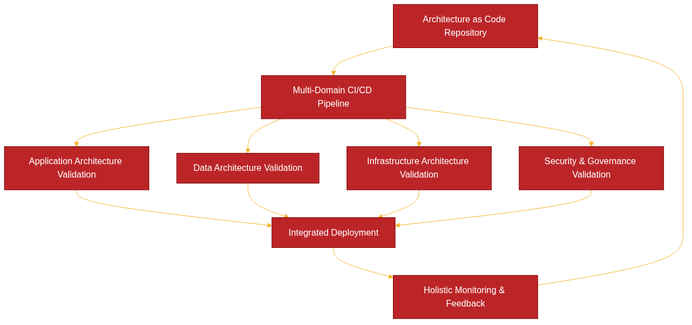

# DevOps och CI/CD för Architecture as Code



Architecture as Code representerar en evolutionär utveckling av DevOps-praktiker där hela systemarkitekturen - från applikationskomponenter till infrastruktur, dataflöden och organisatoriska processer - behandlas som kod och hanteras genom automatiserade CI/CD-pipelines. Detta kapitel utforskar hur svenska organisationer kan implementera DevOps-kulturen och CI/CD-praktiker för att effektivt hantera kodifierad arkitektur.


Diagrammet illustrerar det integrerade flödet för Architecture as Code DevOps, där kulturell förändring driver automatiserade processer som omfattar hela arkitekturlandskapet - inte bara infrastruktur utan också applikationsdesign, dataarkitektur och organisatoriska strukturer.

## Sammanfattning

DevOps och CI/CD för Architecture as Code skapar grunden för helhetlig, kodifierad systemutveckling där alla aspekter av arkitekturen hanteras som kod. För svenska organisationer innebär detta en strategisk approach som kombinerar kulturell transformation med teknisk automation för att leverera kompletta, spårbara och compliant arkitekturlösningar.

## Från Infrastructure as Code till Architecture as Code DevOps

Traditionella DevOps-praktiker fokuserade primärt på applikationsutveckling och deployment, medan Infrastructure as Code (IaC) utvidgade detta till infrastrukturhantering. Architecture as Code representerar nästa evolutionssteg där DevOps-kulturen och CI/CD-processer omfattar hela systemarkitekturen som en sammanhängande enhet.

### Holistic DevOps för Architecture as Code

I Architecture as Code-paradigmet behandlas alla arkitekturkomponenter som kod:

- **Applikationsarkitektur:** API-kontrakt, servicegränser och integrationsmönster
- **Dataarkitektur:** Datamodeller, dataflöden och dataintegrity-regler  
- **Infrastrukturarkitektur:** Servrar, nätverk och molnresurser
- **Säkerhetsarkitektur:** Säkerhetspolicies, access controls och compliance-regler
- **Organisationsarkitektur:** Teamstrukturer, processer och ansvarsområden

Detta holistiska approach kräver DevOps-praktiker som kan hantera komplexiteten av sammankopplade arkitekturelement samtidigt som de bibehåller hastighet och kvalitet i leveransprocessen.

### Nyckelfaktorer för framgångsrik svenska Architecture as Code DevOps

**Kulturell transformation för helhetsperspektiv:** Svenska organisationer måste utveckla en kultur som förstår arkitektur som en sammanhängande helhet. Detta kräver tvärdisciplinärt samarbete mellan utvecklare, arkitekter, operations-team och affärsanalytiker.

**Governance as Code:** Alla arkitekturstyrning, designprinciper och beslut kodifieras och versionshanteras. Architecture Decision Records (ADR), designriktlinjer och compliance-krav blir del av den kodifierade arkitekturen.

**End-to-end traceability:** Från affärskrav till implementerad arkitektur måste varje förändring vara spårbar genom hela systemlandskapet. Detta inkluderar påverkan på applikationer, data, infrastruktur och organisatoriska processer.

**Svenska compliance-integration:** GDPR, MSB-säkerhetskrav och sektorsspecifik reglering integreras naturligt i arkitekturkoden snarare än som externa kontroller.

**Collaborative architecture evolution:** Svenska konsensuskultur tillämpas på arkitekturevolution där alla stakeholders bidrar till arkitekturkodbasen genom transparenta, demokratiska processer.

### Kritiska framgångsfaktorer för svenska Architecture as Code DevOps

1. **Automated Architecture Compliance** - automatiserad validering av arkitekturprinciper i alla pipeline-steg
2. **Cross-Domain Integration** - seamless integration mellan applikations-, data- och infrastrukturdomäner
3. **Comprehensive Audit Logging** - fullständig spårbarhet för alla arkitekturändringar enligt svenska lagkrav
4. **Holistic Cost Management** - kostnadssynlighet över hela arkitekturlandskapet i svenska kronor
5. **Swedish Language Support** - svenska språkstöd i alla verktyg och dokumentation för arkitekturhantering
6. **Gradual Architecture Evolution** - evolutionär arkitekturutveckling som respekterar svenska riskhantering
7. **24/7 Architecture Monitoring** - kontinuerlig övervakning av arkitekturens hälsa och performance
8. **Cross-Functional Architecture Teams** - tvärfunktionella team enligt svenska samarbetskultur

Framgångsrik implementation kräver commitment till kontinuerlig arkitekturlärande, helhetlig processoptimering och tvärdisciplinärt samarbete med stark fokus på transparent arkitekturstyring som är central för svenska organisationskultur.

## CI/CD-pipelines för Architecture as Code

Architecture as Code CI/CD-pipelines skiljer sig från traditionella pipelines genom att hantera flera sammankopplade arkitekturdomäner samtidigt. Istället för att fokusera enbart på applikationskod eller infrastrukturkod, validerar och deployar dessa pipelines hela arkitekturdefinitioner som omfattar applikationer, data, infrastruktur och policies som en sammanhängande enhet.

### Architecture as Code Pipeline-arkitektur

En Architecture as Code pipeline organiseras i flera parallella spår som konvergerar vid kritiska beslutspunkter:

- **Application Architecture Track:** Validerar API-kontrakt, servicedependencies och applikationskompatibilitet
- **Data Architecture Track:** Kontrollerar datamodellförändringar, datalinjekompatibilitet och dataintegritet
- **Infrastructure Architecture Track:** Hanterar infrastrukturförändringar med fokus på applikationsstöd
- **Security Architecture Track:** Enforcar säkerhetspolicies över alla arkitekturdomäner
- **Governance Track:** Validerar compliance med arkitekturprinciper och svenska regulatoriska krav

```yaml
# .github/workflows/svenska-architecture-as-code-pipeline.yml
# Comprehensive Architecture as Code pipeline för svenska organisationer

name: Svenska Architecture as Code CI/CD

on:
  push:
    branches: [main, develop, staging]
    paths:
      - 'architecture/**'
      - 'applications/**'
      - 'data/**'
      - 'infrastructure/**'
      - 'policies/**'
  pull_request:
    branches: [main, develop, staging]

env:
  ORGANIZATION_NAME: 'svenska-org'
  AWS_DEFAULT_REGION: 'eu-north-1'  # Stockholm region
  GDPR_COMPLIANCE: 'enabled'
  DATA_RESIDENCY: 'Sweden'
  ARCHITECTURE_VERSION: '2.0'
  COST_CURRENCY: 'SEK'
  AUDIT_RETENTION_YEARS: '7'

jobs:
  # Phase 1: Architecture Validation
  architecture-validation:
    name: '🏗️ Architecture Validation'
    runs-on: ubuntu-latest
    strategy:
      matrix:
        domain: [application, data, infrastructure, security, governance]
    
    steps:
      - name: Checkout Architecture Repository
        uses: actions/checkout@v4
        with:
          fetch-depth: 0
      
      - name: Setup Architecture Tools
        run: |
          # Install architectural validation tools
          npm install -g @asyncapi/cli @swagger-api/swagger-validator
          pip install architectural-lint yamllint
          curl -L https://github.com/open-policy-agent/conftest/releases/download/v0.46.0/conftest_0.46.0_Linux_x86_64.tar.gz | tar xz
          sudo mv conftest /usr/local/bin
      
      - name: 🇸🇪 Svenska Architecture Compliance Check
        run: |
          echo "🔍 Validating ${{ matrix.domain }} architecture för svenska organisation..."
          
          case "${{ matrix.domain }}" in
            "application")
              # Validate API contracts and service dependencies
              find architecture/applications -name "*.openapi.yml" -exec swagger-validator {} \;
              find architecture/applications -name "*.asyncapi.yml" -exec asyncapi validate {} \;
              
              # Check for GDPR-compliant service design
              conftest verify --policy policies/svenska/gdpr-service-policies.rego architecture/applications/
              ;;
              
            "data")
              # Validate data models and lineage
              python scripts/validate-data-architecture.py
              
              # Check data privacy compliance
              conftest verify --policy policies/svenska/data-privacy-policies.rego architecture/data/
              ;;
              
            "infrastructure")
              # Traditional IaC validation within broader architecture context
              terraform -chdir=architecture/infrastructure init -backend=false
              terraform -chdir=architecture/infrastructure validate
              
              # Infrastructure serves application and data requirements
              python scripts/validate-infrastructure-alignment.py
              ;;
              
            "security")
              # Cross-domain security validation
              conftest verify --policy policies/svenska/security-policies.rego architecture/
              
              # GDPR impact assessment
              python scripts/gdpr-impact-assessment.py
              ;;
              
            "governance")
              # Architecture Decision Records validation
              find architecture/decisions -name "*.md" -exec architectural-lint {} \;
              
              # Swedish compliance requirements
              conftest verify --policy policies/svenska/governance-policies.rego architecture/
              ;;
          esac

  # Phase 2: Integration Testing
  architecture-integration:
    name: '🔗 Architecture Integration Testing'
    needs: architecture-validation
    runs-on: ubuntu-latest
    
    steps:
      - name: Checkout Code
        uses: actions/checkout@v4
      
      - name: Architecture Dependency Analysis
        run: |
          echo "🔗 Analyzing architecture dependencies..."
          
          # Check cross-domain dependencies
          python scripts/architecture-dependency-analyzer.py \
            --input architecture/ \
            --output reports/dependency-analysis.json \
            --format svenska
          
          # Validate no circular dependencies
          if python scripts/check-circular-dependencies.py reports/dependency-analysis.json; then
            echo "✅ No circular dependencies found"
          else
            echo "❌ Circular dependencies detected"
            exit 1
          fi
      
      - name: End-to-End Architecture Simulation
        run: |
          echo "🎭 Running end-to-end architecture simulation..."
          
          # Simulate complete system with all architectural components
          docker-compose -f test/architecture-simulation/docker-compose.yml up -d
          
          # Wait for system stabilization
          sleep 60
          
          # Run architectural integration tests
          python test/integration/test-architectural-flows.py \
            --config test/svenska-architecture-config.yml \
            --compliance-mode gdpr
          
          # Cleanup simulation environment
          docker-compose -f test/architecture-simulation/docker-compose.yml down

  # Phase 3: Architecture Impact Assessment
  architecture-impact:
    name: '📊 Architecture Impact Assessment'
    needs: architecture-integration
    runs-on: ubuntu-latest
    
    steps:
      - name: Checkout Code
        uses: actions/checkout@v4
      
      - name: Architecture Change Impact Analysis
        run: |
          echo "📊 Analyzing architecture change impact för svenska organisation..."
          
          # Compare with previous architecture version
          git fetch origin main
          python scripts/architecture-diff-analyzer.py \
            --base origin/main \
            --head HEAD \
            --output reports/architecture-impact.json \
            --svenska-compliance
          
          # Generate impact assessment report
          python scripts/generate-impact-report.py \
            --input reports/architecture-impact.json \
            --template templates/svenska-impact-report.md \
            --output reports/svenska-architecture-impact.md
      
      - name: Architecture Cost Analysis
        run: |
          echo "💰 Architecture cost analysis in svenska kronor..."
          
          # Calculate comprehensive architecture costs
          python scripts/architecture-cost-calculator.py \
            --architecture-config architecture/ \
            --currency SEK \
            --cost-center ${{ env.COST_CENTER }} \
            --output reports/architecture-costs.json
          
          # Validate against svenska budget constraints
          if python scripts/validate-svenska-budget.py reports/architecture-costs.json; then
            echo "✅ Architecture changes within budget"
          else
            echo "⚠️ Architecture changes exceed budget constraints"
            # Continue but flag for review
          fi

  # Phase 4: Progressive Architecture Deployment
  architecture-deployment:
    name: '🚀 Progressive Architecture Deployment'
    needs: architecture-impact
    runs-on: ubuntu-latest
    if: github.ref == 'refs/heads/main' || github.ref == 'refs/heads/staging'
    
    strategy:
      matrix:
        environment: [staging, production]
        exclude:
          - environment: production
            
    steps:
      - name: Checkout Code
        uses: actions/checkout@v4
      
      - name: Architecture Deployment Strategy Selection
        id: deployment-strategy
        run: |
          if [[ "${{ matrix.environment }}" == "production" ]]; then
            echo "strategy=blue-green" >> $GITHUB_OUTPUT
          else
            echo "strategy=rolling" >> $GITHUB_OUTPUT
          fi
      
      - name: Deploy Architecture Components
        run: |
          echo "🚀 Deploying architecture to ${{ matrix.environment }} using ${{ steps.deployment-strategy.outputs.strategy }} strategy..."
          
          # Deploy in architectural layers
          python scripts/architecture-deployer.py \
            --environment ${{ matrix.environment }} \
            --strategy ${{ steps.deployment-strategy.outputs.strategy }} \
            --organization ${{ env.ORGANIZATION_NAME }} \
            --svenska-compliance \
            --config architecture/environments/${{ matrix.environment }}/config.yml
      
      - name: Architecture Health Verification
        run: |
          echo "🏥 Verifying architecture health efter deployment..."
          
          # Comprehensive architecture health checks
          python scripts/architecture-health-checker.py \
            --environment ${{ matrix.environment }} \
            --checks application,data,infrastructure,security \
            --svenska-requirements
          
          # Generate architecture status report
          python scripts/generate-architecture-status.py \
            --environment ${{ matrix.environment }} \
            --output reports/architecture-status-${{ matrix.environment }}.md \
            --svenska-format

  # Phase 5: Architecture Monitoring Setup
  architecture-monitoring:
    name: '📈 Architecture Monitoring Setup'
    needs: architecture-deployment
    runs-on: ubuntu-latest
    
    steps:
      - name: Deploy Architecture Monitoring
        run: |
          echo "📈 Setting up holistic architecture monitoring..."
          
          # Deploy comprehensive monitoring for all architectural domains
          helm upgrade --install architecture-monitoring \
            monitoring/helm-charts/architecture-monitoring \
            --namespace monitoring \
            --create-namespace \
            --set organization=${{ env.ORGANIZATION_NAME }} \
            --set compliance.gdpr=true \
            --set compliance.dataResidency=Sweden \
            --set language=svenska
      
      - name: Configure Architecture Alerts
        run: |
          echo "🚨 Configuring svenska architecture alerts..."
          
          # Setup alerts for architectural health
          kubectl apply -f monitoring/alerts/svenska-architecture-alerts.yml
          
          # Configure notification channels
          python scripts/setup-svenska-notifications.py \
            --slack-channel "#svenska-architecture-alerts" \
            --email "arkitektur@${{ env.ORGANIZATION_NAME }}.se" \
            --teams-webhook "${{ secrets.TEAMS_WEBHOOK_URL }}"

  # Phase 6: Architecture Documentation Update
  architecture-documentation:
    name: '📚 Architecture Documentation Update'
    needs: architecture-monitoring
    runs-on: ubuntu-latest
    
    steps:
      - name: Generate Architecture Documentation
        run: |
          echo "📚 Generating svenska architecture documentation..."
          
          # Generate comprehensive architecture documentation
          python scripts/architecture-doc-generator.py \
            --source architecture/ \
            --output docs/generated/ \
            --language svenska \
            --include-decisions \
            --include-compliance-mappings \
            --format html,pdf,markdown
      
      - name: Update Architecture Wiki
        run: |
          echo "📖 Updating svenska architecture wiki..."
          
          # Update internal architecture wiki
          python scripts/update-architecture-wiki.py \
            --docs docs/generated/ \
            --wiki-url "https://wiki.${{ env.ORGANIZATION_NAME }}.se" \
            --organization "${{ env.ORGANIZATION_NAME }}" \
            --svenska-templates

  # Phase 7: Architecture Audit & Compliance
  architecture-audit:
    name: '📋 Architecture Audit & Compliance'
    needs: architecture-documentation
    runs-on: ubuntu-latest
    
    steps:
      - name: Generate Compliance Audit Trail
        run: |
          echo "📋 Generating svenska compliance audit trail..."
          
          # Create comprehensive audit log
          python scripts/generate-audit-trail.py \
            --pipeline-run ${{ github.run_id }} \
            --organization ${{ env.ORGANIZATION_NAME }} \
            --changes "$(git log --oneline -n 5)" \
            --compliance-frameworks GDPR,MSB,ISO27001 \
            --retention-years ${{ env.AUDIT_RETENTION_YEARS }} \
            --output audit/svenska-architecture-audit-${{ github.run_id }}.json
      
      - name: Archive Audit Records
        run: |
          echo "💾 Archiving audit records för svenska lagkrav..."
          
          # Upload audit records to long-term storage (7 years retention)
          aws s3 cp audit/svenska-architecture-audit-${{ github.run_id }}.json \
            s3://${{ env.ORGANIZATION_NAME }}-architecture-audit/$(date +%Y/%m/)/ \
            --region eu-north-1 \
            --server-side-encryption aws:kms \
            --storage-class STANDARD_IA \
            --metadata organization=${{ env.ORGANIZATION_NAME }},compliance=svenska
```

Detta pipeline-exempel visar hur svenska organisationer kan implementera comprehensive Architecture as Code CI/CD-processer som hanterar hela arkitekturlandskapet som en sammanhängande enhet, med stark fokus på svensk compliance och arkitekturgovernance.

## Architecture as Code Testing-strategier

Architecture as Code kräver testing-strategier som går beyond traditionell infrastruktur- eller applikationstestning. Testning måste validera arkitekturkonsistens över multiple domäner, säkerställa att förändringar i en arkitekturkomponent inte bryter andra delar av systemet, och verifiera att hela arkitekturen uppfyller definierade kvalitetsattribut.

### Holistic Architecture Testing

Architecture as Code testing organiseras i flera nivåer:

- **Architecture Unit Tests:** Validerar enskilda arkitekturkomponenter (services, data models, infrastructure modules)
- **Architecture Integration Tests:** Testar samspel mellan arkitekturdomäner (application-data integration, infrastructure-application alignment)
- **Architecture System Tests:** Verifierar end-to-end arkitekturkvalitet och performance
- **Architecture Acceptance Tests:** Bekräftar att arkitekturen uppfyller business requirements och compliance-krav

### Svenska Architecture Testing Framework

För svenska organisationer kräver Architecture as Code testing särskild uppmärksamhet på GDPR-compliance, data residency och arkitekturgovernance:

```python
# test/svenska_architecture_tests.py
# Comprehensive Architecture as Code testing för svenska organisationer

import pytest
import yaml
import json
from typing import Dict, List, Any
from dataclasses import dataclass
from architecture_validators import *

@dataclass
class SvenskaArchitectureTestConfig:
    """Test configuration för svenska Architecture as Code"""
    organization_name: str
    environment: str
    gdpr_compliance: bool = True
    data_residency: str = "Sweden"
    compliance_frameworks: List[str] = None
    
    def __post_init__(self):
        if self.compliance_frameworks is None:
            self.compliance_frameworks = ["GDPR", "MSB", "ISO27001"]

class TestSvenskaArchitectureCompliance:
    """Test suite för svensk arkitekturcompliance"""
    
    def setup_method(self):
        self.config = SvenskaArchitectureTestConfig(
            organization_name="svenska-tech-ab",
            environment="production"
        )
        self.architecture = load_architecture_definition("architecture/")
    
    def test_gdpr_compliance_across_architecture(self):
        """Test GDPR compliance över alla arkitekturdomäner"""
        # Test application layer GDPR compliance
        app_compliance = validate_application_gdpr_compliance(
            self.architecture.applications,
            self.config
        )
        assert app_compliance.compliant, f"Application GDPR issues: {app_compliance.violations}"
        
        # Test data layer GDPR compliance
        data_compliance = validate_data_gdpr_compliance(
            self.architecture.data_models,
            self.config
        )
        assert data_compliance.compliant, f"Data GDPR issues: {data_compliance.violations}"
        
        # Test infrastructure GDPR compliance
        infra_compliance = validate_infrastructure_gdpr_compliance(
            self.architecture.infrastructure,
            self.config
        )
        assert infra_compliance.compliant, f"Infrastructure GDPR issues: {infra_compliance.violations}"
    
    def test_data_residency_enforcement(self):
        """Test att all data förblir inom svenska gränser"""
        residency_violations = check_data_residency_violations(
            self.architecture,
            required_region=self.config.data_residency
        )
        assert len(residency_violations) == 0, f"Data residency violations: {residency_violations}"
    
    def test_architecture_consistency(self):
        """Test arkitekturkonsistens över alla domäner"""
        consistency_report = validate_architecture_consistency(self.architecture)
        
        # Check application-data consistency
        assert consistency_report.application_data_consistent, \
            f"Application-data inconsistencies: {consistency_report.app_data_issues}"
        
        # Check infrastructure-application alignment
        assert consistency_report.infrastructure_app_aligned, \
            f"Infrastructure-application misalignment: {consistency_report.infra_app_issues}"
        
        # Check security policy coverage
        assert consistency_report.security_coverage_complete, \
            f"Security policy gaps: {consistency_report.security_gaps}"
    
    def test_svenska_architectural_principles(self):
        """Test efterlevnad av svenska arkitekturprinciper"""
        principles_compliance = validate_svenska_architectural_principles(
            self.architecture,
            self.config
        )
        
        # Check transparency principle
        assert principles_compliance.transparency_adequate, \
            "Architecture lacks required transparency for svenska organisation"
        
        # Check consensus-building in architecture decisions
        assert principles_compliance.consensus_documented, \
            "Architecture decisions lack documented consensus process"
        
        # Check risk management integration
        assert principles_compliance.risk_management_integrated, \
            "Risk management not properly integrated in architecture"

class TestArchitecturePerformance:
    """Test suite för arkitekturperformance"""
    
    def test_end_to_end_performance(self):
        """Test end-to-end performance över hela arkitekturen"""
        performance_results = run_architecture_performance_tests(
            architecture_config="architecture/performance-test-config.yml",
            environment="production"
        )
        
        # Validate response times
        assert performance_results.avg_response_time < 200, \
            f"Average response time too high: {performance_results.avg_response_time}ms"
        
        # Validate throughput
        assert performance_results.requests_per_second > 1000, \
            f"Throughput too low: {performance_results.requests_per_second} RPS"
    
    def test_architecture_scalability(self):
        """Test arkitekturens skalbarhet"""
        scalability_test = run_architecture_scalability_test(
            load_multiplier=10,
            duration_minutes=30
        )
        
        assert scalability_test.scales_gracefully, \
            f"Architecture doesn't scale gracefully: {scalability_test.bottlenecks}"

def load_architecture_definition(path: str) -> Any:
    """Load complete architecture definition"""
    # Implementation for loading architecture definition from files
    pass

def validate_application_gdpr_compliance(applications: List, config: SvenskaArchitectureTestConfig) -> Any:
    """Validate GDPR compliance för application layer"""
    # Implementation for application GDPR validation
    pass

# Additional test utilities and validators...
```

## Architecture as Code Monitoring och Observability

Architecture as Code monitoring måste hantera komplexiteten av att övervaka hela arkitekturlandskapet som en sammanhängande enhet. Detta inkluderar traditional application och infrastructure metrics, men också arkitekturkvalitet, governance compliance och business value delivery.

### Holistic Architecture Monitoring

För svenska organisationer kräver Architecture as Code monitoring:

- **Application Architecture Metrics:** API performance, service health, integration quality
- **Data Architecture Metrics:** Data quality, lineage integrity, privacy compliance
- **Infrastructure Architecture Metrics:** Resource utilization, cost efficiency, security posture
- **Governance Metrics:** Architecture decision compliance, policy adherence, audit trail completeness
- **Business Value Metrics:** Time-to-market, innovation velocity, compliance effectiveness

### Svenska Architecture Monitoring Dashboard

```yaml
# monitoring/svenska-architecture-dashboard.yml
# Comprehensive monitoring dashboard för Architecture as Code

apiVersion: v1
kind: ConfigMap
metadata:
  name: svenska-architecture-dashboard
  namespace: monitoring
data:
  grafana-dashboard.json: |
    {
      "dashboard": {
        "title": "Svenska Architecture as Code Dashboard",
        "tags": ["architecture", "svenska", "compliance"],
        "panels": [
          {
            "title": "🏗️ Architecture Health Overview",
            "type": "stat",
            "targets": [
              {
                "expr": "architecture_health_score{organization=\"svenska-org\"}",
                "legendFormat": "Overall Health"
              }
            ]
          },
          {
            "title": "🇸🇪 GDPR Compliance Status",
            "type": "gauge",
            "targets": [
              {
                "expr": "gdpr_compliance_percentage{organization=\"svenska-org\"}",
                "legendFormat": "GDPR Compliance %"
              }
            ],
            "fieldConfig": {
              "defaults": {
                "thresholds": {
                  "steps": [
                    {"color": "red", "value": 0},
                    {"color": "yellow", "value": 95},
                    {"color": "green", "value": 100}
                  ]
                }
              }
            }
          },
          {
            "title": "📊 Architecture Domain Status",
            "type": "heatmap",
            "targets": [
              {
                "expr": "architecture_domain_health{organization=\"svenska-org\"}",
                "legendFormat": "{{domain}}"
              }
            ]
          },
          {
            "title": "💰 Architecture Cost Efficiency (SEK)",
            "type": "timeseries",
            "targets": [
              {
                "expr": "architecture_cost_efficiency_sek{organization=\"svenska-org\"}",
                "legendFormat": "Cost per Business Value Unit"
              }
            ]
          },
          {
            "title": "🔄 Architecture Change Velocity",
            "type": "timeseries",
            "targets": [
              {
                "expr": "rate(architecture_changes_total{organization=\"svenska-org\"}[1h])",
                "legendFormat": "Changes per Hour"
              }
            ]
          }
        ]
      }
    }
```

## DevOps Kultur för Architecture as Code

Architecture as Code kräver en mogen DevOps-kultur som kan hantera komplexiteten av holistic systemtänkande samtidigt som den bibehåller agilitet och innovation. För svenska organisationer innebär detta att anpassa DevOps-principer till svenska värderingar om konsensus, transparens och riskhanteiing.

### Svenska Architecture as Code Cultural Practices

- **Transparent Architecture Governance:** Alla arkitekturbeslut dokumenteras och delas öppet inom organisationen
- **Consensus-Driven Architecture Evolution:** Arkitekturändringar genomgår demokratiska beslutprocesser med alla stakeholders
- **Risk-Aware Innovation:** Innovation balanseras med försiktig riskhantering enligt svenska organisationskultur
- **Continuous Architecture Learning:** Regelbunden kompetensutveckling för hela arkitekturlandskapet
- **Collaborative Cross-Domain Teams:** Tvärfunktionella team som äger hela arkitekturstacken

## Referenser och vidare läsning

### Svenska myndigheter och regelverk
- Datainspektionen. "GDPR för svenska organisationer." Vägledning om personuppgiftsbehandling.
- Myndigheten för samhällsskydd och beredskap (MSB). "Säkerhetsskydd för informationssystem." MSBFS 2020:6.
- Post- och telestyrelsen (PTS). "Cybersäkerhet och informationssäkerhet." Branschvägledning.
- Riksrevisionen. "Statens IT-drift - en uppföljning." RiR 2023:15.

### Architecture as Code DevOps och CI/CD-standarder
- ThoughtWorks. "Architecture as Code: The Next Evolution." Technology Radar, 2024.
- The DevOps Institute. "Architecture-Driven DevOps Practices." DevOps Research and Assessment.
- GitLab. "GitOps for Complete Architecture Management." GitLab Documentation.
- Microsoft. "Architecture as Code with Azure DevOps." Microsoft Learn Platform.
- AWS. "DevOps for Cloud-Native Architecture." Amazon Web Services Architecture Center.
- Red Hat. "OpenShift GitOps for Architecture Management." Red Hat Developer Portal.

### Svenska Architecture as Code case studies
- Spotify Engineering Blog. "Architecture as Code at Scale." Swedish Innovation in DevOps Practice.
- SEB Developer Portal. "Holistic Banking Architecture Management." Financial Sector Architecture Evolution.
- Klarna Engineering. "Compliance-First Architecture DevOps." FinTech Swedish Architecture Approach.
- Ericsson Technology Blog. "Telecom Architecture Automation." Enterprise Swedish Architecture Implementation.
- H&M Group Tech. "Fashion Industry Architecture as Code." Retail Sector Digital Architecture.

### Verktyg och teknologier för Architecture as Code DevOps
- Backstage. "Developer Portal for Architecture Management." Spotify Open Source Platform.
- Terraform. "Infrastructure as Part of Architecture as Code." HashiCorp Documentation.
- Crossplane. "Cloud Infrastructure Orchestration." Cloud Native Computing Foundation.
- ArgoCD. "GitOps for Kubernetes and Beyond." Argo Project Documentation.
- Jenkins X. "CI/CD for Cloud-Native Architecture." Jenkins X User Guide.
- Tekton. "Kubernetes-Native CI/CD Pipelines." Tekton Documentation.

### Forskning och akademiska källor
- IEEE Software. "Architecture as Code: Practices and Patterns." IEEE Computer Society.
- ACM Computing Surveys. "DevOps Evolution: From Infrastructure to Architecture." Association for Computing Machinery.
- Software Architecture Conference. "Scandinavian Approaches to Architecture Management." O'Reilly Media.
- Nordic IT Architecture Forum. "Architecture Governance in Scandinavian Organizations." Research Papers.
- Skatteverket. "Government IT Modernization." Public Sector Digital Transformation.