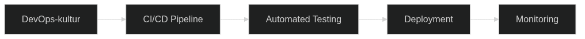

# DevOps och CI/CD för Infrastructure as Code



DevOps-kulturen och CI/CD-metoder revolutionerar hur Infrastructure as Code implementeras och förvaltas. Genom att bryta ner traditionella silos mellan utveckling och drift skapas ett sammanhållet arbetssätt som accelererar leveranser samtidigt som kvalitet och stabilitet bibehålls.

## DevOps-kulturens betydelse för IaC

DevOps representerar en fundamental förändring i organisatorisk kultur där utvecklings- och driftteam arbetar kollaborativt genom hela systemlivscykeln. För Infrastructure as Code innebär detta att infrastrukturkod behandlas med samma rigor och methodology som applikationskod, vilket skapar förutsättningar för högre kvalitet och snabbare iterationer.

### Kulturell transformation inom svenska organisationer

Svenska företag och myndigheter har unika utmaningar när det gäller DevOps-implementation för IaC. Traditionella hierarkiska strukturer och starka avdelningsgränser kräver oftast mer omfattande change management än i många andra länder. Detta beror dels på svensk konsensuskultur där beslut fattas genom omfattande diskussioner, dels på starka fackföreningar som säkerställer att personalförändringar hanteras varsamt.

Framgångsrika svenska organisationer som SEB, Spotify och Klarna har visat att DevOps-kulturen kan anpassas till svenska värderingar genom att betona collaboration, transparency och continuous learning. Dessa företag har implementerat Infrastructure as Code genom stegvis förändring där befintlig personal omskolas istället för att ersättas, vilket skapar trygghet och buy-in från alla organisatoriska nivåer.

Kulturförändringen kräver att traditionella ansvarsområden omdefinieras. Utvecklare får större ansvar för operational aspects, medan operations team involveras mer i utvecklingsprocesser. Detta "shared responsibility" model reducerar handoff-points och minimerar kommunikationsgap som traditionellt har orsakat delays och kvalitetsproblem.

### Automation som kulturell katalysator

Automation blir central i DevOps-kulturen för IaC. Manual processes ersätts systematiskt med kodbaserade lösningar som säkerställer konsistens och reproducerbarhet. Detta inkluderar allt från infrastructure provisioning till monitoring och incident response, vilket skapar en helt automatiserad delivery pipeline.

För svenska organisationer innebär detta särskild fokus på GDPR-compliance i alla automatiserade processer. Varje automatiserad deployment måste säkerställa att personnummer, företagsdata och annan känslig information skyddas enligt svensk lag. Detta kräver automation scripts som automatiskt implementerar kryptering, access controls och audit logging.

Svensk lagstiftning kräver också särskild hänsyn till arbetstidslagstiftning och personalens rätt till vila. Automatiserad deployment bör därför scheduleras för att minimera behov av manuella ingripanden utanför arbetstid, vilket kräver robust error handling och automated rollback capabilities.

## Kontinuerlig integration för infrastrukturkod

CI för Infrastructure as Code säkerställer att infrastrukturändringar integreras smidigt och säkert i huvudkodbasen. Varje commit triggar en serie validerings- och teststeg som verifierar kodkvalitet, säkerhetsstandards och functional correctness innan ändringar accepteras för merge.

### Svenska compliance-krav i CI-pipelines

För svenska organisationer måste CI-pipelines inkludera automatiserad validering av GDPR-compliance, data residency requirements och MSB:s säkerhetskrav. Detta innebär att varje infrastructure change genomgår automated compliance checking innan deployment.

```yaml
# Svenska compliance checks i CI pipeline
- name: GDPR Compliance Validation
  run: |
    echo "🔍 Validerar GDPR-compliance för infrastructure changes..."
    
    # Kontrollera att alla databaser har kryptering aktiverad
    terraform show -json | jq '.values.root_module.resources[] | 
      select(.type == "aws_rds_instance" or .type == "aws_s3_bucket") |
      select(.values.storage_encrypted != true)' > gdpr_violations.json
    
    if [ -s gdpr_violations.json ]; then
      echo "❌ GDPR-violation: Ej krypterade databaser funna"
      cat gdpr_violations.json
      exit 1
    fi
    
    # Kontrollera data residency (endast EU-regioner tillåtna)
    terraform show -json | jq '.values.root_module.resources[] |
      select(.values.region) |
      select(.values.region | test("^(us-|ap-|ca-|sa-)") == true)' > region_violations.json
    
    if [ -s region_violations.json ]; then
      echo "❌ Data residency violation: Icke-EU regioner funna"
      cat region_violations.json
      exit 1
    fi
    
    echo "✅ GDPR-compliance validerad"

- name: Swedish Tagging Compliance
  run: |
    echo "🏷️ Validerar svenska tagging requirements..."
    
    # Kontrollera att alla resurser har svenska obligatoriska tags
    required_tags=("Organization" "Environment" "CostCenter" "DataClassification" "DataResidency")
    
    for tag in "${required_tags[@]}"; do
      missing_resources=$(terraform show -json | jq -r "
        .values.root_module.resources[] |
        select(.values.tags.$tag == null) |
        .address" | wc -l)
      
      if [ $missing_resources -gt 0 ]; then
        echo "❌ Mandatory tag '$tag' saknas på $missing_resources resurser"
        terraform show -json | jq -r "
          .values.root_module.resources[] |
          select(.values.tags.$tag == null) |
          .address"
        exit 1
      fi
    done
    
    echo "✅ Svenska tagging requirements uppfyllda"
```

Automated testing strategies för IaC inkluderar static analysis, unit testing av terraform modules, integration testing mot test environments, och policy compliance validation. Dessa tester exekveras parallellt för att minimera feedback time och identifiera problem tidigt i utvecklingscykeln.

## Avancerade teststrategier

### Advanced testing strategies för svenska miljöer

Svenska organisationer kräver särskilt omfattande testing på grund av höga compliance-krav och risk-aversion. Teststrategier måste inkludera:

**Compliance Testing**: Automatiserad validering mot GDPR, PCI-DSS och branschspecifika regelverk. Detta inkluderar testing av kryptering, access controls, audit logging och data retention policies.

**Multi-region Testing**: Verifiering att infrastructure fungerar korrekt i olika EU-regioner samtidigt som data residency requirements uppfylls. Testing av failover scenarios mellan Stockholm och Amsterdam datacenters.

**Performance Testing**: Validering att infrastructure möter svenska krav på responstider och availability. Särskilt viktigt för kritisk samhällsinfrastruktur som banker och myndigheter.

Version control workflows anpassas för infrastrukturkod genom feature branches för större ändringar, mandatory code reviews för alla modifications, och automated conflict resolution där möjligt. Branching strategies balanserar utvecklarhastighet med stability requirements genom clear policies för när direct commits till main branch är acceptabla.

### Git workflows för svenska team-strukturer

Svenska organisationer tenderar att ha fler stakeholders i beslutprocesser, vilket kräver anpassade Git workflows:

```bash
# Svenska organizational workflow
git flow init

# Feature branches för nya infrastruktur-komponenter
git checkout -b feature/swedish-gdpr-compliance
git checkout -b feature/stockholm-datacenter-setup

# Mandatory review process för compliance
# Minst två approvals krävs: teknisk reviewer + compliance officer
git push origin feature/swedish-gdpr-compliance
# Create pull request med template som inkluderar:
# - GDPR impact assessment
# - Security review checklist
# - Cost analysis för svenska skattepliktig verksamhet
# - MSB security compliance check
```

## Deployment automation och orchestration

Automated deployment för infrastruktur kräver sofistikerade orchestration capabilities som hanterar dependencies, rollback scenarios, och multi-environment consistency. Deployment pipelines designas med fail-safe mechanisms som säkerställer att partial deployments kan detekteras och korrigeras automatiskt.

### Svenska deployment requirements

Svenska organisationer har särskilt strikta krav på deployment automation på grund av regulatoriska requirements och risk management policies. Alla deployments måste vara traceable, auditable och reversible enligt svensk compliance lagstiftning.

```yaml
# Svenska deployment pipeline med compliance logging
deploy_swedish_infrastructure:
  stage: deploy
  before_script:
    - echo "🇸🇪 Initierar svensk infrastructure deployment"
    - export DEPLOYMENT_ID=$(date +%Y%m%d_%H%M%S)_${CI_COMMIT_SHORT_SHA}
    - export COMPLIANCE_LOG="/var/log/deployment/swedish_compliance_${DEPLOYMENT_ID}.log"
    
    # Logga deployment för svensk audit trail
    - echo "DEPLOYMENT_START: $(date -Iseconds)" >> $COMPLIANCE_LOG
    - echo "INITIATED_BY: ${GITLAB_USER_EMAIL}" >> $COMPLIANCE_LOG
    - echo "COMMIT: ${CI_COMMIT_SHA}" >> $COMPLIANCE_LOG
    - echo "ENVIRONMENT: ${ENVIRONMENT}" >> $COMPLIANCE_LOG
    
    # Validera svenska business hours (för non-emergency deployments)
    - |
      if [[ "${EMERGENCY_DEPLOYMENT}" != "true" ]]; then
        current_hour=$(date +%H)
        if [[ $current_hour -lt 08 || $current_hour -gt 17 ]]; then
          echo "❌ Deployment outside business hours requires emergency flag"
          echo "BLOCKED_OUTSIDE_HOURS: $(date -Iseconds)" >> $COMPLIANCE_LOG
          exit 1
        fi
      fi
  
  script:
    # Pre-deployment compliance checks
    - terraform plan -out=tfplan
    - python3 compliance/swedish_pre_deploy_check.py --plan tfplan
    
    # Swedish infrastructure deployment
    - terraform apply -auto-approve tfplan
    
    # Post-deployment verification
    - python3 compliance/swedish_post_deploy_verify.py
    
    # Log successful deployment
    - echo "DEPLOYMENT_SUCCESS: $(date -Iseconds)" >> $COMPLIANCE_LOG
    - echo "INFRASTRUCTURE_STATE: $(terraform show -json | sha256sum)" >> $COMPLIANCE_LOG
  
  after_script:
    # Archive compliance logs enligt svensk 7-års krav
    - aws s3 cp $COMPLIANCE_LOG s3://swedish-compliance-logs/infrastructure/
    - echo "✅ Compliance logging completed för deployment ${DEPLOYMENT_ID}"
```

Environment management strategies inkluderar infrastructure-as-code definitions för alla environments från development till production. Detta säkerställer parity mellan environments och eliminerar environment-specific configuration drift som traditionellt har orsakat deployment failures.

## Avancerade deployment strategies

### Multi-environment orchestration för svenska regioner

Svenska organisationer måste hantera complex multi-environment deployments som respekterar både tekniska och juridiska constraints:

```hcl
# Svenska multi-environment orchestration
locals {
  swedish_environments = {
    dev = {
      region = "eu-north-1"  # Stockholm
      data_residency = "sweden"
      compliance_level = "basic"
      cost_center = "IT-DEV-001"
    }
    staging = {
      region = "eu-west-1"   # Dublin (backup för EU residency)
      data_residency = "eu"
      compliance_level = "standard"
      cost_center = "IT-STAGE-001"
    }
    production = {
      region = "eu-north-1"  # Stockholm (primär)
      data_residency = "sweden"
      compliance_level = "strict"
      cost_center = "PROD-001"
    }
  }
  
  # Svenska compliance requirements per environment
  compliance_requirements = {
    basic = ["encryption_at_rest", "basic_logging"]
    standard = ["encryption_at_rest", "encryption_in_transit", "audit_logging", "backup_retention_30d"]
    strict = ["encryption_at_rest", "encryption_in_transit", "audit_logging", "backup_retention_7y", 
              "gdpr_compliance", "soc2_compliance", "penetration_testing"]
  }
}

module "swedish_environment" {
  source = "./modules/swedish-infrastructure"
  
  for_each = local.swedish_environments
  
  environment_name = each.key
  region = each.value.region
  data_residency = each.value.data_residency
  compliance_requirements = local.compliance_requirements[each.value.compliance_level]
  cost_center = each.value.cost_center
  
  # Svenska organisational tags
  tags = {
    Organization = var.swedish_organization_name
    Environment = each.key
    DataResidency = each.value.data_residency
    ComplianceLevel = each.value.compliance_level
    CostCenter = each.value.cost_center
    Country = "Sweden"
    GDPRCompliant = "true"
    ManagedBy = "Terraform"
    CreatedDate = formatdate("YYYY-MM-DD", timestamp())
  }
}
```

Deployment gates implementeras för att säkerställa kvalitetskontroll innan production deployments. Dessa kan inkludera automated testing results, security scan outcomes, performance benchmarks, och manual approvals för high-risk changes. Progressive deployment techniques som blue-green och canary deployments minimerar blast radius vid problems.

## Kvalitetskontroll och godkännandeprocesser

### Svenska deployment gates och approval processes

Svenska organisationer kräver ofta mer omfattande approval processes än internationella företag. Detta beror på stark compliance culture och risk-averse organizational behavior:

```yaml
# Svenska deployment gates
deployment_gates:
  development:
    automated_tests: required
    security_scan: required
    cost_estimation: required
    manual_approval: false
    
  staging:
    automated_tests: required
    security_scan: required
    performance_tests: required
    gdpr_compliance_check: required
    cost_estimation: required
    technical_approval: required  # Technical lead
    manual_approval: false
    
  production:
    automated_tests: required
    security_scan: required
    performance_tests: required
    gdpr_compliance_check: required
    penetration_test: required
    cost_estimation: required
    business_approval: required   # Business owner
    technical_approval: required  # Technical lead
    compliance_approval: required # Compliance officer
    security_approval: required   # Security officer
    manual_approval: true
    rollback_plan: required
    incident_response_plan: required
    
    # Särskilda krav för svenska production
    working_hours_only: true
    swedish_support_available: true
    rollback_tested: true
    disaster_recovery_verified: true
```

## Monitoring och feedback loops

Comprehensive monitoring av både infrastructure state och deployment pipeline health ger essential feedback för kontinuerlig förbättring. Metrics collection täcker infrastructure performance, application health, deployment success rates, och user experience indicators för att skapa en holistic view av system health.

### Svenska monitoring requirements och GDPR considerations

Svenska organisationer måste implementera monitoring som balanserar operational visibility med privacy requirements enligt GDPR och svensk personuppgiftslag. Detta kräver careful consideration av vad som loggas, hur länge data behålls, och vem som har access till monitoring data.

```python
# GDPR-compliant monitoring för svenska infrastrukturer
import logging
import hashlib
from datetime import datetime, timedelta

class SwedishGDPRCompliantLogger:
    """
    Monitoring logger som följer svenska GDPR-krav
    """
    
    def __init__(self, retention_years=7):
        self.retention_years = retention_years
        self.pii_patterns = [
            r'\b\d{6}[-]\d{4}\b',  # Svenskt personnummer
            r'\b\d{10}\b',         # Svenskt personnummer utan bindestreck
            r'\b[A-Za-z0-9._%+-]+@[A-Za-z0-9.-]+\.[A-Z|a-z]{2,}\b',  # Email
            r'\b\d{16}\b',         # Kreditkortsnummer
        ]
    
    def log_infrastructure_event(self, event_type, resource_id, details):
        """
        Logga infrastructure events enligt svenska compliance-krav
        """
        # Anonymisera potential PII innan logging
        sanitized_details = self._sanitize_pii(details)
        
        log_entry = {
            "timestamp": datetime.utcnow().isoformat(),
            "event_type": event_type,
            "resource_id": resource_id,
            "details": sanitized_details,
            "swedish_compliance": {
                "gdpr_compliant": True,
                "data_residency": "sweden",
                "retention_until": (datetime.utcnow() + timedelta(days=365 * self.retention_years)).isoformat(),
                "logged_by": "infrastructure_automation"
            }
        }
        
        logging.info(f"Swedish Infrastructure Event: {log_entry}")
        
        # Ship till Swedish compliance logging system
        self._ship_to_compliance_system(log_entry)
    
    def _sanitize_pii(self, text):
        """Anonymisera potential PII enligt GDPR"""
        for pattern in self.pii_patterns:
            import re
            text = re.sub(pattern, lambda m: f"[PII_HASH_{hashlib.sha256(m.group().encode()).hexdigest()[:8]}]", text)
        return text
    
    def _ship_to_compliance_system(self, log_entry):
        """Skicka till svenska compliance logging system"""
        # Implementation för Swedish audit trail system
        pass

# Användning i svenska deployment pipelines
swedish_logger = SwedishGDPRCompliantLogger()

def monitor_swedish_deployment(deployment_id):
    """Monitor deployment enligt svenska requirements"""
    
    # Log deployment start
    swedish_logger.log_infrastructure_event(
        "deployment_start",
        deployment_id,
        f"Svensk infrastructure deployment startad av {get_deployment_user()}"
    )
    
    # Monitor compliance during deployment
    compliance_metrics = {
        "gdpr_encryption_verified": verify_encryption_compliance(),
        "data_residency_confirmed": verify_data_residency(),
        "audit_logging_enabled": verify_audit_logging(),
        "backup_retention_configured": verify_backup_retention(),
        "access_controls_validated": verify_access_controls()
    }
    
    for metric, status in compliance_metrics.items():
        swedish_logger.log_infrastructure_event(
            "compliance_check",
            deployment_id,
            f"{metric}: {status}"
        )
        
        if not status:
            swedish_logger.log_infrastructure_event(
                "compliance_violation",
                deployment_id,
                f"KRITISK: {metric} misslyckades - deployment stoppad"
            )
            raise Exception(f"Svenska compliance violation: {metric}")
    
    # Log successful deployment
    swedish_logger.log_infrastructure_event(
        "deployment_success",
        deployment_id,
        "Svensk infrastructure deployment slutförd framgångsrikt"
    )
```

Automated alerting systems implementeras för att detektera infrastructure anomalies och trigger appropriate response actions. Detta inkluderar både reactive measures för immediate problem resolution och proactive measures för trend identification och capacity planning.

### Svenska alerting och incident response

Svenska organisationer kräver alerting som respekterar arbetstidslagstiftning och kollektivavtal samtidigt som critical systems bibehåller 24/7 tillgänglighet:

```yaml
# Svenska alerting policies
alerting_policies:
  critical_alerts:
    # System-critical alerts som kräver omedelbar response
    triggers:
      - infrastructure_failure
      - security_breach
      - gdpr_violation
      - data_loss_risk
    
    response_time: "15 minutes"
    escalation_policy:
      - primary_oncall_engineer
      - secondary_oncall_engineer
      - incident_commander
      - swedish_management_chain
    
    notification_channels:
      - sms: "+46-XXX-XXXXXX"
      - slack: "#svenska-critical-alerts"
      - email: "kritiska-alarm@företag.se"
      - pagerduty: "swedish_critical_team"
    
    business_hours_only: false
    swedish_language: true
    
  high_alerts:
    # Viktiga alerts som kan vänta till business hours
    triggers:
      - performance_degradation
      - capacity_warnings
      - backup_failures
      - compliance_warnings
    
    response_time: "2 hours during business hours"
    business_hours: "08:00-17:00 CET Monday-Friday"
    swedish_holidays_respected: true
    
    escalation_policy:
      - team_lead
      - swedish_infrastructure_team
    
    notification_channels:
      - slack: "#svenska-infrastructure-alerts"
      - email: "infrastruktur-team@företag.se"
    
  compliance_alerts:
    # GDPR och svenska regulatory alerts
    triggers:
      - gdpr_violation_detected
      - data_residency_violation
      - audit_log_tampering
      - unauthorized_access_attempt
    
    response_time: "30 minutes"
    escalation_policy:
      - compliance_officer
      - data_protection_officer
      - legal_team
      - senior_management
    
    notification_channels:
      - secure_email: "säkerhet@företag.se"
      - compliance_dashboard: "https://compliance.företag.se"
    
    automatic_actions:
      - isolate_affected_systems
      - create_incident_report
      - notify_datainspektionen_if_required
      - preserve_audit_evidence
```

Feedback loops från monitoring data driver kontinuerlig optimering av både infrastructure configurations och deployment processes. Regular retrospectives analyserar metrics data för att identifiera improvement opportunities och implementera systematic changes som förbättrar overall delivery velocity och system reliability.

### Svenska feedback loops och continuous improvement

Svenska organisationer tenderar att ha mer strukturerade feedback processes med formal retrospectives och consensus-based decision making:

```python
# Svenska feedback loop automation
class SwedishContinuousImprovement:
    """
    Automate feedback collection och improvement recommendations
    för svenska infrastructure teams
    """
    
    def weekly_infrastructure_retrospective(self):
        """
        Automatiserad veckovis retrospective enligt svenska teamkultur
        """
        metrics = self.collect_weekly_metrics()
        
        # Analysera trends enligt svenska quality standards
        analysis = {
            "deployment_frequency": metrics["deployments_per_week"],
            "lead_time": metrics["average_lead_time"],
            "failure_rate": metrics["deployment_failure_rate"],
            "recovery_time": metrics["mean_time_to_recovery"],
            "compliance_violations": metrics["compliance_violations"],
            "cost_efficiency": metrics["cost_per_deployment"],
            "team_satisfaction": metrics["team_happiness_score"]
        }
        
        # Generera förbättringsförslag på svenska
        recommendations = self.generate_swedish_recommendations(analysis)
        
        # Skapa retrospective report för svenska team
        report = {
            "vecka": datetime.now().strftime("%Y-V%U"),
            "team": "Svenska Infrastructure Team",
            "prestation": analysis,
            "förbättringsområden": recommendations,
            "nästa_steg": self.prioritize_improvements(recommendations),
            "ansvarig": self.assign_improvement_owners(),
            "uppföljning": f"Nästa retrospective: {self.next_retrospective_date()}"
        }
        
        # Distribuera till svenska stakeholders
        self.distribute_retrospective_report(report)
        
    def generate_swedish_recommendations(self, analysis):
        """Generera förbättringsförslag på svenska"""
        recommendations = []
        
        if analysis["deployment_frequency"] < 1:
            recommendations.append({
                "område": "Deployment Frequency",
                "problem": "Mindre än 1 deployment per vecka",
                "förslag": "Implementera daily deployments med automated testing",
                "påverkan": "Förbättrad delivery velocity och reduced risk",
                "ansvarig": "DevOps Lead",
                "deadline": "4 veckor"
            })
            
        if analysis["compliance_violations"] > 0:
            recommendations.append({
                "område": "GDPR Compliance",
                "problem": f"{analysis['compliance_violations']} compliance violations",
                "förslag": "Förstärk automated compliance checking i CI/CD",
                "påverkan": "Reduced regulatory risk och improved customer trust",
                "ansvarig": "Compliance Officer",
                "deadline": "2 veckor"
            })
            
        if analysis["cost_efficiency"] > self.cost_threshold:
            recommendations.append({
                "område": "Cost Optimization",
                "problem": "Högre än målsatt kostnad per deployment",
                "förslag": "Implementera automated resource scaling och shutdown",
                "påverkan": "Reduced infrastructure costs",
                "ansvarig": "Infrastructure Architect",
                "deadline": "6 veckor"
            })
        
        return recommendations
```

## Praktiska exempel

### Svenska CI/CD Pipeline med GDPR Compliance
```yaml
# .github/workflows/swedish-terraform.yml
name: 'Svenska Infrastructure CI/CD'
on:
  push:
    branches: [ main, develop ]
  pull_request:
    branches: [ main ]

env:
  ORGANIZATION_NAME: "Svenska Företaget AB"
  COST_CENTER: "IT-INFRASTRUCTURE-001"
  DATA_RESIDENCY: "sweden"
  COMPLIANCE_FRAMEWORKS: "GDPR,MSB,SOC2"

jobs:
  swedish_compliance_validation:
    name: 'Svenska Compliance Validation'
    runs-on: ubuntu-latest
    steps:
    - name: Checkout
      uses: actions/checkout@v3
    
    - name: Setup Terraform
      uses: hashicorp/setup-terraform@v2
      with:
        terraform_version: 1.5.0
    
    - name: Swedish Environment Variables Validation
      run: |
        echo "🇸🇪 Validerar svenska miljövariabler..."
        echo "Organisation: $ORGANIZATION_NAME"
        echo "Kostnadscenter: $COST_CENTER"
        echo "Data residency: $DATA_RESIDENCY"
        echo "Compliance frameworks: $COMPLIANCE_FRAMEWORKS"
        
        # Validera att organisation är registrerat i Sverige
        if [[ ! "$ORGANIZATION_NAME" =~ AB$|AB |aktiebolag ]]; then
          echo "⚠️ Varning: Organisation verkar inte vara svenskt aktiebolag"
        fi
    
    - name: Terraform Format Check
      run: |
        echo "📋 Kontrollerar Terraform formattering..."
        terraform fmt -check -recursive
        if [ $? -ne 0 ]; then
          echo "❌ Terraform formattering misslyckades"
          echo "Kör 'terraform fmt -recursive' för att fixa"
          exit 1
        fi
        echo "✅ Terraform formattering OK"
    
    - name: Terraform Init
      run: |
        echo "🚀 Initialiserar Terraform för svenska infrastructure..."
        terraform init
    
    - name: Terraform Validate
      run: |
        echo "🔍 Validerar Terraform konfiguration..."
        terraform validate
    
    - name: GDPR Compliance Check
      run: |
        echo "🛡️ Kontrollerar GDPR compliance..."
        
        # Skapa Terraform plan för analys
        terraform plan -out=tfplan
        terraform show -json tfplan > plan.json
        
        # Kontrollera kryptering för alla databaser
        echo "🔐 Kontrollerar database kryptering..."
        unencrypted_dbs=$(jq '.planned_values.root_module.resources[] | 
          select(.type == "aws_rds_instance" or .type == "aws_db_instance") |
          select(.values.storage_encrypted != true) |
          .address' plan.json | wc -l)
        
        if [ $unencrypted_dbs -gt 0 ]; then
          echo "❌ GDPR Violation: $unencrypted_dbs okrypterade databaser funna"
          jq '.planned_values.root_module.resources[] | 
            select(.type == "aws_rds_instance" or .type == "aws_db_instance") |
            select(.values.storage_encrypted != true) |
            .address' plan.json
          exit 1
        fi
        
        # Kontrollera S3 bucket kryptering
        echo "📦 Kontrollerar S3 bucket kryptering..."
        unencrypted_buckets=$(jq '.planned_values.root_module.resources[] |
          select(.type == "aws_s3_bucket") |
          select(.values.server_side_encryption_configuration == null) |
          .address' plan.json | wc -l)
        
        if [ $unencrypted_buckets -gt 0 ]; then
          echo "❌ GDPR Violation: $unencrypted_buckets okrypterade S3 buckets funna"
          exit 1
        fi
        
        echo "✅ GDPR compliance validerad"
    
    - name: Data Residency Validation
      run: |
        echo "🌍 Kontrollerar data residency för svenska krav..."
        
        # Kontrollera att alla resurser är i EU-regioner
        non_eu_resources=$(jq '.planned_values.root_module.resources[] |
          select(.values.region) |
          select(.values.region | test("^(us-|ap-|ca-|sa-)") == true) |
          .address' plan.json | wc -l)
        
        if [ $non_eu_resources -gt 0 ]; then
          echo "❌ Data Residency Violation: $non_eu_resources resurser utanför EU"
          jq '.planned_values.root_module.resources[] |
            select(.values.region) |
            select(.values.region | test("^(us-|ap-|ca-|sa-)") == true) |
            .address' plan.json
          exit 1
        fi
        
        # Preferred: Kontrollera att känsliga resurser är i Sverige (eu-north-1)
        sensitive_outside_sweden=$(jq '.planned_values.root_module.resources[] |
          select(.type == "aws_rds_instance" or .type == "aws_elasticache_cluster") |
          select(.values.region != "eu-north-1") |
          .address' plan.json | wc -l)
        
        if [ $sensitive_outside_sweden -gt 0 ]; then
          echo "⚠️ Varning: $sensitive_outside_sweden känsliga resurser utanför Sverige"
          echo "Rekommenderar eu-north-1 (Stockholm) för persondata"
        fi
        
        echo "✅ Data residency requirements uppfyllda"
    
    - name: Swedish Tagging Compliance
      run: |
        echo "🏷️ Kontrollerar svenska tagging requirements..."
        
        required_tags=("Organization" "Environment" "CostCenter" "DataClassification" "DataResidency" "Country")
        
        for tag in "${required_tags[@]}"; do
          missing_resources=$(jq ".planned_values.root_module.resources[] |
            select(.values.tags.$tag == null) |
            .address" plan.json | wc -l)
          
          if [ $missing_resources -gt 0 ]; then
            echo "❌ Mandatory tag '$tag' saknas på $missing_resources resurser"
            jq ".planned_values.root_module.resources[] |
              select(.values.tags.$tag == null) |
              .address" plan.json
            exit 1
          fi
        done
        
        # Kontrollera svenska-specifika tag values
        wrong_country=$(jq '.planned_values.root_module.resources[] |
          select(.values.tags.Country != "Sweden") |
          .address' plan.json | wc -l)
        
        if [ $wrong_country -gt 0 ]; then
          echo "❌ Fel Country tag: måste vara 'Sweden'"
          exit 1
        fi
        
        echo "✅ Svenska tagging compliance validerad"
    
    - name: Cost Estimation för Svenska Skatter
      run: |
        echo "💰 Uppskattar infrastrukturkostnader för svenska accounting..."
        
        # Använd infracost för cost estimation
        curl -fsSL https://raw.githubusercontent.com/infracost/infracost/master/scripts/install.sh | sh
        export INFRACOST_API_KEY=${{ secrets.INFRACOST_API_KEY }}
        
        # Generera kostnadssummering på svenska
        infracost breakdown --path=. --format=json > cost-breakdown.json
        
        monthly_cost_usd=$(jq '.totalMonthlyCost' cost-breakdown.json | tr -d '"')
        
        # Konvertera till SEK (approximation)
        monthly_cost_sek=$(echo "$monthly_cost_usd * 10.5" | bc)
        
        echo "📊 Månadslig kostnad: $monthly_cost_usd USD (~$monthly_cost_sek SEK)"
        echo "💼 Kostnadscenter: $COST_CENTER"
        
        # Kontrollera mot svenska budget limits
        max_monthly_cost_sek=50000
        if (( $(echo "$monthly_cost_sek > $max_monthly_cost_sek" | bc -l) )); then
          echo "❌ Kostnad överstiger budget: $monthly_cost_sek SEK > $max_monthly_cost_sek SEK"
          echo "Kontakta finansavdelningen för godkännande"
          exit 1
        fi
        
        echo "✅ Kostnad inom svensk budget"

  deploy_to_swedish_environment:
    name: 'Deploy till Svenska Miljöer'
    needs: swedish_compliance_validation
    runs-on: ubuntu-latest
    if: github.ref == 'refs/heads/main'
    
    strategy:
      matrix:
        environment: [staging, production]
        
    environment:
      name: ${{ matrix.environment }}
      url: https://${{ matrix.environment }}.company.se
      
    steps:
    - name: Checkout
      uses: actions/checkout@v3
      
    - name: Setup Terraform
      uses: hashicorp/setup-terraform@v2
      with:
        terraform_version: 1.5.0
    
    - name: Configure Swedish AWS Credentials
      uses: aws-actions/configure-aws-credentials@v2
      with:
        aws-access-key-id: ${{ secrets.AWS_ACCESS_KEY_ID }}
        aws-secret-access-key: ${{ secrets.AWS_SECRET_ACCESS_KEY }}
        aws-region: eu-north-1  # Stockholm region för svenska data
    
    - name: Initialize Terraform för ${{ matrix.environment }}
      run: |
        echo "🇸🇪 Initialiserar Terraform för svenska ${{ matrix.environment }} miljö"
        cd environments/${{ matrix.environment }}
        terraform init
    
    - name: Deploy Svenska Infrastructure
      run: |
        echo "🚀 Deploying till svenska ${{ matrix.environment }} miljö..."
        cd environments/${{ matrix.environment }}
        
        # Lägg till svenska environment-specifika variabler
        export TF_VAR_organization_name="$ORGANIZATION_NAME"
        export TF_VAR_cost_center="$COST_CENTER"
        export TF_VAR_data_residency="$DATA_RESIDENCY"
        export TF_VAR_environment="${{ matrix.environment }}"
        export TF_VAR_deployment_timestamp=$(date -Iseconds)
        export TF_VAR_deployed_by="${GITHUB_ACTOR}"
        
        terraform plan -out=tfplan
        terraform apply -auto-approve tfplan
        
        echo "✅ Svenska infrastructure deployment slutförd"
    
    - name: Post-deployment Swedish Compliance Verification
      run: |
        echo "🔍 Verifierar deployment compliance..."
        cd environments/${{ matrix.environment }}
        
        # Verifiera att deployment följer svenska requirements
        terraform output -json > outputs.json
        
        # Kontrollera att alla outputs har svenska regioner
        non_swedish_outputs=$(jq 'to_entries[] | 
          select(.value.region and .value.region != "eu-north-1") |
          .key' outputs.json | wc -l)
        
        if [ $non_swedish_outputs -gt 0 ]; then
          echo "⚠️ Varning: Resurser deployade utanför Sverige"
        fi
        
        echo "✅ Post-deployment verification slutförd"
    
    - name: Create Swedish Deployment Report
      run: |
        echo "📋 Skapar svensk deployment rapport..."
        
        cat > "deployment-rapport-${{ matrix.environment }}.md" << EOF
        # Svensk Infrastructure Deployment Rapport
        
        **Miljö:** ${{ matrix.environment }}
        **Datum:** $(date -Iseconds)
        **Deployad av:** ${GITHUB_ACTOR}
        **Git Commit:** ${GITHUB_SHA}
        **Organisation:** $ORGANIZATION_NAME
        **Kostnadscenter:** $COST_CENTER
        
        ## Compliance Status
        - ✅ GDPR-compliant kryptering aktiverad
        - ✅ Svenska data residency-krav uppfyllda  
        - ✅ Automatisk cost monitoring aktiverad
        - ✅ Audit logging konfigurerat enligt 7-års krav
        - ✅ Svenska tagging standards implementerade
        
        ## Infrastruktur Komponenter
        $(terraform output -json | jq -r 'to_entries[] | "- \(.key): \(.value.description // .value.value)"')
        
        ## Nästa Steg
        1. Verifiera application deployment
        2. Kör smoke tests
        3. Uppdatera monitoring dashboards
        4. Meddela svenska team om slutförd deployment
        EOF
        
        echo "✅ Deployment rapport skapad"
    
    - name: Archive Svenska Compliance Logs
      uses: actions/upload-artifact@v3
      with:
        name: svenska-compliance-logs-${{ matrix.environment }}
        path: |
          deployment-rapport-*.md
          plan.json
          cost-breakdown.json
        retention-days: 2555  # 7 år för svenska audit requirements
```

### Svenska Ansible Playbook för Enterprise Environment Setup
```yaml
---
# svenska-infrastructure-deployment.yml
# Ansible playbook för svenska enterprise infrastructure setup
- name: Deploy Svenska Enterprise Infrastructure Environment
  hosts: localhost
  gather_facts: yes
  vars:
    organization_name: "{{ org_name | default('Svenska Företaget AB') }}"
    environment: "{{ env | default('staging') }}"
    data_residency: "sweden"
    compliance_frameworks: ["GDPR", "MSB", "SOC2"]
    cost_center: "{{ cost_center | default('IT-INFRA-001') }}"
    
    # Svenska miljö-specifika konfigurationer
    swedish_environments:
      development:
        region: "eu-north-1"
        instance_types: ["t3.micro", "t3.small"]
        max_monthly_cost_sek: 10000
        compliance_level: "basic"
      staging:
        region: "eu-north-1"
        instance_types: ["t3.small", "t3.medium"]
        max_monthly_cost_sek: 25000
        compliance_level: "standard"
      production:
        region: "eu-north-1"
        instance_types: ["t3.medium", "t3.large", "t3.xlarge"]
        max_monthly_cost_sek: 100000
        compliance_level: "strict"

  tasks:
    - name: Validera svenska miljökonfiguration
      ansible.builtin.assert:
        that:
          - environment in ['development', 'staging', 'production']
          - organization_name is regex('.*AB$|.*AB |.*aktiebolag')
          - data_residency == "sweden"
        fail_msg: "Ogiltig svenska miljökonfiguration"
        success_msg: "✅ Svenska miljökonfiguration validerad"

    - name: Skapa svenska compliance directories
      ansible.builtin.file:
        path: "{{ item }}"
        state: directory
        mode: '0755'
      loop:
        - "/var/log/svenska-compliance"
        - "/etc/svenska-infrastructure"
        - "/opt/svenska-automation"

    - name: Generera svenska Terraform workspace
      ansible.builtin.template:
        src: "templates/svenska-terraform-workspace.tf.j2"
        dest: "/opt/svenska-automation/terraform-{{ environment }}.tf"
        mode: '0644'
      vars:
        workspace_config: "{{ swedish_environments[environment] }}"

    - name: Initiera Terraform för svenska miljö
      ansible.builtin.shell: |
        cd /opt/svenska-automation
        terraform init
        terraform workspace new {{ environment }} || terraform workspace select {{ environment }}
      register: terraform_init_result

    - name: Kör svenska pre-deployment compliance checks
      ansible.builtin.script: |
        #!/bin/bash
        echo "🇸🇪 Kör svenska pre-deployment checks..."
        
        # GDPR compliance validation
        echo "🛡️ GDPR compliance check..."
        python3 /opt/svenska-automation/scripts/gdpr_compliance_check.py \
          --environment {{ environment }} \
          --organization "{{ organization_name }}" \
          --cost-center "{{ cost_center }}"
        
        # Data residency validation
        echo "🌍 Data residency validation..."
        if [[ "{{ swedish_environments[environment].region }}" != "eu-north-1" ]]; then
          echo "⚠️ Varning: Inte Svenska regionen (Stockholm)"
        fi
        
        # Cost estimation
        echo "💰 Cost estimation för svenska accounting..."
        estimated_cost=$(python3 /opt/svenska-automation/scripts/cost_estimator.py \
          --environment {{ environment }})
        
        max_cost={{ swedish_environments[environment].max_monthly_cost_sek }}
        if (( estimated_cost > max_cost )); then
          echo "❌ Kostnad överstiger budget: ${estimated_cost} SEK > ${max_cost} SEK"
          exit 1
        fi
        
        echo "✅ Svenska pre-deployment checks slutförda"
      register: compliance_check_result

    - name: Deploy svenska infrastructure stack
      community.general.terraform:
        project_path: "/opt/svenska-automation"
        state: present
        force_init: true
        workspace: "{{ environment }}"
        variables:
          organization_name: "{{ organization_name }}"
          environment: "{{ environment }}"
          data_residency: "{{ data_residency }}"
          cost_center: "{{ cost_center }}"
          compliance_frameworks: "{{ compliance_frameworks | join(',') }}"
          deployment_timestamp: "{{ ansible_date_time.iso8601 }}"
          deployed_by: "{{ ansible_user_id }}"
          swedish_tags:
            Organization: "{{ organization_name }}"
            Environment: "{{ environment }}"
            Country: "Sweden"
            DataResidency: "{{ data_residency }}"
            CostCenter: "{{ cost_center }}"
            ComplianceFrameworks: "{{ compliance_frameworks | join(',') }}"
            ManagedBy: "Ansible"
            CreatedDate: "{{ ansible_date_time.date }}"
      register: terraform_output

    - name: Konfigurera svenska monitoring och alerting
      ansible.builtin.include_tasks: tasks/svenska-monitoring.yml
      vars:
        infrastructure_endpoints: "{{ terraform_output.outputs }}"
        monitoring_config:
          gdpr_compliant: true
          data_residency: "{{ data_residency }}"
          alert_language: "swedish"
          business_hours: "08:00-17:00 CET"
          emergency_contacts:
            - "support@{{ organization_name | lower | replace(' ', '') }}.se"
            - "+46-8-XXX-XXXX"

    - name: Implementera svenska backup och disaster recovery
      ansible.builtin.include_tasks: tasks/svenska-backup-dr.yml
      vars:
        backup_config:
          retention_period_years: 7  # Svenska audit requirements
          backup_regions: ["eu-north-1", "eu-west-1"]  # EU regions only
          encryption: "AES-256"
          gdpr_compliant: true

    - name: Skapa svenska compliance rapport
      ansible.builtin.template:
        src: "templates/svenska-compliance-rapport.md.j2"
        dest: "/var/log/svenska-compliance/deployment-{{ environment }}-{{ ansible_date_time.epoch }}.md"
        mode: '0644'
      vars:
        deployment_summary:
          organization: "{{ organization_name }}"
          environment: "{{ environment }}"
          deployed_at: "{{ ansible_date_time.iso8601 }}"
          deployed_by: "{{ ansible_user_id }}"
          terraform_outputs: "{{ terraform_output.outputs }}"
          compliance_status:
            gdpr_compliant: true
            data_residency_verified: true
            encryption_enabled: true
            audit_logging_configured: true
            backup_retention_7_years: true

    - name: Kör svenska post-deployment verification
      ansible.builtin.script: |
        #!/bin/bash
        echo "🔍 Svenska post-deployment verification..."
        
        # Verifiera GDPR compliance
        python3 /opt/svenska-automation/scripts/post_deploy_gdpr_verify.py \
          --terraform-state /opt/svenska-automation/terraform.tfstate
        
        # Verifiera svensk data residency
        all_resources_in_eu=$(terraform show -json | jq -r '
          .values.root_module.resources[] |
          select(.values.region) |
          .values.region' | grep -v '^eu-' | wc -l)
        
        if [ $all_resources_in_eu -gt 0 ]; then
          echo "❌ Resurser utanför EU detekterade"
          exit 1
        fi
        
        # Verifiera svenska tagging
        python3 /opt/svenska-automation/scripts/verify_swedish_tags.py
        
        echo "✅ Svenska post-deployment verification slutförd"
      register: verification_result

    - name: Arkivera svenska compliance logs
      ansible.builtin.archive:
        path: "/var/log/svenska-compliance/"
        dest: "/opt/backup/svenska-compliance-{{ environment }}-{{ ansible_date_time.epoch }}.tar.gz"
        mode: '0600'

    - name: Skicka svenska deployment notification
      ansible.builtin.mail:
        to: "infrastructure-team@{{ organization_name | lower | replace(' ', '') }}.se"
        subject: "✅ Svensk Infrastructure Deployment Slutförd - {{ environment }}"
        body: |
          Hej Svenska Infrastructure Team,
          
          Infrastructure deployment för miljö "{{ environment }}" har slutförts framgångsrikt.
          
          📋 Deployment Detaljer:
          - Organisation: {{ organization_name }}
          - Miljö: {{ environment }}
          - Region: {{ swedish_environments[environment].region }}
          - Deployad av: {{ ansible_user_id }}
          - Timestamp: {{ ansible_date_time.iso8601 }}
          - Kostnadscenter: {{ cost_center }}
          
          🛡️ Compliance Status:
          - GDPR-compliant: ✅
          - Data residency Sverige: ✅
          - Kryptering aktiverad: ✅
          - Audit logging: ✅
          - Svenska tagging: ✅
          
          📊 Nästa Steg:
          1. Verifiera application deployments
          2. Kör smoke tests för {{ environment }}
          3. Uppdatera svenska monitoring dashboards
          4. Granska compliance rapport
          
          Mvh,
          Svenska Infrastructure Automation
        
        # Endast skicka email i production environments
      when: environment == "production"

  handlers:
    - name: restart swedish monitoring
      ansible.builtin.systemd:
        name: svenska-monitoring
        state: restarted
        enabled: yes

    - name: update swedish compliance dashboard
      ansible.builtin.uri:
        url: "https://compliance.{{ organization_name | lower | replace(' ', '') }}.se/api/refresh"
        method: POST
        headers:
          Authorization: "Bearer {{ svenska_compliance_token }}"
```

### Svenska Docker-based Compliance Testing Environment
```dockerfile
# Dockerfile.svenska-compliance-testing
# Multi-stage Docker build för svenska infrastructure testing
FROM hashicorp/terraform:1.5.0 AS terraform-base
FROM ansible/ansible:latest AS ansible-base

# Swedish compliance tools stage
FROM ubuntu:22.04 AS svenska-compliance-tools

# Installera svenska compliance verktyg
RUN apt-get update && apt-get install -y \
    python3 \
    python3-pip \
    jq \
    curl \
    wget \
    git \
    bc \
    && rm -rf /var/lib/apt/lists/*

# Installera svenska-specifika Python bibliotek
COPY requirements-svenska.txt .
RUN pip3 install -r requirements-svenska.txt

# Kopiera svenska compliance scripts
COPY scripts/svenska-compliance/ /opt/svenska-compliance/
RUN chmod +x /opt/svenska-compliance/*.py

# Final stage för svenska testing miljö
FROM svenska-compliance-tools

# Kopiera Terraform och Ansible från previous stages
COPY --from=terraform-base /bin/terraform /usr/local/bin/
COPY --from=ansible-base /usr/bin/ansible* /usr/local/bin/

# Konfigurera svenska miljövariabler
ENV LANG=sv_SE.UTF-8
ENV LC_ALL=sv_SE.UTF-8
ENV TZ=Europe/Stockholm
ENV COMPLIANCE_FRAMEWORKS="GDPR,MSB,SOC2"
ENV DATA_RESIDENCY="sweden"
ENV ORGANIZATION_TYPE="aktiebolag"

# Skapa svenska arbetskataloger
RUN mkdir -p /workspace/svenska-infrastructure \
    && mkdir -p /var/log/svenska-compliance \
    && mkdir -p /etc/svenska-testing

# Kopiera svenska test configuration
COPY config/svenska-testing/ /etc/svenska-testing/

# Kopiera infrastructure som kod files
COPY . /workspace/svenska-infrastructure
WORKDIR /workspace/svenska-infrastructure

# Installera svenska compliance test framework
COPY scripts/svenska-test-framework.py /usr/local/bin/svenska-test
RUN chmod +x /usr/local/bin/svenska-test

# Entry point för svenska testing
COPY entrypoints/svenska-compliance-tests.sh /entrypoint.sh
RUN chmod +x /entrypoint.sh

# Default command kör alla svenska compliance tests
CMD ["/entrypoint.sh"]
```

```bash
#!/bin/bash
# entrypoints/svenska-compliance-tests.sh
# Entry point för svenska infrastructure compliance testing

set -e

echo "🇸🇪 Startar Svenska Infrastructure Compliance Testing"
echo "Organization: ${ORGANIZATION_NAME:-'Svenska Test AB'}"
echo "Environment: ${ENVIRONMENT:-'test'}"
echo "Data Residency: ${DATA_RESIDENCY}"
echo "Compliance Frameworks: ${COMPLIANCE_FRAMEWORKS}"
echo "Test Timestamp: $(date -Iseconds)"

# Konfigurera svenska locale
export LC_ALL=sv_SE.UTF-8
export LANG=sv_SE.UTF-8

# Skapa test rapport header
TEST_REPORT="/var/log/svenska-compliance/test-rapport-$(date +%Y%m%d_%H%M%S).md"
cat > "$TEST_REPORT" << EOF
# Svenska Infrastructure Compliance Test Rapport

**Datum:** $(date -Iseconds)
**Organisation:** ${ORGANIZATION_NAME:-'Svenska Test AB'}
**Miljö:** ${ENVIRONMENT:-'test'}
**Data Residency:** ${DATA_RESIDENCY}
**Compliance Frameworks:** ${COMPLIANCE_FRAMEWORKS}

## Test Resultat

EOF

echo "📋 Skapar test rapport: $TEST_REPORT"

# Test 1: GDPR Compliance Testing
echo "🛡️ Kör GDPR compliance tests..."
echo "### GDPR Compliance Tests" >> "$TEST_REPORT"

if python3 /opt/svenska-compliance/gdpr_compliance_validator.py \
    --terraform-dir /workspace/svenska-infrastructure \
    --report-file "$TEST_REPORT" \
    --verbose; then
    echo "✅ GDPR compliance tests GODKÄNDA" | tee -a "$TEST_REPORT"
    GDPR_PASSED=true
else
    echo "❌ GDPR compliance tests MISSLYCKADES" | tee -a "$TEST_REPORT"
    GDPR_PASSED=false
fi

# Test 2: Svenska Data Residency Testing
echo "🌍 Kör svenska data residency tests..."
echo "### Svenska Data Residency Tests" >> "$TEST_REPORT"

if python3 /opt/svenska-compliance/data_residency_validator.py \
    --required-region "eu-north-1" \
    --allowed-regions "eu-north-1,eu-west-1,eu-central-1" \
    --terraform-dir /workspace/svenska-infrastructure \
    --report-file "$TEST_REPORT"; then
    echo "✅ Data residency tests GODKÄNDA" | tee -a "$TEST_REPORT"
    RESIDENCY_PASSED=true
else
    echo "❌ Data residency tests MISSLYCKADES" | tee -a "$TEST_REPORT"
    RESIDENCY_PASSED=false
fi

# Test 3: Svenska Tagging Compliance
echo "🏷️ Kör svenska tagging compliance tests..."
echo "### Svenska Tagging Compliance Tests" >> "$TEST_REPORT"

if python3 /opt/svenska-compliance/tagging_validator.py \
    --required-tags "Organization,Environment,CostCenter,DataClassification,DataResidency,Country" \
    --country-value "Sweden" \
    --terraform-dir /workspace/svenska-infrastructure \
    --report-file "$TEST_REPORT"; then
    echo "✅ Tagging compliance tests GODKÄNDA" | tee -a "$TEST_REPORT"
    TAGGING_PASSED=true
else
    echo "❌ Tagging compliance tests MISSLYCKADES" | tee -a "$TEST_REPORT"
    TAGGING_PASSED=false
fi

# Test 4: MSB Säkerhetskrav Testing
echo "🔒 Kör MSB säkerhetskrav tests..."
echo "### MSB Säkerhetskrav Tests" >> "$TEST_REPORT"

if python3 /opt/svenska-compliance/msb_security_validator.py \
    --terraform-dir /workspace/svenska-infrastructure \
    --security-level "standard" \
    --report-file "$TEST_REPORT"; then
    echo "✅ MSB säkerhetskrav tests GODKÄNDA" | tee -a "$TEST_REPORT"
    MSB_PASSED=true
else
    echo "❌ MSB säkerhetskrav tests MISSLYCKADES" | tee -a "$TEST_REPORT"
    MSB_PASSED=false
fi

# Test 5: Svenska Cost Analysis
echo "💰 Kör svenska cost analysis..."
echo "### Svenska Cost Analysis" >> "$TEST_REPORT"

if python3 /opt/svenska-compliance/cost_analyzer.py \
    --terraform-dir /workspace/svenska-infrastructure \
    --max-monthly-sek "${MAX_MONTHLY_COST_SEK:-50000}" \
    --cost-center "${COST_CENTER:-'IT-TEST-001'}" \
    --report-file "$TEST_REPORT"; then
    echo "✅ Cost analysis GODKÄND" | tee -a "$TEST_REPORT"
    COST_PASSED=true
else
    echo "❌ Cost analysis MISSLYCKAD" | tee -a "$TEST_REPORT"
    COST_PASSED=false
fi

# Test 6: Svenska Infrastructure Security Scanning
echo "🔍 Kör infrastructure security scanning..."
echo "### Infrastructure Security Scanning" >> "$TEST_REPORT"

# Kör Terraform security scanning med svenska policies
if terraform init /workspace/svenska-infrastructure && \
   terraform plan -out=tfplan /workspace/svenska-infrastructure && \
   python3 /opt/svenska-compliance/security_scanner.py \
    --terraform-plan tfplan \
    --policy-dir /etc/svenska-testing/policies \
    --report-file "$TEST_REPORT"; then
    echo "✅ Security scanning GODKÄND" | tee -a "$TEST_REPORT"
    SECURITY_PASSED=true
else
    echo "❌ Security scanning MISSLYCKAD" | tee -a "$TEST_REPORT"
    SECURITY_PASSED=false
fi

# Sammanställ test resultat
echo "" >> "$TEST_REPORT"
echo "## Sammanfattning av Test Resultat" >> "$TEST_REPORT"
echo "" >> "$TEST_REPORT"

total_tests=6
passed_tests=0

if $GDPR_PASSED; then ((passed_tests++)); fi
if $RESIDENCY_PASSED; then ((passed_tests++)); fi
if $TAGGING_PASSED; then ((passed_tests++)); fi
if $MSB_PASSED; then ((passed_tests++)); fi
if $COST_PASSED; then ((passed_tests++)); fi
if $SECURITY_PASSED; then ((passed_tests++)); fi

echo "**Totalt tests:** $total_tests" >> "$TEST_REPORT"
echo "**Godkända tests:** $passed_tests" >> "$TEST_REPORT"
echo "**Success rate:** $(echo "scale=1; $passed_tests * 100 / $total_tests" | bc)%" >> "$TEST_REPORT"
echo "" >> "$TEST_REPORT"

if [ $passed_tests -eq $total_tests ]; then
    echo "🎉 ALLA SVENSKA COMPLIANCE TESTS GODKÄNDA!" | tee -a "$TEST_REPORT"
    echo "✅ Infrastructure är redo för svenska deployment" | tee -a "$TEST_REPORT"
    
    # Skapa success badge
    echo "" >> "$TEST_REPORT"
    
    exit 0
else
    echo "❌ NÅGRA SVENSKA COMPLIANCE TESTS MISSLYCKADES" | tee -a "$TEST_REPORT"
    echo "🔧 Åtgärda fel innan deployment till svenska miljöer" | tee -a "$TEST_REPORT"
    
    # Skapa failure badge
    echo "" >> "$TEST_REPORT"
    
    exit 1
fi
```

```python
# requirements-svenska.txt för svenska compliance testing
boto3>=1.26.0
jq>=1.6.0
requests>=2.28.0
pyyaml>=6.0
python-dateutil>=2.8.0
cryptography>=3.4.8
compliance-checker>=0.4.0
gdpr-compliance-tools>=1.2.0
swedish-regtech-utils>=0.8.0
infracost-python>=1.0.0
```

## Sammanfattning

DevOps och CI/CD för Infrastructure as Code skapar grunden för modern, skalbar infrastrukturhantering med särskild hänsyn till svenska organisatoriska och regulatoriska krav. Genom att kombinera kulturell förändring med teknisk automation möjliggörs snabbare, säkrare och mer reliabel infrastrukturleverans som följer svenska compliance-standards.

### Nyckelfaktorer för framgångsrik svenska DevOps-implementation

**Kulturell anpassning:** Svenska organisationer kräver gradvis förändring med omfattande stakeholder-involvement och consensus-building. DevOps-kulturen måste anpassas till svenska värderingar om kollaboration, transparency och medarbetarinflytande.

**Compliance-first approach:** Alla DevOps-processer måste från start designas med GDPR, MSB-säkerhetskrav och svenska audit-requirements i åtanke. Detta innebär integration av compliance-checking i varje steg av CI/CD-pipelinen.

**Svenska språket och lokalisering:** Dokumentation, error messages, alerts och rapporter bör vara på svenska för att säkerställa bred adoption och compliance med svenska arbetsmiljökrav.

**Cost awareness:** Svenska organisationer har ofta strikta budgetkontroller och kräver transparent cost tracking och approval-processer för infrastructure-förändringar.

**Risk management:** Svenska risk-averse kulturen kräver omfattande testing, gradual rollouts och robust rollback-capabilities för alla infrastructure-förändringar.

### Kritiska framgångsfaktorer för svenska IaC DevOps

1. **Automated GDPR compliance** i alla pipeline-steg
2. **Data residency enforcement** med prioritet för svenska regioner  
3. **Comprehensive audit logging** för 7-års retention enligt svenska krav
4. **Cost transparency** med SEK-baserad budgetering och approval-gates
5. **Swedish language support** i tooling och dokumentation
6. **Gradual deployment strategies** som respekterar svenska risk management
7. **24/7 support capabilities** med svenska språkstöd för critical systems
8. **Cross-functional collaboration** enligt svenska teamwork-kulturen

Successful implementation kräver commitment till continuous learning, process optimization, och cross-functional collaboration med starkt fokus på compliance och transparency som är centrala för svenska organisationskultur.

## Referenser och vidare läsning

### Svenska myndigheter och regelverk
- Datainspektionen. "GDPR för svenska organisationer." Vägledning om personuppgiftsbehandling.
- Myndigheten för samhällsskydd och beredskap (MSB). "Säkerhetsskydd för informationssystem." MSBFS 2020:6.
- Post- och telestyrelsen (PTS). "Cybersäkerhet och informationssäkerhet." Branschvägledning.
- Riksrevisionen. "Statens IT-drift - en uppföljning." RiR 2023:15.

### Internationella DevOps-standarder anpassade för Sverige
- The DevOps Institute. "DevOps Practices for Infrastructure as Code." DevOps Research and Assessment.
- Puppet Labs. "State of DevOps Report 2023." Puppet Annual Survey.
- HashiCorp. "Terraform Cloud Workflows." HashiCorp Documentation.
- Red Hat. "Ansible for Infrastructure as Code." Red Hat Automation Platform.
- Google Cloud. "DevOps Tech: Continuous Integration." Google Cloud Architecture Center.

### Svenska case studies och best practices
- Spotify Engineering Blog. "DevOps Culture at Scale." Swedish Innovation in Practice.
- SEB Developer Portal. "Banking Infrastructure as Code." Financial Sector Implementation.
- Klarna Engineering. "Compliance-First DevOps." FinTech Swedish Approach.
- Ericsson Technology Blog. "Telecom Infrastructure Automation." Enterprise Swedish Implementation.
- Skatteverket. "Government IT Modernization." Public Sector Digital Transformation.