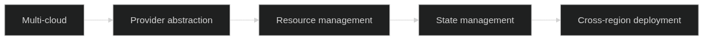

# Molnarkitektur som kod

Molnarkitektur som kod representerar den naturliga evolutionen av arkitektur som kod i cloud-native miljöer. Genom att utnyttja molnleverantörers API:er och tjänster kan organisationer skapa skalbara, resilient och kostnadseffektiva arkitekturer helt genom arkitektur som kod. Som vi såg i [kapitel 2 om grundläggande principer](02_kapitel1.md), är denna approach fundamental för moderna organisationer som strävar efter digital transformation och operational excellence.



Diagrammet illustrerar progression från multi-cloud environments genom provider abstraction och resource management till state management och cross-region deployment capabilities. Denna progression möjliggör den typ av skalbar arkitektur som kod-automatisering som vi kommer att fördjupa i [kapitel 4 om CI/CD-pipelines](04_kapitel3.md) och den organisatoriska förändring som diskuteras i [kapitel 10](10_kapitel9.md).

## Molnleverantörers ekosystem för Arkitektur som kod

Svenska organisationer står inför ett rikt utbud av molnleverantörer, var och en med sina egna styrkor och specialiseringar. För att uppnå framgångsrik cloud adoption måste organisationer förstå varje leverantörs unika capabilities och hur dessa kan utnyttjas genom arkitektur som kod approaches.

### Amazon Web Services (AWS) och svenska organisationer

AWS dominerar den globala molnmarknaden och har etablerat stark närvaro i Sverige genom datacenters i Stockholm-regionen. För svenska organisationer erbjuder AWS omfattande tjänster som är särskilt relevanta för lokala compliance-krav och prestanda-behov.

**AWS CloudFormation** utgör AWS:s native Infrastructure as Code-tjänst som möjliggör deklarativ definition av AWS-resurser genom JSON eller YAML templates. CloudFormation hanterar resource dependencies automatiskt och säkerställer att infrastructure deployments är reproducerbara och rollback-capable:

För en detaljerad CloudFormation template som implementerar VPC setup för svenska organisationer med GDPR compliance, se [07_CODE_1: VPC Setup för svenska organisationer](#07_CODE_1) i Appendix A.

**AWS CDK (Cloud Development Kit)** revolutionerar Infrastructure as Code genom att möjliggöra definition av cloud resources med programmeringsspråk som TypeScript, Python, Java och C#. För svenska utvecklarteam som redan behärskar dessa språk reducerar CDK learning curve och möjliggör återanvändning av befintliga programmeringskunskaper:

```typescript
// cdk/svenska-org-infrastructure.ts
import * as cdk from 'aws-cdk-lib';
import * as ec2 from 'aws-cdk-lib/aws-ec2';
import * as rds from 'aws-cdk-lib/aws-rds';
import * as logs from 'aws-cdk-lib/aws-logs';
import * as kms from 'aws-cdk-lib/aws-kms';
import { Construct } from 'constructs';

export interface SvenskaOrgInfrastructureProps extends cdk.StackProps {
  environment: 'development' | 'staging' | 'production';
  dataClassification: 'public' | 'internal' | 'confidential' | 'restricted';
  complianceRequirements: string[];
  costCenter: string;
  organizationalUnit: string;
}

export class SvenskaOrgInfrastructureStack extends cdk.Stack {
  constructor(scope: Construct, id: string, props: SvenskaOrgInfrastructureProps) {
    super(scope, id, props);

    // Definiera common tags för alla resurser
    const commonTags = {
      Environment: props.environment,
      DataClassification: props.dataClassification,
      CostCenter: props.costCenter,
      OrganizationalUnit: props.organizationalUnit,
      Country: 'Sweden',
      Region: 'eu-north-1',
      ComplianceRequirements: props.complianceRequirements.join(','),
      ManagedBy: 'AWS-CDK',
      LastUpdated: new Date().toISOString().split('T')[0]
    };

    // Skapa VPC med svenska säkerhetskrav
    const vpc = new ec2.Vpc(this, 'SvenskaOrgVPC', {
      cidr: props.environment === 'production' ? '10.0.0.0/16' : '10.1.0.0/16',
      maxAzs: props.environment === 'production' ? 3 : 2,
      enableDnsHostnames: true,
      enableDnsSupport: true,
      subnetConfiguration: [
        {
          cidrMask: 24,
          name: 'Public',
          subnetType: ec2.SubnetType.PUBLIC,
        },
        {
          cidrMask: 24,
          name: 'Private',
          subnetType: ec2.SubnetType.PRIVATE_WITH_EGRESS,
        },
        {
          cidrMask: 24,
          name: 'Database',
          subnetType: ec2.SubnetType.PRIVATE_ISOLATED,
        }
      ],
      flowLogs: {
        cloudwatch: {
          logRetention: logs.RetentionDays.THREE_MONTHS
        }
      }
    });

    // Tillämpa common tags på VPC
    Object.entries(commonTags).forEach(([key, value]) => {
      cdk.Tags.of(vpc).add(key, value);
    });

    // GDPR-compliant KMS key för databaskryptering
    const databaseEncryptionKey = new kms.Key(this, 'DatabaseEncryptionKey', {
      description: 'KMS key för databaskryptering enligt GDPR-krav',
      enableKeyRotation: true,
      removalPolicy: props.environment === 'production' ? 
        cdk.RemovalPolicy.RETAIN : cdk.RemovalPolicy.DESTROY
    });

    // Database subnet group för isolerad databas-tier
    const dbSubnetGroup = new rds.SubnetGroup(this, 'DatabaseSubnetGroup', {
      vpc,
      description: 'Subnet group för GDPR-compliant databaser',
      vpcSubnets: {
        subnetType: ec2.SubnetType.PRIVATE_ISOLATED
      }
    });

    // RDS instans med svenska säkerhetskrav
    if (props.environment === 'production') {
      const database = new rds.DatabaseInstance(this, 'PrimaryDatabase', {
        engine: rds.DatabaseInstanceEngine.postgres({
          version: rds.PostgresEngineVersion.VER_15_4
        }),
        instanceType: ec2.InstanceType.of(ec2.InstanceClass.R5, ec2.InstanceSize.LARGE),
        vpc,
        subnetGroup: dbSubnetGroup,
        storageEncrypted: true,
        storageEncryptionKey: databaseEncryptionKey,
        backupRetention: cdk.Duration.days(30),
        deletionProtection: true,
        deleteAutomatedBackups: false,
        enablePerformanceInsights: true,
        monitoringInterval: cdk.Duration.seconds(60),
        cloudwatchLogsExports: ['postgresql'],
        parameters: {
          // Svenska tidszon och locale
          'timezone': 'Europe/Stockholm',
          'lc_messages': 'sv_SE.UTF-8',
          'lc_monetary': 'sv_SE.UTF-8',
          'lc_numeric': 'sv_SE.UTF-8',
          'lc_time': 'sv_SE.UTF-8',
          // GDPR-relevanta inställningar
          'log_statement': 'all',
          'log_min_duration_statement': '0',
          'shared_preload_libraries': 'pg_stat_statements',
          // Säkerhetsinställningar
          'ssl': 'on',
          'ssl_ciphers': 'HIGH:!aNULL:!MD5',
          'ssl_prefer_server_ciphers': 'on'
        }
      });

      // Tillämpa svenska compliance tags
      cdk.Tags.of(database).add('DataResidency', 'Sweden');
      cdk.Tags.of(database).add('GDPRCompliant', 'true');
      cdk.Tags.of(database).add('ISO27001Compliant', 'true');
      cdk.Tags.of(database).add('BackupRetention', '30-days');
    }

    // Security groups med svenska säkerhetsstandarder
    const webSecurityGroup = new ec2.SecurityGroup(this, 'WebSecurityGroup', {
      vpc,
      description: 'Security group för web tier enligt svenska säkerhetskrav',
      allowAllOutbound: false
    });

    // Begränsa inkommande trafik till HTTPS endast
    webSecurityGroup.addIngressRule(
      ec2.Peer.anyIpv4(),
      ec2.Port.tcp(443),
      'HTTPS från internet'
    );

    // Tillåt utgående trafik endast till nödvändiga tjänster
    webSecurityGroup.addEgressRule(
      ec2.Peer.anyIpv4(),
      ec2.Port.tcp(443),
      'HTTPS utgående'
    );

    // Application security group med restriktiv access
    const appSecurityGroup = new ec2.SecurityGroup(this, 'AppSecurityGroup', {
      vpc,
      description: 'Security group för application tier',
      allowAllOutbound: false
    });

    appSecurityGroup.addIngressRule(
      webSecurityGroup,
      ec2.Port.tcp(8080),
      'Trafik från web tier'
    );

    // Database security group - endast från app tier
    const dbSecurityGroup = new ec2.SecurityGroup(this, 'DatabaseSecurityGroup', {
      vpc,
      description: 'Security group för database tier med minimal access',
      allowAllOutbound: false
    });

    dbSecurityGroup.addIngressRule(
      appSecurityGroup,
      ec2.Port.tcp(5432),
      'PostgreSQL från application tier'
    );

    // VPC Endpoints för AWS services (undviker data exfiltration via internet)
    const s3Endpoint = vpc.addGatewayEndpoint('S3Endpoint', {
      service: ec2.GatewayVpcEndpointAwsService.S3
    });

    const ec2Endpoint = vpc.addInterfaceEndpoint('EC2Endpoint', {
      service: ec2.InterfaceVpcEndpointAwsService.EC2,
      privateDnsEnabled: true
    });

    const rdsEndpoint = vpc.addInterfaceEndpoint('RDSEndpoint', {
      service: ec2.InterfaceVpcEndpointAwsService.RDS,
      privateDnsEnabled: true
    });

    // CloudWatch för monitoring och GDPR compliance logging
    const monitoringLogGroup = new logs.LogGroup(this, 'MonitoringLogGroup', {
      logGroupName: `/aws/svenska-org/${props.environment}/monitoring`,
      retention: logs.RetentionDays.THREE_MONTHS,
      encryptionKey: databaseEncryptionKey
    });

    // Outputs för cross-stack references
    new cdk.CfnOutput(this, 'VPCId', {
      value: vpc.vpcId,
      description: 'VPC ID för svenska organisationen',
      exportName: `${this.stackName}-VPC-ID`
    });

    new cdk.CfnOutput(this, 'ComplianceStatus', {
      value: JSON.stringify({
        gdprCompliant: props.complianceRequirements.includes('gdpr'),
        iso27001Compliant: props.complianceRequirements.includes('iso27001'),
        dataResidency: 'Sweden',
        encryptionEnabled: true,
        auditLoggingEnabled: true
      }),
      description: 'Compliance status för deployed infrastructure'
    });
  }

  // Metod för att lägga till svenska holidayschedules för cost optimization
  addSwedishHolidayScheduling(resource: cdk.Resource) {
    const swedishHolidays = [
      '2024-01-01', // Nyårsdagen
      '2024-01-06', // Trettondedag jul
      '2024-03-29', // Långfredagen
      '2024-04-01', // Annandag påsk
      '2024-05-01', // Första maj
      '2024-05-09', // Kristi himmelsfärdsdag
      '2024-05-20', // Annandag pingst
      '2024-06-21', // Midsommarafton
      '2024-06-22', // Midsommardagen
      '2024-11-02', // Alla helgons dag
      '2024-12-24', // Julafton
      '2024-12-25', // Juldagen
      '2024-12-26', // Annandag jul
      '2024-12-31'  // Nyårsafton
    ];

    cdk.Tags.of(resource).add('SwedishHolidays', swedishHolidays.join(','));
    cdk.Tags.of(resource).add('CostOptimization', 'SwedishSchedule');
  }
}

// Usage example
const app = new cdk.App();

new SvenskaOrgInfrastructureStack(app, 'SvenskaOrgDev', {
  environment: 'development',
  dataClassification: 'internal',
  complianceRequirements: ['gdpr'],
  costCenter: 'CC-1001',
  organizationalUnit: 'IT-Development',
  env: {
    account: process.env.CDK_DEFAULT_ACCOUNT,
    region: 'eu-north-1'
  }
});

new SvenskaOrgInfrastructureStack(app, 'SvenskaOrgProd', {
  environment: 'production',
  dataClassification: 'confidential',
  complianceRequirements: ['gdpr', 'iso27001'],
  costCenter: 'CC-2001',
  organizationalUnit: 'IT-Production',
  env: {
    account: process.env.CDK_DEFAULT_ACCOUNT,
    region: 'eu-north-1'
  }
});
```

### Microsoft Azure för svenska organisationer

Microsoft Azure har utvecklat stark position i Sverige, särskilt inom offentlig sektor och traditionella enterprise-organisationer. Azure Resource Manager (ARM) templates och Bicep utgör Microsofts primary Infrastructure as Code offerings.

**Azure Resource Manager (ARM) Templates** möjliggör deklarativ definition av Azure-resurser genom JSON-baserade templates. För svenska organisationer som redan använder Microsoft-produkter utgör ARM templates en naturlig extension av befintliga Microsoft-skickigheter:

```json
{
  "$schema": "https://schema.management.azure.com/schemas/2019-04-01/deploymentTemplate.json#",
  "contentVersion": "1.0.0.0",
  "metadata": {
    "description": "Azure infrastructure för svenska organisationer med GDPR compliance",
    "author": "Svenska IT-avdelningen"
  },
  "parameters": {
    "environmentType": {
      "type": "string",
      "defaultValue": "development",
      "allowedValues": ["development", "staging", "production"],
      "metadata": {
        "description": "Miljötyp för deployment"
      }
    },
    "dataClassification": {
      "type": "string",
      "defaultValue": "internal",
      "allowedValues": ["public", "internal", "confidential", "restricted"],
      "metadata": {
        "description": "Dataklassificering enligt svenska säkerhetsstandarder"
      }
    },
    "organizationName": {
      "type": "string",
      "defaultValue": "svenska-org",
      "metadata": {
        "description": "Organisationsnamn för resource naming"
      }
    },
    "costCenter": {
      "type": "string",
      "metadata": {
        "description": "Kostnadscenter för fakturering"
      }
    },
    "gdprCompliance": {
      "type": "bool",
      "defaultValue": true,
      "metadata": {
        "description": "Aktivera GDPR compliance features"
      }
    }
  },
  "variables": {
    "resourcePrefix": "[concat(parameters('organizationName'), '-', parameters('environmentType'))]",
    "location": "Sweden Central",
    "vnetName": "[concat(variables('resourcePrefix'), '-vnet')]",
    "subnetNames": {
      "web": "[concat(variables('resourcePrefix'), '-web-subnet')]",
      "app": "[concat(variables('resourcePrefix'), '-app-subnet')]",
      "database": "[concat(variables('resourcePrefix'), '-db-subnet')]"
    },
    "nsgNames": {
      "web": "[concat(variables('resourcePrefix'), '-web-nsg')]",
      "app": "[concat(variables('resourcePrefix'), '-app-nsg')]",
      "database": "[concat(variables('resourcePrefix'), '-db-nsg')]"
    },
    "commonTags": {
      "Environment": "[parameters('environmentType')]",
      "DataClassification": "[parameters('dataClassification')]",
      "CostCenter": "[parameters('costCenter')]",
      "Country": "Sweden",
      "Region": "Sweden Central",
      "GDPRCompliant": "[string(parameters('gdprCompliance'))]",
      "ManagedBy": "ARM-Template",
      "LastDeployed": "[utcNow()]"
    }
  },
  "resources": [
    {
      "type": "Microsoft.Network/virtualNetworks",
      "apiVersion": "2023-04-01",
      "name": "[variables('vnetName')]",
      "location": "[variables('location')]",
      "tags": "[variables('commonTags')]",
      "properties": {
        "addressSpace": {
          "addressPrefixes": [
            "[if(equals(parameters('environmentType'), 'production'), '10.0.0.0/16', '10.1.0.0/16')]"
          ]
        },
        "enableDdosProtection": "[equals(parameters('environmentType'), 'production')]",
        "subnets": [
          {
            "name": "[variables('subnetNames').web]",
            "properties": {
              "addressPrefix": "[if(equals(parameters('environmentType'), 'production'), '10.0.1.0/24', '10.1.1.0/24')]",
              "networkSecurityGroup": {
                "id": "[resourceId('Microsoft.Network/networkSecurityGroups', variables('nsgNames').web)]"
              },
              "serviceEndpoints": [
                {
                  "service": "Microsoft.Storage",
                  "locations": ["Sweden Central", "Sweden South"]
                },
                {
                  "service": "Microsoft.KeyVault",
                  "locations": ["Sweden Central", "Sweden South"]
                }
              ]
            }
          },
          {
            "name": "[variables('subnetNames').app]",
            "properties": {
              "addressPrefix": "[if(equals(parameters('environmentType'), 'production'), '10.0.2.0/24', '10.1.2.0/24')]",
              "networkSecurityGroup": {
                "id": "[resourceId('Microsoft.Network/networkSecurityGroups', variables('nsgNames').app)]"
              },
              "serviceEndpoints": [
                {
                  "service": "Microsoft.Sql",
                  "locations": ["Sweden Central", "Sweden South"]
                }
              ]
            }
          },
          {
            "name": "[variables('subnetNames').database]",
            "properties": {
              "addressPrefix": "[if(equals(parameters('environmentType'), 'production'), '10.0.3.0/24', '10.1.3.0/24')]",
              "networkSecurityGroup": {
                "id": "[resourceId('Microsoft.Network/networkSecurityGroups', variables('nsgNames').database)]"
              },
              "delegations": [
                {
                  "name": "Microsoft.DBforPostgreSQL/flexibleServers",
                  "properties": {
                    "serviceName": "Microsoft.DBforPostgreSQL/flexibleServers"
                  }
                }
              ]
            }
          }
        ]
      },
      "dependsOn": [
        "[resourceId('Microsoft.Network/networkSecurityGroups', variables('nsgNames').web)]",
        "[resourceId('Microsoft.Network/networkSecurityGroups', variables('nsgNames').app)]",
        "[resourceId('Microsoft.Network/networkSecurityGroups', variables('nsgNames').database)]"
      ]
    },
    {
      "type": "Microsoft.Network/networkSecurityGroups",
      "apiVersion": "2023-04-01",
      "name": "[variables('nsgNames').web]",
      "location": "[variables('location')]",
      "tags": "[union(variables('commonTags'), createObject('Tier', 'Web'))]",
      "properties": {
        "securityRules": [
          {
            "name": "Allow-HTTPS-Inbound",
            "properties": {
              "description": "Tillåt HTTPS trafik från internet",
              "protocol": "Tcp",
              "sourcePortRange": "*",
              "destinationPortRange": "443",
              "sourceAddressPrefix": "Internet",
              "destinationAddressPrefix": "*",
              "access": "Allow",
              "priority": 100,
              "direction": "Inbound"
            }
          },
          {
            "name": "Allow-HTTP-Redirect",
            "properties": {
              "description": "Tillåt HTTP för redirect till HTTPS",
              "protocol": "Tcp",
              "sourcePortRange": "*",
              "destinationPortRange": "80",
              "sourceAddressPrefix": "Internet",
              "destinationAddressPrefix": "*",
              "access": "Allow",
              "priority": 110,
              "direction": "Inbound"
            }
          },
          {
            "name": "Deny-All-Inbound",
            "properties": {
              "description": "Neka all övrig inkommande trafik",
              "protocol": "*",
              "sourcePortRange": "*",
              "destinationPortRange": "*",
              "sourceAddressPrefix": "*",
              "destinationAddressPrefix": "*",
              "access": "Deny",
              "priority": 4096,
              "direction": "Inbound"
            }
          }
        ]
      }
    },
    {
      "condition": "[parameters('gdprCompliance')]",
      "type": "Microsoft.KeyVault/vaults",
      "apiVersion": "2023-02-01",
      "name": "[concat(variables('resourcePrefix'), '-kv')]",
      "location": "[variables('location')]",
      "tags": "[union(variables('commonTags'), createObject('Purpose', 'GDPR-Compliance'))]",
      "properties": {
        "sku": {
          "family": "A",
          "name": "standard"
        },
        "tenantId": "[subscription().tenantId]",
        "enabledForDeployment": false,
        "enabledForDiskEncryption": true,
        "enabledForTemplateDeployment": true,
        "enableSoftDelete": true,
        "softDeleteRetentionInDays": 90,
        "enablePurgeProtection": "[equals(parameters('environmentType'), 'production')]",
        "enableRbacAuthorization": true,
        "networkAcls": {
          "defaultAction": "Deny",
          "bypass": "AzureServices",
          "virtualNetworkRules": [
            {
              "id": "[resourceId('Microsoft.Network/virtualNetworks/subnets', variables('vnetName'), variables('subnetNames').app)]",
              "ignoreMissingVnetServiceEndpoint": false
            }
          ]
        }
      },
      "dependsOn": [
        "[resourceId('Microsoft.Network/virtualNetworks', variables('vnetName'))]"
      ]
    }
  ],
  "outputs": {
    "vnetId": {
      "type": "string",
      "value": "[resourceId('Microsoft.Network/virtualNetworks', variables('vnetName'))]",
      "metadata": {
        "description": "Resource ID för det skapade virtual network"
      }
    },
    "subnetIds": {
      "type": "object",
      "value": {
        "web": "[resourceId('Microsoft.Network/virtualNetworks/subnets', variables('vnetName'), variables('subnetNames').web)]",
        "app": "[resourceId('Microsoft.Network/virtualNetworks/subnets', variables('vnetName'), variables('subnetNames').app)]",
        "database": "[resourceId('Microsoft.Network/virtualNetworks/subnets', variables('vnetName'), variables('subnetNames').database)]"
      },
      "metadata": {
        "description": "Resource IDs för alla skapade subnets"
      }
    },
    "complianceStatus": {
      "type": "object",
      "value": {
        "gdprCompliant": "[parameters('gdprCompliance')]",
        "dataResidency": "Sweden",
        "encryptionEnabled": true,
        "auditLoggingEnabled": true,
        "networkSegmentation": true,
        "accessControlEnabled": true
      },
      "metadata": {
        "description": "Compliance status för deployed infrastructure"
      }
    }
  }
}
```

**Azure Bicep** representerar nästa generation av ARM templates med förbättrad syntax och developer experience. Bicep kompilerar till ARM templates men erbjuder mer läsbar och maintainable kod:

```bicep
// bicep/svenska-org-infrastructure.bicep
// Azure Bicep för svenska organisationer med GDPR compliance

@description('Miljötyp för deployment')
@allowed(['development', 'staging', 'production'])
param environmentType string = 'development'

@description('Dataklassificering enligt svenska säkerhetsstandarder')
@allowed(['public', 'internal', 'confidential', 'restricted'])
param dataClassification string = 'internal'

@description('Organisationsnamn för resource naming')
param organizationName string = 'svenska-org'

@description('Kostnadscenter för fakturering')
param costCenter string

@description('Aktivera GDPR compliance features')
param gdprCompliance bool = true

@description('Lista över compliance-krav')
param complianceRequirements array = ['gdpr']

// Variabler för konsistent naming och configuration
var resourcePrefix = '${organizationName}-${environmentType}'
var location = 'Sweden Central'
var isProduction = environmentType == 'production'

// Common tags för alla resurser
var commonTags = {
  Environment: environmentType
  DataClassification: dataClassification
  CostCenter: costCenter
  Country: 'Sweden'
  Region: 'Sweden Central'
  GDPRCompliant: string(gdprCompliance)
  ComplianceRequirements: join(complianceRequirements, ',')
  ManagedBy: 'Azure-Bicep'
  LastDeployed: utcNow('yyyy-MM-dd')
}

// Log Analytics Workspace för svenska organisationer
resource logAnalytics 'Microsoft.OperationalInsights/workspaces@2023-09-01' = if (gdprCompliance) {
  name: '${resourcePrefix}-law'
  location: location
  tags: union(commonTags, {
    Purpose: 'GDPR-Compliance-Logging'
  })
  properties: {
    sku: {
      name: 'PerGB2018'
    }
    retentionInDays: isProduction ? 90 : 30
    features: {
      searchVersion: 1
      legacy: false
      enableLogAccessUsingOnlyResourcePermissions: true
    }
    workspaceCapping: {
      dailyQuotaGb: isProduction ? 50 : 10
    }
    publicNetworkAccessForIngestion: 'Disabled'
    publicNetworkAccessForQuery: 'Disabled'
  }
}

// Key Vault för säker hantering av secrets och encryption keys
resource keyVault 'Microsoft.KeyVault/vaults@2023-02-01' = if (gdprCompliance) {
  name: '${resourcePrefix}-kv'
  location: location
  tags: union(commonTags, {
    Purpose: 'Secret-Management'
  })
  properties: {
    sku: {
      family: 'A'
      name: 'standard'
    }
    tenantId: subscription().tenantId
    enabledForDeployment: false
    enabledForDiskEncryption: true
    enabledForTemplateDeployment: true
    enableSoftDelete: true
    softDeleteRetentionInDays: 90
    enablePurgeProtection: isProduction
    enableRbacAuthorization: true
    networkAcls: {
      defaultAction: 'Deny'
      bypass: 'AzureServices'
    }
  }
}

// Virtual Network med svenska säkerhetskrav
resource vnet 'Microsoft.Network/virtualNetworks@2023-04-01' = {
  name: '${resourcePrefix}-vnet'
  location: location
  tags: commonTags
  properties: {
    addressSpace: {
      addressPrefixes: [
        isProduction ? '10.0.0.0/16' : '10.1.0.0/16'
      ]
    }
    enableDdosProtection: isProduction
    subnets: [
      {
        name: 'web-subnet'
        properties: {
          addressPrefix: isProduction ? '10.0.1.0/24' : '10.1.1.0/24'
          networkSecurityGroup: {
            id: webNsg.id
          }
          serviceEndpoints: [
            {
              service: 'Microsoft.Storage'
              locations: ['Sweden Central', 'Sweden South']
            }
            {
              service: 'Microsoft.KeyVault'
              locations: ['Sweden Central', 'Sweden South']
            }
          ]
        }
      }
      {
        name: 'app-subnet'
        properties: {
          addressPrefix: isProduction ? '10.0.2.0/24' : '10.1.2.0/24'
          networkSecurityGroup: {
            id: appNsg.id
          }
          serviceEndpoints: [
            {
              service: 'Microsoft.Sql'
              locations: ['Sweden Central', 'Sweden South']
            }
          ]
        }
      }
      {
        name: 'database-subnet'
        properties: {
          addressPrefix: isProduction ? '10.0.3.0/24' : '10.1.3.0/24'
          networkSecurityGroup: {
            id: dbNsg.id
          }
          delegations: [
            {
              name: 'Microsoft.DBforPostgreSQL/flexibleServers'
              properties: {
                serviceName: 'Microsoft.DBforPostgreSQL/flexibleServers'
              }
            }
          ]
        }
      }
    ]
  }
}

// Network Security Groups med restriktiva säkerhetsregler
resource webNsg 'Microsoft.Network/networkSecurityGroups@2023-04-01' = {
  name: '${resourcePrefix}-web-nsg'
  location: location
  tags: union(commonTags, { Tier: 'Web' })
  properties: {
    securityRules: [
      {
        name: 'Allow-HTTPS-Inbound'
        properties: {
          description: 'Tillåt HTTPS trafik från internet'
          protocol: 'Tcp'
          sourcePortRange: '*'
          destinationPortRange: '443'
          sourceAddressPrefix: 'Internet'
          destinationAddressPrefix: '*'
          access: 'Allow'
          priority: 100
          direction: 'Inbound'
        }
      }
      {
        name: 'Allow-HTTP-Redirect'
        properties: {
          description: 'Tillåt HTTP för redirect till HTTPS'
          protocol: 'Tcp'
          sourcePortRange: '*'
          destinationPortRange: '80'
          sourceAddressPrefix: 'Internet'
          destinationAddressPrefix: '*'
          access: 'Allow'
          priority: 110
          direction: 'Inbound'
        }
      }
    ]
  }
}

resource appNsg 'Microsoft.Network/networkSecurityGroups@2023-04-01' = {
  name: '${resourcePrefix}-app-nsg'
  location: location
  tags: union(commonTags, { Tier: 'Application' })
  properties: {
    securityRules: [
      {
        name: 'Allow-Web-To-App'
        properties: {
          description: 'Tillåt trafik från web tier till app tier'
          protocol: 'Tcp'
          sourcePortRange: '*'
          destinationPortRange: '8080'
          sourceAddressPrefix: isProduction ? '10.0.1.0/24' : '10.1.1.0/24'
          destinationAddressPrefix: '*'
          access: 'Allow'
          priority: 100
          direction: 'Inbound'
        }
      }
    ]
  }
}

resource dbNsg 'Microsoft.Network/networkSecurityGroups@2023-04-01' = {
  name: '${resourcePrefix}-db-nsg'
  location: location
  tags: union(commonTags, { Tier: 'Database' })
  properties: {
    securityRules: [
      {
        name: 'Allow-App-To-DB'
        properties: {
          description: 'Tillåt databasanslutningar från app tier'
          protocol: 'Tcp'
          sourcePortRange: '*'
          destinationPortRange: '5432'
          sourceAddressPrefix: isProduction ? '10.0.2.0/24' : '10.1.2.0/24'
          destinationAddressPrefix: '*'
          access: 'Allow'
          priority: 100
          direction: 'Inbound'
        }
      }
    ]
  }
}

// PostgreSQL Flexible Server för GDPR-compliant data storage
resource postgresServer 'Microsoft.DBforPostgreSQL/flexibleServers@2023-06-01-preview' = if (isProduction) {
  name: '${resourcePrefix}-postgres'
  location: location
  tags: union(commonTags, {
    DatabaseEngine: 'PostgreSQL'
    DataResidency: 'Sweden'
  })
  sku: {
    name: 'Standard_D4s_v3'
    tier: 'GeneralPurpose'
  }
  properties: {
    administratorLogin: 'pgadmin'
    administratorLoginPassword: 'TempPassword123!' // Kommer att ändras via Key Vault
    version: '15'
    storage: {
      storageSizeGB: 128
      autoGrow: 'Enabled'
    }
    backup: {
      backupRetentionDays: 35
      geoRedundantBackup: 'Enabled'
    }
    network: {
      delegatedSubnetResourceId: '${vnet.id}/subnets/database-subnet'
      privateDnsZoneArmResourceId: postgresPrivateDnsZone.id
    }
    highAvailability: {
      mode: 'ZoneRedundant'
    }
    maintenanceWindow: {
      customWindow: 'Enabled'
      dayOfWeek: 6 // Lördag
      startHour: 2
      startMinute: 0
    }
  }
}

// Private DNS Zone för PostgreSQL
resource postgresPrivateDnsZone 'Microsoft.Network/privateDnsZones@2020-06-01' = if (isProduction) {
  name: '${resourcePrefix}-postgres.private.postgres.database.azure.com'
  location: 'global'
  tags: commonTags
}

resource postgresPrivateDnsZoneVnetLink 'Microsoft.Network/privateDnsZones/virtualNetworkLinks@2020-06-01' = if (isProduction) {
  parent: postgresPrivateDnsZone
  name: '${resourcePrefix}-postgres-vnet-link'
  location: 'global'
  properties: {
    registrationEnabled: false
    virtualNetwork: {
      id: vnet.id
    }
  }
}

// Diagnostic Settings för GDPR compliance logging
resource vnetDiagnostics 'Microsoft.Insights/diagnosticSettings@2021-05-01-preview' = if (gdprCompliance) {
  name: '${resourcePrefix}-vnet-diagnostics'
  scope: vnet
  properties: {
    workspaceId: logAnalytics.id
    logs: [
      {
        categoryGroup: 'allLogs'
        enabled: true
        retentionPolicy: {
          enabled: true
          days: isProduction ? 90 : 30
        }
      }
    ]
    metrics: [
      {
        category: 'AllMetrics'
        enabled: true
        retentionPolicy: {
          enabled: true
          days: isProduction ? 90 : 30
        }
      }
    ]
  }
}

// Outputs för cross-template references
output vnetId string = vnet.id
output subnetIds object = {
  web: '${vnet.id}/subnets/web-subnet'
  app: '${vnet.id}/subnets/app-subnet'
  database: '${vnet.id}/subnets/database-subnet'
}

output complianceStatus object = {
  gdprCompliant: gdprCompliance
  dataResidency: 'Sweden'
  encryptionEnabled: true
  auditLoggingEnabled: gdprCompliance
  networkSegmentation: true
  accessControlEnabled: true
  backupRetention: isProduction ? '35-days' : '7-days'
}

output keyVaultId string = gdprCompliance ? keyVault.id : ''
output logAnalyticsWorkspaceId string = gdprCompliance ? logAnalytics.id : ''
```

### Google Cloud Platform för svenska innovationsorganisationer

Google Cloud Platform (GCP) attraherar svenska tech-företag och startups genom sina machine learning capabilities och innovativa tjänster. Google Cloud Deployment Manager och Terraform Google Provider utgör primary Arkitektur som kod tools för GCP.

**Google Cloud Deployment Manager** använder YAML eller Python för Infrastructure as Code definitions och integrerar naturligt med Google Cloud services:

```yaml
# gcp/svenska-org-infrastructure.yaml
# Deployment Manager template för svenska organisationer

resources:
  # VPC Network för svensk data residency
  - name: svenska-org-vpc
    type: compute.v1.network
    properties:
      description: "VPC för svenska organisationer med GDPR compliance"
      autoCreateSubnetworks: false
      routingConfig:
        routingMode: REGIONAL
    metadata:
      labels:
        environment: $(ref.environment)
        data-classification: $(ref.dataClassification)
        country: sweden
        gdpr-compliant: "true"

  # Subnets med svenska regionkrav
  - name: web-subnet
    type: compute.v1.subnetwork
    properties:
      description: "Web tier subnet för svenska applikationer"
      network: $(ref.svenska-org-vpc.selfLink)
      ipCidrRange: "10.0.1.0/24"
      region: europe-north1
      enableFlowLogs: true
      logConfig:
        enable: true
        flowSampling: 1.0
        aggregationInterval: INTERVAL_5_SEC
        metadata: INCLUDE_ALL_METADATA
      secondaryIpRanges:
        - rangeName: pods
          ipCidrRange: "10.1.0.0/16"
        - rangeName: services
          ipCidrRange: "10.2.0.0/20"

  - name: app-subnet
    type: compute.v1.subnetwork
    properties:
      description: "Application tier subnet"
      network: $(ref.svenska-org-vpc.selfLink)
      ipCidrRange: "10.0.2.0/24"
      region: europe-north1
      enableFlowLogs: true
      logConfig:
        enable: true
        flowSampling: 1.0
        aggregationInterval: INTERVAL_5_SEC

  - name: database-subnet
    type: compute.v1.subnetwork
    properties:
      description: "Database tier subnet med privat åtkomst"
      network: $(ref.svenska-org-vpc.selfLink)
      ipCidrRange: "10.0.3.0/24"
      region: europe-north1
      enableFlowLogs: true
      purpose: PRIVATE_SERVICE_CONNECT

  # Cloud SQL för GDPR-compliant databaser
  - name: svenska-org-postgres
    type: sqladmin.v1beta4.instance
    properties:
      name: svenska-org-postgres-$(ref.environment)
      region: europe-north1
      databaseVersion: POSTGRES_15
      settings:
        tier: db-custom-4-16384
        edition: ENTERPRISE
        availabilityType: REGIONAL
        dataDiskType: PD_SSD
        dataDiskSizeGb: 100
        storageAutoResize: true
        storageAutoResizeLimit: 500
        
        # Svenska tidszon och locale
        databaseFlags:
          - name: timezone
            value: "Europe/Stockholm"
          - name: lc_messages
            value: "sv_SE.UTF-8"
          - name: log_statement
            value: "all"
          - name: log_min_duration_statement
            value: "0"
          - name: ssl
            value: "on"
        
        # Backup och recovery för svenska krav
        backupConfiguration:
          enabled: true
          startTime: "02:00"
          location: "europe-north1"
          backupRetentionSettings:
            retentionUnit: COUNT
            retainedBackups: 30
          transactionLogRetentionDays: 7
          pointInTimeRecoveryEnabled: true
        
        # Säkerhetsinställningar
        ipConfiguration:
          ipv4Enabled: false
          privateNetwork: $(ref.svenska-org-vpc.selfLink)
          enablePrivatePathForGoogleCloudServices: true
          authorizedNetworks: []
          requireSsl: true
        
        # Maintenance för svenska arbetstider
        maintenanceWindow:
          hour: 2
          day: 6  # Lördag
          updateTrack: stable
        
        deletionProtectionEnabled: true
        
        # GDPR compliance logging
        insights:
          queryInsightsEnabled: true
          recordApplicationTags: true
          recordClientAddress: true
          queryStringLength: 4500
          queryPlansPerMinute: 20

  # Cloud KMS för kryptering av känslig data
  - name: svenska-org-keyring
    type: cloudkms.v1.keyRing
    properties:
      parent: projects/$(env.project)/locations/europe-north1
      keyRingId: svenska-org-keyring-$(ref.environment)

  - name: database-encryption-key
    type: cloudkms.v1.cryptoKey
    properties:
      parent: $(ref.svenska-org-keyring.name)
      cryptoKeyId: database-encryption-key
      purpose: ENCRYPT_DECRYPT
      versionTemplate:
        algorithm: GOOGLE_SYMMETRIC_ENCRYPTION
        protectionLevel: SOFTWARE
      rotationPeriod: 7776000s  # 90 dagar
      nextRotationTime: $(ref.nextRotationTime)

  # Firewall rules för säker nätverkstrafik
  - name: allow-web-to-app
    type: compute.v1.firewall
    properties:
      description: "Tillåt HTTPS trafik från web till app tier"
      network: $(ref.svenska-org-vpc.selfLink)
      direction: INGRESS
      priority: 1000
      sourceRanges:
        - "10.0.1.0/24"
      targetTags:
        - "app-server"
      allowed:
        - IPProtocol: tcp
          ports: ["8080"]

  - name: allow-app-to-database
    type: compute.v1.firewall
    properties:
      description: "Tillåt databasanslutningar från app tier"
      network: $(ref.svenska-org-vpc.selfLink)
      direction: INGRESS
      priority: 1000
      sourceRanges:
        - "10.0.2.0/24"
      targetTags:
        - "database-server"
      allowed:
        - IPProtocol: tcp
          ports: ["5432"]

  - name: deny-all-ingress
    type: compute.v1.firewall
    properties:
      description: "Neka all övrig inkommande trafik"
      network: $(ref.svenska-org-vpc.selfLink)
      direction: INGRESS
      priority: 65534
      sourceRanges:
        - "0.0.0.0/0"
      denied:
        - IPProtocol: all

  # Cloud Logging för GDPR compliance
  - name: svenska-org-log-sink
    type: logging.v2.sink
    properties:
      name: svenska-org-compliance-sink
      destination: storage.googleapis.com/svenska-org-audit-logs-$(ref.environment)
      filter: |
        resource.type="gce_instance" OR
        resource.type="cloud_sql_database" OR
        resource.type="gce_network" OR
        protoPayload.authenticationInfo.principalEmail!=""
      uniqueWriterIdentity: true

  # Cloud Storage för audit logs med svenska data residency
  - name: svenska-org-audit-logs
    type: storage.v1.bucket
    properties:
      name: svenska-org-audit-logs-$(ref.environment)
      location: EUROPE-NORTH1
      storageClass: STANDARD
      versioning:
        enabled: true
      lifecycle:
        rule:
          - action:
              type: SetStorageClass
              storageClass: NEARLINE
            condition:
              age: 30
          - action:
              type: SetStorageClass  
              storageClass: COLDLINE
            condition:
              age: 90
          - action:
              type: Delete
            condition:
              age: 2555  # 7 år för svenska krav
      retentionPolicy:
        retentionPeriod: 220752000  # 7 år i sekunder
      iamConfiguration:
        uniformBucketLevelAccess:
          enabled: true
      encryption:
        defaultKmsKeyName: $(ref.database-encryption-key.name)

outputs:
  - name: vpcId
    value: $(ref.svenska-org-vpc.id)
  - name: subnetIds
    value:
      web: $(ref.web-subnet.id)
      app: $(ref.app-subnet.id)
      database: $(ref.database-subnet.id)
  - name: complianceStatus
    value:
      gdprCompliant: true
      dataResidency: "Sweden"
      encryptionEnabled: true
      auditLoggingEnabled: true
      backupRetention: "30-days"
      logRetention: "7-years"
```

## Cloud-native arkitektur som kod patterns

Cloud-native Infrastructure as Code patterns utnyttjar molnspecifika tjänster och capabilities för att skapa optimala arkitekturer. Dessa patterns inkluderar serverless computing, managed databases, auto-scaling groups, och event-driven architectures som eliminerar traditionell infrastrukturhantering.

Microservices-baserade arkitekturer implementeras genom containerorkestrering, service mesh, och API gateways definierade som kod. Detta möjliggör loose coupling, independent scaling, och teknologidiversifiering samtidigt som operationell komplexitet hanteras genom automation.

### Container-First arkitekturpattern

Modern molnarkitektur bygger på containerisering som fundamental abstraktion för applikationsdeployment. För svenska organisationer innebär detta att infrastrukturdefinitioner fokuserar på container orchestration platforms som Kubernetes, AWS ECS, Azure Container Instances, eller Google Cloud Run:

```terraform
# terraform/container-platform.tf
# Container platform för svenska organisationer

resource "kubernetes_namespace" "application_namespace" {
  count = length(var.environments)
  
  metadata {
    name = "${var.organization_name}-${var.environments[count.index]}"
    
    labels = {
      "app.kubernetes.io/managed-by" = "terraform"
      "svenska.se/environment"       = var.environments[count.index]
      "svenska.se/data-classification" = var.data_classification
      "svenska.se/cost-center"       = var.cost_center
      "svenska.se/gdpr-compliant"    = "true"
      "svenska.se/backup-policy"     = var.environments[count.index] == "production" ? "daily" : "weekly"
    }
    
    annotations = {
      "svenska.se/contact-email"     = var.contact_email
      "svenska.se/created-date"      = timestamp()
      "svenska.se/compliance-review" = var.compliance_review_date
    }
  }
}

# Resource Quotas för kostnadskontroll och resource governance
resource "kubernetes_resource_quota" "namespace_quota" {
  count = length(var.environments)
  
  metadata {
    name      = "${var.organization_name}-${var.environments[count.index]}-quota"
    namespace = kubernetes_namespace.application_namespace[count.index].metadata[0].name
  }
  
  spec {
    hard = {
      "requests.cpu"    = var.environments[count.index] == "production" ? "8" : "2"
      "requests.memory" = var.environments[count.index] == "production" ? "16Gi" : "4Gi"
      "limits.cpu"      = var.environments[count.index] == "production" ? "16" : "4"
      "limits.memory"   = var.environments[count.index] == "production" ? "32Gi" : "8Gi"
      "persistentvolumeclaims" = var.environments[count.index] == "production" ? "10" : "3"
      "requests.storage" = var.environments[count.index] == "production" ? "100Gi" : "20Gi"
      "count/pods"      = var.environments[count.index] == "production" ? "50" : "10"
      "count/services"  = var.environments[count.index] == "production" ? "20" : "5"
    }
  }
}

# Network Policies för mikrosegmentering och säkerhet
resource "kubernetes_network_policy" "default_deny_all" {
  count = length(var.environments)
  
  metadata {
    name      = "default-deny-all"
    namespace = kubernetes_namespace.application_namespace[count.index].metadata[0].name
  }
  
  spec {
    pod_selector {}
    policy_types = ["Ingress", "Egress"]
  }
}

resource "kubernetes_network_policy" "allow_web_to_app" {
  count = length(var.environments)
  
  metadata {
    name      = "allow-web-to-app"
    namespace = kubernetes_namespace.application_namespace[count.index].metadata[0].name
  }
  
  spec {
    pod_selector {
      match_labels = {
        "app.kubernetes.io/component" = "application"
      }
    }
    
    policy_types = ["Ingress"]
    
    ingress {
      from {
        pod_selector {
          match_labels = {
            "app.kubernetes.io/component" = "web"
          }
        }
      }
      ports {
        protocol = "TCP"
        port     = "8080"
      }
    }
  }
}

# Pod Security Standards för svenska säkerhetskrav
resource "kubernetes_pod_security_policy" "svenska_org_psp" {
  metadata {
    name = "${var.organization_name}-pod-security-policy"
  }
  
  spec {
    privileged                 = false
    allow_privilege_escalation = false
    required_drop_capabilities = ["ALL"]
    volumes                    = ["configMap", "emptyDir", "projected", "secret", "downwardAPI", "persistentVolumeClaim"]
    
    run_as_user {
      rule = "MustRunAsNonRoot"
    }
    
    run_as_group {
      rule = "MustRunAs"
      range {
        min = 1
        max = 65535
      }
    }
    
    supplemental_groups {
      rule = "MustRunAs"
      range {
        min = 1
        max = 65535
      }
    }
    
    fs_group {
      rule = "RunAsAny"
    }
    
    se_linux {
      rule = "RunAsAny"
    }
  }
}

# Service Mesh konfiguration för svenska mikroservices
resource "kubernetes_manifest" "istio_namespace" {
  count = var.enable_service_mesh ? length(var.environments) : 0
  
  manifest = {
    apiVersion = "v1"
    kind       = "Namespace"
    metadata = {
      name = "${var.organization_name}-${var.environments[count.index]}-istio"
      labels = {
        "istio-injection" = "enabled"
        "svenska.se/service-mesh" = "istio"
        "svenska.se/mtls-mode" = "strict"
      }
    }
  }
}

resource "kubernetes_manifest" "istio_peer_authentication" {
  count = var.enable_service_mesh ? length(var.environments) : 0
  
  manifest = {
    apiVersion = "security.istio.io/v1beta1"
    kind       = "PeerAuthentication"
    metadata = {
      name      = "default"
      namespace = kubernetes_manifest.istio_namespace[count.index].manifest.metadata.name
    }
    spec = {
      mtls = {
        mode = "STRICT"
      }
    }
  }
}

# GDPR compliance genom Pod Disruption Budgets
resource "kubernetes_pod_disruption_budget" "application_pdb" {
  count = length(var.environments)
  
  metadata {
    name      = "${var.organization_name}-app-pdb"
    namespace = kubernetes_namespace.application_namespace[count.index].metadata[0].name
  }
  
  spec {
    min_available = var.environments[count.index] == "production" ? "2" : "1"
    selector {
      match_labels = {
        "app.kubernetes.io/name" = var.organization_name
        "app.kubernetes.io/component" = "application"
      }
    }
  }
}
```

### Serverless-first pattern för svenska innovationsorganisationer

Serverless arkitekturer möjliggör unprecedented skalbarhet och kostnadseffektivitet för svenska organisationer. Infrastructure as Code för serverless fokuserar på function definitions, event routing, och managed service integrations:

```terraform
# terraform/serverless-platform.tf
# Serverless platform för svenska organisationer

# AWS Lambda funktioner med svenska compliance-krav
resource "aws_lambda_function" "svenska_api_gateway" {
  filename         = "svenska-api-${var.version}.zip"
  function_name    = "${var.organization_name}-api-gateway-${var.environment}"
  role            = aws_iam_role.lambda_execution_role.arn
  handler         = "index.handler"
  source_code_hash = filebase64sha256("svenska-api-${var.version}.zip")
  runtime         = "nodejs18.x"
  timeout         = 30
  memory_size     = 512
  
  environment {
    variables = {
      ENVIRONMENT           = var.environment
      DATA_CLASSIFICATION   = var.data_classification
      GDPR_ENABLED         = "true"
      LOG_LEVEL            = var.environment == "production" ? "INFO" : "DEBUG"
      SWEDISH_TIMEZONE     = "Europe/Stockholm"
      COST_CENTER          = var.cost_center
      COMPLIANCE_MODE      = "svenska-gdpr"
    }
  }
  
  vpc_config {
    subnet_ids         = var.private_subnet_ids
    security_group_ids = [aws_security_group.lambda_sg.id]
  }
  
  tracing_config {
    mode = "Active"
  }
  
  dead_letter_config {
    target_arn = aws_sqs_queue.dlq.arn
  }
  
  tags = merge(local.common_tags, {
    Function = "API-Gateway"
    Runtime  = "Node.js18"
  })
}

# Event-driven arkitektur med SQS för svenska organisationer
resource "aws_sqs_queue" "svenska_event_queue" {
  name                       = "${var.organization_name}-events-${var.environment}"
  delay_seconds              = 0
  max_message_size           = 262144
  message_retention_seconds  = 1209600  # 14 dagar
  receive_wait_time_seconds  = 20
  visibility_timeout_seconds = 120
  
  kms_master_key_id = aws_kms_key.svenska_org_key.arn
  
  redrive_policy = jsonencode({
    deadLetterTargetArn = aws_sqs_queue.dlq.arn
    maxReceiveCount     = 3
  })
  
  tags = merge(local.common_tags, {
    MessageRetention = "14-days"
    Purpose         = "Event-Processing"
  })
}

resource "aws_sqs_queue" "dlq" {
  name                      = "${var.organization_name}-dlq-${var.environment}"
  message_retention_seconds = 1209600  # 14 dagar
  kms_master_key_id        = aws_kms_key.svenska_org_key.arn
  
  tags = merge(local.common_tags, {
    Purpose = "Dead-Letter-Queue"
  })
}

# DynamoDB för svenskt data residency
resource "aws_dynamodb_table" "svenska_data_store" {
  name           = "${var.organization_name}-data-${var.environment}"
  billing_mode   = "PAY_PER_REQUEST"
  hash_key       = "id"
  range_key      = "timestamp"
  stream_enabled = true
  stream_view_type = "NEW_AND_OLD_IMAGES"
  
  attribute {
    name = "id"
    type = "S"
  }
  
  attribute {
    name = "timestamp"
    type = "S"
  }
  
  attribute {
    name = "data_subject_id"
    type = "S"
  }
  
  global_secondary_index {
    name     = "DataSubjectIndex"
    hash_key = "data_subject_id"
    projection_type = "ALL"
  }
  
  ttl {
    attribute_name = "ttl"
    enabled        = true
  }
  
  server_side_encryption {
    enabled     = true
    kms_key_arn = aws_kms_key.svenska_org_key.arn
  }
  
  point_in_time_recovery {
    enabled = var.environment == "production"
  }
  
  tags = merge(local.common_tags, {
    DataType       = "Personal-Data"
    GDPRCompliant  = "true"
    DataResidency  = "Sweden"
  })
}

# API Gateway med svenska säkerhetskrav
resource "aws_api_gateway_rest_api" "svenska_api" {
  name        = "${var.organization_name}-api-${var.environment}"
  description = "API Gateway för svenska organisationen med GDPR compliance"
  
  endpoint_configuration {
    types = ["REGIONAL"]
  }
  
  policy = jsonencode({
    Version = "2012-10-17"
    Statement = [
      {
        Effect = "Allow"
        Principal = "*"
        Action = "execute-api:Invoke"
        Resource = "*"
        Condition = {
          IpAddress = {
            "aws:sourceIp" = var.allowed_ip_ranges
          }
        }
      }
    ]
  })
  
  tags = local.common_tags
}

# CloudWatch Logs för GDPR compliance och auditability
resource "aws_cloudwatch_log_group" "lambda_logs" {
  name              = "/aws/lambda/${aws_lambda_function.svenska_api_gateway.function_name}"
  retention_in_days = var.environment == "production" ? 90 : 30
  kms_key_id       = aws_kms_key.svenska_org_key.arn
  
  tags = merge(local.common_tags, {
    LogRetention = var.environment == "production" ? "90-days" : "30-days"
    Purpose      = "GDPR-Compliance"
  })
}

# Step Functions för svenska business processes
resource "aws_sfn_state_machine" "svenska_workflow" {
  name     = "${var.organization_name}-workflow-${var.environment}"
  role_arn = aws_iam_role.step_functions_role.arn
  
  definition = jsonencode({
    Comment = "Svenska organisationens GDPR-compliant workflow"
    StartAt = "ValidateInput"
    States = {
      ValidateInput = {
        Type = "Task"
        Resource = aws_lambda_function.input_validator.arn
        Next = "ProcessData"
        Retry = [
          {
            ErrorEquals     = ["Lambda.ServiceException", "Lambda.AWSLambdaException"]
            IntervalSeconds = 2
            MaxAttempts     = 3
            BackoffRate     = 2.0
          }
        ]
        Catch = [
          {
            ErrorEquals = ["States.TaskFailed"]
            Next        = "FailureHandler"
          }
        ]
      }
      ProcessData = {
        Type = "Task"
        Resource = aws_lambda_function.data_processor.arn
        Next = "AuditLog"
      }
      AuditLog = {
        Type = "Task"
        Resource = aws_lambda_function.audit_logger.arn
        Next = "Success"
      }
      Success = {
        Type = "Succeed"
      }
      FailureHandler = {
        Type = "Task"
        Resource = aws_lambda_function.failure_handler.arn
        End = true
      }
    }
  })
  
  logging_configuration {
    log_destination        = "${aws_cloudwatch_log_group.step_functions_logs.arn}:*"
    include_execution_data = true
    level                 = "ALL"
  }
  
  tracing_configuration {
    enabled = true
  }
  
  tags = merge(local.common_tags, {
    WorkflowType = "GDPR-Data-Processing"
    Purpose      = "Business-Process-Automation"
  })
}

# EventBridge för event-driven svenska organizationer
resource "aws_cloudwatch_event_bus" "svenska_event_bus" {
  name = "${var.organization_name}-events-${var.environment}"
  
  tags = merge(local.common_tags, {
    Purpose = "Event-Driven-Architecture"
  })
}

resource "aws_cloudwatch_event_rule" "gdpr_data_request" {
  name           = "${var.organization_name}-gdpr-request-${var.environment}"
  description    = "GDPR data subject rights requests"
  event_bus_name = aws_cloudwatch_event_bus.svenska_event_bus.name
  
  event_pattern = jsonencode({
    source      = ["svenska.gdpr"]
    detail-type = ["Data Subject Request"]
    detail = {
      requestType = ["access", "rectification", "erasure", "portability"]
    }
  })
  
  tags = merge(local.common_tags, {
    GDPRFunction = "Data-Subject-Rights"
  })
}

resource "aws_cloudwatch_event_target" "gdpr_processor" {
  rule           = aws_cloudwatch_event_rule.gdpr_data_request.name
  event_bus_name = aws_cloudwatch_event_bus.svenska_event_bus.name
  target_id      = "GDPRProcessor"
  arn           = aws_sfn_state_machine.svenska_workflow.arn
  role_arn      = aws_iam_role.eventbridge_role.arn
  
  input_transformer {
    input_paths = {
      dataSubjectId = "$.detail.dataSubjectId"
      requestType   = "$.detail.requestType"
      timestamp     = "$.time"
    }
    input_template = jsonencode({
      dataSubjectId    = "<dataSubjectId>"
      requestType      = "<requestType>"
      processingTime   = "<timestamp>"
      complianceMode   = "svenska-gdpr"
      environment      = var.environment
    })
  }
}
```

### Hybrid cloud pattern för svenska enterprise-organisationer

Många svenska organisationer kräver hybrid cloud approaches som kombinerar on-premises infrastruktur med public cloud services för att uppfylla regulatory, performance, eller legacy system requirements:

```terraform
# terraform/hybrid-cloud.tf
# Hybrid cloud infrastructure för svenska enterprise-organisationer

# AWS Direct Connect för dedicerad konnektivitet
resource "aws_dx_connection" "svenska_org_dx" {
  name            = "${var.organization_name}-dx-${var.environment}"
  bandwidth       = var.environment == "production" ? "10Gbps" : "1Gbps"
  location        = "Stockholm Interxion STO1"  # Svenska datacenter
  provider_name   = "Interxion"
  
  tags = merge(local.common_tags, {
    ConnectionType = "Direct-Connect"
    Location      = "Stockholm"
    Bandwidth     = var.environment == "production" ? "10Gbps" : "1Gbps"
  })
}

# Virtual Private Gateway för VPN connectivity
resource "aws_vpn_gateway" "svenska_org_vgw" {
  vpc_id            = var.vpc_id
  availability_zone = var.primary_az
  
  tags = merge(local.common_tags, {
    Name = "${var.organization_name}-vgw-${var.environment}"
    Type = "VPN-Gateway"
  })
}

# Customer Gateway för on-premises connectivity
resource "aws_customer_gateway" "svenska_org_cgw" {
  bgp_asn    = 65000
  ip_address = var.on_premises_public_ip
  type       = "ipsec.1"
  
  tags = merge(local.common_tags, {
    Name = "${var.organization_name}-cgw-${var.environment}"
    Location = "On-Premises-Stockholm"
  })
}

# Site-to-Site VPN för säker hybrid connectivity
resource "aws_vpn_connection" "svenska_org_vpn" {
  vpn_gateway_id      = aws_vpn_gateway.svenska_org_vgw.id
  customer_gateway_id = aws_customer_gateway.svenska_org_cgw.id
  type               = "ipsec.1"
  static_routes_only = false
  
  tags = merge(local.common_tags, {
    Name = "${var.organization_name}-vpn-${var.environment}"
    Type = "Site-to-Site-VPN"
  })
}

# AWS Storage Gateway för hybrid storage
resource "aws_storagegateway_gateway" "svenska_org_storage_gw" {
  gateway_name   = "${var.organization_name}-storage-gw-${var.environment}"
  gateway_timezone = "GMT+1:00"  # Svensk tid
  gateway_type     = "FILE_S3"
  
  tags = merge(local.common_tags, {
    Name = "${var.organization_name}-storage-gateway"
    Type = "File-Gateway"
    Location = "On-Premises"
  })
}

# S3 bucket för hybrid file shares med svenska data residency
resource "aws_s3_bucket" "hybrid_file_share" {
  bucket = "${var.organization_name}-hybrid-files-${var.environment}"
  
  tags = merge(local.common_tags, {
    Purpose = "Hybrid-File-Share"
    DataResidency = "Sweden"
  })
}

resource "aws_s3_bucket_server_side_encryption_configuration" "hybrid_encryption" {
  bucket = aws_s3_bucket.hybrid_file_share.id
  
  rule {
    apply_server_side_encryption_by_default {
      kms_master_key_id = aws_kms_key.svenska_org_key.arn
      sse_algorithm     = "aws:kms"
    }
    bucket_key_enabled = true
  }
}

# AWS Database Migration Service för hybrid data sync
resource "aws_dms_replication_instance" "svenska_org_dms" {
  replication_instance_class   = var.environment == "production" ? "dms.t3.large" : "dms.t3.micro"
  replication_instance_id     = "${var.organization_name}-dms-${var.environment}"
  
  allocated_storage            = var.environment == "production" ? 100 : 20
  apply_immediately           = var.environment != "production"
  auto_minor_version_upgrade  = true
  availability_zone           = var.primary_az
  engine_version              = "3.4.7"
  multi_az                    = var.environment == "production"
  publicly_accessible         = false
  replication_subnet_group_id = aws_dms_replication_subnet_group.svenska_org_dms_subnet.id
  vpc_security_group_ids      = [aws_security_group.dms_sg.id]
  
  tags = merge(local.common_tags, {
    Purpose = "Hybrid-Data-Migration"
  })
}

resource "aws_dms_replication_subnet_group" "svenska_org_dms_subnet" {
  replication_subnet_group_description = "DMS subnet group för svenska organisationen"
  replication_subnet_group_id          = "${var.organization_name}-dms-subnet-${var.environment}"
  subnet_ids                            = var.private_subnet_ids
  
  tags = local.common_tags
}

# AWS App Mesh för hybrid service mesh
resource "aws_appmesh_mesh" "svenska_org_mesh" {
  name = "${var.organization_name}-mesh-${var.environment}"
  
  spec {
    egress_filter {
      type = "ALLOW_ALL"
    }
  }
  
  tags = merge(local.common_tags, {
    MeshType = "Hybrid-Service-Mesh"
  })
}

# Route53 Resolver för hybrid DNS
resource "aws_route53_resolver_endpoint" "inbound" {
  name      = "${var.organization_name}-resolver-inbound-${var.environment}"
  direction = "INBOUND"
  
  security_group_ids = [aws_security_group.resolver_sg.id]
  
  dynamic "ip_address" {
    for_each = var.private_subnet_ids
    content {
      subnet_id = ip_address.value
    }
  }
  
  tags = merge(local.common_tags, {
    ResolverType = "Inbound"
    Purpose      = "Hybrid-DNS"
  })
}

resource "aws_route53_resolver_endpoint" "outbound" {
  name      = "${var.organization_name}-resolver-outbound-${var.environment}"
  direction = "OUTBOUND"
  
  security_group_ids = [aws_security_group.resolver_sg.id]
  
  dynamic "ip_address" {
    for_each = var.private_subnet_ids
    content {
      subnet_id = ip_address.value
    }
  }
  
  tags = merge(local.common_tags, {
    ResolverType = "Outbound"
    Purpose      = "Hybrid-DNS"
  })
}

# Security Groups för hybrid connectivity
resource "aws_security_group" "dms_sg" {
  name_prefix = "${var.organization_name}-dms-"
  description = "Security group för DMS replication instance"
  vpc_id      = var.vpc_id
  
  ingress {
    from_port   = 0
    to_port     = 65535
    protocol    = "tcp"
    cidr_blocks = [var.on_premises_cidr]
    description = "All traffic from on-premises"
  }
  
  egress {
    from_port   = 0
    to_port     = 65535
    protocol    = "tcp"
    cidr_blocks = ["0.0.0.0/0"]
    description = "All outbound traffic"
  }
  
  tags = merge(local.common_tags, {
    Name = "${var.organization_name}-dms-sg"
  })
}

resource "aws_security_group" "resolver_sg" {
  name_prefix = "${var.organization_name}-resolver-"
  description = "Security group för Route53 Resolver endpoints"
  vpc_id      = var.vpc_id
  
  ingress {
    from_port   = 53
    to_port     = 53
    protocol    = "tcp"
    cidr_blocks = [var.vpc_cidr, var.on_premises_cidr]
    description = "DNS TCP från VPC och on-premises"
  }
  
  ingress {
    from_port   = 53
    to_port     = 53
    protocol    = "udp"
    cidr_blocks = [var.vpc_cidr, var.on_premises_cidr]
    description = "DNS UDP från VPC och on-premises"
  }
  
  egress {
    from_port   = 53
    to_port     = 53
    protocol    = "tcp"
    cidr_blocks = [var.on_premises_cidr]
    description = "DNS TCP till on-premises"
  }
  
  egress {
    from_port   = 53
    to_port     = 53
    protocol    = "udp"
    cidr_blocks = [var.on_premises_cidr]
    description = "DNS UDP till on-premises"
  }
  
  tags = merge(local.common_tags, {
    Name = "${var.organization_name}-resolver-sg"
  })
}
```

## Multi-cloud strategier

Multi-cloud Infrastructure as Code strategier möjliggör distribution av workloads across flera molnleverantörer för att optimera kostnad, prestanda, och resiliens. Provider-agnostic tools som Terraform eller Pulumi används för att abstrahera leverantörspecifika skillnader och möjliggöra portabilitet.

Hybrid cloud arkitektur som kod-implementations kombinerar on-premises infrastruktur med public cloud services genom VPN connections, dedicated links, och edge computing. Consistent deployment och management processer across environments säkerställer operational efficiency och säkerhetskompliance.

### Terraform för multi-cloud abstraktion

Terraform utgör den mest mogna lösningen för multi-cloud Infrastructure as Code genom sitt omfattande provider ecosystem. För svenska organisationer möjliggör Terraform unified management av AWS, Azure, Google Cloud, och on-premises resurser genom en konsistent deklarativ syntax:

```hcl
# terraform/multi-cloud/main.tf
# Multi-cloud infrastructure för svenska organisationer

terraform {
  required_version = ">= 1.0"
  
  required_providers {
    aws = {
      source  = "hashicorp/aws"
      version = "~> 5.0"
    }
    azurerm = {
      source  = "hashicorp/azurerm"
      version = "~> 3.0"
    }
    google = {
      source  = "hashicorp/google"
      version = "~> 4.0"
    }
    kubernetes = {
      source  = "hashicorp/kubernetes"
      version = "~> 2.0"
    }
  }
  
  backend "s3" {
    bucket  = "svenska-org-terraform-state"
    key     = "multi-cloud/terraform.tfstate"
    region  = "eu-north-1"
    encrypt = true
  }
}

# AWS Provider för Stockholm region
provider "aws" {
  region = "eu-north-1"
  alias  = "stockholm"
  
  default_tags {
    tags = {
      Project         = var.project_name
      Environment     = var.environment
      Country         = "Sweden"
      DataResidency   = "Sweden"
      ManagedBy       = "Terraform"
      CostCenter      = var.cost_center
      GDPRCompliant   = "true"
    }
  }
}

# Azure Provider för Sweden Central
provider "azurerm" {
  features {
    key_vault {
      purge_soft_delete_on_destroy = false
    }
  }
  alias = "sweden"
}

# Google Cloud Provider för europe-north1
provider "google" {
  project = var.gcp_project_id
  region  = "europe-north1"
  alias   = "finland"
}

# Local values för konsistent naming across providers
locals {
  resource_prefix = "${var.organization_name}-${var.environment}"
  
  common_tags = {
    Project         = var.project_name
    Environment     = var.environment
    Organization    = var.organization_name
    Country         = "Sweden"
    DataResidency   = "Nordic"
    ManagedBy       = "Terraform"
    CostCenter      = var.cost_center
    GDPRCompliant   = "true"
    CreatedDate     = formatdate("YYYY-MM-DD", timestamp())
  }
  
  # GDPR data residency requirements
  data_residency_requirements = {
    personal_data      = "Sweden"
    sensitive_data     = "Sweden"
    financial_data     = "Sweden"
    health_data        = "Sweden"
    operational_data   = "Nordic"
    public_data        = "Global"
  }
}

# AWS Infrastructure för primary workloads
module "aws_infrastructure" {
  source = "./modules/aws"
  providers = {
    aws = aws.stockholm
  }
  
  organization_name    = var.organization_name
  environment         = var.environment
  resource_prefix     = local.resource_prefix
  common_tags         = local.common_tags
  
  # AWS-specific configuration
  vpc_cidr           = var.aws_vpc_cidr
  availability_zones = var.aws_availability_zones
  enable_nat_gateway = var.environment == "production"
  enable_vpn_gateway = true
  
  # Data residency och compliance
  data_classification      = var.data_classification
  compliance_requirements  = var.compliance_requirements
  backup_retention_days    = var.environment == "production" ? 90 : 30
  
  # Cost optimization
  enable_spot_instances    = var.environment != "production"
  enable_scheduled_scaling = true
}

# Azure Infrastructure för disaster recovery
module "azure_infrastructure" {
  source = "./modules/azure"
  providers = {
    azurerm = azurerm.sweden
  }
  
  organization_name   = var.organization_name
  environment        = "${var.environment}-dr"
  resource_prefix    = "${local.resource_prefix}-dr"
  common_tags        = merge(local.common_tags, { Purpose = "Disaster-Recovery" })
  
  # Azure-specific configuration
  location                = "Sweden Central"
  vnet_address_space     = var.azure_vnet_cidr
  enable_ddos_protection = var.environment == "production"
  
  # DR-specific settings
  enable_cross_region_backup = true
  backup_geo_redundancy     = "GRS"
  dr_automation_enabled     = var.environment == "production"
}

# Google Cloud för analytics och ML workloads
module "gcp_infrastructure" {
  source = "./modules/gcp"
  providers = {
    google = google.finland
  }
  
  organization_name = var.organization_name
  environment      = "${var.environment}-analytics"
  resource_prefix  = "${local.resource_prefix}-analytics"
  common_labels    = {
    for k, v in local.common_tags : 
    lower(replace(k, "_", "-")) => lower(v)
  }
  
  # GCP-specific configuration
  region                = "europe-north1"
  network_name         = "${local.resource_prefix}-analytics-vpc"
  enable_private_google_access = true
  
  # Analytics och ML-specific features
  enable_bigquery      = true
  enable_dataflow      = true
  enable_vertex_ai     = var.environment == "production"
  
  # Data governance för svenska krav
  enable_data_catalog  = true
  enable_dlp_api      = true
  data_residency_zone = "europe-north1"
}

# Cross-provider networking för hybrid connectivity
resource "aws_customer_gateway" "azure_gateway" {
  provider   = aws.stockholm
  bgp_asn    = 65515
  ip_address = module.azure_infrastructure.vpn_gateway_public_ip
  type       = "ipsec.1"
  
  tags = merge(local.common_tags, {
    Name = "${local.resource_prefix}-azure-cgw"
    Type = "Azure-Connection"
  })
}

resource "aws_vpn_connection" "aws_azure_connection" {
  provider            = aws.stockholm
  vpn_gateway_id      = module.aws_infrastructure.vpn_gateway_id
  customer_gateway_id = aws_customer_gateway.azure_gateway.id
  type               = "ipsec.1"
  static_routes_only = false
  
  tags = merge(local.common_tags, {
    Name = "${local.resource_prefix}-aws-azure-vpn"
    Connection = "AWS-Azure-Hybrid"
  })
}

# Shared services across all clouds
resource "kubernetes_namespace" "shared_services" {
  count = length(var.kubernetes_clusters)
  
  metadata {
    name = "shared-services"
    labels = merge(local.common_tags, {
      "app.kubernetes.io/managed-by" = "terraform"
      "svenska.se/shared-service"    = "true"
    })
  }
}

# Multi-cloud monitoring med Prometheus federation
resource "kubernetes_manifest" "prometheus_federation" {
  count = length(var.kubernetes_clusters)
  
  manifest = {
    apiVersion = "v1"
    kind       = "ConfigMap"
    metadata = {
      name      = "prometheus-federation-config"
      namespace = kubernetes_namespace.shared_services[count.index].metadata[0].name
    }
    data = {
      "prometheus.yml" = yamlencode({
        global = {
          scrape_interval = "15s"
          external_labels = {
            cluster   = var.kubernetes_clusters[count.index].name
            region    = var.kubernetes_clusters[count.index].region
            provider  = var.kubernetes_clusters[count.index].provider
          }
        }
        
        scrape_configs = [
          {
            job_name = "federate"
            scrape_interval = "15s"
            honor_labels = true
            metrics_path = "/federate"
            params = {
              "match[]" = [
                "{job=~\"kubernetes-.*\"}",
                "{__name__=~\"job:.*\"}",
                "{__name__=~\"svenska_org:.*\"}"
              ]
            }
            static_configs = var.kubernetes_clusters[count.index].prometheus_endpoints
          }
        ]
        
        rule_files = [
          "/etc/prometheus/rules/*.yml"
        ]
      })
    }
  }
}

# Cross-cloud DNS för service discovery
data "aws_route53_zone" "primary" {
  provider = aws.stockholm
  name     = var.dns_zone_name
}

resource "aws_route53_record" "azure_services" {
  provider = aws.stockholm
  count    = length(var.azure_service_endpoints)
  
  zone_id = data.aws_route53_zone.primary.zone_id
  name    = var.azure_service_endpoints[count.index].name
  type    = "CNAME"
  ttl     = 300
  records = [var.azure_service_endpoints[count.index].endpoint]
}

resource "aws_route53_record" "gcp_services" {
  provider = aws.stockholm
  count    = length(var.gcp_service_endpoints)
  
  zone_id = data.aws_route53_zone.primary.zone_id
  name    = var.gcp_service_endpoints[count.index].name
  type    = "CNAME"
  ttl     = 300
  records = [var.gcp_service_endpoints[count.index].endpoint]
}

# Cross-provider security groups synchronization
data "external" "azure_ip_ranges" {
  program = ["python3", "${path.module}/scripts/get-azure-ip-ranges.py"]
  
  query = {
    subscription_id = var.azure_subscription_id
    resource_group  = module.azure_infrastructure.resource_group_name
  }
}

resource "aws_security_group_rule" "allow_azure_traffic" {
  provider          = aws.stockholm
  count            = length(data.external.azure_ip_ranges.result.ip_ranges)
  
  type              = "ingress"
  from_port         = 443
  to_port           = 443
  protocol          = "tcp"
  cidr_blocks       = [data.external.azure_ip_ranges.result.ip_ranges[count.index]]
  security_group_id = module.aws_infrastructure.app_security_group_id
  description       = "HTTPS från Azure ${count.index + 1}"
}

# Multi-cloud cost optimization
resource "aws_budgets_budget" "multi_cloud_budget" {
  provider = aws.stockholm
  count    = var.environment == "production" ? 1 : 0
  
  name     = "${local.resource_prefix}-multi-cloud-budget"
  budget_type = "COST"
  limit_amount = var.monthly_budget_limit
  limit_unit   = "USD"
  time_unit    = "MONTHLY"
  
  cost_filters {
    tag = {
      Project = [var.project_name]
    }
  }
  
  notification {
    comparison_operator        = "GREATER_THAN"
    threshold                 = 80
    threshold_type            = "PERCENTAGE"
    notification_type         = "ACTUAL"
    subscriber_email_addresses = var.budget_notification_emails
  }
  
  notification {
    comparison_operator        = "GREATER_THAN"
    threshold                 = 100
    threshold_type            = "PERCENTAGE"
    notification_type          = "FORECASTED"
    subscriber_email_addresses = var.budget_notification_emails
  }
}

# Multi-cloud backup strategy
resource "aws_s3_bucket" "cross_cloud_backup" {
  provider = aws.stockholm
  bucket   = "${local.resource_prefix}-cross-cloud-backup"
  
  tags = merge(local.common_tags, {
    Purpose = "Cross-Cloud-Backup"
  })
}

resource "aws_s3_bucket_replication_configuration" "cross_region_replication" {
  provider   = aws.stockholm
  depends_on = [aws_s3_bucket_versioning.backup_versioning]
  
  role   = aws_iam_role.replication_role.arn
  bucket = aws_s3_bucket.cross_cloud_backup.id
  
  rule {
    id     = "cross-region-replication"
    status = "Enabled"
    
    destination {
      bucket        = "arn:aws:s3:::${local.resource_prefix}-cross-cloud-backup-replica"
      storage_class = "STANDARD_IA"
      
      encryption_configuration {
        replica_kms_key_id = aws_kms_key.backup_key.arn
      }
    }
  }
}

# Outputs för cross-provider integration
output "aws_vpc_id" {
  description = "AWS VPC ID för cross-provider networking"
  value       = module.aws_infrastructure.vpc_id
}

output "azure_vnet_id" {
  description = "Azure VNet ID för cross-provider networking"
  value       = module.azure_infrastructure.vnet_id
}

output "gcp_network_id" {
  description = "GCP VPC Network ID för cross-provider networking"
  value       = module.gcp_infrastructure.network_id
}

output "multi_cloud_endpoints" {
  description = "Service endpoints across all cloud providers"
  value = {
    aws_api_endpoint   = module.aws_infrastructure.api_gateway_endpoint
    azure_app_url      = module.azure_infrastructure.app_service_url
    gcp_analytics_url  = module.gcp_infrastructure.analytics_endpoint
  }
}

output "compliance_status" {
  description = "Compliance status across all cloud providers"
  value = {
    aws_gdpr_compliant   = module.aws_infrastructure.gdpr_compliant
    azure_gdpr_compliant = module.azure_infrastructure.gdpr_compliant
    gcp_gdpr_compliant   = module.gcp_infrastructure.gdpr_compliant
    data_residency_zones = local.data_residency_requirements
    cross_cloud_backup   = aws_s3_bucket.cross_cloud_backup.arn
  }
}
```

### Pulumi för programmatisk multi-cloud Infrastructure as Code

Arkitektur som kod-principerna inom detta område

Pulumi erbjuder en alternativ approach till multi-cloud Arkitektur som kod genom att möjliggöra användning av vanliga programmeringsspråk som TypeScript, Python, Go, och C#. För svenska utvecklarteam som föredrar programmatisk approach över deklarativ konfiguration:

```typescript
// pulumi/multi-cloud/index.ts
// Multi-cloud infrastructure med Pulumi för svenska organisationer

import * as aws from "@pulumi/aws";
import * as azure from "@pulumi/azure-native";
import * as gcp from "@pulumi/gcp";
import * as kubernetes from "@pulumi/kubernetes";
import * as pulumi from "@pulumi/pulumi";

// Konfiguration för svenska organisationer
const config = new pulumi.Config();
const organizationName = config.require("organizationName");
const environment = config.require("environment");
const dataClassification = config.get("dataClassification") || "internal";
const complianceRequirements = config.getObject<string[]>("complianceRequirements") || ["gdpr"];

// Svenska common tags/labels för alla providers
const swedishTags = {
    Organization: organizationName,
    Environment: environment,
    Country: "Sweden",
    DataResidency: "Nordic",
    GDPRCompliant: "true",
    ManagedBy: "Pulumi",
    CostCenter: config.require("costCenter"),
    CreatedDate: new Date().toISOString().split('T')[0]
};

// Provider konfigurationer för svenska regioner
const awsProvider = new aws.Provider("aws-stockholm", {
    region: "eu-north-1",
    defaultTags: {
        tags: swedishTags
    }
});

const azureProvider = new azure.Provider("azure-sweden", {
    location: "Sweden Central"
});

const gcpProvider = new gcp.Provider("gcp-finland", {
    project: config.require("gcpProjectId"),
    region: "europe-north1"
});

// AWS Infrastructure för primary workloads
class AWSInfrastructure extends pulumi.ComponentResource {
    public readonly vpc: aws.ec2.Vpc;
    public readonly subnets: aws.ec2.Subnet[];
    public readonly database: aws.rds.Instance;
    public readonly apiGateway: aws.apigateway.RestApi;
    
    constructor(name: string, args: any, opts?: pulumi.ComponentResourceOptions) {
        super("svenska:aws:Infrastructure", name, {}, opts);
        
        // VPC med svenska säkerhetskrav
        this.vpc = new aws.ec2.Vpc(`${name}-vpc`, {
            cidrBlock: environment === "production" ? "10.0.0.0/16" : "10.1.0.0/16",
            enableDnsHostnames: true,
            enableDnsSupport: true,
            tags: {
                Name: `${organizationName}-${environment}-vpc`,
                Purpose: "Primary-Infrastructure"
            }
        }, { provider: awsProvider, parent: this });
        
        // Private subnets för svenska data residency
        this.subnets = [];
        const azs = aws.getAvailabilityZones({
            state: "available"
        }, { provider: awsProvider });
        
        azs.then(zones => {
            zones.names.slice(0, 2).forEach((az, index) => {
                const subnet = new aws.ec2.Subnet(`${name}-private-subnet-${index}`, {
                    vpcId: this.vpc.id,
                    cidrBlock: environment === "production" ? 
                        `10.0.${index + 1}.0/24` : 
                        `10.1.${index + 1}.0/24`,
                    availabilityZone: az,
                    mapPublicIpOnLaunch: false,
                    tags: {
                        Name: `${organizationName}-private-subnet-${index}`,
                        Type: "Private",
                        DataResidency: "Sweden"
                    }
                }, { provider: awsProvider, parent: this });
                
                this.subnets.push(subnet);
            });
        });
        
        // RDS PostgreSQL för svenska GDPR-krav
        const dbSubnetGroup = new aws.rds.SubnetGroup(`${name}-db-subnet-group`, {
            subnetIds: this.subnets.map(s => s.id),
            tags: {
                Name: `${organizationName}-db-subnet-group`,
                Purpose: "Database-GDPR-Compliance"
            }
        }, { provider: awsProvider, parent: this });
        
        this.database = new aws.rds.Instance(`${name}-postgres`, {
            engine: "postgres",
            engineVersion: "15.4",
            instanceClass: environment === "production" ? "db.r5.large" : "db.t3.micro",
            allocatedStorage: environment === "production" ? 100 : 20,
            storageEncrypted: true,
            dbSubnetGroupName: dbSubnetGroup.name,
            backupRetentionPeriod: environment === "production" ? 30 : 7,
            backupWindow: "03:00-04:00",  // Svenska nattetid
            maintenanceWindow: "sat:04:00-sat:05:00",  // Lördag natt svensk tid
            deletionProtection: environment === "production",
            enabledCloudwatchLogsExports: ["postgresql"],
            tags: {
                Name: `${organizationName}-postgres`,
                DataType: "Personal-Data",
                GDPRCompliant: "true",
                BackupStrategy: environment === "production" ? "30-days" : "7-days"
            }
        }, { provider: awsProvider, parent: this });
        
        // API Gateway med svenska säkerhetskrav
        this.apiGateway = new aws.apigateway.RestApi(`${name}-api`, {
            name: `${organizationName}-api-${environment}`,
            description: "API Gateway för svenska organisationen med GDPR compliance",
            endpointConfiguration: {
                types: "REGIONAL"
            },
            policy: JSON.stringify({
                Version: "2012-10-17",
                Statement: [{
                    Effect: "Allow",
                    Principal: "*",
                    Action: "execute-api:Invoke",
                    Resource: "*",
                    Condition: {
                        IpAddress: {
                            "aws:sourceIp": args.allowedIpRanges || ["0.0.0.0/0"]
                        }
                    }
                }]
            })
        }, { provider: awsProvider, parent: this });
        
        this.registerOutputs({
            vpcId: this.vpc.id,
            subnetIds: this.subnets.map(s => s.id),
            databaseEndpoint: this.database.endpoint,
            apiGatewayUrl: this.apiGateway.executionArn
        });
    }
}

// Azure Infrastructure för disaster recovery
class AzureInfrastructure extends pulumi.ComponentResource {
    public readonly resourceGroup: azure.resources.ResourceGroup;
    public readonly vnet: azure.network.VirtualNetwork;
    public readonly sqlServer: azure.sql.Server;
    public readonly appService: azure.web.WebApp;
    
    constructor(name: string, args: any, opts?: pulumi.ComponentResourceOptions) {
        super("svenska:azure:Infrastructure", name, {}, opts);
        
        // Resource Group för svenska DR-miljö
        this.resourceGroup = new azure.resources.ResourceGroup(`${name}-rg`, {
            resourceGroupName: `${organizationName}-${environment}-dr-rg`,
            location: "Sweden Central",
            tags: {
                ...swedishTags,
                Purpose: "Disaster-Recovery"
            }
        }, { provider: azureProvider, parent: this });
        
        // Virtual Network för svenska data residency
        this.vnet = new azure.network.VirtualNetwork(`${name}-vnet`, {
            virtualNetworkName: `${organizationName}-${environment}-dr-vnet`,
            resourceGroupName: this.resourceGroup.name,
            location: this.resourceGroup.location,
            addressSpace: {
                addressPrefixes: [environment === "production" ? "172.16.0.0/16" : "172.17.0.0/16"]
            },
            subnets: [
                {
                    name: "app-subnet",
                    addressPrefix: environment === "production" ? "172.16.1.0/24" : "172.17.1.0/24",
                    serviceEndpoints: [
                        { service: "Microsoft.Sql", locations: ["Sweden Central"] },
                        { service: "Microsoft.Storage", locations: ["Sweden Central"] }
                    ]
                },
                {
                    name: "database-subnet",
                    addressPrefix: environment === "production" ? "172.16.2.0/24" : "172.17.2.0/24",
                    delegations: [{
                        name: "Microsoft.Sql/managedInstances",
                        serviceName: "Microsoft.Sql/managedInstances"
                    }]
                }
            ],
            tags: {
                ...swedishTags,
                NetworkType: "Disaster-Recovery"
            }
        }, { provider: azureProvider, parent: this });
        
        // SQL Server för GDPR-compliant backup
        this.sqlServer = new azure.sql.Server(`${name}-sql`, {
            serverName: `${organizationName}-${environment}-dr-sql`,
            resourceGroupName: this.resourceGroup.name,
            location: this.resourceGroup.location,
            administratorLogin: "sqladmin",
            administratorLoginPassword: args.sqlAdminPassword,
            version: "12.0",
            minimalTlsVersion: "1.2",
            tags: {
                ...swedishTags,
                DatabaseType: "Disaster-Recovery",
                DataResidency: "Sweden"
            }
        }, { provider: azureProvider, parent: this });
        
        // App Service för svenska applikationer
        const appServicePlan = new azure.web.AppServicePlan(`${name}-asp`, {
            name: `${organizationName}-${environment}-dr-asp`,
            resourceGroupName: this.resourceGroup.name,
            location: this.resourceGroup.location,
            sku: {
                name: environment === "production" ? "P1v2" : "B1",
                tier: environment === "production" ? "PremiumV2" : "Basic"
            },
            tags: swedishTags
        }, { provider: azureProvider, parent: this });
        
        this.appService = new azure.web.WebApp(`${name}-app`, {
            name: `${organizationName}-${environment}-dr-app`,
            resourceGroupName: this.resourceGroup.name,
            location: this.resourceGroup.location,
            serverFarmId: appServicePlan.id,
            siteConfig: {
                alwaysOn: environment === "production",
                ftpsState: "Disabled",
                minTlsVersion: "1.2",
                http20Enabled: true,
                appSettings: [
                    { name: "ENVIRONMENT", value: `${environment}-dr` },
                    { name: "DATA_CLASSIFICATION", value: dataClassification },
                    { name: "GDPR_ENABLED", value: "true" },
                    { name: "SWEDEN_TIMEZONE", value: "Europe/Stockholm" },
                    { name: "COMPLIANCE_MODE", value: "svenska-gdpr" }
                ]
            },
            tags: {
                ...swedishTags,
                AppType: "Disaster-Recovery"
            }
        }, { provider: azureProvider, parent: this });
        
        this.registerOutputs({
            resourceGroupName: this.resourceGroup.name,
            vnetId: this.vnet.id,
            sqlServerName: this.sqlServer.name,
            appServiceUrl: this.appService.defaultHostName.apply(hostname => `https://${hostname}`)
        });
    }
}

// Google Cloud Infrastructure för analytics
class GCPInfrastructure extends pulumi.ComponentResource {
    public readonly network: gcp.compute.Network;
    public readonly bigQueryDataset: gcp.bigquery.Dataset;
    public readonly cloudFunction: gcp.cloudfunctions.Function;
    
    constructor(name: string, args: any, opts?: pulumi.ComponentResourceOptions) {
        super("svenska:gcp:Infrastructure", name, {}, opts);
        
        // VPC Network för svenska analytics
        this.network = new gcp.compute.Network(`${name}-network`, {
            name: `${organizationName}-${environment}-analytics-vpc`,
            description: "VPC för svenska analytics och ML workloads",
            autoCreateSubnetworks: false
        }, { provider: gcpProvider, parent: this });
        
        // Subnet för svenska data residency
        const analyticsSubnet = new gcp.compute.Subnetwork(`${name}-analytics-subnet`, {
            name: `${organizationName}-analytics-subnet`,
            ipCidrRange: "10.2.0.0/24",
            region: "europe-north1",
            network: this.network.id,
            enableFlowLogs: true,
            logConfig: {
                enable: true,
                flowSampling: 1.0,
                aggregationInterval: "INTERVAL_5_SEC",
                metadata: "INCLUDE_ALL_METADATA"
            },
            secondaryIpRanges: [
                {
                    rangeName: "pods",
                    ipCidrRange: "10.3.0.0/16"
                },
                {
                    rangeName: "services", 
                    ipCidrRange: "10.4.0.0/20"
                }
            ]
        }, { provider: gcpProvider, parent: this });
        
        // BigQuery Dataset för svenska data analytics
        this.bigQueryDataset = new gcp.bigquery.Dataset(`${name}-analytics-dataset`, {
            datasetId: `${organizationName}_${environment}_analytics`,
            friendlyName: `Svenska ${organizationName} Analytics Dataset`,
            description: "Analytics dataset för svenska organisationen med GDPR compliance",
            location: "europe-north1",
            defaultTableExpirationMs: environment === "production" ? 
                7 * 24 * 60 * 60 * 1000 : // 7 dagar för production
                24 * 60 * 60 * 1000,      // 1 dag för dev/staging
            
            access: [
                {
                    role: "OWNER",
                    userByEmail: args.dataOwnerEmail
                },
                {
                    role: "READER", 
                    specialGroup: "projectReaders"
                }
            ],
            
            labels: {
                organization: organizationName.toLowerCase(),
                environment: environment,
                country: "sweden",
                gdpr_compliant: "true",
                data_residency: "nordic"
            }
        }, { provider: gcpProvider, parent: this });
        
        // Cloud Function för svenska GDPR data processing
        const functionSourceBucket = new gcp.storage.Bucket(`${name}-function-source`, {
            name: `${organizationName}-${environment}-function-source`,
            location: "EUROPE-NORTH1",
            uniformBucketLevelAccess: true,
            labels: {
                purpose: "cloud-function-source",
                data_residency: "sweden"
            }
        }, { provider: gcpProvider, parent: this });
        
        const functionSourceObject = new gcp.storage.BucketObject(`${name}-function-zip`, {
            name: "svenska-gdpr-processor.zip",
            bucket: functionSourceBucket.name,
            source: new pulumi.asset.FileAsset("./functions/svenska-gdpr-processor.zip")
        }, { provider: gcpProvider, parent: this });
        
        this.cloudFunction = new gcp.cloudfunctions.Function(`${name}-gdpr-processor`, {
            name: `${organizationName}-gdpr-processor-${environment}`,
            description: "GDPR data processing function för svenska organisationen",
            runtime: "nodejs18",
            availableMemoryMb: 256,
            timeout: 60,
            entryPoint: "processGDPRRequest",
            region: "europe-north1",
            
            sourceArchiveBucket: functionSourceBucket.name,
            sourceArchiveObject: functionSourceObject.name,
            
            httpsTrigger: {},
            
            environmentVariables: {
                ENVIRONMENT: environment,
                DATA_CLASSIFICATION: dataClassification,
                GDPR_ENABLED: "true",
                SWEDISH_TIMEZONE: "Europe/Stockholm",
                BIGQUERY_DATASET: this.bigQueryDataset.datasetId,
                COMPLIANCE_MODE: "svenska-gdpr"
            },
            
            labels: {
                organization: organizationName.toLowerCase(),
                environment: environment,
                function_type: "gdpr_processor",
                data_residency: "sweden"
            }
        }, { provider: gcpProvider, parent: this });
        
        this.registerOutputs({
            networkId: this.network.id,
            bigQueryDatasetId: this.bigQueryDataset.datasetId,
            cloudFunctionUrl: this.cloudFunction.httpsTriggerUrl
        });
    }
}

// Main multi-cloud deployment
const awsInfra = new AWSInfrastructure("aws-primary", {
    allowedIpRanges: config.getObject<string[]>("allowedIpRanges") || ["0.0.0.0/0"]
});

const azureInfra = new AzureInfrastructure("azure-dr", {
    sqlAdminPassword: config.requireSecret("sqlAdminPassword")
});

const gcpInfra = new GCPInfrastructure("gcp-analytics", {
    dataOwnerEmail: config.require("dataOwnerEmail")
});

// Cross-cloud monitoring setup
const crossCloudMonitoring = new kubernetes.core.v1.Namespace("cross-cloud-monitoring", {
    metadata: {
        name: "monitoring",
        labels: {
            "app.kubernetes.io/managed-by": "pulumi",
            "svenska.se/monitoring-type": "cross-cloud"
        }
    }
});

// Export key outputs för cross-provider integration
export const multiCloudEndpoints = {
    aws: {
        apiGatewayUrl: awsInfra.apiGateway.executionArn,
        vpcId: awsInfra.vpc.id
    },
    azure: {
        appServiceUrl: azureInfra.appService.defaultHostName.apply(hostname => `https://${hostname}`),
        resourceGroupName: azureInfra.resourceGroup.name
    },
    gcp: {
        analyticsUrl: gcpInfra.cloudFunction.httpsTriggerUrl,
        networkId: gcpInfra.network.id
    }
};

export const complianceStatus = {
    gdprCompliant: true,
    dataResidencyZones: {
        aws: "eu-north-1 (Stockholm)",
        azure: "Sweden Central",
        gcp: "europe-north1 (Finland)"
    },
    encryptionEnabled: true,
    auditLoggingEnabled: true,
    crossCloudBackupEnabled: true
};
```

## Serverless infrastruktur

Serverless Infrastructure as Code fokuserar på function definitions, event triggers, och managed service configurations istället för traditionell server management. Detta approach reducerar operationell overhead och möjliggör automatic scaling baserat på actual usage patterns.

Event-driven architectures implementeras genom cloud functions, message queues, och data streams definierade som Arkitektur som kod. Integration mellan services hanteras genom IAM policies, API definitions, och network configurations som säkerställer security och performance requirements.

### Function-as-a-Service (FaaS) patterns för svenska organisationer

Serverless funktioner utgör kärnan i modern cloud-native arkitektur och möjliggör unprecedented skalbarhet och kostnadseffektivitet. För svenska organisationer innebär FaaS-patterns att infrastrukturdefinitioner fokuserar på business logic istället för underlying compute resources:

```yaml
# serverless.yml
# Serverless Framework för svenska organisationer

service: svenska-org-serverless
frameworkVersion: '3'

provider:
  name: aws
  runtime: nodejs18.x
  region: eu-north-1  # Stockholm region för svenska data residency
  stage: ${opt:stage, 'development'}
  memorySize: 256
  timeout: 30
  
  # Svenska environment variables
  environment:
    STAGE: ${self:provider.stage}
    REGION: ${self:provider.region}
    DATA_CLASSIFICATION: ${env:DATA_CLASSIFICATION, 'internal'}
    GDPR_ENABLED: true
    SWEDISH_TIMEZONE: Europe/Stockholm
    COST_CENTER: ${env:COST_CENTER}
    ORGANIZATION: ${env:ORGANIZATION_NAME}
    COMPLIANCE_REQUIREMENTS: ${env:COMPLIANCE_REQUIREMENTS, 'gdpr'}
  
  # IAM Roles för svenska säkerhetskrav
  iam:
    role:
      statements:
        - Effect: Allow
          Action:
            - logs:CreateLogGroup
            - logs:CreateLogStream
            - logs:PutLogEvents
          Resource: 
            - arn:aws:logs:${self:provider.region}:*:*
        - Effect: Allow
          Action:
            - dynamodb:Query
            - dynamodb:Scan
            - dynamodb:GetItem
            - dynamodb:PutItem
            - dynamodb:UpdateItem
            - dynamodb:DeleteItem
          Resource:
            - arn:aws:dynamodb:${self:provider.region}:*:table/${self:service}-${self:provider.stage}-*
        - Effect: Allow
          Action:
            - kms:Decrypt
            - kms:Encrypt
            - kms:GenerateDataKey
          Resource:
            - arn:aws:kms:${self:provider.region}:*:key/*
          Condition:
            StringEquals:
              'kms:ViaService': 
                - dynamodb.${self:provider.region}.amazonaws.com
                - s3.${self:provider.region}.amazonaws.com
  
  # VPC configuration för svenska säkerhetskrav
  vpc:
    securityGroupIds:
      - ${env:SECURITY_GROUP_ID}
    subnetIds:
      - ${env:PRIVATE_SUBNET_1_ID}
      - ${env:PRIVATE_SUBNET_2_ID}
  
  # CloudWatch Logs för GDPR compliance
  logs:
    restApi: true
    frameworkLambda: true
  
  # Tracing för svenska monitoring
  tracing:
    lambda: true
    apiGateway: true
  
  # Tags för svenska governance
  tags:
    Organization: ${env:ORGANIZATION_NAME}
    Environment: ${self:provider.stage}
    Country: Sweden
    DataResidency: Sweden
    GDPRCompliant: true
    ManagedBy: Serverless-Framework
    CostCenter: ${env:COST_CENTER}
    CreatedDate: ${env:DEPLOY_DATE}

# Svenska serverless functions
functions:
  # GDPR Data Subject Rights API
  gdprDataSubjectAPI:
    handler: src/handlers/gdpr.dataSubjectRequestHandler
    description: GDPR data subject rights API för svenska organisationen
    memorySize: 512
    timeout: 60
    reservedConcurrency: 50
    environment:
      GDPR_TABLE_NAME: ${self:service}-${self:provider.stage}-gdpr-requests
      AUDIT_TABLE_NAME: ${self:service}-${self:provider.stage}-audit-log
      ENCRYPTION_KEY_ARN: ${env:GDPR_KMS_KEY_ARN}
      DATA_RETENTION_DAYS: ${env:DATA_RETENTION_DAYS, '90'}
    events:
      - http:
          path: /gdpr/data-subject-request
          method: post
          cors:
            origin: ${env:ALLOWED_ORIGINS, '*'}
            headers:
              - Content-Type
              - X-Amz-Date
              - Authorization
              - X-Api-Key
              - X-Amz-Security-Token
              - X-Amz-User-Agent
              - X-Swedish-Org-Token
          authorizer:
            name: gdprAuthorizer
            type: COGNITO_USER_POOLS
            arn: ${env:COGNITO_USER_POOL_ARN}
          request:
            schemas:
              application/json: ${file(schemas/gdpr-request.json)}
    tags:
      Function: GDPR-Data-Subject-Rights
      DataType: Personal-Data
      ComplianceLevel: Critical

  # Svenska audit logging function
  auditLogger:
    handler: src/handlers/audit.logEventHandler
    description: Audit logging för svenska compliance-krav
    memorySize: 256
    timeout: 30
    environment:
      AUDIT_TABLE_NAME: ${self:service}-${self:provider.stage}-audit-log
      LOG_RETENTION_YEARS: ${env:LOG_RETENTION_YEARS, '7'}
      SWEDISH_LOCALE: sv_SE.UTF-8
    events:
      - stream:
          type: dynamodb
          arn:
            Fn::GetAtt: [GdprRequestsTable, StreamArn]
          batchSize: 10
          startingPosition: LATEST
          maximumBatchingWindowInSeconds: 5
    deadLetter:
      targetArn: 
        Fn::GetAtt: [AuditDLQ, Arn]
    tags:
      Function: Audit-Logging
      RetentionPeriod: 7-years
      ComplianceType: Swedish-Requirements

  # Kostnadskontroll för svenska organisationer
  costMonitoring:
    handler: src/handlers/cost.monitoringHandler
    description: Kostnadskontroll och budgetvarningar för svenska organisationer
    memorySize: 256
    timeout: 120
    environment:
      BUDGET_TABLE_NAME: ${self:service}-${self:provider.stage}-budgets
      NOTIFICATION_TOPIC_ARN: ${env:COST_NOTIFICATION_TOPIC_ARN}
      SWEDISH_CURRENCY: SEK
      COST_ALLOCATION_TAGS: Environment,CostCenter,Organization
    events:
      - schedule:
          rate: cron(0 8 * * ? *)  # 08:00 svensk tid varje dag
          description: Daglig kostnadskontroll för svenska organisationen
          input:
            checkType: daily
            currency: SEK
            timezone: Europe/Stockholm
      - schedule:
          rate: cron(0 8 ? * MON *)  # 08:00 måndagar för veckorapport
          description: Veckovis kostnadskontroll
          input:
            checkType: weekly
            generateReport: true
    tags:
      Function: Cost-Monitoring
      Schedule: Daily-Weekly
      Currency: SEK

  # Svenska data processing pipeline
  dataProcessor:
    handler: src/handlers/data.processingHandler
    description: Data processing pipeline för svenska organisationer
    memorySize: 1024
    timeout: 900  # 15 minuter för batch processing
    reservedConcurrency: 10
    environment:
      DATA_BUCKET_NAME: ${env:DATA_BUCKET_NAME}
      PROCESSED_BUCKET_NAME: ${env:PROCESSED_BUCKET_NAME}
      ENCRYPTION_KEY_ARN: ${env:DATA_ENCRYPTION_KEY_ARN}
      GDPR_ANONYMIZATION_ENABLED: true
      SWEDISH_DATA_RESIDENCY: true
    events:
      - s3:
          bucket: ${env:DATA_BUCKET_NAME}
          event: s3:ObjectCreated:*
          rules:
            - prefix: incoming/
            - suffix: .json
    layers:
      - ${env:PANDAS_LAYER_ARN}  # Data processing libraries
    tags:
      Function: Data-Processing
      DataType: Batch-Processing
      AnonymizationEnabled: true

# Svenska DynamoDB tables
resources:
  Resources:
    # GDPR requests table
    GdprRequestsTable:
      Type: AWS::DynamoDB::Table
      Properties:
        TableName: ${self:service}-${self:provider.stage}-gdpr-requests
        BillingMode: PAY_PER_REQUEST
        AttributeDefinitions:
          - AttributeName: requestId
            AttributeType: S
          - AttributeName: dataSubjectId
            AttributeType: S
          - AttributeName: createdAt
            AttributeType: S
        KeySchema:
          - AttributeName: requestId
            KeyType: HASH
        GlobalSecondaryIndexes:
          - IndexName: DataSubjectIndex
            KeySchema:
              - AttributeName: dataSubjectId
                KeyType: HASH
              - AttributeName: createdAt
                KeyType: RANGE
            Projection:
              ProjectionType: ALL
        StreamSpecification:
          StreamViewType: NEW_AND_OLD_IMAGES
        PointInTimeRecoverySpecification:
          PointInTimeRecoveryEnabled: ${self:provider.stage, 'production', true, false}
        SSESpecification:
          SSEEnabled: true
          KMSMasterKeyId: ${env:GDPR_KMS_KEY_ARN}
        TimeToLiveSpecification:
          AttributeName: ttl
          Enabled: true
        Tags:
          - Key: Purpose
            Value: GDPR-Data-Subject-Requests
          - Key: DataType
            Value: Personal-Data
          - Key: Retention
            Value: ${env:DATA_RETENTION_DAYS, '90'}-days
          - Key: Country
            Value: Sweden

    # Audit log table för svenska compliance
    AuditLogTable:
      Type: AWS::DynamoDB::Table
      Properties:
        TableName: ${self:service}-${self:provider.stage}-audit-log
        BillingMode: PAY_PER_REQUEST
        AttributeDefinitions:
          - AttributeName: eventId
            AttributeType: S
          - AttributeName: timestamp
            AttributeType: S
          - AttributeName: userId
            AttributeType: S
        KeySchema:
          - AttributeName: eventId
            KeyType: HASH
          - AttributeName: timestamp
            KeyType: RANGE
        GlobalSecondaryIndexes:
          - IndexName: UserAuditIndex
            KeySchema:
              - AttributeName: userId
                KeyType: HASH
              - AttributeName: timestamp
                KeyType: RANGE
            Projection:
              ProjectionType: ALL
        PointInTimeRecoverySpecification:
          PointInTimeRecoveryEnabled: true
        SSESpecification:
          SSEEnabled: true
          KMSMasterKeyId: ${env:AUDIT_KMS_KEY_ARN}
        Tags:
          - Key: Purpose
            Value: Compliance-Audit-Logging
          - Key: Retention
            Value: 7-years
          - Key: ComplianceType
            Value: Swedish-Requirements

    # Dead Letter Queue för svenska error handling
    AuditDLQ:
      Type: AWS::SQS::Queue
      Properties:
        QueueName: ${self:service}-${self:provider.stage}-audit-dlq
        MessageRetentionPeriod: 1209600  # 14 dagar
        KmsMasterKeyId: ${env:AUDIT_KMS_KEY_ARN}
        Tags:
          - Key: Purpose
            Value: Dead-Letter-Queue
          - Key: Component
            Value: Audit-System

    # CloudWatch Dashboard för svenska monitoring
    ServerlessMonitoringDashboard:
      Type: AWS::CloudWatch::Dashboard
      Properties:
        DashboardName: ${self:service}-${self:provider.stage}-svenska-monitoring
        DashboardBody: 
          Fn::Sub: |
            {
              "widgets": [
                {
                  "type": "metric",
                  "x": 0,
                  "y": 0,
                  "width": 12,
                  "height": 6,
                  "properties": {
                    "metrics": [
                      [ "AWS/Lambda", "Invocations", "FunctionName", "${GdprDataSubjectAPILambdaFunction}" ],
                      [ ".", "Errors", ".", "." ],
                      [ ".", "Duration", ".", "." ]
                    ],
                    "view": "timeSeries",
                    "stacked": false,
                    "region": "${AWS::Region}",
                    "title": "GDPR Function Metrics",
                    "period": 300
                  }
                },
                {
                  "type": "metric", 
                  "x": 0,
                  "y": 6,
                  "width": 12,
                  "height": 6,
                  "properties": {
                    "metrics": [
                      [ "AWS/DynamoDB", "ConsumedReadCapacityUnits", "TableName", "${GdprRequestsTable}" ],
                      [ ".", "ConsumedWriteCapacityUnits", ".", "." ]
                    ],
                    "view": "timeSeries",
                    "stacked": false,
                    "region": "${AWS::Region}",
                    "title": "GDPR Table Capacity",
                    "period": 300
                  }
                }
              ]
            }

  Outputs:
    GdprApiEndpoint:
      Description: GDPR API endpoint för svenska data subject requests
      Value:
        Fn::Join:
          - ''
          - - https://
            - Ref: RestApiApigEvent
            - .execute-api.
            - ${self:provider.region}
            - .amazonaws.com/
            - ${self:provider.stage}
            - /gdpr/data-subject-request
      Export:
        Name: ${self:service}-${self:provider.stage}-gdpr-api-endpoint

    ComplianceStatus:
      Description: Compliance status för serverless infrastructure
      Value:
        Fn::Sub: |
          {
            "gdprCompliant": true,
            "dataResidency": "Sweden",
            "auditLoggingEnabled": true,
            "encryptionEnabled": true,
            "retentionPolicies": {
              "gdprData": "${env:DATA_RETENTION_DAYS, '90'} days",
              "auditLogs": "7 years"
            }
          }

# Svenska plugins för extended functionality
plugins:
  - serverless-webpack
  - serverless-offline
  - serverless-domain-manager
  - serverless-prune-plugin
  - serverless-plugin-tracing
  - serverless-plugin-aws-alerts

# Custom configuration för svenska organisationer
custom:
  # Webpack för optimized bundles
  webpack:
    webpackConfig: 'webpack.config.js'
    includeModules: true
    packager: 'npm'
    excludeFiles: src/**/*.test.js

  # Domain management för svenska domains
  customDomain:
    domainName: ${env:CUSTOM_DOMAIN_NAME, ''}
    stage: ${self:provider.stage}
    certificateName: ${env:SSL_CERTIFICATE_NAME, ''}
    createRoute53Record: true
    endpointType: 'regional'
    securityPolicy: tls_1_2
    apiType: rest

  # Automated pruning för cost optimization
  prune:
    automatic: true
    number: 5  # Behåll 5 senaste versionerna

  # CloudWatch Alerts för svenska monitoring
  alerts:
    stages:
      - production
      - staging
    topics:
      alarm: ${env:ALARM_TOPIC_ARN}
    definitions:
      functionErrors:
        metric: errors
        threshold: 5
        statistic: Sum
        period: 300
        evaluationPeriods: 2
        comparisonOperator: GreaterThanThreshold
        treatMissingData: notBreaching
      functionDuration:
        metric: duration
        threshold: 10000  # 10 sekunder
        statistic: Average
        period: 300
        evaluationPeriods: 2
        comparisonOperator: GreaterThanThreshold
    alarms:
      - functionErrors
      - functionDuration
```

### Event-driven arkitektur för svenska organisationer

Event-driven arkitekturer utgör grunden för modern serverless systems och möjliggör loose coupling mellan services. För svenska organisationer innebär detta särskild fokus på GDPR-compliant event processing och audit trails:

```python
# serverless/event_processing.py
# Event-driven architecture för svenska organisationer med GDPR compliance

import json
import boto3
import logging
import os
from datetime import datetime, timezone
from typing import Dict, List, Any, Optional
from dataclasses import dataclass, asdict
from enum import Enum

# Konfiguration för svenska organisationer
SWEDISH_TIMEZONE = 'Europe/Stockholm'
ORGANIZATION_NAME = os.environ.get('ORGANIZATION_NAME', 'svenska-org')
ENVIRONMENT = os.environ.get('ENVIRONMENT', 'development')
GDPR_ENABLED = os.environ.get('GDPR_ENABLED', 'true').lower() == 'true'
DATA_CLASSIFICATION = os.environ.get('DATA_CLASSIFICATION', 'internal')

# AWS clients med svenska konfiguration
dynamodb = boto3.resource('dynamodb', region_name='eu-north-1')
sns = boto3.client('sns', region_name='eu-north-1')
sqs = boto3.client('sqs', region_name='eu-north-1')
s3 = boto3.client('s3', region_name='eu-north-1')

# Logging konfiguration för svenska compliance
logging.basicConfig(
    level=logging.INFO,
    format='%(asctime)s - %(name)s - %(levelname)s - %(message)s'
)
logger = logging.getLogger(__name__)

class EventType(Enum):
    """Svenska event types för GDPR compliance"""
    GDPR_DATA_REQUEST = "gdpr.data_request"
    GDPR_DATA_DELETION = "gdpr.data_deletion"
    GDPR_DATA_RECTIFICATION = "gdpr.data_rectification"
    GDPR_DATA_PORTABILITY = "gdpr.data_portability"
    USER_REGISTRATION = "user.registration"
    USER_LOGIN = "user.login"
    USER_LOGOUT = "user.logout"
    DATA_PROCESSING = "data.processing"
    AUDIT_LOG = "audit.log"
    COST_ALERT = "cost.alert"
    SECURITY_INCIDENT = "security.incident"

@dataclass
class SwedishEvent:
    """Standardiserad event structure för svenska organisationer"""
    event_id: str
    event_type: EventType
    timestamp: str
    source: str
    data_subject_id: Optional[str]
    data_classification: str
    gdpr_lawful_basis: Optional[str]
    payload: Dict[str, Any]
    metadata: Dict[str, Any]
    
    def __post_init__(self):
        """Validera svenska GDPR-krav"""
        if self.data_classification in ['personal', 'sensitive'] and not self.data_subject_id:
            raise ValueError("Data subject ID krävs för personal/sensitive data")
        
        if GDPR_ENABLED and self.data_classification == 'personal' and not self.gdpr_lawful_basis:
            raise ValueError("GDPR lawful basis krävs för personal data processing")

class SwedishEventProcessor:
    """Event processor för svenska organisationer med GDPR compliance"""
    
    def __init__(self):
        self.event_table = dynamodb.Table(f'{ORGANIZATION_NAME}-{ENVIRONMENT}-events')
        self.audit_table = dynamodb.Table(f'{ORGANIZATION_NAME}-{ENVIRONMENT}-audit-log')
        self.gdpr_table = dynamodb.Table(f'{ORGANIZATION_NAME}-{ENVIRONMENT}-gdpr-requests')
        
    def process_event(self, event: SwedishEvent) -> Dict[str, Any]:
        """Process event med svenska compliance-krav"""
        try:
            # Log event för audit trail
            self._audit_log_event(event)
            
            # Spara event i DynamoDB
            self._store_event(event)
            
            # Process baserat på event type
            result = self._route_event(event)
            
            # GDPR-specific processing
            if GDPR_ENABLED and event.data_classification in ['personal', 'sensitive']:
                self._process_gdpr_requirements(event)
            
            logger.info(f"Successfully processed event {event.event_id} of type {event.event_type.value}")
            return {"status": "success", "event_id": event.event_id, "result": result}
            
        except Exception as e:
            logger.error(f"Error processing event {event.event_id}: {str(e)}")
            self._handle_event_error(event, e)
            raise
    
    def _audit_log_event(self, event: SwedishEvent) -> None:
        """Skapa audit log entry för svenska compliance"""
        audit_entry = {
            'audit_id': f"audit-{event.event_id}",
            'timestamp': event.timestamp,
            'event_type': event.event_type.value,
            'source': event.source,
            'data_subject_id': event.data_subject_id,
            'data_classification': event.data_classification,
            'gdpr_lawful_basis': event.gdpr_lawful_basis,
            'organization': ORGANIZATION_NAME,
            'environment': ENVIRONMENT,
            'compliance_flags': {
                'gdpr_processed': GDPR_ENABLED,
                'audit_logged': True,
                'data_residency': 'Sweden',
                'encryption_used': True
            },
            'retention_until': self._calculate_retention_date(event.data_classification),
            'ttl': self._calculate_ttl(event.data_classification)
        }
        
        self.audit_table.put_item(Item=audit_entry)
    
    def _store_event(self, event: SwedishEvent) -> None:
        """Spara event i DynamoDB med svenska kryptering"""
        event_item = {
            'event_id': event.event_id,
            'event_type': event.event_type.value,
            'timestamp': event.timestamp,
            'source': event.source,
            'data_subject_id': event.data_subject_id,
            'data_classification': event.data_classification,
            'gdpr_lawful_basis': event.gdpr_lawful_basis,
            'payload': json.dumps(event.payload),
            'metadata': event.metadata,
            'ttl': self._calculate_ttl(event.data_classification)
        }
        
        self.event_table.put_item(Item=event_item)
    
    def _route_event(self, event: SwedishEvent) -> Dict[str, Any]:
        """Route event till appropriate processor"""
        processors = {
            EventType.GDPR_DATA_REQUEST: self._process_gdpr_request,
            EventType.GDPR_DATA_DELETION: self._process_gdpr_deletion,
            EventType.GDPR_DATA_RECTIFICATION: self._process_gdpr_rectification,
            EventType.GDPR_DATA_PORTABILITY: self._process_gdpr_portability,
            EventType.USER_REGISTRATION: self._process_user_registration,
            EventType.DATA_PROCESSING: self._process_data_processing,
            EventType.COST_ALERT: self._process_cost_alert,
            EventType.SECURITY_INCIDENT: self._process_security_incident
        }
        
        processor = processors.get(event.event_type, self._default_processor)
        return processor(event)
    
    def _process_gdpr_request(self, event: SwedishEvent) -> Dict[str, Any]:
        """Process GDPR data subject request enligt svenska krav"""
        request_data = event.payload
        
        # Validera GDPR request format
        required_fields = ['request_type', 'data_subject_email', 'verification_token']
        if not all(field in request_data for field in required_fields):
            raise ValueError("Invalid GDPR request format")
        
        # Skapa GDPR request entry
        gdpr_request = {
            'request_id': f"gdpr-{event.event_id}",
            'timestamp': event.timestamp,
            'request_type': request_data['request_type'],
            'data_subject_id': event.data_subject_id,
            'data_subject_email': request_data['data_subject_email'],
            'verification_token': request_data['verification_token'],
            'status': 'pending',
            'lawful_basis_used': event.gdpr_lawful_basis,
            'processing_deadline': self._calculate_gdpr_deadline(),
            'organization': ORGANIZATION_NAME,
            'environment': ENVIRONMENT,
            'metadata': {
                'source_ip': request_data.get('source_ip'),
                'user_agent': request_data.get('user_agent'),
                'swedish_locale': True,
                'data_residency': 'Sweden'
            }
        }
        
        self.gdpr_table.put_item(Item=gdpr_request)
        
        # Skicka notification till GDPR team
        self._send_gdpr_notification(gdpr_request)
        
        return {
            "request_id": gdpr_request['request_id'],
            "status": "created",
            "processing_deadline": gdpr_request['processing_deadline']
        }
    
    def _process_gdpr_deletion(self, event: SwedishEvent) -> Dict[str, Any]:
        """Process GDPR data deletion enligt svenska krav"""
        deletion_data = event.payload
        data_subject_id = event.data_subject_id
        
        # Lista alla databaser och tabeller som kan innehålla personal data
        data_stores = [
            {'type': 'dynamodb', 'table': f'{ORGANIZATION_NAME}-{ENVIRONMENT}-users'},
            {'type': 'dynamodb', 'table': f'{ORGANIZATION_NAME}-{ENVIRONMENT}-profiles'},
            {'type': 'dynamodb', 'table': f'{ORGANIZATION_NAME}-{ENVIRONMENT}-activities'},
            {'type': 's3', 'bucket': f'{ORGANIZATION_NAME}-{ENVIRONMENT}-user-data'},
            {'type': 'rds', 'database': f'{ORGANIZATION_NAME}_production'}
        ]
        
        deletion_results = []
        
        for store in data_stores:
            try:
                if store['type'] == 'dynamodb':
                    result = self._delete_from_dynamodb(store['table'], data_subject_id)
                elif store['type'] == 's3':
                    result = self._delete_from_s3(store['bucket'], data_subject_id)
                elif store['type'] == 'rds':
                    result = self._delete_from_rds(store['database'], data_subject_id)
                
                deletion_results.append({
                    'store': store,
                    'status': 'success',
                    'records_deleted': result.get('deleted_count', 0)
                })
                
            except Exception as e:
                deletion_results.append({
                    'store': store,
                    'status': 'error',
                    'error': str(e)
                })
                logger.error(f"Error deleting from {store}: {str(e)}")
        
        # Log deletion för audit
        deletion_audit = {
            'deletion_id': f"deletion-{event.event_id}",
            'timestamp': event.timestamp,
            'data_subject_id': data_subject_id,
            'deletion_results': deletion_results,
            'total_stores_processed': len(data_stores),
            'successful_deletions': sum(1 for r in deletion_results if r['status'] == 'success'),
            'gdpr_compliant': all(r['status'] == 'success' for r in deletion_results)
        }
        
        self.audit_table.put_item(Item=deletion_audit)
        
        return deletion_audit
    
    def _process_cost_alert(self, event: SwedishEvent) -> Dict[str, Any]:
        """Process cost alert för svenska budgetkontroll"""
        cost_data = event.payload
        
        # Konvertera till svenska kronor om nödvändigt
        if cost_data.get('currency') != 'SEK':
            sek_amount = self._convert_to_sek(
                cost_data['amount'], 
                cost_data.get('currency', 'USD')
            )
            cost_data['amount_sek'] = sek_amount
        
        # Skapa svensk cost alert
        alert_message = self._format_swedish_cost_alert(cost_data)
        
        # Skicka till svenska notification channels
        sns.publish(
            TopicArn=os.environ.get('COST_ALERT_TOPIC_ARN'),
            Subject=f"Kostnadsvarning - {ORGANIZATION_NAME} {ENVIRONMENT}",
            Message=alert_message,
            MessageAttributes={
                'Organization': {'DataType': 'String', 'StringValue': ORGANIZATION_NAME},
                'Environment': {'DataType': 'String', 'StringValue': ENVIRONMENT},
                'AlertType': {'DataType': 'String', 'StringValue': 'cost'},
                'Currency': {'DataType': 'String', 'StringValue': 'SEK'},
                'Language': {'DataType': 'String', 'StringValue': 'svenska'}
            }
        )
        
        return {
            "alert_sent": True,
            "currency": "SEK",
            "amount": cost_data.get('amount_sek', cost_data['amount'])
        }
    
    def _calculate_retention_date(self, data_classification: str) -> str:
        """Beräkna retention date enligt svenska lagkrav"""
        retention_periods = {
            'public': 365,      # 1 år
            'internal': 1095,   # 3 år  
            'personal': 2555,   # 7 år enligt bokföringslagen
            'sensitive': 2555,  # 7 år
            'financial': 2555   # 7 år enligt bokföringslagen
        }
        
        days = retention_periods.get(data_classification, 365)
        retention_date = datetime.now(timezone.utc) + timedelta(days=days)
        return retention_date.isoformat()
    
    def _calculate_ttl(self, data_classification: str) -> int:
        """Beräkna TTL för DynamoDB enligt svenska krav"""
        current_time = int(datetime.now(timezone.utc).timestamp())
        retention_days = {
            'public': 365,
            'internal': 1095,
            'personal': 2555,
            'sensitive': 2555,
            'financial': 2555
        }
        
        days = retention_days.get(data_classification, 365)
        return current_time + (days * 24 * 60 * 60)
    
    def _format_swedish_cost_alert(self, cost_data: Dict[str, Any]) -> str:
        """Formatera cost alert på svenska"""
        return f"""
Kostnadsvarning för {ORGANIZATION_NAME}

Miljö: {ENVIRONMENT}
Aktuell kostnad: {cost_data.get('amount_sek', cost_data['amount']):.2f} SEK
Budget: {cost_data.get('budget_sek', cost_data.get('budget', 'N/A'))} SEK
Procent av budget: {cost_data.get('percentage', 'N/A')}%

Datum: {datetime.now().strftime('%Y-%m-%d %H:%M')} (svensk tid)

Kostnadscenter: {cost_data.get('cost_center', 'N/A')}
Tjänster: {', '.join(cost_data.get('services', []))}

För mer information, kontakta IT-avdelningen.
        """.strip()

# Lambda function handlers för svenska event processing
def gdpr_event_handler(event, context):
    """Lambda handler för GDPR events"""
    processor = SwedishEventProcessor()
    
    try:
        # Parse incoming event
        if 'Records' in event:
            # SQS/SNS event
            results = []
            for record in event['Records']:
                event_data = json.loads(record['body'])
                swedish_event = SwedishEvent(**event_data)
                result = processor.process_event(swedish_event)
                results.append(result)
            return {"processed_events": len(results), "results": results}
        else:
            # Direct invocation
            swedish_event = SwedishEvent(**event)
            result = processor.process_event(swedish_event)
            return result
            
    except Exception as e:
        logger.error(f"Error in GDPR event handler: {str(e)}")
        return {
            "status": "error",
            "error": str(e),
            "event_id": event.get('event_id', 'unknown')
        }

def cost_monitoring_handler(event, context):
    """Lambda handler för svenska cost monitoring"""
    processor = SwedishEventProcessor()
    
    try:
        # Hämta aktuella kostnader från Cost Explorer
        cost_explorer = boto3.client('ce', region_name='eu-north-1')
        
        end_date = datetime.now().strftime('%Y-%m-%d')
        start_date = (datetime.now() - timedelta(days=1)).strftime('%Y-%m-%d')
        
        response = cost_explorer.get_cost_and_usage(
            TimePeriod={'Start': start_date, 'End': end_date},
            Granularity='DAILY',
            Metrics=['BlendedCost'],
            GroupBy=[
                {'Type': 'DIMENSION', 'Key': 'SERVICE'},
                {'Type': 'TAG', 'Key': 'Environment'},
                {'Type': 'TAG', 'Key': 'CostCenter'}
            ]
        )
        
        # Skapa cost event
        cost_event = SwedishEvent(
            event_id=f"cost-{int(datetime.now().timestamp())}",
            event_type=EventType.COST_ALERT,
            timestamp=datetime.now(timezone.utc).isoformat(),
            source="aws-cost-monitoring",
            data_subject_id=None,
            data_classification="internal",
            gdpr_lawful_basis=None,
            payload={
                "cost_data": response,
                "currency": "USD",
                "date_range": {"start": start_date, "end": end_date}
            },
            metadata={
                "organization": ORGANIZATION_NAME,
                "environment": ENVIRONMENT,
                "monitoring_type": "daily"
            }
        )
        
        result = processor.process_event(cost_event)
        return result
        
    except Exception as e:
        logger.error(f"Error in cost monitoring handler: {str(e)}")
        return {"status": "error", "error": str(e)}
```

## Praktiska arkitektur som kod-implementationsexempel

För att demonstrera molnarkitektur som kod i praktiken för svenska organisationer, presenteras här kompletta implementationsexempel som visar how real-world scenarios kan lösas:

### Implementationsexempel 1: Svenska e-handelslösning

```terraform
# terraform/ecommerce-platform/main.tf
# Komplett e-handelslösning för svenska organisationer

module "svenska_ecommerce_infrastructure" {
  source = "./modules/ecommerce"
  
  # Organisationskonfiguration
  organization_name = "svenska-handel"
  environment      = var.environment
  region          = "eu-north-1"  # Stockholm för svenska data residency
  
  # GDPR och compliance-krav
  gdpr_compliance_enabled = true
  data_residency_region   = "Sweden"
  audit_logging_enabled   = true
  encryption_at_rest      = true
  
  # E-handelsspecifika krav
  enable_payment_processing = true
  enable_inventory_management = true
  enable_customer_analytics = true
  enable_gdpr_customer_portal = true
  
  # Svenska lokaliseringskrav
  supported_languages    = ["sv", "en"]
  default_currency      = "SEK"
  tax_calculation_rules = "swedish_vat"
  
  # Säkerhet och prestanda
  enable_waf                = true
  enable_ddos_protection   = true
  enable_cdn               = true
  ssl_certificate_domain   = var.domain_name
  
  # Backup och disaster recovery
  backup_retention_days        = 90
  enable_cross_region_backup  = true
  disaster_recovery_region    = "eu-central-1"
  
  tags = {
    Project       = "Svenska-Ecommerce"
    BusinessUnit  = "Retail"
    CostCenter    = "CC-RETAIL-001"
    Compliance    = "GDPR,PCI-DSS"
    DataType      = "Customer,Payment,Inventory"
  }
}
```

### Implementationsexempel 2: Svenska healthtech-plattform

```yaml
# kubernetes/healthtech-platform.yaml
# Kubernetes deployment för svenska healthtech med särskilda säkerhetskrav

apiVersion: v1
kind: Namespace
metadata:
  name: svenska-healthtech
  labels:
    app.kubernetes.io/name: svenska-healthtech
    svenska.se/data-classification: "sensitive"
    svenska.se/gdpr-compliant: "true"
    svenska.se/hipaa-compliant: "true"
    svenska.se/patient-data: "true"
---
apiVersion: apps/v1
kind: Deployment
metadata:
  name: patient-portal
  namespace: svenska-healthtech
spec:
  replicas: 3
  selector:
    matchLabels:
      app: patient-portal
  template:
    metadata:
      labels:
        app: patient-portal
        svenska.se/component: "patient-facing"
        svenska.se/data-access: "patient-data"
    spec:
      securityContext:
        runAsNonRoot: true
        runAsUser: 1000
        fsGroup: 2000
      containers:
      - name: patient-portal
        image: svenska-healthtech/patient-portal:v1.2.0
        ports:
        - containerPort: 8080
        env:
        - name: DATABASE_URL
          valueFrom:
            secretKeyRef:
              name: db-credentials
              key: connection-string
        - name: GDPR_ENABLED
          value: "true"
        - name: PATIENT_DATA_ENCRYPTION
          value: "AES-256"
        - name: AUDIT_LOGGING
          value: "enabled"
        - name: SWEDISH_LOCALE
          value: "sv_SE.UTF-8"
        securityContext:
          allowPrivilegeEscalation: false
          readOnlyRootFilesystem: true
          capabilities:
            drop:
            - ALL
        resources:
          requests:
            memory: "256Mi"
            cpu: "250m"
          limits:
            memory: "512Mi"
            cpu: "500m"
        livenessProbe:
          httpGet:
            path: /health
            port: 8080
          initialDelaySeconds: 30
          periodSeconds: 10
        readinessProbe:
          httpGet:
            path: /ready
            port: 8080
          initialDelaySeconds: 5
          periodSeconds: 5
```

## Sammanfattning


Den moderna arkitektur som kod-metodiken representerar framtiden för infrastrukturhantering i svenska organisationer.
Molnarkitektur som kod representerar en fundamental evolution av Infrastructure as Code för svenska organisationer som opererar i cloud-native miljöer. Genom att utnyttja cloud provider-specifika tjänster och capabilities kan organisationer uppnå unprecedented skalbarhet, resiliens och kostnadseffektivitet samtidigt som svenska compliance-krav uppfylls.

De olika cloud provider-ekosystemen - AWS, Azure, och Google Cloud Platform - erbjuder var sitt unika värde för svenska organisationer. AWS dominerar genom omfattande tjänsteportfölj och stark närvaro i Stockholm-regionen. Azure attraherar svenska enterprise-organisationer genom stark Microsoft-integration och Sweden Central datacenter. Google Cloud Platform lockar innovationsorganisationer med sina machine learning capabilities och advanced analytics services.

Multi-cloud strategier möjliggör optimal distribution av workloads för att maximera prestanda, minimera kostnader och säkerställa resiliens. Tools som Terraform och Pulumi abstraherar provider-specifika skillnader och möjliggör konsistent management across olika cloud environments. För svenska organisationer innebär detta möjligheten att kombinera AWS för primary workloads, Azure för disaster recovery, och Google Cloud för analytics och machine learning.

Serverless arkitekturer revolutionerar hur svenska organisationer tänker kring infrastructure management genom att eliminera traditional server administration och möjliggöra automatic scaling baserat på actual demand. Function-as-a-Service patterns, event-driven architectures, och managed services reducerar operational overhead samtidigt som de säkerställer GDPR compliance genom built-in security och audit capabilities.

Container-first approaches med Kubernetes som orchestration platform utgör grunden för modern cloud-native applications. För svenska organisationer möjliggör detta portable workloads som kan köras across olika cloud providers samtidigt som consistent security policies och compliance requirements upprätthålls.

Hybrid cloud implementations kombinerar on-premises infrastruktur med public cloud services för svenska organisationer som har legacy systems eller specifika regulatory requirements. Detta approach möjliggör gradual cloud migration samtidigt som känslig data kan behållas inom svenska gränser enligt data residency requirements.

Svenska organisationer som implementerar molnarkitektur som kod kan uppnå significant competitive advantages genom reduced time-to-market, improved scalability, enhanced security, och optimized costs. Samtidigt säkerställer proper implementation av Infrastructure as Code patterns att GDPR compliance, svensk data residency, och other regulatory requirements uppfylls automatically som en del av deployment processerna.

Investment i molnarkitektur som kod betalar sig genom improved developer productivity, reduced operational overhead, enhanced system reliability, och better disaster recovery capabilities. Som vi kommer att se i [kapitel 6 om säkerhet](06_kapitel5.md), är dessa benefits särskilt viktiga när security och compliance requirements integreras som en natural del av infrastructure definition och deployment processer.

Källor:
- AWS. "Infrastructure as Code on AWS." Amazon Web Services Architecture Center.
- Google Cloud. "Infrastructure as Code arkitektur som kod best practices." Google Cloud Documentation.
- Microsoft Azure. "Azure Resource Manager Templates." Azure Documentation.
- HashiCorp. "Terraform Multi-Cloud Infrastructure." HashiCorp Learn Platform.
- Pulumi. "Cloud Programming Model." Pulumi Documentation.
- Kubernetes. "Cloud Native Applications." Cloud Native Computing Foundation.
- GDPR.eu. "GDPR Compliance for Cloud Infrastructure." GDPR Guidelines.
- Swedish Data Protection Authority. "Cloud Services and Data Protection." Datainspektionen Guidelines.