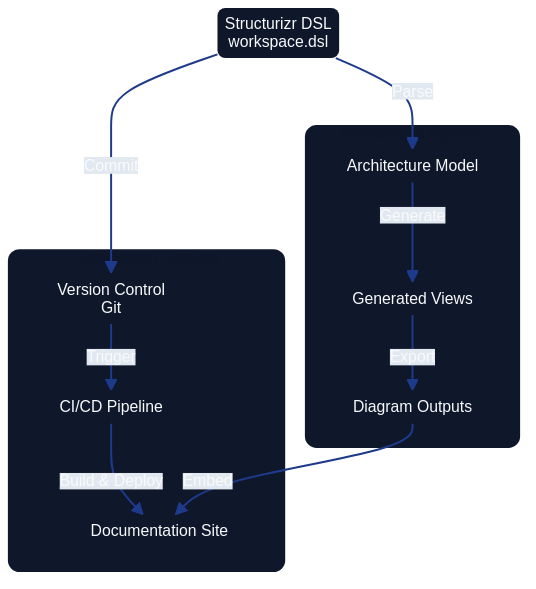

# Structurizr: Architecture Modeling as Code



*Structurizr enables architects to express system architecture through code using the C4 model, creating maintainable, version-controlled architecture diagrams that evolve alongside the systems they describe.*

## Introduction

Structurizr is a collection of tooling that enables software architecture to be defined as code using the C4 model (Context, Containers, Components, and Code). Created by Simon Brown, Structurizr addresses the fundamental challenge of keeping architecture documentation synchronized with reality by treating diagrams and models as artifacts generated from a single source of truth.

In the Architecture as Code ecosystem, Structurizr serves as a practical implementation tool that allows teams to:

- Define architecture models programmatically using a domain-specific language (DSL)
- Generate multiple diagram views from a single model
- Version control architecture definitions alongside application code
- Automate architecture documentation in CI/CD pipelines
- Maintain consistency across different architectural views

The open-source Architecture-as-Code (AaC) project offers a complementary example: its maintainers describe the toolkit as an open-source platform for modelling architecture definitions in YAML and automating validation and generation steps, with every capability delivered through discoverable plugins so teams can extend the CLI without modifying the core distribution (AaC Open Source Project). The plugin model demonstrates how DSL-driven approaches like Structurizr stay adaptable—domain teams can add generators, schema validators, or documentation exporters in the same fashion, keeping the architecture source of truth central whilst tailoring outputs to their needs.

This chapter explores how to use Structurizr for creating, developing, and handling architecture models, integrating them into modern development workflows, and establishing architecture as a living, evolving artifact.

## The C4 Model Foundation

Before diving into Structurizr itself, understanding the C4 model is essential as it forms the conceptual foundation for all Structurizr work.

### Four Levels of Abstraction

The C4 model provides a hierarchical approach to software architecture diagrams, organised across four levels:

| Level | Purpose | Audience | Abstraction |
|-------|---------|----------|-------------|
| **System Context** | Illustrates how the software system in scope fits into its environment, highlighting users and neighbouring systems | Technical and non-technical stakeholders | People and software systems |
| **Container** | Zooms into the software system to show the high-level technology building blocks and how they collaborate | Architects, developers, and operations teams | Containers, data stores, and their responsibilities |
| **Component** | Decomposes a container to explain the components that fulfil its responsibilities and how they interact | Architects and developers | Components within a container |
| **Code** | Provides an optional view of how a component is implemented in code, such as classes, interfaces, or functions | Developers | Source code structures |

Brown's C4 Model guidance stresses that each successive level narrows the audience and scope so stakeholders can reason about the system using diagrams tailored to the detail they need, keeping the hierarchy consistent across teams.

### Why C4 Works with Architecture as Code

The C4 model aligns naturally with Architecture as Code principles because:

1. **Hierarchical decomposition** - Different stakeholders can view the architecture at appropriate levels of detail
2. **Technology agnostic** - The model works regardless of programming languages or platforms
3. **Lightweight** - Simple notation reduces cognitive overhead
4. **Composable** - Views can be generated programmatically from a single model

### Preventing diagram decay with automation

Brown (2022) describes "diagram decay" as the gradual divergence between architecture diagrams and the systems they represent when updates rely on manual effort. Structurizr's automated generation of C4 diagrams from a single, version-controlled model eliminates that manual gap: every change to the model regenerates the diagrams for the appropriate audience, whether leadership needs the System Context view or developers need Component detail. Embedding Structurizr rendering in CI pipelines, alongside Architecture as Code validation, ensures diagrams are rebuilt with each merge so teams catch drift early rather than allowing stale visuals to persist.

## Structurizr DSL: Core Concepts

The Structurizr DSL (Domain-Specific Language) provides a text-based syntax for defining architecture models. Unlike graphical tools, the DSL approach enables version control, code review, and automation.

### Basic Workspace Structure

Every Structurizr model begins with a workspace definition:

```structurizr
workspace "Architecture as Code Example" "Example architecture for demonstrating Structurizr" {

    model {
        # Define people, software systems, containers, and components here
    }

    views {
        # Define which diagrams to generate from the model
    }
    
    configuration {
        # Optional styling and rendering settings
    }
}
```

### Defining Model Elements

#### People and Software Systems

```structurizr
workspace "E-Commerce Platform" {

    model {
        # People (actors)
        customer = person "Customer" "A person who purchases products from the platform"
        admin = person "Administrator" "Internal staff managing the platform"
        
        # Software Systems
        ecommerce = softwareSystem "E-Commerce Platform" "Enables customers to browse and purchase products" {
            # This is the system we're building
        }
        
        paymentGateway = softwareSystem "Payment Gateway" "Third-party payment processing" {
            tags "External System"
        }
        
        # Relationships
        customer -> ecommerce "Browses products, places orders"
        ecommerce -> paymentGateway "Processes payments using"
        admin -> ecommerce "Manages products and orders using"
    }
    
    views {
        systemContext ecommerce "SystemContext" {
            include *
            autoLayout
        }
    }
}
```

This simple example creates a System Context diagram showing how users and external systems interact with the e-commerce platform.

#### Containers

Containers represent deployable units like web applications, mobile apps, databases, or microservices:

```structurizr
ecommerce = softwareSystem "E-Commerce Platform" {
    
    webApp = container "Web Application" "Delivers content to customer browsers" "React" {
        tags "Web"
    }
    
    apiGateway = container "API Gateway" "Provides API to web and mobile clients" "Node.js, Express" {
        tags "API"
    }
    
    orderService = container "Order Service" "Manages order lifecycle" "Java, Spring Boot" {
        tags "Microservice"
    }
    
    productService = container "Product Service" "Manages product catalog" "Python, FastAPI" {
        tags "Microservice"
    }
    
    database = container "Database" "Stores product and order data" "PostgreSQL" {
        tags "Database"
    }
    
    # Container relationships
    webApp -> apiGateway "Makes API calls to" "HTTPS/JSON"
    apiGateway -> orderService "Routes requests to" "gRPC"
    apiGateway -> productService "Routes requests to" "REST/JSON"
    orderService -> database "Reads from and writes to" "JDBC"
    productService -> database "Reads from and writes to" "SQLAlchemy"
}
```

#### Components

Components represent logical building blocks within containers:

```structurizr
orderService = container "Order Service" {
    
    orderController = component "Order Controller" "Handles HTTP requests for orders" "Spring MVC Controller"
    orderRepository = component "Order Repository" "Provides access to order data" "Spring Data JPA"
    paymentClient = component "Payment Client" "Integrates with payment gateway" "REST Client"
    emailService = component "Email Service" "Sends order confirmation emails" "Spring Mail"
    
    # Component relationships
    orderController -> orderRepository "Uses"
    orderController -> paymentClient "Uses"
    orderController -> emailService "Uses"
    orderRepository -> database "Reads/writes data" "JDBC"
}
```

### Creating Views

Views define which diagrams Structurizr should generate from the model:

```structurizr
views {
    # System Context diagram
    systemContext ecommerce "SystemContext" {
        include *
        autoLayout lr
    }
    
    # Container diagram
    container ecommerce "Containers" {
        include *
        autoLayout
    }
    
    # Component diagram for specific container
    component orderService "OrderServiceComponents" {
        include *
        autoLayout
    }
    
    # Dynamic diagram showing interaction sequence
    dynamic ecommerce "OrderPlacement" "Order placement flow" {
        customer -> webApp "Places order"
        webApp -> apiGateway "POST /api/orders"
        apiGateway -> orderService "CreateOrder()"
        orderService -> paymentGateway "ProcessPayment()"
        orderService -> database "SaveOrder()"
        orderService -> emailService "SendConfirmation()"
        autoLayout
    }
    
    # Deployment diagram
    deployment ecommerce "Production" "DeploymentProduction" {
        deploymentNode "Customer Device" {
            containerInstance webApp
        }
        
        deploymentNode "AWS Cloud" {
            deploymentNode "ECS Cluster" {
                containerInstance apiGateway
                containerInstance orderService
                containerInstance productService
            }
            
            deploymentNode "RDS" {
                containerInstance database
            }
        }
    }
}
```

### Styling and Themes

Structurizr allows customisation of diagram appearance:

```structurizr
views {
    styles {
        element "Person" {
            shape person
            background #08427b
            colour #ffffff
        }
        
        element "Software System" {
            background #1168bd
            colour #ffffff
        }
        
        element "External System" {
            background #999999
            colour #ffffff
        }
        
        element "Container" {
            background #438dd5
            colour #ffffff
        }
        
        element "Component" {
            background #85bbf0
            colour #000000
        }
        
        element "Database" {
            shape cylinder
        }
        
        relationship "Relationship" {
            routing orthogonal
            thickness 2
        }
    }
    
    themes https://static.structurizr.com/themes/default/theme.json
}
```

## Workspace Configuration and Management

### Workspace Types

Structurizr supports different deployment models:

1. **Structurizr Cloud** - SaaS offering with hosted workspace
2. **Structurizr On-Premises** - Self-hosted installation
3. **Structurizr Lite** - Local viewer for DSL files (free, no server required)

### Using Structurizr Lite for Development

Structurizr Lite is ideal for development and CI/CD integration:

```bash
# Run Structurizr Lite using Docker
docker run -it --rm -p 8080:8080 \
  -v $(pwd)/workspace:/usr/local/structurizr \
  structurizr/lite
```

This launches a local web server where you can view diagrams generated from your DSL files.

### File Organisation

Organise Structurizr files alongside your codebase:

```
project/
├── docs/
│   └── architecture/
│       ├── workspace.dsl          # Main architecture definition
│       ├── views/                 # Exported diagrams (PNG, SVG)
│       └── README.md              # Architecture documentation
├── src/                           # Application source code
└── .github/
    └── workflows/
        └── architecture-docs.yml  # CI/CD for architecture
```

### Multi-File Workspaces

For large projects, split the model across multiple files:

```structurizr
# workspace.dsl
workspace "Large System" {
    !docs docs
    !adrs adrs
    
    model {
        !include model/people.dsl
        !include model/systems.dsl
        !include model/containers.dsl
    }
    
    views {
        !include views/system-context.dsl
        !include views/containers.dsl
        !include views/deployment.dsl
        
        !include views/styles.dsl
    }
}
```

```structurizr
# model/people.dsl
customer = person "Customer"
admin = person "Administrator"
support = person "Support Agent"
```

```structurizr
# model/systems.dsl
mainSystem = softwareSystem "Main System" {
    !include containers/web-app.dsl
    !include containers/api-gateway.dsl
    !include containers/services.dsl
}

externalPayment = softwareSystem "Payment Provider" {
    tags "External"
}
```

## Integration with CI/CD Pipelines

Automating architecture documentation ensures diagrams stay synchronized with code changes.

### GitHub Actions Example

```yaml
name: Architecture Documentation

on:
  push:
    branches: [main]
    paths:
      - 'docs/architecture/**'
      - 'src/**'
  pull_request:
    paths:
      - 'docs/architecture/**'

jobs:
  generate-diagrams:
    runs-on: ubuntu-latest
    
    steps:
      - uses: actions/checkout@v4
      
      - name: Validate Structurizr DSL
        uses: docker://structurizr/cli:latest
        with:
          args: validate -w docs/architecture/workspace.dsl
      
      - name: Export Diagrams
        uses: docker://structurizr/cli:latest
        with:
          args: export -w docs/architecture/workspace.dsl -f plantuml -o docs/architecture/views
      
      - name: Generate PNG from PlantUML
        uses: docker://plantuml/plantuml:latest
        with:
          args: -tpng -o $(pwd)/docs/architecture/views docs/architecture/views/*.puml
      
      - name: Commit Updated Diagrams
        if: github.ref == 'refs/heads/main'
        run: |
          git config user.name "Architecture Bot"
          git config user.email "architecture@example.com"
          git add docs/architecture/views/*.png
          git diff --quiet && git diff --staged --quiet || \
            git commit -m "Update architecture diagrams [skip ci]"
          git push
```

### GitLab CI Example

```yaml
architecture-documentation:
  image: structurizr/cli:latest
  stage: documentation
  script:
    - structurizr validate -w docs/architecture/workspace.dsl
    - structurizr export -w docs/architecture/workspace.dsl -f plantuml -o output/
  artifacts:
    paths:
      - output/
  only:
    changes:
      - docs/architecture/**
      - src/**
```

### Validation in Pull Requests

Prevent architecture drift by validating changes:

```yaml
name: Architecture Validation

on:
  pull_request:
    paths:
      - 'docs/architecture/**'

jobs:
  validate:
    runs-on: ubuntu-latest
    steps:
      - uses: actions/checkout@v4
      
      - name: Validate DSL Syntax
        run: |
          docker run --rm -v $(pwd):/workspace \
            structurizr/cli validate -w /workspace/docs/architecture/workspace.dsl
      
      - name: Check for Undocumented Components
        run: |
          # Custom script to verify all services have architecture representation
          python scripts/validate-architecture-coverage.py
      
      - name: Generate Diff Preview
        run: |
          # Generate diagrams from base and head branches for comparison
          docker run --rm -v $(pwd):/workspace \
            structurizr/cli export -w /workspace/docs/architecture/workspace.dsl \
            -f png -o /workspace/preview/
```

## Practical Implementation Patterns

### Pattern 1: Microservices Architecture

```structurizr
workspace "Microservices Platform" {
    model {
        user = person "User"
        
        platform = softwareSystem "Microservices Platform" {
            
            gateway = container "API Gateway" "Routes and authenticates requests" "Kong" {
                tags "Infrastructure"
            }
            
            group "Core Services" {
                userService = container "User Service" "Manages user accounts" "Node.js"
                authService = container "Auth Service" "Handles authentication" "Node.js"
                notificationService = container "Notification Service" "Sends notifications" "Python"
            }
            
            group "Business Services" {
                orderService = container "Order Service" "Processes orders" "Java"
                inventoryService = container "Inventory Service" "Manages inventory" "Go"
                paymentService = container "Payment Service" "Processes payments" "Java"
            }
            
            group "Data Layer" {
                userDb = container "User Database" "User data" "PostgreSQL"
                orderDb = container "Order Database" "Order data" "PostgreSQL"
                inventoryDb = container "Inventory Database" "Inventory data" "MongoDB"
            }
            
            messageBus = container "Message Bus" "Async communication" "RabbitMQ" {
                tags "Infrastructure"
            }
        }
        
        # Relationships
        user -> gateway "Makes requests"
        gateway -> userService "Routes /users/*"
        gateway -> orderService "Routes /orders/*"
        gateway -> authService "Validates tokens"
        
        userService -> userDb "Reads/writes"
        orderService -> orderDb "Reads/writes"
        inventoryService -> inventoryDb "Reads/writes"
        
        orderService -> messageBus "Publishes OrderCreated"
        inventoryService -> messageBus "Subscribes to OrderCreated"
        notificationService -> messageBus "Subscribes to events"
    }
    
    views {
        container platform "MicroservicesContainer" {
            include *
            autoLayout
        }
        
        dynamic platform "OrderFlow" {
            user -> gateway "POST /orders"
            gateway -> authService "ValidateToken"
            gateway -> orderService "CreateOrder"
            orderService -> orderDb "SaveOrder"
            orderService -> messageBus "Publish OrderCreated"
            messageBus -> inventoryService "OrderCreated event"
            inventoryService -> inventoryDb "ReserveItems"
            messageBus -> notificationService "OrderCreated event"
            notificationService -> user "Send confirmation"
            autoLayout
        }
    }
}
```

### Pattern 2: Event-Driven Architecture

```structurizr
workspace "Event-Driven System" {
    model {
        producer = softwareSystem "Event Producer" "Generates domain events"
        eventStore = softwareSystem "Event Store" "Stores event stream" {
            tags "Database"
        }
        
        consumer1 = softwareSystem "Read Model Service" "Builds read models"
        consumer2 = softwareSystem "Analytics Service" "Analyzes events"
        consumer3 = softwareSystem "Notification Service" "Sends notifications"
        
        producer -> eventStore "Appends events to"
        eventStore -> consumer1 "Streams events to"
        eventStore -> consumer2 "Streams events to"
        eventStore -> consumer3 "Streams events to"
    }
    
    views {
        systemContext eventStore "EventDrivenContext" {
            include *
            autoLayout
        }
    }
}
```

### Pattern 3: Multi-Tenant SaaS

```structurizr
workspace "Multi-Tenant SaaS" {
    model {
        tenant1 = person "Tenant 1 Users"
        tenant2 = person "Tenant 2 Users"
        
        saas = softwareSystem "SaaS Platform" {
            frontend = container "Web App" "Customer interface" "React"
            
            api = container "API Layer" "Multi-tenant API" "Node.js" {
                tenantMiddleware = component "Tenant Middleware" "Identifies tenant from request"
                tenantResolver = component "Tenant Resolver" "Resolves tenant configuration"
            }
            
            # Separate schemas per tenant
            tenant1Db = container "Tenant 1 Database" "Isolated tenant data" "PostgreSQL"
            tenant2Db = container "Tenant 2 Database" "Isolated tenant data" "PostgreSQL"
            
            sharedDb = container "Shared Database" "Tenant configuration" "PostgreSQL"
        }
        
        tenant1 -> frontend "Uses"
        tenant2 -> frontend "Uses"
        frontend -> api "API calls with tenant ID"
        api -> sharedDb "Reads tenant config"
        api -> tenant1Db "Reads/writes (Tenant 1)"
        api -> tenant2Db "Reads/writes (Tenant 2)"
    }
    
    views {
        container saas "MultiTenantArchitecture" {
            include *
            autoLayout
        }
        
        component api "TenantIsolation" {
            include *
            autoLayout
        }
    }
}
```

## Advanced Features

### Filtered Views

Show different perspectives of the same model:

```structurizr
views {
    # Show only external dependencies
    container platform "ExternalDependencies" {
        include platform
        include ->platform->
        include platform->
        exclude "element.tag==Internal"
        autoLayout
    }
    
    # Security-focused view
    container platform "SecurityView" {
        include "element.tag==Security"
        include "element.type==Person"
        include ->element.tag==Security->
        autoLayout
    }
}
```

### Model Perspectives

Add supplementary information without cluttering diagrams:

```structurizr
orderService = container "Order Service" {
    perspectives {
        "Security" "Requires JWT authentication, RBAC for order access"
        "Performance" "Target: 100ms p95 latency, 1000 req/s throughput"
        "Cost" "~$500/month in AWS (2 ECS tasks + RDS instance)"
        "Compliance" "Stores PII, requires GDPR compliance"
    }
}
```

### Documentation Sections

Embed markdown documentation within the workspace:

```structurizr
workspace {
    !docs docs
    
    model {
        # ... model definition
    }
}
```

Then create `docs/` folder with markdown files:

```
docs/
├── 01-overview.md
├── 02-architecture-decisions.md
├── 03-deployment.md
└── 04-operations.md
```

### Architecture Decision Records (ADR) Integration

```structurizr
workspace {
    !adrs adrs
    
    model {
        # Model elements can reference ADRs
    }
}
```

Structure:

```
adrs/
├── 0001-use-microservices.md
├── 0002-event-sourcing-for-orders.md
└── 0003-postgresql-for-primary-storage.md
```

## Best Practices

### 1. Single Source of Truth

Store the DSL file in version control alongside code:

```
✅ Good:
repository/
├── src/
├── docs/architecture/workspace.dsl
└── README.md

❌ Bad:
- DSL in one repository, code in another
- Diagrams manually created and stored as images
```

### 2. Automate Diagram Generation

Never manually edit generated diagrams:

```yaml
# Automated
on:
  push:
    paths: ['docs/architecture/**']
jobs:
  generate:
    steps:
      - run: structurizr export ...
```

### 3. Use Meaningful Identifiers

```structurizr
# Good - clear, readable identifiers
userService = container "User Service"
orderService = container "Order Service"

# Bad - cryptic identifiers  
us = container "User Service"
os = container "Order Service"
```

### 4. Tag Strategically

Tags enable filtering and styling:

```structurizr
container "API" {
    tags "Backend" "REST API" "Critical Path"
}

container "Legacy System" {
    tags "Legacy" "Deprecated" "Scheduled for Retirement"
}
```

### 5. Keep Views Focused

```structurizr
# Good - focused view
container platform "CoreServices" {
    include "element.tag==Core"
    autoLayout
}

# Bad - everything in one view
container platform "Everything" {
    include *
    # Too cluttered to be useful
}
```

### 6. Document Relationships

```structurizr
orderService -> paymentGateway "Processes payments using" "HTTPS/REST" {
    tags "External Integration" "PCI-DSS Scope"
}
```

### 7. Use Implied Relationships

Structurizr automatically creates implied relationships:

```structurizr
# When component A -> container B, and container B belongs to system C,
# Structurizr implies: component A -> system C (at higher abstraction levels)

# This keeps models DRY while generating appropriate diagrams at each level
```

### 8. Version Control Everything

```bash
# Track all architecture artifacts
git add docs/architecture/workspace.dsl
git add docs/architecture/views/*.png
git commit -m "Add payment service to architecture model"
```

### 9. Review Architecture Changes Like Code

Require pull request reviews for architecture changes:

```yaml
# .github/CODEOWNERS
docs/architecture/** @architecture-team
```

### 10. Keep Models Synchronized

```python
# Script to verify architecture coverage
def verify_architecture_coverage():
    """Ensure all microservices are documented in Structurizr"""
    
    # Parse services from code
    actual_services = discover_services_from_code()
    
    # Parse services from Structurizr DSL
    documented_services = parse_structurizr_model()
    
    missing = actual_services - documented_services
    if missing:
        raise Exception(f"Undocumented services: {missing}")
```

## Comparison with Other Tools

### Structurizr vs. Traditional Diagramming Tools

| Aspect | Structurizr | Draw.io / Visio | Lucidchart |
|--------|-------------|-----------------|------------|
| **Version Control** | ✅ Native (text files) | ⚠️ Binary files | ⚠️ Cloud-based versioning |
| **Code Review** | ✅ Standard Git workflows | ❌ Difficult | ❌ Not supported |
| **Automation** | ✅ CLI and API | ❌ Manual | ⚠️ Limited API |
| **Single Source of Truth** | ✅ Model generates views | ❌ Each diagram separate | ❌ Each diagram separate |
| **Learning Curve** | ⚠️ Moderate (DSL syntax) | ✅ Low (drag-drop) | ✅ Low (drag-drop) |
| **Consistency** | ✅ Enforced by model | ❌ Manual effort | ❌ Manual effort |
| **Cost** | ✅ Free (Lite) or subscription | ✅ Free or one-time purchase | 💰 Subscription |

### Structurizr vs. PlantUML

| Aspect | Structurizr | PlantUML |
|--------|-------------|----------|
| **Focus** | Software architecture (C4) | Various diagram types |
| **Abstraction Levels** | ✅ Built-in (C4 hierarchy) | ⚠️ Manual management |
| **Layout Control** | ⚠️ Limited (auto-layout) | ✅ More granular |
| **Model Reuse** | ✅ Single model, multiple views | ❌ Each diagram separate |
| **Syntax** | ✅ Architecture-specific DSL | ⚠️ Generic diagramming |
| **Tooling** | ✅ Dedicated tools (Lite, Cloud) | ✅ Wide tool support |
| **Learning Curve** | ✅ Lower for C4 | ⚠️ Steeper syntax |

### Structurizr vs. Mermaid

| Aspect | Structurizr | Mermaid |
|--------|-------------|---------|
| **C4 Model Support** | ✅ Native, comprehensive | ⚠️ Basic C4 support |
| **Diagram Types** | Architecture-focused | Wide variety (flowcharts, etc.) |
| **GitHub Integration** | ⚠️ Requires export | ✅ Native rendering |
| **Model Consistency** | ✅ Single model enforces | ❌ Separate diagrams |
| **Interactive Viewers** | ✅ Structurizr Lite/Cloud | ⚠️ Limited |
| **Documentation** | ✅ Integrated docs/ADRs | ❌ Separate |
| **Best Use Case** | Complex architecture models | Quick, simple diagrams |

### Recommendation Matrix

| Scenario | Recommended Tool | Rationale |
|----------|------------------|-----------|
| Large-scale system architecture | **Structurizr** | Model consistency, C4 hierarchy, architecture focus |
| Quick diagrams in README | **Mermaid** | GitHub native support, simple syntax |
| Detailed sequence diagrams | **PlantUML** | Rich sequence diagram features |
| Non-technical stakeholder presentations | **Lucidchart/Draw.io** | Familiar interface, easy customisation |
| Architecture as Code practice | **Structurizr** | Native version control, automation support |

## Common Challenges and Solutions

### Challenge 1: Layout Control

**Problem**: Auto-layout doesn't always produce ideal diagrams.

**Solutions**:
```structurizr
# 1. Specify layout direction
views {
    container platform {
        autoLayout lr  # left-to-right
        # or: tb (top-bottom), bt (bottom-top), rl (right-left)
    }
}

# 2. Use manual positioning (when needed)
views {
    container platform {
        include *
        
        # Manual coordinates (x, y)
        element webApp 100 100
        element apiGateway 300 100
        element database 500 100
    }
}

# 3. Export to PlantUML for fine-tuning
$ structurizr export -w workspace.dsl -f plantuml
# Then adjust PlantUML layout directives
```

### Challenge 2: Large Models Become Complex

**Problem**: Single workspace file becomes unwieldy.

**Solution**: Split into multiple files
```structurizr
workspace {
    model {
        !include model/people.dsl
        !include model/external-systems.dsl
        !include model/platform/api-layer.dsl
        !include model/platform/services.dsl
        !include model/platform/data-layer.dsl
    }
    
    views {
        !include views/context.dsl
        !include views/containers.dsl
        !include views/components/*.dsl
        !include views/deployment.dsl
    }
}
```

### Challenge 3: Keeping Model Synchronized with Reality

**Problem**: Code evolves but architecture model becomes stale.

**Solution**: Automated validation
```python
# ci/validate-architecture.py
import requests
import yaml

def get_running_services():
    """Query service registry for deployed services"""
    registry = requests.get("http://service-registry/api/services")
    return {s["name"] for s in registry.json()}

def parse_structurizr_containers():
    """Extract container names from DSL"""
    with open("docs/architecture/workspace.dsl") as f:
        content = f.read()
    # Parse DSL (simplified)
    containers = set()
    for line in content.split("\n"):
        if "container" in line.lower():
            # Extract container name
            containers.add(extract_name(line))
    return containers

def validate():
    running = get_running_services()
    documented = parse_structurizr_containers()
    
    undocumented = running - documented
    if undocumented:
        raise Exception(f"Services missing from architecture: {undocumented}")
    
    deprecated = documented - running
    if deprecated:
        print(f"Warning: Documented but not running: {deprecated}")

if __name__ == "__main__":
    validate()
```

### Challenge 4: Team Adoption

**Problem**: Developers unfamiliar with DSL syntax.

**Solutions**:
1. **Provide templates**
```structurizr
# templates/new-service.dsl
newService = container "SERVICE_NAME" "DESCRIPTION" "TECHNOLOGY" {
    tags "Microservice" "Backend"
    
    # Add components here
}

# Relationships
apiGateway -> newService "Routes requests"
newService -> database "Reads/writes"
```

2. **Create documentation**
```markdown
# Adding a New Service to Architecture

1. Copy `templates/new-service.dsl`
2. Replace placeholders (SERVICE_NAME, DESCRIPTION, TECHNOLOGY)
3. Add to main workspace: `!include model/services/your-service.dsl`
4. Run validation: `make validate-architecture`
5. Commit and create PR
```

3. **Provide VS Code extension** - Use Structurizr DSL extension for syntax highlighting and validation

### Challenge 5: Diagram Aesthetics

**Problem**: Generated diagrams don't match brand guidelines.

**Solution**: Custom themes
```structurizr
views {
    styles {
        element "Person" {
            shape person
            background #FF6B35  # Brand colour
            colour #FFFFFF
            fontSize 24
        }
        
        element "Container" {
            background #004E89  # Brand colour
            colour #FFFFFF
            fontSize 18
            shape roundedbox
        }
        
        element "Database" {
            shape cylinder
            background #1A1A2E  # Brand colour
        }
        
        relationship "Relationship" {
            thickness 3
            colour #004E89
            routing curved  # or: orthogonal, direct
            fontSize 14
        }
    }
    
    # Or use external theme
    themes https://example.com/company-theme.json
}
```

## Real-World Example: Complete E-Commerce Platform

Here's a comprehensive example bringing together all the concepts:

```structurizr
workspace "E-Commerce Platform" "Complete architecture for online retail" {

    !docs docs
    !adrs adrs

    model {
        # People
        customer = person "Customer" "Online shopper"
        merchant = person "Merchant" "Seller managing products"
        admin = person "Administrator" "Platform operator"
        
        # External Systems
        paymentProvider = softwareSystem "Payment Provider" "Stripe/PayPal" {
            tags "External System"
        }
        
        emailService = softwareSystem "Email Service" "SendGrid" {
            tags "External System"
        }
        
        shippingCarrier = softwareSystem "Shipping Carrier" "FedEx/UPS API" {
            tags "External System"
        }
        
        # Main Platform
        ecommercePlatform = softwareSystem "E-Commerce Platform" {
            
            # Frontend Layer
            webApp = container "Web Application" "Customer-facing storefront" "React, Next.js" {
                tags "Frontend" "Critical Path"
                
                productCatalog = component "Product Catalog" "Browse and search products"
                shoppingCart = component "Shopping Cart" "Manage cart items"
                checkout = component "Checkout" "Order placement flow"
            }
            
            mobileApp = container "Mobile App" "iOS and Android apps" "React Native" {
                tags "Frontend" "Mobile"
            }
            
            adminPanel = container "Admin Panel" "Merchant and admin interface" "Vue.js" {
                tags "Frontend" "Internal"
            }
            
            # API Layer
            apiGateway = container "API Gateway" "Authenticates and routes requests" "Kong, Node.js" {
                tags "Infrastructure" "Critical Path"
                
                authMiddleware = component "Auth Middleware" "JWT validation"
                rateLimiter = component "Rate Limiter" "Throttles requests"
                router = component "Router" "Routes to services"
            }
            
            # Core Services
            group "Core Domain Services" {
                productService = container "Product Service" "Product catalog management" "Java, Spring Boot" {
                    tags "Microservice" "Core"
                    
                    productController = component "Product Controller" "REST API"
                    productRepository = component "Product Repository" "Data access"
                    searchService = component "Search Service" "Elasticsearch integration"
                }
                
                orderService = container "Order Service" "Order lifecycle management" "Java, Spring Boot" {
                    tags "Microservice" "Core" "Critical Path"
                    
                    orderController = component "Order Controller" "REST API"
                    orderRepository = component "Order Repository" "Data access"
                    orderStateMachine = component "Order State Machine" "Manages order states"
                    perspectives {
                        "Security" "PII data, requires encryption at rest"
                        "Compliance" "GDPR compliance, 30-day data retention"
                    }
                }
                
                inventoryService = container "Inventory Service" "Stock management" "Go" {
                    tags "Microservice" "Core"
                }
                
                userService = container "User Service" "User account management" "Node.js" {
                    tags "Microservice" "Core"
                }
            }
            
            # Supporting Services
            group "Supporting Services" {
                paymentService = container "Payment Service" "Payment processing" "Python, FastAPI" {
                    tags "Microservice" "PCI-DSS"
                    perspectives {
                        "Security" "PCI-DSS scope, no card data storage"
                        "Compliance" "PCI-DSS Level 1 certified"
                    }
                }
                
                notificationService = container "Notification Service" "Email and SMS notifications" "Python" {
                    tags "Microservice"
                }
                
                recommendationService = container "Recommendation Service" "Product recommendations" "Python, TensorFlow" {
                    tags "Microservice" "ML"
                }
            }
            
            # Data Layer
            group "Data Stores" {
                productDb = container "Product Database" "Product catalog data" "PostgreSQL" {
                    tags "Database" "Primary Storage"
                }
                
                orderDb = container "Order Database" "Order data" "PostgreSQL" {
                    tags "Database" "Primary Storage"
                }
                
                userDb = container "User Database" "User profiles and auth" "PostgreSQL" {
                    tags "Database" "Primary Storage"
                }
                
                searchIndex = container "Search Index" "Product search" "Elasticsearch" {
                    tags "Database" "Search"
                }
                
                cache = container "Cache" "Session and data cache" "Redis" {
                    tags "Database" "Cache"
                }
            }
            
            # Infrastructure
            messageBus = container "Message Bus" "Event-driven communication" "RabbitMQ" {
                tags "Infrastructure" "Messaging"
            }
            
            # Relationships - Frontend to Gateway
            webApp -> apiGateway "API calls" "HTTPS/JSON"
            mobileApp -> apiGateway "API calls" "HTTPS/JSON"
            adminPanel -> apiGateway "API calls" "HTTPS/JSON"
            
            # Relationships - Gateway to Services
            apiGateway -> productService "Routes /products/*" "HTTP/REST"
            apiGateway -> orderService "Routes /orders/*" "HTTP/REST"
            apiGateway -> userService "Routes /users/*" "HTTP/REST"
            
            # Relationships - Services to Databases
            productService -> productDb "Reads/writes" "JDBC"
            productService -> searchIndex "Indexes products" "HTTP"
            orderService -> orderDb "Reads/writes" "JDBC"
            userService -> userDb "Reads/writes" "JDBC"
            inventoryService -> productDb "Updates stock" "JDBC"
            
            # Relationships - Services to Cache
            productService -> cache "Caches products" "Redis Protocol"
            userService -> cache "Caches sessions" "Redis Protocol"
            
            # Relationships - Async via Message Bus
            orderService -> messageBus "Publishes OrderCreated" "AMQP"
            messageBus -> inventoryService "OrderCreated event" "AMQP"
            messageBus -> notificationService "OrderCreated event" "AMQP"
            paymentService -> messageBus "Publishes PaymentCompleted" "AMQP"
        }
        
        # External Integrations
        ecommercePlatform -> paymentProvider "Processes payments" "HTTPS/REST"
        ecommercePlatform -> emailService "Sends emails" "HTTPS/REST"
        ecommercePlatform -> shippingCarrier "Creates shipments" "HTTPS/REST"
        
        # User Interactions
        customer -> webApp "Browses and purchases"
        customer -> mobileApp "Browses and purchases"
        merchant -> adminPanel "Manages products"
        admin -> adminPanel "Platform administration"
        
        # Production Deployment
        deploymentEnvironment "Production" {
            deploymentNode "AWS Cloud" {
                tags "AWS"
                
                deploymentNode "CloudFront CDN" {
                    containerInstance webApp
                }
                
                deploymentNode "ECS Cluster" {
                    tags "Container Orchestration"
                    
                    deploymentNode "API Gateway Tasks" {
                        containerInstance apiGateway
                    }
                    
                    deploymentNode "Service Tasks" {
                        instances 3
                        containerInstance productService
                        containerInstance orderService
                        containerInstance userService
                        containerInstance inventoryService
                        containerInstance paymentService
                        containerInstance notificationService
                    }
                }
                
                deploymentNode "RDS" {
                    tags "Managed Database"
                    
                    deploymentNode "Primary" {
                        containerInstance productDb
                        containerInstance orderDb
                        containerInstance userDb
                    }
                    
                    deploymentNode "Read Replicas" {
                        instances 2
                    }
                }
                
                deploymentNode "ElastiCache" {
                    containerInstance cache
                }
                
                deploymentNode "Elasticsearch Service" {
                    containerInstance searchIndex
                }
                
                deploymentNode "Amazon MQ" {
                    containerInstance messageBus
                }
            }
        }
    }

    views {
        # System Context
        systemContext ecommercePlatform "SystemContext" {
            include *
            autoLayout lr
            description "High-level view showing how the e-commerce platform fits in the ecosystem"
        }
        
        # Container View
        container ecommercePlatform "Containers" {
            include *
            autoLayout tb
            description "Container-level architecture showing major applications and data stores"
        }
        
        # Core Services Focus
        container ecommercePlatform "CoreServices" {
            include element.tag==Core
            include element.tag==Database
            include element.tag==Infrastructure
            autoLayout
            description "Focus on core domain services"
        }
        
        # Component View - Product Service
        component productService "ProductServiceComponents" {
            include *
            autoLayout
            description "Internal structure of Product Service"
        }
        
        # Component View - Order Service  
        component orderService "OrderServiceComponents" {
            include *
            autoLayout
            description "Internal structure of Order Service"
        }
        
        # Dynamic View - Order Flow
        dynamic ecommercePlatform "OrderPlacementFlow" {
            title "Customer Order Placement"
            
            customer -> webApp "1. Submits order"
            webApp -> apiGateway "2. POST /api/orders"
            apiGateway -> orderService "3. CreateOrder()"
            orderService -> orderDb "4. SaveOrder()"
            orderService -> messageBus "5. Publish OrderCreated"
            messageBus -> inventoryService "6. OrderCreated event"
            inventoryService -> productDb "7. Reserve items"
            messageBus -> paymentService "8. OrderCreated event"
            paymentService -> paymentProvider "9. Charge customer"
            paymentService -> messageBus "10. Publish PaymentCompleted"
            messageBus -> notificationService "11. PaymentCompleted event"
            notificationService -> emailService "12. Send confirmation"
            emailService -> customer "13. Confirmation email"
            
            autoLayout
            description "Sequence of events when customer places order"
        }
        
        # Deployment View
        deployment ecommercePlatform "Production" "ProductionDeployment" {
            include *
            autoLayout
            description "Production deployment on AWS"
        }
        
        # Filtered Views
        container ecommercePlatform "ExternalIntegrations" {
            include element.tag==External*
            include ->element.tag==External*->
            autoLayout
            description "External system dependencies"
        }
        
        container ecommercePlatform "DataLayer" {
            include element.tag==Database
            include ->element.tag==Database->
            autoLayout
            description "Data storage architecture"
        }
        
        # Styling
        styles {
            element "Person" {
                shape person
                background #08427b
                colour #ffffff
                fontSize 22
            }
            
            element "Software System" {
                background #1168bd
                colour #ffffff
                shape roundedbox
            }
            
            element "External System" {
                background #999999
                colour #ffffff
            }
            
            element "Container" {
                background #438dd5
                colour #ffffff
                shape roundedbox
            }
            
            element "Component" {
                background #85bbf0
                colour #000000
                shape component
            }
            
            element "Database" {
                shape cylinder
                background #438dd5
            }
            
            element "Infrastructure" {
                shape hexagon
            }
            
            element "Frontend" {
                background #ff6b6b
            }
            
            element "Core" {
                background #51cf66
            }
            
            element "Critical Path" {
                border solid
                thickness 4
            }
            
            relationship "Relationship" {
                thickness 2
                colour #707070
                routing orthogonal
                fontSize 12
            }
        }
        
        themes https://static.structurizr.com/themes/default/theme.json
    }
    
    configuration {
        scope softwaresystem
    }
}
```

## Integration with Architecture Decision Records

Structurizr integrates naturally with ADRs documented in Chapter 4:

```bash
# Project structure
docs/
├── architecture/
│   ├── workspace.dsl
│   └── adrs/
│       ├── 0001-use-microservices.md
│       ├── 0002-event-driven-integration.md
│       ├── 0003-postgresql-for-services.md
│       └── 0004-kong-api-gateway.md
```

Reference ADRs in the workspace:

```structurizr
workspace {
    !adrs docs/architecture/adrs
    
    model {
        apiGateway = container "API Gateway" {
            url https://github.com/org/repo/blob/main/docs/architecture/adrs/0004-kong-api-gateway.md
        }
    }
}
```

This creates traceability from architecture elements to the decisions that shaped them.

## Conclusion

Structurizr represents a powerful implementation of Architecture as Code principles, enabling teams to:

1. **Define architecture models programmatically** using a clear, version-controlled DSL
2. **Generate consistent diagrams** from a single source of truth
3. **Integrate architecture documentation** into standard development workflows
4. **Automate validation** that architecture matches reality
5. **Maintain living documentation** that evolves with the system

The C4 model provides the conceptual framework, while Structurizr DSL offers the practical tooling to implement it. By treating architecture as code, teams can apply the same rigorous practices—version control, code review, automated testing, CI/CD—to their architectural work as they do to application development.

While there's a learning curve to master the DSL syntax and modeling concepts, the investment pays dividends through improved architecture consistency, team collaboration, and documentation quality. Combined with the practices covered in earlier chapters (ADRs, version control, automation), Structurizr enables a comprehensive Architecture as Code workflow.

The next chapters explore how to extend these foundations into containerisation and orchestration, where architecture definitions can directly inform deployment and operational patterns.

## Sources

- Brown, S. "The C4 model for visualising software architecture." [https://c4model.com](https://c4model.com)
- Brown, S. "Documenting Software Architecture with Structurizr." Structurizr Blog, 2022. [https://blog.structurizr.com/diagrams-as-code-automation/](https://blog.structurizr.com/diagrams-as-code-automation/)
- Structurizr. "Structurizr DSL Language Reference." [https://github.com/structurizr/dsl](https://github.com/structurizr/dsl)
- Structurizr. "Structurizr Lite." [https://structurizr.com/help/lite](https://structurizr.com/help/lite)
- Brown, S. "Documenting Software Architecture with Structurizr." Structurizr Blog, 2022.
- Brown, S. "Software Architecture for Developers." Leanpub, 2024.
- ThoughtWorks Technology Radar. "Diagrams as code." [https://www.thoughtworks.com/radar/techniques/diagrams-as-code](https://www.thoughtworks.com/radar/techniques/diagrams-as-code)
- AaC Open Source Project. "Architecture-as-Code Repository." [https://github.com/aacplatform/aac](https://github.com/aacplatform/aac)
