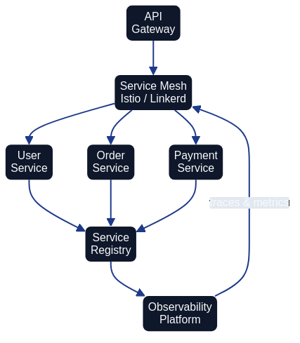

# Microservices Architecture as Code {#microservices}

## Introduction

Microservices architectures decompose business capabilities into independent services that can be planned, deployed, and evolved without synchronising every change across the entire estate. When coupled with Architecture as Code disciplines, microservices become observable, governable, and automatable. Source-controlled blueprints describe how services interact, how they are deployed, and which policies keep them trustworthy. This chapter explains how to weave Architecture as Code practices through microservice estates so that autonomy never undermines cohesion.



## Architectural principles for federated teams

### Bounded contexts mapped to repositories

Treat each microservice as a bounded context with a clearly defined purpose, data contract, and operational envelope. Store the service's architecture definition beside its application code and IaC modules so that diagrams, infrastructure manifests, and compliance evidence travel together. Repository templates keep ownership information, on-call details, and dependency declarations consistent.

### Contract-first integration

Microservices thrive when interfaces are stable and well documented. Declare API specifications and event schemas as code (for example using OpenAPI or AsyncAPI) and register them in an architecture catalogue. Automated linting confirms that proposed changes respect backwards compatibility rules and alerts the owning teams when downstream consumers would break.

### Golden paths backed by reusable modules

Autonomous teams still need consistent guardrails. Provide shared Terraform modules, Kubernetes Helm charts, and service mesh policies that encode approved defaults for security, observability, and networking. Architecture as Code pipelines should verify that each service consumes the authorised modules and that deviations are reviewed through architecture decision records.

## Designing microservices with Architecture as Code assets

### Structuring repositories

A reference repository might include:

```text
./service
├── adr/                              # Architecture decision records
├── deployment/
│   ├── helm/
│   │   └── values.yaml               # Environment-specific overlays
│   ├── terraform/                    # Infrastructure definitions
│   └── policies/                     # OPA and service mesh policies
├── docs/
│   ├── context-diagram.mmd           # C4 diagrams under version control
│   └── runbooks/
│       └── resilience-playbook.md
├── service_contracts/
│   ├── api.yaml                      # OpenAPI definition
│   └── events/
│       └── order-created.json
└── src/
    └── ...
```

Architecture automation can parse this layout to build inventories, check dependency rules, and publish updated diagrams after every merge.

### Policy-aware delivery pipelines

CI/CD workflows should orchestrate both application tests and architectural conformance checks (see [Chapter 5](05_automation_devops_cicd.md) for comprehensive CI/CD pipeline design). A representative GitHub Actions job might combine security scans, contract validation, Terraform plan approval, and deployment orchestration:

```yaml
jobs:
  validate-and-deploy:
    runs-on: ubuntu-latest
    steps:
      - uses: actions/checkout@v4
      - name: Validate architecture contracts
        run: |
          npm install -g @redocly/cli
          redocly lint service_contracts/api.yaml
      - name: Verify Terraform plan
        working-directory: deployment/terraform
        run: |
          terraform init -backend-config=env.tfbackend
          terraform plan -out=tfplan
      - name: Enforce policy guardrails
        run: |
          conftest test deployment/policies
      - name: Deploy via Helmfile
        # Helmfile is a declarative wrapper for Helm that manages multi-chart deployments
        # across environments using a single helmfile.yaml configuration.
        run: |
          helmfile apply --environment=${{ github.ref_name }}
```

Such pipelines capture the architectural intent, flag drift immediately, and keep every service aligned with centrally defined guardrails.

### Maintainability guardrails as code

Policy-as-code engines such as [Open Policy Agent (OPA)](33_references.md#source-10), Conftest, or service mesh admission controllers translate governance rules into executable checks that run on every change. Teams should codify boundary rules—permitted dependency directions, latency budgets between domains, or constraints on data residency—alongside the service. Pipelines fail fast when a merge request proposes an illegal dependency, and the same rules can execute in staging clusters to block ad-hoc configuration drift. Thoughtworks' Governance as Code guidance stresses that automating these controls is the sustainable path to consistent service quality across federated teams ([Thoughtworks Technology Radar – "Governance as Code"](33_references.md#source-2)).

### Cataloguing contracts and coupling telemetry

Maintain an executable catalogue that indexes every API specification, event schema, and data contract. Architecture automation should update the catalogue after each merge, derive dependency graphs, and flag hotspots where a service has many synchronous consumers or repeatedly changes its schema. CNCF's *State of Cloud Native Development 2024* report highlights how sprawling integration surfaces create maintainability pressure unless organisations observe coupling signals in real time ([Source [7]](33_references.md#source-7)). Teams can codify heuristics such as "alert when more than five downstream systems consume a synchronous endpoint" or "notify when an event schema changes more than once per sprint". These metrics help platform leads schedule refactoring and guide investment in stabilising interfaces.

### Escalation playbooks for failed checks

Store runbooks and escalation trees beside the service so that automated failures trigger predictable responses. When a policy gate fails, the pipeline should raise a ticket or ChatOps alert to the owning team, include links to the failing rule, and enumerate the expected resolution timeframe. If repeated violations occur, an architecture council rota can be paged to review whether the guardrail or the service boundary needs adjustment. Capturing these playbooks as code keeps governance transparent and gives auditors evidence that breaches are handled systematically.

### Runtime observability as code

Codify dashboards, alerting policies, and runbooks so that operability remains consistent across the fleet. Use tools such as Grafana configuration as code or Prometheus recording rules stored in Git. Tie alert routing to the ownership data held in each service repository so incidents reach the responsible team.

## Coordinating shared capabilities

### Service mesh and networking patterns

Architecture as Code enables platform teams to encode networking standards once and distribute them to every service (see [Chapter 7](07_containerisation.md) for container orchestration context). Istio, Linkerd, or AWS App Mesh policies can be generated from declarative manifests that specify identity requirements, mutual TLS expectations, and traffic routing rules. When services declare their intents, platform pipelines merge them with organisation-wide defaults to produce consistent yet flexible mesh configurations.

Mutual TLS, traffic shaping, and retry budgets are expressed as code alongside the service rather than configured ad-hoc in dashboards. The Istio VirtualService below illustrates how routing rules and canary traffic splits are captured declaratively, making them reviewable and auditable:

```yaml
# Istio VirtualService — weighted canary routing for the orders service
apiVersion: networking.istio.io/v1alpha3
kind: VirtualService
metadata:
  name: orders-service
  namespace: production
spec:
  hosts:
    - orders-service
  http:
    - route:
        - destination:
            host: orders-service
            subset: stable
          weight: 90
        - destination:
            host: orders-service
            subset: canary
          weight: 10
      retries:
        attempts: 3
        perTryTimeout: 2s
```

For Linkerd-based meshes, a simple annotation on the Deployment enables mTLS and automatic observability without modifying application code:

```yaml
metadata:
  annotations:
    linkerd.io/inject: enabled
```

Storing these manifests in the service repository alongside application code means networking policy changes follow the same pull-request and review cycle as functional changes, closing the gap between architecture intent and runtime enforcement.

### Data management across domains

Avoid accidental monoliths by defining data ownership and access rules programmatically. Each microservice should publish read models or event streams that others consume through documented interfaces. Architecture as Code repositories can generate data lineage diagrams showing where authoritative data resides, who can access it, and how retention rules are enforced. Automated tests verify that only sanctioned services connect to sensitive datasets.

Distributed transactions across service boundaries require careful design to avoid tight coupling. Two well-established patterns are the **saga** and **event sourcing** approaches. A saga breaks a long-running business transaction into a sequence of local transactions, each of which publishes an event or message that triggers the next step. If any step fails, compensating transactions reverse the completed steps. Event sourcing takes a complementary approach by persisting all state changes as an append-only log of domain events; the current state is reconstructed by replaying those events, providing a complete audit trail. The following example illustrates a saga choreography step captured as an AsyncAPI event schema, making the inter-service contract explicit and version-controlled:

```yaml
# service_contracts/events/order-payment-requested.json
{
  "asyncapi": "2.6.0",
  "info": {
    "title": "Order Payment Saga",
    "version": "1.0.0"
  },
  "channels": {
    "order/payment/requested": {
      "publish": {
        "message": {
          "name": "OrderPaymentRequested",
          "payload": {
            "type": "object",
            "properties": {
              "orderId":  { "type": "string" },
              "amount":   { "type": "number" },
              "currency": { "type": "string" }
            },
            "required": ["orderId", "amount", "currency"]
          }
        }
      }
    }
  }
}
```

Capturing event schemas as code and registering them in the service catalogue enables Architecture as Code tooling to verify compatibility automatically and flag breaking changes before they reach production.

### Compliance by default

Regulatory expectations such as GDPR, PCI DSS, or sector-specific rules are easier to satisfy when encoded as reusable policies. Combine static analysis (for example, checking that logging excludes personal data) with dynamic controls (service mesh policies enforcing encryption in transit). Architecture guardrails should produce compliance reports automatically so stakeholders can evidence adherence without manual document assembly.

## Operating microservices estates sustainably

### Observability-driven feedback loops

Collect metrics, traces, and logs into a shared telemetry platform. Architecture as Code ensures that each service exports consistent labels, making it straightforward to build cross-service dashboards. Feedback loops then inform capacity planning, resilience improvements, and disaster recovery rehearsals.

### Resilience testing as code

Define failure injection experiments alongside service definitions. Tools such as Chaos Mesh or Gremlin can be orchestrated via IaC pipelines to introduce latency, kill pods, or revoke permissions. Document expected outcomes and recovery steps within the same repository so that continuous verification becomes routine rather than exceptional.

### Cost and sustainability metrics

Automate reporting on resource consumption, carbon intensity, and idle workloads. When services codify budgets and scaling thresholds, platform automation can alert owners when utilisation deviates from expected norms. Embedding sustainability objectives into Architecture as Code keeps environmental considerations visible during design and runtime.

## Migration considerations

Many organisations evolve from monoliths or service-oriented architectures. Architecture as Code accelerates this journey by:

- Capturing target service boundaries as executable diagrams (see [Chapter 6](06_structurizr.md) for C4 model usage in documenting these boundaries).
- Providing repeatable infrastructure templates for each new domain.
- Automating shadow traffic, data replication, and phased cut-overs.
- Documenting decommission plans for legacy components.

By treating migration playbooks as code, teams can rehearse transitions safely and roll back confidently when experiments expose new risks.

Two categories of tooling deserve specific mention. **Feature flags** allow teams to deploy new service logic without immediately exposing it to all users. Platforms such as Unleash (open-source, self-hosted) and LaunchDarkly (managed service) enable flag definitions to be stored as code and evaluated at runtime, so that a migration can be staged progressively—first for internal users, then for a percentage of production traffic, and finally for all users—with rollback as simple as toggling a flag rather than reverting a deployment. **Schema migrations** for relational databases require equally careful management. Tools such as Flyway and Liquibase apply versioned, idempotent migration scripts from a controlled directory, ensuring that every environment passes through the same sequence of changes. Storing migration scripts in version control, running them as part of CI/CD pipelines (see [Chapter 5](05_automation_devops_cicd.md)), and gating promotion on successful migration completion prevents the schema drift that frequently undermines monolith-to-microservice transitions.

## Summary

Microservices amplify organisational agility when paired with disciplined automation. Architecture as Code gives leaders a shared source of truth for service contracts, platform guardrails, and operational posture. Investing in reusable templates, policy automation, and comprehensive observability enables teams to innovate quickly whilst preserving the resilience, compliance, and sustainability that modern enterprises demand.

## Sources

Sources:
- Cloud Native Computing Foundation. "State of Cloud Native Development 2024." Cloud Native Computing Foundation, 2024.
- [Open Policy Agent – Policy as Code Overview](33_references.md#source-10)
- [Thoughtworks Technology Radar – Governance as Code](33_references.md#source-2)

