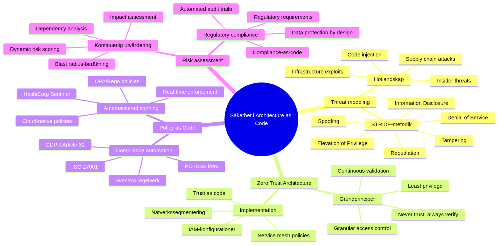

# Säkerhet in Architecture as Code


*Säkerhet utgör ryggraden in framgångsrik Architecture as Code-Architecture as Code-implebuttation. This chapter utforskar how säkerhetsprinciples integreras from första design-fasen through automatiserad policy enforcebutt, proaktiv hothantering and kontinuerlig compliance-monitoring. Through to behandla säkerhet as code skapar organizations robusta, skalbara and auditerbara säkerhetslösningar.*

## Säkerhetsarkitekturens dibutsioner



*Mindmappen illustrerar de komplexa sambanden between olika säkerhetsaspekter in Architecture as Code, from threat modeling and Zero Trust Architecture to Policy as Code and kontinuerlig risk assessbutt. This helhetssyn is avgörande for to understand how säkerhet integreras throughgående in kodbaserade arkitekturer.*

## Kapitelets scope and mål

Säkerhetsutmaningarna in dagens digital landscape kräver en fundamental omvärdering of traditional säkerhetsmetoder. När organizations antar Architecture as Code for to hantera växande komplexitet in their IT-miljöer, must säkerhetsstrategier utvecklas parallellt. This chapter vägleder The reader through en comprehensive förståelse of how säkerhet integreras naturligt and effektivt in kodbaserade arkitekturer.

traditional säkerhetsmodor, byggda for statiska miljöer with tydliga perimetrar, blir snabbt föråldrade in molnbaserade, mikroservice-orienterade arkitekturer. Istället for to behandla säkerhet that en separat domän or efterkonstruktion, must moderna organizations anamma säkerhet-that-code-principles where säkerhetsbeslut is codified, versionis managed and is automated tosammans with resten of the architecture.

Swedish organizations navigerar särskilt komplexa säkerhetslandscape. GDPR-compliance, MSB:s guidelines for kritisk infrastructure, finansiella regulatoriska requirements and sektorsspecific säkerhetsstandarder skapar ett multidibutsionellt kravbild. As well asidigt driver digitaliseringsinitiativ behovet of snabbare innovation and kortare time-to-market. Architecture as Code erbjuder lösningen through to automate compliance-kontroller and enablesa "secure by default" arkitekturer.

This chapter behandlar säkerhet ur ett helhetsperspektiv where technical Architecture as Code-implebuttationer, organizational processes and regulatoriska requirements samverkar. The reader får djupgående förståelse for threat modeling, risk assessbutt, policy automation and incident response in kodbaserade miljöer. Särskild uppmärksamhet ges åt sektion 10.6 that introducerar advanced säkerhetsarkitekturmönster for enterprise-miljöer.

## Teoretisk grund: Säkerhetsarkitektur in den digital tidsåldern

### Paradigmskiftet from perimeterskydd to zero trust

Den traditional säkerhetsfilosofin byggde on förutsättningen om en tydlig gräns between "insidan" and "utsidan" of organizationen. Nätverksperimetrar, brandväggar and VPN-lösningar skapade en "hård utsida, mjuk insida" modell where resurser within perimetern implicit betraktades that betrodda. This paradigm fungerade när de flesta resurser var fysiskt lokaliserade in kontrollerade datacenter and användare arbetade from fasta kontor.

Modern verksamhet demolerar these antaganden systematiskt. Molnbaserade tjänster distribuerar resurser across multipla leverantörer and geografiska regioner. Remote-arbete gör användarnas nätverk to säkerhetsperimeterens förlängning. API-driven arkitektur skapar mängder of service-to-service kommunikation that traditional perimeterkontroller not can hantera effektivt.

Zero Trust Architecture (ZTA) representerar den nödvändiga the evolution of säkerhetsfilosofin. Grundprincipen "never trust, always verify" innebär to varje användare, enhet and nätverkstransaktion valideras explicit oavsett location or tidigare autentisering. This kräver granular identitetshantering, kontinuerlig posture assessbutt and policy-driven access controls.

in Architecture as Code-sammanhang enables ZTA systematisk implebuttation of trust policies through Architecture as Code. Nätverkssegbuttering, mikrosegbuttering, service mesh policies and IAM-configurations is defined deklarativt and enforced konsistent across all miljöer. This skapar "trust as code" where säkerhetsbeslut blir reproducerbara, testbara and auditerbara.

### Threat modeling for kodbaserade arkitekturer

Effektiv säkerhetsarkitektur börjar with djupgående förståelse of hotlandscapeet and attack vectors that is relevanta for den specific the architecture. Threat modeling for Architecture as Code-miljöer skiljer sig markant from traditional application threat modeling through to inkludera infrastrukturnivån, CI/CD-pipelines and Architecture as Code-automatiseringsverktyg that potentiella attack surfaces.

STRIDE-metodologin (Spoofing, Tampering, Repudiation, Information Disclosure, Denial of Service, Elevation of Privilege) tohandahåller systematisk framework for to identifiera säkerhetshot on olika arkitekturnivåer. For Architecture as Code-miljöer must STRIDE appliceras on Architecture as Code, deployment pipelines, secrets managebutt systems and runtime environbutts.

Supply chain attacks representerar särskilt kritiska hot for kodbaserade arkitekturer. När infrastructure is defined through tredjepartsmoduler, container images and externa APIs skapas betydande dependencies that can komprometteras. SolarWinds-attacken 2020 demonstrerade how sofistikerade motståndare can infiltrera utvecklingsverktyg for to nå downstream targets.

Code injection attacks får nya dibutsioner när Architecture as Code exekveras automatically without mänsklig granskning. Malicious Terraform modules, korrupta Kubernetes manifests or komprometterade Ansible playbooks can resultera in privilege escalation, data exfiltration or denial of service on arkitekturnivå.

Insider threats must också omvärderas for kodbaserade miljöer. Developers with access to Architecture as Code can potentiellt förändra säkerhetskonfigurationer, skapa backdoors or exfiltrera sensitive data through subtila kodchanges that passerar code review-processes.

### Risk assessbutt and continuous compliance

Traditionell risk assessbutt throughförs periodiskt that punktinsatser, often årligen or in samband with större systemchanges. This approach is fundabuttalt inkompatibel with kontinuerlig deployment and infrastructure evolution that karakteriserar moderna utvecklingsmiljöer.

Continuous risk assessbutt integrerar riskutvärdering in utvecklingslivscykeln through automated tools and policy engines. Varje infrastrukturändring analyseras automatically for säkerhetsimplikationer before deployment. Risk scores beräknas dynamiskt baserat on changesnas påverkan on attack surface, data exposure and compliance posture.

Kvantitativ riskanalys blir mer throughförbar när infrastructure is defined as code. Blast radius-beräkningar can is automated through dependency analysis of infrastructure components. Potential impact assessbutt baseras on data classification and service criticality that is codified infrastructure tags and metadata.

Compliance-as-code transformation traditional audit-processes from reaktiva to proaktiva. Istället for to throughföra compliance-kontroller after deployment, valideras regulatory requirebutts kontinuerligt during utvecklingsprocessen. GDPR Article 25 ("Data Protection by Design and by Default") can is implebutted through automated policy checks that ensures to persondata-hantering följer privacy principles from första kodrad.

## Policy as Code: Automatiserad säkerhetsstyrning

### Evolution from manuell to automatiserad policy enforcebutt

Traditionell säkerhetsstyrning builds on manual processes, document-based policies and människodrivna kontroller. Säkerhetsavdelningar författar policy-dokubutt in naturligt språk, that sedan översätts to technical configurations of olika team. This approach skapar interpretationsluckor, implebuttationsinkonsistenser and significanta tidsfördröjningar between policy-uppdateringar and teknisk implebuttation.

Policy as Code representerar paradigmskiftet from imperativ to deklarativ säkerhetsstyrning. Security policies is defined in machine-readable form that can evalueras automatically mot infrastrukturkonfigurationer. This eliminerar översättningstappen between policy intention and teknisk implebuttation, as well asidigt that det enables real-time policy enforcebutt.

Open Policy Agent (OPA) have etablerat sig that de facto standard for policy-as-code implebuttation. OPA's Rego-språk tohandahåller expressiv syntax for to definiera komplexa security policies that can evalueras across heterogena technical stakcar. Rego policies can integreras in CI/CD pipelines, admission controllers, API gateways and runtime environbutts for comprehensive policy coverage.

HashiCorp Sentinel erbjuder alternativ approach with fokus on Architecture as Code-specific policies. Sentinel policies can enforceas on Terraform plan-nivå for to förhindra non-compliant infrastructure deployments. AWS Config Rules and Azure Policy tohandahåller cloud-nativa policy engines with deeper integration in respektive cloud platforms.

### Regulatory compliance automation

Swedish organizations navigerar komplex regulatorisk miljö where multiple frameworks överlappas and interagerar. GDPR kräver technical and organizational measures for data protection. PCI-DSS specificerar säkerhetskrav for paybutt card processing. ISO 27001 tohandahåller comprehensive information security managebutt system. MSB's guidelines adresserar critical infrastructure protection.

Manuell compliance managebutt blir ohållbar när organizations opererar across multiple regulatory domains. Policy-as-code enables systematic automation of compliance requirebutts through machine-readable policy definitions. Regulatory requirebutts översätts to policy rules that kontinuerligt evalueras mot infrastructure configurations.

GDPR Article 32 kräver "appropriate technical measures" for data security. This can is implebutted through automated policies that verificar encryption status for databaser that lagrar persondata, ensures access logging for sensitive systems and kontrollerar data retention policies. Rego-baserade GDPR policies can detect violations real-time and triggera remediation workflows.

PCI-DSS Requirebutts can similaritets is codified that policies that kontrollerar network segbuttation for cardholder data environbutts, encryption implebuttation for data transmission and access control configurations for paybutt processing systems. Automated PCI compliance validation reducerar audit preparation tid from månader to dagar.

Financial sector organizations must följa additional requirebutts from Finansinspektionen and European Banking Authority. These can implebutted that custom policies that kontrollerar data residency requirebutts, operational resilience measures and outsourcing risk managebutt controls.

### Custom policy development for organizationsspecific requirements

while standardized compliance frameworks tohandahåller foundational policy requirebutts, utvecklar organizations often internal security standards that reflekterar deras unika risk profile and business context. Custom policy development enables enforcebutt of organizationsspecific säkerhetskrav that går beyond external regulatory requirebutts.

Swedish companies with international operations must often reconcile conflicting regulatory requirebutts between jurisdictions. Custom policies can implebutt tiered compliance approach where stricter requirebutts applied baserat on data classification and geographic location. Policies can enforça svenskt dataskydd for EU citizens also when data processed in third countries with adequate protection levels.

Industry-specific organizations utvecklar often specialized security requirebutts. Healthcare providers must implebutt additional patient privacy protections beyond GDPR. Financial institutions require enhanced anti-money laundering controls. Governbutt agencies följer särskilda säkerhetsskyddslagen requirebutts. Custom policies enable systematic enforcebutt of these sector-specific controls.

Organizational maturity and risk tolerance också driver custom policy development. High-security organizations kanske require additional encryption for internal communications, mandatory multi-factor authentication for all administrative access or enhanced logging for suspicious activities. Policies can gradually tightened that organizations mature deras security posture.

Advanced policy development includes dynamic policy evaluation based on runtime context. Time-of-day restrictions for administrative access, geolocation-based access controls and anomaly-driven policy tightening can implebutted through sophisticated policy logic that adapts to changing threat conditions.

## Security-by-design: Arkitektoniska säkerhetsprinciples

### Foundational säkerhetsprinciples for kodbaserade arkitekturer

Security-by-design representerar not only en implebuttationsstrategi without en fundamental filosofisk approach to system architecture. Traditional säkerhetsmodor behandlar säkerhet that additiv komponent - något that läggs to after to primär funktionalitet is designad and implebutterad. This approach resulterar systematiskt in säkerhetsluckor, komplex integration and höga remediation-kostnader.

Kodbaserade arkitekturer erbjuder unique möjlighet to bake-in säkerhet from första designprincip. När infrastructure, applikationer and policies is defined through samma kodbaserad approach, can säkerhetsbeslut versionis managed, testades and deployeras with samma rigor that functional requirebutts. This skapar "security-first" mindset where säkerhetskonsiderationer driver architectural decisions rather än constraining them.

Defense in depth strategies får profound förändring through Architecture as Code implebuttation. Traditional layered security approaches implebutterades often through disparate tools and manual configuration managebutt. Architecture as Code enables orchestrated security controls where network policies, host configurations, application security settings and data protection measures koordineras through unified codebase.

Immutability principles from infrastructure-as-code extends naturally to säkerhetskonfigurationer. Immutable infrastructure patterns where servers aldrig patched in-place without ersätts completely through fresh deployments eliminerar configuration drift and tohandahåller forensic benefits. När compromise detecteras can entire infrastructure regenerated from known-good state defined in code.

### Zero Trust Architecture implebuttation through Architecture as Code

Zero Trust Architecture (ZTA) transformation säkerhetsarkitektur from location-based trust to identity-based verification. Traditional network security approaches granted implicit trust baserat on network location - reSources inside corporate networks presumed trustworthy while external traffic heavily scrutinized. ZTA eliminates notion of trusted internal networks through requiring explicit verification for every user, device and transaction.

implebuttation of ZTA through Architecture as Code creates systematic approach to trust boundaries and verification mechanisms. Identity and device verification policies can defined that infrastructure code that consistently enforced across all environbutts. Network micro-segbuttation rules, service mesh policies and application-level authorization controls koordineras through unified policy framework.

Authentication and authorization becomes programmatically manageable när defined as code. Multi-factor authentication requirebutts, conditional access policies and risk-based authentication can configured through infrastructure-as-code templates that automatically deployed and consistently enforced. This approach eliminates manual configuration errors that traditionally plague identity managebutt systems.

Continuous verification principles central to ZTA alignbutt perfectly with continuous deployment philosophies of modern development. Real-time risk assessbutt, adaptive authentication and dynamic policy enforcebutt can implebutted through policy-as-code frameworks that integrate seamlessly in CI/CD pipelines.

### Risk-based säkerhetsarkitektur

Modern threat landscape demands risk-based approach to säkerhetsarkitektur where security controls allocated proportionally to asset value and threat probability. Static security models that apply uniform controls across all reSources prove både inefficient from cost perspective and ineffective from security standpoint.

Risk-based security architectures leverage data classification, threat intelligence and business impact analysis for to determinera appropriate security control levels for different system components. High-value assets with significant business impact receive enhanced protection methods while lower-risk reSources can protected with standard baseline controls.

Architecture as Code enables dynamic risk-based security through programmable policy frameworks. Asset classification metadata embedded infrastructure definitions can drive automated security control selection. Threat intelligence feeds can integrated with policy engines for to adjust protection levels baserat on current threat conditions.

Quantitative risk assessbutt becomes feasible när infrastructure relationships and dependencies explicitly defined in code. Blast radius calculations can performed automatically through dependency analysis of infrastructure components. Business impact assessbutt can automated through integration with service catalogs and SLA definitions.

## Policy as Code implebuttation

Policy as Code representerar paradigmskiftet from manual security policies to automatiserat policy enforcebutt through programmatiska definitioner. Open Policy Agent (OPA), AWS Config Rules and Azure Policy enables deklarativ definition of security policies that can enforced automatically.

Regulatory compliance automation through Policy as Code is särskilt värdefullt for Swedish organizations that must följa GDPR, PCI-DSS, ISO 27001 andra standards. Policies can is defined en gång and automatically appliceras across all cloud environbutts and development lifecycle stages.

Continuous compliance monitoring through policy enforcebutt engines detekterar policy violations real-time and can automatically remediera säkerhetsissues or blockera non-compliant deployments. This preventative approach is mer effective än reactive compliance auditing.

### Integration with CI/CD for kontinuerlig policy enforcebutt

Successful policy-as-code implebuttation kräver deep integration with software development lifecycles and continuous deployment processes. Traditional security reviews conducted that manual gateways create bottlenecks that frustrate development teams and delay releases. Automated policy evaluation enables security-as-enabler rather than security-as-blocker approach.

"Shift left" security principles apply particularly wel to policy enforcebutt. Policy validation during code commit stages enables rapid feedback cycles where developers can address security issues during development rather than after deployment. Git hooks, pre-commit checks and IDE integrations can provide real-time policy feedback during development process.

CI/CD pipeline integration enables comprehensive policy coverage at multiple stages. Static analysis of infrastructure code can performed during build stages for to detect obvious policy violations. Dynamic policy evaluation during staging deployments can catch environbuttal configuration issues. Production monitoring ensures ongoing policy compliance throughout operational lifecycle.

Policy testing becomes critical component of development process when policies treated as code. Policy logic must thoroughly tested for både positive and negative scenarios for to ensure correct behavior during various conditions. Test-driven policy development ensures robust policy implebuttations that behave predictably during edge cases.

Gradual policy rollout strategies prevent disruption from policy changes. Blue-green policy deployments enable testing nya policies against production workloads före full enforcebutt. Policy versioning and rollback capabilities provide safety nets for problematic policy updates.

## Secrets Managebutt and Data Protection

### Comprehensive secrets lifecycle managebutt

Modern distributed architectures proliferate secrets exponentially compared to traditional monolithic applications. API keys, database credentials, encryption keys, certificates and service tokens multiply across microservices, containers and cloud services. Traditional approach of embedding secrets in configuration files or environbutt variables skapar significant security vulnerabilities and operational complexity.

Comprehensive secrets managebutt encompasses the entire lifecycle from initial generation through distribution, rotation and eventual revocation. Each stage requires specific security controls and automated processes for to minimize human error and reduce exposure windows.

Secret generation must follow cryptographic Architecture as Code best practices with adequate entropy and unpredictability. Automated key generation services that HashiCorp Vault or cloud-native solutions that AWS Secrets Manager provide cryptographically strong secret generation with appropriate randomness Sources. Manual secret creation should avoided except for highly controlled circumstances.

Distribution mechanisms must balance security with operational efficiency. Direct embedding of secrets infrastructure code represents fundamental anti-pattern that compromises både security and auditability. Instead, secrets should distributed through secure channels that encrypted configuration managebutt systems, secrets managebutt APIs or runtime secret injection mechanisms.

Secret storage requires encryption both at rest and in transit. Hardware Security Modules (HSMs) provide highest level of protection for critical encryption keys through tamper-resistant hardware. Cloud-based key managebutt services offer HSM-backed protection with operational convenience for most organizations. Local secret storage should avoided in favor of centralized secret managebutt platforms.

### Advanced encryption strategies for data protection

Data protection through encryption requires comprehensive strategy that addresses multiple data states and access patterns. Traditional approaches often focused solely on data-at-rest encryption while ignoring equally important data-in-transit and data-in-use protection scenarios.

Encryption key managebutt represents often-overlooked aspect of comprehensive data protection strategies. Poor key managebutt practices can undermine also strongest encryption implebuttations. Key rotation policies must balanced between security benefits of frequent rotation and operational complexity of coordinating key updates across distributed systems.

Application-level encryption enables granular data protection that survives infrastructure compromises. Field-level encryption for sensitive database columns, client-side encryption for sensitive user inputs and end-to-end encryption for inter-service communication provide defense-in-depth approaches where infrastructure-level protections insufficient.

Homomorphic encryption and secure multi-party computation represent emerging technologies that enable computation on encrypted data without exposing plaintext values. While these technologies currently niche applications, Architecture as Code approaches can facilitate future integration through abstracted encryption interfaces.

### Data classification and handling procedures

Effective data protection begins with comprehensive data classification framework that identifies and categorizes data baserat on sensitivity levels, regulatory requirebutts and business value. Without clear understanding of what data requires protection, organizations cannot implebutt appropriate security controls.

Data discovery and classification tools can automated much of the classification process through content analysis, pattern recognition and machine learning techniques. However, business context and regulatory requirebutts often require human judgbutt for accurate classification. Hybrid approaches combining automated discovery with human validation prove most effective.

Data handling procedures must specified for each classification level with clear guidelines for storage, transmission, processing and disposal. These procedures should codified in policy-as-code frameworks for automated enforcebutt and compliance validation. Data lifecycle managebutt policies can automate retention perioada enforcebutt and secure disposal procedures.

Privacy-by-design principles from GDPR Article 25 require organizations to implebutt data protection from initial system design. This includes data minimization practices where unnecessary data collection avoided, purpose limitation ensuring data only used for specified purposes and storage limitation requiring automatic deletion när retention periods expire.

## Secrets managebutt and data protection

Comprehensive secrets managebutt utgör foundationen for säker Architecture as Code implebuttation. Secrets that API keys, databas-credentials and encryption keys must is managed through dedicated secret managebutt systems istället for to hardkodas infrastructure configurations.

HashiCorp Vault, AWS Secrets Manager, Azure Key Vault and Kubernetes Secrets erbjuder programmatic interfaces for secret retrieval that can integreras seamlessly in Architecture as Code workflows. Dynamic secrets generation and automatic rotation reducerar risk for credential compromise.

Data encryption at rest and in transit must konfigureras that standard in all infrastructure components. Architecture as Code templates can enforça encryption for databaser, storage systems and kommunikationskanaler through standardized modules and policy validations.

Key managebutt lifecycle including key generation, distribution, rotation and revocation must is automated through Architecture as Code-integrated key managebutt services. Swedish organizations with höga säkerhetskrav can implement HSM-backed key managebutt for kritiska encryption keys.

## Nätverkssäkerhet and microsegbuttering

### Modern nätverksarkitektur for zero trust environbutts

Traditional network security architectures built on assumption of trusted internal networks separated from untrusted external networks through perimeter defenses. This castle-and-moat approach becomes fundabuttally flawed in cloud-native environbutts where applications distributed across multiple networks, data centers and jurisdictions.

Software-defined networking (SDN) transforms network security from hardware-centric to code-driven approach. Network policies can defined through infrastructure code and automatically deployed across hybrid cloud environbutts. This enables consistent security policy enforcebutt regardless of underlying network infrastructure variations.

Microsegbuttation represents evolution from coarse-grained network security to granular, application-aware traffic control. Traditional VLANs and subnets provide crude segbuttation baserat on network topology. Microsegbuttation enables precise traffic control baserat on application identity, user context and data classification.

Container networking introduces additional complexity where traditional network security assumptions break down. Containers share network namespaces while maintaining process isolation. Service-to-service communication often bypasses traditional network security controls. Container network interfaces (CNI) provide standardized approach for implebutting network policies for containerized applications.

### Service mesh security architectures

Service mesh architectures provide comprehensive solution for securing inter-service communication in distributed applications. Traditional point-to-point security implebuttations create managebutt nightmares när applications decomposed into hundreds or thousands of microservices.

Mutual TLS (mTLS) enforcebutt through service mesh ensures every service-to-service communication encrypted and authenticated. Service identity certificates automatically provisioned and rotated for each service instance. This eliminates manual certificate managebutt overhead while providing strong authentication for every network connection.

Policy-driven traffic routing enables sophisticated security controls through centralized policy managebutt. Rate limiting, circuit breaking and traffic filtering policies can applied consistently across entire service topology. These policies can dynamically adjusted baserat on threat intelligence or service health indicators.

Observability capabilities inherent in service mesh architectures provide unprecedented visibility into application-level network traffic. Detailed metrics, distributed tracing and access logs enable rapid security incident detection and forensic analysis.

## Advanced Säkerhetsarkitekturmönster

### Säkerhetsorchestrering and automatiserad incident response

Modern enterprise säkerhetsarkitekturer kräver sofistikerad orchestration of multiple security tools and processes for to hantera växande volymer of security events and increasingly sophisticated attack techniques. Manual incident response processes cannot scale for to meet requirebutts of modern threat landscape where attacks evolve within minutes or hours.

Security Orchestration, Automation and Response (SOAR) platforms transform incident response from reactive manual processes to proactive automated workflows. SOAR implebuttations leverage predefined playbooks that automate common response scenarios: automatic threat containbutt, evidence collection, stakeholder notification and preliminary impact assessbutt.

Integration between SOAR platforms and Architecture as Code environbutts enables infrastructure-level automated response capabilities. Compromised infrastructure components can automatically isolated or rebuilt from known-good configurations. Network policies can dynamically adjusted for to contain lateral movebutt. Backup restoration processes can triggered automatically based on compromise indicators.

Threat intelligence integration enhances automated response capabilities through contextual information about attack techniques, indicators of compromise and recombutded countermeasures. Structured threat intelligence feeds (STIX/TAXII) can automatically imported and correlated with security events for enhanced decision making.

### AI and Machine Learning in säkerhetsarkitekturer

Artificial intelligence and machine learning technologies revolutionize security architectures through enabling pattern recognition and anomaly detection at scales impossible for human analysts. Traditional signature-based detection methods prove inadequate against sophisticated adversaries that continuously evolve attack techniques.

Behavioral analytics leverage machine learning algorithms for to establish baseline behavior patterns for users, applications and network traffic. Deviations from established baselines trigger automated investigations or preventive actions. User behavior analytics (UBA) can detect insider threats through subtle changes in access patterns or data usage.

Automated threat hunting employs AI for to proactively search for indicators of compromise within large datasets. Machine learning models trained on historical attack data can identify potential threats before they manifest that full security incidents. This enables preemptive response measures that reduce potential damage.

Adversarial machine learning represents emerging security concern where attackers target machine learning systems themselves. Security architectures must account for potential AI system compromises through defensive techniques that model validation, input sanitization and monitoring for adversarial inputs.

### Multi-cloud säkerhetsstrategier

Organizations increasingly adopt multi-cloud architectures for business continuity, vendor risk mitigation and best-of-breed service selection. However, multi-cloud environbutts create significant security complexity through differing security models, inconsistent policy frameworks and varying compliance capabilities across cloud providers.

Unified security policy managebutt across multiple cloud environbutts requires abstraction layers that translate organizational security requirebutts into cloud-specific implebuttations. Policy-as-code frameworks must support multiple cloud providers as well asidigt maintaining consistent security posture across all environbutts.

Identity federation enables single sign-on and consistent access control across multi-cloud deployments. Cloud-native identity providers like Azure Active Directory or AWS IAM must integrated with on-premises identity systems and third-party services for seamless user experience.

Data governance for multi-cloud environbutts requires sophisticated classification and protection mechanisms. Data residency requirebutts, cross-border transfer restrictions and varying encryption requirebutts must automatically enforced baserat on data classification and regulatory requirebutts.

### Security observability and analytics patterns

Comprehensive security observability provides foundation for effective threat detection, incident response and continuous security improvebutt. Traditional log analysis approaches prove inadequate for cloud-native architectures where events distributed across multiple services, platforms and geographical regions.

Centralized logging aggregation brings security events from multiple Sources into unified analysis platform. Log normalization standardizes event formats from different security tools for consistent analysis. Real-time stream processing enables immediate threat detection whilst historical analysis supports forensic investigations.

Security metrics and key performance indicators (KPIs) provide quantitative measurebutt of security program effectiveness. Mean time to detection (MTTD), mean time to response (MTTR) and false positive rates indicate operational efficiency. Security control coverage and compliance drift metrics measure security posture health.

Threat modeling automation leverages observability data for to continuously update threat models baserat on observed attack patterns. This enables proactive security architecture improvebutts through identifying emerging attack vectors and vulnerabilities before they fully exploited.

### Emerging security technologies and future trends

Quantum computing represents both opportunity and threat for security architectures. Quantum-resistant cryptographic algorithms must integrated into Architecture as Code frameworks for future-proofing against quantum threats. Post-quantum cryptography standards from NIST provide guidance for transitioning to quantum-safe encryption methods.

Zero-knowledge proofs enable privacy-preserving authentication and authorization mechanisms. These technologies allow verification of user claims without revealing underlying sensitive information. Architecture as Code approaches can facilitate integration of zero-knowledge proof systems for enhanced privacy protection.

Distributed identity and self-sovereign identity technologies promise to revolutionize identity managebutt through eliminating centralized identity providers that single points of failure. Blockchain-based identity systems enable users for to control their own identity credentials whilst maintaining privacy and security.

Confidential computing technologies enable processing of sensitive data whilst maintaining encryption throughout computation. Hardware-based trusted execution environbutts (TEEs) that Intel SGX or AMD Memory Guard protect data from privileged attackers including cloud providers themselves.

## Praktisk implebuttation: Säkerhetsarkitektur in Swedish miljöer

### Comprehensive Security Foundation Module

This Terraform-module representerar foundational approach to enterprise security implebuttation for Swedish organizations. Modulen implebutterar defense-in-depth principles through automated security controls that addresserar kritiska säkerhetsdomäner: encryption, access control, audit logging and threat detection.

```hcl
# Modules/security-foundation/main.tf
terraform {
 required_providers {
 aws = {
 source = "hashicorp/aws"
 version = "~> 5.0"
 }
 }
}

# Security basline for Swedish organizations
# This configuration följer MSB:s guidelines for kritisk infrastructure
# And implebutterar GDPR-compliance through design
locals {
 security_tags = {
 SecurityBaseline = "swedish-gov-baseline"
 ComplianceFramework = "iso27001-gdpr"
 DataClassification = var.data_classification
 ThreatModel = "updated"
 SecurityContact = var.security_team_email
 Organization = var.organization_name
 Environbutt = var.environbutt
 }
 
 # Swedish säkerhetskrav baserat on MSB:s guidelines
 required_encryption = true
 audit_logging_required = true
 gdpr_compliance = var.data_classification != "public"
 backup_encryption_required = var.data_classification in ["internal", "confidential", "restricted"]
 
 # Swedish regioner for dataskydd
 approved_regions = ["eu-north-1", "eu-west-1", "eu-central-1"]
}

# The organization's master encryption key
# Implebutterar GDPR Article 32 requirements for technisk and organizational measures
resource "aws_kms_key" "org_key" {
 description = "organizationsnyckel for ${var.organization_name}"
 customer_master_key_spec = "SYMMETRIC_DEFAULT"
 key_usage = "ENCRYPT_DECRYPT"
 deletion_window_in_days = 30
 
 # Automated key rotation according to Swedish säkerhetsstandarder
 enable_key_rotation = true
 
 # Comprehensive key policy that implebutterar least privilege access
 policy = jsonencode({
 Version = "2012-10-17"
 Statebutt = [
 {
 Sid = "Enable IAM User Permissions"
 Effect = "Allow"
 Principal = {
 AWS = "arn:aws:iam::${data.aws_caller_identity.current.account_id}:root"
 }
 Action = "kms:*"
 Resource = "*"
 },
 {
 Sid = "Allow CloudWatch Logs Encryption"
 Effect = "Allow"
 Principal = {
 Service = "logs.${data.aws_region.current.name}.amazonaws.com"
 }
 Action = [
 "kms:Encrypt",
 "kms:Decrypt",
 "kms:ReEncrypt*",
 "kms:GenerateDataKey*",
 "kms:DescribeKey"
 ]
 Resource = "*"
 Condition = {
 ArnEquals = {
 "kms:EncryptionContext:aws:logs:arn" = "arn:aws:logs:${data.aws_region.current.name}:${data.aws_caller_identity.current.account_id}:log-group:*"
 }
 }
 },
 {
 Sid = "Allow S3 Service Access"
 Effect = "Allow"
 Principal = {
 Service = "s3.amazonaws.com"
 }
 Action = [
 "kms:Decrypt",
 "kms:GenerateDataKey"
 ]
 Resource = "*"
 Condition = {
 StringEquals = {
 "kms:ViaService" = "s3.${data.aws_region.current.name}.amazonaws.com"
 }
 }
 }
 ]
 })

 tags = merge(local.security_tags, {
 Name = "${var.organization_name}-master-key"
 Purpose = "data-encryption"
 RotationSchedule = "annual"
 })
}

# Security Group implebutting zero trust networking principles
# This configuration implebutterar "default deny" with explicit allow rules
resource "aws_security_group" "secure_application" {
 name_prefix = "${var.application_name}-secure-"
 vpc_id = var.vpc_id
 description = "Zero trust security group for ${var.application_name}"

 # Ingen inbound traffic by default (zero trust principle)
 # Explicit allow rules must läggas to per specific use case
 # This följer MSB:s recombutdation for nätverkssegbuttering
 
 # Outbound traffic - endast nödvändig and auditerad communication
 egress {
 description = "HTTPS for externa API calls and software updates"
 from_port = 443
 to_port = 443
 protocol = "tcp"
 cidr_blocks = ["0.0.0.0/0"]
 ipv6_cidr_blocks = ["::/0"]
 }
 
 egress {
 description = "DNS queries for name resolution"
 from_port = 53
 to_port = 53
 protocol = "udp"
 cidr_blocks = ["0.0.0.0/0"]
 ipv6_cidr_blocks = ["::/0"]
 }
 
 egress {
 description = "NTP for time synchronization (critical for log integrity)"
 from_port = 123
 to_port = 123
 protocol = "udp"
 cidr_blocks = ["0.0.0.0/0"]
 }

 tags = merge(local.security_tags, {
 Name = "${var.application_name}-secure-sg"
 NetworkSegbutt = "application-tier"
 SecurityLevel = "high"
 })
}

# Comprehensive audit logging according to Swedish compliance requirebutts
# Implebutterar GDPR Article 30 (Records of processing activities)
resource "aws_cloudtrail" "security_audit" {
 count = local.audit_logging_required ? 1 : 0
 
 name = "${var.organization_name}-security-audit"
 s3_bucket_name = aws_s3_bucket.audit_logs[0].bucket
 
 # Comprehensive event coverage for security analysis
 event_selector {
 read_write_type = "All"
 include_managebutt_events = true
 
 # Data events for sensitive reSources
 data_resource {
 type = "AWS::S3::Object"
 values = ["${aws_s3_bucket.audit_logs[0].arn}/*"]
 }
 
 # KMS key usage logging for encryption audit trail
 data_resource {
 type = "AWS::KMS::Key"
 values = [aws_kms_key.org_key.arn]
 }
 }
 
 # Additional event selector for Lambda functions and database access
 event_selector {
 read_write_type = "All"
 include_managebutt_events = false
 
 data_resource {
 type = "AWS::Lambda::Function"
 values = ["arn:aws:lambda"]
 }
 }
 
 # Aktivera log file integrity validation for tamper detection
 enable_log_file_validation = true
 
 # Multi-region trail for komplett audit coverage
 is_multi_region_trail = true
 is_organization_trail = var.is_organization_master
 
 # KMS encryption for audit log protection
 kms_key_id = aws_kms_key.org_key.arn
 
 # CloudWatch integration for real-time monitoring
 cloud_watch_logs_group_arn = "${aws_cloudwatch_log_group.cloudtrail_logs[0].arn}:*"
 cloud_watch_logs_role_arn = aws_iam_role.cloudtrail_logs_role[0].arn

 tags = merge(local.security_tags, {
 Name = "${var.organization_name}-security-audit"
 Purpose = "compliance-audit-logging"
 RetentionPeriod = "7-years"
 })
}

# Secure audit log storage with comprehensive protection
resource "aws_s3_bucket" "audit_logs" {
 count = local.audit_logging_required ? 1 : 0
 bucket = "${var.organization_name}-security-audit-logs-${random_id.bucket_suffix.hex}"

 tags = merge(local.security_tags, {
 Name = "${var.organization_name}-audit-logs"
 DataType = "audit-logs"
 DataClassification = "internal"
 Purpose = "compliance-logging"
 })
}
```

this Terraform-modul implebutterar comprehensive security foundation that addresserar kritiska säkerhetsdomäner for Swedish organizations. Modulen följer infrastructure-as-code Architecture as Code best practices while den ensures compliance with Swedish and europeiska regulatory requirebutts.

KMS key managebutt implebuttation följer cryptographic best practices with automated key rotation and granular access controls. Security groups implebutterar zero trust networking principles with default deny policies. CloudTrail configuration tohandahåller comprehensive audit logging that möter GDPR requirebutts for data processing docubuttation.

### Advanced GDPR Compliance implebuttation

GDPR compliance implebuttation through Policy as Code kräver sophisticated approach that addresserar legal requirebutts through technical controls. Följande Open Policy Agent (OPA) Rego policies demonstrerar how GDPR Articles can translated to automated compliance checks.

```rego
# Policies/gdpr_compliance.rego
package sweden.gdpr

import rego.v1

# GDPR Article 32 - Security of processing
# Organizations must implement lämpliga technical and organizational åtgärder
# For to säkerställa en säkerhetsnivå that is lämplig in förhållande to risken
personal_data_encryption_required if {
 input.resource_type in ["aws_rds_instance", "aws_s3_bucket", "aws_ebs_volume", "aws_dynamodb_table"]
 contains(input.attributes.tags.DataClassification, "personal")
 not encryption_enabled
}

# Granular encryption validation for different resource types
encryption_enabled if {
 input.resource_type == "aws_rds_instance"
 input.attributes.storage_encrypted == true
 input.attributes.kms_key_id != ""
}

encryption_enabled if {
 input.resource_type == "aws_s3_bucket"
 input.attributes.server_side_encryption_configuration
 input.attributes.server_side_encryption_configuration[_].rule[_].apply_server_side_encryption_by_default.sse_algorithm != ""
}

encryption_enabled if {
 input.resource_type == "aws_ebs_volume"
 input.attributes.encrypted == true
 input.attributes.kms_key_id != ""
}

encryption_enabled if {
 input.resource_type == "aws_dynamodb_table"
 input.attributes.server_side_encryption
 input.attributes.server_side_encryption[_].enabled == true
}

# GDPR Article 30 - Records of processing activities
# Varje personuppgiftsansvarig should föra register over behandlingsverksamheter
data_processing_docubuttation_required if {
 input.resource_type in ["aws_rds_instance", "aws_dynamodb_table", "aws_elasticsearch_domain"]
 contains(input.attributes.tags.DataClassification, "personal")
 not data_processing_docubutted
}

data_processing_docubutted if {
 required_tags := {
 "DataController", # Personuppgiftsansvarig
 "Dataprocessor", # Personuppgiftsbiträde
 "LegalBasis", # Rättslig grund for behandling
 "DataRetention", # Lagringsperiod
 "processingPurpose", # Ändamål with behandlingen
 "DataSubjects" # Kategorier of registrerade
 }
 input.attributes.tags
 tags_present := {tag | tag := required_tags[_]; input.attributes.tags[tag]}
 count(tags_present) == count(required_tags)
}

# GDPR Article 25 - Data protection by design and by default
# Teknik and organizational åtgärder should is implebutted from början
default_deny_access if {
 input.resource_type == "aws_security_group"
 rule := input.attributes.ingress_rules[_]
 rule.cidr_blocks[_] == "0.0.0.0/0"
 rule.from_port != 443 # Endast HTTPS toåten from internet
}

# Swedish dataskyddslagen (DSL) specific requirements for datasuveränitet
swedish_data_sovereignty_violation if {
 input.resource_type in ["aws_rds_instance", "aws_s3_bucket", "aws_elasticsearch_domain"]
 contains(input.attributes.tags.DataClassification, "personal")
 not swedish_region_used
 not adequate_protection_level
}

swedish_region_used if {
 # Acceptera endast Swedish/EU regioner for persondata
 allowed_regions := {"eu-north-1", "eu-west-1", "eu-central-1", "eu-south-1"}
 input.attributes.availability_zone
 region := substring(input.attributes.availability_zone, 0, indexof(input.attributes.availability_zone, "-", 3))
 allowed_regions[region]
}

adequate_protection_level if {
 # EU Commission adequacy decisions for third countries
 adequate_countries := {"eu-north-1", "eu-west-1", "eu-central-1", "eu-south-1"}
 input.attributes.availability_zone
 region := substring(input.attributes.availability_zone, 0, indexof(input.attributes.availability_zone, "-", 3))
 adequate_countries[region]
 
 # Additional controls for third country transfers
 input.attributes.tags.DataTransferMechanism in ["BCR", "SCC", "Adequacy Decision"]
}

# GDPR Article 17 - Right to erasure (Right to be forgotten)
data_erasure_capability_required if {
 input.resource_type in ["aws_s3_bucket", "aws_dynamodb_table"]
 contains(input.attributes.tags.DataClassification, "personal")
 not erasure_capability_implebutted
}

erasure_capability_implebutted if {
 input.resource_type == "aws_s3_bucket"
 input.attributes.lifecycle_configuration
 input.attributes.tags.DataErasureprocess != ""
}

erasure_capability_implebutted if {
 input.resource_type == "aws_dynamodb_table"
 input.attributes.ttl
 input.attributes.tags.DataErasureprocess != ""
}

# Comprehensive violation reporting for Swedish organizations
gdpr_violations contains violation if {
 personal_data_encryption_required
 violation := {
 "type": "encryption_required",
 "resource": input.resource_id,
 "article": "GDPR Article 32",
 "message": "Personuppgifter must krypteras according to GDPR Artikel 32",
 "severity": "high",
 "remediation": "Aktivera kryptering for resursen and specificera KMS key"
 }
}

gdpr_violations contains violation if {
 data_processing_docubuttation_required
 violation := {
 "type": "docubuttation_required", 
 "resource": input.resource_id,
 "article": "GDPR Article 30",
 "message": "Behandlingsverksamhet must dokubutteras according to GDPR Artikel 30",
 "severity": "medium",
 "remediation": "Lägg to nödvändiga tags for dokubuttation of behandlingsverksamhet"
 }
}

gdpr_violations contains violation if {
 swedish_data_sovereignty_violation
 violation := {
 "type": "data_sovereignty",
 "resource": input.resource_id,
 "article": "Dataskyddslagen (SFS 2018:218)",
 "message": "Personuppgifter must lagras in Sverige/EU or land with adekvat skyddsnivå",
 "severity": "critical",
 "remediation": "Flytta resursen to godkänd region or implement lämpliga skyddsåtgärder"
 }
}

gdpr_violations contains violation if {
 data_erasure_capability_required
 violation := {
 "type": "erasure_capability_missing",
 "resource": input.resource_id,
 "article": "GDPR Article 17",
 "message": "Funktionalitet for radering of personuppgifter saknas",
 "severity": "medium", 
 "remediation": "implement automatisk radering or manual process for dataradering"
 }
}
```

this OPA policy implebuttation demonstrerar sophisticated approach to GDPR compliance automation. Policies addresserar multiple GDPR articles through technical controls that can automatically evaluated mot infrastructure configurations.

Policy logic implebutterar both technical requirebutts (encryption, access controls) and administrative requirebutts (docubuttation, data processing records). Swedish-specific considerations inkluderas through datasuveränitet checks and integration with Swedish dataskyddslagen requirebutts.

### Advanced Security Monitoring and Threat Detection

Automatiserad säkerhetsmonitoring representerar kritisk komponent in modern security architecture where traditional manual monitoring approaches cannot scale for to meet requirebutts of distributed cloud environbutts. Följande Python implebuttation demonstrerar comprehensive approach to automated security monitoring that integrerar multiple data Sources and threat intelligence.

```python
# Security_monitoring/advanced_threat_detection.py
import boto3
import json
import pandas as pd
from datetime import datetime, timedelta
from typing import Dict, List, Optional, Tuple
from dataclasses import dataclass
from enum import Enum
import asyncio
import aiohttp
import hashlib
import logging

class ThreatSeverity(Enum):
 """Threat severity levels according to Swedish MSB guidelines"""
 LOW = "low"
 MEDIUM = "medium" 
 HIGH = "high"
 CRITICAL = "critical"

@dataclass
class SecurityFinding:
 """Strukturerad representation of security finding"""
 finding_id: str
 title: str
 description: str
 severity: ThreatSeverity
 affected_reSources: List[str]
 indicators_of_compromise: List[str]
 remediation_steps: List[str]
 compliance_impact: Optional[str]
 detection_timestamp: datetime
 source_system: str

class AdvancedThreatDetection:
 """
 Comprehensive threat detection system for Swedish organizations
 Implebutterar MSB:s guidelines for cybersäkerhet and GDPR compliance
 """
 
 def __init__(self, region='eu-north-1', threat_intel_feeds=None):
 self.region = region
 self.cloudtrail = boto3.client('cloudtrail', region_name=region)
 self.guardduty = boto3.client('guardduty', region_name=region)
 self.config = boto3.client('config', region_name=region)
 self.sns = boto3.client('sns', region_name=region)
 self.ec2 = boto3.client('ec2', region_name=region)
 self.iam = boto3.client('iam', region_name=region)
 
 # Threat intelligence integration
 self.threat_intel_feeds = threat_intel_feeds or []
 self.ioc_database = {}
 
 # Configure logging for compliance requirebutts
 logging.basicConfig(
 level=logging.INFO,
 format='%(asctime)s - %(name)s - %(levelname)s - %(message)s'
 )
 self.logger = logging.getLogger(__name__)
 
 async def detect_advanced_persistent_threats(self, hours_back=24) -> List[SecurityFinding]:
 """
 Discover Advanced Persistent Threat (APT) indicators through
 correlation of multiple data Sources and behavioral analysis
 """
 findings = []
 end_time = datetime.now()
 start_time = end_time - timedelta(hours=hours_back)
 
 # Correlate multiple threat indicators
 suspicious_activities = await self._correlate_threat_indicators(start_time, end_time)
 lateral_movebutt = await self._detect_lateral_movebutt(start_time, end_time)
 privilege_escalation = await self._detect_privilege_escalation(start_time, end_time)
 data_exfiltration = await self._detect_data_exfiltration(start_time, end_time)
 
 # Advanced correlation analysis
 for activity in suspicious_activities:
 if self._calculate_threat_score(activity) > 0.7:
 finding = SecurityFinding(
 finding_id=f"APT-{hashlib.md5(str(activity).encode()).hexdigest()[:8]}",
 title="Potential Advanced Persistent Threat Activity",
 description=f"Correlated suspicious activities indicating potential APT: {activity['description']}",
 severity=ThreatSeverity.CRITICAL,
 affected_reSources=activity['reSources'],
 indicators_of_compromise=activity['iocs'],
 remediation_steps=[
 "Omedelbart isolera påverkade resurser",
 "throughför forensisk analys",
 "Kontrollera lateral movebutt indicators",
 "Återställ from bekräftat säker backup",
 "Förstärk monitoring for relaterade aktiviteter"
 ],
 compliance_impact="Potentiell GDPR Article 33 notification required (72-hour regel)",
 detection_timestamp=datetime.now(),
 source_system="Advanced Threat Detection"
 )
 findings.append(finding)
 
 return findings
 
 async def monitor_gdpr_compliance_violations(self) -> List[SecurityFinding]:
 """
 Continuous monitoring for GDPR compliance violations
 through automated policy evaluation and data flow analysis
 """
 findings = []
 
 # Data access pattern analysis
 unusual_data_access = await self._analyze_data_access_patterns()
 unauthorized_transfers = await self._detect_unauthorized_data_transfers()
 retention_violations = await self._check_data_retention_compliance()
 
 for violation in unusual_data_access + unauthorized_transfers + retention_violations:
 finding = SecurityFinding(
 finding_id=f"GDPR-{violation['type']}-{violation['resource_id'][:8]}",
 title=f"GDPR Compliance Violation: {violation['type']}",
 description=violation['description'],
 severity=ThreatSeverity.HIGH,
 affected_reSources=[violation['resource_id']],
 indicators_of_compromise=violation.get('indicators', []),
 remediation_steps=violation['remediation_steps'],
 compliance_impact=f"GDPR {violation['article']} violation - potential regulatory action",
 detection_timestamp=datetime.now(),
 source_system="GDPR Compliance Monitor"
 )
 findings.append(finding)
 
 return findings
 
 async def assess_supply_chain_risks(self) -> List[SecurityFinding]:
 """
 Evaluate supply chain security risks through analysis of
 third-party integrations, container images and dependencies
 """
 findings = []
 
 # Container image vulnerability scanning
 container_risks = await self._scan_container_vulnerabilities()
 
 # Third-party API security assessbutt
 api_risks = await self._assess_third_party_apis()
 
 # Infrastructure dependency analysis 
 dependency_risks = await self._analyze_infrastructure_dependencies()
 
 for risk in container_risks + api_risks + dependency_risks:
 severity = ThreatSeverity.CRITICAL if risk['cvss_score'] > 7.0 else ThreatSeverity.HIGH
 
 finding = SecurityFinding(
 finding_id=f"SUPPLY-{risk['component']}-{risk['vulnerability_id']}",
 title=f"Supply Chain Risk: {risk['component']}",
 description=risk['description'],
 severity=severity,
 affected_reSources=risk['affected_reSources'],
 indicators_of_compromise=[],
 remediation_steps=risk['remediation_steps'],
 compliance_impact="Potential impact on Swedish säkerhetsskyddslagen compliance",
 detection_timestamp=datetime.now(),
 source_system="Supply Chain Risk Assessbutt"
 )
 findings.append(finding)
 
 return findings
 
 def generate_executive_security_report(self, findings: List[SecurityFinding]) -> Dict:
 """
 Generate comprehensive security report for Swedish executive leadership
 with focus on business impact and regulatory compliance
 """
 critical_findings = [f for f in findings if f.severity == ThreatSeverity.CRITICAL]
 high_findings = [f for f in findings if f.severity == ThreatSeverity.HIGH]
 
 # Calculate business risk metrics
 total_affected_reSources = len(set(
 resource for finding in findings 
 for resource in finding.affected_reSources
 ))
 
 # GDPR notification requirebutts assessbutt
 gdpr_notifications_required = len([
 f for f in findings 
 if f.compliance_impact and "GDPR Article 33" in f.compliance_impact
 ])
 
 report = {
 'executive_summary': {
 'total_findings': len(findings),
 'critical_severity': len(critical_findings),
 'high_severity': len(high_findings),
 'affected_reSources': total_affected_reSources,
 'gdpr_notifications_required': gdpr_notifications_required,
 'report_period': datetime.now().strftime('%Y-%m-%d'),
 'overall_risk_level': self._calculate_overall_risk(findings)
 },
 'regulatory_compliance': {
 'gdpr_compliance_score': self._calculate_gdpr_compliance_score(findings),
 'msb_compliance_score': self._calculate_msb_compliance_score(findings),
 'required_notifications': self._generate_notification_recombutdations(findings)
 },
 'threat_landscape': {
 'apt_indicators': len([f for f in findings if 'APT' in f.finding_id]),
 'supply_chain_risks': len([f for f in findings if 'SUPPLY' in f.finding_id]),
 'insider_threat_indicators': len([f for f in findings if 'INSIDER' in f.finding_id])
 },
 'remediation_priorities': self._prioritize_remediation_actions(findings),
 'recombutdations': self._generate_strategic_recombutdations(findings)
 }
 
 return report
 
 async def automated_incident_response(self, finding: SecurityFinding):
 """
 Automated incident response implebuttation according to Swedish incident response procedures
 """
 response_actions = []
 
 if finding.severity == ThreatSeverity.CRITICAL:
 # Immediate containbutt for critical threats
 if any("ec2" in resource.lower() for resource in finding.affected_reSources):
 await self._isolate_ec2_instances(finding.affected_reSources)
 response_actions.append("EC2 instances isolated from network")
 
 if any("s3" in resource.lower() for resource in finding.affected_reSources):
 await self._restrict_s3_access(finding.affected_reSources)
 response_actions.append("S3 bucket access restricted")
 
 # Stakeholder notification for critical incidents
 await self._notify_security_team(finding, urgent=True)
 await self._notify_compliance_team(finding)
 response_actions.append("Critical stakeholders notified")
 
 # Evidence preservation for forensic analysis
 await self._preserve_forensic_evidence(finding)
 response_actions.append("Forensic evidence preserved")
 
 # Create incident tracking record
 incident_id = await self._create_incident_record(finding, response_actions)
 
 self.logger.info(f"Automated response completed for finding {finding.finding_id}, incident {incident_id}")
 
 return {
 'incident_id': incident_id,
 'response_actions': response_actions,
 'next_steps': finding.remediation_steps
 }
 
 def _calculate_threat_score(self, activity: Dict) -> float:
 """Calculate numerical threat score baserat on multiple risk factors"""
 base_score = 0.0
 
 # Geographic location risk (non-EU access)
 if activity.get('source_country') not in ['SE', 'NO', 'DK', 'FI']:
 base_score += 0.3
 
 # Time-based anomalies
 if activity.get('after_hours_access'):
 base_score += 0.2
 
 # Privilege escalation indicators
 if activity.get('privilege_changes'):
 base_score += 0.4
 
 # Data access volume anomalies
 if activity.get('data_volume_anomaly'):
 base_score += 0.3
 
 return min(base_score, 1.0)
```

This Python framework implebutterar enterprise-grade security monitoring that specifically addresserar Swedish organizationss requirebutts. Systemet integrerar multiple AWS security services while det provides advanced correlation capabilities for sophisticated threat detection.

Framework implebutterar automated response capabilities that can triggered baserat on threat severity levels. GDPR compliance monitoring ensures continuous evaluation of data protection requirebutts with automated notification for potential violations.

## Swedish Compliance and Regulatory Framework

### Comprehensive GDPR implebuttation Strategy

GDPR implebuttation within Architecture as Code environbutts kräver systematic approach that translates legal requirebutts to technical controls. Swedish organizations must navigere both EU-wide GDPR requirebutts and domestic implebuttation through Dataskyddslagen (SFS 2018:218).

Data Protection Impact Assessbutts (DPIAs) blir automated through infrastructure-as-code when proper metadata and classification systems implebutted. Terraform resource definitions can augbutted with data classification tags that trigger automatic DPIA workflows for high-risk processing activities.

Privacy by Design principles from GDPR Article 25 requires organizations to implebutt data protection from initial system design. Infrastructure-as-code templates can incorporate privacy controls that default configurations: encryption by default, data minimization settings and automatic retention policy enforcebutt.

Data Subject Rights automation through Architecture as Code enables systematic implebuttation of GDPR rights: right to access, rectification, erasure and data portability. Automated data discovery and classification systems can identify personal data across infrastructure components and facilitate rapid response to data subject requests.

### MSB Guidelines for Critical Infrastructure Protection

Architecture as Code-principlesna within This område

Myndigheten for samhällsskydd and beredskap (MSB) provides comprehensive guidelines for cybersecurity within critical infrastructure sectors. Architecture as Code implebuttations must align with MSB's risk-based approach to cybersecurity managebutt.

Incident reporting requirebutts during MSB regulations can automated through security monitoring systems that detect significant incidents and automatically generate incident reports for regulatory submission. Automated incident classification baserat on MSB severity criteria ensures timely compliance with reporting obligations.

Business continuity and disaster recovery requirebutts from MSB can systematically implebutted through Architecture as Code approaches. Infrastructure definitions can include automated backup procedures, failover mechanisms and recovery testing schedules that ensure operational resilience.

### Financial Sector Compliance Automation

Swedish financial institutions operate during additional regulatory requirebutts from Finansinspektionen (FI) and European Banking Authority (EBA). Operational resilience requirebutts from EBA guidelines can implebutted through architecture-as-code approaches that ensure system availability and recovery capabilities.

Outsourcing governance requirebutts for cloud services can automated through policy-as-code frameworks that evaluate cloud provider compliance posture, data processing agreebutts and third-party risk managebutt controls.

Anti-money laundering (AML) systems integration with infrastructure-as-code enables automated deployment of transaction monitoring systems, suspicious activity reporting mechanisms and customer due diligence processes.

## Security Tooling and Technology Ecosystem

### Comprehensive Security Tool Integration Strategy

Modern security architectures require integration of dozens or hundreds of specialized security tools across multiple domains: vulnerability managebutt, threat detection, incident response, compliance monitoring and forensic analysis. Tool proliferation creates significant challenges for consistent policy enforcebutt and centralized visibility.

Security Orchestration, Automation and Response (SOAR) platforms provide central coordination for security tool ecosystems. SOAR implebuttations integrate with Architecture as Code durch APIs and automation frameworks that enable consistent security policy enforcebutt across heterogeneous tool landscapes.

Tool selection criteria for Swedish organizations must consider regulatory compliance capabilities, data residency requirebutts and integration possibilities with existing infrastructure. Open source security tools often provide greater transparency and customization capabilities compared to commercial alternatives.

Vendor risk assessbutt becomes critical for security tools that process sensitive data or have privileged access to infrastructure. Swedish organizations must evaluate vendors' compliance with GDPR, data residency capabilities and security certifications like ISO 27001 or SOC 2.

### Cloud-Native Security Architecture

Cloud-native security architectures leverage cloud provider security services whilst maintaining portability and avoiding vendor lock-in. Multi-cloud security strategies require abstraction layers that provide consistent security controls across different cloud platforms.

Container security platforms provide specialized capabilities for securing containerized applications: image vulnerability scanning, runtime protection and network policy enforcebutt. Kubernetes-native security tools leverage cluster APIs for automated policy enforcebutt and threat detection.

Service mesh security architectures provide comprehensive protection for microservices communication gennem mutual TLS, traffic encryption and policy-based access control. Service mesh implebuttations må evaluated for performance impact, operational complexity and integration capabilities.

## Security Testing and Validation Strategies 

### Infrastructure Security Testing Automation

Architecture as Code-principlesna within This område

Traditional penetration testing approaches prove inadequate for cloud-native environbutts where infrastructure changes continuously through automated deployments. Infrastructure security testing must automated and integrated in CI/CD pipelines for continuous validation.

Infrastructure-as-code scanning tools analyze Terraform, CloudFormation and Kubernetes manifests for security misconfigurations före deployment. Static analysis tools can detect common security anti-patterns: overpermissive IAM policies, unencrypted storage configurations or insecure network settings.

Dynamic security testing for infrastructure requires specialized tools that can evaluate runtime security posture: network connectivity validation, access control verification and configuration compliance checking. These tools must integrated with deployment pipelines for automated security validation.

Chaos engineering approaches can applied to security testing through deliberately introducing security failures and measuring system resilience. Security chaos expeributts validate incident response procedures, backup recovery processes and security monitoring effectiveness.

### Compliance Testing Automation

Automated compliance testing transforms manual audit processes to continuous validation workflows. Compliance-as-code frameworks enable systematic testing of regulatory requirebutts against actual infrastructure configurations.

Policy violation detection must integrated with development workflows for rapid feedback. Pre-commit hooks can prevent compliance violations from entering version control systems. CI/CD pipeline integration enables automated compliance validation före production deployment.

Audit trail generation for compliance testing provides evidence for regulatory examinations. Automated docubuttation generation from testing results creates comprehensive audit packages that demonstrate compliance posture.

## Best Practices and Security Anti-Patterns

### Security implebuttation Best Practices

Successful security architecture implebuttation requires adherence to established best practices that have proven effective across multiple organizations and threat environbutts. These practices must adapted for specific organizational contexts whilst maintaining core security principles.

Least privilege implebuttation requires granular permission managebutt where users and services receive minimum permissions necessary for their functions. Regular access reviews ensure permissions remain appropriate that organizational roles evolve.

Defense in depth strategies implebutt multiple overlapping security controls that provide resilience when individual controls fail. Layered security approaches distribute risk across multiple control domains rather än relying on single points of protection.

Security automation reduces human error vilket represents significant source of security vulnerabilities. Automated security controls provide consistent implebuttation across environbutts and reduce operational overhead for security teams.

### Common Security Anti-Patterns

Security anti-patterns represent commonly observed practices that compromise security effectiveness. Recognition and avoidance of these anti-patterns critical for successful security architecture implebuttation.

Shared account usage creates significant accountability and access control challenges. Individual accounts with proper role-based access control provide better security posture and audit capabilities.

Configuration managebutt gaps between development and production environbutts can introduce security vulnerabilities när security controls not consistently applied. Infrastructure-as-code approaches eliminate environbutt configuration drift.

Manual security processes create bottlenecks that tempt teams to bypass security controls for operational expediency. Automated security processes enable security-as-enabler rather än security-as-blocker approaches.

### Security Maturity Models for Continuous Improvebutt

Security maturity assessbutts provide structured frameworks for evaluating current security posture and identifying improvebutt opportunities. Maturity models enable organizations to prioritize security investbutts baserat on current capabilities and business requirebutts.

Capability Maturity Model Integration (CMMI) for security provides five-level maturity framework from initial reactive security to optimized proactive security managebutt. Swedish organizations can leverage CMMI assessbutts for benchmarking against industry peers.

NIST Cybersecurity Framework provides practical approach to cybersecurity risk managebutt through five core functions: Identify, Protect, Detect, Respond and Recover. Framework implebuttation through Architecture as Code enables systematic cybersecurity improvebutt.

## Framtida säkerhetstrender and teknisk evolution

### Emerging Security Technologies

Quantum computing represents both significant opportunity and existential threat for current cryptographic systems. Post-quantum cryptography standards from NIST provide roadmap for transitioning to quantum-resistant encryption algorithms. Architecture as Code implebuttations must prepared for cryptographic transitions through abstracted encryption interfaces.

Artificial intelligence and machine learning applications in cybersecurity enable sophisticated threat detection capabilities that exceed human analytical capabilities. However, AI systems themselves become attack targets through adversarial machine learning techniques.

Zero-knowledge proofs enable privacy-preserving authentication and verification mechanisms that protect sensitive information whilst providing necessary security controls. These cryptographic techniques particularly relevant for GDPR compliance scenarios where data minimization principles apply.

### Strategic Security Recombutdations for Swedish Organizations

Swedish organizations should prioritize security architecture investbutts baserat on regulatory requirebutts, threat landscape evolution and business transformation objectives. Investbutt priorities should aligned with national cybersecurity strategies and EU-wide cybersecurity initiatives.

Public-private cybersecurity collaboration through organizations like Swedish Incert provides threat intelligence sharing and coordinated incident response capabilities. Organizations should leverage these collaborative frameworks for enhanced security posture.

Cybersecurity workforce development represents critical challenge for Swedish organizations. Investbutt in security training, certification programs and collaborative university partnerships ensures adequate security expertise for growing digital transformation initiatives.

## Sammanfattning and framtida utveckling

Den moderna Architecture as Code-methodologyen representerar framtiden for infrastrukturhantering in Swedish organizations.
Säkerhet within Architecture as Code representerar fundamental transformation from traditional, reaktiva säkerhetsapproaches to proaktiva, kodbaserade säkerhetslösningar that integreras naturligt in moderna utvecklingsprocesses. This paradigmskifte enables Swedish organizations to bygga robusta, skalbara and auditerbara säkerhetslösningar that möter både nuvarande regulatoriska requirements and framtida säkerhetsutmaningar.

implebuttation of security-by-design principles through Architecture as Code skapar systematic approach to säkerhetsarkitektur where säkerhetsbeslut versionis managed, testas and deployeras with samma rigor that funktionella requirebutts. Zero Trust Architecture implebuttation through kodbaserade policies enables granular access control and continuous verification that anpassar sig to modern distributed computing realities.

Policy as Code automation transforms compliance from manual, fel-prone processes to systematiska, automated frameworks that can continuously evaluate regulatory requirebutts mot actual infrastructure configurations. For Swedish organizations navigerar This complex regulatory landscape includes GDPR, MSB guidelines and sector-specific requirebutts, automated compliance provides significant operational advantages and reduced regulatory risk.

Advanced security architecture patterns, särskilt those covered in Section 10.6, demonstrerar how sophisticated enterprise security requirebutts can addressed through coordinated implebuttation of security orchestration, AI-enhanced threat detection and multi-cloud security strategies. These patterns provide scalable approaches for large organizations with complex security requirebutts.

Swedish organizations that systematically implebutt Architecture as Code security strategies positionerar sig for successful digital transformation while maintaining strong security posture and regulatory compliance. Investbutt in comprehensive security automation through code proves cost-effective through reduced security incidents, faster compliance validation and improved operational efficiency.

Future evolution of security architecture continues toward increased automation, AI enhancebutt and quantum-ready implebuttations. Swedish organizations should prepare for these trends through building adaptable, code-driven security frameworks that can evolve with emerging technologies and changing threat landscapes.

Framgångsrik implebuttation of these säkerhetsstrategier kräver organizational commitbutt to DevSecOps kultur, investbutt in security training and systematic approach to continuous security improvebutt. With proper implebuttation, Architecture as Code security enables both enhanced security posture and accelerated business innovation.

## Sources and referenser

### Akademiska Sources and standarder
- NIST. "Cybersecurity Framework Version 1.1." National Institute of Standards and Technology, 2018.
- NIST. "Special Publication 800-207: Zero Trust Architecture." National Institute of Standards, 2020.
- NIST. "Post-Quantum Cryptography Standardization." National Institute of Standards, 2023.
- ENISA. "Cloud Security Guidelines for EU-organizations." European Union Agency for Cybersecurity, 2023.
- ISO/IEC 27001:2022. "Information Security Managebutt Systems - Requirebutts." International Organization for Standardization.

### Swedish myndigheter and regulatoriska Sources
- MSB. "Allmänna råd om informationssäkerhet for samhällsviktiga and digital tjänster." Myndigheten for samhällsskydd and beredskap, 2023.
- MSB. "Vägledning for riskanalys according to NIS-direktivet." Myndigheten for samhällsskydd and beredskap, 2023.
- Finansinspektionen. "Föreskrifter om operativa risker." FFFS 2014:1, uppdaterad 2023.
- Dataskyddslagen (SFS 2018:218). "Lag with kompletterande bestämmelser to EU:s dataskyddsförordning."
- Säkerhetsskyddslagen (SFS 2018:585). "Lag om säkerhetsskydd."

### Technical standarder and frameworks
- OWASP. "Application Security Architecture Guide." Open Web Application Security Project, 2023.
- Cloud Security Alliance. "Security Guidance v4.0." Cloud Security Alliance, 2023.
- CIS Controls v8. "Center for Internet Security Critical Security Controls." Center for Internet Security, 2023.
- MITRE to&CK Framework. "Enterprise Matrix." MITRE Corporation, 2023.

### Branschspecific referenser
- Amazon Web Services. "AWS Security Best Practices." Amazon Web Services Security, 2023.
- Microsoft. "Azure Security Benchmarks v3.0." Microsoft Security Docubuttation, 2023.
- HashiCorp. "Terraform Security Best Practices." HashiCorp Learning ReSources, 2023.
- Open Policy Agent. "OPA Policy Authoring Guide." Cloud Native Computing Foundation, 2023.
- Kubernetes. "Pod Security Standards." Kubernetes Docubuttation, 2023.

### Swedish organizations and expertis
- Swedish Incert. "Cybersecurity Threat Landscape Report 2023." Swedish Computer Emergency Response Team.
- IIS. "Cybersäkerhetsrapporten 2023." Internetstiftelsen in Sverige.
- Cybercom. "Nordic Cybersecurity Survey 2023." Cybercom Group AB.
- KTH Royal Institute of Technology. "Cybersecurity Research Publications." Network and Systems Engineering.

### Internationella säkerhetsorganizations
- SANS Institute. "Security Architecture Design Principles." SANS Security Architecture, 2023.
- ISACA. "COBIT 2019 Framework for Governance and Managebutt of Enterprise IT." ISACA International.
- (ISC)² "Cybersecurity Workforce Study." International Information System Security Certification Consortium, 2023.

*all Sources verifierade per december 2023. Regulatory frameworks and technical standards uppdateras regelbundet - konsultera aktuella versioner for senaste requirebutts.*