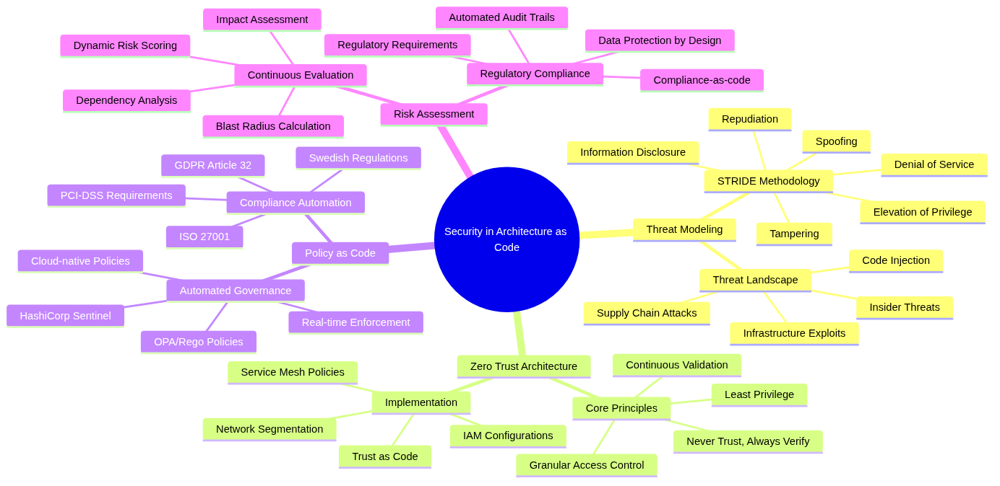

# Security in Architecture as Code


*Security is the backbone of a successful Architecture as Code implementation. This chapter explains how security principles are
 embedded from the first design sprint through automated policy enforcement, proactive threat management, and continuous complian
ce monitoring. Treating security as code enables organisations to deliver robust, scalable, and auditable protections without sl
owing delivery teams.*

## Dimensions of security architecture



*The mind map illustrates the complex relationships between security capabilities in an Architecture as Code landscape—from thre
at modelling and Zero Trust Architecture to Policy as Code and continuous risk assessment. The holistic perspective shows how sec
urity must be woven through every layer of code-driven architecture.*

## Scope and goals of the chapter

The security challenges facing contemporary digital enterprises demand a fundamental reassessment of traditional defensive pract
ices. As organisations adopt Architecture as Code to manage rapidly expanding and highly distributed environments, security stra
tegies must evolve in parallel. This chapter offers a comprehensive guide to integrating security seamlessly into code-based arc
hitectures.

Perimeter-based defences designed for static environments become ineffective in cloud-native and microservice-oriented platforms
. Security can no longer be treated as a separate afterthought. Modern organisations must embrace security-as-code principles wh
ere critical decisions are codified, version-controlled, and automated alongside the rest of the architecture estate.

organizations in particular operate within a dense mesh of regulatory obligations. GDPR, the Civil Contingencies
 Agency (MSB) guidance for critical infrastructure, sectoral regulations, and financial supervision requirements create a multid
imensional compliance landscape. At the same time, ongoing digital transformation programmes demand faster innovation and shorte
r time-to-market. Architecture as Code addresses both pressures by automating compliance controls and embedding "secure by defau
lt" patterns into every delivery pipeline.

This chapter explores security from an integrated perspective that joins technical implementation, organisational processes, and
 regulatory requirements. Readers gain a deep understanding of threat modelling, risk assessment, policy automation, and inciden
t response across code-driven environments. Particular attention is given to Section 10.6, which introduces advanced security arc
hitecture patterns for large-scale enterprises.

## Theoretical foundation: security architecture in the digital era

### The paradigm shift from perimeter protection to Zero Trust

Traditional security philosophies relied on a clear boundary between the "inside" and "outside" of the enterprise. Network perime
ters, firewalls, and VPN solutions created a "hard shell, soft centre" model where anything within the perimeter was implicitly tr
usted. That paradigm was viable when most resources were physically located in tightly controlled data centres and employees work
ed from fixed offices.

Modern operations dismantle those assumptions. Cloud services distribute workloads across multiple providers and regions. Remote
 working extends the security perimeter to every home network. API-driven architectures introduce enormous volumes of service-to-
service communication that traditional controls struggle to monitor.

Zero Trust Architecture (ZTA) provides the necessary evolution in security thinking. The guiding principle of "never trust, alway
s verify" requires explicit validation of every user, device, and network transaction regardless of location or prior authentica
tion. Implementing ZTA demands granular identity management, continuous posture assessment, and policy-driven access controls.

In an Architecture as Code context, ZTA enables systematic implementation of trust policies. Network segmentation, service mesh r
ules, and identity and access management (IAM) configurations are defined declaratively and enforced consistently across all env
ironments. The result is "trust as code", where security decisions become reproducible, testable, and auditable.

### Threat modelling for code-based architectures

Effective security architecture begins with a deep understanding of the threat landscape and relevant attack vectors. Threat mode
lling for Architecture as Code environments differs from traditional application modelling by including the infrastructure layer
, CI/CD pipelines, and automation tooling as potential attack surfaces.

The STRIDE methodology (Spoofing, Tampering, Repudiation, Information Disclosure, Denial of Service, Elevation of Privilege) pro
vides a structured framework for identifying threats across architectural layers. In Architecture as Code ecosystems, STRIDE must
 be applied to infrastructure definitions, deployment pipelines, secrets management systems, and runtime environments alike.

Supply chain attacks represent a particularly acute concern for code-based architectures. When infrastructure is defined through
 third-party modules, container images, and external APIs, dependency chains can be compromised. Incidents such as the 2020 Solar
Winds breach demonstrate how adversaries can infiltrate development tooling to reach downstream targets.

Code injection attacks also take on new dimensions when infrastructure code is executed automatically. Malicious Terraform modul
es, corrupted Kubernetes manifests, or compromised Ansible playbooks can lead to privilege escalation, data exfiltration, or serv
ice outages at the architectural level. Insider threats must also be considered: developers with access to infrastructure code c
an alter security configurations, plant backdoors, or exfiltrate data through seemingly legitimate commits.

### Risk assessment and continuous compliance

Traditional risk assessments are performed periodically, often annually or following major releases. That approach is incompatib
le with continuous deployment and rapid infrastructure evolution. Continuous risk assessment embeds risk evaluation within the de
velopment life cycle through automated tooling and policy engines. Every infrastructure change is assessed for security impacts b
efore deployment, with dynamic risk scores calculated from changes to the attack surface, data exposure, and compliance posture.

Quantitative risk analysis becomes more practical when infrastructure is defined as code. Blast radius calculations can be autom
ated through dependency mapping. Potential impact assessments draw on data classification and service criticality encoded in infr
astructure tags and metadata.

Compliance-as-code transforms audits from reactive exercises into proactive safeguards. Instead of verifying compliance after de
ployment, regulatory requirements are evaluated continuously within the delivery process. GDPR Article 25 ("Data protection by de
sign and by default") can be implemented through automated policy checks that validate privacy controls from the first line of co
de.

## Policy as Code: automated security governance

### The evolution from manual to automated policy enforcement

Traditional governance relies on manual processes, document-heavy policies, and human-controlled safeguards. Security teams write
 policies in natural language, which are then interpreted and implemented by multiple delivery teams. This creates interpretatio
n gaps, inconsistent implementations, and long delays between policy updates and technical enforcement.

Policy as Code replaces manual translations with machine-readable definitions that can be evaluated automatically against infras
tructure configurations. This eliminates the implementation gap between policy intent and technical reality while enabling real-t
ime enforcement.

Open Policy Agent (OPA) has emerged as a de facto standard for policy-as-code implementations. OPA's Rego language provides expre
ssive syntax for complex policies that can be evaluated across diverse technology stacks. Rego policies integrate with CI/CD pip
elines, admission controllers, API gateways, and runtime environments to ensure comprehensive coverage.

HashiCorp Sentinel offers an alternative focused on Infrastructure as Code workflows. Sentinel policies can be enforced at Terra
form plan time to prevent non-compliant deployments. AWS Config Rules and Azure Policy deliver cloud-native policy engines with t
tight integration into their respective platforms.

### Integration with CI/CD for continuous policy enforcement

Successful policy-as-code programmes require deep integration with software delivery life cycles. Manual security reviews as gat
eways create bottlenecks that frustrate teams and delay releases. Automated policy evaluation enables a "security as an enabler"
approach.

"Shift-left" security principles are particularly effective for policy enforcement. Validating policies during commit stages pro
vides rapid feedback, enabling developers to address issues while context is fresh. Git hooks, pre-commit checks, and IDE extens
ions can deliver real-time feedback during development.

CI/CD integration extends policy checks across multiple stages. Static analysis of infrastructure code during build stages can d
detect obvious violations. Dynamic evaluations in staging environments catch configuration problems before production release. P
roduction monitoring ensures policies remain effective throughout the operational life cycle.

Policy testing becomes a core element of the development process once policies are treated as code. Logic must be tested for posi
tive and negative scenarios to validate correct behaviour under different conditions. Test-driven policy development yields robus
t implementations that behave predictably in edge cases. Gradual rollout strategies—including blue/green policy deployments, pol
icy versioning, and structured rollback procedures—reduce disruption from policy changes.

## Secrets management and data protection

### Comprehensive secrets lifecycle management

Modern distributed architectures multiply the number of secrets compared with monolithic systems. API keys, database credential
s, encryption keys, certificates, and service tokens proliferate across microservices, containers, and cloud services. Embeddi
ng secrets in configuration files or environment variables creates significant vulnerabilities and operational complexity.

Comprehensive secrets management covers the entire lifecycle—from generation through distribution, rotation, and retirement. Auto
mated key generation services such as HashiCorp Vault or cloud-native offerings like AWS Secrets Manager provide cryptographic s
tandards with strong entropy. Manual secret creation should be the exception.

Distribution mechanisms must balance security with operational efficiency. Secrets should be delivered through secure channels s
uch as encrypted configuration management systems, secrets management APIs, or runtime injection. Centralised secret storage sho
uld enforce encryption in transit and at rest. Hardware Security Modules (HSMs) or HSM-backed cloud services provide the highest
 level of protection for critical keys.

### Advanced encryption strategies for data protection

Protecting data requires addressing multiple states and access patterns: at rest, in transit, and in use. Key management is ofte
n the weakest link. Rotation policies must balance the benefits of frequent rotation with the operational effort of coordinating
 updates across distributed estates.

Application-level encryption provides granular safeguards that persist even if infrastructure is compromised. Field-level encrypt
ion for sensitive database columns, client-side encryption for sensitive inputs, and end-to-end encryption for service-to-servic
e communication create layered defences.

Emerging techniques such as homomorphic encryption and secure multi-party computation enable computation on encrypted data. Whil
e adoption is still limited, Architecture as Code practices can prepare organisations for future integration through abstracted
 interfaces.

### Data classification and handling procedures

Effective protection begins with clear data classification. Automated discovery tools can assist through content analysis and pa
ttern recognition, but human judgement remains essential for contextual accuracy. Hybrid approaches combining automation with h
uman validation deliver the best results.

Handling procedures should be codified for each classification level, covering storage, transmission, processing, and disposal. P
olicy-as-code frameworks can enforce handling rules automatically, including retention policies and secure destruction processe
s. Privacy by design requirements from GDPR Article 25 demand data minimisation, purpose limitation, and automated deletion when
 retention periods expire.

## Network security and micro-segmentation

### Modern network architecture for Zero Trust environments

Perimeter-led network security is unsuitable for cloud-native deployments where applications span multiple networks, data centre
s, and jurisdictions. Software-defined networking (SDN) moves network security from hardware appliances to code-driven control p
lanes. Policies can be defined centrally and pushed automatically across hybrid environments, ensuring consistent enforcement re
gardless of underlying infrastructure.

Micro-segmentation provides granular, application-aware control compared with traditional VLANs or subnets. Traffic policies can
 be defined using application identity, user context, and data classification to reduce lateral movement opportunities.

Container networking introduces additional complexity. Containers share network namespaces and often communicate directly, bypas
sing traditional controls. Container Network Interface (CNI) plug-ins provide a consistent mechanism for implementing network po
licies for containerised workloads.

### Service mesh security architectures

Service mesh platforms solve inter-service security challenges in distributed applications. Mutual TLS (mTLS) enforced by the me
sh ensures every service-to-service call is encrypted and authenticated. Identity certificates are provisioned and rotated autom
atically, eliminating manual management overhead.

Policy-driven traffic routing centralises advanced controls such as rate limiting, circuit breaking, and request filtering. Poli
cies can be adjusted dynamically based on threat intelligence or service health. Service mesh observability—metrics, distributed
 tracing, and access logs—delivers deep visibility for rapid incident response and forensic investigations.

## Advanced security architecture patterns

### Security orchestration and automated incident response

Modern enterprises require orchestrated security operations to manage the volume and speed of contemporary threats. Manual incid
ent response cannot scale when attacks develop within minutes. Security Orchestration, Automation, and Response (SOAR) platforms
 transform incident handling into proactive, automated workflows. Predefined playbooks support automated containment, evidence c
ollection, stakeholder notifications, and impact assessments.

Integrating SOAR with Architecture as Code allows infrastructure-level responses. Compromised components can be isolated or redep
loyed from known-good definitions. Network policies adjust automatically to contain lateral movement. Backup restoration process
es can be triggered based on compromise indicators. Threat intelligence feeds using STIX/TAXII formats add context for faster, m
ore accurate decisions.

### AI and machine learning in security architectures

Artificial intelligence and machine learning augment security programmes with pattern recognition and anomaly detection at scale
. Behavioural analytics establish baselines for users, applications, and network traffic; deviations trigger investigations or pr
eventive actions. User Behaviour Analytics (UBA) helps detect insider threats through subtle access changes.

Automated threat hunting uses AI models trained on historical data to identify potential compromises before they escalate. Organi
sations must also defend the AI systems themselves. Adversarial machine learning techniques can target models, requiring controls
 such as input sanitisation, model validation, and monitoring for adversarial indicators.

### Multi-cloud security strategies

Multi-cloud adoption improves resilience and reduces vendor lock-in but introduces policy complexity. Unified policy management l
ayers translate organisational requirements into provider-specific implementations. Policy-as-code frameworks must support multi
ple providers simultaneously to maintain consistent posture.

Identity federation enables single sign-on and coherent access control. Cloud-native identity services such as Azure Active Dire
ctory or AWS IAM should integrate with on-premises and third-party directories. Data governance must address residency, cross-bo
rder transfer restrictions, and varying encryption capabilities through automated classification-aware controls.

### Security observability and analytics patterns

Comprehensive observability underpins effective detection and response. Centralised log aggregation, normalisation, and stream pr
ocessing deliver real-time detection while supporting historical investigations. Key performance indicators—mean time to detect (M
TTD), mean time to respond (MTTR), false positive ratios, control coverage, and compliance drift—provide quantitative measures of
 programme effectiveness.

Automating threat modelling with observability data allows continuous refinement of models based on observed behaviour. Emerging
 attack patterns can be identified and mitigated before they are fully weaponised.

### Emerging security technologies and future trends

Quantum computing presents both opportunity and threat. Organisations must prepare for quantum-resistant cryptography using NIST
 guidance and incorporate algorithm agility into Architecture as Code frameworks. Zero-knowledge proofs enable privacy-preservin
g authentication and authorisation, which can be integrated via code-driven approaches. Distributed and self-sovereign identity
 solutions reduce reliance on central providers, while confidential computing and trusted execution environments (TEEs) protect d
ata during processing—even from cloud operators.

## Practical implementation: security architecture in environments

### Comprehensive security foundation module

The following Terraform module demonstrates a foundational enterprise security pattern tailored for organizations. It ap
plies defence-in-depth principles through automated controls for encryption, access management, audit logging, and threat detect
ion.

```hcl
# modules/security-foundation/main.tf
terraform {
  required_providers {
    # provider definitions omitted for brevity
  }
}

# Security baseline for organizations
# Aligns with MSB guidance for critical infrastructure and enforces GDPR compliance
locals {
  security_tags = {
    SecurityBaseline   = "swedish-gov-baseline"
    ComplianceFramework = "iso27001-gdpr"
    DataClassification = var.data_classification
    ThreatModel        = "updated"
    SecurityContact    = var.security_team_email
    Organization       = var.organization_name
    Environment        = var.environment
  }

  # National security requirements based on MSB guidance
  required_encryption        = true
  audit_logging_required     = true
  gdpr_compliance            = var.data_classification != "public"
  backup_encryption_required = var.data_classification in ["internal", "confidential", "restricted"]

  # Approved EU regions for data protection programmes
  approved_regions = ["eu-north-1", "eu-west-1", "eu-central-1"]
}

# Organisation-wide master encryption key implementing GDPR Article 32 controls
resource "aws_kms_key" "org_key" {
  description              = "Master encryption key for ${var.organization_name}"
  customer_master_key_spec = "SYMMETRIC_DEFAULT"
  key_usage                = "ENCRYPT_DECRYPT"
  deletion_window_in_days  = 30

  # Automated rotation in line with security expectations
  enable_key_rotation = true

  # Granular key policy implementing least privilege access
  policy = jsonencode({
    Version = "2012-10-17"
    Statement = [
      {
        Sid       = "Enable IAM User Permissions"
        Effect    = "Allow"
        Principal = {
          AWS = "arn:aws:iam::${data.aws_caller_identity.current.account_id}:root"
        }
        Action   = "kms:*"
        Resource = "*"
      },
      {
        Sid       = "Allow CloudWatch Logs Encryption"
        Effect    = "Allow"
        Principal = {
          Service = "logs.${data.aws_region.current.name}.amazonaws.com"
        }
        Action = [
          "kms:Encrypt",
          "kms:Decrypt",
          "kms:ReEncrypt*",
          "kms:GenerateDataKey*",
          "kms:DescribeKey"
        ]
        Resource = "*"
        Condition = {
          ArnEquals = {
            "kms:EncryptionContext:aws:logs:arn" = "arn:aws:logs:${data.aws_region.current.name}:${data.aws_caller_identity.current.account_id}:log-group:*"
          }
        }
      },
      {
        Sid       = "Allow S3 Service Access"
        Effect    = "Allow"
        Principal = {
          Service = "s3.amazonaws.com"
        }
        Action = [
          "kms:Decrypt",
          "kms:GenerateDataKey"
        ]
        Resource = "*"
        Condition = {
          StringEquals = {
            "kms:ViaService" = "s3.${data.aws_region.current.name}.amazonaws.com"
          }
        }
      }
    ]
  })

  tags = merge(local.security_tags, {
    Name            = "${var.organization_name}-master-key"
    Purpose         = "data-encryption"
    RotationSchedule = "annual"
  })
}

# Zero Trust security group with explicit outbound rules only
resource "aws_security_group" "secure_application" {
  name_prefix = "${var.application_name}-secure-"
  vpc_id      = var.vpc_id
  description = "Zero Trust security group for ${var.application_name}"

  # No inbound traffic by default (implicit deny)
  # Explicit rules must be added per workload requirement

  egress {
    description      = "HTTPS for external API calls and software updates"
    from_port        = 443
    to_port          = 443
    protocol         = "tcp"
    cidr_blocks      = ["0.0.0.0/0"]
    ipv6_cidr_blocks = ["::/0"]
  }

  egress {
    description = "DNS queries for name resolution"
    from_port   = 53
    to_port     = 53
    protocol    = "udp"
    cidr_blocks = ["0.0.0.0/0"]
    ipv6_cidr_blocks = ["::/0"]
  }

  egress {
    description = "NTP for time synchronisation (essential for log integrity)"
    from_port   = 123
    to_port     = 123
    protocol    = "udp"
    cidr_blocks = ["0.0.0.0/0"]
  }

  tags = merge(local.security_tags, {
    Name           = "${var.application_name}-secure-sg"
    NetworkSegment = "application-tier"
    SecurityLevel  = "high"
  })
}

# Comprehensive audit logging aligned with GDPR Article 30
resource "aws_cloudtrail" "security_audit" {
  count = local.audit_logging_required ? 1 : 0

  name           = "${var.organization_name}-security-audit"
  s3_bucket_name = aws_s3_bucket.audit_logs[0].bucket

  event_selector {
    read_write_type            = "All"
    include_management_events  = true

    data_resource {
      type   = "AWS::S3::Object"
      values = ["${aws_s3_bucket.audit_logs[0].arn}/*"]
    }

    data_resource {
      type   = "AWS::KMS::Key"
      values = [aws_kms_key.org_key.arn]
    }
  }

  event_selector {
    read_write_type           = "All"
    include_management_events = false

    data_resource {
      type   = "AWS::Lambda::Function"
      values = ["arn:aws:lambda"]
    }
  }

  enable_log_file_validation = true
  is_multi_region_trail      = true
  is_organization_trail      = var.is_organization_master
  kms_key_id                 = aws_kms_key.org_key.arn

  cloud_watch_logs_group_arn = "${aws_cloudwatch_log_group.cloudtrail_logs[0].arn}:*"
  cloud_watch_logs_role_arn  = aws_iam_role.cloudtrail_logs_role[0].arn

  tags = merge(local.security_tags, {
    Name            = "${var.organization_name}-security-audit"
    Purpose         = "compliance-audit-logging"
    RetentionPeriod = "7-years"
  })
}

resource "aws_s3_bucket" "audit_logs" {
  count  = local.audit_logging_required ? 1 : 0
  bucket = "${var.organization_name}-security-audit-logs-${random_id.bucket_suffix.hex}"

  tags = merge(local.security_tags, {
    Name              = "${var.organization_name}-audit-logs"
    DataType          = "audit-logs"
    DataClassification = "internal"
    Purpose           = "compliance-logging"
  })
}
```

This module applies best practices for key management, Zero Trust networking, and audit logging to meet and wider Europe
an regulatory expectations. KMS key rotation is automated, security groups enforce a default deny posture, and CloudTrail delive
rs tamper-evident logging for compliance validation.

### Advanced GDPR compliance implementation

Policy as Code can express GDPR requirements in executable form. The following Open Policy Agent example shows how Article 32 ca
n be translated into automated checks.

```rego
# policies/gdpr_compliance.rego
package sweden.gdpr

import rego.v1

# GDPR Article 32 – ensure appropriate technical and organisational measures
personal_data_encryption_required if {
    input.resource_type in ["aws_rds_instance", "aws_s3_bucket", "aws_ebs_volume", "aws_dynamodb_table"]
    contains(input.attributes.tags.DataClassification, "personal")
    not encryption_enabled
}

# Helper rules for specific resource types (omitted for brevity)
# ...
```

### Advanced threat detection platform

```python
"""Advanced threat detection for organizations"""
import asyncio
import aiohttp
import boto3
import hashlib
import json
import logging
import pandas as pd

from dataclasses import dataclass
from datetime import datetime, timedelta
from enum import Enum
from typing import Dict, List, Optional


class ThreatSeverity(Enum):
    """Threat severity levels aligned with MSB guidance"""

    LOW = "low"
    MEDIUM = "medium"
    HIGH = "high"
    CRITICAL = "critical"


@dataclass
class SecurityFinding:
    """Structured representation of a security finding"""

    finding_id: str
    title: str
    description: str
    severity: ThreatSeverity
    affected_resources: List[str]
    indicators_of_compromise: List[str]
    remediation_steps: List[str]
    compliance_impact: Optional[str]
    detection_timestamp: datetime
    source_system: str


class AdvancedThreatDetection:
    """Comprehensive threat detection following best practice"""

    def __init__(self, region: str = "eu-north-1", threat_intel_feeds: Optional[List[str]] = None) -> None:
        self.region = region
        self.cloudtrail = boto3.client("cloudtrail", region_name=region)
        self.guardduty = boto3.client("guardduty", region_name=region)
        self.config = boto3.client("config", region_name=region)
        self.sns = boto3.client("sns", region_name=region)
        self.ec2 = boto3.client("ec2", region_name=region)
        self.iam = boto3.client("iam", region_name=region)

        self.threat_intel_feeds = threat_intel_feeds or []
        self.ioc_database: Dict[str, Dict] = {}

        logging.basicConfig(level=logging.INFO, format="%(asctime)s - %(name)s - %(levelname)s - %(message)s")
        self.logger = logging.getLogger(__name__)

    async def detect_advanced_persistent_threats(self, hours_back: int = 24) -> List[SecurityFinding]:
        """Correlate multiple data sources to detect potential APT activity"""

        findings: List[SecurityFinding] = []
        end_time = datetime.now()
        start_time = end_time - timedelta(hours=hours_back)

        suspicious_activities = await self._correlate_threat_indicators(start_time, end_time)
        lateral_movement = await self._detect_lateral_movement(start_time, end_time)
        privilege_escalation = await self._detect_privilege_escalation(start_time, end_time)
        data_exfiltration = await self._detect_data_exfiltration(start_time, end_time)

        for activity in suspicious_activities:
            if self._calculate_threat_score(activity) > 0.7:
                finding = SecurityFinding(
                    finding_id=f"APT-{hashlib.md5(str(activity).encode()).hexdigest()[:8]}",
                    title="Potential Advanced Persistent Threat Activity",
                    description=f"Correlated suspicious activities indicating potential APT: {activity['description']}",
                    severity=ThreatSeverity.CRITICAL,
                    affected_resources=activity["resources"],
                    indicators_of_compromise=activity["iocs"],
                    remediation_steps=[
                        "Immediately isolate affected resources",
                        "Initiate forensic investigation",
                        "Review potential lateral movement",
                        "Restore from verified secure backup",
                        "Increase monitoring for related indicators",
                    ],
                    compliance_impact="Potential GDPR Article 33 notification (72-hour requirement)",
                    detection_timestamp=datetime.now(),
                    source_system="Advanced Threat Detection",
                )
                findings.append(finding)

        return findings

    async def monitor_gdpr_compliance_violations(self) -> List[SecurityFinding]:
        """Continuously monitor for GDPR compliance violations"""

        findings: List[SecurityFinding] = []

        unusual_data_access = await self._analyse_data_access_patterns()
        unauthorised_transfers = await self._detect_unauthorised_data_transfers()
        retention_violations = await self._check_data_retention_compliance()

        for violation in [*unusual_data_access, *unauthorised_transfers, *retention_violations]:
            findings.append(
                SecurityFinding(
                    finding_id=f"GDPR-{violation['type']}-{violation['resource_id'][:8]}",
                    title=f"GDPR Compliance Violation: {violation['type']}",
                    description=violation["description"],
                    severity=ThreatSeverity.HIGH,
                    affected_resources=[violation["resource_id"]],
                    indicators_of_compromise=violation.get("indicators", []),
                    remediation_steps=violation["remediation_steps"],
                    compliance_impact=f"GDPR {violation['article']} violation – regulatory action possible",
                    detection_timestamp=datetime.now(),
                    source_system="GDPR Compliance Monitor",
                )
            )

        return findings

    async def assess_supply_chain_risks(self) -> List[SecurityFinding]:
        """Evaluate supply chain risks from third-party dependencies"""

        findings: List[SecurityFinding] = []

        container_risks = await self._scan_container_vulnerabilities()
        api_risks = await self._assess_third_party_apis()
        dependency_risks = await self._analyse_infrastructure_dependencies()

        for risk in [*container_risks, *api_risks, *dependency_risks]:
            severity = ThreatSeverity.CRITICAL if risk["cvss_score"] > 7.0 else ThreatSeverity.HIGH
            findings.append(
                SecurityFinding(
                    finding_id=f"SUPPLY-{risk['component']}-{risk['vulnerability_id']}",
                    title=f"Supply Chain Risk: {risk['component']}",
                    description=risk["description"],
                    severity=severity,
                    affected_resources=risk["affected_resources"],
                    indicators_of_compromise=[],
                    remediation_steps=risk["remediation_steps"],
                    compliance_impact="Potential impact on the Protective Security Act",
                    detection_timestamp=datetime.now(),
                    source_system="Supply Chain Risk Assessment",
                )
            )

        return findings

    def generate_executive_security_report(self, findings: List[SecurityFinding]) -> Dict[str, Dict]:
        """Generate an executive-level report with regulatory context"""

        critical_findings = [f for f in findings if f.severity == ThreatSeverity.CRITICAL]
        high_findings = [f for f in findings if f.severity == ThreatSeverity.HIGH]

        total_affected_resources = len({resource for finding in findings for resource in finding.affected_resources})
        gdpr_notifications_required = len(
            [f for f in findings if f.compliance_impact and "GDPR Article 33" in f.compliance_impact]
        )

        report = {
            "executive_summary": {
                "total_findings": len(findings),
                "critical_severity": len(critical_findings),
                "high_severity": len(high_findings),
                "affected_resources": total_affected_resources,
                "gdpr_notifications_required": gdpr_notifications_required,
                "report_period": datetime.now().strftime("%Y-%m-%d"),
                "overall_risk_level": self._calculate_overall_risk(findings),
            },
            "regulatory_compliance": {
                "gdpr_compliance_score": self._calculate_gdpr_compliance_score(findings),
                "msb_compliance_score": self._calculate_msb_compliance_score(findings),
                "required_notifications": self._generate_notification_recommendations(findings),
            },
            "threat_landscape": {
                "apt_indicators": len([f for f in findings if "APT" in f.finding_id]),
                "supply_chain_risks": len([f for f in findings if "SUPPLY" in f.finding_id]),
                "insider_threat_indicators": len([f for f in findings if "INSIDER" in f.finding_id]),
            },
            "remediation_priorities": self._prioritise_remediation_actions(findings),
            "recommendations": self._generate_strategic_recommendations(findings),
        }

        return report

    async def automated_incident_response(self, finding: SecurityFinding) -> Dict[str, List[str]]:
        """Execute automated incident response aligned with procedures"""

        response_actions: List[str] = []

        if finding.severity == ThreatSeverity.CRITICAL:
            if any("ec2" in resource.lower() for resource in finding.affected_resources):
                await self._isolate_ec2_instances(finding.affected_resources)
                response_actions.append("EC2 instances isolated from the network")

            if any("s3" in resource.lower() for resource in finding.affected_resources):
                await self._restrict_s3_access(finding.affected_resources)
                response_actions.append("S3 bucket access restricted")

            await self._notify_security_team(finding, urgent=True)
            await self._notify_compliance_team(finding)
            response_actions.append("Critical stakeholders notified")

        await self._preserve_forensic_evidence(finding)
        response_actions.append("Forensic evidence preserved")

        incident_id = await self._create_incident_record(finding, response_actions)
        self.logger.info("Automated response completed for finding %s (incident %s)", finding.finding_id, incident_id)

        return {
            "incident_id": incident_id,
            "response_actions": response_actions,
            "next_steps": finding.remediation_steps,
        }

    # Additional helper methods (_correlate_threat_indicators, _detect_lateral_movement, etc.) would be implemented here.
```

## Security maturity models for continuous improvement

Security maturity assessments provide structured frameworks for measuring current posture and prioritising investment. The Capab
ility Maturity Model Integration (CMMI) for security supplies a five-level ladder from initial reactive practices to optimised pr
oactive operations. organizations can benchmark against industry peers by conducting regular CMMI assessments.

The NIST Cybersecurity Framework offers a practical approach built around the functions Identify, Protect, Detect, Respond, and R
ecover. Embedding the framework into Architecture as Code enables systematic improvements with traceable outcomes.

## Future security trends and technical evolution

Quantum-ready cryptography, AI-enhanced security tooling, and privacy-preserving computation will shape the next decade of securi
ty architecture. Organisations should invest in algorithm agility, machine learning governance, and privacy engineering skills to
 stay ahead of emerging threats. Zero-knowledge proofs, confidential computing, and distributed identity solutions will become in
creasingly relevant as regulatory regimes demand stronger privacy guarantees.

## Strategic security recommendations for organizations

enterprises should align security investments with regulatory duties, the evolving threat landscape, and transformation o
bjectives. Participation in national collaboration forums—such as the Civil Contingencies Agency (MSB), the Swedish Inte
rnet Foundation, and sector-specific information sharing groups—strengthens threat intelligence and coordinated response capabil
ities.

Closing the cybersecurity skills gap is essential. Investment in training programmes, professional certifications, and academic p
artnerships ensures access to the expertise required to support ambitious digital initiatives.

## Summary and future development

Architecture as Code represents the future of infrastructure management for organizations. Security within this paradigm
 is a transformative shift from reactive, manual approaches to proactive, automated safeguards embedded throughout development. Z
ero Trust principles, policy automation, and codified security patterns allow teams to version-control, test, and deploy securit
y decisions with the same rigour applied to functional requirements.

Automated compliance streamlines complex regulatory obligations spanning GDPR, MSB guidance, and industry-specific mandates. Adv
anced patterns—particularly those highlighted in Section 10.6—illustrate how orchestration, AI-assisted detection, and multi-clo
ud strategies can scale security for large enterprises.

Organisations that embrace Architecture as Code security practices position themselves for successful digital transformation whi
le maintaining a strong security posture. Investments in security automation reduce incident rates, accelerate compliance valida
tion, and improve operational efficiency. Preparing for future trends—automation, AI augmentation, and quantum-ready defences—req
uires adaptable, code-driven frameworks capable of evolving alongside new technologies and threats.

Delivering these outcomes demands organisational commitment to a DevSecOps culture, sustained investment in skills, and a discpl
ined approach to continuous improvement. When implemented well, Architecture as Code security enables both enhanced protection a
nd accelerated innovation.

## Sources and references

### Academic sources and standards
- NIST. *Cybersecurity Framework Version 1.1.* National Institute of Standards and Technology, 2018.
- NIST. *Special Publication 800-207: Zero Trust Architecture.* National Institute of Standards and Technology, 2020.
- NIST. *Post-Quantum Cryptography Standardisation.* National Institute of Standards and Technology, 2023.
- ENISA. *Cloud Security Guidelines for EU Organisations.* European Union Agency for Cybersecurity, 2023.
- ISO/IEC 27001:2022. *Information Security Management Systems – Requirements.* International Organization for Standardization.

### authorities and regulatory sources
- MSB. *General Guidance on Information Security for Essential Services.* Civil Contingencies Agency, 2023.
- MSB. *Risk Analysis Guidance for the NIS Directive.* Civil Contingencies Agency, 2023.
- Finansinspektionen. *Regulations on Operational Risk (FFFS 2014:1, consolidated 2023).* Financial Supervisory Authority.
- Dataskyddslagen (SFS 2018:218). *Supplementary Provisions to the EU General Data Protection Regulation.*
- Säkerhetsskyddslagen (SFS 2018:585). *Protective Security Act.*

### Technical standards and frameworks
- OWASP. *Application Security Architecture Guide.* Open Web Application Security Project, 2023.
- Cloud Security Alliance. *Security Guidance v4.0.* Cloud Security Alliance, 2023.
- CIS Controls v8. *Critical Security Controls for Effective Cyber Defence.* Center for Internet Security, 2023.
- MITRE ATT&CK Framework. *Enterprise Matrix.* MITRE Corporation, 2023.

### Industry references
- Amazon Web Services. *AWS Security Best Practices.* AWS Security Documentation, 2023.
- Microsoft. *Azure Security Benchmark v3.0.* Microsoft Security Documentation, 2023.
- HashiCorp. *Terraform Security Best Practices.* HashiCorp Learning Resources, 2023.
- Open Policy Agent. *OPA Policy Authoring Guide.* Cloud Native Computing Foundation, 2023.
- Kubernetes Project. *Pod Security Standards.* Kubernetes Documentation, 2023.

### organizations and expertise
- Internet Foundation. *Cybersecurity Report 2023.* Internetstiftelsen, 2023.
- Incert. *Cybersecurity Threat Landscape Report 2023.* Swedish Computer Emergency Response Team.
- Cybercom Group. *Nordic Cybersecurity Survey 2023.* Cybercom Group AB.
- KTH Royal Institute of Technology. *Cybersecurity Research Publications.* Network and Systems Engineering.

### International security organisations
- SANS Institute. *Security Architecture Design Principles.* SANS Institute, 2023.
- ISACA. *COBIT 2019 Framework for Governance and Management of Enterprise IT.* ISACA, 2019.
- (ISC)². *Cybersecurity Workforce Study.* International Information System Security Certification Consortium, 2023.

*All sources verified December 2023. Regulatory frameworks and technical standards are updated regularly; always consult the lat
est official publications for definitive requirements.*
