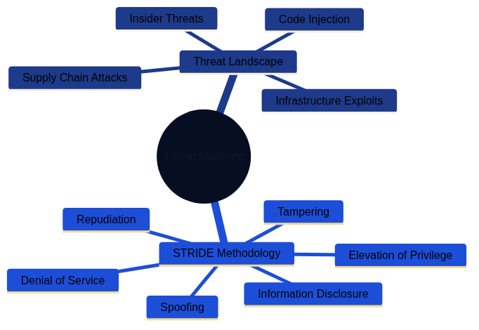
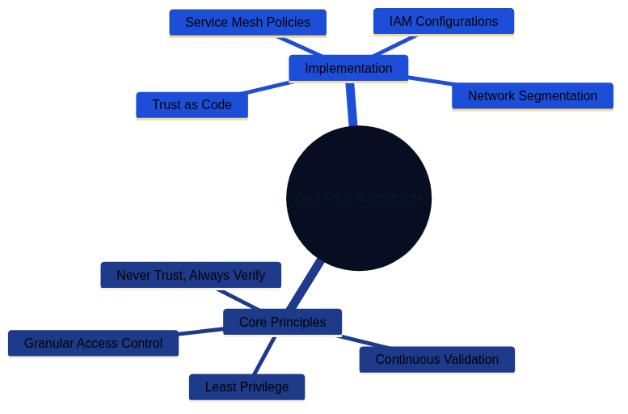

# Security Fundamentals for Architecture as Code

*Security is the backbone of a successful Architecture as Code implementation. This chapter explains how security principles are
 embedded from the first design sprint through automated policy enforcement, proactive threat management, and continuous complian
ce monitoring. Treating security as code enables organisations to deliver robust, scalable, and auditable protections without sl
owing delivery teams.*

## Dimensions of security architecture

*The overview mind map illustrates the four main dimensions of security in Architecture as Code: Threat Modeling, Zero Trust Architecture, Policy as Code, and Risk Assessment. Each dimension is explored in detail through dedicated mind maps.*

### Detailed security dimensions

#### Threat Modeling

*Threat Modeling encompasses understanding the threat landscape and applying methodologies like STRIDE to identify and mitigate security risks systematically.*

#### Zero Trust Architecture

*Zero Trust Architecture is built on core principles of continuous verification and implemented through network segmentation, service mesh policies, and granular access controls.*

#### Policy as Code

*Policy as Code enables automated governance and compliance automation through tools like OPA/Rego and HashiCorp Sentinel, ensuring regulatory requirements are met programmatically.*

#### Risk Assessment

*Risk Assessment involves continuous evaluation of blast radius and impact, combined with regulatory compliance measures to maintain data protection and audit trails.*

## Scope and goals of the chapter

The security challenges facing contemporary digital enterprises demand a fundamental reassessment of traditional defensive pract
ices. As organisations adopt Architecture as Code to manage rapidly expanding and highly distributed environments, security stra
tegies must evolve in parallel. This chapter offers a comprehensive guide to integrating security seamlessly into code-based arc
hitectures.

Perimeter-based defences designed for static environments become ineffective in cloud-native and microservice-oriented platforms
. Security can no longer be treated as a separate afterthought. Modern organisations must embrace security-as-code principles wh
ere critical decisions are codified, version-controlled, and automated alongside the rest of the architecture estate.

Swedish organisations in particular operate within a dense mesh of regulatory obligations. GDPR, the Swedish Civil Contingencies
 Agency (MSB) guidance for critical infrastructure, sectoral regulations, and financial supervision requirements create a multid
imensional compliance landscape. At the same time, ongoing digital transformation programmes demand faster innovation and shorte
r time-to-market. Architecture as Code addresses both pressures by automating compliance controls and embedding "secure by defau
lt" patterns into every delivery pipeline.

This chapter explores security from an integrated perspective that joins technical implementation, organisational processes, and
 regulatory requirements. Readers gain a deep understanding of threat modelling, risk assessment, policy automation, and inciden
t response across code-driven environments. Particular attention is given to Section 10.6, which introduces advanced security arc
hitecture patterns for large-scale enterprises.

## Theoretical foundation: security architecture in the digital era

### The paradigm shift from perimeter protection to Zero Trust

Traditional security philosophies relied on a clear boundary between the "inside" and "outside" of the enterprise. Network perime
ters, firewalls, and VPN solutions created a "hard shell, soft centre" model where anything within the perimeter was implicitly tr
usted. That paradigm was viable when most resources were physically located in tightly controlled data centres and employees work
ed from fixed offices.

Modern operations dismantle those assumptions. Cloud services distribute workloads across multiple providers and regions. Remote
 working extends the security perimeter to every home network. API-driven architectures introduce enormous volumes of service-to-
service communication that traditional controls struggle to monitor.

Zero Trust Architecture (ZTA) provides the necessary evolution in security thinking. The guiding principle of "never trust, alway
s verify" requires explicit validation of every user, device, and network transaction regardless of location or prior authentica
tion. Implementing ZTA demands granular identity management, continuous posture assessment, and policy-driven access controls.

In an Architecture as Code context, ZTA enables systematic implementation of trust policies. Network segmentation, service mesh r
ules, and identity and access management (IAM) configurations are defined declaratively and enforced consistently across all env
ironments. The result is "trust as code", where security decisions become reproducible, testable, and auditable.

### Threat modelling for code-based architectures

Effective security architecture begins with a deep understanding of the threat landscape and relevant attack vectors. Threat mode
lling for Architecture as Code environments differs from traditional application modelling by including the infrastructure layer
, CI/CD pipelines, and automation tooling as potential attack surfaces.

The STRIDE methodology provides a structured framework for identifying threats across architectural layers. In Architecture as Code ecosystems, STRIDE must be applied to infrastructure definitions, deployment pipelines, secrets management systems, and runtime environments alike.

| Threat Category | Description | Architecture as Code Concerns |
|-----------------|-------------|-------------------------------|
| Spoofing | Impersonating a user, system, or component | Compromised service accounts, stolen IAM credentials, forged infrastructure definitions |
| Tampering | Unauthorized modification of data or code | Malicious commits to infrastructure code, altered pipeline configurations, modified secrets |
| Repudiation | Denying actions without proper audit trail | Missing version control history, inadequate logging of infrastructure changes, untracked deployments |
| Information Disclosure | Exposing sensitive information | Secrets in code repositories, unencrypted data stores, overly permissive access policies |
| Denial of Service | Making systems unavailable | Resource exhaustion through misconfiguration, deletion of critical infrastructure, deployment failures |
| Elevation of Privilege | Gaining unauthorized access levels | Exploiting IAM misconfigurations, compromised deployment pipelines, privilege escalation in modules |

Supply chain attacks represent a particularly acute concern for code-based architectures. When infrastructure is defined through
 third-party modules, container images, and external APIs, dependency chains can be compromised. Incidents such as the 2020 Solar
Winds breach demonstrate how adversaries can infiltrate development tooling to reach downstream targets.

Code injection attacks also take on new dimensions when infrastructure code is executed automatically. Malicious Terraform modul
es, corrupted Kubernetes manifests, or compromised Ansible playbooks can lead to privilege escalation, data exfiltration, or serv
ice outages at the architectural level. Insider threats must also be considered: developers with access to infrastructure code c
an alter security configurations, plant backdoors, or exfiltrate data through seemingly legitimate commits.

### Risk assessment and continuous compliance

Traditional risk assessments are performed periodically, often annually or following major releases. That approach is incompatib
le with continuous deployment and rapid infrastructure evolution. Continuous risk assessment embeds risk evaluation within the de
velopment life cycle through automated tooling and policy engines. Every infrastructure change is assessed for security impacts b
efore deployment, with dynamic risk scores calculated from changes to the attack surface, data exposure, and compliance posture.

Quantitative risk analysis becomes more practical when infrastructure is defined as code. Blast radius calculations can be autom
ated through dependency mapping. Potential impact assessments draw on data classification and service criticality encoded in infr
astructure tags and metadata.

Compliance-as-code transforms audits from reactive exercises into proactive safeguards. Instead of verifying compliance after de
ployment, regulatory requirements are evaluated continuously within the delivery process. GDPR Article 25 ("Data protection by de
sign and by default") can be implemented through automated policy checks that validate privacy controls from the first line of co
de.

## Policy as Code: automated security governance

### The evolution from manual to automated policy enforcement

Traditional governance relies on manual processes, document-heavy policies, and human-controlled safeguards. Security teams write
 policies in natural language, which are then interpreted and implemented by multiple delivery teams. This creates interpretatio
n gaps, inconsistent implementations, and long delays between policy updates and technical enforcement.

Policy as Code replaces manual translations with machine-readable definitions that can be evaluated automatically against infras
tructure configurations. This eliminates the implementation gap between policy intent and technical reality while enabling real-t
ime enforcement.

Open Policy Agent (OPA) has emerged as a de facto standard for policy-as-code implementations. OPA's Rego language provides expre
ssive syntax for complex policies that can be evaluated across diverse technology stacks. Rego policies integrate with CI/CD pip
elines, admission controllers, API gateways, and runtime environments to ensure comprehensive coverage.

HashiCorp Sentinel offers an alternative focused on Infrastructure as Code workflows. Sentinel policies can be enforced at Terra
form plan time to prevent non-compliant deployments. AWS Config Rules and Azure Policy deliver cloud-native policy engines with t
tight integration into their respective platforms.

### Integration with CI/CD for continuous policy enforcement

Successful policy-as-code programmes require deep integration with software delivery life cycles. Manual security reviews as gat
eways create bottlenecks that frustrate teams and delay releases. Automated policy evaluation enables a "security as an enabler"
approach.

"Shift-left" security principles are particularly effective for policy enforcement. Validating policies during commit stages pro
vides rapid feedback, enabling developers to address issues while context is fresh. Git hooks, pre-commit checks, and IDE extens
ions can deliver real-time feedback during development.

CI/CD integration extends policy checks across multiple stages. Static analysis of infrastructure code during build stages can d
detect obvious violations. Dynamic evaluations in staging environments catch configuration problems before production release. P
roduction monitoring ensures policies remain effective throughout the operational life cycle.

Policy testing becomes a core element of the development process once policies are treated as code. Logic must be tested for posi
tive and negative scenarios to validate correct behaviour under different conditions. Test-driven policy development yields robus
t implementations that behave predictably in edge cases. Gradual rollout strategies—including blue/green policy deployments, pol
icy versioning, and structured rollback procedures—reduce disruption from policy changes.

## Secrets management and data protection

### Comprehensive secrets lifecycle management

Modern distributed architectures multiply the number of secrets compared with monolithic systems. API keys, database credential
s, encryption keys, certificates, and service tokens proliferate across microservices, containers, and cloud services. Embeddi
ng secrets in configuration files or environment variables creates significant vulnerabilities and operational complexity.

Comprehensive secrets management covers the entire lifecycle—from generation through distribution, rotation, and retirement. Auto
mated key generation services such as HashiCorp Vault or cloud-native offerings like AWS Secrets Manager provide cryptographic s
tandards with strong entropy. Manual secret creation should be the exception.

Distribution mechanisms must balance security with operational efficiency. Secrets should be delivered through secure channels s
uch as encrypted configuration management systems, secrets management APIs, or runtime injection. Centralised secret storage sho
uld enforce encryption in transit and at rest. Hardware Security Modules (HSMs) or HSM-backed cloud services provide the highest
 level of protection for critical keys.

### Advanced encryption strategies for data protection

Protecting data requires addressing multiple states and access patterns: at rest, in transit, and in use. Key management is ofte
n the weakest link. Rotation policies must balance the benefits of frequent rotation with the operational effort of coordinating
 updates across distributed estates.

Application-level encryption provides granular safeguards that persist even if infrastructure is compromised. Field-level encrypt
ion for sensitive database columns, client-side encryption for sensitive inputs, and end-to-end encryption for service-to-servic
e communication create layered defences.

Emerging techniques such as homomorphic encryption and secure multi-party computation enable computation on encrypted data. Whil
e adoption is still limited, Architecture as Code practices can prepare organisations for future integration through abstracted
 interfaces.

### Data classification and handling procedures

Effective protection begins with clear data classification. Automated discovery tools can assist through content analysis and pa
ttern recognition, but human judgement remains essential for contextual accuracy. Hybrid approaches combining automation with h
uman validation deliver the best results.

Handling procedures should be codified for each classification level, covering storage, transmission, processing, and disposal. P
olicy-as-code frameworks can enforce handling rules automatically, including retention policies and secure destruction processe
s. Privacy by design requirements from GDPR Article 25 demand data minimisation, purpose limitation, and automated deletion when
 retention periods expire.

## Network security and micro-segmentation

### Modern network architecture for Zero Trust environments

Perimeter-led network security is unsuitable for cloud-native deployments where applications span multiple networks, data centre
s, and jurisdictions. Software-defined networking (SDN) moves network security from hardware appliances to code-driven control p
lanes. Policies can be defined centrally and pushed automatically across hybrid environments, ensuring consistent enforcement re
gardless of underlying infrastructure.

Micro-segmentation provides granular, application-aware control compared with traditional VLANs or subnets. Traffic policies can
 be defined using application identity, user context, and data classification to reduce lateral movement opportunities.

Container networking introduces additional complexity. Containers share network namespaces and often communicate directly, bypas
sing traditional controls. Container Network Interface (CNI) plug-ins provide a consistent mechanism for implementing network po
licies for containerised workloads.

### Service mesh security architectures

Service mesh platforms solve inter-service security challenges in distributed applications. Mutual TLS (mTLS) enforced by the me
sh ensures every service-to-service call is encrypted and authenticated. Identity certificates are provisioned and rotated autom
atically, eliminating manual management overhead.

Policy-driven traffic routing centralises advanced controls such as rate limiting, circuit breaking, and request filtering. Poli
cies can be adjusted dynamically based on threat intelligence or service health. Service mesh observability—metrics, distributed
 tracing, and access logs—delivers deep visibility for rapid incident response and forensic investigations.

## Security maturity models for continuous improvement

Security maturity assessments provide structured frameworks for measuring current posture and prioritising investment. The Capab
ility Maturity Model Integration (CMMI) for security supplies a five-level ladder from initial reactive practices to optimised pr
oactive operations. Swedish organisations can benchmark against industry peers by conducting regular CMMI assessments.

The NIST Cybersecurity Framework offers a practical approach built around the functions Identify, Protect, Detect, Respond, and R
ecover. Embedding the framework into Architecture as Code enables systematic improvements with traceable outcomes.

This chapter has established the fundamental security principles and practices for Architecture as Code. The following chapter explores advanced security patterns, practical implementations, and future trends that build upon these foundations.

## Sources and references

### Academic sources and standards
- NIST. *Cybersecurity Framework Version 1.1.* National Institute of Standards and Technology, 2018.
- NIST. *Special Publication 800-207: Zero Trust Architecture.* National Institute of Standards and Technology, 2020.
- NIST. *Post-Quantum Cryptography Standardisation.* National Institute of Standards and Technology, 2023.
- ENISA. *Cloud Security Guidelines for EU Organisations.* European Union Agency for Cybersecurity, 2023.
- ISO/IEC 27001:2022. *Information Security Management Systems – Requirements.* International Organization for Standardization.

### Swedish authorities and regulatory sources
- MSB. *General Guidance on Information Security for Essential Services.* Swedish Civil Contingencies Agency, 2023.
- MSB. *Risk Analysis Guidance for the NIS Directive.* Swedish Civil Contingencies Agency, 2023.
- Finansinspektionen. *Regulations on Operational Risk (FFFS 2014:1, consolidated 2023).* Swedish Financial Supervisory Authority.
- Dataskyddslagen (SFS 2018:218). *Supplementary Provisions to the EU General Data Protection Regulation.*
- Säkerhetsskyddslagen (SFS 2018:585). *Swedish Protective Security Act.*

### Technical standards and frameworks
- OWASP. *Application Security Architecture Guide.* Open Web Application Security Project, 2023.
- Cloud Security Alliance. *Security Guidance v4.0.* Cloud Security Alliance, 2023.
- CIS Controls v8. *Critical Security Controls for Effective Cyber Defence.* Center for Internet Security, 2023.
- MITRE ATT&CK Framework. *Enterprise Matrix.* MITRE Corporation, 2023.

### Industry references
- Amazon Web Services. *AWS Security Best Practices.* AWS Security Documentation, 2023.
- Microsoft. *Azure Security Benchmark v3.0.* Microsoft Security Documentation, 2023.
- HashiCorp. *Terraform Security Best Practices.* HashiCorp Learning Resources, 2023.
- Open Policy Agent. *OPA Policy Authoring Guide.* Cloud Native Computing Foundation, 2023.
- Kubernetes Project. *Pod Security Standards.* Kubernetes Documentation, 2023.

### Swedish organisations and expertise
- Swedish Internet Foundation. *Cybersecurity Report 2023.* Internetstiftelsen, 2023.
- Swedish Incert. *Cybersecurity Threat Landscape Report 2023.* Swedish Computer Emergency Response Team.
- Cybercom Group. *Nordic Cybersecurity Survey 2023.* Cybercom Group AB.
- KTH Royal Institute of Technology. *Cybersecurity Research Publications.* Network and Systems Engineering.

### International security organisations
- SANS Institute. *Security Architecture Design Principles.* SANS Institute, 2023.
- ISACA. *COBIT 2019 Framework for Governance and Management of Enterprise IT.* ISACA, 2019.
- (ISC)². *Cybersecurity Workforce Study.* International Information System Security Certification Consortium, 2023.

*All sources verified December 2023. Regulatory frameworks and technical standards are updated regularly; always consult the lat
est official publications for definitive requirements.*
