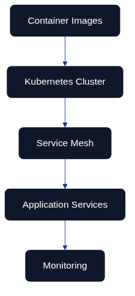
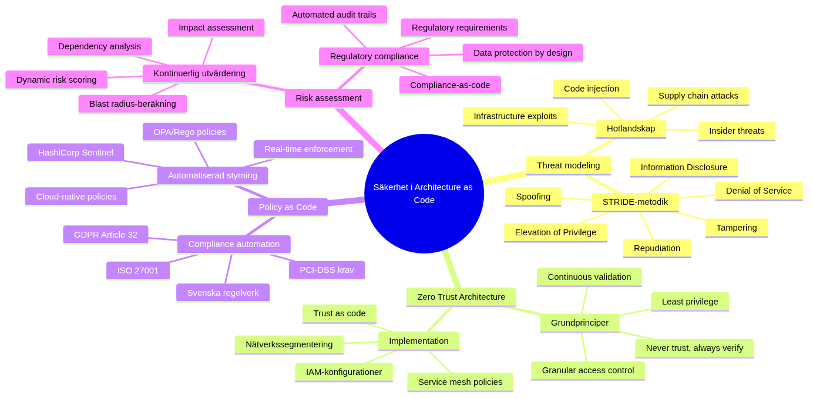

# Policy and Security as Code in Detail



*Figure 10.1 – Policy-as-Code guardrails embedded across the delivery lifecycle, from initial design through to production monitoring.*

## Introduction and context

Swedish organisations operate in one of Europe's most demanding regulatory environments. They must simultaneously honour GDPR, industry directives from Finansinspektionen, obligations from the Swedish Civil Contingencies Agency (MSB), and the relentless pace of cloud adoption. Chapter 9 introduced the security principles that anchor this book. This chapter explores how those principles are executed as policy and security automation within Architecture as Code, turning written governance into executable guardrails that scale with continuous delivery.

Policy as Code (PaC) eliminates the delay of manual approvals and paper-heavy audits. Expressing governance requirements as version-controlled code gives teams the same advantages found elsewhere in Architecture as Code: traceability, repeatability, peer review, automated testing, and rapid rollback when something goes wrong. The narrative and examples in this chapter illustrate how Swedish delivery teams can embrace PaC without sacrificing regulatory assurance.

## Evolution of security management within Architecture as Code

Security automation in Swedish enterprises has matured through four distinct phases. Understanding that journey helps stakeholders decide how assertively to modernise today.

Table: Evolution of security automation maturity within Architecture as Code programmes
| Phase | Period | Approach | Characteristics | Limitations |
|-------|--------|----------|-----------------|-------------|
| Phase 1: Manual validation | 2010–2015 | Security teams reviewed infrastructure after the fact | Auditors compared live environments with policy documents weeks after release, findings logged manually | Slow feedback loop, fragile knowledge transfer, obsolete documentation, reactive fixes |
| Phase 2: Scripted automation | 2015–2018 | Teams scripted validations in Python, Bash, and PowerShell | CI workflow checks for risky ports, missing encryption, inconsistent tags | Improved speed but duplication, drift, brittle scripts, difficult enterprise sharing |
| Phase 3: Policy engine integration | 2018–2021 | Dedicated policy engines like Open Policy Agent (OPA) | Declarative policy languages, separation of enforcement logic from application code, Kubernetes Gatekeeper | Baseline controls enforced, but limited integration with broader governance |
| Phase 4: Holistic governance frameworks | 2021–present | Integrated design-time reviews, automated approvals, runtime drift detection | OSCAL integration, Terraform state connection, CI/CD events, compliance reporting | Policy execution as always-on capability, comprehensive audit evidence |

## Policy-as-Code operating model



*Figure 10.2 – A mind map of the continuous security operating model used throughout Architecture as Code.*

Figure 10.2 summarises the mindset required to run PaC successfully. Threat modelling stays current by incorporating new attack vectors such as supply-chain compromise. Zero Trust architecture principles underpin access control and segmentation. Policy engines, risk assessment, and compliance automation all share the same data sets, allowing teams to reason about blast radius, regulatory coverage, and change velocity in one place.

## Open Policy Agent (OPA) and Rego: foundation for policy-driven security

OPA has become the de facto standard for policy automation thanks to its lightweight deployment model and expressive Rego language. The engine evaluates decisions locally, so developers can run policies during unit tests while the same rules enforce guardrails inside Kubernetes, Terraform pipelines, or API gateways.

### Architectural foundations for enterprise policy management

Swedish organisations running mission-critical platforms typically adopt three architectural patterns:

- **Decoupled evaluation:** OPA runs as a sidecar, admission controller, or CLI verifier, keeping policy logic separate from application runtimes.
- **Flexible distribution:** Agents can pull policies from signed bundles or receive push updates from central services, supporting strict change-control processes.
- **Bundle packaging:** Teams package policies, data, metadata, and signatures together, enabling atomic roll-outs and rollbacks when requirements change.

### Advanced Rego patterns for regulated workloads

Rego shines when encoding complex regulatory expectations. Teams typically model encryption rules, network segmentation, and data residency in the same policy module so that violations surface as a single report. Appendix entry [10_CODE_1](30_appendix_code_examples.md#10_code_1) contains a full example tailored for Swedish regulators. A trimmed excerpt below illustrates the structure:

```rego
package se.enterprise.security

import rego.v1

encryption_required_services := {
    "aws_s3_bucket", "aws_rds_instance", "aws_efs_file_system"
}

encryption_compliant[resource] {
    resource := input.resources[_]
    resource.type in encryption_required_services
    validate_encryption(resource)
}
```

The complete module covers encryption strength, privileged port exposure, EU residency checks, and an aggregated compliance score. The findings feed directly into CI pipelines and risk dashboards.

### Integrating policy automation into Swedish enterprises

Enterprises connect OPA to their existing tooling so that decisions are auditable end to end. Policy evaluation logs stream to SIEM platforms such as Splunk or Azure Sentinel for immutable evidence. Identity-aware proxies verify that every policy change is authorised through enterprise single sign-on. Monitoring systems trigger alerts when violations cross risk thresholds so operations teams can react before incidents escalate. These integrations make PaC feel like a first-class participant in the delivery lifecycle rather than an afterthought.

## OSCAL: Open Security Controls Assessment Language

While OPA ensures policies are enforced, OSCAL standardises how controls, evidence, and assessment data are described. Developed by NIST, OSCAL offers machine-readable formats (JSON, XML, YAML) that map requirements to actual implementations. For Architecture as Code teams, OSCAL becomes the translation layer between Terraform states, CI/CD runs, and external auditors.

### OSCAL architecture and components

OSCAL is organised into complementary models:

Table: Core OSCAL components supporting Architecture as Code compliance
| OSCAL Component | Purpose | Examples | Usage in Architecture as Code |
|-----------------|---------|----------|-------------------------------|
| Catalogues | Capture authoritative control statements from frameworks | NIST SP 800-53, GDPR articles, MSB guidelines | Foundation for organisational control baselines |
| Profiles | Tailor catalogues to organisation-specific needs | Selecting, modifying, or adding control language | Harmonise overlapping regulations, create industry-specific subsets |
| Component definitions | Describe how technical building blocks satisfy specific controls | Amazon RDS instance, AWS Network Firewall configurations | Map infrastructure modules to compliance requirements |
| System Security Plans (SSPs) | Assemble controls, components, and operational context | Complete audit documentation for a system | Single auditable document connecting requirements to implementation |

### Crafting organisation-specific profiles

Profiles help Swedish enterprises harmonise overlapping regulations. Appendix entry [10_CODE_2](30_appendix_code_examples.md#10_code_2) shows how a financial institution can import NIST controls, overlay GDPR Article 32, and incorporate MSB network guidance in one document. Parameters capture encryption algorithms, key management expectations, and other context so that auditors understand the intent behind every selection.

### Component definitions and reusable evidence

Component definitions turn infrastructure modules into reusable compliance building blocks. Appendix entry [10_CODE_3](30_appendix_code_examples.md#10_code_3) provides an example that documents Amazon RDS, Amazon S3, and AWS Network Firewall configurations. Each component maps implementation statements to control identifiers, making it straightforward to prove, for example, that storage encryption and logging are active.

### Automating System Security Plans

Once profiles and component definitions exist, teams can automate the SSP itself. Appendix entry [10_CODE_4](30_appendix_code_examples.md#10_code_4) includes a Python utility that parses Terraform, enriches it with component definitions, and emits an OSCAL-compliant SSP. The script integrates with AWS STS to stamp account identifiers and timestamps, ensuring that every generated SSP reflects the live estate.

## Implementation roadmap for Swedish delivery teams

Successful PaC programmes blend technology with process change. A staged roadmap typically includes:

1. **Policy inventory:** Catalogue existing manual controls, identify overlaps, and prioritise high-risk scenarios such as public exposure of administrative ports.
2. **Pilot automation:** Implement a thin slice of OPA policies in a non-production CI pipeline, capturing metrics on prevented misconfigurations.
3. **Evidence harmonisation:** Map policies to OSCAL catalogues and create the first organisation-specific profile so that governance teams can trace coverage.
4. **Operational integration:** Stream evaluation logs to security operations, define escalation workflows, and update service-level objectives to include policy violations.
5. **Continuous improvement:** Expand policy libraries, refactor shared modules, and review KPIs with stakeholders to ensure automation keeps pace with regulatory change.

## Key takeaways

- PaC transforms governance from a periodic activity into a continuous safety net that keeps pace with daily releases.
- OPA and Rego provide a portable, testable way to encode complex Swedish regulatory requirements.
- OSCAL links policy enforcement with audit evidence, reducing the overhead of external assessments.
- Diagrams in Figures 10.1 and 10.2 illustrate how policy guardrails span the delivery lifecycle and how capability building blocks interrelate.
- Detailed Rego, OSCAL, and automation listings live in Appendix entries [10_CODE_1](30_appendix_code_examples.md#10_code_1) to [10_CODE_4](30_appendix_code_examples.md#10_code_4) for engineers who need implementation guidance.
