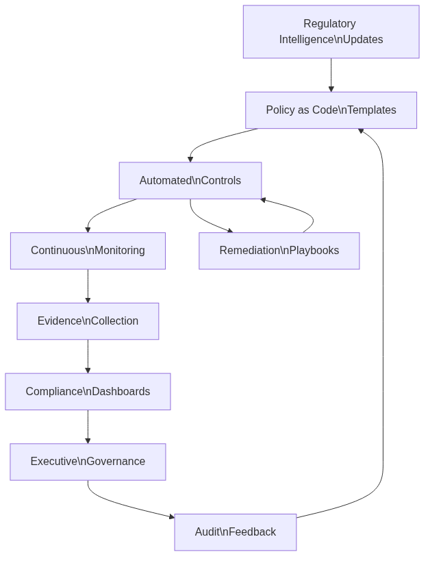

# Compliance och regelefterlevnad



Infrastructure as Code (arkitektur som kod) spelar en central roll för att möta växande compliance-krav och regulatoriska förväntningar. Som vi såg i [kapitel 11 om policy as code](11_policy_sakerhet.md), kan tekniska lösningar för automatiserad compliance betydligt förenkla och förbättra organisationers förmåga att uppfylla komplexa regelkrav. Detta kapitel fokuserar på de organisatoriska och processrelaterade aspekterna av compliance-hantering genom Infrastructure as Code (arkitektur som kod).

## AI och maskininlärning för infrastrukturarkitektur som kod-automatisering

Artificiell intelligens revolutionerar Infrastructure as Code genom intelligent automation, prediktiv skalning och självläkande system. Maskininlärningsalgoritmer analyserar historiska data för att optimera resursallokering, förutsäga fel och automatiskt justera infrastrukturkonfigurationer baserat på förändrade efterfrågemönster.

Intelligent resursoptimering använder AI för att kontinuerligt justera infrastrukturinställningar för optimal kostnad, prestanda och hållbarhet. Algoritmer kan automatiskt justera instansstorlekar, lagringskonfigurationer och nätverksinställningar baserat på realtidsanvändningsmönster och affärsmål.

Automatiserade incident response-system utnyttjar AI för att upptäcka anomalier, diagnostisera problem och implementera korrigerande åtgärder utan mänsklig intervention. Natural language processing möjliggör konversationsgränssnitt för infrastrukturhantering, vilket gör komplexa operationer tillgängliga för icke-tekniska intressenter.

## Cloud-native och serverless utveckling

Serverless computing fortsätter att utvecklas bortom enkla function-as-a-service mot omfattande serverless-arkitekturer. Infrastructure as Code måste anpassas för att hantera händelsedrivna arkitekturer, automatisk skalning och pay-per-use-prismodeller som karakteriserar serverless-plattformar.

Händelsedriven infrastruktur reagerar automatiskt på affärshändelser och systemförhållanden. Infrastrukturdefinitioner inkluderar händelseutlösare, responsmekanismer och komplex workflow-orkestrering som möjliggör reaktiv infrastruktur som anpassar sig till förändrade krav i realtid.

Edge computing-integration kräver distribuerade arkitekturhanteringsmöjligheter som hanterar latenskänsliga arbetsbelastningar, lokal databehandling och intermittent anslutning. Arkitektur som kod-verktyg måste stödja hybrid edge-cloud-arkitekturer med synkroniserad konfigurationshantering.

## Policydriven infrastruktur och styrning

Policy as Code blir allt mer sofistikerat med automatiserad compliance-kontroll, kontinuerlig styrningsverkställighet och dynamisk policyanpassning. Policyer utvecklas från statiska regler mot intelligenta riktlinjer som anpassar sig baserat på kontext, riskbedömning och affärsmål.

Automatiserade compliance-ramverk integrerar regulatoriska krav direkt i arkitektur som kod-arbetsflöden. Kontinuerlig compliance-övervakning säkerställer att arkitekturändringar bibehåller efterlevnad av säkerhetsstandarder, branschregleringar och organisatoriska policyer utan manuell intervention.

Zero-trust-arkitekturprinciper blir inbäddade i infrastrukturdefinitioner som standardpraxis. Varje komponent, anslutning och åtkomstbegäran kräver explicit verifiering och auktorisering, vilket skapar en inneboende säker infrastruktur för moderna hotlandskap.

## Kvantdatorer och nästa generations teknologier

Kvantdatorers påverkan på Infrastructure as Code kommer att kräva en grundläggande omtänkning av säkerhetsmodeller, beräkningsarkitekturer och resurshanteringsstrategier. Kvantresistent kryptografi måste integreras i infrastruktursäkerhetsramverk.

Post-kvant kryptografi-implementeringar kräver uppdaterade säkerhetsprotokoll och krypteringsmekanismer för all infrastrukturkommunikation. Arkitektur som kod-verktyg måste stödja kvantsäkra algoritmer och förbereda för övergången bort från nuvarande kryptografiska standarder.

Kvantförstärkta optimeringsalgoritmer kan lösa komplexa infrastrukturplacerings-, routing- och resursallokeringsproblem som är beräkningsintensiva för klassiska datorer. Detta öppnar möjligheter för oöverträffad infrastruktureffektivitet och kapacitet.

## Hållbarhet och grön databehandling

Miljöhållbarhet blir central övervägande för infrastrukturdesign och drift. Kolmedveten infrastrukturhantering skiftar automatiskt arbetsbelastningar till regioner med tillgänglighet för förnybar energi, optimerar för energieffektivitet och minimerar miljöpåverkan.

Integration av förnybar energi kräver dynamisk infrastrukturhantering som anpassar beräkningsarbetsbelastningar till tillgången på ren energi. Smart grid-integration och energilagringskoordinering blir integrerade delar av infrastrukturautomation.

Cirkulär ekonomi-principer tillämpade på arkitektur inkluderar automatiserad hårdvarulivscykelhantering, resursåtervinningsoptimering och avfallsreduceringsstrategier. Arkitektur som kod inkluderar hållbarhetsmetriker och miljöpåverkanshänsyn som förstklassiga bekymmer.

## Praktiska exempel

### AI-förstärkt infrastrukturoptimering

```python
# ai_optimizer.py
import tensorflow as tf
import numpy as np
from datetime import datetime, timedelta
import boto3

class InfrastrukturOptimizer:
    def __init__(self, modell_sökväg):
        self.modell = tf.keras.models.load_model(modell_sökväg)
        self.cloudwatch = boto3.client('cloudwatch')
        self.autoscaling = boto3.client('autoscaling')
    
    def förutsäg_efterfrågan(self, tidshorisont_timmar=24):
        """Förutsäg infrastrukturbehov för nästa 24 timmar"""
        nuvarande_tid = datetime.now()
        
        # Samla historiska metriker
        metriker = self.samla_historiska_metriker(
            start_tid=nuvarande_tid - timedelta(days=7),
            slut_tid=nuvarande_tid
        )
        
        # Förbered funktioner för ML-modell
        funktioner = self.förbered_funktioner(metriker, nuvarande_tid)
        
        # Generera förutsägelser
        förutsägelser = self.modell.predict(funktioner)
        
        return self.formatera_förutsägelser(förutsägelser, tidshorisont_timmar)
    
    def optimera_skalningspolicyer(self, förutsägelser):
        """Justera automatiskt autoscaling-policyer baserat på förutsägelser"""
        for asg_namn, förutsedd_belastning in förutsägelser.items():
            
            # Beräkna optimalt instansantal
            optimala_instanser = self.beräkna_optimala_instanser(
                förutsedd_belastning, asg_namn
            )
            
            # Uppdatera autoscaling-policy
            self.uppdatera_autoscaling_policy(asg_namn, optimala_instanser)
            
            # Schemalägg proaktiv skalning
            self.schemalägg_proaktiv_skalning(asg_namn, förutsedd_belastning)
```

### Serverless infrastrukturdefinition

```yaml
# serverless-infrastruktur.yml
service: intelligent-infrastruktur

provider:
  name: aws
  runtime: python3.9
  region: eu-north-1
  
  environment:
    OPTIMERINGS_TABELL: ${self:service}-optimering-${self:provider.stage}
    
  iamRoleStatements:
    - Effect: Allow
      Action:
        - autoscaling:*
        - cloudwatch:*
        - ec2:*
      Resource: "*"

functions:
  optimeraInfrastruktur:
    handler: optimizer.optimera
    events:
      - schedule: rate(15 minutes)
      - cloudwatchEvent:
          event:
            source: ["aws.autoscaling"]
            detail-type: ["EC2 Instance Terminate Successful"]
    
    reservedConcurrency: 1
    timeout: 300
    memory: 1024
    
    environment:
      MODELL_BUCKET: ${self:custom.modellBucket}

  prediktivSkalning:
    handler: predictor.förutsäg_och_skala
    events:
      - schedule: rate(5 minutes)
    
    layers:
      - ${self:custom.tensorflowLayer}
    
    memory: 3008
    timeout: 900

  kostnadsOptimizer:
    handler: kostnad.optimera
    events:
      - schedule: cron(0 2 * * ? *)  # Dagligen kl 02:00
    
    environment:
      KOSTNADSGRÄNS: 1000
      OPTIMERINGSNIVÅ: aggressiv

  grönDatabehandling:
    handler: hållbarhet.optimera_för_kol
    events:
      - schedule: rate(30 minutes)
      - eventBridge:
          pattern:
            source: ["renewable-energy-api"]
            detail-type: ["Energy Forecast Update"]
```

### Kvantsäker säkerhetsimplementering

```hcl
# kvantsäker-infrastruktur.tf
terraform {
  required_providers {
    aws = {
      source  = "hashicorp/aws"
      version = "~> 5.0"
    }
    tls = {
      source  = "hashicorp/tls"
      version = "~> 4.0"
    }
  }
}

# Post-kvant kryptografi för TLS-anslutningar
resource "tls_private_key" "kvantsäker" {
  algorithm = "ECDSA"
  ecdsa_curve = "P384"  # Kvantresistent kurva
}

resource "aws_acm_certificate" "kvantsäker" {
  private_key      = tls_private_key.kvantsäker.private_key_pem
  certificate_body = tls_self_signed_cert.kvantsäker.cert_pem
  
  lifecycle {
    create_before_destroy = true
  }
  
  tags = {
    Name = "Kvantsäkert Certifikat"
    SäkerhetsNivå = "Post-Kvant"
  }
}

# KMS-nycklar med kvantresistenta algoritmer
resource "aws_kms_key" "kvantsäker" {
  description = "Kvantsäker krypteringsnyckel"
  key_usage   = "ENCRYPT_DECRYPT"
  key_spec    = "SYMMETRIC_DEFAULT"
  
  # Använd kvantresistent nyckelderivation
  key_rotation_enabled = true
  
  tags = {
    KvantSäker = "true"
    Algoritm   = "AES-256-GCM"
  }
}

# Kvantsäkert VPC med förstärkt säkerhet
resource "aws_vpc" "kvantsäker" {
  cidr_block           = "10.0.0.0/16"
  enable_dns_hostnames = true
  enable_dns_support   = true
  
  # Aktivera kvantsäker nätverkshantering
  tags = {
    Name        = "Kvantsäkert VPC"
    Kryptering  = "Obligatorisk"
    Protokoll   = "TLS1.3-PQC"
  }
}
```

## Sammanfattning


Den moderna arkitektur som kod-metodiken representerar framtiden för infrastrukturhantering i svenska organisationer.
Framtida Infrastructure as Code-utveckling kommer att drivas av AI-automation, serverless-arkitekturer, beredskap för kvantdatorer och hållbarhetskrav. Organisationer måste proaktivt investera i nya teknologier, utveckla kvantsäkra säkerhetsstrategier och integrera miljöhänsyn i infrastrukturplanering.

Framgång kräver kontinuerligt lärande, strategisk teknologiadoption och långsiktig vision för infrastrukturutveckling. Som vi har sett genom bokens progression från [grundläggande principer](02_grundlaggande_principer.md) till dessa avancerade framtida teknologier, utvecklas Infrastructure as Code kontinuerligt för att möta nya utmaningar och möjligheter.

Svenska organisationer som investerar i dessa emerging technologies och bibehåller krypto-agilitet kommer att vara välpositionerade för framtida teknologiska störningar. Integration av dessa teknologier kräver både teknisk expertis och organisatorisk anpassningsförmåga som diskuteras i [kapitel 17 om organisatorisk förändring](17_organisatorisk_forandring.md).

## Källor och referenser

- IEEE Computer Society. "Quantum Computing Impact on Infrastructure." IEEE Quantum Computing Standards.
- Green Software Foundation. "Sustainable Infrastructure Patterns." Green Software Principles.
- NIST. "Post-Quantum Cryptography Standards." National Institute of Standards and Technology.
- Cloud Native Computing Foundation. "Future of Cloud Native Infrastructure." CNCF Research.
- Gartner Research. "Infrastructure and Operations Technology Trends 2024." Gartner IT Infrastructure Reports.