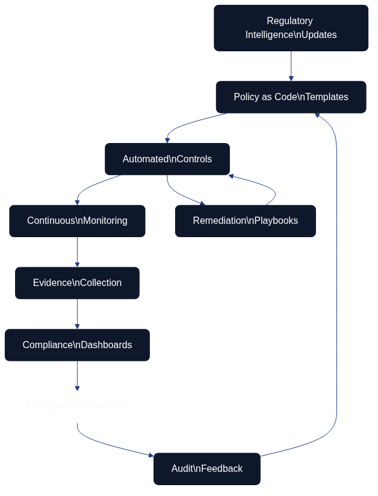

# Compliance and Regulatory Adherence



Infrastructure as Code spelar a central roll to möta växande efterlevnadskrav and regulatoriska forväntningar. Which vi såg in [chapters 11 about policy as code](11_policy_sakerhet.md), can tekniska lösningar for automatiserad efterlevnad betydligt forenkla and forbättra organisationers formåga to uppfylla komplexa regelkrav. This chapters fokuserar at the organizational and processrelaterade aspekterna of efterlevnadshantering through Infrastructure as Code.

## AI and maskininlärning for infrastrukturarchitecture as code-automation

Artificiell intelligens revolutionerar Infrastructure as Code through intelligent automation, prediktiv skalning and självläkande systems. Maskininlärningsalgoritmer analyserar historiska data to optimera resursallokering, forutsäga fel and automatically justera infraStructurekonfigurationer baserat at forändrade efterfrågemönster.

Intelligent resursoptimering använder AI to kontinuerligt justera infraStructureinställningar for optimal kostnad, prestanda and hållbarhet. Algoritmer can automatically justera instansstorlekar, lagringskonfigurationer and nätverksinställningar baserat at realtidsanvändningsmönster and affärsmål.

Automatiserade incident response-systems utnyttjar AI to upptäcka anomalier, diagnostisera problem and implementera korrigerande åtgärder utan mänsklig intervention. Natural language processing enables konversationsgränssnitt for infraStructurehantering, which gör komplexa operationer togängliga for icke-tekniska intressenter.

## Cloud-native and serverless utveckling

Serverless computing fortsätter to utvecklas bortom enkla function-as-a-service mot comprehensive serverless-arkitekturer. Architecture as Code must anpassas to hantera händelsedrivna arkitekturer, automatisk skalning and pay-per-use-prismodor as karakteriserar serverless-plattformar.

Händelsedriven architecture reagerar automatically at affärshändelser and systemforhållanden. Arkitekturdefinitioner includes händelseutlösare, responsmekanismer and komplex workflow-orkestrering as enables reaktiv architecture as anpassar itself to forändrade krav in realtid.

Edge computing-integration requires distribuerade arkitekturhanteringsmöjligheter as hanterar latenskänsliga arbetsbelastningar, lokal databehandling and intermittent anslutning. Architecture as Code-verktyg must stödja hybrid edge-cloud-arkitekturer with synkroniserad konfigurationshantering.

## Policydriven infrastruktur and styrning

Policy as Code blir all mer sofistikerat with automatiserad compliance-kontroll, kontinuerlig styrningsverkställighet and dynamisk policyanpassning. Policyer utvecklas from statiska rules mot intelligenta riktlinjer as anpassar itself baserat at kontext, riskbedömning and affärsmål.

Automatiserade compliance-ramverk integrerar regulatoriska krav direkt in Architecture as Code-arbetsflöden. Kontinuerlig compliance-övervakning ensures arkitekturändringar bibehåller efterlevnad of säkerhetsstandarder, branschregleringar and organizational policyer utan manuell intervention.

Zero-trust-arkitekturprinciper blir inbäddade in infraStructuredefinitioner as standardpraxis. each komponent, anslutning and åtkomstbegäran requires explicitly verification and auktorisering, which creates a inneboende säker infrastructure for moderna hotlandskap.

## Kvantdatorer and nästa generations technologies

Kvantdatorers påverkan at Infrastructure as Code kommer to kräva a Fundamental omtänkning of säkerhetsmodor, beräkningsarkitekturer and resurshanteringsstrategier. Kvantresistent kryptografi must integreras in infraStructuresäkerhetsramverk.

Post-kvant kryptografi-implementeringar requires uppdaterade säkerhetsprotokoll and krypteringsmekanismer for all infraStructurekommunikation. Architecture as Code-verktyg must stödja kvantsäkra algoritmer and forbereda for övergången bort from nuvarande kryptografiska standarder.

Kvantforstärkta optimeringsalgoritmer can lösa komplexa infraStructureplacerings-, routing- and resursallokeringsproblem as is beräkningsintensiva for klassiska datorer. This öppnar möjligheter for oöverträffad infraStructureeffektivitet and kapacitet.

## Hållbarhet and grön databehandling

Miljöhållbarhet blir central övervägande for infraStructuredesign and drift. Kolwithveten infraStructurehantering skiftar automatically arbetsbelastningar to regioner with togänglighet for fornybar energi, optimerar for energieffektivitet and minimizes miljöpåverkan.

Integration of fornybar energi requires dynamisk infraStructurehantering as anpassar beräkningsarbetsbelastningar to togången at ren energi. Smart grid-integration and energilagringskoordinering blir integrerade parts of infraStructureautomation.

Cirkulär ekonomi-principles toämpade at architecture includes automatiserad hårdvarulivscykelhantering, resursåtervinningsoptimering and avfallsreduceringsstrategier. Architecture as Code includes hållbarhetsmetriker and miljöpåverkanshänsyn as forstklassiga bekymmer.

## Praktiska example

### AI-forstärkt infrastrukturoptimering

```python
# ai_optimizer.py
import tensorflow as tf
import numpy as np
from datetime import datetime, timedelta
import boto3

class InfrastrukturOptimizer:
    def __init__(self, modell_sökväg):
        self.modell = tf.keras.models.load_model(modell_sökväg)
        self.cloudwatch = boto3.client('cloudwatch')
        self.autoscaling = boto3.client('autoscaling')
    
    def förutsäg_efterfrågan(self, tidshorisont_timmar=24):
        """Förutsäg infrastrukturbehov för nästa 24 timmar"""
        nuvarande_tid = datetime.now()
        
        # Samla historiska metriker
        metriker = self.samla_historiska_metriker(
            start_tid=nuvarande_tid - timedelta(days=7),
            slut_tid=nuvarande_tid
        )
        
        # Förbered funktioner för ML-modell
        funktioner = self.förbered_funktioner(metriker, nuvarande_tid)
        
        # Generera förutsägelser
        förutsägelser = self.modell.predict(funktioner)
        
        return self.formatera_förutsägelser(förutsägelser, tidshorisont_timmar)
    
    def optimera_skalningspolicyer(self, förutsägelser):
        """Justera automatically autoscaling-policyer baserat at förutsägelser"""
        for asg_namn, förutsedd_belastning in förutsägelser.items():
            
            # Beräkna optimalt instansantal
            optimala_instanser = self.beräkna_optimala_instanser(
                förutsedd_belastning, asg_namn
            )
            
            # Uppdatera autoscaling-policy
            self.uppdatera_autoscaling_policy(asg_namn, optimala_instanser)
            
            # Schemalägg proaktiv skalning
            self.schemalägg_proaktiv_skalning(asg_namn, förutsedd_belastning)
```

### Serverless infrastrukturdefinition

```yaml
# serverless-infrastruktur.yml
service: intelligent-infrastruktur

provider:
  name: aws
  runtime: python3.9
  region: eu-north-1
  
  environment:
    OPTIMERINGS_TABELL: ${self:service}-optimering-${self:provider.stage}
    
  iamRoleStatements:
    - Effect: Allow
      Action:
        - autoscaling:*
        - cloudwatch:*
        - ec2:*
      Resource: "*"

functions:
  optimeraInfrastruktur:
    handler: optimizer.optimera
    events:
      - schedule: rate(15 minutes)
      - cloudwatchEvent:
          event:
            source: ["aws.autoscaling"]
            detail-type: ["EC2 Instance Terminate Successful"]
    
    reservedConcurrency: 1
    timeout: 300
    memory: 1024
    
    environment:
      MODELL_BUCKET: ${self:custom.modellBucket}

  prediktivSkalning:
    handler: predictor.förutsäg_och_skala
    events:
      - schedule: rate(5 minutes)
    
    layers:
      - ${self:custom.tensorflowLayer}
    
    memory: 3008
    timeout: 900

  kostnadsOptimizer:
    handler: kostnad.optimera
    events:
      - schedule: cron(0 2 * * ? *)  # Dagligen kl 02:00
    
    environment:
      KOSTNADSGRÄNS: 1000
      OPTIMERINGSNIVÅ: aggressiv

  grönDatabehandling:
    handler: hållbarhet.optimera_för_kol
    events:
      - schedule: rate(30 minutes)
      - eventBridge:
          pattern:
            source: ["renewable-energy-api"]
            detail-type: ["Energy Forecast Update"]
```

### Kvantsäker säkerhetsimplementering

```hcl
# kvantsäker-infrastruktur.tf
terraform {
  required_providers {
    aws = {
      source  = "hashicorp/aws"
      version = "~> 5.0"
    }
    tls = {
      source  = "hashicorp/tls"
      version = "~> 4.0"
    }
  }
}

# Post-kvant kryptografi för TLS-anslutningar
resource "tls_private_key" "kvantsäker" {
  algorithm = "ECDSA"
  ecdsa_curve = "P384"  # Kvantresistent kurva
}

resource "aws_acm_certificate" "kvantsäker" {
  private_key      = tls_private_key.kvantsäker.private_key_pem
  certificate_body = tls_self_signed_cert.kvantsäker.cert_pem
  
  lifecycle {
    create_before_destroy = true
  }
  
  tags = {
    Name = "Kvantsäkert Certifikat"
    SäkerhetsNivå = "Post-Kvant"
  }
}

# KMS-nycklar med kvantresistenta algoritmer
resource "aws_kms_key" "kvantsäker" {
  description = "Kvantsäker krypteringsnyckel"
  key_usage   = "ENCRYPT_DECRYPT"
  key_spec    = "SYMMETRIC_DEFAULT"
  
  # Använd kvantresistent nyckelderivation
  key_rotation_enabled = true
  
  tags = {
    KvantSäker = "true"
    Algoritm   = "AES-256-GCM"
  }
}

# Kvantsäkert VPC med förstärkt säkerhet
resource "aws_vpc" "kvantsäker" {
  cidr_block           = "10.0.0.0/16"
  enable_dns_hostnames = true
  enable_dns_support   = true
  
  # Aktivera kvantsäker nätverkshantering
  tags = {
    Name        = "Kvantsäkert VPC"
    Kryptering  = "Obligatorisk"
    Protokoll   = "TLS1.3-PQC"
  }
}
```

## Summary


The moderna Architecture as Code-metodiken representerar framtiden for infraStructurehantering in svenska organisationer.
Framtida Infrastructure as Code-utveckling kommer to drivas of AI-automation, serverless-arkitekturer, beredskap for kvantdatorer and hållbarhetskrav. Organisationer must proaktivt investera in new technologies, utveckla kvantsäkra säkerhetsstrategier and integrera miljöhänsyn in infraStructureplanering.

success requires kontinuerligt lärande, strategisk teknologiadoption and långsiktig vision for infraStructureutveckling. Which vi har sett genAbout the Books progression from [Fundamental principles](02_grundlaggande_principer.md) to These advanced framtida technologies, utvecklas Infrastructure as Code kontinuerligt to möta new Challenges and möjligheter.

Svenska organisationer as investerar in These emerging technologies and bibehåller krypto-agilitet kommer to vara välpositionerade for framtida teknologiska disruptions. Integration of These technologies requires both technical expertis and organisatorisk anpassningsformåga as diskuteras in [chapters 17 about organisatorisk change](17_organisatorisk_forandring.md).

## Sources and referenser

- IEEE Computer Society. "Quantum Computing Impact on Infrastructure." IEEE Quantum Computing Standards.
- Green Software Foundation. "Sustainable Infrastructure Patterns." Green Software Principles.
- NIST. "Post-Quantum Cryptography Standards." National Institute of Standards and Technology.
- Cloud Native Computing Foundation. "Future of Cloud Native Infrastructure." CNCF Research.
- Gartner Research. "Infrastructure and Operations Technology Trends 2024." Gartner IT Infrastructure Reports.