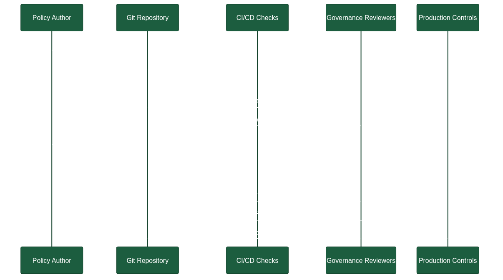

# Governance as Code

## Overview

Governance as Code extends the principles of Infrastructure as Code to the policies, approval flows, and organizational guardrails that keep architecture and delivery aligned with strategic intent. By expressing governance artifacts in version-controlled repositories, teams gain transparency, traceability, and automation opportunities while still respecting compliance and risk requirements.

## Implementing Approval Processes with Pull Requests

- **Design branching strategies for governance artifacts.** Maintain dedicated branches for policy drafts, review, and production-ready governance definitions. This mirrors software development workflows and keeps governance states explicit.
- **Use pull requests as approval gates.** Require reviews from architecture leads, security officers, and business stakeholders before merging changes to governance code. Pull-request templates can capture mandatory information such as risk assessments, policy mappings, and rollout plans.
- **Automate checks in CI pipelines.** Validate governance definitions using policy-as-code tools, schema validations, and automated tests that ensure guardrails remain intact. Only merges that pass automated checks and human approvals reach the main branch.
- **Leverage GitHub environments and branch protection.** Configure mandatory status checks, signed commits, and review requirements to enforce governance controls directly within the repository.
- **Document decision context in the repository.** Link pull requests to Architecture Decision Records (ADRs) to capture rationale, business impact, and audit trails in a single system of record.

## Navigating Competency Gaps During Transition

- **Map existing responsibilities to governance roles.** Identify which stakeholders currently approve policies, manage risk, or oversee compliance, and define how those responsibilities translate into code ownership and review rights.
- **Invest in targeted training.** Offer workshops on Git fundamentals, pull-request etiquette, policy-as-code tooling, and secure coding practices to help traditional governance professionals adapt to code-centric workflows.
- **Adopt pairing and mentoring structures.** Combine governance experts with experienced developers or platform engineers to co-author governance artifacts, transferring knowledge while maintaining policy fidelity.
- **Stage the transition.** Begin with low-risk governance components, gather feedback, and iteratively expand to more critical controls as confidence grows. Use retrospectives to capture lessons learned and adjust enablement plans.
- **Communicate new value streams.** Highlight faster approval cycles, improved auditability, and better collaboration to secure stakeholder buy-in and mitigate resistance stemming from the competency gap.

## Tooling to Enable Non-Developers

- **Low-code policy editors.** Provide graphical interfaces that generate policy code (for example, Rego or Sentinel) so policy specialists can define rules without writing syntax manually.
- **Template-driven pull requests.** Supply structured templates and form-based inputs that convert stakeholder submissions into well-formed governance updates.
- **Documentation-as-code portals.** Publish rendered documentation from the repository to user-friendly portals or knowledge bases so non-technical stakeholders can review governance changes without reading raw code.
- **ChatOps integrations.** Connect collaboration tools like Microsoft Teams or Slack to repository workflows, enabling users to trigger governance checks, receive review notifications, and approve changes from familiar interfaces.
- **Automated policy explainers.** Integrate tools that translate policy code into natural language summaries, reducing dependency on programming skills while preserving the authoritative source in code.

## Key Takeaways

Governance as Code modernizes policy management by placing guardrails alongside the systems they protect. Using pull requests to orchestrate approvals strengthens auditability and responsiveness, while deliberate enablement, training, and supportive tooling ensure that governance professionals can thrive in a code-based ecosystem.

## Sources

Sources:
- [GitHub Docs – About protected branches](https://docs.github.com/en/repositories/configuring-branches-and-merges-in-your-repository/about-protected-branches)
- [Open Policy Agent – Policy as Code Overview](https://www.openpolicyagent.org/docs/latest/)
- [Thoughtworks Technology Radar – Governance as Code](https://www.thoughtworks.com/radar/techniques/governance-as-code)
