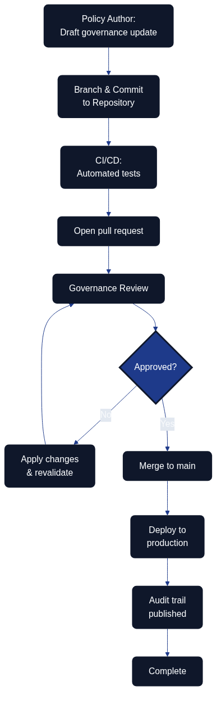

# Governance as Code {#governance-as-code}

## Overview

Figure 11.1 illustrates how policy authors, reviewers, automation, production controls, and the audit portal coordinate through a single repository to evolve governance. Governance as Code extends the principles of Infrastructure as Code to the policies, approval flows, and organisational guardrails that keep architecture and delivery aligned with strategic intent. By expressing governance artefacts in version-controlled repositories, teams gain transparency, traceability, and automation opportunities while still respecting compliance and risk requirements. The shared workflow also keeps an audit trail that shows exactly which checks ran, who approved each change, and when compliance evidence was published.

### Assure once, comply many

Architecture as Code relies on a single, authoritative set of controls that can be mapped repeatedly to different external duties. This **assure once, comply many** principle states that governance guardrails are expressed, tested, and evidenced once, then re-used across frameworks such as ISO 27001, SOC 2, NIST 800-53, GDPR, and internal control catalogues. By codifying approval policies, data residency rules, and risk mitigations in the same repository, organisations avoid duplicating assessments for every regulator. Instead, they capture a dependable stream of artefacts that downstream teams can reference in [Policy and Security as Code in Detail](10_policy_and_security.md), [Security Fundamentals for Architecture as Code](09_security_fundamentals.md), and [Compliance and Regulatory Adherence](12_compliance.md). The result is consistent decision-making, reduced audit fatigue, and a shared language for evaluating governance debt.

## Implementing Approval Processes with Pull Requests

Designing branching strategies for governance artefacts keeps each state explicit. Dedicated draft, review, and production branches mirror software development workflows so stakeholders can follow the journey from proposal to adoption.

| Governance Workflow Stage | Mechanism | Stakeholders | Automated Controls | Outcome |
|---------------------------|-----------|--------------|-------------------|---------|
| Draft and proposal | Feature branches | Policy authors, governance owners | Schema validation, syntax checks | Explicit state for work-in-progress changes |
| Review and approval | Pull requests with templates | Architecture leads, security officers, business sponsors | Policy-as-code validations, required reviewers, signed commits | Formal approval gates with risk assessments and policy mappings |
| Validation and testing | CI pipeline execution | Automated systems, compliance leads | Policy-as-code validations, schema tests, guardrail verifications | Pre-merge quality assurance |
| Documentation and traceability | ADR linking | Architecture teams, audit teams | Automated documentation generation, audit trail capture | Business rationale and audit trail beside code |
| Production deployment | Protected main branch merge | Authorised maintainers | Branch protections, deployment gates | Fully vetted changes reaching production |

## Navigating Competency Gaps During Transition

Successful adoption begins with mapping existing responsibilities to the new repository roles. Governance owners, risk managers, and compliance leads gain explicit ownership of folders, policies, and review rights so their expertise still anchors decision-making. That foundation makes it easier to tailor enablement activities to each group’s knowledge gaps.

Targeted training accelerates confidence. Workshops that cover Git fundamentals, pull-request etiquette, policy-as-code tooling, and secure coding practices help traditional governance professionals feel comfortable with day-to-day repository work. Pairing or mentoring programmes keep the momentum going by matching domain experts with experienced engineers who can translate policy intent into reliable code implementations.

Teams should stage the transition carefully. Starting with low-risk governance components allows the organisation to gather feedback and fine-tune the approach before scaling to critical controls. Regular retrospectives surface lessons learned, while continual communication reinforces the value of faster approval cycles, stronger auditability, and cross-functional collaboration.

## Tooling to Enable Non-Developers

Empowering non-developers starts with approachable policy editors that generate Rego, Sentinel, or similar policy languages from guided forms. These low-code experiences keep the code authoritative while lowering the barrier to entry for policy specialists. Template-driven pull requests extend that support by turning stakeholder submissions into structured governance updates that already meet repository standards.

Documentation-as-code portals and ChatOps integrations keep contributors in their preferred environments. Rendered documentation provides a friendly view of pending changes, while Microsoft Teams or Slack integrations surface review notifications, allow approvals, and trigger governance checks without forcing users into the terminal. Automated policy explainers complete the toolkit by translating code into natural language summaries, giving decision makers clarity without diluting the precision of code-based guardrails.

## Key Takeaways

Governance as Code modernises policy management by placing guardrails alongside the systems they protect. Using pull requests to orchestrate approvals strengthens auditability and responsiveness, while deliberate enablement, training, and supportive tooling ensure that governance professionals can thrive in a code-based ecosystem.

## Governance and Security Controls as Code Backlog

Delivery teams can now translate the guidance across [Security Fundamentals](09_security_fundamentals.md), [Security Patterns](09b_security_patterns.md), and [Soft "as code" Interplay](23_soft_as_code_interplay.md) into concrete backlog items. The sequence below aligns policy-as-code automation with secure Terraform state backends for AWS, Azure, and Google Cloud whilst capturing the evidence expected by governance forums.

| Sequence | Work Item | Description | Acceptance Tests | Documentation Tasks | Definition of Done Notes |
|----------|-----------|-------------|------------------|---------------------|---------------------------|
| 1 | Establish cross-cloud baseline | Stand up a governance repository folder that defines remote backend standards, policy identifiers, and shared Terraform module interfaces so every workspace references a uniform catalogue. | - Pipeline lints fail if a workspace backend deviates from the approved module signature. - Rego or Sentinel policies assert that state storage declares encryption, locking, and logging toggles before plans reach apply. - Unit tests render sample backends for each cloud and confirm schema validation passes. | Update governance runbook introduction to reference the backlog folder and document how new services request onboarding to the state standard. | Definition of Done (DoD) captures percentage of portfolios adopting the module plus number of policy exceptions raised for remote state. |
| 2 | Harden AWS state storage | Deliver a Terraform module for Amazon S3 with DynamoDB state locking, customer-managed KMS keys, and AWS IAM roles separated for plan, apply, and audit duties. Gate merges with policy-as-code checks. | - Integration test provisions the backend and asserts S3 encryption and DynamoDB locking via `aws` CLI. - Policy engine blocks plans where KMS key rotation is disabled or audit role lacks read-only scope. - Terratest suite verifies automation roles cannot delete or version-rewind state objects. | Extend the security runbook with AWS backend diagrams and link alert playbooks for S3 access anomalies. | DoD notes record encryption key rotation cadence, number of workspaces migrated, and outstanding AWS IAM deviations. |
| 3 | Harden Azure state storage | Ship an Azure Storage backend module with container soft-delete, private endpoints, and RBAC roles that enforce operator separation. Sentinel or OPA policies provide the validation gate. | - Azure CLI tests confirm storage accounts enforce HTTPS, encryption with customer-managed keys, and blob leases. - Policy-as-code evaluation fails when pipelines omit network rules or assign Contributor roles to human identities. - Pipeline checks ensure Terraform service principals rotate credentials automatically. | Publish Azure-specific operational procedures and embed hyperlinks to Azure Monitor workbooks tracking backend access. | DoD lists coverage of production subscriptions, number of private endpoint deployments, and unresolved RBAC findings. |
| 4 | Harden Google Cloud state storage | Create a module for Google Cloud Storage with uniform bucket-level access, versioning, CMEK integration, and service account separation enforced by policy checks. | - `gcloud` based tests confirm CMEK enforcement, object versioning, and bucket retention policies. - Policy engine denies plans if service accounts lack workload identity federation or logging sinks are disabled. - Automated tests simulate break-glass workflows and verify approval audit trails. | Add Google Cloud runbook sections mapping state buckets to governance identifiers and link Security Command Centre alerts. | DoD reports percentage of GCP projects onboarded, CMEK rotation success rate, and open findings from policy evaluation. |
| 5 | Measure governance coverage | Aggregate evidence from all backends into governance dashboards, exposing adoption metrics, exception registers, and automated policy outcomes for auditors. | - Automated tests confirm metric exports populate dashboards within reporting SLAs. - Regression suite validates that exception workflows require multi-party approval. - Synthetic audits replay sample evidence packs to verify traceability. | Update governance reporting pack templates with new dashboard screenshots and instructions for quarterly attestation. | DoD records governance coverage percentage, active exceptions by provider, and time-to-remediate averages for failed policy checks. |

## Sources

Sources:
- [GitHub Docs – About protected branches](https://docs.github.com/en/repositories/configuring-branches-and-merges-in-your-repository/managing-protected-branches/about-protected-branches)
- [Open Policy Agent – Policy as Code Overview](https://www.openpolicyagent.org/docs/latest/)
- [Thoughtworks Technology Radar – Governance as Code](https://www.thoughtworks.com/radar/techniques/governance-as-code)
