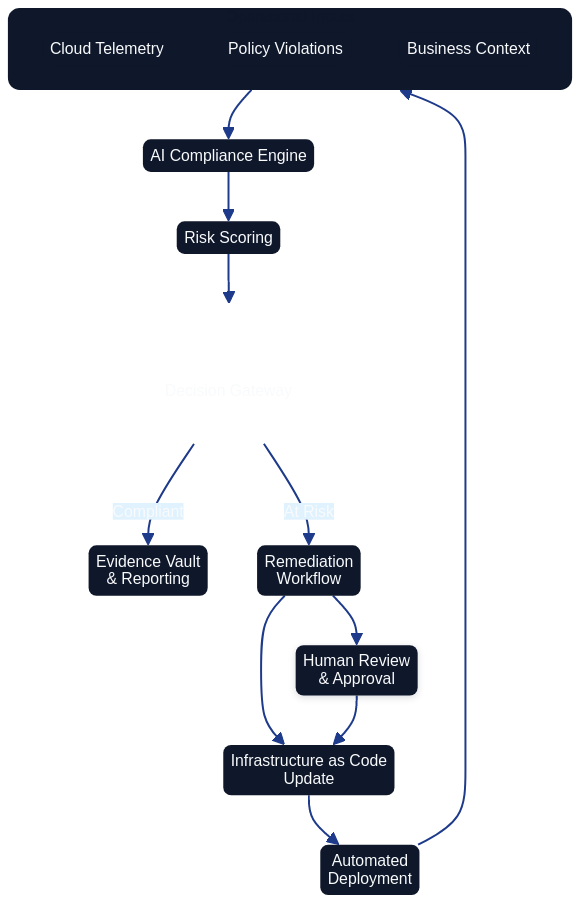
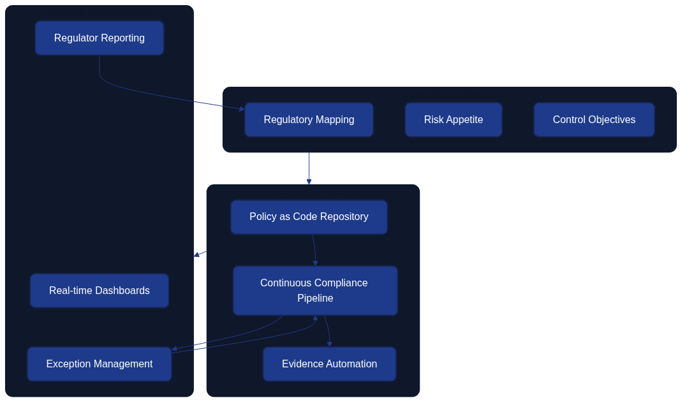

# Compliance and Regulatory Adherence


*Figure 12.1 illustrates how regulatory intelligence flows into policy templates, automated controls, monitoring, evidence collection, and governance feedback loops.*

Architecture as Code is central to meeting the expanding scope of compliance requirements and regulatory expectations. As introduced in [Chapter 10 on policy and security](10_policy_and_security.md), codified policies allow teams to translate legislation into repeatable controls. Figure 12-1 shows how that translation depends on a closed feedback loop. This chapter focuses on the organisational and process-oriented aspects that keep this loop healthy in large-scale environments.

| Compliance Loop Stage | Activities | Outputs | Feedback Mechanism |
|----------------------|------------|---------|-------------------|
| Regulatory intelligence | Monitor legislation updates, interpret regulatory changes, map requirements | Updated compliance requirements, policy mapping documents | Governance teams receive regulator feedback and audit findings |
| Policy template creation | Codify regulations as policy-as-code templates, define automated controls | Executable policy definitions, control baselines | Policy effectiveness metrics inform template refinements |
| Automated control execution | Deploy policies through CI/CD, enforce guardrails, validate configurations | Compliant infrastructure states, policy violation alerts | Real-time monitoring detects drift and non-compliance |
| Monitoring and evidence collection | Continuous compliance scanning, audit log aggregation, metrics gathering | Compliance dashboards, audit trails, evidence packages | Automated evidence for audits, compliance status reports |
| Governance reinforcement | Audit reviews, risk assessments, improvement initiatives | Updated policies, remediation plans, training programmes | Loop closes as governance informs next regulatory intelligence cycle |

## AI and Machine Learning for Infrastructure Automation



*Figure 12.2 demonstrates the feedback loop between telemetry, the AI compliance engine, automated remediation, and human oversight that keeps regulatory posture current.*

Artificial intelligence is transforming Architecture as Code with intelligent automation, predictive scaling, and self-healing systems. Machine learning models analyse operational data to optimise resource allocation, forecast failures, and adjust configurations before service levels are breached. Figure 12.2 highlights a practical control flow: telemetry and policy violations feed an AI compliance engine, which scores risk and decides whether automated remediation or human intervention is appropriate. Infrastructure as Code updates then redeploy compliant baselines, ensuring the organisation stays aligned with regulatory expectations.

## Requirements Traceability and Validation


*Figure 12.3 links high-level compliance requirements to functional controls, Infrastructure as Code artefacts, and verification activities.*

Compliance programmes rely on demonstrable traceability between regulatory statements and the technical controls that satisfy them. Figure 12.3 documents that traceability: business, compliance, performance, and cost requirements flow into specific functional controls such as encryption, network segmentation, audit logging, and automated scaling. Those controls are implemented through Terraform configuration and validated by targeted test suites, compliance scanners, and cost analysis. Maintaining this map ensures that every requirement is implemented, tested, and evidenced before auditors ask for proof.

## Cloud-native and Serverless Development

Serverless computing has moved beyond function-as-a-service into comprehensive event-driven architectures. Architecture as Code must represent triggers, response mechanisms, and orchestrated workflows that adapt to real-time business events. Edge computing introduces latency-sensitive workloads and intermittent connectivity, making coordinated configuration management essential across hybrid edge-cloud environments. Tooling must therefore support declarative policies for distributed deployments, data gravity, and dynamic routing.

## Policy-driven Infrastructure and Governance



*Figure 12.4 visualises how governance strategy translates into automated controls and measurable outcomes.*

Policy as Code continues to mature with automated control enforcement, continuous compliance monitoring, and dynamic policy adaptation. Strategy teams map regulatory goals and risk appetite, policy repositories turn those inputs into executable controls, and compliance pipelines provide dashboards, exception handling, and regulator-ready reporting. Figure 12.4 shows how exceptions loop back into the pipeline for remediation and how regulator feedback informs the next iteration of the governance strategy.

## Quantum Computing and Next-generation Technologies

Quantum computing will require a rethink of security models, cryptography, and resource management strategies. Post-quantum cryptography standards must be integrated into infrastructure security frameworks, and Architecture as Code definitions must be ready to rotate to quantum-resistant algorithms. Quantum-assisted optimisation algorithms will help solve complex placement, routing, and resource allocation problems that are computationally expensive for classical systems, improving efficiency and resilience.

## Sustainability and Green Computing

Environmental sustainability is a core consideration for infrastructure design and operations. Carbon-aware workload placement shifts compute to regions with renewable energy availability, optimises for energy efficiency, and minimises environmental impact. Architecture as Code should capture lifecycle management, recycling strategies, and sustainability metrics so that green objectives are validated alongside functional requirements.

## Practical Examples

### AI-augmented Infrastructure Optimisation

```python
# ai_optimizer.py
import tensorflow as tf
import numpy as np
from datetime import datetime, timedelta
import boto3

class InfrastructureOptimizer:
    def __init__(self, model_path):
        self.model = tf.keras.models.load_model(model_path)
        self.cloudwatch = boto3.client('cloudwatch')
        self.autoscaling = boto3.client('autoscaling')

    def forecast_demand(self, horizon_hours=24):
        """Forecast infrastructure demand for the next 24 hours."""
        current_time = datetime.now()

        # Collect historical metrics
        metrics = self.collect_historical_metrics(
            start_time=current_time - timedelta(days=7),
            end_time=current_time
        )

        # Prepare features for the ML model
        features = self.prepare_features(metrics, current_time)

        # Generate predictions
        predictions = self.model.predict(features)

        return self.format_predictions(predictions, horizon_hours)

    def optimise_scaling_policies(self, predictions):
        """Automatically adjust Auto Scaling policies based on predictions."""
        for asg_name, predicted_load in predictions.items():

            # Calculate the optimal instance count
            optimal_instances = self.calculate_optimal_instances(
                predicted_load, asg_name
            )

            # Update the Auto Scaling policy
            self.update_autoscaling_policy(asg_name, optimal_instances)

            # Schedule proactive scaling actions
            self.schedule_proactive_scaling(asg_name, predicted_load)
```

### Serverless Infrastructure Definition

```yaml
# serverless-infrastructure.yml
service: intelligent-infrastructure

provider:
  name: aws
  runtime: python3.9
  region: eu-north-1

  environment:
    OPTIMISATION_TABLE: ${self:service}-optimisation-${self:provider.stage}

  iamRoleStatements:
    - Effect: Allow
      Action:
        - autoscaling:*
        - cloudwatch:*
        - ec2:*
      Resource: "*"

functions:
  optimiseInfrastructure:
    handler: optimizer.optimise
    events:
      - schedule: rate(15 minutes)
      - cloudwatchEvent:
          event:
            source: ["aws.autoscaling"]
            detail-type: ["EC2 Instance Terminate Successful"]

    reservedConcurrency: 1
    timeout: 300
    memory: 1024

    environment:
      MODEL_BUCKET: ${self:custom.modelBucket}

  predictiveScaling:
    handler: predictor.forecast_and_scale
    events:
      - schedule: rate(5 minutes)

    layers:
      - ${self:custom.tensorflowLayer}

    memory: 3008
    timeout: 900

  costOptimiser:
    handler: cost.optimise
    events:
      - schedule: cron(0 2 * * ? *)  # Daily at 02:00

    environment:
      COST_THRESHOLD: 1000
      OPTIMISATION_LEVEL: aggressive

  greenComputing:
    handler: sustainability.optimise_for_carbon
    events:
      - schedule: rate(30 minutes)
      - eventBridge:
          pattern:
            source: ["renewable-energy-api"]
            detail-type: ["Energy Forecast Update"]
```

### Quantum-safe Security Implementation

```hcl
# quantum-safe-infrastructure.tf
terraform {
  required_providers {
    aws = {
      source  = "hashicorp/aws"
      version = "~> 5.0"
    }
    tls = {
      source  = "hashicorp/tls"
      version = "~> 4.0"
    }
  }
}

# Post-quantum cryptography for TLS connections
resource "tls_private_key" "quantum_safe" {
  algorithm = "ECDSA"
  ecdsa_curve = "P384"  # Quantum-resistant curve
}

resource "aws_acm_certificate" "quantum_safe" {
  private_key      = tls_private_key.quantum_safe.private_key_pem
  certificate_body = tls_self_signed_cert.quantum_safe.cert_pem

  lifecycle {
    create_before_destroy = true
  }

  tags = {
    Name          = "Quantum-safe Certificate"
    SecurityLevel = "Post-Quantum"
  }
}

# KMS keys with quantum-resistant algorithms
resource "aws_kms_key" "quantum_safe" {
  description = "Quantum-safe encryption key"
  key_usage   = "ENCRYPT_DECRYPT"
  key_spec    = "SYMMETRIC_DEFAULT"

  # Enable quantum-resistant key rotation
  key_rotation_enabled = true

  tags = {
    QuantumSafe = "true"
    Algorithm   = "AES-256-GCM"
  }
}

# Quantum-safe VPC with enhanced security
resource "aws_vpc" "quantum_safe" {
  cidr_block           = "10.0.0.0/16"
  enable_dns_hostnames = true
  enable_dns_support   = true

  # Enforce quantum-safe network management
  tags = {
    Name       = "Quantum-safe VPC"
    Encryption = "Mandatory"
    Protocol   = "TLS1.3-PQC"
  }
}
```

## Summary

The modern Architecture as Code methodology is essential for infrastructure management in organisations that operate under strict regulatory oversight. Future development will be driven by AI automation, serverless architectures, quantum readiness, and sustainability requirements. Organisations must invest in new technologies, develop quantum-safe security strategies, and embed environmental considerations into infrastructure planning.

Success depends on continuous learning, strategic technology adoption, and a long-term vision for resilient infrastructure. As demonstrated throughout this book—from [Fundamental Principles](02_fundamental_principles.md) to [Organisational Change](17_organizational_change.md)—Architecture as Code evolves to meet emerging challenges and opportunities.

## Moving from Governance to Delivery

With security controls, policy frameworks, and compliance mechanisms established, we now shift focus to the practical delivery and operational excellence that sustain Architecture as Code implementations. Having established the "what" and "why" of governance, the next part explores the "how" of reliable, repeatable delivery.

Part D examines the testing strategies, implementation patterns, cost optimisation techniques, and migration approaches that organisations need to deliver Architecture as Code successfully. [Chapter 13 on Testing Strategies](13_testing_strategies.md) builds on the security and compliance frameworks we've established, showing how to validate that infrastructure meets both functional and regulatory requirements. The subsequent chapters demonstrate practical implementation, financial optimisation, and migration strategies that bring together all the elements covered so far.

## Sources and References

- IEEE Computer Society. "Quantum Computing Impact on Infrastructure." IEEE Quantum Computing Standards.
- Green Software Foundation. "Sustainable Infrastructure Patterns." Green Software Principles.
- NIST. "Post-Quantum Cryptography Standards." National Institute of Standards and Technology.
- Cloud Native Computing Foundation. "Future of Cloud Native Infrastructure." CNCF Research.
- Gartner Research. "Infrastructure and Operations Technology Trends 2024." Gartner IT Infrastructure Reports.
