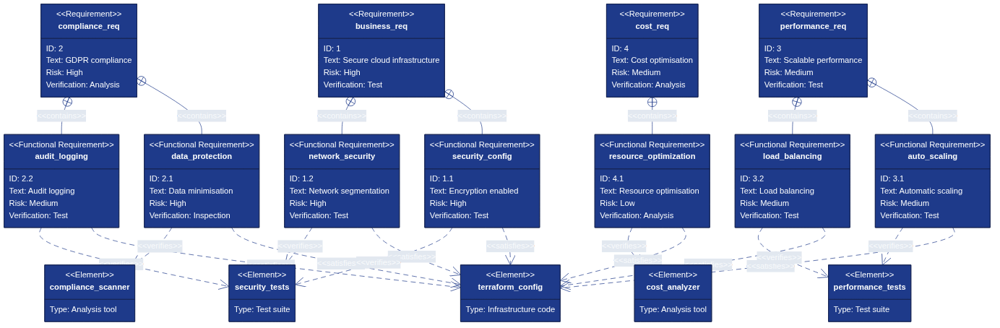

# Teststrategier for infrastruktukod


*comprehensive teststrategi for Infrastructure as Code (Architecture as Code) requires multiple testing-levels from unit tests to end-to-end validation. Diagrammet illustrerar the Structureerade forloppet from snabba utvecklartester to comprehensive integrationsvalidering.*

## Övergripande beskrivning

testing of Infrastructure as Code differs itself grundläggande from traditionell programvarutestning through to fokusera at arkitekturkonfiguration, resurskompatibilitet and miljökonsekvens instead for affärslogik. Effektiv testing of Architecture as Code ensures to Architecture as Code producerar forväntade resultat konsekvent over olika miljöer.

Modern Architecture as Code-testing encompasses flera dimensioner: syntaktisk validation of code, policy compliance checking, kostnadsprognoser, säkerhetssårbarhetanalys and functional testing of deployed infraStructure. This multilevel approach identifierar problem tidigt in utvecklingscykeln when the is billigare and enklare to fixa.

Svenska organisationer with strikta compliance-krav must implementera comprehensive testing which validerar both technical funktionalitet and regulatory conformance. This includes GDPR data protection controls, financial services regulations and government security standards which must verifieras automatically.

Test automation for Architecture as Code enables continuous integration and continuous deployment patterns which accelererar delivery simultaneously which the minskar risk for produktionsstörningar. Infrastructure testing pipelines can köra parallellt with application testing for to säkerställa end-to-end quality assurance.

## Unit testing for architecture as code

Unit testing for Infrastructure as Code fokuserar at validation of individual moduler and resources utan to faktiskt deploya infraStructure. This enables snabb feedback and early detection of konfigurationsfel, which is kritiskt for developer productivity and code quality.

Terraform testing verktyg that Terratest, terraform-compliance and checkov enables automated validation of HCL-code mot predefined policies and Architecture as Code best practices. These verktyg can integreras in IDE:er for real-time feedback under development samt in CI/CD pipelines for automated quality gates.

Unit tests for Architecture as Code bör validera resource configurations, variable validations, output consistency and module interface contracts. This is särskilt viktigt for reusable modules which används across multiple projects where forändringar can ha wide-ranging impact at dependent resources.

Mock testing strategies for cloud resources enables testing utan faktiska cloud costs, which is essentiellt for frequent testing cycles. Verktyg that LocalStack and cloud provider simulators can simulate cloud services locally for comprehensive testing utan infrastructure provisioning costs.

## Testhantering with Vitest for architecture as code

Vitest is ett modernt testramverk byggt for Vite-ekosystemet which erbjuder snabb and effektiv testing of JavaScript/TypeScript-code. For Architecture as Code-projekt which använder Infrastructure as Code with moderna verktyg is Vitest särskilt relevant for to testa konfigurationsgeneratorer, validation scripts and automation verktyg which often skrivs in TypeScript or JavaScript.

### Varfor Vitest is relevant for architecture as code

Många moderna Infrastructure as Code workflows includes TypeScript/JavaScript-components for to generera, validera or transformera infraStructurekonfigurationer. Vitest enables snabb unit testing of These components with forstklassig TypeScript-support, which is kritiskt for to säkerställa korrekt konfigurationsgenerering innan deployment.

Vitest's snabba execution and watch mode enables tight development feedback loops when man utvecklar infrastructure configuration generators or policy validation scripts. This is särskilt värdefullt for Architecture as Code-projekt where konfigurationsfel can leda to costly infrastructure mistakes.

Integration with Vite build tooling means to same utvecklingsmiljö can användas for both application code and infrastructure-relaterad code, which reducerar context switching and forbättrar developer experience for team which arbetar with both application and infrastructure code.

### Konfiguration of Vitest for Infrastructure as Code-projekt

For to integrera Vitest in ett Architecture as Code-projekt behöver vi forst installera nödvändiga dependencies and konfigurera test environment:

```bash
# Installera Vitest och relaterade dependencies
npm install -D vitest @vitest/ui
npm install -D @types/node  # För Node.js API:er

# För coverage rapportering
npm install -D @vitest/coverage-v8
```

Skapa a `vitest.config.ts` fil in projekt root:

```typescript
// vitest.config.ts
import { defineConfig } from 'vitest/config';
import path from 'path';

export default defineConfig({
  test: {
    // Använd globals för to undvika imports in each testfil
    globals: true,
    
    // Test environment (node för infrastructure tooling)
    environment: 'node',
    
    // Coverage konfiguration
    coverage: {
      provider: 'v8',
      reporter: ['text', 'json', 'html'],
      exclude: [
        'node_modules/',
        'dist/',
        '**/*.config.ts',
        '**/types/**',
      ],
      // Kräv minst 80% coverage för infrastructure code
      lines: 80,
      functions: 80,
      branches: 80,
      statements: 80,
    },
    
    // Test timeout för infrastructure operations
    testTimeout: 30000,
    
    // Inkludera test filer
    include: ['**/*.{test,spec}.{js,mjs,cjs,ts,mts,cts}'],
    
    // Exclude patterns
    exclude: [
      'node_modules',
      'dist',
      '.terraform',
      '**/*.d.ts',
    ],
  },
  
  resolve: {
    alias: {
      '@': path.resolve(__dirname, './src'),
      '@infra': path.resolve(__dirname, './infrastructure'),
    },
  },
});
```

### Praktiska example for Infrastructure as Code testing

#### Example 1: Testa Terraform Configuration Generator

```typescript
// src/generators/terraform-config.ts
export interface TerraformConfig {
  provider: string;
  region: string;
  environment: string;
  resources: ResourceConfig[];
}

export interface ResourceConfig {
  type: string;
  name: string;
  properties: Record<string, any>;
}

export class TerraformConfigGenerator {
  generateVPCConfig(
    environment: string,
    region: string = 'eu-north-1'
  ): TerraformConfig {
    // Validera svenska regioner för GDPR compliance
    const swedishRegions = ['eu-north-1', 'eu-west-1'];
    if (!swedishRegions.includes(region)) {
      throw new Error('Region must vara inom EU för GDPR compliance');
    }

    return {
      provider: 'aws',
      region,
      environment,
      resources: [
        {
          type: 'aws_vpc',
          name: `vpc-${environment}`,
          properties: {
            cidr_block: '10.0.0.0/16',
            enable_dns_hostnames: true,
            enable_dns_support: true,
            tags: {
              Name: `vpc-${environment}`,
              Environment: environment,
              ManagedBy: 'Terraform',
              GdprCompliant: 'true',
              DataResidency: 'Sweden',
            },
          },
        },
      ],
    };
  }

  generateRDSConfig(
    environment: string,
    instanceClass: string = 'db.t3.micro',
    encrypted: boolean = true
  ): ResourceConfig {
    // Säkerställ encryption för production
    if (environment === 'production' && !encrypted) {
      throw new Error('Production databaser must ha encryption aktiverad');
    }

    return {
      type: 'aws_db_instance',
      name: `rds-${environment}`,
      properties: {
        allocated_storage: environment === 'production' ? 100 : 20,
        engine: 'postgres',
        engine_version: '14.7',
        instance_class: instanceClass,
        storage_encrypted: encrypted,
        backup_retention_period: environment === 'production' ? 30 : 7,
        multi_az: environment === 'production',
        tags: {
          Environment: environment,
          GdprCompliant: 'true',
          EncryptionEnabled: encrypted.toString(),
        },
      },
    };
  }
}
```

```typescript
// src/generators/terraform-config.test.ts
import { describe, it, expect } from 'vitest';
import { TerraformConfigGenerator } from './terraform-config';

describe('TerraformConfigGenerator', () => {
  const generator = new TerraformConfigGenerator();

  describe('generateVPCConfig', () => {
    it('ska generera VPC config för svenska regioner', () => {
      const config = generator.generateVPCConfig('production', 'eu-north-1');
      
      expect(config.provider).toBe('aws');
      expect(config.region).toBe('eu-north-1');
      expect(config.environment).toBe('production');
      expect(config.resources).toHaveLength(1);
    });

    it('ska inkludera GDPR compliance tags', () => {
      const config = generator.generateVPCConfig('production');
      const vpc = config.resources[0];
      
      expect(vpc.properties.tags).toMatchObject({
        GdprCompliant: 'true',
        DataResidency: 'Sweden',
      });
    });

    it('ska kasta fel för icke-EU regioner', () => {
      expect(() => {
        generator.generateVPCConfig('production', 'us-east-1');
      }).toThrow('Region must vara inom EU för GDPR compliance');
    });

    it('ska aktivera DNS support och hostnames', () => {
      const config = generator.generateVPCConfig('development');
      const vpc = config.resources[0];
      
      expect(vpc.properties.enable_dns_hostnames).toBe(true);
      expect(vpc.properties.enable_dns_support).toBe(true);
    });
  });

  describe('generateRDSConfig', () => {
    it('ska kräva encryption för production miljöer', () => {
      expect(() => {
        generator.generateRDSConfig('production', 'db.t3.micro', false);
      }).toThrow('Production databaser must ha encryption aktiverad');
    });

    it('ska generera korrekt RDS config för production', () => {
      const config = generator.generateRDSConfig('production');
      
      expect(config.type).toBe('aws_db_instance');
      expect(config.properties.storage_encrypted).toBe(true);
      expect(config.properties.multi_az).toBe(true);
      expect(config.properties.backup_retention_period).toBe(30);
      expect(config.properties.allocated_storage).toBe(100);
    });

    it('ska använda lägre resurser för development miljö', () => {
      const config = generator.generateRDSConfig('development');
      
      expect(config.properties.allocated_storage).toBe(20);
      expect(config.properties.backup_retention_period).toBe(7);
      expect(config.properties.multi_az).toBeUndefined();
    });

    it('ska inkludera GDPR compliance tags', () => {
      const config = generator.generateRDSConfig('production');
      
      expect(config.properties.tags).toMatchObject({
        GdprCompliant: 'true',
        EncryptionEnabled: 'true',
      });
    });
  });
});
```

#### Example 2: Testa Infrastructure Validation Scripts

```typescript
// src/validators/infrastructure-validator.ts
export interface ValidationResult {
  valid: boolean;
  errors: string[];
  warnings: string[];
}

export class InfrastructureValidator {
  validateResourceTags(
    tags: Record<string, string>,
    requiredTags: string[] = ['Environment', 'ManagedBy']
  ): ValidationResult {
    const errors: string[] = [];
    const warnings: string[] = [];

    // Kontrollera required tags
    for (const tag of requiredTags) {
      if (!tags[tag]) {
        errors.push(`Saknar required tag: ${tag}`);
      }
    }

    // Validera GDPR compliance för svenska organisationer
    if (tags['DataClassification']) {
      const validClassifications = ['public', 'internal', 'confidential', 'personal'];
      if (!validClassifications.includes(tags['DataClassification'])) {
        errors.push(
          `Ogiltig DataClassification: ${tags['DataClassification']}`
        );
      }
    }

    // Warn about GdprCompliant tag saknas för känslig data
    if (tags['DataClassification'] === 'personal' && !tags['GdprCompliant']) {
      warnings.push('GdprCompliant tag rekommenderas för personal data');
    }

    return {
      valid: errors.length === 0,
      errors,
      warnings,
    };
  }

  validateSecurityGroup(
    rules: Array<{ port: number; cidr: string }>
  ): ValidationResult {
    const errors: string[] = [];
    const warnings: string[] = [];

    for (const rule of rules) {
      // Kontrollera öppna portar
      if (rule.cidr === '0.0.0.0/0') {
        if ([22, 3389, 3306, 5432].includes(rule.port)) {
          errors.push(
            `Port ${rule.port} ska not vara öppen mot internet (0.0.0.0/0)`
          );
        }
      }

      // Varning för vanliga portar
      if (rule.cidr === '0.0.0.0/0' && [80, 443].includes(rule.port)) {
        warnings.push(
          `Port ${rule.port} is öppen mot internet - verifiera to detta is avsiktligt`
        );
      }
    }

    return {
      valid: errors.length === 0,
      errors,
      warnings,
    };
  }
}
```

```typescript
// src/validators/infrastructure-validator.test.ts
import { describe, it, expect } from 'vitest';
import { InfrastructureValidator } from './infrastructure-validator';

describe('InfrastructureValidator', () => {
  const validator = new InfrastructureValidator();

  describe('validateResourceTags', () => {
    it('ska validera to required tags finns', () => {
      const tags = {
        Environment: 'production',
        ManagedBy: 'Terraform',
      };

      const result = validator.validateResourceTags(tags);
      
      expect(result.valid).toBe(true);
      expect(result.errors).toHaveLength(0);
    });

    it('ska rapportera fel när required tags saknas', () => {
      const tags = {
        Environment: 'production',
      };

      const result = validator.validateResourceTags(tags);
      
      expect(result.valid).toBe(false);
      expect(result.errors).toContain('Saknar required tag: ManagedBy');
    });

    it('ska validera DataClassification värden', () => {
      const tags = {
        Environment: 'production',
        ManagedBy: 'Terraform',
        DataClassification: 'invalid-value',
      };

      const result = validator.validateResourceTags(tags);
      
      expect(result.valid).toBe(false);
      expect(result.errors[0]).toContain('Ogiltig DataClassification');
    });

    it('ska varna about GdprCompliant tag saknas för personal data', () => {
      const tags = {
        Environment: 'production',
        ManagedBy: 'Terraform',
        DataClassification: 'personal',
      };

      const result = validator.validateResourceTags(tags);
      
      expect(result.warnings).toContain(
        'GdprCompliant tag rekommenderas för personal data'
      );
    });

    it('ska acceptera giltiga DataClassification värden', () => {
      const validClassifications = ['public', 'internal', 'confidential', 'personal'];
      
      for (const classification of validClassifications) {
        const tags = {
          Environment: 'production',
          ManagedBy: 'Terraform',
          DataClassification: classification,
        };

        const result = validator.validateResourceTags(tags);
        expect(result.valid).toBe(true);
      }
    });
  });

  describe('validateSecurityGroup', () => {
    it('ska blockera SSH öppet mot internet', () => {
      const rules = [{ port: 22, cidr: '0.0.0.0/0' }];
      
      const result = validator.validateSecurityGroup(rules);
      
      expect(result.valid).toBe(false);
      expect(result.errors[0]).toContain('Port 22 ska not vara öppen');
    });

    it('ska blockera databas portar öppna mot internet', () => {
      const rules = [
        { port: 3306, cidr: '0.0.0.0/0' },  // MySQL
        { port: 5432, cidr: '0.0.0.0/0' },  // PostgreSQL
      ];
      
      const result = validator.validateSecurityGroup(rules);
      
      expect(result.valid).toBe(false);
      expect(result.errors).toHaveLength(2);
    });

    it('ska varna för HTTP/HTTPS öppet mot internet', () => {
      const rules = [
        { port: 80, cidr: '0.0.0.0/0' },
        { port: 443, cidr: '0.0.0.0/0' },
      ];
      
      const result = validator.validateSecurityGroup(rules);
      
      expect(result.valid).toBe(true);
      expect(result.warnings).toHaveLength(2);
    });

    it('ska acceptera restricted CIDR blocks', () => {
      const rules = [
        { port: 22, cidr: '10.0.0.0/8' },
        { port: 3306, cidr: '192.168.1.0/24' },
      ];
      
      const result = validator.validateSecurityGroup(rules);
      
      expect(result.valid).toBe(true);
      expect(result.errors).toHaveLength(0);
    });
  });
});
```

### Integration in CI/CD Pipeline

Vitest can integreras in CI/CD pipelines for automated testing of infrastructure code:

```yaml
# .github/workflows/infrastructure-validation.yml
name: Infrastructure Code Validation

on:
  pull_request:
    paths:
      - 'src/**'
      - 'infrastructure/**'
      - 'tests/**'
  push:
    branches: [main, develop]

jobs:
  vitest-validation:
    runs-on: ubuntu-latest
    name: Vitest Infrastructure Tests
    steps:
      - uses: actions/checkout@v4
      
      - name: Setup Node.js
        uses: actions/setup-node@v4
        with:
          node-version: '20'
          cache: 'npm'
      
      - name: Install Dependencies
        run: npm ci
      
      - name: Run Vitest Tests
        run: npm run test:vitest
        
      - name: Generate Coverage Report
        run: npm run test:coverage
        
      - name: Upload Coverage to Codecov
        uses: codecov/codecov-action@v4
        with:
          files: ./coverage/coverage-final.json
          flags: infrastructure-code
          
      - name: Comment PR with Coverage
        if: github.event_name == 'pull_request'
        uses: romeovs/lcov-reporter-action@v0.3.1
        with:
          lcov-file: ./coverage/lcov.info
          github-token: ${{ secrets.GITHUB_TOKEN }}
```

Lägg to test scripts in `package.json`:

```json
{
  "scripts": {
    "test:vitest": "vitest run",
    "test:watch": "vitest watch",
    "test:coverage": "vitest run --coverage",
    "test:ui": "vitest --ui"
  }
}
```

### Recommendations for testorganisering

**FilStructure for Infrastructure Code Tests:**

```
project/
├── src/
│   ├── generators/
│   │   ├── terraform-config.ts
│   │   └── terraform-config.test.ts
│   ├── validators/
│   │   ├── infrastructure-validator.ts
│   │   └── infrastructure-validator.test.ts
│   └── utils/
│       ├── compliance-checker.ts
│       └── compliance-checker.test.ts
├── tests/
│   ├── integration/
│   │   └── end-to-end.test.ts
│   └── fixtures/
│       └── sample-configs.ts
├── vitest.config.ts
└── package.json
```

**Best Practices for Infrastructure Testing with Vitest:**

1. **Snabba unit tests:** Håll unit tests snabba (<100ms per test) for to möjliggöra effektiv watch mode under development.

2. **Isolerade tester:** each test ska vara oberoende and kunna köras in valfri ordning utan side effects.

3. **Beskrivande test namn:** Använd tydliga test beskrivningar which dokumenterar expected behavior: `'ska kasta fel for icke-EU regioner'`.

4. **Test fixtures:** Använd shared test fixtures for common infrastructure configurations, men var forsiktig with mutable state.

5. **Coverage mål:** Sikta at minst 80% code coverage for infrastructure configuration and validation code, men fokusera at meaningful tests snarare än coverage metrics.

6. **Mock externa beroenden:** Använd Vitest's mocking capabilities for to mocka cloud provider SDKs and external APIs:

```typescript
import { vi } from 'vitest';
import * as AWS from 'aws-sdk';

vi.mock('aws-sdk', () => ({
  EC2: vi.fn(() => ({
    describeInstances: vi.fn().mockResolvedValue({
      Reservations: [],
    }),
  })),
}));
```

7. **Snapshot testing:** Använd snapshot tests for to validera generated configuration files:

```typescript
it('ska generera korrekt terraform config', () => {
  const config = generator.generateFullConfig('production');
  expect(config).toMatchSnapshot();
});
```

### Automation and Watch Mode

a of Vitest's största Benefits is watch mode which enables continuous testing under development:

```bash
# Starta watch mode för automated re-testing
npm run test:watch

# Kör endast relaterade tester när filer ändras
npm run test:watch -- --changed

# Kör tests med UI för interaktiv debugging
npm run test:ui
```

This enables tight feedback loops where infrastructure code changes owithelbart valideras, which reducerar tiden mellan code change and feedback from seconds to milliseconds.

For svenska organisationer with strikta compliance krav can automated testing with Vitest säkerställa to infrastructure configurations konsekvent uppfyller GDPR requirements, security policies and organizational standards innan deployment.

## Integrationstesting and miljövalidering

Integration testing for Infrastructure as Code verifierar to different infrastructure components fungerar tosammans korrekt and to deployed infraStructure möter performance and security requirements. This requires temporary test environments which closely mirror production configurations.

End-to-end testing workflows must validate entire deployment pipelines from source code changes to functional infrastructure. This includes testing of CI/CD pipeline configurations, secret management, monitoring setup and rollback procedures which is critical for production stability.

Environment parity testing ensures to infrastructure behaves consistently across development, staging and production miljöer. This testing identifierar environment-specific issues which can orsaka deployment failures or performance discrepancies mellan miljöer.

Chaos engineering principles can appliceras at infrastructure testing through to systematiskt introduce failures in test environments for to validate resilience and recovery mechanisms. This is särskilt värdefullt for mission-critical systems which requires high availability guarantees.

## Security and compliance testing

Security testing for Infrastructure as Code must validate both infrastructure configuration security and operational security controls. This includes scanning for common security misconfigurations, valdation of encryption settings and verification of network security policies.

Compliance testing automation ensures to infrastructure configurations möter regulatory requirements kontinuerligt. Svenska organisationer must validate GDPR compliance, financial regulations and government security standards through automated testing which can provide audit trails for compliance reporting.

Policy-as-code frameworks that Open Policy Agent (OPA) and AWS Config Rules enables declarative definition of compliance policies which can enforced automatically under infrastructure deployment. This preventative approach is mer effective än reactive compliance monitoring.

Vulnerability scanning for infrastructure dependencies must include container images, operating systems configurations and third-party software components. Integration with security scanning tools in CI/CD pipelines ensures to security vulnerabilities identifieras innan deployment to production.

## Performance and skalbarhetstesting

Performance testing for Infrastructure as Code fokuserar at validation of infrastructure capacity, response times and resource utilization under various load conditions. This is critical for applications which requires predictable performance characteristics under varying traffic patterns.

Load testing strategies must validate auto-scaling configurations, resource limits and failover mechanisms under realistic traffic scenarios. Infrastructure performance testing can include database performance under load, network throughput validation and storage in/O capacity verification.

Skalabilitetstesting verifierar to infrastructure can handle projected growth efficiently through automated scaling mechanisms. This includes testing of horizontal scaling for stateless services and validation of data partitioning strategies for stateful systems.

Capacity planning validation through performance testing hjälper optimize resource configurations for cost-effectiveness simultaneously which performance requirements uppfylls. This is särskilt important for svenska organisationer which balanserar cost optimization with service level requirements.

## Requirements as Code and testbarhet



*Relationen mellan affärskrav, funktionella krav and verifieringsmetoder illustrerar how Infrastructure as Code enables spårbar testing from högre abstraktionsnivåer ner to konkreta Architecture as Code-implementationer.*

Requirements-as-Code representerar ett paradigmskifte where affärskrav and compliance-krav kodifieras in maskinläsbar form tosammans with infrastructure-koden. This enables automatiserad validation of to infraStructureen verkligen uppfyller the specificerade kraven through entire utvecklingslivscykeln.

Through to definiera Requirements as Code are created a direkt koppling mellan business requirements, functional requirements and the automatiserade tester which verifierar Architecture as Code-implementationen. This traceability is kritisk for organisationer which must demonstrera compliance and for utvecklingsteam which behöver forstå affärskonsekvenserna of tekniska beslut.

### Kravspårbarhet in praktiken

Requirements traceability for Infrastructure as Code means to each infraStructurekomponent can kopplas tobaka to specifika affärskrav or compliance-krav. This is särskilt viktigt for svenska organisationer which must uppfylla GDPR, finansiella regleringar or myndighetskrav.

Verktyg that Open Policy Agent (OPA) enables uttryck of compliance-krav which policies which can evalueras automatically mot infrastructure-konfigurationer. These policies blir testable requirements which can köras kontinuerligt for to säkerställa ongoing compliance.

Requirement validation testing ensures to infrastructure not only is tekniskt korrekt utan också uppfyller business intent. This includes validation of säkerhetskrav, performance-krav, togänglighetskrav and kostnadsramar which defined of business stakeholders.

### Automated Requirements Verification

```yaml
# requirements/security-requirements.yaml
apiVersion: policy/v1
kind: RequirementSet
metadata:
  name: swedish-security-requirements
  version: "1.0"
spec:
  requirements:
    - id: SEC-001
      type: security
      description: "all S3 buckets must ha kryptering aktiverad"
      priority: critical
      compliance: ["GDPR", "ISO27001"]
      tests:
        - type: static-analysis
          tool: checkov
          rule: CKV_AWS_141
        - type: runtime-test
          script: test_s3_encryption.py
    
    - id: SEC-002  
      type: security
      description: "RDS instanser must använda encrypted storage"
      priority: critical
      compliance: ["GDPR"]
      tests:
        - type: terraform-test
          file: test_rds_encryption_test.go
        - type: policy-test
          file: rds_encryption.rego
          
    - id: PERF-001
      type: performance
      description: "Auto-scaling must vara konfigurerat för production workloads"
      priority: high
      tests:
        - type: integration-test
          file: test_autoscaling_integration.py
        - type: load-test
          tool: k6
          script: autoscaling_load_test.js
```

```python
# test/requirements_validation.py
"""
Automatiserad validation of krav mot Infrastructure as Code
"""
import yaml
import subprocess
import json
from typing import Dict, List, Any

class RequirementValidator:
    def __init__(self, requirements_file: str):
        with open(requirements_file, 'r') as f:
            self.requirements = yaml.safe_load(f)
    
    def validate_all_requirements(self) -> Dict[str, Any]:
        """Kör all krav-relaterade tester och sammanställ resultat"""
        results = {
            'passed': [],
            'failed': [],
            'skipped': [],
            'summary': {}
        }
        
        for req in self.requirements['spec']['requirements']:
            req_id = req['id']
            print(f"Validerar krav {req_id}: {req['description']}")
            
            req_result = self._validate_requirement(req)
            
            if req_result['status'] == 'passed':
                results['passed'].append(req_result)
            elif req_result['status'] == 'failed':
                results['failed'].append(req_result)
            else:
                results['skipped'].append(req_result)
        
        results['summary'] = {
            'total': len(self.requirements['spec']['requirements']),
            'passed': len(results['passed']),
            'failed': len(results['failed']),
            'skipped': len(results['skipped']),
            'compliance_coverage': self._calculate_compliance_coverage()
        }
        
        return results
    
    def _validate_requirement(self, requirement: Dict) -> Dict[str, Any]:
        """Validera ett enskilt krav through to köra associerade tester"""
        req_id = requirement['id']
        test_results = []
        
        for test in requirement.get('tests', []):
            test_result = self._execute_test(test, req_id)
            test_results.append(test_result)
        
        # Avgör overall status för kravet
        if all(t['passed'] for t in test_results):
            status = 'passed'
        elif any(t['passed'] == False for t in test_results):
            status = 'failed'
        else:
            status = 'skipped'
        
        return {
            'requirement_id': req_id,
            'description': requirement['description'],
            'priority': requirement['priority'],
            'compliance': requirement.get('compliance', []),
            'status': status,
            'test_results': test_results
        }
    
    def _execute_test(self, test_config: Dict, req_id: str) -> Dict[str, Any]:
        """Exekvera ett specifikt test baserat at dess typ"""
        test_type = test_config['type']
        
        if test_type == 'static-analysis':
            return self._run_static_analysis_test(test_config, req_id)
        elif test_type == 'terraform-test':
            return self._run_terraform_test(test_config, req_id)
        elif test_type == 'policy-test':
            return self._run_policy_test(test_config, req_id)
        elif test_type == 'integration-test':
            return self._run_integration_test(test_config, req_id)
        elif test_type == 'load-test':
            return self._run_load_test(test_config, req_id)
        else:
            return {
                'test_type': test_type,
                'passed': None,
                'message': f'Okänd testtyp: {test_type}',
                'requirement_id': req_id
            }
    
    def _run_static_analysis_test(self, test_config: Dict, req_id: str) -> Dict[str, Any]:
        """Kör static analysis test med Checkov"""
        tool = test_config.get('tool', 'checkov')
        rule = test_config.get('rule')
        
        try:
            cmd = f"{tool} --check {rule} --directory terraform/ --output json"
            result = subprocess.run(cmd.split(), capture_output=True, text=True)
            
            if result.returncode == 0:
                return {
                    'test_type': 'static-analysis',
                    'tool': tool,
                    'rule': rule,
                    'passed': True,
                    'message': 'Static analysis passed',
                    'requirement_id': req_id
                }
            else:
                return {
                    'test_type': 'static-analysis', 
                    'tool': tool,
                    'rule': rule,
                    'passed': False,
                    'message': f'Static analysis failed: {result.stderr}',
                    'requirement_id': req_id
                }
        except Exception as e:
            return {
                'test_type': 'static-analysis',
                'passed': None,
                'message': f'Error running static analysis: {str(e)}',
                'requirement_id': req_id
            }
    
    def _calculate_compliance_coverage(self) -> Dict[str, float]:
        """Beräkna compliance coverage för olika regleringar"""
        compliance_mapping = {}
        
        for req in self.requirements['spec']['requirements']:
            for compliance in req.get('compliance', []):
                if compliance not in compliance_mapping:
                    compliance_mapping[compliance] = {'total': 0, 'tested': 0}
                
                compliance_mapping[compliance]['total'] += 1
                
                if req.get('tests'):
                    compliance_mapping[compliance]['tested'] += 1
        
        coverage = {}
        for compliance, stats in compliance_mapping.items():
            if stats['total'] > 0:
                coverage[compliance] = stats['tested'] / stats['total'] * 100
            else:
                coverage[compliance] = 0
        
        return coverage
```

## Praktiska example

### Terraform Unit Testing with Terratest
```go
// test/terraform_test.go
package test

import (
    "testing"
    "github.com/gruntwork-io/terratest/modules/terraform"
    "github.com/gruntwork-io/terratest/modules/test-structure"
    "github.com/stretchr/testify/assert"
    "github.com/stretchr/testify/require"
)

func TestTerraformSwedishInfrastructure(t *testing.T) {
    t.Parallel()

    // Sätt upp test environment
    terraformDir := "../terraform/swedish-infrastructure"
    
    // Generera unik suffix för test resources
    uniqueId := test-structure.UniqueId()
    
    terraformOptions := &terraform.Options{
        TerraformDir: terraformDir,
        Vars: map[string]interface{}{
            "environment":      "test",
            "project_name":     "architecture as code-test-" + uniqueId,
            "region":          "eu-north-1", // Stockholm för svenska krav
            "enable_gdpr_logs": true,
            "data_classification": "internal",
        },
        BackendConfig: map[string]interface{}{
            "bucket": "terraform-state-test-" + uniqueId,
            "region": "eu-north-1",
        },
    }

    // Cleanup resources efter test
    defer terraform.Destroy(t, terraformOptions)

    // Kör terraform init och plan
    terraform.InitAndPlan(t, terraformOptions)

    // Validera to plan innehåller förväntade resources
    planStruct := terraform.InitAndPlanAndShowWithStruct(t, terraformOptions)
    
    // Test: Validera to all resurser har korrekta tags
    for _, resource := range planStruct.PlannedValues.RootModule.Resources {
        if resource.Type == "aws_instance" || resource.Type == "aws_rds_instance" {
            tags := resource.AttributeValues["tags"].(map[string]interface{})
            
            assert.Equal(t, "architecture as code-test-" + uniqueId, tags["Project"])
            assert.Equal(t, "test", tags["Environment"])
            assert.Equal(t, "internal", tags["DataClassification"])
            
            // Validera GDPR compliance tags
            assert.Contains(t, tags, "GdprApplicable")
            assert.Contains(t, tags, "DataRetention")
        }
    }

    // Test: Validera säkerhetskonfiguration
    for _, resource := range planStruct.PlannedValues.RootModule.Resources {
        if resource.Type == "aws_s3_bucket" {
            // Validera to S3 buckets har encryption enabled
            encryption := resource.AttributeValues["server_side_encryption_configuration"]
            assert.NotNil(t, encryption, "S3 bucket must ha encryption konfigurerad")
        }
        
        if resource.Type == "aws_rds_instance" {
            // Validera to RDS instances har encryption at rest
            encrypted := resource.AttributeValues["storage_encrypted"].(bool)
            assert.True(t, encrypted, "RDS instans must ha storage encryption aktiverad")
        }
    }

    // Kör terraform apply
    terraform.Apply(t, terraformOptions)

    // Test: Validera faktiska infrastructure deployment
    validateInfrastructureDeployment(t, terraformOptions, uniqueId)
}

func validateInfrastructureDeployment(t *testing.T, terraformOptions *terraform.Options, uniqueId string) {
    // Hämta outputs from terraform
    vpcId := terraform.Output(t, terraformOptions, "vpc_id")
    require.NotEmpty(t, vpcId, "VPC ID ska not vara tom")

    dbEndpoint := terraform.Output(t, terraformOptions, "database_endpoint")
    require.NotEmpty(t, dbEndpoint, "Database endpoint ska not vara tom")

    // Test: Validera nätverkskonfiguration
    validateNetworkConfiguration(t, vpcId)
    
    // Test: Validera database connectivity
    validateDatabaseConnectivity(t, dbEndpoint)
    
    // Test: Validera monitoring och logging
    validateMonitoringSetup(t, terraformOptions)
}

func validateNetworkConfiguration(t *testing.T, vpcId string) {
    // implementation för nätverksvalidering
    // Kontrollera subnets, routing tables, security groups etc.
}

func validateDatabaseConnectivity(t *testing.T, endpoint string) {
    // implementation för databasconnectivity testing
    // Kontrollera to databas is accessible och responsiv
}

func validateMonitoringSetup(t *testing.T, terraformOptions *terraform.Options) {
    // implementation för monitoring validation
    // Kontrollera CloudWatch metrics, alarms, logging etc.
}
```

### Policy-as-Code Testing with OPA
```rego
# policies/aws_security_test.rego
package aws.security.test

import rego.v1

# Test: S3 Buckets must ha encryption
test_s3_encryption_required if {
    input_s3_without_encryption := {
        "resource_type": "aws_s3_bucket",
        "attributes": {
            "bucket": "test-bucket",
            "server_side_encryption_configuration": null
        }
    }
    
    not aws.security.s3_encryption_required with input as input_s3_without_encryption
}

test_s3_encryption_allowed if {
    input_s3_with_encryption := {
        "resource_type": "aws_s3_bucket", 
        "attributes": {
            "bucket": "test-bucket",
            "server_side_encryption_configuration": [{
                "rule": [{
                    "apply_server_side_encryption_by_default": [{
                        "sse_algorithm": "AES256"
                    }]
                }]
            }]
        }
    }
    
    aws.security.s3_encryption_required with input as input_s3_with_encryption
}

# Test: EC2 instances must ha säkerhetgrupper konfigurerade
test_ec2_security_groups_required if {
    input_ec2_without_sg := {
        "resource_type": "aws_instance",
        "attributes": {
            "instance_type": "t3.micro",
            "vpc_security_group_ids": []
        }
    }
    
    not aws.security.ec2_security_groups_required with input as input_ec2_without_sg
}

# Test: Svenska GDPR compliance
test_gdpr_data_classification_required if {
    input_without_classification := {
        "resource_type": "aws_rds_instance",
        "attributes": {
            "tags": {
                "Environment": "production",
                "Project": "customer-app"
            }
        }
    }
    
    not sweden.gdpr.data_classification_required with input as input_without_classification
}

test_gdpr_data_classification_valid if {
    input_with_classification := {
        "resource_type": "aws_rds_instance",
        "attributes": {
            "tags": {
                "Environment": "production", 
                "Project": "customer-app",
                "DataClassification": "personal",
                "GdprApplicable": "true",
                "DataRetention": "7years"
            }
        }
    }
    
    sweden.gdpr.data_classification_required with input as input_with_classification
}
```

## Kubernetes integrationstestning

### Kubernetes Infrastructure Testing

Architecture as Code-principerna within This område
```yaml
# test/k8s-test-suite.yaml
apiVersion: v1
kind: ConfigMap
metadata:
  name: infrastructure-tests
  namespace: testing
data:
  test-runner.sh: |
    #!/bin/bash
    set -e
    
    echo "Starting Infrastructure as Code testing för Kubernetes..."
    
    # Test 1: Validera resource quotas
    echo "Testing resource quotas..."
    kubectl get resourcequota -n production -o json | \
    jq '.items[0].status.used | to_entries[] | select(.value == "0")' | \
    if [ $(wc -l) -gt 0 ]; then
      echo "WARNING: Unused resource quotas detected"
    fi
    
    # Test 2: Validera security policies
    echo "Testing Pod Security Policies..."
    kubectl get psp | grep -E "(privileged|hostNetwork)" && \
    echo "ERROR: Privileged security policies detected" && exit 1
    
    # Test 3: Validera network policies
    echo "Testing Network Policies..."
    NAMESPACES=$(kubectl get ns --no-headers -o custom-columns=":metadata.name")
    for ns in $NAMESPACES; do
      if [ "$ns" != "kube-systems" ] && [ "$ns" != "kube-public" ]; then
        if ! kubectl get networkpolicy -n $ns --no-headers 2>/dev/null | grep -q .; then
          echo "WARNING: No network policies in namespace $ns"
        fi
      fi
    done
    
    # Test 4: Validera svenska compliance krav
    echo "Testing GDPR compliance för persistent volumes..."
    kubectl get pv -o json | \
    jq -r '.items[] | select(.spec.csi.driver == "ebs.csi.aws.com") | 
           select(.spec.csi.volumeAttributes.encrypted != "true") | 
           .metadata.name' | \
    if [ $(wc -l) -gt 0 ]; then
      echo "ERROR: Unencrypted persistent volumes detected"
      exit 1
    fi
    
    echo "All infrastructure tests passed!"
```

```yaml
---
apiVersion: batch/v1
kind: Job
metadata:
  name: infrastructure-test-job
  namespace: testing
spec:
  template:
    spec:
      containers:
      - name: test-runner
        image: bitnami/kubectl:latest
        command: ["/bin/bash"]
        args: ["/scripts/test-runner.sh"]
        volumeMounts:
        - name: test-scripts
          mountPath: /scripts
        env:
        - name: KUBECONFIG
          value: /etc/kubeconfig/config
      volumes:
      - name: test-scripts
        configMap:
          name: infrastructure-tests
          defaultMode: 0755
      - name: kubeconfig
        secret:
          secretName: kubeconfig
      restartPolicy: Never
  backoffLimit: 3
```

## Pipeline automation for infrastrukturtestning

### CI/CD Pipeline for Infrastructure Testing

Architecture as Code-principerna within This område
```yaml
# .github/workflows/infrastructure-testing.yml
name: Infrastructure Testing Pipeline

on:
  pull_request:
    paths: 
      - 'terraform/**'
      - 'kubernetes/**'
      - 'policies/**'
  push:
    branches: [main, develop]

jobs:
  static-analysis:
    runs-on: ubuntu-latest
    name: Static Code Analysis
    steps:
      - uses: actions/checkout@v4
      
      - name: Terraform Format Check
        run: terraform fmt -check -recursive terraform/
        
      - name: Terraform Validation
        run: |
          cd terraform
          terraform init -backend=false
          terraform validate
          
      - name: Security Scanning med Checkov
        uses: bridgecrewio/checkov-action@master
        with:
          directory: terraform/
          framework: terraform
          output_format: cli,sarif
          output_file_path: reports/checkov-report.sarif
          
      - name: Policy Testing med OPA
        run: |
          # Installera OPA
          curl -L -o opa https://openpolicyagent.org/downloads/v0.57.0/opa_linux_amd64_static
          chmod +x opa
          
          # Kör policy tests
          ./opa test policies/

  unit-testing:
    runs-on: ubuntu-latest
    name: Unit Testing med Terratest
    steps:
      - uses: actions/checkout@v4
      
      - name: Setup Go
        uses: actions/setup-go@v4
        with:
          go-version: '1.21'
          
      - name: Install Dependencies
        run: |
          cd test
          go mod download
          
      - name: Run Unit Tests
        run: |
          cd test
          go test -v -timeout 30m
        env:
          AWS_DEFAULT_REGION: eu-north-1
          TF_VAR_test_mode: true

  integration-testing:
    runs-on: ubuntu-latest
    name: Integration Testing
    if: github.event_name == 'push'
    needs: [static-analysis, unit-testing]
    steps:
      - uses: actions/checkout@v4
      
      - name: Configure AWS Credentials
        uses: aws-actions/configure-aws-credentials@v4
        with:
          aws-access-key-id: ${{ secrets.AWS_ACCESS_KEY_ID }}
          aws-secret-access-key: ${{ secrets.AWS_SECRET_ACCESS_KEY }}
          aws-region: eu-north-1
          
      - name: Deploy Test Infrastructure
        run: |
          cd terraform/test-environment
          terraform init
          terraform plan -var="test_run_id=${{ github.run_id }}"
          terraform apply -auto-approve -var="test_run_id=${{ github.run_id }}"
          
      - name: Run Integration Tests
        run: |
          cd test/integration
          go test -v -timeout 45m -tags=integration
          
      - name: Cleanup Test Infrastructure
        if: always()
        run: |
          cd terraform/test-environment
          terraform destroy -auto-approve -var="test_run_id=${{ github.run_id }}"

  compliance-validation:
    runs-on: ubuntu-latest
    name: Compliance Validation
    steps:
      - uses: actions/checkout@v4
      
      - name: GDPR Compliance Check
        run: |
          # Kontrollera to all databaser har encryption
          grep -r "storage_encrypted.*=.*true" terraform/ || \
          (echo "ERROR: Icke-krypterade databaser upptäckta" && exit 1)
          
          # Kontrollera data classification tags
          grep -r "DataClassification" terraform/ || \
          (echo "ERROR: Data classification tags saknas" && exit 1)
          
      - name: Swedish Security Standards
        run: |
          # MSB säkerhetskrav för kritisk infrastruktur
          ./scripts/msb-compliance-check.sh terraform/
          
          # Validera to svenska regioner används
          if grep -r "us-" terraform/ --include="*.tf"; then
            echo "WARNING: Amerikanska regioner upptäckta - kontrollera datasuveränitet"
          fi

  performance-testing:
    runs-on: ubuntu-latest
    name: Performance Testing
    if: contains(github.event.pull_request.title, 'performance') || github.ref == 'refs/heads/main'
    steps:
      - uses: actions/checkout@v4
      
      - name: Infrastructure Performance Tests
        run: |
          # Kör load tests mot test infrastruktur
          cd test/performance
          ./run-load-tests.sh
          
      - name: Cost Analysis
        run: |
          # Beräkna förvänkade kostnader för infrastructure changes
          ./scripts/cost-analysis.sh terraform/
```

## Summary


Den moderna Architecture as Code-metodiken representerar framtiden for infraStructurehantering in svenska organisationer.
Comprehensive testing strategies for Infrastructure as Code is essential for to säkerställa reliable, secure and cost-effective infrastructure deployments. a väl designad test pyramid with unit tests, integration tests and end-to-end validation can dramatiskt reducera production issues and forbättra developer confidence.

Svenska organisationer must särskilt fokusera at compliance testing which validates GDPR requirements, financial regulations and government security standards. Automated policy testing with verktyg that OPA enables continuous compliance verification utan manual overhead.

Investment in robust Architecture as Code testing frameworks pays off through reduced production incidents, faster development cycles and improved regulatory compliance. Modern testing verktyg and cloud-native testing strategies enables comprehensive validation utan prohibitive costs or complexity.

## Sources and referenser

- Terratest Documentation. "Infrastructure Testing for Terraform." Gruntwork, 2023.
- Open Policy Agent. "Policy Testing Architecture as Code best practices." CNCF OPA Project, 2023.
- AWS. "Infrastructure Testing Strategy Guide." Amazon Web Services, 2023.
- Kubernetes. "Testing Infrastructure and Applications." Kubernetes Documentation, 2023.
- NIST. "Security Testing for Cloud Infrastructure." NIST Cybersecurity Framework, 2023.
- CSA. "Cloud Security Testing Guidelines." Cloud Security Alliance, 2023.
- Vitest. "Next Generation Testing Framework." Vitest Documentation, 2024.