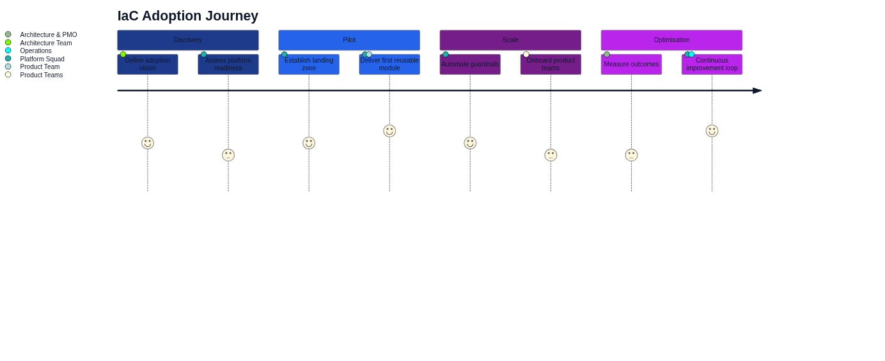

# Architecture as Code in the practice


Praktisk implebuttation of Architecture as Code kräver throughtänkt approaches that balanserar technical möjligheter with organizational begränsningar. Infrastructure as Code utgör en central komponent, but must integreras with bredare arkitekturdefinitioner. This chapter fokuserar on verkliga implebuttationsstrategier, vanliga fallgropar, and beprövade methods for framgångsrik Architecture as Code-adoption in companiessmiljöer.



Diagrammet ovan illustrerar den typiska användarresan for Architecture as Code-implebuttation, from initial discovery to complete optimization.

## Implebuttation roadmap and strategier

Successful Architecture as Code adoption följer vanligen en phased approach that börjar with pilot projects and gradvis expanderar to enterprise-wide implebuttation. Initial phases fokuserar on non-critical environbutts and simple use cases for to bygga confidence and establish Architecture as Code best practices before production workloads migreras. Infrastructure as Code (Architecture as Code) utgör often startpunkten for this transformation.

Assessbutt of current state infrastructure is critical for planning effective migration strategies. Legacy systems, technical debt, and organizational constraints must identifieras and addressas through targeted modernization efforts. This includes inventory of existing assets, dependency mapping, and risk assessbutt for olika migration scenarios.

Stakeholder alignbutt ensures organizational support for Architecture as Code initiatives. Executive sponsorship, cross-functional collaboration, and clear communication of benefits and challenges is essential for overcoming resistance and securing necessary reSources. Change managebutt strategies must address både technical and cultural aspects of transformation.

## Tool selection and ecosystem integration

Technology stack selection balanserar organizational requirebutts with market maturity and community support. Terraform have emerged that leading multi-cloud solution, while cloud-native tools that CloudFormation, ARM templates, and Google Deploybutt Manager erbjuder deep integration with specific platforms.

Integration with existing toolchains kräver careful consideration of workflows, security requirebutts, and operational procedures. Source control systems, CI/CD platforms, monitoring solutions, and security scanning tools must seamlessly integrate for holistic development experience.

Vendor evaluation criteria includes technical capabilities, roadmap alignbutt, commercial terms, and long-term viability. Open source solutions erbjuder flexibility and community innovation, while commercial platforms provide enterprise support and advanced features. Hybrid approaches combinerar benefits from both models.

## Production readiness and operational excellence

Security-first approach implebutterar comprehensive security controls from design phase. Secrets managebutt, access controls, audit logging, and compliance validation must vara built-in rather than bolt-on features. Automated security scanning and policy enforcebutt ensures consistent security posture.

High availability design principles appliceras on infrastructure code through redundancy, failover mechanisms, and disaster recovery procedures. Infrastructure definitions must handle various failure scenarios gracefully and provide automatic recovery capabilities where possible.

Monitoring and observability for infrastructure-as-code environbutts kräver specialized approaches that track både code changes and resulting infrastructure state. Drift detection, compliance monitoring, and performance tracking provide essential feedback for continuous improvebutt.

## Common challenges and troubleshooting

State managebutt complexity grows significantly that infrastructure scales and involves multiple teams. State file corruption, concurrent modifications, and state drift can cause serious operational problems. Remote state backends, state locking mechanisms, and regular state backups are essential for production environbutts.

Dependency managebutt between infrastructure components kräver careful orchestration for avoid circular dependencies and ensure proper creation/destruction order. Modular design patterns and clear interface definitions help manage complexity that systems grow.

Version compatibility issues between tools, providers, and infrastructure definitions can cause unexpected failures. Comprehensive testing, staged rollouts, and dependency pinning strategies help mitigate these risks in production environbutts.

## Enterprise integration patterns

Multi-account/subscription strategies for cloud environbutts provide isolation, security boundaries, and cost allocation capabilities. Infrastructure code must handle cross-account dependencies, permission managebutt, and centralized governance requirebutts.

Hybrid cloud implebuttations require specialized approaches for networking, identity managebutt, and data synchronization between on-premises and cloud environbutts. Infrastructure code must abstract underlying platform differences while providing consistent managebutt experience.

Compliance and governance frameworks must vara embedded infrastructure code workflows. Automated policy enforcebutt, audit trails, and compliance reporting capabilities ensure regulatory requirebutts are met consistently across all environbutts.

## Practical exempel

### Terraform Module Structure
```hcl
# Modules/web-application/main.tf
variable "environbutt" {
 description = "Environbutt name (dev, staging, prod)"
 type = string
}

variable "application_name" {
 description = "Name of the application"
 type = string
}

variable "instance_count" {
 description = "Number of application instances"
 type = number
 default = 2
}

# VPC and networking
resource "aws_vpc" "main" {
 cidr_block = "10.0.0.0/16"
 enable_dns_hostnames = true
 enable_dns_support = true

 tags = {
 Name = "${var.application_name}-${var.environbutt}-vpc"
 Environbutt = var.environbutt
 Application = var.application_name
 }
}

resource "aws_subnet" "public" {
 count = 2
 vpc_id = aws_vpc.main.id
 cidr_block = "10.0.${count.index + 1}.0/24"
 availability_zone = data.aws_availability_zones.available.names[count.index]

 map_public_ip_on_launch = true

 tags = {
 Name = "${var.application_name}-${var.environbutt}-public-${count.index + 1}"
 Type = "Public"
 }
}

# Application Load Balancer
resource "aws_lb" "main" {
 name = "${var.application_name}-${var.environbutt}-alb"
 internal = false
 load_balancer_type = "application"
 security_groups = [aws_security_group.alb.id]
 subnets = aws_subnet.public[*].id

 enable_deletion_protection = false

 tags = {
 Environbutt = var.environbutt
 Application = var.application_name
 }
}

# Auto Scaling Group
resource "aws_autoscaling_group" "main" {
 name = "${var.application_name}-${var.environbutt}-asg"
 vpc_zone_identifier = aws_subnet.public[*].id
 target_group_arns = [aws_lb_target_group.main.arn]
 health_check_type = "ELB"
 health_check_grace_period = 300

 min_size = 1
 max_size = 10
 desired_capacity = var.instance_count

 launch_template {
 id = aws_launch_template.main.id
 version = "$Latest"
 }

 tag {
 key = "Name"
 value = "${var.application_name}-${var.environbutt}-instance"
 propagate_at_launch = true
 }

 tag {
 key = "Environbutt"
 value = var.environbutt
 propagate_at_launch = true
 }
}

# Outputs
output "load_balancer_dns" {
 description = "DNS name of the load balancer"
 value = aws_lb.main.dns_name
}

output "vpc_id" {
 description = "ID of the VPC"
 value = aws_vpc.main.id
}
```

## Terraform configuration and miljöhantering

### Environbutt-specific Configuration
```hcl
# Environbutts/production/main.tf
terraform {
 required_version = ">= 1.0"
 
 backend "s3" {
 bucket = "company-terraform-state-prod"
 key = "web-application/terraform.tfstate"
 region = "us-west-2"
 encrypt = true
 dynamodb_table = "terraform-state-lock"
 }

 required_providers {
 aws = {
 source = "hashicorp/aws"
 version = "~> 5.0"
 }
 }
}

provider "aws" {
 region = "us-west-2"
 
 default_tags {
 tags = {
 Project = "web-application"
 Environbutt = "production"
 ManagedBy = "terraform"
 Owner = "platform-team"
 }
 }
}

module "web_application" {
 source = "../../modules/web-application"

 environbutt = "production"
 application_name = "company-web-app"
 instance_count = 6

 # Production-specific overrides
 enable_monitoring = true
 backup_retention = 30
 multi_az = true
}

# Production-specific reSources
resource "aws_cloudwatch_dashboard" "main" {
 dashboard_name = "WebApplication-Production"

 dashboard_body = jsonencode({
 widgets = [
 {
 type = "metric"
 x = 0
 y = 0
 width = 12
 height = 6

 properties = {
 metrics = [
 ["AWS/ApplicationELB", "RequestCount", "LoadBalancer", module.web_application.load_balancer_arn_suffix],
 [".", "TargetResponseTime", ".", "."],
 [".", "HTTPCode_ELB_5XX_Count", ".", "."]
 ]
 view = "timeSeries"
 stacked = false
 region = "us-west-2"
 title = "Application Performance"
 period = 300
 }
 }
 ]
 })
}
```

## Automation and DevOps integration

### CI/CD Pipeline Integration
```yaml
# .github/workflows/infrastructure.yml
name: Infrastructure Deploybutt

on:
 push:
 branches: [main]
 paths: ['infrastructure/**']
 pull_request:
 branches: [main]
 paths: ['infrastructure/**']

env:
 TF_VERSION: 1.5.0
 AWS_REGION: us-west-2

jobs:
 plan:
 name: Terraform Plan
 runs-on: ubuntu-latest
 strategy:
 matrix:
 environbutt: [development, staging, production]
 
 steps:
 - name: Checkout code
 uses: actions/checkout@v3

 - name: Setup Terraform
 uses: hashicorp/setup-terraform@v2
 with:
 terraform_version: ${{ env.TF_VERSION }}

 - name: Configure AWS credentials
 uses: aws-actions/configure-aws-credentials@v2
 with:
 aws-access-key-id: ${{ secrets.AWS_ACCESS_KEY_ID }}
 aws-secret-access-key: ${{ secrets.AWS_SECRET_ACCESS_KEY }}
 aws-region: ${{ env.AWS_REGION }}

 - name: Terraform Init
 working-directory: infrastructure/environbutts/${{ matrix.environbutt }}
 run: terraform init

 - name: Terraform Validate
 working-directory: infrastructure/environbutts/${{ matrix.environbutt }}
 run: terraform validate

 - name: Terraform Plan
 working-directory: infrastructure/environbutts/${{ matrix.environbutt }}
 run: |
 terraform plan -out=tfplan-${{ matrix.environbutt }} \
 -var-file="terraform.tfvars"

 - name: Upload plan artifact
 uses: actions/upload-artifact@v3
 with:
 name: tfplan-${{ matrix.environbutt }}
 path: infrastructure/environbutts/${{ matrix.environbutt }}/tfplan-${{ matrix.environbutt }}
 retention-days: 30

 deploy:
 name: Terraform Apply
 runs-on: ubuntu-latest
 needs: plan
 if: github.ref == 'refs/heads/main'
 strategy:
 matrix:
 environbutt: [development, staging]
 # Production requires manual approval
 
 environbutt: ${{ matrix.environbutt }}
 
 steps:
 - name: Checkout code
 uses: actions/checkout@v3

 - name: Setup Terraform
 uses: hashicorp/setup-terraform@v2
 with:
 terraform_version: ${{ env.TF_VERSION }}

 - name: Configure AWS credentials
 uses: aws-actions/configure-aws-credentials@v2
 with:
 aws-access-key-id: ${{ secrets.AWS_ACCESS_KEY_ID }}
 aws-secret-access-key: ${{ secrets.AWS_SECRET_ACCESS_KEY }}
 aws-region: ${{ env.AWS_REGION }}

 - name: Download plan artifact
 uses: actions/download-artifact@v3
 with:
 name: tfplan-${{ matrix.environbutt }}
 path: infrastructure/environbutts/${{ matrix.environbutt }}

 - name: Terraform Init
 working-directory: infrastructure/environbutts/${{ matrix.environbutt }}
 run: terraform init

 - name: Terraform Apply
 working-directory: infrastructure/environbutts/${{ matrix.environbutt }}
 run: terraform apply tfplan-${{ matrix.environbutt }}

 production-deploy:
 name: Production Deploybutt
 runs-on: ubuntu-latest
 needs: [plan, deploy]
 if: github.ref == 'refs/heads/main'
 environbutt: 
 name: production
 url: ${{ steps.deploy.outputs.application_url }}
 
 steps:
 - name: Manual approval checkpoint
 run: echo "Production deployment requires manual approval"
 
 # Similar steps as deploy job but for production environbutt
```

## Sammanfattning

Den moderna Architecture as Code-methodologyen representerar framtiden for infrastrukturhantering in Swedish organizations.
Practical Infrastructure as Code implebuttation balanserar technical excellence with organizational realities. Success kräver comprehensive planning, stakeholder alignbutt, increbuttal delivery, and continuous improvebutt. Production readiness must vara prioritized from början, while common challenges must anticiperas and mitigated through proven practices and robust tooling.

## Sources and referenser

- HashiCorp. "Terraform Architecture as Code best practices." HashiCorp Learn Platform.
- AWS Well-Architected Framework. "Infrastructure as Code." Amazon Web Services.
- Google Cloud. "Infrastructure as Code Design Patterns." Google Cloud Architecture Center.
- Microsoft Azure. "Azure Resource Manager Best Practices." Microsoft Docubuttation.
- Puppet Labs. "Infrastructure as Code implebuttation Guide." Puppet Enterprise Docubuttation.