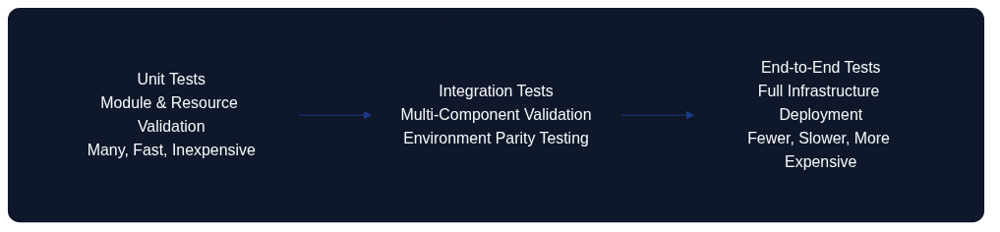
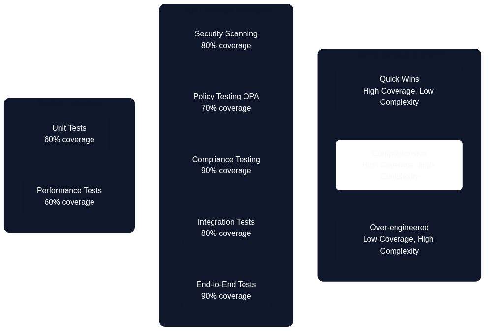

# Testing Strategies for Infrastructure as Code



*Figure 13.1: Architecture as Code Test Pyramid*

A comprehensive testing strategy for Architecture as Code requires multiple testing levels, from unit tests to end-to-end validation. The test pyramid illustrates the structured progression from rapid developer tests to comprehensive integration validation, with each layer serving distinct quality assurance purposes.

## Overview

Testing Infrastructure as Code differs fundamentally from traditional software testing by focusing on architectural configuration, resource compatibility and environmental consistency rather than business logic. Effective Infrastructure as Code testing ensures configurations produce expected results consistently across different environments whilst maintaining security, compliance and cost efficiency.

Modern Infrastructure as Code testing encompasses multiple dimensions: syntactic validation of code, policy compliance checking, cost forecasting, security vulnerability analysis and functional testing of deployed infrastructure. This multilayered approach identifies problems early in the development cycle when they are cheaper and simpler to fix, preventing costly production incidents.

Organisations with strict compliance requirements must implement comprehensive testing that validates both technical functionality and regulatory conformance. This includes GDPR data protection controls, financial services regulations and government security standards that must be verified automatically through policy-as-code frameworks.

Test automation for Infrastructure as Code enables continuous integration and continuous deployment patterns that accelerate delivery whilst reducing the risk of production disruptions. Infrastructure testing pipelines can run in parallel with application testing to ensure end-to-end quality assurance across the entire technology stack.

## Unit Testing for Infrastructure as Code

Unit testing for Infrastructure as Code focuses on validating individual modules and resources without actually deploying infrastructure. This enables rapid feedback and early detection of configuration errors, which is critical for developer productivity and code quality.

Terraform testing tools such as Terratest, terraform-compliance and Checkov enable automated validation of HCL code against predefined policies and Infrastructure as Code best practices. These tools can integrate into IDEs for real-time feedback during development and into CI/CD pipelines for automated quality gates.

### Comparing Pulumi and Terraform Testability

Pulumi's *Testing Infrastructure as Code Programs* guidance (2024, Source [15]) emphasises that defining infrastructure through general-purpose languages lets engineers reuse familiar unit-testing frameworks, wire in Pulumi's provider mocks, and execute assertions locally without touching the cloud. The article demonstrates IaC checks running alongside application suites—`npm test`, `pytest`, or similar—so developers iterate through short feedback loops that encourage test-first habits and reduce the cost of validation.

The same guidance contrasts Pulumi's approach with declarative tools such as Terraform, highlighting that HCL lacks first-class unit-testing hooks and therefore leans on `terraform plan`, Terratest, `terraform test`, and policy-as-code engines to approximate the same assurance. Those options remain valuable, yet they routinely execute against rendered plans or ephemeral infrastructure, so feedback loops tend to stretch towards integration-time cadences rather than the in-IDE iterations Pulumi showcases in Source [15]. In both ecosystems, unit-level checks complement rather than replace integration and end-to-end tests that validate real infrastructure behaviour.

Unit tests for Infrastructure as Code should validate resource configurations, variable validations, output consistency and module interface contracts. This is particularly important for reusable modules that are used across multiple projects, where changes can have wide-ranging impact on dependent resources.

Mock testing strategies for cloud resources enable testing without actual cloud costs, which is essential for frequent testing cycles. Tools such as LocalStack and cloud provider simulators can simulate cloud services locally for comprehensive testing without infrastructure provisioning costs.

## Test Management with Vitest for Infrastructure as Code

Vitest is a modern testing framework built for the Vite ecosystem that offers fast and effective testing of JavaScript/TypeScript code. For Infrastructure as Code projects that use modern tooling, Vitest is particularly relevant for testing configuration generators, validation scripts and automation tools that are often written in TypeScript or JavaScript.

### Why Vitest is Relevant for Infrastructure as Code

Many modern Infrastructure as Code workflows include TypeScript/JavaScript components to generate, validate or transform infrastructure configurations. Vitest enables rapid unit testing of these components with first-class TypeScript support, which is critical to ensure correct configuration generation before deployment.

Vitest's fast execution and watch mode enable tight development feedback loops when developing infrastructure configuration generators or policy validation scripts. This is particularly valuable for Infrastructure as Code projects where configuration errors can lead to costly infrastructure mistakes.

Integration with Vite build tooling means that the same development environment can be used for both application code and infrastructure-related code, which reduces context switching and improves developer experience for teams that work with both application and infrastructure code.

### Configuration of Vitest for Infrastructure as Code Projects

*See Appendix A, Listing 13-A for the complete Vitest configuration example demonstrating test environment setup, coverage requirements and path resolution for Infrastructure as Code projects.*

The configuration should include:

- Node environment for infrastructure tooling
- Coverage requirements (minimum 80% for infrastructure code)
- Extended test timeout for infrastructure operations (30 seconds)
- Exclusion of Terraform directories and build artefacts
- Path aliases for cleaner imports

### Practical Examples for Infrastructure as Code Testing



*Figure 13.2: Infrastructure as Code Testing Strategy Quadrant*

The testing quadrant above illustrates the balance between implementation complexity and testing coverage. Different testing strategies occupy distinct positions, with security scanning and policy testing offering high coverage with moderate complexity, whilst end-to-end tests provide comprehensive coverage at the cost of higher implementation complexity.

#### Example 1: Testing Terraform Configuration Generators

Configuration generators are TypeScript/JavaScript modules that programmatically create Terraform configurations with built-in validation and compliance rules. Testing these generators ensures they produce correct, compliant configurations consistently.

*See Appendix A, Listing 13-B for the complete Terraform configuration generator implementation and Listing 13-C for the corresponding test suite demonstrating GDPR compliance validation, regional restrictions and required tagging policies.*

Key testing patterns for configuration generators include:

- **Compliance validation**: Ensure generated configurations meet regulatory requirements (e.g., EU-only regions for GDPR compliance)
- **Resource configuration**: Validate that generated resources have correct properties and tags
- **Environment-specific logic**: Test that production environments receive enhanced security and redundancy
- **Error conditions**: Verify that invalid inputs trigger appropriate errors

#### Example 2: Testing Infrastructure Validation Scripts

Infrastructure validators are utilities that check existing or planned infrastructure against organisational policies, security standards and compliance requirements before deployment.

*See Appendix A, Listing 13-D for the infrastructure validator implementation and Listing 13-E for the comprehensive test suite covering tag validation, security group rules and data classification policies.*

Critical validation test patterns include:

- **Required tag enforcement**: Ensure all resources have mandatory tags
- **Data classification validation**: Verify correct classification levels and GDPR compliance tags
- **Security group rules**: Block dangerous port configurations open to the internet
- **Warning vs error conditions**: Differentiate between hard failures and advisory warnings

### Integration in CI/CD Pipeline

Vitest integrates seamlessly into CI/CD pipelines for automated testing of infrastructure code. A typical GitHub Actions workflow runs tests on pull requests and pushes, generates coverage reports and provides feedback through automated comments.

*See Appendix A, Listing 13-F for a complete GitHub Actions workflow demonstrating Vitest integration with coverage reporting and PR comments.*

Add test scripts to `package.json`:

```json
{
  "scripts": {
    "test:vitest": "vitest run",
    "test:watch": "vitest watch",
    "test:coverage": "vitest run --coverage",
    "test:ui": "vitest --ui"
  }
}
```

### Recommendations for Test Organisation

**File Structure for Infrastructure Code Tests:**

```
project/
├── src/
│   ├── generators/
│   │   ├── terraform-config.ts
│   │   └── terraform-config.test.ts
│   ├── validators/
│   │   ├── infrastructure-validator.ts
│   │   └── infrastructure-validator.test.ts
│   └── utils/
│       ├── compliance-checker.ts
│       └── compliance-checker.test.ts
├── tests/
│   ├── integration/
│   │   └── end-to-end.test.ts
│   └── fixtures/
│       └── sample-configs.ts
├── vitest.config.ts
└── package.json
```

**Best Practices for Infrastructure Testing with Vitest:**

| Practice | Guideline | Rationale |
|----------|-----------|-----------|
| Fast unit tests | Keep unit tests fast (<100ms per test) | Enables effective watch mode during development, rapid feedback loops |
| Isolated tests | Each test should be independent and run in any order without side effects | Prevents flaky tests, enables parallel execution, improves reliability |
| Descriptive test names | Use clear test descriptions: `'should throw error for non-EU regions'` | Self-documenting tests, easier debugging, better test reports |
| Test fixtures | Use shared test fixtures for common infrastructure configurations | Reduces duplication, ensures consistency, but be cautious with mutable state |
| Coverage goals | Aim for at least 80% code coverage for infrastructure code | Focus on meaningful tests rather than coverage metrics, ensure critical paths tested |
| Mock external dependencies | Use Vitest's mocking capabilities for cloud provider SDKs and external APIs | Faster tests, no cloud costs, deterministic results, enables offline testing |
| Snapshot testing | Use snapshot tests to validate generated configuration files | Catch unintended configuration changes, document expected output structure |

### Automation and Watch Mode

One of Vitest's biggest benefits is watch mode that enables continuous testing during development:

```bash
# Start watch mode for automated re-testing
npm run test:watch

# Run only related tests when files change
npm run test:watch -- --changed

# Run tests with UI for interactive debugging
npm run test:ui
```

This enables tight feedback loops where infrastructure code changes are immediately validated, reducing the time between code change and feedback from seconds to milliseconds.

For organisations with strict compliance requirements, automated testing with Vitest can ensure that infrastructure configurations consistently meet GDPR requirements, security policies and organisational standards before deployment.

## Integration Testing and Environment Validation

Integration testing for Infrastructure as Code verifies that different infrastructure components function together correctly and that deployed infrastructure meets performance and security requirements. This requires temporary test environments that closely mirror production configurations.

End-to-end testing workflows must validate entire deployment pipelines from source code changes to functional infrastructure. This includes testing CI/CD pipeline configurations, secret management, monitoring setup and rollback procedures that are critical for production stability.

Environment parity testing ensures infrastructure behaves consistently across development, staging and production environments. This testing identifies environment-specific issues that can cause deployment failures or performance discrepancies between environments.

Chaos engineering principles can be applied to infrastructure testing by systematically introducing failures in test environments to validate resilience and recovery mechanisms. This is particularly valuable for mission-critical systems that require high availability guarantees.

## Security and Compliance Testing

Security testing for Infrastructure as Code must validate both infrastructure configuration security and operational security controls. This includes scanning for common security misconfigurations, validation of encryption settings and verification of network security policies.

Compliance testing automation ensures infrastructure configurations meet regulatory requirements continuously. Organisations must validate GDPR compliance, financial regulations and government security standards through automated testing that can provide audit trails for compliance reporting.

Policy-as-code frameworks such as Open Policy Agent (OPA) and AWS Config Rules enable declarative definition of compliance policies that can be enforced automatically during infrastructure deployment. This preventative approach is more effective than reactive compliance monitoring.

Vulnerability scanning for infrastructure dependencies must include container images, operating system configurations and third-party software components. Integration with security scanning tools in CI/CD pipelines ensures security vulnerabilities are identified before deployment to production.

## Performance and Scalability Testing

Performance testing for Infrastructure as Code focuses on validation of infrastructure capacity, response times and resource utilisation under various load conditions. This is critical for applications that require predictable performance characteristics under varying traffic patterns.

Load testing strategies must validate auto-scaling configurations, resource limits and failover mechanisms under realistic traffic scenarios. Infrastructure performance testing can include database performance under load, network throughput validation and storage I/O capacity verification.

Scalability testing verifies that infrastructure can handle projected growth efficiently through automated scaling mechanisms. This includes testing horizontal scaling for stateless services and validation of data partitioning strategies for stateful systems.

Capacity planning validation through performance testing helps optimise resource configurations for cost-effectiveness whilst performance requirements are met. This is particularly important for organisations that balance cost optimisation with service level requirements.

## Requirements as Code and Testability


*Figure 13.3: Requirements as Code - Traceability from Business Requirements to Infrastructure Tests*

The diagram above illustrates the relationship between business requirements, functional requirements and verification methods. This demonstrates how Architecture as Code enables traceable testing from higher abstraction levels down to concrete Infrastructure as Code implementations, creating a direct link between business objectives and technical validation.

Requirements as Code represents a paradigm shift where business requirements and compliance requirements are codified in machine-readable form alongside infrastructure code. This enables automated validation that infrastructure genuinely meets specified requirements throughout the entire development lifecycle.

By defining Requirements as Code, a direct connection is created between business requirements, functional requirements and the automated tests that verify Infrastructure as Code implementations. This traceability is critical for organisations that must demonstrate compliance and for development teams that need to understand business consequences of technical decisions.

### Requirement Traceability in Practice

Requirements traceability for Infrastructure as Code means that each infrastructure component can be linked back to specific business requirements or compliance requirements. This is particularly important for organisations that must meet GDPR, financial regulations or government requirements.

Tools such as Open Policy Agent (OPA) enable expression of compliance requirements as policies that can be evaluated automatically against infrastructure configurations. These policies become testable requirements that can run continuously to ensure ongoing compliance.

Requirement validation testing ensures infrastructure is not only technically correct but also meets business intent. This includes validation of security requirements, performance requirements, accessibility requirements and cost constraints as defined by business stakeholders.

### Automated Requirements Verification

*See Appendix A, Listing 13-G for a complete requirements verification framework demonstrating how to define requirements in YAML format with associated test specifications, compliance mappings and priority levels.*

The requirements framework should include:

- Requirement metadata (ID, description, priority, compliance standards)
- Test specifications for each requirement
- Automated validation logic
- Compliance coverage reporting
- Audit trail generation

*See Appendix A, Listing 13-H for the Python implementation of the requirements validator that executes tests and generates compliance reports.*

## Practical Examples

### Terraform Unit Testing with Terratest

*See Appendix A, Listing 13-I for a comprehensive Terratest example demonstrating testing of Terraform infrastructure with GDPR compliance validation, data residency requirements and organisational tagging standards for regulated environments.*

The Terratest framework enables:

- Parallel test execution for faster feedback
- Real infrastructure deployment and validation
- Comprehensive validation of deployed resources
- Automated cleanup after test completion
- Integration with cloud provider SDKs for validation

### Policy-as-Code Testing with OPA

*See Appendix A, Listing 13-J for Open Policy Agent (OPA) test examples demonstrating validation of S3 bucket encryption, EC2 security group requirements and GDPR data classification compliance.*

OPA testing patterns include:

- Declarative policy definitions in Rego language
- Unit tests for individual policy rules
- Integration with Terraform plan outputs
- Automated policy enforcement in CI/CD pipelines

## Kubernetes Integration Testing

### Kubernetes Infrastructure Testing

*See Appendix A, Listing 13-K for a comprehensive Kubernetes infrastructure test suite demonstrating validation of resource quotas, pod security policies, network policies and GDPR-compliant persistent volume encryption.*

Kubernetes infrastructure testing patterns include:

- Resource quota and limit validation
- Pod Security Policy enforcement verification
- Network policy isolation testing
- Persistent volume encryption validation
- RBAC permission testing
- Compliance requirement validation

The test suite should run as a Kubernetes Job that validates cluster configuration against organisational policies and regulatory requirements, ensuring that all deployed resources meet security and compliance standards.

## Pipeline Automation for Infrastructure Testing

### CI/CD Pipeline for Infrastructure Testing

*See Appendix A, Listing 13-L for a comprehensive GitHub Actions workflow demonstrating infrastructure testing pipeline with static analysis, unit testing, integration testing, compliance validation and performance testing stages.*

A complete infrastructure testing pipeline should include:

**Static Analysis Stage:**
- Terraform format checking
- Terraform validation
- Security scanning with Checkov
- Policy testing with OPA

**Unit Testing Stage:**
- Terratest unit tests
- Mock provider testing
- Configuration validation

**Integration Testing Stage:**
- Temporary environment deployment
- End-to-end infrastructure validation
- Automated cleanup

**Compliance Validation Stage:**
- GDPR compliance checking
- Data encryption verification
- Regional compliance validation
- Security standards verification

**Performance Testing Stage:**
- Load testing of auto-scaling configurations
- Cost analysis and budget validation
- Resource utilisation verification

Each stage should provide clear feedback and block deployment on critical failures whilst allowing warnings to proceed with appropriate notifications.

## Summary

Comprehensive testing strategies for Infrastructure as Code are essential to ensure reliable, secure and cost-effective infrastructure deployments. A well-designed test pyramid with unit tests, integration tests and end-to-end validation can dramatically reduce production issues and improve developer confidence.

Modern Infrastructure as Code testing encompasses multiple layers:

- **Unit testing** with tools like Terratest and Vitest provides rapid feedback on configuration correctness
- **Integration testing** validates that components work together in realistic environments
- **Security and compliance testing** ensures regulatory requirements are met automatically
- **Performance testing** validates infrastructure can handle expected loads efficiently
- **Requirements as Code** provides traceability from business needs to technical implementation

Organisations must particularly focus on compliance testing that validates GDPR requirements, financial regulations and government security standards. Automated policy testing with tools such as OPA enables continuous compliance verification without manual overhead.

Investment in robust Infrastructure as Code testing frameworks pays off through reduced production incidents, faster development cycles and improved regulatory compliance. Modern testing tools and cloud-native testing strategies enable comprehensive validation without prohibitive costs or complexity.

The testing quadrant diagram (Figure 13.2) illustrates how different testing strategies balance implementation complexity against testing coverage, helping teams prioritise their testing investments. Security scanning and policy testing offer high coverage with moderate implementation effort, making them ideal early investments, whilst end-to-end testing provides comprehensive validation at higher implementation cost.

## Sources and References

- Terratest Documentation. "Infrastructure Testing for Terraform." Gruntwork, 2024.
- Open Policy Agent. "Policy Testing Best Practices for Infrastructure as Code." CNCF OPA Project, 2024.
- AWS. "Infrastructure Testing Strategy Guide." Amazon Web Services, 2024.
- Kubernetes. "Testing Infrastructure and Applications." Kubernetes Documentation, 2024.
- NIST. "Security Testing for Cloud Infrastructure." NIST Cybersecurity Framework, 2024.
- CSA. "Cloud Security Testing Guidelines." Cloud Security Alliance, 2024.
- Vitest. "Next Generation Testing Framework." Vitest Documentation, 2024.
