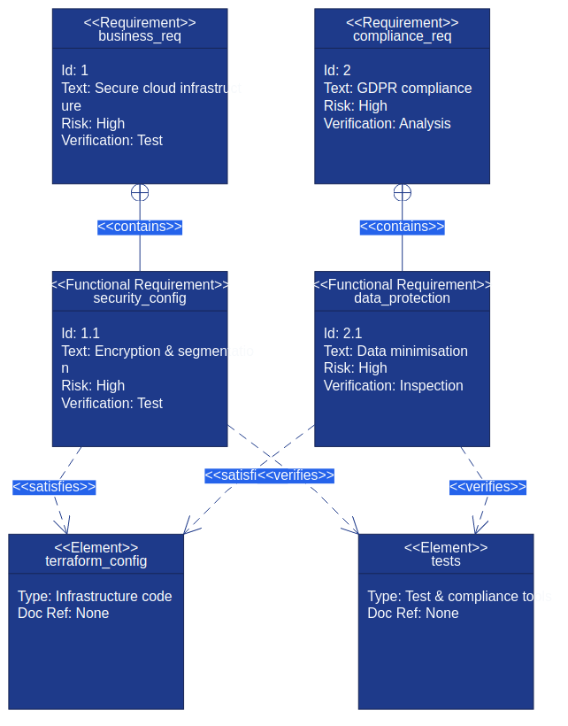

# Teststrategier för infrastruktukod


*Omfattande teststrategi för Infrastructure as Code kräver multiple testing-nivåer från unit tests till end-to-end validation. Diagrammet illustrerar det strukturerade förloppet från snabba utvecklartester till omfattande integrationsvalidering.*

## Övergripande beskrivning

Testning av Infrastructure as Code skiljer sig fundamentalt från traditionell mjukvarutestning genom att fokusera på infrastrukturkonfiguration, resurskompatibilitet och miljökonsekvens istället för affärslogik. Effective IaC-testing säkerställer att infrastrukturkod producerar förväntade resultat konsekvent across olika miljöer.

Modern IaC-testning omfattar flera dimensioner: syntaktisk validering av kod, policy compliance checking, kostnadsprognoser, säkerhetssårbarhetanalys och functional testing av deployed infrastruktur. Denna multilevel approach identifierar problem tidigt i utvecklingscykeln när de är billigare och enklare att fixa.

Svenska organisationer med strikta compliance-krav måste implementera comprehensive testing som validerar både teknisk funktionalitet och regulatory conformance. Detta inkluderar GDPR data protection controls, financial services regulations och government security standards som måste verifieras automatiskt.

Test automation for IaC möjliggör continuous integration och continuous deployment patterns som accelererar delivery samtidigt som de minskar risk för produktionsstörningar. Infrastructure testing pipelines kan köra parallellt med application testing för att säkerställa end-to-end quality assurance.

## Unit testing för infrastrukturkod

Unit testing för Infrastructure as Code fokuserar på validation av enskilda moduler och resources utan att faktiskt deploya infrastruktur. Detta möjliggör snabb feedback och early detection av konfigurationsfel, vilket är kritiskt för developer productivity och code quality.

Terraform testing verktyg som Terratest, terraform-compliance och checkov möjliggör automated validation av HCL-kod mot predefined policies och best practices. Dessa verktyg kan integreras i IDE:er för real-time feedback under development samt i CI/CD pipelines för automated quality gates.

Unit tests för IaC bör validera resource configurations, variable validations, output consistency och module interface contracts. Detta är särskilt viktigt för reusable modules som används across multiple projects där förändringar kan ha wide-ranging impact på dependent resources.

Mock testing strategies för cloud resources möjliggör testing utan faktiska cloud costs, vilket är essentiellt för frequent testing cycles. Verktyg som LocalStack och cloud provider simulators kan simulate cloud services locally för comprehensive testing utan infrastructure provisioning costs.

## Integrationstesting och miljövalidering

Integration testing för Infrastructure as Code verifierar att different infrastructure components fungerar tillsammans korrekt och att deployed infrastruktur möter performance och security requirements. Detta kräver temporary test environments som closely mirror production configurations.

End-to-end testing workflows måste validate hela deployment pipelines från source code changes till functional infrastructure. Detta inkluderar testing av CI/CD pipeline configurations, secret management, monitoring setup och rollback procedures som är critical för production stability.

Environment parity testing säkerställer att infrastructure behaves consistently across development, staging och production miljöer. Denna testing identifierar environment-specific issues som kan orsaka deployment failures eller performance discrepancies mellan miljöer.

Chaos engineering principles kan appliceras på infrastructure testing genom att systematiskt introduce failures i test environments för att validate resilience och recovery mechanisms. Detta är särskilt värdefullt för mission-critical systems som kräver high availability guarantees.

## Security och compliance testing

Security testing för Infrastructure as Code måste validate både infrastructure configuration security och operational security controls. Detta inkluderar scanning för common security misconfigurations, valdation av encryption settings och verification av network security policies.

Compliance testing automation säkerställer att infrastructure configurations möter regulatory requirements kontinuerligt. Svenska organisationer måste validate GDPR compliance, financial regulations och government security standards through automated testing som kan provide audit trails för compliance reporting.

Policy-as-code frameworks som Open Policy Agent (OPA) och AWS Config Rules möjliggör declarative definition av compliance policies som kan enforced automatically under infrastructure deployment. Detta preventative approach är mer effective än reactive compliance monitoring.

Vulnerability scanning för infrastructure dependencies måste include container images, operating system configurations och third-party software components. Integration med security scanning tools i CI/CD pipelines ensures att security vulnerabilities identifieras innan deployment till production.

## Performance och skalbarhetstesting

Performance testing för Infrastructure as Code fokuserar på validation av infrastructure capacity, response times och resource utilization under various load conditions. Detta är critical för applications som kräver predictable performance characteristics under varying traffic patterns.

Load testing strategies måste validate auto-scaling configurations, resource limits och failover mechanisms under realistic traffic scenarios. Infrastructure performance testing kan include database performance under load, network throughput validation och storage I/O capacity verification.

Skalabilitetstesting verifierar att infrastructure kan handle projected growth efficiently through automated scaling mechanisms. Detta inkluderar testing av horizontal scaling för stateless services och validation av data partitioning strategies för stateful systems.

Capacity planning validation genom performance testing hjälper optimize resource configurations för cost-effectiveness samtidigt som performance requirements uppfylls. Detta är särskilt important för svenska organisationer som balanserar cost optimization med service level requirements.

## Krav som kod och testbarhet



*Relationen mellan affärskrav, funktionella krav och verifieringsmetoder illustrerar hur Infrastructure as Code möjliggör spårbar testning från högre abstraktionsnivåer ner till konkreta implementationer.*

Requirements-as-Code representerar ett paradigmskifte där affärskrav och compliance-krav kodifieras i maskinläsbar form tillsammans med infrastructure-koden. Detta möjliggör automatiserad validering av att infrastrukturen verkligen uppfyller de specificerade kraven genom hela utvecklingslivscykeln.

Genom att definiera krav som kod skapas en direkt koppling mellan business requirements, functional requirements och de automatiserade tester som verifierar implementationen. Denna traceability är kritisk för organisationer som måste demonstrera compliance och för utvecklingsteam som behöver förstå affärskonsekvenserna av tekniska beslut.

### Kravspårbarhet i praktiken

Requirements traceability för Infrastructure as Code innebär att varje infrastrukturkomponent kan kopplas tillbaka till specifika affärskrav eller compliance-krav. Detta är särskilt viktigt för svenska organisationer som måste uppfylla GDPR, finansiella regleringar eller myndighetskrav.

Verktyg som Open Policy Agent (OPA) möjliggör uttryck av compliance-krav som policies som kan evalueras automatiskt mot infrastructure-konfigurationer. Dessa policies blir testable requirements som kan köras kontinuerligt för att säkerställa ongoing compliance.

Requirement validation testing säkerställer att infrastructure inte bara är tekniskt korrekt utan också uppfyller business intent. Detta inkluderar validering av säkerhetskrav, performance-krav, tillgänglighetskrav och kostnadsramar som defined av business stakeholders.

### Automated Requirements Verification

```yaml
# requirements/security-requirements.yaml
apiVersion: policy/v1
kind: RequirementSet
metadata:
  name: swedish-security-requirements
  version: "1.0"
spec:
  requirements:
    - id: SEC-001
      type: security
      description: "Alla S3 buckets måste ha kryptering aktiverad"
      priority: critical
      compliance: ["GDPR", "ISO27001"]
      tests:
        - type: static-analysis
          tool: checkov
          rule: CKV_AWS_141
        - type: runtime-test
          script: test_s3_encryption.py
    
    - id: SEC-002  
      type: security
      description: "RDS instanser måste använda encrypted storage"
      priority: critical
      compliance: ["GDPR"]
      tests:
        - type: terraform-test
          file: test_rds_encryption_test.go
        - type: policy-test
          file: rds_encryption.rego
          
    - id: PERF-001
      type: performance
      description: "Auto-scaling måste vara konfigurerat för production workloads"
      priority: high
      tests:
        - type: integration-test
          file: test_autoscaling_integration.py
        - type: load-test
          tool: k6
          script: autoscaling_load_test.js
```

```python
# test/requirements_validation.py
"""
Automatiserad validering av krav mot Infrastructure as Code
"""
import yaml
import subprocess
import json
from typing import Dict, List, Any

class RequirementValidator:
    def __init__(self, requirements_file: str):
        with open(requirements_file, 'r') as f:
            self.requirements = yaml.safe_load(f)
    
    def validate_all_requirements(self) -> Dict[str, Any]:
        """Kör alla krav-relaterade tester och sammanställ resultat"""
        results = {
            'passed': [],
            'failed': [],
            'skipped': [],
            'summary': {}
        }
        
        for req in self.requirements['spec']['requirements']:
            req_id = req['id']
            print(f"Validerar krav {req_id}: {req['description']}")
            
            req_result = self._validate_requirement(req)
            
            if req_result['status'] == 'passed':
                results['passed'].append(req_result)
            elif req_result['status'] == 'failed':
                results['failed'].append(req_result)
            else:
                results['skipped'].append(req_result)
        
        results['summary'] = {
            'total': len(self.requirements['spec']['requirements']),
            'passed': len(results['passed']),
            'failed': len(results['failed']),
            'skipped': len(results['skipped']),
            'compliance_coverage': self._calculate_compliance_coverage()
        }
        
        return results
    
    def _validate_requirement(self, requirement: Dict) -> Dict[str, Any]:
        """Validera ett enskilt krav genom att köra associerade tester"""
        req_id = requirement['id']
        test_results = []
        
        for test in requirement.get('tests', []):
            test_result = self._execute_test(test, req_id)
            test_results.append(test_result)
        
        # Avgör overall status för kravet
        if all(t['passed'] for t in test_results):
            status = 'passed'
        elif any(t['passed'] == False for t in test_results):
            status = 'failed'
        else:
            status = 'skipped'
        
        return {
            'requirement_id': req_id,
            'description': requirement['description'],
            'priority': requirement['priority'],
            'compliance': requirement.get('compliance', []),
            'status': status,
            'test_results': test_results
        }
    
    def _execute_test(self, test_config: Dict, req_id: str) -> Dict[str, Any]:
        """Exekvera ett specifikt test baserat på dess typ"""
        test_type = test_config['type']
        
        if test_type == 'static-analysis':
            return self._run_static_analysis_test(test_config, req_id)
        elif test_type == 'terraform-test':
            return self._run_terraform_test(test_config, req_id)
        elif test_type == 'policy-test':
            return self._run_policy_test(test_config, req_id)
        elif test_type == 'integration-test':
            return self._run_integration_test(test_config, req_id)
        elif test_type == 'load-test':
            return self._run_load_test(test_config, req_id)
        else:
            return {
                'test_type': test_type,
                'passed': None,
                'message': f'Okänd testtyp: {test_type}',
                'requirement_id': req_id
            }
    
    def _run_static_analysis_test(self, test_config: Dict, req_id: str) -> Dict[str, Any]:
        """Kör static analysis test med Checkov"""
        tool = test_config.get('tool', 'checkov')
        rule = test_config.get('rule')
        
        try:
            cmd = f"{tool} --check {rule} --directory terraform/ --output json"
            result = subprocess.run(cmd.split(), capture_output=True, text=True)
            
            if result.returncode == 0:
                return {
                    'test_type': 'static-analysis',
                    'tool': tool,
                    'rule': rule,
                    'passed': True,
                    'message': 'Static analysis passed',
                    'requirement_id': req_id
                }
            else:
                return {
                    'test_type': 'static-analysis', 
                    'tool': tool,
                    'rule': rule,
                    'passed': False,
                    'message': f'Static analysis failed: {result.stderr}',
                    'requirement_id': req_id
                }
        except Exception as e:
            return {
                'test_type': 'static-analysis',
                'passed': None,
                'message': f'Error running static analysis: {str(e)}',
                'requirement_id': req_id
            }
    
    def _calculate_compliance_coverage(self) -> Dict[str, float]:
        """Beräkna compliance coverage för olika regleringar"""
        compliance_mapping = {}
        
        for req in self.requirements['spec']['requirements']:
            for compliance in req.get('compliance', []):
                if compliance not in compliance_mapping:
                    compliance_mapping[compliance] = {'total': 0, 'tested': 0}
                
                compliance_mapping[compliance]['total'] += 1
                
                if req.get('tests'):
                    compliance_mapping[compliance]['tested'] += 1
        
        coverage = {}
        for compliance, stats in compliance_mapping.items():
            if stats['total'] > 0:
                coverage[compliance] = stats['tested'] / stats['total'] * 100
            else:
                coverage[compliance] = 0
        
        return coverage
```

## Praktiska exempel

### Terraform Unit Testing med Terratest
```go
// test/terraform_test.go
package test

import (
    "testing"
    "github.com/gruntwork-io/terratest/modules/terraform"
    "github.com/gruntwork-io/terratest/modules/test-structure"
    "github.com/stretchr/testify/assert"
    "github.com/stretchr/testify/require"
)

func TestTerraformSwedishInfrastructure(t *testing.T) {
    t.Parallel()

    // Sätt upp test environment
    terraformDir := "../terraform/swedish-infrastructure"
    
    // Generera unik suffix för test resources
    uniqueId := test-structure.UniqueId()
    
    terraformOptions := &terraform.Options{
        TerraformDir: terraformDir,
        Vars: map[string]interface{}{
            "environment":      "test",
            "project_name":     "iac-test-" + uniqueId,
            "region":          "eu-north-1", // Stockholm för svenska krav
            "enable_gdpr_logs": true,
            "data_classification": "internal",
        },
        BackendConfig: map[string]interface{}{
            "bucket": "terraform-state-test-" + uniqueId,
            "region": "eu-north-1",
        },
    }

    // Cleanup resources efter test
    defer terraform.Destroy(t, terraformOptions)

    // Kör terraform init och plan
    terraform.InitAndPlan(t, terraformOptions)

    // Validera att plan innehåller förväntade resources
    planStruct := terraform.InitAndPlanAndShowWithStruct(t, terraformOptions)
    
    // Test: Validera att alla resurser har korrekta tags
    for _, resource := range planStruct.PlannedValues.RootModule.Resources {
        if resource.Type == "aws_instance" || resource.Type == "aws_rds_instance" {
            tags := resource.AttributeValues["tags"].(map[string]interface{})
            
            assert.Equal(t, "iac-test-" + uniqueId, tags["Project"])
            assert.Equal(t, "test", tags["Environment"])
            assert.Equal(t, "internal", tags["DataClassification"])
            
            // Validera GDPR compliance tags
            assert.Contains(t, tags, "GdprApplicable")
            assert.Contains(t, tags, "DataRetention")
        }
    }

    // Test: Validera säkerhetskonfiguration
    for _, resource := range planStruct.PlannedValues.RootModule.Resources {
        if resource.Type == "aws_s3_bucket" {
            // Validera att S3 buckets har encryption enabled
            encryption := resource.AttributeValues["server_side_encryption_configuration"]
            assert.NotNil(t, encryption, "S3 bucket måste ha encryption konfigurerad")
        }
        
        if resource.Type == "aws_rds_instance" {
            // Validera att RDS instances har encryption at rest
            encrypted := resource.AttributeValues["storage_encrypted"].(bool)
            assert.True(t, encrypted, "RDS instans måste ha storage encryption aktiverad")
        }
    }

    // Kör terraform apply
    terraform.Apply(t, terraformOptions)

    // Test: Validera faktiska infrastructure deployment
    validateInfrastructureDeployment(t, terraformOptions, uniqueId)
}

func validateInfrastructureDeployment(t *testing.T, terraformOptions *terraform.Options, uniqueId string) {
    // Hämta outputs från terraform
    vpcId := terraform.Output(t, terraformOptions, "vpc_id")
    require.NotEmpty(t, vpcId, "VPC ID ska inte vara tom")

    dbEndpoint := terraform.Output(t, terraformOptions, "database_endpoint")
    require.NotEmpty(t, dbEndpoint, "Database endpoint ska inte vara tom")

    // Test: Validera nätverkskonfiguration
    validateNetworkConfiguration(t, vpcId)
    
    // Test: Validera database connectivity
    validateDatabaseConnectivity(t, dbEndpoint)
    
    // Test: Validera monitoring och logging
    validateMonitoringSetup(t, terraformOptions)
}

func validateNetworkConfiguration(t *testing.T, vpcId string) {
    // Implementation för nätverksvalidering
    // Kontrollera subnets, routing tables, security groups etc.
}

func validateDatabaseConnectivity(t *testing.T, endpoint string) {
    // Implementation för databasconnectivity testing
    // Kontrollera att databas är accessible och responsiv
}

func validateMonitoringSetup(t *testing.T, terraformOptions *terraform.Options) {
    // Implementation för monitoring validation
    // Kontrollera CloudWatch metrics, alarms, logging etc.
}
```

### Policy-as-Code Testing med OPA
```rego
# policies/aws_security_test.rego
package aws.security.test

import rego.v1

# Test: S3 Buckets måste ha encryption
test_s3_encryption_required if {
    input_s3_without_encryption := {
        "resource_type": "aws_s3_bucket",
        "attributes": {
            "bucket": "test-bucket",
            "server_side_encryption_configuration": null
        }
    }
    
    not aws.security.s3_encryption_required with input as input_s3_without_encryption
}

test_s3_encryption_allowed if {
    input_s3_with_encryption := {
        "resource_type": "aws_s3_bucket", 
        "attributes": {
            "bucket": "test-bucket",
            "server_side_encryption_configuration": [{
                "rule": [{
                    "apply_server_side_encryption_by_default": [{
                        "sse_algorithm": "AES256"
                    }]
                }]
            }]
        }
    }
    
    aws.security.s3_encryption_required with input as input_s3_with_encryption
}

# Test: EC2 instances måste ha säkerhetgrupper konfigurerade
test_ec2_security_groups_required if {
    input_ec2_without_sg := {
        "resource_type": "aws_instance",
        "attributes": {
            "instance_type": "t3.micro",
            "vpc_security_group_ids": []
        }
    }
    
    not aws.security.ec2_security_groups_required with input as input_ec2_without_sg
}

# Test: Svenska GDPR compliance
test_gdpr_data_classification_required if {
    input_without_classification := {
        "resource_type": "aws_rds_instance",
        "attributes": {
            "tags": {
                "Environment": "production",
                "Project": "customer-app"
            }
        }
    }
    
    not sweden.gdpr.data_classification_required with input as input_without_classification
}

test_gdpr_data_classification_valid if {
    input_with_classification := {
        "resource_type": "aws_rds_instance",
        "attributes": {
            "tags": {
                "Environment": "production", 
                "Project": "customer-app",
                "DataClassification": "personal",
                "GdprApplicable": "true",
                "DataRetention": "7years"
            }
        }
    }
    
    sweden.gdpr.data_classification_required with input as input_with_classification
}
```

## Kubernetes integrationstestning

### Kubernetes Infrastructure Testing
```yaml
# test/k8s-test-suite.yaml
apiVersion: v1
kind: ConfigMap
metadata:
  name: infrastructure-tests
  namespace: testing
data:
  test-runner.sh: |
    #!/bin/bash
    set -e
    
    echo "Starting Infrastructure as Code testing för Kubernetes..."
    
    # Test 1: Validera resource quotas
    echo "Testing resource quotas..."
    kubectl get resourcequota -n production -o json | \
    jq '.items[0].status.used | to_entries[] | select(.value == "0")' | \
    if [ $(wc -l) -gt 0 ]; then
      echo "WARNING: Unused resource quotas detected"
    fi
    
    # Test 2: Validera security policies
    echo "Testing Pod Security Policies..."
    kubectl get psp | grep -E "(privileged|hostNetwork)" && \
    echo "ERROR: Privileged security policies detected" && exit 1
    
    # Test 3: Validera network policies
    echo "Testing Network Policies..."
    NAMESPACES=$(kubectl get ns --no-headers -o custom-columns=":metadata.name")
    for ns in $NAMESPACES; do
      if [ "$ns" != "kube-system" ] && [ "$ns" != "kube-public" ]; then
        if ! kubectl get networkpolicy -n $ns --no-headers 2>/dev/null | grep -q .; then
          echo "WARNING: No network policies in namespace $ns"
        fi
      fi
    done
    
    # Test 4: Validera svenska compliance krav
    echo "Testing GDPR compliance för persistent volumes..."
    kubectl get pv -o json | \
    jq -r '.items[] | select(.spec.csi.driver == "ebs.csi.aws.com") | 
           select(.spec.csi.volumeAttributes.encrypted != "true") | 
           .metadata.name' | \
    if [ $(wc -l) -gt 0 ]; then
      echo "ERROR: Unencrypted persistent volumes detected"
      exit 1
    fi
    
    echo "All infrastructure tests passed!"
```

```yaml
---
apiVersion: batch/v1
kind: Job
metadata:
  name: infrastructure-test-job
  namespace: testing
spec:
  template:
    spec:
      containers:
      - name: test-runner
        image: bitnami/kubectl:latest
        command: ["/bin/bash"]
        args: ["/scripts/test-runner.sh"]
        volumeMounts:
        - name: test-scripts
          mountPath: /scripts
        env:
        - name: KUBECONFIG
          value: /etc/kubeconfig/config
      volumes:
      - name: test-scripts
        configMap:
          name: infrastructure-tests
          defaultMode: 0755
      - name: kubeconfig
        secret:
          secretName: kubeconfig
      restartPolicy: Never
  backoffLimit: 3
```

## Pipeline automation för infrastrukturtestning

### CI/CD Pipeline för Infrastructure Testing
```yaml
# .github/workflows/infrastructure-testing.yml
name: Infrastructure Testing Pipeline

on:
  pull_request:
    paths: 
      - 'terraform/**'
      - 'kubernetes/**'
      - 'policies/**'
  push:
    branches: [main, develop]

jobs:
  static-analysis:
    runs-on: ubuntu-latest
    name: Static Code Analysis
    steps:
      - uses: actions/checkout@v4
      
      - name: Terraform Format Check
        run: terraform fmt -check -recursive terraform/
        
      - name: Terraform Validation
        run: |
          cd terraform
          terraform init -backend=false
          terraform validate
          
      - name: Security Scanning med Checkov
        uses: bridgecrewio/checkov-action@master
        with:
          directory: terraform/
          framework: terraform
          output_format: cli,sarif
          output_file_path: reports/checkov-report.sarif
          
      - name: Policy Testing med OPA
        run: |
          # Installera OPA
          curl -L -o opa https://openpolicyagent.org/downloads/v0.57.0/opa_linux_amd64_static
          chmod +x opa
          
          # Kör policy tests
          ./opa test policies/

  unit-testing:
    runs-on: ubuntu-latest
    name: Unit Testing med Terratest
    steps:
      - uses: actions/checkout@v4
      
      - name: Setup Go
        uses: actions/setup-go@v4
        with:
          go-version: '1.21'
          
      - name: Install Dependencies
        run: |
          cd test
          go mod download
          
      - name: Run Unit Tests
        run: |
          cd test
          go test -v -timeout 30m
        env:
          AWS_DEFAULT_REGION: eu-north-1
          TF_VAR_test_mode: true

  integration-testing:
    runs-on: ubuntu-latest
    name: Integration Testing
    if: github.event_name == 'push'
    needs: [static-analysis, unit-testing]
    steps:
      - uses: actions/checkout@v4
      
      - name: Configure AWS Credentials
        uses: aws-actions/configure-aws-credentials@v4
        with:
          aws-access-key-id: ${{ secrets.AWS_ACCESS_KEY_ID }}
          aws-secret-access-key: ${{ secrets.AWS_SECRET_ACCESS_KEY }}
          aws-region: eu-north-1
          
      - name: Deploy Test Infrastructure
        run: |
          cd terraform/test-environment
          terraform init
          terraform plan -var="test_run_id=${{ github.run_id }}"
          terraform apply -auto-approve -var="test_run_id=${{ github.run_id }}"
          
      - name: Run Integration Tests
        run: |
          cd test/integration
          go test -v -timeout 45m -tags=integration
          
      - name: Cleanup Test Infrastructure
        if: always()
        run: |
          cd terraform/test-environment
          terraform destroy -auto-approve -var="test_run_id=${{ github.run_id }}"

  compliance-validation:
    runs-on: ubuntu-latest
    name: Compliance Validation
    steps:
      - uses: actions/checkout@v4
      
      - name: GDPR Compliance Check
        run: |
          # Kontrollera att alla databaser har encryption
          grep -r "storage_encrypted.*=.*true" terraform/ || \
          (echo "ERROR: Icke-krypterade databaser upptäckta" && exit 1)
          
          # Kontrollera data classification tags
          grep -r "DataClassification" terraform/ || \
          (echo "ERROR: Data classification tags saknas" && exit 1)
          
      - name: Swedish Security Standards
        run: |
          # MSB säkerhetskrav för kritisk infrastruktur
          ./scripts/msb-compliance-check.sh terraform/
          
          # Validera att svenska regioner används
          if grep -r "us-" terraform/ --include="*.tf"; then
            echo "WARNING: Amerikanska regioner upptäckta - kontrollera datasuveränitet"
          fi

  performance-testing:
    runs-on: ubuntu-latest
    name: Performance Testing
    if: contains(github.event.pull_request.title, 'performance') || github.ref == 'refs/heads/main'
    steps:
      - uses: actions/checkout@v4
      
      - name: Infrastructure Performance Tests
        run: |
          # Kör load tests mot test infrastruktur
          cd test/performance
          ./run-load-tests.sh
          
      - name: Cost Analysis
        run: |
          # Beräkna förvänkade kostnader för infrastructure changes
          ./scripts/cost-analysis.sh terraform/
```

## Sammanfattning

Comprehensive testing strategies för Infrastructure as Code är essential för att säkerställa reliable, secure och cost-effective infrastructure deployments. En väl designad test pyramid med unit tests, integration tests och end-to-end validation kan dramatiskt reducera production issues och förbättra developer confidence.

Svenska organisationer måste särskilt fokusera på compliance testing som validates GDPR requirements, financial regulations och government security standards. Automated policy testing med verktyg som OPA möjliggör continuous compliance verification utan manual overhead.

Investment i robust IaC testing frameworks pays off genom reduced production incidents, faster development cycles och improved regulatory compliance. Modern testing verktyg och cloud-native testing strategies möjliggör comprehensive validation utan prohibitive costs eller complexity.

## Källor och referenser

- Terratest Documentation. "Infrastructure Testing for Terraform." Gruntwork, 2023.
- Open Policy Agent. "Policy Testing Best Practices." CNCF OPA Project, 2023.
- AWS. "Infrastructure Testing Strategy Guide." Amazon Web Services, 2023.
- Kubernetes. "Testing Infrastructure och Applications." Kubernetes Documentation, 2023.
- NIST. "Security Testing for Cloud Infrastructure." NIST Cybersecurity Framework, 2023.
- CSA. "Cloud Security Testing Guidelines." Cloud Security Alliance, 2023.