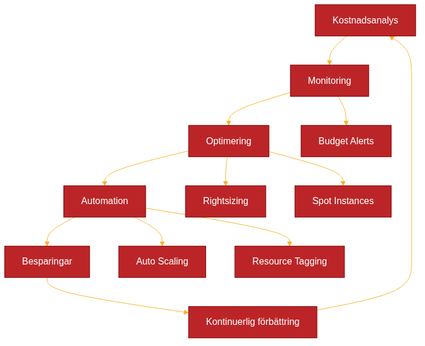

# Cost Optimization and Resource Management



*Effektiv kostnadsoptimering within Infrastructure as Code (Architecture as Code) requires systematisk monitoring, automatiserad resurshantering and kontinuerlig optimering. Diagrammet shows the iterativa forloppet from initial kostnadsanalys to implementation of besparingsstrategier.*

## Övergripande beskrivning

Kostnadsoptimering utgör a kritisk komponent in Infrastructure as Code-implementeringar, särskilt when organisationer migrerar to molnbaserade lösningar. Utan korrekt kostnadshantering can molnkostnader snabbt eskalera and undergräva the ekonomiska Benefitsna with Architecture as Code.

Moderna molnleverantörer erbjuder pay-as-you-use modor which can vara both fordelaktiga and riskfyllda. Architecture as Code enables exakt kontroll over resursallokering and automatiserad kostnadsoptimering through policy-driven resource management and intelligent skalning.

Svenska organisationer står infor unika Challenges when the gäller molnkostnader, including valutafluktuationer, regulatoriska krav which påverkar datalagring, and behovet of to balansera kostnadseffektivitet with prestanda and säkerhet. Architecture as Code-baserade lösningar erbjuder verktyg for to addressera These Challenges systematiskt.

successful kostnadsoptimering requires kombination of tekniska verktyg, organizational processes and kulturforändringar which främjar cost-awareness bland utvecklings- and driftteam. This includes Architecture as Code-implementation of FinOps-praktiker which integrerar finansiell accountability in entire utvecklingslivscykeln.

## FinOps and cost governance

FinOps representerar a växande disciplin which kombinerar finansiell hantering with molnoperationer for to maximera affärsvärdet of molninvesteringar. Within Architecture as Code-kontext means This to integrera kostnadshänsyn direkt in infraStructuredefinitionerna and deployment-processerna.

Governance-ramverk for kostnadshantering must omfatta automatiserade policies for resurskonfiguration, budget-alerts and regelbunden kostnadsanalys. Terraform Enterprise, AWS Cost Management and Azure Cost Management erbjuder API:er which can integreras in Architecture as Code-workflows for real-time kostnadskontroll.

Svenska organisationer must också hantera compliance-krav which påverkar kostnadsoptimering, såwhich GDPR-relaterade datalagringskrav which can begränsa möjligheten to använda vissa geografiska regioner with lägre priser. Architecture as Code-baserade compliance-policies can automatisera These begränsningar simultaneously which the optimerar kostnader within toåtna parametrar.

implementation of cost allocation tags and chargeback-modor through Architecture as Code enables transparent kostnadsdistribution mellan olika team, projekt and affärsenheter. This creates incitament for Developers to göra kostnadsmässigt optimala designbeslut.

## Automatisk resursskalning and rightsizing

Automatisk resursskalning utgör kärnan in kostnadseffektiv Infrastructure as Code. Through to definiera skalningsregler baserade at faktiska användningsmönster can organisationer undvika over-provisionering simultaneously which the ensures adekvat prestanda.

Kubernetes Horizontal Pod Autoscaler (HPA) and Vertical Pod Autoscaler (VPA) can konfigureras through Architecture as Code for to automatically justera resursallokering baserat at CPU-, minnes- and custom metrics. This is särskilt värdefullt for svenska organisationer with tydliga arbetstidsmönster which enables forutsägbar scaling.

Cloud-leverantörer erbjuder rightsizing-Recommendations baserade at historisk användning, men These must integreras in Architecture as Code-workflows for to bli actionable. Terraform providers for AWS, Azure and GCP can automatically implementera rightsizing-Recommendations through Architecture as Code-reviewprocesser.

Machine learning-baserade prediktiva skalningsmodor can inkorporeras in Architecture as Code-definitioner for to anticipera resursbelastning and pre-emptivt skala infraStructure. This is särskilt effektivt for foretag with säsongsmässiga variationer or forutsägbara affärszykler.

## Cost monitoring and alerting

Comprehensive cost monitoring requires integration of monitoring-verktyg direkt in Architecture as Code-konfigurationerna. CloudWatch, Azure Monitor and Google Cloud Monitoring can konfigureras which code for to spåra kostnader at granulär nivå and trigga alerts when threshold-värden överskrids.

Real-time kostnadsspårning enables proaktiv kostnadshantering instead for reaktiva åtgärder efter to budget redan överskrids. Architecture as Code-baserade monitoring-lösningar can automatically implementera cost controls which resource termination or approval workflows for kostnadskritiska operationer.

Svenska organisations rapporteringskrav can automatiseras through Architecture as Code-definierade dashboards and rapporter which genereras regelbundet and distribueras to relevanta stakeholders. Integration with foretags ERP-systems enables seamless financial planning and budgetering.

Anomaly detection for molnkostnader can implementeras through machine learning-algoritmer which tränas at historiska användningsmönster. These can integreras in Architecture as Code-workflows for to automatically flagga and potentiellt rewithiera onormala kostnadsspurtar.

## Multi-cloud cost optimization

Multi-cloud strategier kompliserar kostnadsoptimering men erbjuder också möjligheter for cost arbitrage mellan olika leverantörer. Architecture as Code-verktyg that Terraform enables consistent cost management across olika cloud providers through unified configuration and monitoring.

Cross-cloud cost comparison requires normalisering of pricing models and service offerings mellan leverantörer. Open source-verktyg that Cloud Custodian and Kubecost can integreras in Architecture as Code-pipelines for to automatisera This analys and rekommendera optimal resource placement.

Data transfer costs mellan cloud providers utgör often a osynlig kostnadskälla which can optimeras through strategisk architecture-design. Architecture as Code-baserad network topologi can minimera inter-cloud traffic simultaneously which den maximerar intra-cloud efficiency.

Hybrid cloud-strategier can optimera kostnader through to behålla vissa workloads on-premises withan cloud-nativer arbetsbelastningar flyttas to molnet. Architecture as Code enables coordinated management of båda miljöerna with unified cost tracking and optimization.

## Praktiska example

### Cost-Aware Terraform Configuration
```hcl
# cost_optimized_infrastructure.tf
terraform {
  required_providers {
    aws = {
      source  = "hashicorp/aws"
      version = "~> 5.0"
    }
  }
}

# Cost allocation tags för all infrastruktur
locals {
  cost_tags = {
    CostCenter     = var.cost_center
    Project        = var.project_name
    Environment    = var.environment
    Owner          = var.team_email
    BudgetAlert    = var.budget_threshold
    ReviewDate     = formatdate("YYYY-MM-DD", timeadd(timestamp(), "30*24h"))
  }
}

# Budget med automatiska alerts
resource "aws_budgets_budget" "project_budget" {
  name         = "${var.project_name}-budget"
  budget_type  = "COST"
  limit_amount = var.monthly_budget_limit
  limit_unit   = "USD"
  time_unit    = "MONTHLY"
  
  cost_filters = {
    Tag = {
      Project = [var.project_name]
    }
  }

  notification {
    comparison_operator        = "GREATER_THAN"
    threshold                 = 80
    threshold_type            = "PERCENTAGE"
    notification_type         = "ACTUAL"
    subscriber_email_addresses = [var.team_email, var.finance_email]
  }

  notification {
    comparison_operator        = "GREATER_THAN"  
    threshold                 = 100
    threshold_type            = "PERCENTAGE"
    notification_type          = "FORECASTED"
    subscriber_email_addresses = [var.team_email, var.finance_email]
  }
}

# Cost-optimerad EC2 med Spot instances
resource "aws_launch_template" "cost_optimized" {
  name_prefix   = "${var.project_name}-cost-opt-"
  image_id      = data.aws_ami.amazon_linux.id
  
  # Mischade instance types för cost optimization
  instance_requirements {
    memory_mib {
      min = 2048
      max = 8192
    }
    vcpu_count {
      min = 1
      max = 4
    }
    instance_generations = ["current"]
  }

  # Spot instance preference för kostnadsoptimering
  instance_market_options {
    market_type = "spot"
    spot_options {
      max_price = var.max_spot_price
    }
  }

  tag_specifications {
    resource_type = "instance"
    tags = local.cost_tags
  }
}

# Auto Scaling med kostnadshänsyn
resource "aws_autoscaling_group" "cost_aware" {
  name                = "${var.project_name}-cost-aware-asg"
  vpc_zone_identifier = var.private_subnet_ids
  min_size            = var.min_instances
  max_size            = var.max_instances
  desired_capacity    = var.desired_instances

  # Blandad instanstyp-strategi för kostnadsoptimering
  mixed_instances_policy {
    instances_distribution {
      on_demand_base_capacity                  = 1
      on_demand_percentage_above_base_capacity = 20
      spot_allocation_strategy                 = "diversified"
    }

    launch_template {
      launch_template_specification {
        launch_template_id = aws_launch_template.cost_optimized.id
        version            = "$Latest"
      }
    }
  }

  tag {
    key                 = "Name"
    value               = "${var.project_name}-cost-optimized"
    propagate_at_launch = true
  }

  dynamic "tag" {
    for_each = local.cost_tags
    content {
      key                 = tag.key
      value               = tag.value
      propagate_at_launch = true
    }
  }
}
```

### Kubernetes Cost Optimization

```yaml
# kubernetes/cost-optimization-quota.yaml
apiVersion: v1
kind: ResourceQuota
metadata:
  name: cost-control-quota
  namespace: production
spec:
  hard:
    requests.cpu: "20"
    requests.memory: 40Gi
    limits.cpu: "40"
    limits.memory: 80Gi
    persistentvolumeclaims: "10"
    count/pods: "50"
    count/services: "10"
```

```yaml
# kubernetes/cost-optimization-limits.yaml
apiVersion: v1
kind: LimitRange
metadata:
  name: cost-control-limits
  namespace: production
spec:
  limits:
  - default:
      cpu: "500m"
      memory: "1Gi"
    defaultRequest:
      cpu: "100m"
      memory: "256Mi"
    max:
      cpu: "2"
      memory: "4Gi"
    min:
      cpu: "50m"
      memory: "128Mi"
    type: Container
```

```yaml
# kubernetes/vertical-pod-autoscaler.yaml
apiVersion: autoscaling.k8s.io/v1
kind: VerticalPodAutoscaler
metadata:
  name: cost-optimized-vpa
  namespace: production
spec:
  targetRef:
    apiVersion: apps/v1
    kind: Deployment
    name: web-application
  updatePolicy:
    updateMode: "Auto"
  resourcePolicy:
    containerPolicies:
    - containerName: app
      maxAllowed:
        cpu: "1"
        memory: "2Gi"
      minAllowed:
        cpu: "100m"
        memory: "256Mi"
```

```yaml
# kubernetes/horizontal-pod-autoscaler.yaml
apiVersion: autoscaling/v2
kind: HorizontalPodAutoscaler
metadata:
  name: cost-aware-hpa
  namespace: production
spec:
  scaleTargetRef:
    apiVersion: apps/v1
    kind: Deployment
    name: web-application
  minReplicas: 2
  maxReplicas: 10
  metrics:
  - type: Resource
    resource:
      name: cpu
      target:
        type: Utilization
        averageUtilization: 70
  - type: Resource
    resource:
      name: memory
      target:
        type: Utilization
        averageUtilization: 80
  behavior:
    scaleDown:
      stabilizationWindowSeconds: 300
      policies:
      - type: Percent
        value: 50
        periodSeconds: 60
    scaleUp:
      stabilizationWindowSeconds: 60
      policies:
      - type: Percent
        value: 100
        periodSeconds: 60
```

### Cost Monitoring Automation
```python
# cost_monitoring/cost_optimizer.py
import boto3
import json
from datetime import datetime, timedelta
from typing import Dict, List
import pandas as pd

class AWSCostOptimizer:
    """
    Automatiserad kostnadsoptimering för AWS-resurser
    """
    
    def __init__(self, region='eu-north-1'):
        self.cost_explorer = boto3.client('ce', region_name=region)
        self.ec2 = boto3.client('ec2', region_name=region)
        self.rds = boto3.client('rds', region_name=region)
        self.cloudwatch = boto3.client('cloudwatch', region_name=region)
        
    def analyze_cost_trends(self, days_back=30) -> Dict:
        """Analysera kostnadstrender för senaste perioden"""
        
        end_date = datetime.now().date()
        start_date = end_date - timedelta(days=days_back)
        
        response = self.cost_explorer.get_cost_and_usage(
            TimePeriod={
                'Start': start_date.strftime('%Y-%m-%d'),
                'End': end_date.strftime('%Y-%m-%d')
            },
            Granularity='DAILY',
            Metrics=['BlendedCost'],
            GroupBy=[
                {'Type': 'DIMENSION', 'Key': 'SERVICE'},
                {'Type': 'TAG', 'Key': 'Project'}
            ]
        )
        
        return self._process_cost_data(response)
    
    def identify_rightsizing_opportunities(self) -> List[Dict]:
        """Identifiera EC2-instanser as can rightsizas"""
        
        rightsizing_response = self.cost_explorer.get_rightsizing_recommendation(
            Service='AmazonEC2',
            Configuration={
                'BenefitsConsidered': True,
                'RecommendationTarget': 'SAME_INSTANCE_FAMILY'
            }
        )
        
        opportunities = []
        
        for recommendation in rightsizing_response.get('RightsizingRecommendations', []):
            if recommendation['RightsizingType'] == 'Modify':
                opportunities.append({
                    'instance_id': recommendation['CurrentInstance']['ResourceId'],
                    'current_type': recommendation['CurrentInstance']['InstanceName'],
                    'recommended_type': recommendation['ModifyRecommendationDetail']['TargetInstances'][0]['InstanceName'],
                    'estimated_monthly_savings': float(recommendation['ModifyRecommendationDetail']['TargetInstances'][0]['EstimatedMonthlySavings']),
                    'utilization': recommendation['CurrentInstance']['UtilizationMetrics']
                })
        
        return opportunities
    
    def get_unused_resources(self) -> Dict:
        """Identifiera oanvända resurser as can termineras"""
        
        unused_resources = {
            'unattached_volumes': self._find_unattached_ebs_volumes(),
            'unused_elastic_ips': self._find_unused_elastic_ips(),
            'idle_load_balancers': self._find_idle_load_balancers(),
            'stopped_instances': self._find_stopped_instances()
        }
        
        return unused_resources
    
    def generate_cost_optimization_plan(self, project_tag: str) -> Dict:
        """Generera comprehensive kostnadsoptimeringsplan"""
        
        plan = {
            'project': project_tag,
            'analysis_date': datetime.now().isoformat(),
            'current_monthly_cost': self._get_current_monthly_cost(project_tag),
            'recommendations': {
                'rightsizing': self.identify_rightsizing_opportunities(),
                'unused_resources': self.get_unused_resources(),
                'reserved_instances': self._analyze_reserved_instance_opportunities(),
                'spot_instances': self._analyze_spot_instance_opportunities()
            },
            'potential_monthly_savings': 0
        }
        
        # Beräkna total potentiell besparing
        total_savings = 0
        for rec_type, recommendations in plan['recommendations'].items():
            if isinstance(recommendations, list):
                total_savings += sum(rec.get('estimated_monthly_savings', 0) for rec in recommendations)
            elif isinstance(recommendations, dict):
                total_savings += recommendations.get('estimated_monthly_savings', 0)
        
        plan['potential_monthly_savings'] = total_savings
        plan['savings_percentage'] = (total_savings / plan['current_monthly_cost']) * 100 if plan['current_monthly_cost'] > 0 else 0
        
        return plan
    
    def _find_unattached_ebs_volumes(self) -> List[Dict]:
        """Hitta icke-anslutna EBS-volymer"""
        
        response = self.ec2.describe_volumes(
            Filters=[{'Name': 'status', 'Values': ['available']}]
        )
        
        unattached_volumes = []
        for volume in response['Volumes']:
            # Beräkna månadskostnad baserat at volymstorlek och typ
            monthly_cost = self._calculate_ebs_monthly_cost(volume)
            
            unattached_volumes.append({
                'volume_id': volume['VolumeId'],
                'size_gb': volume['Size'],
                'volume_type': volume['VolumeType'],
                'estimated_monthly_savings': monthly_cost,
                'creation_date': volume['CreateTime'].isoformat()
            })
        
        return unattached_volumes
    
    def _calculate_ebs_monthly_cost(self, volume: Dict) -> float:
        """Beräkna månadskostnad för EBS-volym"""
        
        # Prisexempel för eu-north-1 (Stockholm)
        pricing = {
            'gp3': 0.096,  # USD per GB/månad
            'gp2': 0.114,
            'io1': 0.142,
            'io2': 0.142,
            'st1': 0.050,
            'sc1': 0.028
        }
        
        cost_per_gb = pricing.get(volume['VolumeType'], 0.114)  # Default till gp2
        return volume['Size'] * cost_per_gb

def generate_terraform_cost_optimizations(cost_plan: Dict) -> str:
    """Generera Terraform-code för to implementera kostnadsoptimeringar"""
    
    terraform_code = """
# automatically genererade kostnadsoptimeringar
# Genererat: {date}
# Projekt: {project}
# Potentiell månadsbesparing: ${savings:.2f}

""".format(
        date=datetime.now().strftime('%Y-%m-%d %H:%M:%S'),
        project=cost_plan['project'],
        savings=cost_plan['potential_monthly_savings']
    )
    
    # Generera spot instance configurations
    if cost_plan['recommendations']['spot_instances']:
        terraform_code += """
# Spot Instance Configuration för kostnadsoptimering
resource "aws_launch_template" "spot_optimized" {
  name_prefix   = "{project}-spot-"
  
  instance_market_options {{
    market_type = "spot"
    spot_options {{
      max_price = "{max_spot_price}"
    }}
  }}
  
  # Cost allocation tags
  tag_specifications {{
    resource_type = "instance"
    tags = {{
      Project = "{project}"
      CostOptimization = "spot-instance"
      EstimatedSavings = "${estimated_savings}"
    }}
  }}
}}
""".format(
            project=cost_plan['project'],
            max_spot_price=cost_plan['recommendations']['spot_instances'].get('recommended_max_price', '0.10'),
            estimated_savings=cost_plan['recommendations']['spot_instances'].get('estimated_monthly_savings', 0)
        )
    
    return terraform_code
```

## Summary


Den moderna Architecture as Code-metodiken representerar framtiden for infraStructurehantering in svenska organisationer.
Kostnadsoptimering within Infrastructure as Code requires systematisk approach which kombinerar tekniska verktyg, automatiserade processes and organisatorisk withvetenhet. successful implementation resulterar in betydande kostnadsbesparingar simultaneously which prestanda and säkerhet bibehålls.

Viktiga framgångsfaktorer includes proaktiv monitoring, automatiserad rightsizing, intelligent användning of spot instances and reserved capacity, samt kontinuerlig optimering baserad at faktiska användningsmönster. FinOps-praktiker ensures to kostnadshänsyn integreras naturligt in utvecklingsprocessen.

Svenska organisationer which implementerar These strategier can uppnå 20-40% kostnadsreduktion in sina molnoperationer simultaneously which the ensures regulatory compliance and prestanda-krav.

## Sources and referenser

- AWS. "AWS Cost Optimization Guide." Amazon Web Services Documentation, 2023.
- FinOps Foundation. "FinOps Framework and Architecture as Code best practices." The Linux Foundation, 2023.
- Kubecost. "Kubernetes Cost Optimization Guide." Kubecost Documentation, 2023.
- Cloud Security Alliance. "Cloud Cost Optimization Security Guidelines." CSA Research, 2023.
- Gartner. "Cloud Cost Optimization Strategies for European Organizations." Gartner Research, 2023.
- Microsoft. "Azure Cost Management Architecture as Code best practices." Microsoft Azure Documentation, 2023.