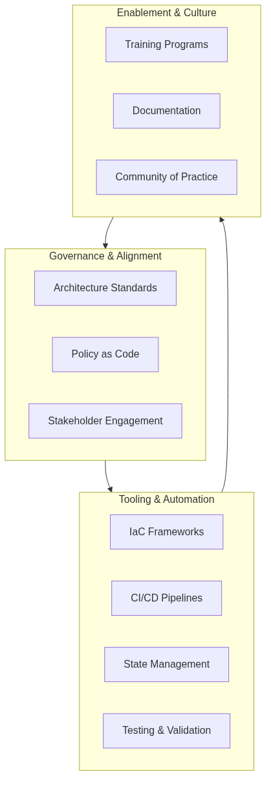
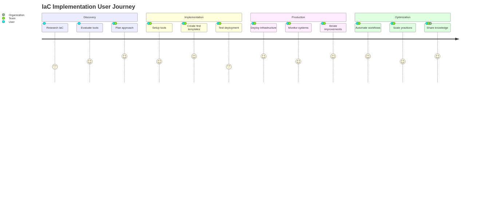

# Architecture as Code in Practice {#chapter-practical-implementation}

Architecture as Code succeeds when teams bring organisational ambitions, engineering discipline, and operating constraints together in a single delivery motion. Practical adoption requires a structured roadmap, supportive tooling, and a culture that treats infrastructure change as a product in its own right.

Prioritising clarity is crucial. Figure 14.1 highlights the operating model used by many platform teams to combine architecture governance, automation, and stakeholder alignment. It serves as a quick reference for the foundational capabilities that underpin every implementation.

*Figure 14.1 – Architecture as Code relies on coordinated governance, tooling, and enablement capabilities to stay sustainable over time.*

## Implementation roadmap and strategies

Successful Architecture as Code adoption progresses through clearly defined stages: establishing a shared vision, delivering a pilot, hardening operations, and continuously expanding the footprint. Organisations that front-load alignment avoid the most common integration issues later in the journey.

The adoption journey in Figure 14.2 breaks down these stages into the minimum set of activities required to maintain momentum without overwhelming delivery teams. It emphasises measurable outcomes at every step so that leadership can invest with confidence.

*Figure 14.2 – A simplified adoption journey that balances architectural guardrails with iterative delivery milestones.*

Figure 14.4 captures the enablement flywheel that keeps Architecture as Code programmes sustainable by moving teams from shared delivery into lasting communities of practice.

*Figure 14.4 – Enablement flywheel connecting cross-functional teams, skill development, knowledge sharing, communities of practice, and career progression.*

| Implementation Stage | Key Activities | Success Criteria | Deliverables |
|---------------------|----------------|------------------|--------------|
| Aligning stakeholders early | Current-state assessment, cross-functional working group formation, vocabulary and SLO agreement | Platform, security, finance, and architecture alignment on priorities | Technical baseline documentation, regulatory obligations map, shared vocabulary guide |
| Designing the pilot and proving value | Constrained workload selection, automated provisioning implementation, change history tracking | Automated provisioning, observable change histories, rapid rollback capabilities | Working pilot environment, lessons learned documentation, retrospective findings |
| Scaling operations with repeatable patterns | Module formalisation, tagging standardisation, change management adoption | Reusable modules, automated policy checks, progressive rollouts | Enterprise playbooks, knowledge-sharing sessions, internal communities of practice |

## Tool selection and ecosystem integration

Selecting the Architecture as Code toolchain is about more than feature parity. Decision frameworks must evaluate community support, managed service availability, licence terms, and the alignment of vendor roadmaps with enterprise objectives. Terraform remains the most common multi-cloud choice, while native cloud templates such as AWS CloudFormation or Azure Resource Manager may complement platform-specific needs.

Teams must intentionally design integration with source control, testing platforms, secrets management, and observability tooling. Wherever possible, integration patterns should mirror the workflows that software delivery teams already understand so that infrastructure changes inherit established review and deployment practices.

## Prioritising testable Infrastructure as Code platforms

Architecture as Code’s quality promise depends on the infrastructure layer being as testable as the application stack. Chapter 13 outlines the test pyramid that underpins this expectation; practical implementation demands toolchains that integrate with it rather than sitting adjacent to it. Platforms such as Pulumi and the AWS Cloud Development Kit (CDK) support TypeScript, Python, and other general-purpose languages, letting engineers combine infrastructure definitions with familiar unit testing frameworks and mocking libraries. Teams can exercise architectural guardrails without provisioning resources by using Pulumi’s `@pulumi/pulumi/testing` harness to assert resource properties, or by applying the AWS CDK assertions library to synthesised stacks to confirm that security groups, tagging standards, and policy attachments match governance requirements.

These programming-language-native tools also simplify continuous integration workflows. They enable developers to execute infrastructure unit tests alongside application suites, provide richer failure messaging for code review, and make use of IDE tooling for refactoring and static analysis. This alignment reduces the feedback loop between architectural intent and executable validation, directly supporting the “shift left” guidance described in Chapter 13.

Declarative-first tools such as Terraform continue to play a vital role, especially where multi-cloud coverage and established ecosystems are essential. However, their testing story often centres on plan evaluation, module contract tests, and policy-as-code gatekeeping rather than true unit-level execution. When rapid, repeatable assertions over architectural logic are required, investing in Pulumi- or CDK-based layers on top of existing Terraform estates can deliver the necessary testability without sacrificing proven workflows.

## Protected delivery workflows for architecture modules

Curating a maintainable Architecture as Code practice requires governance controls that make quality gates non-negotiable. Teams should configure protected branches so production-aligned infrastructure repositories demand successful status checks, review approvals, and signed commits before merge. Mandatory checks need to cover book generation, diagram refreshes, module linting, and static analysis so that architectural artefacts cannot drift from the documented source of truth ([Source [4]](source-4)). Where contributors propose refactors, the branch policies guarantee that reviewers evaluate rendered diagrams, generated PDFs, and policy-as-code results before approving the change.

Infrastructure unit tests must feature prominently in those gates. Assertions supplied by the AWS Cloud Development Kit can confirm that synthesised stacks still include encryption defaults, network segmentation, and tagging strategies that other chapters depend upon ([Source [9]](source-9)). By running CDK assertions—or equivalent Pulumi and Terratest suites—alongside documentation builds, the pipeline produces a single artefact bundle that documents which architectural intents were validated. Publishing this evidence with pull requests keeps change advisory boards and platform councils confident that every merge protects shared modules rather than eroding them.

## Production readiness and operational excellence

Security-first thinking embeds identity, secrets handling, and audit controls into every artefact. Automated scanning pipelines and clearly defined exception processes ensure that compliance teams receive the evidence they need without slowing down delivery.

High-availability design translates into codified redundancy, automated failover, and disaster recovery testing. Infrastructure definitions must handle dependency failures gracefully and allow rapid restoration of service. Observability practices should track both the execution of pipelines and the health of the resulting environments so that teams can correct drift and regressions quickly.

### Resilience checklist for infrastructure changes

The operational reality described in Sources [15](source-15) and [16](source-16) demands that every change request demonstrates how it will stay testable, recoverable, and reversible. The checklist below provides a reusable review aide for change advisory boards and platform teams. Each row is expected to have automated evidence attached—screenshots, pipeline logs, or generated reports—before promotion to production environments.

| Area | Checklist prompts | Expected artefacts |
|------|-------------------|--------------------|
| Pre-change validation | Have unit, integration, security, and policy tests passed for the exact commit being promoted? Has a human reviewed the Terraform plan or Pulumi preview output? | CI pipeline run IDs, signed-off pull request reviews, stored plan/previews |
| State resilience | Is the remote backend configured with encryption, locking, versioning, and automated backups? Are state access alerts wired into the incident rota and tested quarterly? | Backend configuration snippets, backup job logs, SIEM alert transcripts |
| Recovery drills | Has the team rehearsed state restoration from the most recent backup and documented timings? Are runbooks updated with clean-up steps for partial applies? | Runbook revisions, tabletop exercise notes, recovery timing metrics |
| Rollback readiness | Is there a tested rollback script or inverse plan that can be executed without manual edits? Are feature flags or traffic controls aligned with the infrastructure release? | Stored rollback plans, canary deployment records, change freeze approvals |

Teams should embed the checklist into merge templates or change management tooling so that gaps become visible early. Automating the evidence collection—for example by attaching Terratest reports, Pulumi test results, and state-backup verification logs to pull requests—keeps the process lightweight whilst ensuring resilience obligations remain measurable.

## Common challenges and troubleshooting

| Challenge | Root Cause | Mitigation Strategy | Best Practices |
|-----------|-----------|---------------------|----------------|
| State management | Distributed teams increase risk of state drift and accidental overwrites | Remote state backends with locking, frequent backups, reconciliation routines | Mandatory state locking for production, automated drift detection, regular state backups |
| Dependency coordination | Complex estates require intricate ordering between networking, identity, and workload modules | Modular designs with well-defined interfaces, explicit dependency declarations | Clear module boundaries, documented dependencies, reduced cross-team coupling |
| Version compatibility | Provider and module upgrades can break established workflows | Staged rollouts, compatibility matrices, automated integration tests | Version pinning, compatibility testing, gradual ecosystem evolution |

## Enterprise integration patterns

Enterprise-scale deployments blend multi-account cloud strategies with on-premises integrations and regulated workload protections. Architecture as Code artefacts must express network isolation, delegated administration, and governance guardrails while remaining consumable by product teams. Embedding compliance-as-code policies and continuous auditing keeps the organisation inspection-ready and avoids costly remediation projects later on.

## Practical examples in context

Practical adoption benefits from curated, real-world examples that teams can inspect before tailoring their own automation. Appendix A maintains a set of code listings that highlight the most common landing zone, operations, and delivery scenarios referenced in this chapter.

The following entries are the quickest way to explore those artefacts without leaving the main narrative:

* **Terraform service blueprint** – Appendix entry [14_CODE_1](14_code_1) contains the relocated landing zone module, complete with networking, load balancing, tagging standards, and autoscaling defaults that teams can adapt to their own environments.
* **Environment configuration and monitoring** – Appendix entry [14_CODE_2](14_code_2) layers production-grade state management, observability dashboards, and retention controls on top of the shared module so that operations teams receive actionable telemetry from day one.
* **Continuous delivery workflow** – Appendix entry [14_CODE_3](14_code_3) captures the associated GitHub Actions pipeline that plans and applies infrastructure changes across environments and requires an explicit approval step before production deployments.

Each appendix entry describes when to use the pattern, the governance indicators it produces, and how the implementation reinforces the operating practices discussed in this chapter. Teams should tailor the templates to match their naming standards, guardrail policies, and release cadences.

## Summary

Architecture as Code in practice requires disciplined planning, collaborative execution, and relentless optimisation. Organisations that invest in a structured roadmap, curate a dependable toolchain, and treat operational excellence as a core deliverable achieve consistent, auditable infrastructure change at scale.

## Sources and references

- HashiCorp. "Terraform Architecture as Code Best Practices." HashiCorp Learn Platform.
- AWS Well-Architected Framework. "Infrastructure as Code." Amazon Web Services.
- Google Cloud. "Infrastructure as Code Design Patterns." Google Cloud Architecture Centre.
- Microsoft Azure. "Azure Resource Manager Best Practices." Microsoft Documentation.
- Puppet. "Infrastructure as Code Implementation Guide." Puppet Enterprise Documentation.
- GitHub Docs. "About protected branches." GitHub Documentation.
- AWS. "AWS Cloud Development Kit (CDK) Developer Guide." Amazon Web Services.
- Pulumi. "Testing Infrastructure as Code Programs." Pulumi Blog, 2024.
