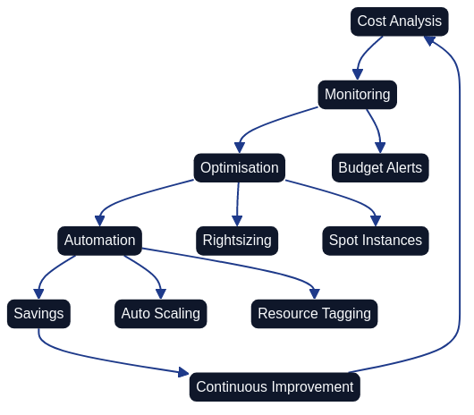
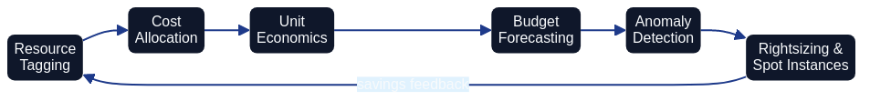
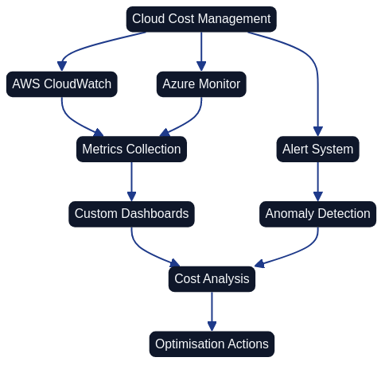

# Cost Optimization and Resource Management

*Kostnadsoptimeringsarbetsflödet visar den systematiska processen från initial kostnadsanalys genom monitoring och optimering till automation och besparingar. Processen är kontinuerlig med feedback-loopar som möjliggör ständig förbättring baserat på faktiska resultat. Nyckelfunktioner inkluderar budget alerts, rightsizing av resurser, användning av spot instances, automatisk skalning och strukturerad resource tagging.*

*Denna förenklad vy av kostnadsoptimeringsprocessen illustrerar hur olika komponenter arbetar tillsammans: från kostnadsanalys via monitoring och optimering till automation som leder till konkreta besparingar.*

## Overall Description

Cost optimization forms a critical komponent in Architecture as Code-implementeringar, particularly when organisationer migrerar to cloud-based solutions. Without korrekt kostnadshantering can molnkostnader snabbt eskalera and undergräva the ekonomiska Benefitsna with Architecture as Code.

Moderna cloud providers offers pay-as-you-use modor as can vara both fordelaktiga and riskfyllda. Architecture as Code enables exakt kontroll over resource allocation and automatiserad kostnadsoptimering through policy-driven resource management and intelligent skalning.

Swedish organizations face unique Challenges when the applies molnkostnader, including valutafluktuationer, regulatory requirements as affects datalagring, and need of to balance kostnadseffektivitet with performance and security. Architecture as Code-baserade solutions offers tools to addressera These Challenges systematiskt.

successful kostnadsoptimering requires kombination of technical tools, organizational processes and kulturforändringar as främjar cost-awareness bland utvecklings- and driftteam. This includes Architecture as Code-implementation of FinOps-praktiker as integrerar finansiell accountability in entire utvecklingslivscykeln.

## FinOps and cost governance

*FinOps-cykeln illustrerar den kontinuerliga processen av kostnadsstyrning, från allokering och budgetering till policyhantering och optimering. Denna iterativa approach säkerställer att kostnadsmedvetenhet integreras i hela organisationens arbetsflöde.*

FinOps represents a growing disciplin as combines finansiell handling with molnoperationer to maximera affärsvärdet of molninvesteringar. Within Architecture as Code-context means This to integrera kostnadshänsyn direkt in infrastructure definitionsna and deployment-processerna.

Governance-ramverk for kostnadshantering must encompass automated policies for resurskonfiguration, budget-alerts and regelbunden kostnadsanalys. Terraform Enterprise, AWS Cost Management and Azure Cost Management offers APIs as can integreras in Architecture as Code-workflows for real-time kostnadskontroll.

Swedish organizations must also handle compliance-requirements as affects kostnadsoptimering, såwhich GDPR-relaterade datalagringsrequirements as can begränsa opportunity to use vissa geografiska regioner with lägre priser. Architecture as Code-baserade compliance-policies can automatisera These begränsningar while the optimerar kostnader within toåtna parametrar.

implementation of cost allocation tags and chargeback-modor through Architecture as Code enables transparent kostnadsdistribution between different team, projekt and affärsenheter. This creates incitament for Developers to do kostnadsmässigt optimala design decisions.

## Automatisk resursskalning and rightsizing

Automatisk resursskalning forms kärnan in kostnadseffektiv Architecture as Code. by definiera skalningsregler baserade at faktiska usage patterns can organisationer undvika over-provisionering while the ensures adekvat performance.

Kubernetes Horizontal Pod Autoscaler (HPA) and Vertical Pod Autoscaler (VPA) can konfigureras through Architecture as Code to automatically adjust resource allocation based on CPU-, minnes- and custom metrics. This is particularly valuable for Swedish organizations with clear working hours patterns as enables predictable scaling.

Cloud-providers offers rightsizing-Recommendations baserade at historisk use, but These must integreras in Architecture as Code-workflows to bli actionable. Terraform providers for AWS, Azure and GCP can automatically implement rightsizing-Recommendations through Architecture as Code-reviewprocesser.

Machine learning-baserade prediktiva skalningsmodor can inkorporeras in Architecture as Code-definitioner to anticipera resursbelastning and pre-emptivt skala infrastructure. This is particularly effektivt for companies with säsongsmässiga variationer or forutsägbara affärszykler.

## Cost monitoring and alerting

*Denna diagram visar kostnadsmonitoringsarkitekturen med integration av CloudWatch/Azure Monitor, anpassade dashboards och alertsystem. Data flödar från metrics collection genom rapportering och anomaly detection till kostnadsanalys, vilket slutligen resulterar i konkreta optimeringsåtgärder.*

Comprehensive cost monitoring requires integration of monitoring tool direkt in Architecture as Code-konfigurationerna. CloudWatch, Azure Monitor and Google Cloud Monitoring can konfigureras as code to spåra kostnader at granulär level and trigga alerts when threshold-värden överskrids.

Real-time kostnadsspårning enables proaktiv kostnadshantering instead for reactive measures efter to budget redan överskrids. Architecture as Code-baserade monitoring-solutions can automatically implement cost controls as resource termination or approval workflows for kostnadskritiska operationer.

Svenska organisations rapporteringsrequirements can automatiseras through Architecture as Code-definierade dashboards and rapporter as is generated regelbundet and is distributed to relevanta stakeholders. Integration with foretags ERP-systems enables seamless financial planning and budgetering.

Anomaly detection for molnkostnader can implementeras through machine learning-algoritmer as tränas at historiska usage patterns. These can integreras in Architecture as Code-workflows to automatically flagga and potentiellt rewithiera onormala kostnadsspurtar.

## Multi-cloud cost optimization

Multi-cloud strategier kompliserar kostnadsoptimering but offers also possibilities for cost arbitrage between different providers. Architecture as Code tool that Terraform enables consistent cost management across different cloud providers through unified configuration and monitoring.

Cross-cloud cost comparison requires normalisering of pricing models and service offerings between providers. Open source tool that Cloud Custodian and Kubecost can integreras in Architecture as Code-pipelines to automatisera This analys and rekommendera optimal resource placement.

Data transfer costs between cloud providers forms often a osynlig kostnadskälla as can optimeras through strategisk architecture-design. Architecture as Code-baserad network topologi can minimera inter-cloud traffic while The maximerar intra-cloud efficiency.

Hybrid cloud-strategier can optimera kostnader by behålla vissa workloads on-premises with cloud-nativer arbetsbelastningar flyttas to molnet. Architecture as Code enables coordinated management of båda environmentsna with unified cost tracking and optimization.

## Praktiska example

### Cost-Aware Terraform Configuration

För att implementera kostnadsmedveten infrastruktur med Terraform behövs en strukturerad approach som kombinerar budget management, cost allocation tagging, och intelligent resursurvalsstrategier. En fullständig implementation inkluderar:

| Component | Purpose | Implementation Details |
|-----------|---------|------------------------|
| Cost allocation tags | Metadata for cost tracking | Tags for all resources with cost center, project, environment, and owner information |
| AWS Budget alerts | Proactive cost monitoring | Automatic notifications at 80% and 100% of budget thresholds |
| Spot instance configuration | Cost-effective compute | Mixed instance types for optimal cost efficiency |
| Auto Scaling groups | Balanced capacity management | Mixed instances policy balancing on-demand and spot instances |

*För komplett kodexempel med alla konfigurationsdetaljer, se [15_CODE_1: Cost-aware Terraform infrastructure configuration](#15_code_1) i Appendix A.*

### Kubernetes Cost Optimization

Kubernetes-miljöer kräver noggrann resursstyrning för att undvika överprovisioning och kontrollera kostnader. Viktiga komponenter inkluderar:

| Kubernetes Component | Purpose | Cost Optimization Impact |
|---------------------|---------|--------------------------|
| ResourceQuotas | Set hard limits on CPU, memory, and pod count per namespace | Prevents resource over-allocation, enforces budget constraints |
| LimitRanges | Define default and maximum values for container resources | Ensures consistent resource sizing, prevents runaway consumption |
| Vertical Pod Autoscaler (VPA) | Automatic adjustment of resource requests based on actual usage | Right-sizes containers, eliminates over-provisioning |
| Horizontal Pod Autoscaler (HPA) | Scale number of replicas based on CPU and memory utilization | Matches capacity to demand, reduces idle resources |

*För fullständiga Kubernetes manifests, se [15_CODE_2: Kubernetes cost optimization manifests](#15_code_2) i Appendix A.*

### Cost Monitoring Automation

Automatiserad kostnadsmonitoring och optimering kräver integration med cloud provider APIs för att:

- Analysera kostnadstrender över tid med gruppering per service och projekt
- Identifiera rightsizing-möjligheter för EC2-instanser baserat på faktisk utilization
- Upptäcka oanvända resurser som unattached EBS volumes, unused elastic IPs och idle load balancers
- Generera omfattande kostnadsoptimeringsplaner med potentiella besparingar

*För fullständig Python-implementation av AWS cost optimizer, se [15_CODE_3: AWS cost monitoring and optimization automation](#15_code_3) i Appendix A.*

## Summary

The modern Architecture as Code methodology represents framtiden for infrastructure management in Swedish organizations.
Cost optimization within Architecture as Code requires systematic approach as combines technical tools, automated processes and organizational awareness. successful implementation results in significant cost savings while performance and security is maintained.

Viktiga framgångsfaktorer includes proaktiv monitoring, automatiserad rightsizing, intelligent use of spot instances and reserved capacity, samt continuous optimering baserad at faktiska usage patterns. FinOps-praktiker ensures kostnadshänsyn integreras naturligt in development process.

Swedish organizations as implement These strategier can achieve 20-40% kostnadsreduktion in sina molnoperationer while the ensures regulatory compliance and performance-requirements.

## Sources and referenser

- AWS. "AWS Cost Optimization Guide." Amazon Web Services Documentation, 2023.
- FinOps Foundation. "FinOps Framework and Architecture as Code best practices." The Linux Foundation, 2023.
- Kubecost. "Kubernetes Cost Optimization Guide." Kubecost Documentation, 2023.
- Cloud Security Alliance. "Cloud Cost Optimization Security Guidelines." CSA Research, 2023.
- Gartner. "Cloud Cost Optimization Strategies for European Organizations." Gartner Research, 2023.
- Microsoft. "Azure Cost Management Architecture as Code best practices." Microsoft Azure Documentation, 2023.