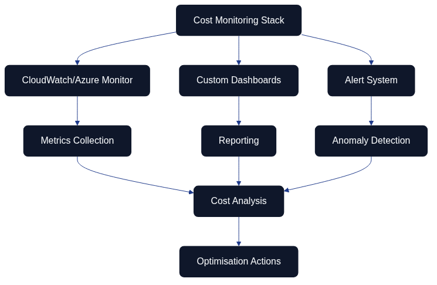

# Cost Optimisation and Resource Management

*The cost optimisation workflow demonstrates the systematic process from initial cost analysis through monitoring and optimisation to automation and savings. The process is continuous with feedback loops enabling constant improvement based on actual results. Key functions include budget alerts, resource rightsizing, use of spot instances, automatic scaling, and structured resource tagging.*

*This simplified view of the cost optimisation process illustrates how various components work together: from cost analysis via monitoring and optimisation to automation leading to concrete savings.*

## Overall Description

Cost optimisation forms a critical component in Architecture as Code implementations, particularly when organisations migrate to cloud-based solutions. Without proper cost management, cloud costs can rapidly escalate and undermine the economic benefits of Architecture as Code.

Modern cloud providers offer pay-as-you-use models which can be both advantageous and risky. Architecture as Code enables precise control over resource allocation and automated cost optimisation through policy-driven resource management and intelligent scaling.

EU organisations face unique challenges when applying cloud costs, including currency fluctuations between EUR and USD pricing, regulatory requirements affecting data storage under GDPR, and the need to balance cost efficiency with performance and security across multiple member states. Architecture as Code-based solutions offer tools to address these challenges systematically.

Successful cost optimisation requires a combination of technical tools, organisational processes, and cultural changes that promote cost-awareness amongst development and operations teams. This includes Architecture as Code implementation of FinOps practices that integrate financial accountability throughout the entire development lifecycle.

## FinOps and Cost Governance

*The FinOps cycle illustrates the continuous process of cost governance, from allocation and budgeting to policy management and optimisation. This iterative approach ensures that cost-awareness is integrated throughout the organisation's workflow.*

FinOps represents a growing discipline that combines financial management with cloud operations to maximise business value from cloud investments. Within the Architecture as Code context, this means integrating cost considerations directly into infrastructure definitions and deployment processes.

Governance frameworks for cost management must encompass automated policies for resource configuration, budget alerts, and regular cost analysis. Terraform Enterprise, AWS Cost Management, and Azure Cost Management offer APIs that can be integrated into Architecture as Code workflows for real-time cost control.

EU organisations must also handle compliance requirements that affect cost optimisation, such as GDPR-related data storage requirements that may restrict opportunities to use certain geographical regions with lower pricing. For example, organisations may need to maintain data within EU boundaries (eu-west-1 in Ireland, eu-central-1 in Frankfurt, eu-south-1 in Milan, or eu-west-3 in Paris) rather than using potentially lower-cost non-EU regions. Architecture as Code-based compliance policies can automate these constraints whilst optimising costs within permitted parameters.

Implementation of cost allocation tags and chargeback models through Architecture as Code enables transparent cost distribution between different teams, projects, and business units. This creates incentives for developers to make cost-optimal design decisions.

## Automatic Resource Scaling and Rightsizing

Automatic resource scaling forms the core of cost-effective Architecture as Code. By defining scaling rules based on actual usage patterns, organisations can avoid over-provisioning whilst ensuring adequate performance.

Kubernetes Horizontal Pod Autoscaler (HPA) and Vertical Pod Autoscaler (VPA) can be configured through Architecture as Code to automatically adjust resource allocation based on CPU, memory, and custom metrics. This is particularly valuable for EU organisations with varying working patterns across different time zones and member states, enabling predictable scaling that accounts for business hours in Dublin, Frankfurt, Paris, and other major centres.

Cloud providers offer rightsizing recommendations based on historical usage, but these must be integrated into Architecture as Code workflows to become actionable. Terraform providers for AWS, Azure, and GCP can automatically implement rightsizing recommendations through Architecture as Code review processes.

Machine learning-based predictive scaling models can be incorporated into Architecture as Code definitions to anticipate resource load and pre-emptively scale infrastructure. This is particularly effective for companies with seasonal variations or predictable business cycles across different EU markets.

## Cost Monitoring and Alerting

*This diagram shows the cost monitoring architecture with integration of CloudWatch/Azure Monitor, customised dashboards, and alert systems. Data flows from metrics collection through reporting and anomaly detection to cost analysis, ultimately resulting in concrete optimisation actions.*

Comprehensive cost monitoring requires integration of monitoring tools directly into Architecture as Code configurations. CloudWatch, Azure Monitor, and Google Cloud Monitoring can be configured as code to track costs at a granular level and trigger alerts when threshold values are exceeded.

Real-time cost tracking enables proactive cost management instead of reactive measures after budgets are already exceeded. Architecture as Code-based monitoring solutions can automatically implement cost controls such as resource termination or approval workflows for cost-critical operations.

EU organisations' reporting requirements can be automated through Architecture as Code-defined dashboards and reports that are generated regularly and distributed to relevant stakeholders. Integration with enterprise ERP systems enables seamless financial planning and budgeting, with support for multi-currency reporting (EUR, GBP, and other EU currencies) alongside cloud provider billing in USD.

Anomaly detection for cloud costs can be implemented through machine learning algorithms trained on historical usage patterns. These can be integrated into Architecture as Code workflows to automatically flag and potentially remediate abnormal cost spikes across different EU regions.

## Multi-Cloud Cost Optimisation

Multi-cloud strategies complicate cost optimisation but also offer opportunities for cost arbitrage between different providers. Architecture as Code tools like Terraform enable consistent cost management across different cloud providers through unified configuration and monitoring.

Cross-cloud cost comparison requires normalisation of pricing models and service offerings between providers. Open source tools like Cloud Custodian and Kubecost can be integrated into Architecture as Code pipelines to automate this analysis and recommend optimal resource placement across regions.

Data transfer costs between cloud providers often form an invisible cost source that can be optimised through strategic architecture design. Architecture as Code-based network topology can minimise inter-cloud traffic whilst maximising intra-cloud efficiency. For EU organisations, this is particularly relevant when balancing data sovereignty requirements with cost optimisation—for example, maintaining workloads in eu-west-1 (Ireland) and eu-central-1 (Frankfurt) to ensure GDPR compliance whilst minimising inter-region data transfer costs.

Cloud sovereignty frameworks, such as the GAIA-X data space model referenced in Chapter 25, provide a shared vocabulary for describing residency, portability, and supply-chain expectations. Encoding those guardrails alongside FinOps policies ensures that cost models account for the approved jurisdictions, egress thresholds, and encryption standards required for European compliance. Architecture as Code modules should therefore expose parameters for sovereign zones, permitted providers, and classification-driven controls so that cost optimisation never undermines the regulatory guardrails discussed in the broader cloud sovereignty narrative.

Hybrid cloud strategies can optimise costs by retaining certain workloads on-premises whilst cloud-native workloads are moved to the cloud. Architecture as Code enables coordinated management of both environments with unified cost tracking and optimisation. This is especially relevant for EU financial services organisations that must balance regulatory requirements with cost efficiency.

### Market Outlook and Economic Rationale

Independent market research confirms that Infrastructure as Code investment is accelerating as organisations industrialise automation. MarketsandMarkets (2023) forecasts that the global Infrastructure as Code market will expand from USD 0.8 billion in 2022 to USD 2.3 billion by 2027, representing a compound annual growth rate of about 24 per cent. The shift from exploratory pilots to enterprise-scale programmes reflects the need for verifiable guardrails and reusable automation patterns in regulated industries.

Gartner's *Forecast Analysis: Public Cloud Services Worldwide* (2024) anticipates worldwide public cloud spending reaching USD 679 billion in 2024—a year-on-year increase of 20.4 per cent. Finance leaders therefore expect Architecture as Code and FinOps disciplines to provide measurable returns on escalating cloud commitments by codifying reservation strategies, budget thresholds, and sustainability metrics alongside delivery pipelines.

IDC's *Worldwide DevOps Software Tools Forecast, 2023–2027* highlights that platform engineering, automation, and configuration management account for more than a third of DevOps investment through 2027. Treating Architecture as Code artefacts as governed, reusable assets ensures those expenditures translate into durable capabilities, providing the economic rationale executives require when prioritising IaC-led transformation.

## Practical Examples

### Cost-Aware Terraform Configuration

To implement cost-aware infrastructure with Terraform, a structured approach is needed that combines budget management, cost allocation tagging, and intelligent resource selection strategies. A complete implementation includes:

| Component | Purpose | Implementation Details |
|-----------|---------|------------------------|
| Cost allocation tags | Metadata for cost tracking | Tags for all resources with cost centre, project, environment, and owner information |
| AWS Budget alerts | Proactive cost monitoring | Automatic notifications at 80% and 100% of budget thresholds |
| Spot instance configuration | Cost-effective compute | Mixed instance types for optimal cost efficiency |
| Auto Scaling groups | Balanced capacity management | Mixed instances policy balancing on-demand and spot instances |

*For complete code examples with all configuration details, see [15_CODE_1: Cost-aware Terraform infrastructure configuration](#15_code_1) in Appendix C.*

### Kubernetes Cost Optimisation

Kubernetes environments require careful resource governance to avoid over-provisioning and control costs. Key components include:

| Kubernetes Component | Purpose | Cost Optimisation Impact |
|---------------------|---------|--------------------------|
| ResourceQuotas | Set hard limits on CPU, memory, and pod count per namespace | Prevents resource over-allocation, enforces budget constraints |
| LimitRanges | Define default and maximum values for container resources | Ensures consistent resource sizing, prevents runaway consumption |
| Vertical Pod Autoscaler (VPA) | Automatic adjustment of resource requests based on actual usage | Right-sizes containers, eliminates over-provisioning |
| Horizontal Pod Autoscaler (HPA) | Scale number of replicas based on CPU and memory utilisation | Matches capacity to demand, reduces idle resources |

*For complete Kubernetes manifests, see [15_CODE_2: Kubernetes cost optimisation manifests](#15_code_2) in Appendix C.*

### Cost Monitoring Automation

Automated cost monitoring and optimisation requires integration with cloud provider APIs to:

- Analyse cost trends over time with grouping per service and project
- Identify rightsizing opportunities for EC2 instances based on actual utilisation
- Detect unused resources such as unattached EBS volumes, unused elastic IPs, and idle load balancers
- Generate comprehensive cost optimisation plans with potential savings

*For complete Python implementation of AWS cost optimiser, see [15_CODE_3: AWS cost monitoring and optimisation automation](#15_code_3) in Appendix C.*

## Summary

The modern Architecture as Code methodology represents the future for infrastructure management in EU organisations. Cost optimisation within Architecture as Code requires a systematic approach that combines technical tools, automated processes, and organisational awareness. Successful implementation results in significant cost savings whilst performance and security are maintained.

Key success factors include proactive monitoring, automated rightsizing, intelligent use of spot instances and reserved capacity, and continuous optimisation based on actual usage patterns. FinOps practices ensure cost considerations are naturally integrated into the development process.

EU organisations that implement these strategies can achieve 20-40% cost reduction in their cloud operations whilst ensuring regulatory compliance (particularly GDPR data residency requirements) and performance requirements. Multi-region strategies across EU zones (such as eu-west-1 in Ireland and eu-central-1 in Frankfurt) enable both compliance and cost optimisation through intelligent workload placement.

## Sources and References

- AWS. "AWS Cost Optimisation Guide." Amazon Web Services Documentation, 2023.
- FinOps Foundation. "FinOps Framework and Architecture as Code Best Practices." The Linux Foundation, 2023.
- Kubecost. "Kubernetes Cost Optimisation Guide." Kubecost Documentation, 2023.
- Cloud Security Alliance. "Cloud Cost Optimisation Security Guidelines." CSA Research, 2023.
- MarketsandMarkets. "Infrastructure as Code Market Report." MarketsandMarkets, 2023.
- Gartner. "Forecast Analysis: Public Cloud Services Worldwide." Gartner Research, 2024.
- IDC. "Worldwide DevOps Software Tools Forecast, 2023–2027." IDC Research, 2023.
- Microsoft. "Azure Cost Management Architecture as Code Best Practices." Microsoft Azure Documentation, 2023.
