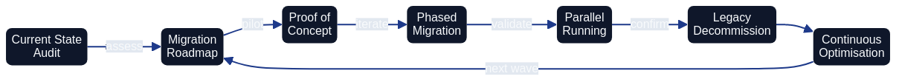

# Migration from Traditional Infrastructure {#migration}



*Migration from Traditional Infrastructure to Architecture as Code requires systematic planning, step-by-step Architecture as Code implementation and continuous validation. Diagram shows the structured process from assessment to complete Architecture as Code adoption.*

## Overall Description

Migration from traditional, manually configured infrastructure to Architecture as Code represents one of the most critical transformations for modern IT organisations. This process requires not only technical restructuring but also organisational change and cultural adaptation to code-based ways of working.

European organisations face unique migration challenges through legacy systems that have developed over decades, regulatory requirements that constrain the pace of change, and the need to balance innovation with operational stability. Successful migration requires comprehensive planning that minimises risks whilst enabling rapid value realisation.

Modern migration strategies must accommodate hybrid scenarios where legacy infrastructure coexists with Architecture as Code-managed resources during extended transition periods. This hybrid approach enables gradual migration that reduces business risk whilst enabling immediate benefits from Architecture as Code adoption.

Cloud-native migration pathways offer opportunities to modernise architecture whilst infrastructure management is codified. European companies can leverage this transformation to implement sustainability initiatives, improve cost efficiency and enhance security posture through systematic Architecture as Code adoption.

## Assessment and planning phases

Comprehensive infrastructure assessment forms the foundation for successful Architecture as Code migration. This includes inventory of existing resources, dependency mapping, risk assessment and cost-benefit analysis that informs migration strategy and timeline planning.

Discovery automation tools such as AWS Application Discovery Service, Azure Migrate and Google Cloud migration tools can accelerate the assessment process through automated resource inventory and dependency detection. These tools generate data that can inform Architecture as Code template generation and migration prioritisation.

Risk assessment must identify critical systems, single points of failure and compliance dependencies that affect migration approach. European financial institutions and healthcare organisations must particularly consider regulatory implications and downtime restrictions that affect migration windows.

Migration wave planning balances technical dependencies with business priorities to minimise risk and maximise value realisation. Pilot projects with non-critical systems enable team learning and process refinement before critical systems migration commences.

## Lift-and-shift vs re-architecting

| Migration Strategy | Description | Benefits | Challenges | Best Suited For |
|-------------------|-------------|----------|------------|-----------------|
| Lift-and-shift | Direct migration to cloud with minimal changes | Fastest time to cloud, lower initial cost, minimal application changes | Limited cloud-native benefits, may require follow-up optimisation, higher long-term operational costs | Applications with tight timelines, limited modernisation budget, compliance-driven moves |
| Re-architecting | Complete redesign for cloud-native patterns | Maximum cloud value, improved scalability and resilience, cost optimisation, innovation enablement | Highest initial investment, longest timeline, requires deep cloud expertise | Strategic applications, high business value systems, global expansion needs |
| Lift-and-improve (Hybrid) | Selective re-architecting of critical components while keeping most unchanged | Balances speed-to-market with modernisation, immediate cloud benefits, iterative improvement path | Complexity in managing hybrid architecture, requires careful component selection | Phased modernisation, risk-balanced approach, majority of enterprise migrations |
| Application retirement | Remove legacy applications with limited business value | Reduces migration scope, eliminates maintenance costs, simplifies portfolio | Requires business stakeholder alignment, data archival strategy | Low-value legacy applications, redundant systems, end-of-life software |

## Gradual codification of infrastructure

Infrastructure inventory automation through tools such as Terraform import, CloudFormation drift detection and Azure Resource Manager templates enables systematic conversion of existing resources to Architecture as Code management. Automated discovery can generate initial Architecture as Code configurations that require refinement but accelerate the codification process.

Template standardisation through reusable modules and organisational patterns ensures consistency across migrated infrastructure whilst reducing future maintenance overhead. European government agencies have successfully implemented standardised Architecture as Code templates for common infrastructure patterns across different departments.

Configuration drift elimination through Architecture as Code adoption requires systematic reconciliation between existing resource configurations and desired Architecture as Code state. Gradual enforcement of Architecture as Code-managed configuration ensures infrastructure stability whilst eliminating manual configuration inconsistencies.

Version control integration for infrastructure changes enables systematic tracking of migration progress and provides rollback capabilities for problematic changes. Git-based workflows for infrastructure management establish the foundation for collaborative infrastructure development and operational transparency.

## Team transition and competence development

Skills development programs must prepare traditional systems administrators and network engineers for Architecture as Code-based workflows. Training curricula should encompass Infrastructure as Code tools, cloud platforms, DevOps practices and automation scripting for comprehensive capability development.

Organisational structure evolution from traditional silos to cross-functional teams enables effective Architecture as Code adoption. European telecommunications companies have successfully transitioned from separate development and operations teams to integrated DevOps teams that manage architecture as code.

Cultural transformation from manual processes to automated workflows requires change management programmes that address resistance and promote automation adoption. Success stories from early adopters can motivate broader organisational acceptance of Architecture as Code practices.

Mentorship programs pairing experienced cloud engineers with traditional infrastructure teams accelerates knowledge transfer and reduces adoption friction. External consulting support can supplement internal capabilities during initial migration phases for complex enterprise environments.

## Practical Examples

### Migration Assessment Automation

The comprehensive automation playbook for assessing unmanaged infrastructure resources and orchestrating their migration into a codified estate now resides in [Appendix D: Templates and Tools](appendix_templates_and_tools.md). Practitioners can reference the appendix for the full Python implementation, generated Terraform scaffolding, and migration playbook generator that support large-scale discovery and planning.

### CloudFormation Legacy Import
```yaml
# migration/legacy-import-template.yaml
AWSTemplateFormatVersion: '2010-09-09'
Description: 'Template for import of existing resources to CloudFormation management'

Parameters:
  ExistingVPCId:
    Type: String
    Description: 'ID for existing VPC to be imported'

  ExistingInstanceId:
    Type: String
    Description: 'ID for existing EC2 instance to be imported'

  Environment:
    Type: String
    Default: 'production'
    AllowedValues: ['development', 'staging', 'production']

  ProjectName:
    Type: String
    Description: 'Name of the project for resource tagging'

Resources:
  # Import of existing VPC
  ExistingVPC:
    Type: AWS::EC2::VPC
    Properties:
      # These values must match existing VPC configuration exactly
      CidrBlock: '10.0.0.0/16'  # Update with actual CIDR
      EnableDnsHostnames: true
      EnableDnsSupport: true
      Tags:
        - Key: Name
          Value: !Sub '${ProjectName}-imported-vpc'
        - Key: Environment
          Value: !Ref Environment
        - Key: ManagedBy
          Value: 'CloudFormation'
        - Key: ImportedFrom
          Value: !Ref ExistingVPCId
        - Key: ImportDate
          Value: !Sub '${AWS::Timestamp}'

  # Import of existing EC2 instance
  ExistingInstance:
    Type: AWS::EC2::Instance
    Properties:
      # These values must match existing instance configuration
      InstanceType: 't3.medium'  # Update with actual instance type
      ImageId: 'ami-0c94855bb95b03c2e'  # Update with actual AMI
      SubnetId: !Ref ExistingSubnet
      SecurityGroupIds:
        - !Ref ExistingSecurityGroup
      Tags:
        - Key: Name
          Value: !Sub '${ProjectName}-imported-instance'
        - Key: Environment
          Value: !Ref Environment
        - Key: ManagedBy
          Value: 'CloudFormation'
        - Key: ImportedFrom
          Value: !Ref ExistingInstanceId
        - Key: ImportDate
          Value: !Sub '${AWS::Timestamp}'

  # Security group for imported instance
  ExistingSecurityGroup:
    Type: AWS::EC2::SecurityGroup
    Properties:
      GroupDescription: 'Imported security group for legacy systems'
      VpcId: !Ref ExistingVPC
      SecurityGroupIngress:
        - IpProtocol: tcp
          FromPort: 22
          ToPort: 22
          CidrIp: '10.0.0.0/8'  # Restrict SSH access
          Description: 'SSH access from internal network'
        - IpProtocol: tcp
          FromPort: 80
          ToPort: 80
          CidrIp: '0.0.0.0/0'
          Description: 'HTTP access'
        - IpProtocol: tcp
          FromPort: 443
          ToPort: 443
          CidrIp: '0.0.0.0/0'
          Description: 'HTTPS access'
      Tags:
        - Key: Name
          Value: !Sub '${ProjectName}-imported-sg'
        - Key: Environment
          Value: !Ref Environment
        - Key: ManagedBy
          Value: 'CloudFormation'

  # Subnet for organised network management
  ExistingSubnet:
    Type: AWS::EC2::Subnet
    Properties:
      VpcId: !Ref ExistingVPC
      CidrBlock: '10.0.1.0/24'  # Update with actual subnet CIDR
      AvailabilityZone: !Select [0, !GetAZs '']  # First available AZ in selected region
      MapPublicIpOnLaunch: false
      Tags:
        - Key: Name
          Value: !Sub '${ProjectName}-imported-subnet'
        - Key: Environment
          Value: !Ref Environment
        - Key: Type
          Value: 'Private'
        - Key: ManagedBy
          Value: 'CloudFormation'

Outputs:
  ImportedVPCId:
    Description: 'ID for imported VPC'
    Value: !Ref ExistingVPC
    Export:
      Name: !Sub '${AWS::StackName}-VPC-ID'

  ImportedInstanceId:
    Description: 'ID for imported EC2 instance'
    Value: !Ref ExistingInstance
    Export:
      Name: !Sub '${AWS::StackName}-Instance-ID'

  ImportInstructions:
    Description: 'Instructions for resource import'
    Value: !Sub |
      To import existing resources:
      1. aws cloudformation create-stack --stack-name ${ProjectName}-import --template-body file://legacy-import-template.yaml
      2. aws cloudformation import-resources-to-stack --stack-name ${ProjectName}-import --resources file://import-resources.json
      3. Verify that import was successful with: aws cloudformation describe-stacks --stack-name ${ProjectName}-import
```

### Migration Testing Framework  
```bash
#!/bin/bash
# migration/test-migration.sh
# Comprehensive testing script for architecture as code migration validation

set -e

PROJECT_NAME=${1:-"migration-test"}
ENVIRONMENT=${2:-"staging"}
REGION=${3:-"eu-west-1"}

echo "Starting architecture as code migration testing for project: $PROJECT_NAME"
echo "Environment: $ENVIRONMENT"
echo "Region: $REGION"

# Pre-migration testing
echo "=== Pre-Migration Tests ==="

# Test 1: Verify that all resources are inventoried
echo "Testing resource inventory..."
aws ec2 describe-instances --region $REGION --query 'Reservations[*].Instances[?State.Name!=`terminated`]' > /tmp/pre-migration-instances.json
aws rds describe-db-instances --region $REGION > /tmp/pre-migration-rds.json

INSTANCE_COUNT=$(jq '.[] | length' /tmp/pre-migration-instances.json | jq -s 'add')
RDS_COUNT=$(jq '.DBInstances | length' /tmp/pre-migration-rds.json)

echo "Discovered $INSTANCE_COUNT EC2 instances and $RDS_COUNT RDS instances"

# Test 2: Backup verification
echo "Verifying backup status..."
aws ec2 describe-snapshots --region $REGION --owner-ids self --query 'Snapshots[?StartTime>=`2023-01-01T00:00:00.000Z`]' > /tmp/recent-snapshots.json
SNAPSHOT_COUNT=$(jq '. | length' /tmp/recent-snapshots.json)

if [ $SNAPSHOT_COUNT -lt $INSTANCE_COUNT ]; then
    echo "WARNING: Insufficient recent snapshots. Create backups before migration."
    exit 1
fi

# Test 3: Network connectivity baseline
echo "Establishing network connectivity baseline..."
for instance_id in $(jq -r '.[] | .[] | .InstanceId' /tmp/pre-migration-instances.json); do
    if [ "$instance_id" != "null" ]; then
        echo "Testing connectivity to $instance_id..."
        # Implementera connectivity tests here
    fi
done

# Migration execution testing
echo "=== Migration Execution Tests ==="

# Test 4: Terraform plan validation
echo "Validating Terraform migration plan..."
cd terraform/migration

terraform init
terraform plan -var="project_name=$PROJECT_NAME" -var="environment=$ENVIRONMENT" -out=migration.plan

# Analyse plan for unexpected changes
terraform show -json migration.plan > /tmp/terraform-plan.json

# Check that no resources are planned for destruction
DESTROY_COUNT=$(jq '.resource_changes[] | select(.change.actions[] == "delete") | .address' /tmp/terraform-plan.json | wc -l)

if [ $DESTROY_COUNT -gt 0 ]; then
    echo "ERROR: Migration plan contains resource destruction. Review before continuing."
    jq '.resource_changes[] | select(.change.actions[] == "delete") | .address' /tmp/terraform-plan.json
    exit 1
fi

# Test 5: Import validation
echo "Testing resource import procedures..."

# Create test import for a sample resource
SAMPLE_INSTANCE_ID=$(jq -r '.[] | .[] | .InstanceId' /tmp/pre-migration-instances.json | head -1)

if [ "$SAMPLE_INSTANCE_ID" != "null" ] && [ "$SAMPLE_INSTANCE_ID" != "" ]; then
    echo "Testing import for instance: $SAMPLE_INSTANCE_ID"
    
    # Dry-run import test
    terraform import -dry-run aws_instance.test_import $SAMPLE_INSTANCE_ID || {
        echo "WARNING: Import test failed for $SAMPLE_INSTANCE_ID"
    }
fi

# Post-migration testing
echo "=== Post-Migration Validation Framework ==="

# Test 6: Infrastructure compliance
echo "Setting up compliance validation..."
cat > /tmp/compliance-test.py << 'EOF'
import boto3
import json

def validate_tagging_compliance(region='eu-west-1'):
    """Validate that all migrated resources have correct tags"""
    ec2 = boto3.client('ec2', region_name=region)

    required_tags = ['ManagedBy', 'Environment', 'Project']
    non_compliant = []

    # Check EC2 instances
    instances = ec2.describe_instances()
    for reservation in instances['Reservations']:
        for instance in reservation['Instances']:
            if instance['State']['Name'] != 'terminated':
                tags = {tag['Key']: tag['Value'] for tag in instance.get('Tags', [])}
                missing_tags = [tag for tag in required_tags if tag not in tags]

                if missing_tags:
                    non_compliant.append({
                        'resource_id': instance['InstanceId'],
                        'resource_type': 'EC2 Instance',
                        'missing_tags': missing_tags
                    })

    return non_compliant

def validate_security_compliance():
    """Validate security configuration after migration"""
    # implementation for security controls
    pass

if __name__ == '__main__':
    compliance_issues = validate_tagging_compliance()
    if compliance_issues:
        print(f"Found {len(compliance_issues)} compliance issues:")
        for issue in compliance_issues:
            print(f"  {issue['resource_id']}: Missing tags {issue['missing_tags']}")
    else:
        print("All resources are compliant with tagging requirements")
EOF

python3 /tmp/compliance-test.py

# Test 7: Performance baseline comparison
echo "Setting up performance monitoring..."
cat > /tmp/performance-monitor.sh << 'EOF'
#!/bin/bash
# Monitor key performance metrics after migration

METRICS_FILE="/tmp/post-migration-metrics.json"

echo "Collecting post-migration performance metrics..."

# CPU Utilization
aws cloudwatch get-metric-statistics \
    --namespace AWS/EC2 \
    --metric-name CPUUtilization \
    --start-time $(date -u -d '1 hour ago' +%Y-%m-%dT%H:%M:%S) \
    --end-time $(date -u +%Y-%m-%dT%H:%M:%S) \
    --period 300 \
    --statistics Average \
    --region $REGION > "$METRICS_FILE"

# Analyse metrics for deviations
AVERAGE_CPU=$(jq '.Datapoints | map(.Average) | add / length' "$METRICS_FILE")
echo "Average CPU utilization: $AVERAGE_CPU%"

if (( $(echo "$AVERAGE_CPU > 80" | bc -l) )); then
    echo "WARNING: High CPU utilization detected after migration"
fi
EOF

chmod +x /tmp/performance-monitor.sh

echo "=== Migration Testing Complete ==="
echo "Results:"
echo "  - Resource inventory: $INSTANCE_COUNT EC2, $RDS_COUNT RDS"
echo "  - Backup status: $SNAPSHOT_COUNT snapshots verified"
echo "  - Terraform plan: Validated (no destructive changes)"
echo "  - Compliance framework: Ready"
echo "  - Performance monitoring: Configured"

echo ""
echo "Next steps:"
echo "1. Review test results and address any warnings"
echo "2. Execute migration in maintenance window"
echo "3. Run post-migration validation"
echo "4. Monitor performance for 24 hours"
echo "5. Document lessons learned"
```

## Summary

The modern Architecture as Code methodology represents the future of infrastructure management for global organisations. Migration from traditional infrastructure to Architecture as Code requires systematic planning, gradual implementation, and comprehensive testing. Organisations that successfully execute this migration position themselves for increased agility, improved security, and significant cost benefits.

Success factors include comprehensive assessment, realistic timeline planning, extensive team training, and robust testing frameworks. Hybrid migration strategies enable risk minimisation whilst delivering immediate value from Architecture as Code adoption.

Investment in proper migration planning and execution results in long-term benefits through improved operational efficiency, enhanced security posture, and reduced technical debt. Organisations that follow systematic migration approaches can expect successful transformation to modern, Architecture as Code-based infrastructure management.

## Bridging Technical and Organisational Change

Technical migration success depends fundamentally on organisational readiness. The most sophisticated automation pipelines, testing frameworks, and migration strategies fail without the cultural foundations, team structures, and leadership practices that enable people to thrive in code-based delivery environments.

Part E examines the organisational transformation that must accompany technical change. [Chapter 17 on Organisational Change](17_organisational_change.md) explores how teams evolve from siloed functions to cross-functional collaboration. [Chapter 18 on Team Structure](18_team_structure.md) provides concrete patterns for organising teams around Architecture as Code practices. The subsequent chapters demonstrate how management practices, AI-enabled collaboration, and digitalisation strategies complete the transformation from traditional to code-centric operating models.

## Sources and References

- AWS. "Large-Scale Migration and Modernisation Guide." Amazon Web Services, 2023.
- Microsoft. "Azure Migration Framework and Architecture as Code best practices." Microsoft Azure Documentation, 2023.
- Google Cloud. "Infrastructure Migration Strategies." Google Cloud Architecture Centre, 2023.
- Gartner. "Infrastructure Migration Trends in European Markets." Gartner Research, 2023.
- ITIL Foundation. "IT Service Management for Cloud Migration." AXELOS, 2023.
- European Commission. "Digital Transformation Guidelines for Public Sector." EU Digital Strategy, 2023.