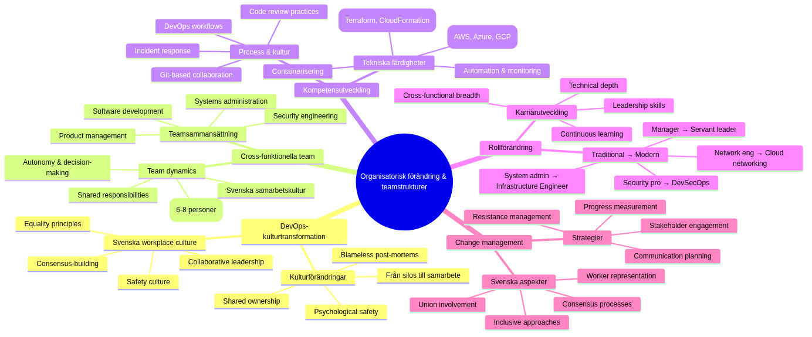

# Organisatorisk change and teamstrukturer


*Infrastructure as Code (Architecture as Code) driver fundamental organisatorisk change from traditionella silos to cross-funktionella DevOps-team. Diagram illustrerar evolutionen from isolerade team to integrerade, samarbetsinriktade Structures as optimerar for hastighet and kvalitet.*

Architecture as Code-metodiken utgör grunden for ## organizational forändringsprocessens komplexitet



*Mindmappen visualiserar the mångsidiga aspekterna of organisatorisk change at Architecture as Code-Architecture as Code-implementation. The shows how DevOps-kulturtransformation, cross-funktionella teamStructureer, competence development, rollforändring and change management is sammankopplade and must is managed holistiskt for successful transformation.*

## Övergripande Description

implementation of Infrastructure as Code requires djupgående organizational changes as sträcker itself långt bortom technical transformation. Traditionella IT-organisationer with separata utvecklings-, drift- and säkerhetsteam must throughgå Fundamental omStructureering to fullt ut realisera Benefitsna with kodbaserade arbetssätt.

Svenska organisationer står infor unika Challenges when the gäller organisatorisk change through starka fackliga traditioner, konsensusbaserade beslutsprocesser and etablerade hierarkiska Structureurer. Successful Architecture as Code adoption requires change management strategier as respekterar These kulturella aspekter simultaneously as the främjar agile and collaborative arbetssätt.

Conway's Law describes how organisationers kommunikationsStructureer speglas in system architecture the producerar. For Architecture as Code-success must organisationer withvetet designa teamStructureer as supportar microservices, API-driven arkitekturer and automated deployment patterns that Infrastructure as Code enables.

Modern DevOps-transformation within svenska foretag that Spotify, Klarna and King demonstrerar how innovative organisationsdesign can accelerate product development and operational efficiency. These organisationer has utvecklat unika approaches to team autonomy, cross-functional collaboration and continuous improvement as can adapt to olika svenska organisationskulturer.

## DevOps-kulturtransformation

DevOps representerar fundamental kulturforändering from "us vs them" mentalitet between development and operations to shared ownership of product lifecycle. This transformation requires investment in both tekniska tools and kulturella forändringsinitiativ as promote collaboration, transparency and continuous learning.

Psychological safety utgör foundationen for effective DevOps teams by enable open communication about mistakes, experimentation and continuous improvement. Svenska workplace culture with emphasis at consensus and equality provides natural foundation for building psychologically safe environments as support DevOps practices.

Blameless post-mortems and failure celebration is essentiella components in DevOps culture as encourage innovation and risk-taking. Svenska organisationer with strong safety cultures can leverage These principles to create environments where teams can experiment with new technologies and approaches without fear of retribution for honest mistakes.

Continuous learning and skill development program must support team members in developing cross-functional capabilities as bridge traditional development and operations boundaries. Investment in comprehensive training program for Architecture as Code tools, cloud platforms and automation practices ensures teams can effectively support modern infrastructure management.

## Cross-funktionella team structures

Cross-functional teams for Architecture as Code Architecture as Code-implementation must include diverse skills covering software development, systems administration, security engineering and product management. Effective team composition balances technical expertise with domain knowledge and ensures comprehensive coverage of infrastructure lifecycle management.

Team size optimization följer "two-pizza rule" principles where teams is small nog for effective communication but large nog for comprehensive skill coverage. Research suggests optimal Architecture as Code team sizes between 6-8 personer with representation from development, operations, security and product functions.

Role definition within cross-functional teams must support both specialized expertise and collaborative responsibilities. Infrastructure engineers, cloud architects, security specialists and product owners each contribute unique perspectives as require coordination through well-defined interfaces and shared responsibilities.

Team autonomy and decision-making authority is critical for Architecture as Code success efterwhich infrastructure decisions often require rapid response to operational issues. Swedish organizations with consensus-based cultures must balance democratic decision-making with need for quick operational responses under pressure situations.

## Kompetenshöjning and utbildning

Comprehensive training program for Architecture as Code adoption must cover technical skills, process changes and cultural transformation aspects. Multi-modal learning approaches including hands-on workshops, mentorship program and certification tracks ensure diverse learning preferences and skill levels is accommodated effectively.

Technical skill development tracks ska include Infrastructure as Code tools (Terraform, CloudFormation, Pulumi), cloud platforms (AWS, Azure, GCP), containerization technologies (Docker, Kubernetes), samt automation and monitoring tools. Progressive skill development from basic concepts to advanced implementation ensures systematic capability building.

Process training for DevOps workflows, git-based collaboration, code review practices and incident response procedures ensures teams can effectively coordinate complex infrastructure management activities. Integration of these processes with existing organizational workflows minimizes disruption simultaneously as new capabilities is developed.

Cultural transformation workshops focusing on DevOps principles, blameless culture, continuous improvement and cross-functional collaboration helps teams adapt to new working methods. Svenska organizations can leverage existing collaboration traditions to accelerate adoption of these new cultural patterns.

## Rollforändring and karriärutveckling

Traditional systems administrator roles evolve toward Infrastructure Engineers as combine operational expertise with software development skills. Career development paths must provide clear progression opportunities as recognize both technical depth and breadth of cross-functional capabilities.

Security professional integration in DevOps teams creates DevSecOps practices where security considerations is embedded throughout infrastructure lifecycle. Security engineers develop new skills in automated compliance, policy-as-code and security scanning integration withan the maintain specialization in threat analysis and risk assessment.

Network engineering roles transform toward software-defined networking and cloud networking specializations as require programming skills alongside traditional networking expertise. Cloud networking specialists develop capabilities in infrastructure automation simultaneously as the maintain deep technical knowledge in network protocols and architecture.

Management role evolution from command-and-control toward servant leadership models as support team autonomy and decision-making. Swedish managers with collaborative leadership styles is well-positioned for supporting DevOps team structures as emphasize distributed decision-making and continuous improvement.

## Change management strategier

Change management for Architecture as Code adoption must address both technical and cultural aspects of organizational transformation. Successful change strategies include stakeholder engagement, communication planning, resistance management and progress measurement as ensure sustainable organizational evolution.

Stakeholder mapping and engagement strategies identify key influencers, early adopters and potential resistance sources within organizational. Swedish organizational dynamics with strong worker representation require inclusive approaches as involve unions, work councils and employee representatives in planning and implementation processes.

Communication strategies must provide transparent information about transformation goals, timeline, expected impacts and support resources. Regular town halls, progress updates and feedback sessions maintain organizational engagement simultaneously as they address concerns and questions from different stakeholder groups.

Resistance management techniques include identifying root causes of resistance, providing targeted support for concerned individuals and creating positive incentives for adoption. Understanding that resistance often stems from fear of job loss or skill obsolescence allows organizations to address these concerns proactively through retraining and career development opportunities.

## Praktiska example

### DevOps Team Structure Blueprint
```yaml
# organizational_design/devops_team_structure.yaml
team_structure:
  name: "Infrastructure Platform Team"
  size: 7
  mission: "Enable autonomous product teams through self-service infrastructure"
  
  roles:
    - role: "Team Lead / Product Owner"
      responsibilities:
        - "Strategic direction and product roadmap"
        - "Stakeholder communication"
        - "Resource allocation and prioritization"
        - "Team development and performance management"
      skills_required:
        - "Product management"
        - "Technical leadership"
        - "Agile methodologies"
        - "Stakeholder management"
      
    - role: "Senior Infrastructure Engineer"
      count: 2
      responsibilities:
        - "Infrastructure as Code development"
        - "Cloud architecture design"
        - "Platform automation"
        - "Technical mentoring"
      skills_required:
        - "Terraform/CloudFormation expert"
        - "Multi-cloud platforms (AWS/Azure/GCP)"
        - "Containerization (Docker/Kubernetes)"
        - "CI/CD pipelines"
        - "Programming (Python/Go/Bash)"
        
    - role: "Cloud Security Engineer"
      responsibilities:
        - "Security policy as code"
        - "Compliance automation"
        - "Threat modeling for cloud infrastructure"
        - "Security scanning integration"
      skills_required:
        - "Cloud security architecture as code best practices"
        - "Policy engines (OPA/AWS Config)"
        - "Security scanning tools"
        - "Compliance frameworks (ISO27001/SOC2)"
        
    - role: "Platform Automation Engineer"
      count: 2
      responsibilities:
        - "CI/CD pipeline development"
        - "Monitoring and observability"
        - "Self-service tool development"
        - "Developer experience improvement"
      skills_required:
        - "GitOps workflows"
        - "Monitoring stack (Prometheus/Grafana)"
        - "API development"
        - "Developer tooling"
        
    - role: "Site Reliability Engineer"
      responsibilities:
        - "Production operations"
        - "Incident response"
        - "Capacity planning"
        - "Performance optimization"
      skills_required:
        - "Production operations"
        - "Incident management"
        - "Performance analysis"
        - "Automation scripting"

  working_agreements:
    daily_standup: "09:00 CET daily"
    sprint_length: "2 weeks"
    retrospective: "End of each sprint"
    on_call_rotation: "1 week rotation, shared between SRE and Infrastructure Engineers"
    
  success_metrics:
    infrastructure_deployment_time: "< 15 minutes from commit to production"
    incident_resolution_time: "< 30 minutes for P1 incidents"
    developer_satisfaction: "> 4.5/5 in quarterly surveys"
    infrastructure_cost_efficiency: "10% yearly improvement"
    security_compliance_score: "> 95%"

  communication_patterns:
    internal_team:
      - "Daily standups for coordination"
      - "Weekly technical deep-dives"
      - "Monthly team retrospectives"
      - "Quarterly goal setting sessions"
      
    external_stakeholders:
      - "Bi-weekly demos for product teams"
      - "Monthly steering committee updates"
      - "Quarterly business review presentations"
      - "Ad-hoc consultation for complex integrations"

  decision_making:
    technical_decisions: "Consensus among technical team members"
    architectural_decisions: "Technical lead with team input"
    strategic_decisions: "Product owner with business stakeholder input"
    operational_decisions: "On-call engineer authority with escalation path"

  continuous_improvement:
    learning_budget: "40 hours per person per quarter"
    conference_attendance: "2 team members per year at major conferences"
    experimentation_time: "20% time for innovation projects"
    knowledge_sharing: "Monthly internal tech talks"
```

### Training Program Framework
```python
# training/iac_competency_framework.py
from datetime import datetime, timedelta
from typing import Dict, List, Optional
import json

class IaCCompetencyFramework:
    """
    Comprehensive competency framework for Infrastructure as Code skills
    """
    
    def __init__(self):
        self.competency_levels = {
            "novice": {
                "description": "Basic understanding, requires guidance",
                "hours_required": 40,
                "assessment_criteria": [
                    "Can execute predefined architecture as code templates",
                    "Understands basic cloud concepts",
                    "Can follow established procedures"
                ]
            },
            "intermediate": {
                "description": "Can work independently on common tasks", 
                "hours_required": 120,
                "assessment_criteria": [
                    "Can create simple architecture as code modules",
                    "Understands infrastructure dependencies",
                    "Can troubleshoot common issues"
                ]
            },
            "advanced": {
                "description": "Can design and lead complex implementations",
                "hours_required": 200,
                "assessment_criteria": [
                    "Can architect multi-environment solutions",
                    "Can mentor others effectively",
                    "Can design reusable patterns"
                ]
            },
            "expert": {
                "description": "Thought leader, can drive organizational standards",
                "hours_required": 300,
                "assessment_criteria": [
                    "Can drive organizational architecture as code strategy",
                    "Can design complex multi-cloud solutions",
                    "Can lead transformation initiatives"
                ]
            }
        }
        
        self.skill_domains = {
            "infrastructure_as_code": {
                "tools": ["Terraform", "CloudFormation", "Pulumi", "Ansible"],
                "concepts": ["Declarative syntax", "State management", "Module design"],
                "practices": ["Code organization", "Testing strategies", "CI/CD integration"]
            },
            "cloud_platforms": {
                "aws": ["EC2", "VPC", "RDS", "Lambda", "S3", "IAM"],
                "azure": ["Virtual Machines", "Resource Groups", "Storage", "Functions"],
                "gcp": ["Compute Engine", "VPC", "Cloud Storage", "Cloud Functions"],
                "multi_cloud": ["Provider abstraction", "Cost optimization", "Governance"]
            },
            "security_compliance": {
                "security": ["Identity management", "Network security", "Encryption"],
                "compliance": ["GDPR", "ISO27001", "SOC2", "Svenska säkerhetskrav"],
                "policy": ["Policy as Code", "Automated compliance", "Audit trails"]
            },
            "operations_monitoring": {
                "monitoring": ["Metrics collection", "Alerting", "Dashboards"],
                "logging": ["Log aggregation", "Analysis", "Retention"],
                "incident_response": ["Runbooks", "Post-mortems", "Automation"]
            }
        }
    
    def create_learning_path(self, current_level: str, target_level: str, 
                           focus_domains: List[str]) -> Dict:
        """Skapa personalized learning path for individual"""
        
        current_hours = self.competency_levels[current_level]["hours_required"]
        target_hours = self.competency_levels[target_level]["hours_required"]
        required_hours = target_hours - current_hours
        
        learning_path = {
            "individual_id": f"learner_{datetime.now().strftime('%Y%m%d_%H%M%S')}",
            "current_level": current_level,
            "target_level": target_level,
            "estimated_duration_hours": required_hours,
            "estimated_timeline_weeks": required_hours // 10,  # 10 hours per week
            "focus_domains": focus_domains,
            "learning_modules": []
        }
        
        # Generera learning modules baserat at focus domains
        for domain in focus_domains:
            if domain in self.skill_domains:
                modules = self._generate_domain_modules(domain, current_level, target_level)
                learning_path["learning_modules"].extend(modules)
        
        return learning_path
    
    def _generate_domain_modules(self, domain: str, current_level: str, 
                                target_level: str) -> List[Dict]:
        """Generera learning modules for specific domain"""
        
        modules = []
        domain_skills = self.skill_domains[domain]
        
        # Terraform Fundamentals Module
        if domain == "infrastructure_as_code":
            modules.append({
                "name": "Terraform Fundamentals for Swedish organizations",
                "duration_hours": 16,
                "type": "hands_on_workshop",
                "prerequisites": ["Basic Linux", "Cloud basics"],
                "learning_objectives": [
                    "Skapa basic Terraform configurations",
                    "Förstå state management",
                    "Implementera svenska compliance patterns",
                    "Integrara with svensk cloud infrastructure"
                ],
                "practical_exercises": [
                    "Deploy Swedish GDPR-compliant S3 bucket",
                    "Create VPC with svenska säkerhetskrav", 
                    "Implementera IAM policies for Swedish organizations",
                    "Set up monitoring according to MSB-riktlinjer"
                ],
                "assessment": {
                    "type": "practical_project",
                    "description": "Deploy complete web application infrastructure with svenska compliance"
                }
            })
            
        # Cloud Security Module
        if domain == "security_compliance":
            modules.append({
                "name": "Cloud Security for Svenska Regelverk",
                "duration_hours": 12,
                "type": "blended_learning",
                "prerequisites": ["Cloud fundamentals", "Basic security concepts"],
                "learning_objectives": [
                    "Implementera GDPR-compliant infrastructure",
                    "Förstå MSB säkerhetskrav",
                    "Skapa automated compliance checking",
                    "design secure network architectures"
                ],
                "practical_exercises": [
                    "Create GDPR-compliant data pipeline",
                    "Implement network security architecture as code best practices",
                    "Set up automated compliance monitoring",
                    "design incident response procedures"
                ],
                "assessment": {
                    "type": "compliance_audit",
                    "description": "Demonstrate infrastructure meets svenska säkerhetskrav"
                }
            })
            
        return modules
    
    def track_progress(self, individual_id: str, completed_module: str, 
                      assessment_score: float) -> Dict:
        """Track learning progress for individual"""
        
        progress_record = {
            "individual_id": individual_id,
            "module_completed": completed_module,
            "completion_date": datetime.now().isoformat(),
            "assessment_score": assessment_score,
            "certification_earned": assessment_score >= 0.8,
            "next_recommended_module": self._recommend_next_module(individual_id)
        }
        
        return progress_record
    
    def generate_team_competency_matrix(self, team_members: List[Dict]) -> Dict:
        """Generera team competency matrix for skills gap analysis"""
        
        competency_matrix = {
            "team_id": f"team_{datetime.now().strftime('%Y%m%d')}",
            "assessment_date": datetime.now().isoformat(),
            "team_size": len(team_members),
            "overall_readiness": 0,
            "skill_gaps": [],
            "training_recommendations": [],
            "members": []
        }
        
        total_competency = 0
        
        for member in team_members:
            member_assessment = {
                "name": member["name"],
                "role": member["role"],
                "current_skills": member.get("skills", {}),
                "competency_score": self._calculate_competency_score(member),
                "development_needs": self._identify_development_needs(member),
                "certification_status": member.get("certifications", [])
            }
            
            competency_matrix["members"].append(member_assessment)
            total_competency += member_assessment["competency_score"]
        
        competency_matrix["overall_readiness"] = total_competency / len(team_members)
        competency_matrix["skill_gaps"] = self._identify_team_skill_gaps(team_members)
        competency_matrix["training_recommendations"] = self._recommend_team_training(competency_matrix)
        
        return competency_matrix

def create_organizational_change_plan(organization_assessment: Dict) -> Dict:
    """Skapa comprehensive organizational change plan for architecture as code adoption"""
    
    change_plan = {
        "organization": organization_assessment["name"],
        "current_state": organization_assessment["current_maturity"],
        "target_state": "advanced_devops",
        "timeline_months": 18,
        "phases": [
            {
                "name": "Foundation Building",
                "duration_months": 6,
                "objectives": [
                    "Establish DevOps culture basics",
                    "Implement basic architecture as code practices",
                    "Create cross-functional teams",
                    "Set up initial toolchain"
                ],
                "activities": [
                    "DevOps culture workshops",
                    "Tool selection and setup",
                    "Team restructuring",
                    "Initial training program",
                    "Pilot project implementation"
                ],
                "success_criteria": [
                    "All teams trained on DevOps basics",
                    "Basic architecture as code deployment pipeline operational",
                    "Cross-functional teams established",
                    "Initial toolchain adopted"
                ]
            },
            {
                "name": "Capability Development", 
                "duration_months": 8,
                "objectives": [
                    "Scale architecture as code practices across organization",
                    "Implement advanced automation",
                    "Establish monitoring and observability",
                    "Mature incident response processes"
                ],
                "activities": [
                    "Advanced architecture as code training rollout",
                    "Multi-environment deployment automation",
                    "Comprehensive monitoring implementation",
                    "Incident response process development",
                    "Security integration (DevSecOps)"
                ],
                "success_criteria": [
                    "architecture as code practices adopted by all product teams",
                    "Automated deployment across all environments",
                    "Comprehensive observability implemented",
                    "Incident response processes mature"
                ]
            },
            {
                "name": "Optimization and Innovation",
                "duration_months": 4,
                "objectives": [
                    "Optimize existing processes",
                    "Implement advanced practices",
                    "Foster continuous innovation",
                    "Measure and improve business outcomes"
                ],
                "activities": [
                    "Process optimization based on metrics",
                    "Advanced practices implementation",
                    "Innovation time allocation",
                    "Business value measurement",
                    "Knowledge sharing program"
                ],
                "success_criteria": [
                    "Optimized processes delivering measurable value",
                    "Innovation culture established",
                    "Strong business outcome improvements",
                    "Self-sustaining improvement culture"
                ]
            }
        ],
        "change_management": {
            "communication_strategy": [
                "Monthly all-hands updates",
                "Quarterly progress reviews", 
                "Success story sharing",
                "Feedback collection mechanisms"
            ],
            "resistance_management": [
                "Early stakeholder engagement",
                "Addressing skill development concerns",
                "Providing clear career progression paths",
                "Celebrating early wins"
            ],
            "success_measurement": [
                "Employee satisfaction surveys",
                "Technical capability assessments",
                "Business value metrics",
                "Cultural transformation indicators"
            ]
        },
        "risk_mitigation": [
            "Gradual rollout to minimize disruption",
            "Comprehensive training to address skill gaps",
            "Clear communication to manage expectations",
            "Strong support structure for teams"
        ]
    }
    
    return change_plan
```

### Performance Measurement Framework
```yaml
# metrics/devops_performance_metrics.yaml
performance_measurement_framework:
  name: "DevOps Team Performance Metrics for Swedish organizations"
  
  technical_metrics:
    deployment_frequency:
      description: "How often team deploys to production"
      measurement: "Deployments per day/week"
      target_values:
        elite: "> 1 per day"
        high: "1 per week - 1 per day"
        medium: "1 per month - 1 per week" 
        low: "< 1 per month"
      collection_method: "Automated from CI/CD pipeline"
      
    lead_time_for_changes:
      description: "Time from code commit to production deployment"
      measurement: "Hours/days"
      target_values:
        elite: "< 1 hour"
        high: "1 day - 1 week"
        medium: "1 week - 1 month"
        low: "> 1 month"
      collection_method: "Git and deployment tool integration"
      
    mean_time_to_recovery:
      description: "Time to recover from production incidents"
      measurement: "Hours"
      target_values:
        elite: "< 1 hour"
        high: "< 1 day"
        medium: "1 day - 1 week"
        low: "> 1 week"
      collection_method: "Incident management systems"
      
    change_failure_rate:
      description: "Percentage of deployments causing production issues"
      measurement: "Percentage"
      target_values:
        elite: "0-15%"
        high: "16-30%"
        medium: "31-45%"
        low: "> 45%"
      collection_method: "Incident correlation with deployments"

  business_metrics:
    infrastructure_cost_efficiency:
      description: "Cost per unit of business value delivered"
      measurement: "SEK per transaction/user/feature"
      target: "10% yearly improvement"
      collection_method: "Cloud billing API integration"
      
    developer_productivity:
      description: "Developer self-service capability"
      measurement: "Hours spent on infrastructure tasks per sprint"
      target: "< 20% of development time"
      collection_method: "Time tracking and developer surveys"
      
    compliance_adherence:
      description: "Adherence to svenska regulatory requirements"
      measurement: "Compliance score (0-100%)"
      target: "> 95%"
      collection_method: "Automated compliance scanning"
      
    customer_satisfaction:
      description: "Internal customer (developer) satisfaction"
      measurement: "Net Promoter Score"
      target: "> 50"
      collection_method: "Quarterly developer surveys"

  cultural_metrics:
    psychological_safety:
      description: "Team member comfort with taking risks and admitting mistakes"
      measurement: "Survey score (1-5)"
      target: "> 4.0"
      collection_method: "Quarterly team health surveys"
      
    learning_culture:
      description: "Investment in learning and experimentation"
      measurement: "Hours per person per quarter"
      target: "> 40 hours"
      collection_method: "Learning management systems"
      
    collaboration_effectiveness:
      description: "Cross-functional team collaboration quality"
      measurement: "Survey score (1-5)"
      target: "> 4.0"
      collection_method: "360-degree feedback"
      
    innovation_rate:
      description: "Number of new ideas/experiments per quarter"
      measurement: "Count per team member"
      target: "> 2 per quarter"
      collection_method: "Innovation tracking systems"

  collection_automation:
    data_sources:
      - "GitLab/GitHub API for code metrics"
      - "Jenkins/GitLab CI for deployment metrics"
      - "PagerDuty/OpsGenie for incident metrics"
      - "AWS/Azure billing API for cost metrics"
      - "Survey tools for cultural metrics"
      
    dashboard_tools:
      - "Grafana for technical metrics visualization"
      - "Tableau for business metrics analysis"
      - "Internal dashboard for team metrics"
      
    reporting_schedule:
      daily: ["Deployment frequency", "Incident count"]
      weekly: ["Lead time trends", "Cost analysis"]
      monthly: ["Team performance review", "Business value assessment"]
      quarterly: ["Cultural metrics", "Strategic review"]

  improvement_process:
    metric_review:
      frequency: "Monthly team retrospectives"
      participants: ["Team members", "Product owner", "Engineering manager"]
      outcome: "Improvement actions with owners and timelines"
      
    benchmarking:
      internal: "Compare teams within organization"
      industry: "Compare with DevOps industry standards"
      regional: "Compare with svenska tech companies"
      
    action_planning:
      identification: "Identify lowest-performing metrics"
      root_cause: "Analyze underlying causes"
      solutions: "Develop targeted improvement initiatives"
      tracking: "Monitor improvement progress monthly"
```

## Summary


The moderna Architecture as Code-metodiken representerar framtiden for infraStructurehantering in svenska organisationer.
Organisatorisk change utgör The mest kritiska komponenten for successful Infrastructure as Code adoption. Technical tools and processes can implementeras relativt snabbt, but cultural transformation and team restructuring requires sustained effort over extended periods to achieve lasting impact.

Svenska organisationer as investerar in comprehensive change management, cross-functional team development and continuous learning culture positionerar itself for long-term success with Architecture as Code practices. Investment in people development and organizational design delivers compounding returns through improved collaboration, faster innovation cycles and enhanced operational efficiency.

Success requires balanced focus at technical capability development, cultural transformation and measurement-driven improvement. Organizations as treats change management as equally important as technical implementation achieve significantly better outcomes from their Architecture as Code transformation investments.

## Sources and referenser

- Puppet. "State of DevOps Report." Puppet Labs, 2023.
- Google. "DORA State of DevOps Research." Google Cloud, 2023.
- Spotify. "Spotify Engineering Culture." Spotify Technology, 2023.
- Team Topologies. "Organizing Business and Technology Teams." IT Revolution Press, 2023.
- Accelerate. "Building High Performing Technology Organizations." IT Revolution Press, 2023.
- McKinsey. "Organizational Transformation in Nordic Companies." McKinsey & Company, 2023.