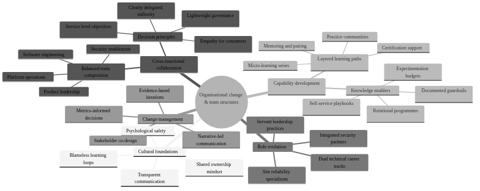

# Organisatorisk förändring och teamstrukturer


*Infrastructure as Code (arkitektur som kod) driver fundamental organisatorisk förändring från traditionella silos till cross-funktionella DevOps-team. Diagrammet illustrerar evolutionen från isolerade team till integrerade, samarbetsinriktade strukturer som optimerar för hastighet och kvalitet.*

Arkitektur som kod-metodiken utgör grunden för ## Organisatoriska förändringsprocessens komplexitet



*Mindmappen visualiserar de mångsidiga aspekterna av organisatorisk förändring vid Arkitektur som kod-arkitektur som kod-implementation. Den visar hur DevOps-kulturtransformation, cross-funktionella teamstrukturer, kompetensutveckling, rollförändring och change management är sammankopplade och måste hanteras holistiskt för framgångsrik transformation.*

## Övergripande beskrivning

Implementering av Infrastructure as Code kräver djupgående organisatoriska förändringar som sträcker sig långt bortom teknisk transformation. Traditionella IT-organisationer med separata utvecklings-, drift- och säkerhetsteam måste genomgå grundläggande omstrukturering för att fullt ut realisera fördelarna med kodbaserade arbetssätt.

Svenska organisationer står inför unika utmaningar när det gäller organisatorisk förändring genom starka fackliga traditioner, konsensusbaserade beslutsprocesser och etablerade hierarkiska struktururer. Successful arkitektur som kod adoption kräver change management strategier som respekterar dessa kulturella aspekter samtidigt som de främjar agile och collaborative arbetssätt.

Conway's Law beskriver hur organisationers kommunikationsstrukturer speglas i systemarkitekturen de producerar. För Arkitektur som kod-success måste organisationer medvetet designa teamstrukturer som supportar microservices, API-driven arkitekturer och automated deployment patterns som Infrastructure as Code möjliggör.

Modern DevOps-transformation inom svenska företag som Spotify, Klarna och King demonstrerar hur innovative organisationsdesign kan accelerate product development och operational efficiency. Dessa organisationer har utvecklat unika approaches till team autonomy, cross-functional collaboration och continuous improvement som kan adapt till olika svenska organisationskulturer.

## DevOps-kulturtransformation

DevOps representerar fundamental kulturförändering från "us vs them" mentalitet mellan development och operations till shared ownership av product lifecycle. Denna transformation kräver investment i både tekniska verktyg och kulturella förändringsinitiativ som promote collaboration, transparency och continuous learning.

Psychological safety utgör foundationen för effective DevOps teams genom att möjliggöra open communication kring mistakes, experimentation och continuous improvement. Svenska workplace culture med emphasis på consensus och equality provides natural foundation för building psychologically safe environments som support DevOps practices.

Blameless post-mortems och failure celebration är essentiella komponenter i DevOps culture som encourage innovation och risk-taking. Svenska organisationer med strong safety cultures kan leverage dessa principles för att create environments där teams kan experiment med new technologies och approaches utan fear of retribution för honest mistakes.

Continuous learning och skill development program måste support team members i developing cross-functional capabilities som bridge traditional development och operations boundaries. Investment i comprehensive training program för Arkitektur som kod tools, cloud platforms och automation practices ensures teams can effectively support modern infrastructure management.

## Cross-funktionella team strukturer

Cross-functional teams för Arkitektur som kod arkitektur som kod-implementation måste include diverse skills covering software development, systems administration, security engineering och product management. Effective team composition balances technical expertise med domain knowledge och ensures comprehensive coverage av infrastructure lifecycle management.

Team size optimization följer "two-pizza rule" principles där teams är små nog för effective communication men large nog för comprehensive skill coverage. Research suggests optimal Arkitektur som kod team sizes mellan 6-8 personer med representation från development, operations, security och product functions.

Role definition inom cross-functional teams måste support both specialized expertise och collaborative responsibilities. Infrastructure engineers, cloud architects, security specialists och product owners each contribute unique perspectives som require coordination through well-defined interfaces och shared responsibilities.

Team autonomy och decision-making authority är critical för Arkitektur som kod success eftersom infrastructure decisions often require rapid response to operational issues. Swedish organizations med consensus-based cultures måste balance democratic decision-making med need för quick operational responses under pressure situations.

## Kompetenshöjning och utbildning

Comprehensive training program för arkitektur som kod adoption måste cover technical skills, process changes och cultural transformation aspects. Multi-modal learning approaches including hands-on workshops, mentorship program och certification tracks ensure diverse learning preferences och skill levels är accommodated effectively.

Technical skill development tracks ska include Infrastructure as Code tools (Terraform, CloudFormation, Pulumi), cloud platforms (AWS, Azure, GCP), containerization technologies (Docker, Kubernetes), samt automation och monitoring tools. Progressive skill development från basic concepts till advanced implementation ensures systematic capability building.

Process training för DevOps workflows, git-based collaboration, code review practices och incident response procedures ensures teams can effectively coordinate complex infrastructure management activities. Integration av these processes med existing organizational workflows minimizes disruption samtidigt som new capabilities utvecklas.

Cultural transformation workshops focusing on DevOps principles, blameless culture, continuous improvement och cross-functional collaboration helps teams adapt till new working methods. Svenska organizations kan leverage existing collaboration traditions för att accelerate adoption av these new cultural patterns.

## Rollförändring och karriärutveckling

Traditional system administrator roles evolve toward Infrastructure Engineers som combine operational expertise med software development skills. Career development paths måste provide clear progression opportunities som recognize both technical depth och breadth av cross-functional capabilities.

Security professional integration in DevOps teams creates DevSecOps practices där security considerations är embedded throughout infrastructure lifecycle. Security engineers develop new skills i automated compliance, policy-as-code och security scanning integration medan de maintain specialization i threat analysis och risk assessment.

Network engineering roles transform toward software-defined networking och cloud networking specializations som require programming skills alongside traditional networking expertise. Cloud networking specialists develop capabilities i infrastructure automation samtidigt som de maintain deep technical knowledge i network protocols och architecture.

Management role evolution från command-and-control toward servant leadership models som support team autonomy och decision-making. Swedish managers med collaborative leadership styles är well-positioned för supporting DevOps team structures som emphasize distributed decision-making och continuous improvement.

## Change management strategier

Change management för arkitektur som kod adoption måste address both technical och cultural aspects av organizational transformation. Successful change strategies include stakeholder engagement, communication planning, resistance management och progress measurement som ensure sustainable organizational evolution.

Stakeholder mapping och engagement strategies identify key influencers, early adopters och potential resistance sources inom organizational. Swedish organizational dynamics med strong worker representation require inclusive approaches som involve unions, work councils och employee representatives i planning och implementation processes.

Communication strategies måste provide transparent information kring transformation goals, timeline, expected impacts och support resources. Regular town halls, progress updates och feedback sessions maintain organizational engagement samtidigt som they address concerns och questions från different stakeholder groups.

Resistance management techniques include identifying root causes av resistance, providing targeted support för concerned individuals och creating positive incentives för adoption. Understanding that resistance often stems från fear av job loss eller skill obsolescence allows organizations att address these concerns proactively through retraining och career development opportunities.

## Praktiska exempel

### DevOps Team Structure Blueprint
```yaml
# organizational_design/devops_team_structure.yaml
team_structure:
  name: "Infrastructure Platform Team"
  size: 7
  mission: "Enable autonomous product teams through self-service infrastructure"
  
  roles:
    - role: "Team Lead / Product Owner"
      responsibilities:
        - "Strategic direction och product roadmap"
        - "Stakeholder communication"
        - "Resource allocation och prioritization"
        - "Team development och performance management"
      skills_required:
        - "Product management"
        - "Technical leadership"
        - "Agile methodologies"
        - "Stakeholder management"
      
    - role: "Senior Infrastructure Engineer"
      count: 2
      responsibilities:
        - "Infrastructure as Code development"
        - "Cloud architecture design"
        - "Platform automation"
        - "Technical mentoring"
      skills_required:
        - "Terraform/CloudFormation expert"
        - "Multi-cloud platforms (AWS/Azure/GCP)"
        - "Containerization (Docker/Kubernetes)"
        - "CI/CD pipelines"
        - "Programming (Python/Go/Bash)"
        
    - role: "Cloud Security Engineer"
      responsibilities:
        - "Security policy as code"
        - "Compliance automation"
        - "Threat modeling för cloud infrastructure"
        - "Security scanning integration"
      skills_required:
        - "Cloud security arkitektur som kod best practices"
        - "Policy engines (OPA/AWS Config)"
        - "Security scanning tools"
        - "Compliance frameworks (ISO27001/SOC2)"
        
    - role: "Platform Automation Engineer"
      count: 2
      responsibilities:
        - "CI/CD pipeline development"
        - "Monitoring och observability"
        - "Self-service tool development"
        - "Developer experience improvement"
      skills_required:
        - "GitOps workflows"
        - "Monitoring stack (Prometheus/Grafana)"
        - "API development"
        - "Developer tooling"
        
    - role: "Site Reliability Engineer"
      responsibilities:
        - "Production operations"
        - "Incident response"
        - "Capacity planning"
        - "Performance optimization"
      skills_required:
        - "Production operations"
        - "Incident management"
        - "Performance analysis"
        - "Automation scripting"

  working_agreements:
    daily_standup: "09:00 CET daily"
    sprint_length: "2 weeks"
    retrospective: "End of each sprint"
    on_call_rotation: "1 week rotation, shared mellan SRE och Infrastructure Engineers"
    
  success_metrics:
    infrastructure_deployment_time: "< 15 minutes från commit till production"
    incident_resolution_time: "< 30 minutes for P1 incidents"
    developer_satisfaction: "> 4.5/5 i quarterly surveys"
    infrastructure_cost_efficiency: "10% yearly improvement"
    security_compliance_score: "> 95%"

  communication_patterns:
    internal_team:
      - "Daily standups för coordination"
      - "Weekly technical deep-dives"
      - "Monthly team retrospectives"
      - "Quarterly goal setting sessions"
      
    external_stakeholders:
      - "Bi-weekly demos för product teams"
      - "Monthly steering committee updates"
      - "Quarterly business review presentations"
      - "Ad-hoc consultation för complex integrations"

  decision_making:
    technical_decisions: "Consensus among technical team members"
    architectural_decisions: "Technical lead with team input"
    strategic_decisions: "Product owner with business stakeholder input"
    operational_decisions: "On-call engineer authority with escalation path"

  continuous_improvement:
    learning_budget: "40 hours per person per quarter"
    conference_attendance: "2 team members per year at major conferences"
    experimentation_time: "20% time för innovation projects"
    knowledge_sharing: "Monthly internal tech talks"
```

### Training Program Framework
```python
# training/iac_competency_framework.py
from datetime import datetime, timedelta
from typing import Dict, List, Optional
import json

class IaCCompetencyFramework:
    """
    Comprehensive competency framework för Infrastructure as Code skills
    """
    
    def __init__(self):
        self.competency_levels = {
            "novice": {
                "description": "Basic understanding, requires guidance",
                "hours_required": 40,
                "assessment_criteria": [
                    "Can execute predefined Arkitektur som kod templates",
                    "Understands basic cloud concepts",
                    "Can follow established procedures"
                ]
            },
            "intermediate": {
                "description": "Can work independently on common tasks", 
                "hours_required": 120,
                "assessment_criteria": [
                    "Can create simple Arkitektur som kod modules",
                    "Understands infrastructure dependencies",
                    "Can troubleshoot common issues"
                ]
            },
            "advanced": {
                "description": "Can design och lead complex implementations",
                "hours_required": 200,
                "assessment_criteria": [
                    "Can architect multi-environment solutions",
                    "Can mentor others effectively",
                    "Can design reusable patterns"
                ]
            },
            "expert": {
                "description": "Thought leader, can drive organizational standards",
                "hours_required": 300,
                "assessment_criteria": [
                    "Can drive organizational Arkitektur som kod strategy",
                    "Can design complex multi-cloud solutions",
                    "Can lead transformation initiatives"
                ]
            }
        }
        
        self.skill_domains = {
            "infrastructure_as_code": {
                "tools": ["Terraform", "CloudFormation", "Pulumi", "Ansible"],
                "concepts": ["Declarative syntax", "State management", "Module design"],
                "practices": ["Code organization", "Testing strategies", "CI/CD integration"]
            },
            "cloud_platforms": {
                "aws": ["EC2", "VPC", "RDS", "Lambda", "S3", "IAM"],
                "azure": ["Virtual Machines", "Resource Groups", "Storage", "Functions"],
                "gcp": ["Compute Engine", "VPC", "Cloud Storage", "Cloud Functions"],
                "multi_cloud": ["Provider abstraction", "Cost optimization", "Governance"]
            },
            "security_compliance": {
                "security": ["Identity management", "Network security", "Encryption"],
                "compliance": ["GDPR", "ISO27001", "SOC2", "Svenska säkerhetskrav"],
                "policy": ["Policy as Code", "Automated compliance", "Audit trails"]
            },
            "operations_monitoring": {
                "monitoring": ["Metrics collection", "Alerting", "Dashboards"],
                "logging": ["Log aggregation", "Analysis", "Retention"],
                "incident_response": ["Runbooks", "Post-mortems", "Automation"]
            }
        }
    
    def create_learning_path(self, current_level: str, target_level: str, 
                           focus_domains: List[str]) -> Dict:
        """Skapa personalized learning path för individual"""
        
        current_hours = self.competency_levels[current_level]["hours_required"]
        target_hours = self.competency_levels[target_level]["hours_required"]
        required_hours = target_hours - current_hours
        
        learning_path = {
            "individual_id": f"learner_{datetime.now().strftime('%Y%m%d_%H%M%S')}",
            "current_level": current_level,
            "target_level": target_level,
            "estimated_duration_hours": required_hours,
            "estimated_timeline_weeks": required_hours // 10,  # 10 hours per week
            "focus_domains": focus_domains,
            "learning_modules": []
        }
        
        # Generera learning modules baserat på focus domains
        for domain in focus_domains:
            if domain in self.skill_domains:
                modules = self._generate_domain_modules(domain, current_level, target_level)
                learning_path["learning_modules"].extend(modules)
        
        return learning_path
    
    def _generate_domain_modules(self, domain: str, current_level: str, 
                                target_level: str) -> List[Dict]:
        """Generera learning modules för specific domain"""
        
        modules = []
        domain_skills = self.skill_domains[domain]
        
        # Terraform Fundamentals Module
        if domain == "infrastructure_as_code":
            modules.append({
                "name": "Terraform Fundamentals för Svenska Organisationer",
                "duration_hours": 16,
                "type": "hands_on_workshop",
                "prerequisites": ["Basic Linux", "Cloud basics"],
                "learning_objectives": [
                    "Skapa basic Terraform configurations",
                    "Förstå state management",
                    "Implementera svenska compliance patterns",
                    "Integrara med svensk cloud infrastructure"
                ],
                "practical_exercises": [
                    "Deploy Swedish GDPR-compliant S3 bucket",
                    "Create VPC med svenska säkerhetskrav", 
                    "Implementera IAM policies för svenska organisationer",
                    "Set up monitoring enligt MSB-riktlinjer"
                ],
                "assessment": {
                    "type": "practical_project",
                    "description": "Deploy complete web application infrastructure med svenska compliance"
                }
            })
            
        # Cloud Security Module
        if domain == "security_compliance":
            modules.append({
                "name": "Cloud Security för Svenska Regelverk",
                "duration_hours": 12,
                "type": "blended_learning",
                "prerequisites": ["Cloud fundamentals", "Basic security concepts"],
                "learning_objectives": [
                    "Implementera GDPR-compliant infrastructure",
                    "Förstå MSB säkerhetskrav",
                    "Skapa automated compliance checking",
                    "Design secure network architectures"
                ],
                "practical_exercises": [
                    "Create GDPR-compliant data pipeline",
                    "Implement network security arkitektur som kod best practices",
                    "Set up automated compliance monitoring",
                    "Design incident response procedures"
                ],
                "assessment": {
                    "type": "compliance_audit",
                    "description": "Demonstrate infrastructure meets svenska säkerhetskrav"
                }
            })
            
        return modules
    
    def track_progress(self, individual_id: str, completed_module: str, 
                      assessment_score: float) -> Dict:
        """Track learning progress för individual"""
        
        progress_record = {
            "individual_id": individual_id,
            "module_completed": completed_module,
            "completion_date": datetime.now().isoformat(),
            "assessment_score": assessment_score,
            "certification_earned": assessment_score >= 0.8,
            "next_recommended_module": self._recommend_next_module(individual_id)
        }
        
        return progress_record
    
    def generate_team_competency_matrix(self, team_members: List[Dict]) -> Dict:
        """Generera team competency matrix för skills gap analysis"""
        
        competency_matrix = {
            "team_id": f"team_{datetime.now().strftime('%Y%m%d')}",
            "assessment_date": datetime.now().isoformat(),
            "team_size": len(team_members),
            "overall_readiness": 0,
            "skill_gaps": [],
            "training_recommendations": [],
            "members": []
        }
        
        total_competency = 0
        
        for member in team_members:
            member_assessment = {
                "name": member["name"],
                "role": member["role"],
                "current_skills": member.get("skills", {}),
                "competency_score": self._calculate_competency_score(member),
                "development_needs": self._identify_development_needs(member),
                "certification_status": member.get("certifications", [])
            }
            
            competency_matrix["members"].append(member_assessment)
            total_competency += member_assessment["competency_score"]
        
        competency_matrix["overall_readiness"] = total_competency / len(team_members)
        competency_matrix["skill_gaps"] = self._identify_team_skill_gaps(team_members)
        competency_matrix["training_recommendations"] = self._recommend_team_training(competency_matrix)
        
        return competency_matrix

def create_organizational_change_plan(organization_assessment: Dict) -> Dict:
    """Skapa comprehensive organizational change plan för arkitektur som kod adoption"""
    
    change_plan = {
        "organization": organization_assessment["name"],
        "current_state": organization_assessment["current_maturity"],
        "target_state": "advanced_devops",
        "timeline_months": 18,
        "phases": [
            {
                "name": "Foundation Building",
                "duration_months": 6,
                "objectives": [
                    "Establish DevOps culture basics",
                    "Implement basic arkitektur som kod practices",
                    "Create cross-functional teams",
                    "Set up initial toolchain"
                ],
                "activities": [
                    "DevOps culture workshops",
                    "Tool selection och setup",
                    "Team restructuring",
                    "Initial training program",
                    "Pilot project implementation"
                ],
                "success_criteria": [
                    "All teams trained on DevOps basics",
                    "Basic Arkitektur som kod deployment pipeline operational",
                    "Cross-functional teams established",
                    "Initial toolchain adopted"
                ]
            },
            {
                "name": "Capability Development", 
                "duration_months": 8,
                "objectives": [
                    "Scale arkitektur som kod practices across organization",
                    "Implement advanced automation",
                    "Establish monitoring och observability",
                    "Mature incident response processes"
                ],
                "activities": [
                    "Advanced Arkitektur som kod training rollout",
                    "Multi-environment deployment automation",
                    "Comprehensive monitoring implementation",
                    "Incident response process development",
                    "Security integration (DevSecOps)"
                ],
                "success_criteria": [
                    "arkitektur som kod practices adopted by all product teams",
                    "Automated deployment across all environments",
                    "Comprehensive observability implemented",
                    "Incident response processes mature"
                ]
            },
            {
                "name": "Optimization och Innovation",
                "duration_months": 4,
                "objectives": [
                    "Optimize existing processes",
                    "Implement advanced practices",
                    "Foster continuous innovation",
                    "Measure och improve business outcomes"
                ],
                "activities": [
                    "Process optimization based on metrics",
                    "Advanced practices implementation",
                    "Innovation time allocation",
                    "Business value measurement",
                    "Knowledge sharing program"
                ],
                "success_criteria": [
                    "Optimized processes delivering measurable value",
                    "Innovation culture established",
                    "Strong business outcome improvements",
                    "Self-sustaining improvement culture"
                ]
            }
        ],
        "change_management": {
            "communication_strategy": [
                "Monthly all-hands updates",
                "Quarterly progress reviews", 
                "Success story sharing",
                "Feedback collection mechanisms"
            ],
            "resistance_management": [
                "Early stakeholder engagement",
                "Addressing skill development concerns",
                "Providing clear career progression paths",
                "Celebrating early wins"
            ],
            "success_measurement": [
                "Employee satisfaction surveys",
                "Technical capability assessments",
                "Business value metrics",
                "Cultural transformation indicators"
            ]
        },
        "risk_mitigation": [
            "Gradual rollout to minimize disruption",
            "Comprehensive training to address skill gaps",
            "Clear communication to manage expectations",
            "Strong support structure för teams"
        ]
    }
    
    return change_plan
```

### Performance Measurement Framework
```yaml
# metrics/devops_performance_metrics.yaml
performance_measurement_framework:
  name: "DevOps Team Performance Metrics för Svenska Organisationer"
  
  technical_metrics:
    deployment_frequency:
      description: "How often team deploys to production"
      measurement: "Deployments per day/week"
      target_values:
        elite: "> 1 per day"
        high: "1 per week - 1 per day"
        medium: "1 per month - 1 per week" 
        low: "< 1 per month"
      collection_method: "Automated från CI/CD pipeline"
      
    lead_time_for_changes:
      description: "Time från code commit till production deployment"
      measurement: "Hours/days"
      target_values:
        elite: "< 1 hour"
        high: "1 day - 1 week"
        medium: "1 week - 1 month"
        low: "> 1 month"
      collection_method: "Git och deployment tool integration"
      
    mean_time_to_recovery:
      description: "Time to recover från production incidents"
      measurement: "Hours"
      target_values:
        elite: "< 1 hour"
        high: "< 1 day"
        medium: "1 day - 1 week"
        low: "> 1 week"
      collection_method: "Incident management system"
      
    change_failure_rate:
      description: "Percentage of deployments causing production issues"
      measurement: "Percentage"
      target_values:
        elite: "0-15%"
        high: "16-30%"
        medium: "31-45%"
        low: "> 45%"
      collection_method: "Incident correlation med deployments"

  business_metrics:
    infrastructure_cost_efficiency:
      description: "Cost per unit of business value delivered"
      measurement: "SEK per transaction/user/feature"
      target: "10% yearly improvement"
      collection_method: "Cloud billing API integration"
      
    developer_productivity:
      description: "Developer self-service capability"
      measurement: "Hours spent on infrastructure tasks per sprint"
      target: "< 20% of development time"
      collection_method: "Time tracking och developer surveys"
      
    compliance_adherence:
      description: "Adherence to svenska regulatory requirements"
      measurement: "Compliance score (0-100%)"
      target: "> 95%"
      collection_method: "Automated compliance scanning"
      
    customer_satisfaction:
      description: "Internal customer (developer) satisfaction"
      measurement: "Net Promoter Score"
      target: "> 50"
      collection_method: "Quarterly developer surveys"

  cultural_metrics:
    psychological_safety:
      description: "Team member comfort with taking risks och admitting mistakes"
      measurement: "Survey score (1-5)"
      target: "> 4.0"
      collection_method: "Quarterly team health surveys"
      
    learning_culture:
      description: "Investment in learning och experimentation"
      measurement: "Hours per person per quarter"
      target: "> 40 hours"
      collection_method: "Learning management system"
      
    collaboration_effectiveness:
      description: "Cross-functional team collaboration quality"
      measurement: "Survey score (1-5)"
      target: "> 4.0"
      collection_method: "360-degree feedback"
      
    innovation_rate:
      description: "Number of new ideas/experiments per quarter"
      measurement: "Count per team member"
      target: "> 2 per quarter"
      collection_method: "Innovation tracking system"

  collection_automation:
    data_sources:
      - "GitLab/GitHub API för code metrics"
      - "Jenkins/GitLab CI för deployment metrics"
      - "PagerDuty/OpsGenie för incident metrics"
      - "AWS/Azure billing API för cost metrics"
      - "Survey tools för cultural metrics"
      
    dashboard_tools:
      - "Grafana för technical metrics visualization"
      - "Tableau för business metrics analysis"
      - "Internal dashboard för team metrics"
      
    reporting_schedule:
      daily: ["Deployment frequency", "Incident count"]
      weekly: ["Lead time trends", "Cost analysis"]
      monthly: ["Team performance review", "Business value assessment"]
      quarterly: ["Cultural metrics", "Strategic review"]

  improvement_process:
    metric_review:
      frequency: "Monthly team retrospectives"
      participants: ["Team members", "Product owner", "Engineering manager"]
      outcome: "Improvement actions with owners och timelines"
      
    benchmarking:
      internal: "Compare teams within organization"
      industry: "Compare with DevOps industry standards"
      regional: "Compare with svenska tech companies"
      
    action_planning:
      identification: "Identify lowest-performing metrics"
      root_cause: "Analyze underlying causes"
      solutions: "Develop targeted improvement initiatives"
      tracking: "Monitor improvement progress monthly"
```

## Sammanfattning


Den moderna arkitektur som kod-metodiken representerar framtiden för infrastrukturhantering i svenska organisationer.
Organisatorisk förändring utgör den mest kritiska komponenten för successful Infrastructure as Code adoption. Technical tools och processes kan implementeras relativt snabbt, men cultural transformation och team restructuring kräver sustained effort över extended periods för att achieve lasting impact.

Svenska organisationer som investerar i comprehensive change management, cross-functional team development och continuous learning culture positionerar sig för long-term success med arkitektur som kod practices. Investment i people development och organizational design delivers compounding returns genom improved collaboration, faster innovation cycles och enhanced operational efficiency.

Success requires balanced focus på technical capability development, cultural transformation och measurement-driven improvement. Organizations som treats change management som equally important som technical implementation achieve significantly better outcomes från their arkitektur som kod transformation investments.

## Källor och referenser

- Puppet. "State of DevOps Report." Puppet Labs, 2023.
- Google. "DORA State of DevOps Research." Google Cloud, 2023.
- Spotify. "Spotify Engineering Culture." Spotify Technology, 2023.
- Team Topologies. "Organizing Business och Technology Teams." IT Revolution Press, 2023.
- Accelerate. "Building High Performing Technology Organizations." IT Revolution Press, 2023.
- McKinsey. "Organizational Transformation in Nordic Companies." McKinsey & Company, 2023.