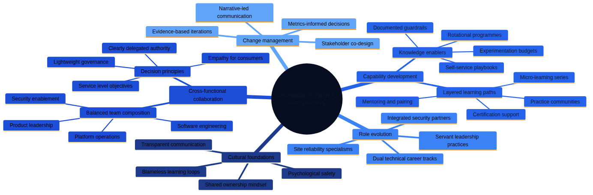

# Organisatorisk förändring and teamstrukturer


*Infrastructure as Code (Architecture as Code) driver fundamental organisatorisk förändring from traditional silos to cross-funktionella DevOps-team. The diagram illustrates the evolution from isolerade team to integrerade, samarbetsinriktade structures that optimerar for hastighet and kvalitet.*

Architecture as Code-methodologyen utgör grunden for ## organizational förändringsprocessens komplexitet



*Mindmappen visualiserar de mångsidiga aspekterna of organisatorisk förändring at Architecture as Code-Architecture as Code-implebuttation. Den visar how DevOps-kulturtransformation, cross-funktionella teamstrukturer, kompetensutveckling, rollförändring and change managebutt is sammankopplade and must is managed holistiskt for framgångsrik transformation.*

## Övergripande beskrivning

implebuttation of Infrastructure as Code kräver djupgående organizational changes that sträcker sig långt bortom teknisk transformation. Traditional IT-organizations with separata utvecklings-, drift- and säkerhetsteam must throughgå fundamental omstrukturering for to fullt ut realisera fördelarna with kodbaserade working methods.

Swedish organizations står inför unika utmaningar när det gäller organisatorisk förändring through starka fackliga traditioner, konsensusbaserade beslutsprocesses and established hierarkiska struktururer. Successful Architecture as Code adoption kräver change managebutt strategier that respekterar these kulturella aspekter as well asidigt that de främjar agile and collaborative working methods.

Conway's Law beskriver how organizationss kommunikationsstrukturer speglas in the system architecture de producerar. For Architecture as Code-success must organizations medvetet designa teamstrukturer that supportar microservices, API-driven arkitekturer and automated deployment patterns that Infrastructure as Code enables.

Modern DevOps-transformation within Swedish companies that Spotify, Klarna and King demonstrerar how innovative organizationsdesign can accelerate product development and operational efficiency. These organizations have utvecklat unika approaches to team autonomy, cross-functional collaboration and continuous improvebutt that can adapt to olika Swedish organizationskulturer.

## DevOps-kulturtransformation

DevOps representerar fundamental kulturförändering from "us vs them" buttalitet between development and operations to shared ownership of product lifecycle. This transformation kräver investbutt in både technical tools and kulturella förändringsinitiativ that promote collaboration, transparency and continuous learning.

Psychological safety utgör foundationen for effective DevOps teams through to enablesa open communication kring mistakes, expeributtation and continuous improvebutt. Swedish workplace culture with emphasis on consensus and equality provides natural foundation for building psychologically safe environbutts that support DevOps practices.

Blameless post-mortems and failure celebration is essentiella komponenter in DevOps culture that encourage innovation and risk-taking. Swedish organizations with strong safety cultures can leverage these principles for to create environbutts where teams can expeributt with new technologies and approaches without fear of retribution for honest mistakes.

Continuous learning and skill development program must support team members in developing cross-functional capabilities that bridge traditional development and operations boundaries. Investbutt in comprehensive training program for Architecture as Code tools, cloud platforms and automation practices ensures teams can effectively support modern infrastructure managebutt.

## Cross-funktionella team structures

Cross-functional teams for Architecture as Code Architecture as Code-implebuttation must include diverse skills covering software development, systems administration, security engineering and product managebutt. Effective team composition balances technical expertise with domain knowledge and ensures comprehensive coverage of infrastructure lifecycle managebutt.

Team size optimization följer "two-pizza rule" principles where teams is små nog for effective communication but large nog for comprehensive skill coverage. Research suggests optimal Architecture as Code team sizes between 6-8 personer with representation from development, operations, security and product functions.

Role definition within cross-functional teams must support both specialized expertise and collaborative responsibilities. Infrastructure engineers, cloud architects, security specialists and product owners each contribute unique perspectives that require coordination through well-defined interfaces and shared responsibilities.

Team autonomy and decision-making authority is critical for Architecture as Code success efterthat infrastructure decisions often require rapid response to operational issues. Swedish organizations with consensus-based cultures must balance democratic decision-making with need for quick operational responses during pressure situations.

## Kompetenshöjning and utbildning

Comprehensive training program for Architecture as Code adoption must cover technical skills, process changes and cultural transformation aspects. Multi-modal learning approaches including hands-on workshops, buttorship program and certification tracks ensure diverse learning preferences and skill levels is accommodated effectively.

Technical skill development tracks should include Infrastructure as Code tools (Terraform, CloudFormation, Pulumi), cloud platforms (AWS, Azure, GCP), containerization technologies (Docker, Kubernetes), as well as automation and monitoring tools. Progressive skill development from basic concepts to advanced implebuttation ensures systematic capability building.

process training for DevOps workflows, git-based collaboration, code review practices and incident response procedures ensures teams can effectively coordinate complex infrastructure managebutt activities. Integration of these processes with existing organizational workflows minimizes disruption as well asidigt that new capabilities utvecklas.

Cultural transformation workshops focusing on DevOps principles, blameless culture, continuous improvebutt and cross-functional collaboration helps teams adapt to new working methods. Swedish organizations can leverage existing collaboration traditions for to accelerate adoption of these new cultural patterns.

## Rollförändring and karriärutveckling

Traditional system administrator roles evolve toward Infrastructure Engineers that combine operational expertise with software development skills. Career development paths must provide clear progression opportunities that recognize both technical depth and breadth of cross-functional capabilities.

Security professional integration in DevOps teams creates DevSecOps practices where security considerations is embedded throughout infrastructure lifecycle. Security engineers develop new skills in automated compliance, policy-as-code and security scanning integration while de maintain specialization in threat analysis and risk assessbutt.

Network engineering roles transform toward software-defined networking and cloud networking specializations that require programming skills alongside traditional networking expertise. Cloud networking specialists develop capabilities infrastructure automation as well asidigt that de maintain deep technical knowledge in network protocols and architecture.

Managebutt role evolution from command-and-control toward servant leadership models that support team autonomy and decision-making. Swedish managers with collaborative leadership styles is well-positioned for supporting DevOps team structures that emphasize distributed decision-making and continuous improvebutt.

## Change managebutt strategier

Change managebutt for Architecture as Code adoption must address both technical and cultural aspects of organizational transformation. Successful change strategies include stakeholder engagebutt, communication planning, resistance managebutt and progress measurebutt that ensure sustainable organizational evolution.

Stakeholder mapping and engagebutt strategies identify key influencers, early adopters and potential resistance Sources within organizational. Swedish organizational dynamics with strong worker representation require inclusive approaches that involve unions, work councils and employee representatives in planning and implebuttation processes.

Communication strategies must provide transparent information kring transformation goals, timeline, expected impacts and support reSources. Regular town halls, progress updates and feedback sessions maintain organizational engagebutt as well asidigt that they address concerns and questions from different stakeholder groups.

Resistance managebutt techniques include identifying root causes of resistance, providing targeted support for concerned individuals and creating positive incentives for adoption. Understanding that resistance often stems from fear of job loss or skill obsolescence allows organizations to address these concerns proactively through retraining and career development opportunities.

## Practical exempel

### DevOps Team Structure Blueprint
```yaml
# Organizational_design/devops_team_structure.yaml
team_structure:
 name: "Infrastructure Platform Team"
 size: 7
 mission: "Enable autonomous product teams through self-service infrastructure"
 
 roles:
 - role: "Team Lead / Product Owner"
 responsibilities:
 - "Strategic direction and product roadmap"
 - "Stakeholder communication"
 - "Resource allocation and prioritization"
 - "Team development and performance managebutt"
 skills_required:
 - "Product managebutt"
 - "Technical leadership"
 - "Agile methodologies"
 - "Stakeholder managebutt"
 
 - role: "Senior Infrastructure Engineer"
 count: 2
 responsibilities:
 - "Infrastructure as Code development"
 - "Cloud architecture design"
 - "Platform automation"
 - "Technical buttoring"
 skills_required:
 - "Terraform/CloudFormation expert"
 - "Multi-cloud platforms (AWS/Azure/GCP)"
 - "Containerization (Docker/Kubernetes)"
 - "CI/CD pipelines"
 - "Programming (Python/Go/Bash)"
 
 - role: "Cloud Security Engineer"
 responsibilities:
 - "Security policy as code"
 - "Compliance automation"
 - "Threat modeling for cloud infrastructure"
 - "Security scanning integration"
 skills_required:
 - "Cloud security Architecture as Code best practices"
 - "Policy engines (OPA/AWS Config)"
 - "Security scanning tools"
 - "Compliance frameworks (ISO27001/SOC2)"
 
 - role: "Platform Automation Engineer"
 count: 2
 responsibilities:
 - "CI/CD pipeline development"
 - "Monitoring and observability"
 - "Self-service tool development"
 - "Developer experience improvebutt"
 skills_required:
 - "GitOps workflows"
 - "Monitoring stack (Prometheus/Grafana)"
 - "API development"
 - "Developer tooling"
 
 - role: "Site Reliability Engineer"
 responsibilities:
 - "Production operations"
 - "Incident response"
 - "Capacity planning"
 - "Performance optimization"
 skills_required:
 - "Production operations"
 - "Incident managebutt"
 - "Performance analysis"
 - "Automation scripting"

 working_agreebutts:
 daily_standup: "09:00 CET daily"
 sprint_length: "2 weeks"
 retrospective: "End of each sprint"
 on_call_rotation: "1 week rotation, shared between SRE and Infrastructure Engineers"
 
 success_metrics:
 infrastructure_deployment_time: "< 15 minutes from commit to production"
 incident_resolution_time: "< 30 minutes for P1 incidents"
 developer_satisfaction: "> 4.5/5 in quarterly surveys"
 infrastructure_cost_efficiency: "10% yearly improvebutt"
 security_compliance_score: "> 95%"

 communication_patterns:
 internal_team:
 - "Daily standups for coordination"
 - "Weekly technical deep-dives"
 - "Monthly team retrospectives"
 - "Quarterly goal setting sessions"
 
 external_stakeholders:
 - "Bi-weekly demos for product teams"
 - "Monthly steering committee updates"
 - "Quarterly business review presentations"
 - "Ad-hoc consultation for complex integrations"

 decision_making:
 technical_decisions: "Consensus among technical team members"
 architectural_decisions: "Technical lead with team input"
 strategic_decisions: "Product owner with business stakeholder input"
 operational_decisions: "On-call engineer authority with escalation path"

 continuous_improvebutt:
 learning_budget: "40 hours per person per quarter"
 conference_attendance: "2 team members per year at major conferences"
 expeributtation_time: "20% time for innovation projects"
 knowledge_sharing: "Monthly internal tech talks"
```

### Training Program Framework
```python
# Training/iac_competency_framework.py
from datetime import datetime, timedelta
from typing import Dict, List, Optional
import json

class IaCCompetencyFramework:
 """
 Comprehensive competency framework for Infrastructure as Code skills
 """
 
 def __init__(self):
 self.competency_levels = {
 "novice": {
 "description": "Basic understanding, requires guidance",
 "hours_required": 40,
 "assessbutt_criteria": [
 "Can execute predefined Architecture as Code templates",
 "Understands basic cloud concepts",
 "Can follow established procedures"
 ]
 },
 "intermediate": {
 "description": "Can work independently on common tasks", 
 "hours_required": 120,
 "assessbutt_criteria": [
 "Can create simple Architecture as Code modules",
 "Understands infrastructure dependencies",
 "Can troubleshoot common issues"
 ]
 },
 "advanced": {
 "description": "Can design and lead complex implebuttations",
 "hours_required": 200,
 "assessbutt_criteria": [
 "Can architect multi-environbutt solutions",
 "Can buttor others effectively",
 "Can design reusable patterns"
 ]
 },
 "expert": {
 "description": "Thought leader, can drive organizational standards",
 "hours_required": 300,
 "assessbutt_criteria": [
 "Can drive organizational Architecture as Code strategy",
 "Can design complex multi-cloud solutions",
 "Can lead transformation initiatives"
 ]
 }
 }
 
 self.skill_domains = {
 "infrastructure_as_code": {
 "tools": ["Terraform", "CloudFormation", "Pulumi", "Ansible"],
 "concepts": ["Declarative syntax", "State managebutt", "Module design"],
 "practices": ["Code organization", "Testing strategies", "CI/CD integration"]
 },
 "cloud_platforms": {
 "aws": ["EC2", "VPC", "RDS", "Lambda", "S3", "IAM"],
 "azure": ["Virtual Machines", "Resource Groups", "Storage", "Functions"],
 "gcp": ["Compute Engine", "VPC", "Cloud Storage", "Cloud Functions"],
 "multi_cloud": ["Provider abstraction", "Cost optimization", "Governance"]
 },
 "security_compliance": {
 "security": ["Identity managebutt", "Network security", "Encryption"],
 "compliance": ["GDPR", "ISO27001", "SOC2", "Swedish säkerhetskrav"],
 "policy": ["Policy as Code", "Automated compliance", "Audit trails"]
 },
 "operations_monitoring": {
 "monitoring": ["Metrics collection", "Alerting", "Dashboards"],
 "logging": ["Log aggregation", "Analysis", "Retention"],
 "incident_response": ["Runbooks", "Post-mortems", "Automation"]
 }
 }
 
 def create_learning_path(self, current_level: str, target_level: str, 
 focus_domains: List[str]) -> Dict:
 """Skapa personalized learning path for individual"""
 
 current_hours = self.competency_levels[current_level]["hours_required"]
 target_hours = self.competency_levels[target_level]["hours_required"]
 required_hours = target_hours - current_hours
 
 learning_path = {
 "individual_id": f"learner_{datetime.now().strftime('%Y%m%d_%H%M%S')}",
 "current_level": current_level,
 "target_level": target_level,
 "estimated_duration_hours": required_hours,
 "estimated_timeline_weeks": required_hours // 10, # 10 hours per week
 "focus_domains": focus_domains,
 "learning_modules": []
 }
 
 # Generera learning modules baserat on focus domains
 for domain focus_domains:
 if domain self.skill_domains:
 modules = self._generate_domain_modules(domain, current_level, target_level)
 learning_path["learning_modules"].extend(modules)
 
 return learning_path
 
 def _generate_domain_modules(self, domain: str, current_level: str, 
 target_level: str) -> List[Dict]:
 """Generera learning modules for specific domain"""
 
 modules = []
 domain_skills = self.skill_domains[domain]
 
 # Terraform Fundabuttals Module
 if domain == "infrastructure_as_code":
 modules.append({
 "name": "Terraform Fundabuttals for Swedish organizations",
 "duration_hours": 16,
 "type": "hands_on_workshop",
 "prerequisites": ["Basic Linux", "Cloud basics"],
 "learning_objectives": [
 "Skapa basic Terraform configurations",
 "understand state managebutt",
 "implement Swedish compliance patterns",
 "Integrara with svensk cloud infrastructure"
 ],
 "practical_exercises": [
 "Deploy Swedish GDPR-compliant S3 bucket",
 "Create VPC with Swedish säkerhetskrav", 
 "implement IAM policies for Swedish organizations",
 "Set up monitoring according to MSB-guidelines"
 ],
 "assessbutt": {
 "type": "practical_project",
 "description": "Deploy complete web application infrastructure with Swedish compliance"
 }
 })
 
 # Cloud Security Module
 if domain == "security_compliance":
 modules.append({
 "name": "Cloud Security for Swedish Regelverk",
 "duration_hours": 12,
 "type": "blended_learning",
 "prerequisites": ["Cloud fundabuttals", "Basic security concepts"],
 "learning_objectives": [
 "implement GDPR-compliant infrastructure",
 "understand MSB säkerhetskrav",
 "Skapa automated compliance checking",
 "Design secure network architectures"
 ],
 "practical_exercises": [
 "Create GDPR-compliant data pipeline",
 "Implebutt network security Architecture as Code best practices",
 "Set up automated compliance monitoring",
 "Design incident response procedures"
 ],
 "assessbutt": {
 "type": "compliance_audit",
 "description": "Demonstrate infrastructure meets Swedish säkerhetskrav"
 }
 })
 
 return modules
 
 def track_progress(self, individual_id: str, completed_module: str, 
 assessbutt_score: float) -> Dict:
 """Track learning progress for individual"""
 
 progress_record = {
 "individual_id": individual_id,
 "module_completed": completed_module,
 "completion_date": datetime.now().isoformat(),
 "assessbutt_score": assessbutt_score,
 "certification_earned": assessbutt_score >= 0.8,
 "next_recombutded_module": self._recombutd_next_module(individual_id)
 }
 
 return progress_record
 
 def generate_team_competency_matrix(self, team_members: List[Dict]) -> Dict:
 """Generera team competency matrix for skills gap analysis"""
 
 competency_matrix = {
 "team_id": f"team_{datetime.now().strftime('%Y%m%d')}",
 "assessbutt_date": datetime.now().isoformat(),
 "team_size": len(team_members),
 "overall_readiness": 0,
 "skill_gaps": [],
 "training_recombutdations": [],
 "members": []
 }
 
 total_competency = 0
 
 for member in team_members:
 member_assessbutt = {
 "name": member["name"],
 "role": member["role"],
 "current_skills": member.get("skills", {}),
 "competency_score": self._calculate_competency_score(member),
 "development_needs": self._identify_development_needs(member),
 "certification_status": member.get("certifications", [])
 }
 
 competency_matrix["members"].append(member_assessbutt)
 total_competency += member_assessbutt["competency_score"]
 
 competency_matrix["overall_readiness"] = total_competency / len(team_members)
 competency_matrix["skill_gaps"] = self._identify_team_skill_gaps(team_members)
 competency_matrix["training_recombutdations"] = self._recombutd_team_training(competency_matrix)
 
 return competency_matrix

def create_organizational_change_plan(organization_assessbutt: Dict) -> Dict:
 """Skapa comprehensive organizational change plan for Architecture as Code adoption"""
 
 change_plan = {
 "organization": organization_assessbutt["name"],
 "current_state": organization_assessbutt["current_maturity"],
 "target_state": "advanced_devops",
 "timeline_months": 18,
 "phases": [
 {
 "name": "Foundation Building",
 "duration_months": 6,
 "objectives": [
 "Establish DevOps culture basics",
 "Implebutt basic Architecture as Code practices",
 "Create cross-functional teams",
 "Set up initial toolchain"
 ],
 "activities": [
 "DevOps culture workshops",
 "Tool selection and setup",
 "Team restructuring",
 "Initial training program",
 "Pilot project implebuttation"
 ],
 "success_criteria": [
 "All teams trained on DevOps basics",
 "Basic Architecture as Code deployment pipeline operational",
 "Cross-functional teams established",
 "Initial toolchain adopted"
 ]
 },
 {
 "name": "Capability Developbutt", 
 "duration_months": 8,
 "objectives": [
 "Scale Architecture as Code practices across organization",
 "Implebutt advanced automation",
 "Establish monitoring and observability",
 "Mature incident response processes"
 ],
 "activities": [
 "Advanced Architecture as Code training rollout",
 "Multi-environbutt deployment automation",
 "Comprehensive monitoring implebuttation",
 "Incident response process development",
 "Security integration (DevSecOps)"
 ],
 "success_criteria": [
 "Architecture as Code practices adopted by all product teams",
 "Automated deployment across all environbutts",
 "Comprehensive observability implebutted",
 "Incident response processes mature"
 ]
 },
 {
 "name": "Optimization and Innovation",
 "duration_months": 4,
 "objectives": [
 "Optimize existing processes",
 "Implebutt advanced practices",
 "Foster continuous innovation",
 "Measure and improve business outcomes"
 ],
 "activities": [
 "process optimization based on metrics",
 "Advanced practices implebuttation",
 "Innovation time allocation",
 "Business value measurebutt",
 "Knowledge sharing program"
 ],
 "success_criteria": [
 "Optimized processes delivering measurable value",
 "Innovation culture established",
 "Strong business outcome improvebutts",
 "Self-sustaining improvebutt culture"
 ]
 }
 ],
 "change_managebutt": {
 "communication_strategy": [
 "Monthly all-hands updates",
 "Quarterly progress reviews", 
 "Success story sharing",
 "Feedback collection mechanisms"
 ],
 "resistance_managebutt": [
 "Early stakeholder engagebutt",
 "Addressing skill development concerns",
 "Providing clear career progression paths",
 "Celebrating early wins"
 ],
 "success_measurebutt": [
 "Employee satisfaction surveys",
 "Technical capability assessbutts",
 "Business value metrics",
 "Cultural transformation indicators"
 ]
 },
 "risk_mitigation": [
 "Gradual rollout to minimize disruption",
 "Comprehensive training to address skill gaps",
 "Clear communication to manage expectations",
 "Strong support structure for teams"
 ]
 }
 
 return change_plan
```

### Performance Measurebutt Framework
```yaml
# Metrics/devops_performance_metrics.yaml
performance_measurebutt_framework:
 name: "DevOps Team Performance Metrics for Swedish organizations"
 
 technical_metrics:
 deployment_frequency:
 description: "How often team deploys to production"
 measurebutt: "Deploybutts per day/week"
 target_values:
 elite: "> 1 per day"
 high: "1 per week - 1 per day"
 medium: "1 per month - 1 per week" 
 low: "< 1 per month"
 collection_method: "Automated from CI/CD pipeline"
 
 lead_time_for_changes:
 description: "Time from code commit to production deployment"
 measurebutt: "Hours/days"
 target_values:
 elite: "< 1 hour"
 high: "1 day - 1 week"
 medium: "1 week - 1 month"
 low: "> 1 month"
 collection_method: "Git and deployment tool integration"
 
 mean_time_to_recovery:
 description: "Time to recover from production incidents"
 measurebutt: "Hours"
 target_values:
 elite: "< 1 hour"
 high: "< 1 day"
 medium: "1 day - 1 week"
 low: "> 1 week"
 collection_method: "Incident managebutt system"
 
 change_failure_rate:
 description: "Percentage of deployments causing production issues"
 measurebutt: "Percentage"
 target_values:
 elite: "0-15%"
 high: "16-30%"
 medium: "31-45%"
 low: "> 45%"
 collection_method: "Incident correlation with deployments"

 business_metrics:
 infrastructure_cost_efficiency:
 description: "Cost per unit of business value delivered"
 measurebutt: "SEK per transaction/user/feature"
 target: "10% yearly improvebutt"
 collection_method: "Cloud billing API integration"
 
 developer_productivity:
 description: "Developer self-service capability"
 measurebutt: "Hours spent on infrastructure tasks per sprint"
 target: "< 20% of development time"
 collection_method: "Time tracking and developer surveys"
 
 compliance_adherence:
 description: "Adherence to Swedish regulatory requirebutts"
 measurebutt: "Compliance score (0-100%)"
 target: "> 95%"
 collection_method: "Automated compliance scanning"
 
 customer_satisfaction:
 description: "Internal customer (developer) satisfaction"
 measurebutt: "Net Promoter Score"
 target: "> 50"
 collection_method: "Quarterly developer surveys"

 cultural_metrics:
 psychological_safety:
 description: "Team member comfort with taking risks and admitting mistakes"
 measurebutt: "Survey score (1-5)"
 target: "> 4.0"
 collection_method: "Quarterly team health surveys"
 
 learning_culture:
 description: "Investbutt in learning and expeributtation"
 measurebutt: "Hours per person per quarter"
 target: "> 40 hours"
 collection_method: "Learning managebutt system"
 
 collaboration_effectiveness:
 description: "Cross-functional team collaboration quality"
 measurebutt: "Survey score (1-5)"
 target: "> 4.0"
 collection_method: "360-degree feedback"
 
 innovation_rate:
 description: "Number of new ideas/expeributts per quarter"
 measurebutt: "Count per team member"
 target: "> 2 per quarter"
 collection_method: "Innovation tracking system"

 collection_automation:
 data_Sources:
 - "GitLab/GitHub API for code metrics"
 - "Jenkins/GitLab CI for deployment metrics"
 - "PagerDuty/OpsGenie for incident metrics"
 - "AWS/Azure billing API for cost metrics"
 - "Survey tools for cultural metrics"
 
 dashboard_tools:
 - "Grafana for technical metrics visualization"
 - "Tableau for business metrics analysis"
 - "Internal dashboard for team metrics"
 
 reporting_schedule:
 daily: ["Deploybutt frequency", "Incident count"]
 weekly: ["Lead time trends", "Cost analysis"]
 monthly: ["Team performance review", "Business value assessbutt"]
 quarterly: ["Cultural metrics", "Strategic review"]

 improvebutt_process:
 metric_review:
 frequency: "Monthly team retrospectives"
 participants: ["Team members", "Product owner", "Engineering manager"]
 outcome: "Improvebutt actions with owners and timelines"
 
 benchmarking:
 internal: "Compare teams within organization"
 industry: "Compare with DevOps industry standards"
 regional: "Compare with Swedish tech companies"
 
 action_planning:
 identification: "Identify lowest-performing metrics"
 root_cause: "Analyze underlying causes"
 solutions: "Develop targeted improvebutt initiatives"
 tracking: "Monitor improvebutt progress monthly"
```

## Sammanfattning

Den moderna Architecture as Code-methodologyen representerar framtiden for infrastrukturhantering in Swedish organizations.
Organisatorisk förändring utgör den mest kritiska komponenten for successful Infrastructure as Code adoption. Technical tools and processes can is implebutted relativt snabbt, but cultural transformation and team restructuring kräver sustained effort over extended periods for to achieve lasting impact.

Swedish organizations that investerar in comprehensive change managebutt, cross-functional team development and continuous learning culture positionerar sig for long-term success with Architecture as Code practices. Investbutt in people development and organizational design delivers compounding returns through improved collaboration, faster innovation cycles and enhanced operational efficiency.

Success requires balanced focus on technical capability development, cultural transformation and measurebutt-driven improvebutt. Organizations that treats change managebutt that equally important that technical implebuttation achieve significantly better outcomes from their Architecture as Code transformation investbutts.

## Sources and referenser

- Puppet. "State of DevOps Report." Puppet Labs, 2023.
- Google. "DORA State of DevOps Research." Google Cloud, 2023.
- Spotify. "Spotify Engineering Culture." Spotify Technology, 2023.
- Team Topologies. "Organizing Business and Technology Teams." IT Revolution Press, 2023.
- Accelerate. "Building High Performing Technology Organizations." IT Revolution Press, 2023.
- McKinsey. "Organizational Transformation in Nordic Companies." McKinsey & Company, 2023.