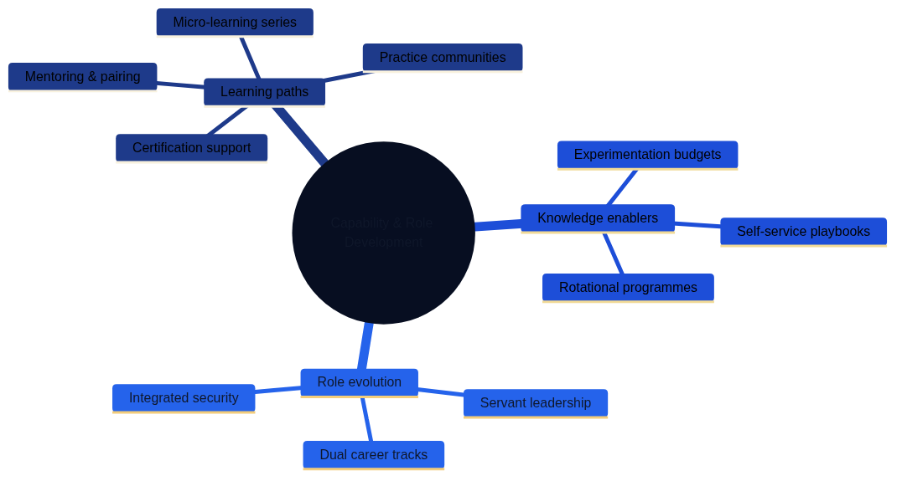

# Organisational Change and Team Structures {#organisational-change}

Architecture as Code changes far more than tooling. It demands new habits, shared language, and organisational structures that keep pace with automated delivery. Sustainable transformation happens when leadership connects strategy, culture, and day-to-day practices so teams can deliver infrastructure with the same confidence and cadence as software.

Organisations rarely adopt Architecture as Code principles overnight. Instead, they move through progressive stages, each building on earlier capabilities whilst introducing new collaboration patterns and decision-making structures. Understanding this evolution helps leadership anticipate challenges, allocate resources, and maintain momentum through periods of rapid change.

Figure 17.1 summarises the journey from siloed functions towards integrated, product-aligned teams that own outcomes together. The progression emphasises the deliberate shifts in mindset, decision making, and flow of work that underpin a mature Architecture as Code capability.

| Transformation Stage | Team Structure | Decision Making | Automation Maturity | Key Characteristics |
|---------------------|----------------|-----------------|---------------------|---------------------|
| Siloed functions | Separate development and operations teams | Handoffs through tickets and change requests | Manual provisioning, script-based | Limited collaboration, slow feedback loops, blame culture |
| Basic collaboration | Shared goals but separate execution | Regular meetings and shared backlogs | Basic CI/CD, some automated testing | Improved communication, reduced handoff friction |
| Cross-functional teams | Mixed skillsets in single teams | Collective ownership of outcomes | Infrastructure as Code, automated deployments | Shared responsibility, faster delivery, learning culture |
| Product-aligned teams | Self-service platforms, product thinking | Autonomous within guardrails | Full automation, self-healing systems | Outcome focus, platform mentality, continuous improvement |

*The transformation journey illustrates how organisations evolve from isolated teams to collaborative, outcome-focused delivery groups once Architecture as Code principles are embedded. Each stage represents measurable progress in automation maturity, team integration, and delivery velocity, allowing leaders to calibrate investments and expectations accordingly.*

## Building a DevOps Culture

DevOps practices create the social contract that allows infrastructure and application specialists to move at the same tempo. When teams share responsibilities rather than hand off tasks, they develop mutual respect for each other's constraints and opportunities. This foundation becomes especially important once automated infrastructure changes flow through production multiple times per day.

Psychological safety, transparent communication, and inclusive retrospectives help teams learn from incidents without blame. Rather than penalising honest mistakes, high-performing organisations treat failures as tuition fees for valuable lessons. This mindset shift prevents defensive behaviours that slow experimentation and drive knowledge underground.

Organisations that celebrate experimentation and view failure as tuition invest in coaching, community practice, and leadership behaviours that make cross-functional collaboration the default. Senior leaders model vulnerability by sharing their own learning journeys, creating permission structures that encourage junior staff to ask questions and propose improvements without fear of criticism.

## Designing Cross-functional Teams

Moving beyond traditional organisational silos requires deliberate structural changes. Teams delivering shared platforms need a balanced mix of product thinking, operational discipline, and security awareness. Without explicit attention to composition, teams risk reverting to narrow functional boundaries that inhibit flow and slow decision making.

Effective transformation programmes address multiple dimensions simultaneously rather than treating culture, skills, or governance as independent variables. Figures 17.2, 17.3, and 17.4 map the relationships between culture, team composition, skill growth, and change management activities that support those outcomes.

*The first mind map shows how cultural foundations and cross-functional team structures create the basis for organisational change.*

*The second mind map illustrates learning paths, knowledge enablers, and evolving roles that support continuous improvement.*

*The third mind map demonstrates how stakeholder co-design, narrative communication, and evidence-based iteration drive successful transformation.*

To keep autonomy and alignment in harmony, organisations pair clear decision rights with shared standards. Appendix A, [listing 17-A](30_appendix_code_examples.md#17_code_1), provides a full Infrastructure Platform Team blueprint that product leaders can tailor to their own context. The blueprint illustrates how responsibilities, skills, and success measures join up in a single operating model.

## Developing Capability and Confidence

Initial enthusiasm for Architecture as Code often fades once teams confront the practical challenges of managing state, debugging drift, and maintaining complex module dependencies. Structured learning pathways sustain momentum once foundational changes take hold. Without ongoing skill development, organisations risk creating isolated pockets of expertise that become bottlenecks and single points of failure.

Micro-learning sessions, role-based mentoring, and internal communities give practitioners the confidence to automate sensitive workloads responsibly. Rather than relying solely on formal training courses, leading organisations embed learning into daily workflows through pair programming, code reviews, and lunch-and-learn sessions that lower the barrier to knowledge sharing.

Appendix A, [listing 17-B](30_appendix_code_examples.md#17_code_2), outlines a reusable competency framework and tracking utilities that help teams personalise development journeys and monitor progress over time. The framework recognises that engineers advance at different rates and through different paths, providing structure without forcing everyone through identical curricula.

## Evolving Roles and Career Paths

Architecture as Code blurs traditional boundaries between development, operations, and infrastructure management. Modern infrastructure roles blend software engineering, governance, and customer advocacy in ways that existing job descriptions often fail to capture. Organisations that cling to outdated role definitions struggle to attract talent and risk losing skilled practitioners to employers who recognise and reward these hybrid capabilities.

Site reliability engineers, platform product owners, and security partners work from shared roadmaps and adopt servant leadership behaviours to unlock their colleagues' potential. These roles require both deep technical expertise and the interpersonal skills to influence without direct authority, a combination that few training programmes explicitly develop.

Career development frameworks must recognise deep expertise and cross-disciplinary breadth so people can advance without leaving technical tracks. Dual-ladder career structures, technical leadership programmes, and rotation opportunities prevent the common pattern where the best engineers are promoted into management roles they neither want nor excel in, depleting technical capability whilst creating unhappy managers.

## Change Management in Practice

Transformation initiatives that focus solely on technology adoption whilst ignoring human factors consistently underdeliver. Successful change programmes treat stakeholders as partners rather than passive recipients of mandates from above. Early engagement with finance, security, procurement, and operations ensures that policy and compliance guardrails evolve alongside automation.

Resistance to change often signals legitimate concerns about job security, skill gaps, or process disruption rather than simple obstinacy. Leaders who take time to understand these concerns and address them directly build trust that accelerates adoption. Structured communications plans, lightweight pilot initiatives, and visible sponsorship help teams internalise why the organisation is changing, not only what is changing.

Pilot projects serve dual purposes: they prove technical feasibility whilst creating reference stories that persuade sceptical stakeholders. Starting with low-risk, high-visibility use cases generates early wins that build momentum without risking business-critical systems. These successes create advocates who speak from experience rather than theory, a far more persuasive force than executive mandates.

## Measuring Sustainable Progress

Transformation programmes that lack clear success criteria drift aimlessly or claim victory prematurely based on activity metrics rather than outcomes. Insightful metrics keep transformation honest by connecting technical improvements to business value. Leading indicators such as deployment frequency, recovery time, developer satisfaction, and onboarding effort demonstrate whether cultural shifts translate into measurable delivery improvements.

The most effective measurement frameworks balance technical, business, and cultural dimensions rather than focusing narrowly on infrastructure metrics. DORA metrics (deployment frequency, lead time, change failure rate, and recovery time) provide baseline technical health indicators, whilst developer satisfaction surveys and onboarding time reveal whether the organisation is building sustainable capabilities or burning out its people.

Appendix A, [listing 17-C](30_appendix_code_examples.md#17_code_3), presents a neutral, globally relevant performance measurement framework that can be automated through standard DevOps toolchains. The framework emphasises leading indicators that teams can influence directly rather than lagging indicators that only confirm success or failure after opportunities for course correction have passed.

## Summary

Architecture as Code succeeds when organisations invest equally in people, process, and technology. Tools and platforms create possibilities, but sustained transformation requires deliberate attention to culture, capability development, and organisational structures that reward collaboration over individual heroics.

Cross-functional teams, purposeful learning, and adaptive leadership turn automation into enduring capability rather than fragile scripts maintained by isolated specialists. These teams combine deep technical expertise with product thinking and operational discipline, creating feedback loops that continuously improve both the platform and the teams that build it.

By linking cultural commitments with transparent measurement and clear governance, enterprises create an environment where resilient infrastructure becomes a shared responsibility. The practices outlined in this chapter—from psychological safety to competency frameworks to DevOps metrics—provide concrete starting points for organisations at any stage of their transformation journey.

## Sources and References

- Puppet. "State of DevOps Report." Puppet Labs, 2023.
- Google. "DORA State of DevOps Research." Google Cloud, 2023.
- Spotify. "Spotify Engineering Culture." Spotify Technology, 2023.
- Team Topologies. "Organising Business and Technology Teams." IT Revolution Press, 2023.
- Accelerate. "Building High Performing Technology Organisations." IT Revolution Press, 2023.
- McKinsey & Company. "Organisational Transformation Best Practices." McKinsey Digital, 2023.
