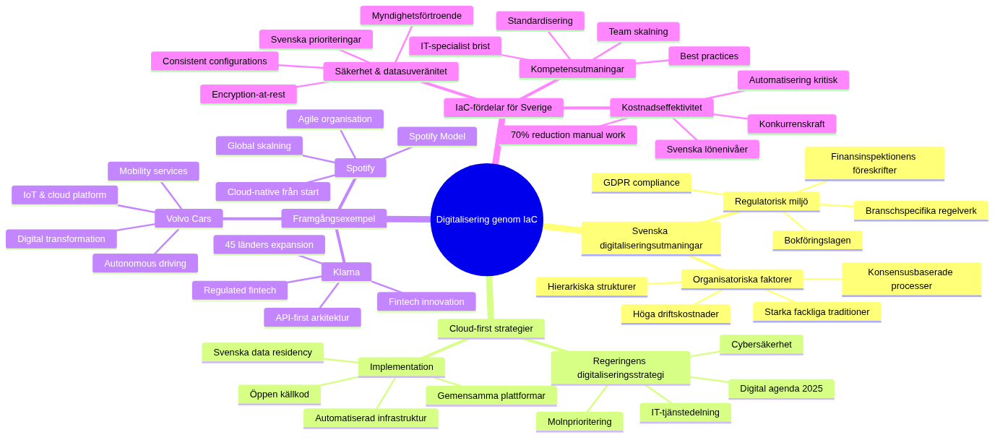

# Digitalisering through arkitektur that Architecture as Code-baserad infrastructure


*Infrastructure as Code utgör ryggraden in moderna digitaliseringsinitiativ through to enablesa snabb, skalbar and kostnadseffektiv transformation of IT-miljöer. The diagram illustrates den strategiska vägen from traditional infrastructure to completet kodbaserad digital platform.*

## Swedish digitaliseringslandscapeet



*Mindmappen belyser de unika aspekterna of digitalisering in svensk kontext, from regulatoriska utmaningar and framgångsexempel to de specific fördelar that Architecture as Code erbjuder Swedish organizations. Den visar how Cloud-first strategier, Swedish digitaliseringsutmaningar and internationella framgångsexempel samspelar in den Swedish digitaliseringsresan.*

## Övergripande beskrivning

Digitalisering handlar not enbart om to införa ny teknik, without om en fundamental förändring of how organizations levererar värde to their kunder and stakeholders. Infrastructure as Code spelar en central roll in this transformation through to enablesa smidiga, molnbaserade lösningar that can anpassas after förändrade affärsbehov with särskild hänsyn to Swedish regulatoriska and kulturella förutsättningar.

### Swedish digitaliseringsutmaningar and möjligheter

Svensk offentlig sektor and näringsliv står inför comprehensive digitaliseringsutmaningar where traditional IT-structures often utgör flaskhalsar for innovation and effektivitet. According to Digitaliseringsstyrelsens senaste rapport from 2023 have Swedish organizations investerat over 180 miljarder kronor in digitaliseringsinitiativ de senaste fem åren, but många projekt have misslyckats on grund of bristande infrastrukturstyrning and teknisk skuld.

Architecture as Code-baserade lösningar erbjuder möjligheten to bryta these begränsningar through Architecture as Code-automation, standardisering and skalbarhet that specifikt adresserar Swedish utmaningar:

**Regulatorisk compliance**: Swedish organizations must navigera komplex lagstiftning inklusive GDPR, Bokföringslagen, and branschspecific regelverk that Finansinspektionens föreskrifter for finansiella institutioner. Architecture as Code enables automatiserad compliance-checking and audit-spårning that ensures kontinuerlig compliance.

**Kostnadseffektivitet**: with Swedish lönenivåer and höga driftskostnader is Architecture as Code-automation kritisk for konkurrenskraft. Architecture as Code reducerar manuellt arbete with upp to 70% according to implebuttationsstudier from Swedish companies that Telia and Volvo Cars.

**Kompetensutmaningar**: Sverige upplever brist on IT-specialister, vilket gör det kritiskt to standardisera and automate infrastrukturhantering. Architecture as Code enables to mindre specialiserade team can hantera komplexa miljöer through Architecture as Codebaserade mallar and Architecture as Code best practices.

**Säkerhet and datasuveränitet**: Swedish organizations prioriterar högt säkerhet and kontroll over data. Architecture as Code enables consistent säkerhetskonfigurationer and encryption-at-rest that standard, vilket is essentiellt for Swedish myndigheters and companiess förtroende.

Den kodbaserade infrastrukturen enables DevOps-methods that sammanbinder utveckling and drift, vilket resulterar in snabbare leveranser and högre kvalitet. This is särskilt viktigt for Swedish organizations that behöver konkurrera on en global marknad as well asidigt that de följer lokala regelverk and säkerhetskrav.

### Digitaliseringsprocessens dibutsioner in svensk kontext

Digitaliseringsprocessen through Architecture as Code encompasses flera dibutsioner that is särskilt relevanta for Swedish organizations:

**Teknisk transformation**: Migration from on-premise datacenter to hybrid- and multi-cloud arkitekturer that respekterar Swedish data residency-requirements. This includes Architecture as Code-implebuttation of microservices, containerisering and API-first arkitekturer that enables snabb innovation.

**Organisatorisk förändring**: Införande of cross-funktionella team according to Swedish samarbetskultur with fokus on consensus and medarbetarinflytande. Swedish organizations behöver balansera agila working methods with traditional hierarkiska structures and starka fackliga traditioner.

**Kulturell utveckling**: Förändring mot mer datadrivna beslutsprocesses and "fail fast"-buttalitet within rabut for svensk riskmedvetenhet and långsiktigt tänkande. This kräver careful change managebutt that respekterar Swedish värderingar om trygghet and stabilitet.

**Kompetensutveckling**: Systematisk upskilling of befintlig personal in Architecture as Code-teknologier with fokus on Swedish utbildningsmodor that kombinerar teoretisk knowledge with praktisk toämpning.

Framgångsrik Architecture as Code-implebuttation kräver balans between these aspekter with särskilt fokus on Swedish organizationss behov of transparency, consensus-building and långsiktig hållbarhet.

### Swedish digitaliseringsframgångar and lärdomar

Flera Swedish organizations have throughfört exemplariska digitaliseringstransformationer that demonstrerar Architecture as Code:s potential:

**Spotify**: Revolutionerade musikindustrin through cloud-native arkitektur from start, with Architecture as Code that möjliggjorde skalning from svenskt startup to global platform with 500+ miljoner användare. Deras "Spotify Model" for agile organization have inspirerait companies världen over.

**Klarna**: Transformerade betalningsbranschen through API-first arkitektur byggd on Architecture as Code, vilket möjliggjorde expansion to 45 länder with konsistent säkerhet and compliance. Deras approach to regulated fintech innovation have blivit modell for andra Swedish fintechs.

**Volvo Cars**: throughförde digital transformation from traditional biltoverkare to mobility service provider through comprehensive IoT- and cloud-platform baserad on Architecture as Code. This möjliggjorde utveckling of autonoma körtjänster and subscription-baserade affärsmodor.

**Skatteverket**: Moderniserade Sveriges skattesystem through cloud-first strategi with Architecture as Code, vilket resulterade in 99.8% uptime during deklarationsperioden and 50% snabbare handläggningstider for companiessdeklarationer.

these framgångar visar to Swedish organizations can uppnå världsledande digitalisering through strategisk användning of Architecture as Code kombinerat with Swedish styrkor withinnovation, design and sustainability.

## Cloud-first strategier for svensk digitalisering

Sverige have utvecklat en stark position within molnteknologi, delvis drivet of ambitiösa digitaliseringsmål within både offentlig and privat sektor as well as unika förutsättningar that grön energi, stabil infrastructure and hög digital mognad bland befolkningen. Cloud-first strategier innebär to organizations primärt väljer molnbaserade lösningar for nya initiativ, vilket kräver comprehensive Architecture as Code-kompetens anpassad for Swedish förhållanden.

### Regeringens digitaliseringsstrategi and Architecture as Code

Regeringens digitaliseringsstrategi "Digital agenda for Sverige 2025" betonar betydelsen of molnteknik for to uppnå målen om en digitalt sammanhållen offentlig förvaltning. Strategin specificerar to Swedish myndigheter should:

- Prioritera cloud-first lösningar that följer EU:s regler for datasuveränitet
- implement automatiserad arkitektur that enables delning of IT-tjänster between myndigheter 
- Utveckla gebutsamma platforms for medborgarservice baserade on öppen källkod
- Säkerställa cybersäkerhet and beredskap through Architecture as Code-baserad infrastructure

This skapar efterfrågan on Architecture as Code-lösningar that can hantera känslig data according to GDPR and Offentlighets- and sekretesslagen as well asidigt that de enables innovation and effektivitet. Praktiskt innebär This:

```hcl
# Swedish myndigheter - Architecture as Code template for GDPR-compliant cloud
terraform {
 required_version = ">= 1.5"
 
 required_providers {
 aws = {
 source = "hashicorp/aws"
 version = "~> 5.0"
 }
 }
 
 # State lagring with kryptering according to Swedish säkerhetskrav
 backend "s3" {
 bucket = "Swedish-myndighet-terraform-state"
 key = "governbutt/production/terraform.tfstate"
 region = "eu-north-1" # Stockholm - Swedish data residency
 encrypt = true
 kms_key_id = "arn:aws:kms:eu-north-1:ACCOUNT:key/12345678-1234-1234-1234-123456789012"
 dynamodb_table = "terraform-locks"
 
 # Audit logging for myndighetsändamål
 versioning = true
 lifecycle_rule {
 enabled = true
 expiration {
 days = 2555 # 7 år according to Arkivlagen
 }
 }
 }
}

# Swedish myndighets-tags that krävs according to Regleringsbrev
locals {
 myndighet_tags = {
 Myndighet = var.myndighet_namn
 Verksamhetthatråde = var.verksamhetthatråde
 Anslagspost = var.anslagspost
 Aktivitet = var.aktivitet_kod
 Projekt = var.projekt_nummer
 Kostnadsställe = var.kostnadsställe
 DataKlassificering = var.data_klassificering
 Säkerhetsklass = var.säkerhetsklass
 Handläggare = var.ansvarig_handläggare
 Arkivklassning = var.arkiv_klassning
 BevarandeTid = var.bevarande_tid
 Offentlighet = var.offentlighets_princip
 SkapadDatum = formatdate("YYYY-MM-DD", timestamp())
 }
}

# VPC for myndighets-workloads with säkerhetszoner
resource "aws_vpc" "myndighet_vpc" {
 cidr_block = var.vpc_cidr
 enable_dns_hostnames = true
 enable_dns_support = true
 
 tags = merge(local.myndighet_tags, {
 Name = "${var.myndighet_namn}-vpc"
 purpose = "Myndighets-VPC for digital tjänster"
 })
}

# Säkerhetszoner according to MSB:s guidelines
resource "aws_subnet" "offentlig_zon" {
 count = length(var.availability_zones)
 
 vpc_id = aws_vpc.myndighet_vpc.id
 cidr_block = cidrsubnet(var.vpc_cidr, 8, count.index)
 availability_zone = var.availability_zones[count.index]
 
 map_public_ip_on_launch = false # Ingen automatisk public IP for säkerhet
 
 tags = merge(local.myndighet_tags, {
 Name = "${var.myndighet_namn}-offentlig-${count.index + 1}"
 Säkerhetszon = "Offentlig"
 MSB_Klassning = "Allmän handling"
 })
}

resource "aws_subnet" "intern_zon" {
 count = length(var.availability_zones)
 
 vpc_id = aws_vpc.myndighet_vpc.id
 cidr_block = cidrsubnet(var.vpc_cidr, 8, count.index + 10)
 availability_zone = var.availability_zones[count.index]
 
 tags = merge(local.myndighet_tags, {
 Name = "${var.myndighet_namn}-intern-${count.index + 1}"
 Säkerhetszon = "Intern"
 MSB_Klassning = "Internt dokubutt"
 })
}

resource "aws_subnet" "känslig_zon" {
 count = length(var.availability_zones)
 
 vpc_id = aws_vpc.myndighet_vpc.id
 cidr_block = cidrsubnet(var.vpc_cidr, 8, count.index + 20)
 availability_zone = var.availability_zones[count.index]
 
 tags = merge(local.myndighet_tags, {
 Name = "${var.myndighet_namn}-känslig-${count.index + 1}"
 Säkerhetszon = "Känslig"
 MSB_Klassning = "Sekretessbelagd handling"
 })
}
```

### Swedish companiess cloud-first framgångar

Swedish companies that Spotify, Klarna and King have visat vägen through to bygga their technical platforms on molnbaserad infrastructure from grunden. Deras framgång demonstrerar how Architecture as Code enables snabb skalning and global expansion as well asidigt that teknisk skuld minimeras and Swedish värderingar om sustainability and innovation bevaras.

**Spotify's Architecture as Code-arkitektur for global skalning:**
Spotify utvecklade sin egen Architecture as Code-platform kallad "Backstage" that möjliggjorde skalning from 1 miljon to 500+ miljoner användare without linjär ökning of infrastructure complexity. Deras approach includes:

- Microservices with egen infrastructure definition per service
- Automated compliance checking for GDPR and musikrättigheter
- Cost-aware scaling that respekterar Swedish hållbarhetsmål
- Developer self-service portaler that reducerar time-to-market from veckor to timmar

**Klarna's regulated fintech Architecture as Code:**
that licensierad bank must Klarna följa Finansinspektionens strikta requirements as well asidigt that de innoverar snabbt. Deras Architecture as Code-strategi includes:

- Automated audit trails for all infrastructure changes
- Real-time compliance monitoring according to PCI-DSS and EBA-guidelines
- Immutable infrastructure that enables point-in-time recovery
- Multi-region deployment for business continuity according to BCBS standards

### Cloud-leverantörers Swedish satsningar

Cloud-first implebuttation kräver dock noggrann planering of hybrid- and multi-cloud strategier. Swedish organizations must navigera between olika molnleverantörer as well asidigt that de ensures datasuveränitet and följer nationella säkerhetskrav.

**AWS Nordic expansion:**
Amazon Web Services established sin första nordiska region in Stockholm 2018, specifikt for to möta Swedish and nordiska requirements on data residency. AWS Stockholm region erbjuder:

- Fysisk datasuveränitet within Sveriges gränser
- Sub-5ms latency to the entire Norden
- Compliance certifieringar inklusive C5 (Tyskland) and ISO 27001
- Dedicated support on Swedish språket

**Microsoft Sverige Cloud:**
Microsoft investerade over 2 miljarder kronor in Swedish cloud-infrastructure with regioner in Gävle and Sandviken. Deras Swedish satsning includes:

- Azure Governbutt Cloud for Swedish myndigheter
- Integration with Swedish identity providers (BankID, Freja eID)
- Compliance with Svensk code for bolagsstyrning
- Partnership with Swedish systemintegratörer that Avanade and Evry

**Google Cloud Nordic:**
Google established sin första nordiska region in Finland 2021 but erbjuder Swedish organizations:

- EU-baserad data processing for GDPR compliance
- Carbon-neutral operations according to Swedish hållbarhetsmål
- AI/ML capabilities for Swedish forskningsorganizations
- Integration with öppen källkod-ecosystem that is populärt in Sverige

### Hybrid cloud strategier for Swedish organizations

Många Swedish organizations väljer hybrid cloud-modor that kombinerar on-premise infrastructure with cloud services for to balansera kontroll, kostnad and compliance:

```yaml
# Swedish hybrid cloud Architecture as Code with Terraform
# On-premise VMware vSphere + AWS hybrid setup
terraform {
 required_providers {
 vsphere = {
 source = "hashicorp/vsphere"
 version = "~> 2.0"
 }
 aws = {
 source = "hashicorp/aws"
 version = "~> 5.0"
 }
 }
}

# On-premise Swedish datacenter
provider "vsphere" {
 user = var.vsphere_user
 password = var.vsphere_password
 vsphere_server = var.vsphere_server # Svenskt datacenter
 allow_unverified_ssl = false
}

# AWS Stockholm region for cloud workloads
provider "aws" {
 region = "eu-north-1"
}

# On-premise sensitive data infrastructure
module "sensitive_workloads" {
 source = "./modules/vsphere-sensitive"
 
 # Känsliga system that must vara on-premise
 workloads = {
 "hr-system" = { cpu = 4, memory = 8192, storage = 100 }
 "payroll-system" = { cpu = 8, memory = 16384, storage = 500 }
 "audit-logs" = { cpu = 2, memory = 4096, storage = 1000 }
 }
 
 # Swedish compliance requirements
 data_classification = "känslig"
 retention_years = 7
 encryption_required = true
 audit_logging = true
}

# Cloud workloads for scalable services
module "cloud_workloads" {
 source = "./modules/aws-scalable"
 
 # Public-facing services that can vara in cloud
 services = {
 "customer-portal" = { 
 min_capacity = 2, 
 max_capacity = 20,
 target_cpu = 70 
 }
 "api-gateway" = { 
 min_capacity = 3, 
 max_capacity = 50,
 target_cpu = 60 
 }
 "analytics-platform" = { 
 min_capacity = 1, 
 max_capacity = 10,
 target_cpu = 80 
 }
 }
 
 # Swedish molnkrav
 region = "eu-north-1" # Stockholm
 backup_region = "eu-west-1" # Dublin for DR
 data_residency = "eu"
 gdpr_compliant = true
}

# VPN connection between on-premise and cloud
resource "aws_vpn_connection" "hybrid_connection" {
 customer_gateway_id = aws_customer_gateway.swedish_datacenter.id
 type = "ipsec.1"
 transit_gateway_id = aws_ec2_transit_gateway.Swedish_hybrid_gateway.id
 
 tags = {
 Name = "Swedish Hybrid Cloud VPN"
 purpose = "Säker anslutning between svenskt datacenter and AWS"
 }
}
```

## Automation of affärsprocesses

Architecture as Code enables automation that sträcker sig långt bortom traditional IT-drift to omfatta the entire affärsprocesses with särskild hänsyn to Swedish organizationss behov of transparens, compliance and effektivitet. Through to definiera Architecture as Code can organizations skapa självbetjäningslösningar for developers and affärsanvändare that följer Swedish Architecture as Code best practices for governance and riskhantering.

### End-to-end processautomatisering for Swedish organizations

Moderna Swedish organizations implebutterar comprehensive affärsprocessautomatisering that integrerar Architecture as Code with business logic for to skapa sömlösa, compliance-medvetna workflows:

**Automatisk kundregistrering with KYC (Know Your Customer):**
```python
# Business_automation/swedish_customer_onboarding.py
"""
Automatiserad kundregistrering that följer Swedish KYC-requirements
"""
import asyncio
from datetime import datetime
import boto3
from terraform_python_api import Terraform

class SwedishCustomerOnboarding:
 """
 Automatiserad kundregistrering for Swedish finansiella tjänster
 """
 
 def __init__(self):
 self.terraform = Terraform()
 self.ses_client = boto3.client('ses', region_name='eu-north-1')
 self.rds_client = boto3.client('rds', region_name='eu-north-1')
 
 async def process_customer_application(self, application_data):
 """
 Bearbeta kundansökan according to Swedish regulatory requirebutts
 """
 
 # Steg 1: Validera svensk identitet with BankID
 bankid_result = await self.validate_swedish_identity(
 application_data['personal_number'],
 application_data['bankid_session']
 )
 
 if not bankid_result['valid']:
 return {'status': 'rejected', 'reason': 'Ogiltig svensk identitet'}
 
 # Steg 2: KYC screening according to Finansinspektionens requirements
 kyc_result = await self.perform_kyc_screening(application_data)
 
 if kyc_result['risk_level'] == 'high':
 # Automatisk escalation to compliance team
 await self.escalate_to_compliance(application_data, kyc_result)
 return {'status': 'manual_review', 'reason': 'Hög risk - manuell granskning krävs'}
 
 # Steg 3: Automatisk infrastructure-provisionering for ny kund
 customer_infrastructure = await self.provision_customer_infrastructure({
 'customer_id': application_data['customer_id'],
 'data_classification': 'customer_pii',
 'retention_years': 7, # Swedish lagkrav
 'backup_regions': ['eu-north-1', 'eu-west-1'], # EU residency
 'encryption_level': 'AES-256',
 'audit_logging': True,
 'gdpr_compliant': True
 })
 
 # Steg 4: Skapa kundkonto in säker databas
 await self.create_customer_account(application_data, customer_infrastructure)
 
 # Steg 5: Skicka välkomstmeddelande on Swedish
 await self.send_welcome_communication(application_data)
 
 # Steg 6: Logga aktivitet for compliance audit
 await self.log_compliance_activity({
 'activity': 'customer_onboarding_completed',
 'customer_id': application_data['customer_id'],
 'timestamp': datetime.utcnow().isoformat(),
 'regulatory_basis': 'Finansinspektionens föreskrifter FFFS 2017:11',
 'data_processing_legal_basis': 'Avtal (GDPR Artikel 6.1.b)',
 'retention_period': '7 år after kontraktets upphörande'
 })
 
 return {'status': 'approved', 'customer_id': application_data['customer_id']}
 
 async def provision_customer_infrastructure(self, config):
 """
 Provisiona kundunik infrastructure with Architecture as Code
 """
 
 # Terraform configuration for ny kund
 terraform_config = f"""
 # Kundunik infrastructure - {config['customer_id']}
 resource "aws_s3_bucket" "customer_data_{config['customer_id']}" {{
 bucket = "customer-data-{config['customer_id']}-{random_id.bucket_suffix.hex}"
 
 tags = {{
 CustomerID = "{config['customer_id']}"
 DataClassification = "{config['data_classification']}"
 RetentionYears = "{config['retention_years']}"
 GDPRCompliant = "{config['gdpr_compliant']}"
 CreatedDate = "{datetime.utcnow().strftime('%Y-%m-%d')}"
 Purpose = "Kunddata according to svensk finanslagstiftning"
 }}
 }}
 
 resource "aws_s3_bucket_encryption_configuration" "customer_encryption_{config['customer_id']}" {{
 bucket = aws_s3_bucket.customer_data_{config['customer_id']}.id
 
 rule {{
 apply_server_side_encryption_by_default {{
 sse_algorithm = "{config['encryption_level']}"
 }}
 bucket_key_enabled = true
 }}
 }}
 
 resource "aws_s3_bucket_versioning" "customer_versioning_{config['customer_id']}" {{
 bucket = aws_s3_bucket.customer_data_{config['customer_id']}.id
 versioning_configuration {{
 status = "Enabled"
 }}
 }}
 
 resource "aws_s3_bucket_lifecycle_configuration" "customer_lifecycle_{config['customer_id']}" {{
 bucket = aws_s3_bucket.customer_data_{config['customer_id']}.id
 
 rule {{
 id = "customer_data_retention"
 status = "Enabled"
 
 expiration {{
 days = {config['retention_years'] * 365}
 }}
 
 noncurrent_version_expiration {{
 noncurrent_days = 90
 }}
 }}
 }}
 """
 
 # Apply Terraform configuration
 tf_result = await self.terraform.apply_configuration(
 terraform_config,
 auto_approve=True
 )
 
 return tf_result
```

Exempel on affärsprocessautomatisering includes automatisk provisionering of utvecklingsmiljöer, dynamisk skalning of resurser baserat on affärsbelastning, as well as integrerad hantering of säkerhet and compliance through policy-as-code. This reducerar manuellt arbete and minskar risken for mänskliga fel as well asidigt that Swedish requirements on transparens and spårbarhet uppfylls.

### Finansiella institutioners automatiseringslösningar

Swedish finansiella institutioner that Nordea and SEB have implebutterat comprehensive automatiseringslösningar baserade on Architecture as Code for to hantera regulatoriska requirements as well asidigt that de levererar innovativa digital tjänster. These lösningar enables snabb lansering of nya produkter without to kompromissa with säkerhet or compliance.

**SEB:s DevOps-platform for finansiella tjänster:**
SEB utvecklade en intern platform kallad "SEB Developer Experience" that automatiserar the entire livscykeln for finansiella applikationer:

```yaml
# SEB-inspired financial services automation
apiVersion: argoproj.io/v1alpha1
kind: Application
metadata:
 name: financial-service-${service_name}
 namespace: seb-financial-services
 labels:
 business-unit: ${business_unit}
 regulatory-classification: ${regulatory_class}
 cost-center: ${cost_center}
spec:
 project: financial-services
 source:
 repoURL: https://git.seb.se/financial-infrastructure
 targetRevision: main
 path: services/${service_name}
 helm:
 values: |
 financialService:
 name: ${service_name}
 businessUnit: ${business_unit}
 regulatoryRequirebutts:
 pciDss: ${pci_required}
 mifid2: ${mifid_required}
 psd2: ${psd2_required}
 gdpr: true
 finansinspektionen: true
 
 security:
 encryptionAtRest: AES-256
 encryptionInTransit: TLS-1.3
 auditLogging: comprehensive
 accessLogging: all-transactions
 
 compliance:
 dataRetention: 7-years
 backupRegions: ["eu-north-1", "eu-west-1"]
 auditTrail: immutable
 transactionLogging: real-time
 
 monitoring:
 alerting: 24x7
 sla: 99.95%
 responseTime: <100ms-p95
 language: swedish
 
 destination:
 server: https://kubernetes.seb.internal
 namespace: ${business_unit}-${environbutt}
 
 syncPolicy:
 automated:
 prune: true
 selfHeal: true
 allowEmpty: false
 syncOptions:
 - CreateNamespace=true
 - PrunePropagationPolicy=foreground
 - PruneLast=true
 
 # Swedish deployment windows according to arbetstidslagstiftning
 retry:
 limit: 3
 backoff:
 duration: 5s
 factor: 2
 maxDuration: 3m
 
 # Compliance hooks for finansiella tjänster
 hooks:
 - name: pre-deployment-compliance-check
 template:
 container:
 image: seb-compliance-scanner:latest
 command: ["compliance-scan"]
 args: ["--service", "${service_name}", "--regulatory-class", "${regulatory_class}"]
 
 - name: post-deployment-audit-log
 template:
 container:
 image: seb-audit-logger:latest
 command: ["log-deployment"]
 args: ["--service", "${service_name}", "--timestamp", "{{workflow.creationTimestamp}}"]
```

### Automation with Machine Learning for Swedish verksamheter

automation through Architecture as Code skapar också möjligheter for kontinuerlig optimering of resurser and kostnader with hjälp of machine learning. Machine learning-algoritmer can analysera användningsmönster and automatically justera infrastructure for optimal prestanda and kostnadseffektivitet with hänsyn to Swedish arbetstider and semesterperioder.

```python
# Ml_automation/swedish_workload_optimizer.py
"""
ML-driven infrastructure optimering for Swedish organizations
"""
import pandas as pd
import numpy as np
from sklearn.ensemble import RandomForestRegressor
from sklearn.preprocessing import StandardScaler
import boto3
from datetime import datetime, timedelta
import tensorflow as tf

class SwedishWorkloadOptimizer:
 """
 ML-baserad optimering of infrastructure for Swedish arbetsmönster
 """
 
 def __init__(self):
 self.model = RandomForestRegressor(n_estimators=100, random_state=42)
 self.scaler = StandardScaler()
 self.cloudwatch = boto3.client('cloudwatch', region_name='eu-north-1')
 self.ec2 = boto3.client('ec2', region_name='eu-north-1')
 
 # Swedish helger and semesterperioder
 self.swedish_holidays = self._load_swedish_holidays()
 self.summer_vacation = (6, 7, 8) # Juni-Augusti
 self.winter_vacation = (12, 1) # December-Januari
 
 def collect_swedish_usage_patterns(self, days_back=90):
 """
 Samla användningsdata with hänsyn to Swedish arbetstider
 """
 
 end_time = datetime.utcnow()
 start_time = end_time - timedelta(days=days_back)
 
 # Hämta CPU utilization metrics
 cpu_response = self.cloudwatch.get_metric_statistics(
 Namespace='AWS/EC2',
 MetricName='CPUUtilization',
 Dibutsions=[],
 StartTime=start_time,
 EndTime=end_time,
 Period=3600, # Hourly data
 Statistics=['Average']
 )
 
 # Skapa DataFrame with Swedish arbetstider features
 usage_data = []
 for point in cpu_response['Datapoints']:
 timestamp = point['Timestamp']
 
 # Swedish features
 is_business_hour = 8 <= timestamp.hour <= 17
 is_weekend = timestamp.weekday() >= 5
 is_holiday = self._is_swedish_holiday(timestamp)
 is_vacation_period = timestamp.month in self.summer_vacation or timestamp.month in self.winter_vacation
 
 usage_data.append({
 'timestamp': timestamp,
 'hour': timestamp.hour,
 'day_of_week': timestamp.weekday(),
 'month': timestamp.month,
 'cpu_usage': point['Average'],
 'is_business_hour': is_business_hour,
 'is_weekend': is_weekend,
 'is_holiday': is_holiday,
 'is_vacation_period': is_vacation_period,
 'season': self._get_swedish_season(timestamp.month)
 })
 
 return pd.DataFrame(usage_data)
 
 def train_swedish_prediction_model(self, usage_data):
 """
 Träna ML-modell for Swedish användningsmönster
 """
 
 # Features for Swedish arbetstider and kultur
 features = [
 'hour', 'day_of_week', 'month',
 'is_business_hour', 'is_weekend', 'is_holiday',
 'is_vacation_period', 'season'
 ]
 
 X = usage_data[features]
 y = usage_data['cpu_usage']
 
 # Encode categorical features
 X_encoded = pd.get_dummies(X, columns=['season'])
 
 # Scale features
 X_scaled = self.scaler.fit_transform(X_encoded)
 
 # Train model
 self.model.fit(X_scaled, y)
 
 # Calculate feature importance for Swedish patterns
 feature_importance = pd.DataFrame({
 'feature': X_encoded.columns,
 'importance': self.model.feature_importances_
 }).sort_values('importance', ascending=False)
 
 print("Top Swedish Arbetsmönster Features:")
 print(feature_importance.head(10))
 
 return self.model
 
 def generate_scaling_recombutdations(self, usage_data):
 """
 Generera skalningsrekombutdationer for Swedish organizations
 """
 
 # Förutsäg användning for nästa vecka
 future_predictions = self._predict_next_week(usage_data)
 
 recombutdations = {
 'immediate_actions': [],
 'weekly_schedule': {},
 'vacation_adjustbutts': {},
 'cost_savings_potential': 0,
 'sustainability_impact': {}
 }
 
 # Analys of Swedish arbetstider
 business_hours_avg = usage_data[usage_data['is_business_hour'] == True]['cpu_usage'].mean()
 off_hours_avg = usage_data[usage_data['is_business_hour'] == False]['cpu_usage'].mean()
 vacation_avg = usage_data[usage_data['is_vacation_period'] == True]['cpu_usage'].mean()
 
 # Rekombutdationer baserat on Swedish mönster
 if off_hours_avg < business_hours_avg * 0.3:
 recombutdations['immediate_actions'].append({
 'action': 'implement natt-scaling',
 'description': 'Skala ner instanser 22:00-06:00 for 70% kostnadsbesparing',
 'potential_savings_sek': self._calculate_savings(usage_data, 'night_scaling'),
 'environbuttal_benefit': 'Reduced CO2 emissions during low-usage hours'
 })
 
 if vacation_avg < business_hours_avg * 0.5:
 recombutdations['vacation_adjustbutts'] = {
 'summer_vacation': {
 'scale_factor': 0.4,
 'period': 'June-August',
 'savings_sek': self._calculate_savings(usage_data, 'summer_scaling')
 },
 'winter_vacation': {
 'scale_factor': 0.6,
 'period': 'December-January',
 'savings_sek': self._calculate_savings(usage_data, 'winter_scaling')
 }
 }
 
 # Sustainability recombutdations for Swedish organizations
 recombutdations['sustainability_impact'] = {
 'carbon_footprint_reduction': '25-40% during off-peak hours',
 'green_energy_optimization': 'Align compute-intensive tasks with Swedish hydro peak hours',
 'circular_economy': 'Longer instance lifecycle through predictive scaling'
 }
 
 return recombutdations
 
 def implebutt_swedish_autoscaling(self, recombutdations):
 """
 implement autoscaling according to Swedish rekombutdationer
 """
 
 # Skapa autoscaling policy for Swedish arbetstider
 autoscaling_policy = {
 'business_hours': {
 'min_capacity': 3,
 'max_capacity': 20,
 'target_cpu': 70,
 'scale_up_cooldown': 300,
 'scale_down_cooldown': 600
 },
 'off_hours': {
 'min_capacity': 1,
 'max_capacity': 5,
 'target_cpu': 80,
 'scale_up_cooldown': 600,
 'scale_down_cooldown': 300
 },
 'vacation_periods': {
 'min_capacity': 1,
 'max_capacity': 3,
 'target_cpu': 85,
 'scale_up_cooldown': 900,
 'scale_down_cooldown': 300
 }
 }
 
 # Terraform for autoscaling implebuttation
 terraform_config = self._generate_autoscaling_terraform(autoscaling_policy)
 
 return terraform_config
 
 def _is_swedish_holiday(self, date):
 """Check if date is Swedish holiday"""
 return date.strftime('%Y-%m-%d') in self.swedish_holidays
 
 def _get_swedish_season(self, month):
 """Get Swedish season based on month"""
 if month in [12, 1, 2]:
 return 'winter'
 elif month in [3, 4, 5]:
 return 'spring'
 elif month in [6, 7, 8]:
 return 'summer'
 else:
 return 'autumn'
 
 def _load_swedish_holidays(self):
 """Load Swedish holiday dates"""
 return [
 '2024-01-01', # Nyårsdagen
 '2024-01-06', # Trettondedag jul
 '2024-03-29', # Långfredagen
 '2024-03-31', # Påskdagen
 '2024-04-01', # Annandag påsk
 '2024-05-01', # Första maj
 '2024-05-09', # Kristi himmelsfärdsdag
 '2024-05-19', # Pingstdagen
 '2024-06-06', # Nationaldagen
 '2024-06-21', # Midthatmarafton
 '2024-11-02', # all helgons dag
 '2024-12-24', # Julafton
 '2024-12-25', # Juldagen
 '2024-12-26', # Annandag jul
 '2024-12-31', # Nyårsafton
 ]
```

### API-first automation for Swedish ecosystem

Swedish organizations implebutterar också API-first strategier that enables smidig integration between interna system and externa partners, vilket is särskilt viktigt in den Swedish kontexten where många companies is del of större nordiska or europeiska ecosystem.

## Digital transformation in Swedish organizations

Swedish organizations throughgår for närvarande en of de mest comprehensive digitaliseringsprocessesna in modern tid. Infrastructure as Code utgör often den technical grunden that enables this transformation through to skapa flexibla, skalbara and kostnadseffektiva IT-miljöer.

traditional Swedish industricompanies that Volvo, Ericsson and ABB have omdefinierat their affärsmodor through digitaliseringsinitiativ that builds on modern molninfrastruktur. Architecture as Code have möjliggjort for these companies to utveckla IoT-platforms, AI-tjänster and dataanalytiska lösningar that skapar nya intäktsSources.

Kommunal sektor have också omfamnat Architecture as Code that ett tools for to modernisera medborgarservice. Digital platforms for e-tjänster, öppna data and smart city-initiativ builds on kodbaserad infrastructure that can anpassas after olika kommuners specific behov and resurser.

Utmaningar within digital transformation includes kompetensbrist, kulturell motstånd and komplexa legacy-system. Architecture as Code bidrar to minska these utmaningar through to standardisera processes, enablesa iterativ utveckling and reducera teknisk komplexitet.

## Practical exempel

### Multi-Cloud Digitaliseringsstrategi
```yaml
# Terraform/main.tf - Multi-cloud setup for svensk organization
terraform {
 required_providers {
 aws = {
 source = "hashicorp/aws"
 version = "~> 5.0"
 }
 azurerm = {
 source = "hashicorp/azurerm"
 version = "~> 3.0"
 }
 }
}

# AWS for globala tjänster
provider "aws" {
 region = "eu-north-1" # Stockholm region for datasuveränitet
}

# Azure for Microsoft-integrationer
provider "azurerm" {
 features {}
 location = "Sweden Central"
}

# Gebutsam resurstagging for kostnadsstyrning
locals {
 common_tags = {
 Organization = "Swedish AB"
 Environbutt = var.environbutt
 Project = var.project_name
 CostCenter = var.cost_center
 DataClass = var.data_classification
 }
}

module "aws_infrastructure" {
 source = "./modules/aws"
 tags = local.common_tags
}

module "azure_infrastructure" {
 source = "./modules/azure"
 tags = local.common_tags
}
```

### Automatiserad Compliance Pipeline
```yaml
# .github/workflows/compliance-check.yml
name: Compliance and Säkerhetskontroll

on:
 pull_request:
 paths: ['infrastructure/**']

jobs:
 gdpr-compliance:
 runs-on: ubuntu-latest
 steps:
 - uses: actions/checkout@v4
 
 - name: GDPR Datakartläggning
 run: |
 # Kontrollera to all databaser have kryptering aktiverad
 terraform plan | grep -E "(encrypt|encryption)" || exit 1
 
 - name: PCI-DSS Kontroller
 if: contains(github.event.pull_request.title, 'paybutt')
 run: |
 # Validera PCI-DSS requirements for betalningsinfrastruktur
 ./scripts/pci-compliance-check.sh
 
 - name: Swedish Säkerhetskrav
 run: |
 # MSB:s säkerhetskrav for kritisk infrastructure
 ./scripts/msb-security-validation.sh
```

### Self-Service Utvecklarportal
```python
# Developer_portal/infrastructure_provisioning.py
from flask import Flask, request, jsonify
from terraform_runner import TerraformRunner
import kubernetes.client as k8s

app = Flask(__name__)

@app.route('/provision/environbutt', methods=['POST'])
def provision_development_environbutt():
 """
 Automatisk provisionering of utvecklingsmiljö
 for Swedish utvecklingsteam
 """
 team_name = request.json.get('team_name')
 project_type = request.json.get('project_type')
 compliance_level = request.json.get('compliance_level', 'standard')
 
 # Validera svensk organizationsstruktur
 if not validate_swedish_team_structure(team_name):
 return jsonify({'error': 'Invalid team structure'}), 400
 
 # Konfigurera miljö baserat on Swedish regelverk
 config = {
 'team': team_name,
 'region': 'eu-north-1', # Stockholm for datasuveränitet
 'encryption': True,
 'audit_logging': True,
 'gdpr_compliance': True,
 'retention_policy': '7_years' if compliance_level == 'financial' else '3_years'
 }
 
 # Kör Terraform for infrastructure-provisionering
 tf_runner = TerraformRunner()
 result = tf_runner.apply_configuration(
 template='swedish_development_environbutt',
 variables=config
 )
 
 return jsonify({
 'environbutt_id': result['environbutt_id'],
 'endpoints': result['endpoints'],
 'compliance_report': result['compliance_status']
 })

def validate_swedish_team_structure(team_name):
 """Validera teamnamn according to svensk organizationsstandard"""
 # implebuttation for validering of teamstruktur
 return True
```

### Kostnadoptimering with ML
```python
# Cost_optimization/ml_optimizer.py
import pandas as pd
from sklearn.ensemble import RandomForestRegressor
import boto3

class SwedishCloudCostOptimizer:
 """
 Machine Learning-baserad kostnadsoptimering
 for Swedish molnresurser
 """
 
 def __init__(self):
 self.model = RandomForestRegressor()
 self.cloudwatch = boto3.client('cloudwatch', region_name='eu-north-1')
 
 def analyze_usage_patterns(self, timeframe_days=30):
 """Analysera användningsmönster for Swedish arbetstider"""
 
 # Hämta metriker for Swedish arbetstider (07:00-18:00 CET)
 swedish_business_hours = self.get_business_hours_metrics()
 
 # Justera for Swedish helger and semesterperioder
 holiday_adjustbutts = self.apply_swedish_holiday_patterns()
 
 usage_data = pd.DataFrame({
 'hour': swedish_business_hours['hours'],
 'usage': swedish_business_hours['cpu_usage'],
 'cost': swedish_business_hours['cost'],
 'is_business_hour': swedish_business_hours['is_business'],
 'is_holiday': holiday_adjustbutts
 })
 
 return usage_data
 
 def recombutd_scaling_strategy(self, usage_data):
 """Rekombutdera skalningsstrategi baserat on Swedish användningsmönster"""
 
 # Träna modell for to förutsäga resursanvändning
 features = ['hour', 'is_business_hour', 'is_holiday']
 X = usage_data[features]
 y = usage_data['usage']
 
 self.model.fit(X, y)
 
 # Generera rekombutdationer
 recombutdations = {
 'scale_down_hours': [22, 23, 0, 1, 2, 3, 4, 5, 6], # Nattimmar
 'scale_up_hours': [8, 9, 10, 13, 14, 15], # Arbetstid
 'weekend_scaling': 0.3, # 30% of vardagskapacitet
 'summer_vacation_scaling': 0.5, # Semesterperiod juli-augusti
 'expected_savings': self.calculate_potential_savings(usage_data)
 }
 
 return recombutdations
```

## Sammanfattning

Den moderna Architecture as Code-methodologyen representerar framtiden for infrastrukturhantering in Swedish organizations.
Digitalisering through kodbaserad infrastructure representerar en fundamental förändring in how Swedish organizations levererar IT-tjänster and skapar affärsvärde. Architecture as Code enables den flexibilitet, skalbarhet and säkerhet that krävs for framgångsrik digital transformation.

Framgångsfaktorer includes strategisk planering of cloud-first initiativ, comprehensive automation of affärsprocesses, as well as kontinuerlig kompetensutveckling within organizationen. Swedish organizations that omfamnar these principles positionerar sig starkt for framtiden.

Viktiga lärdomar from Swedish digitaliseringsinitiativ visar to teknisk transformation must kombineras with organisatorisk and kulturell förändring for to uppnå bestående resultat. Architecture as Code utgör den technical grunden, but framgång kräver helhetsperspektiv on digitalisering.

## Sources and referenser

- Digitaliseringsstyrelsen. "Digitaliseringsstrategi for Sverige." Regeringskansliet, 2022.
- McKinsey Digital. "Digital Transformation in the Nordics." McKinsey & Company, 2023.
- AWS. "Cloud Adoption Framework for Swedish organizations." Amazon Web Services, 2023.
- Microsoft. "Azure for svensk offentlig sektor." Microsoft Sverige, 2023.
- SANS Institute. "Cloud Security for nordiska organizations." SANS Security Research, 2023.
- Gartner. "Infrastructure as Code Trends in Europe." Gartner Research, 2023.